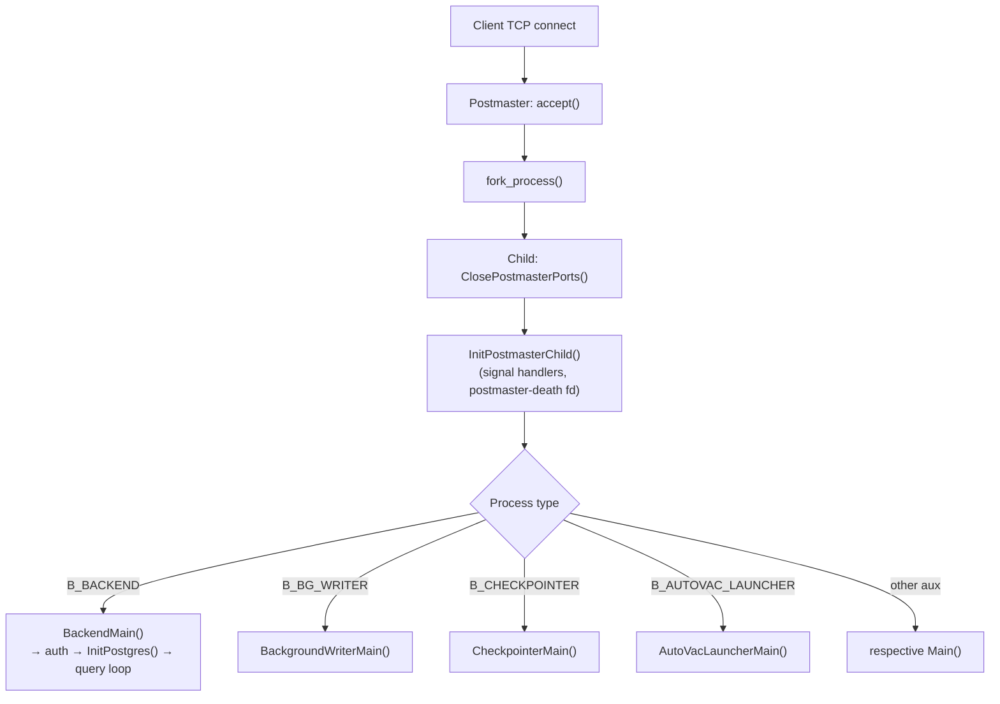

Every PostgreSQL client connection spawns a dedicated OS process. When the postmaster accepts a new connection, it calls `fork(2)` immediately — before authentication, before protocol negotiation. The resulting child becomes the backend that serves that session for its entire lifetime. This design makes each connection's cost explicit and predictable. It shapes how connection pools interact with the server. It is also why PostgreSQL behaves fundamentally differently from threaded application servers.

## The fork path

The low-level fork primitive is `fork_process()` (fork_process.c). It is a thin wrapper around `fork(2)` that does three things beyond the bare system call. First, it flushes stdio channels beforehand to avoid double-output from buffered writes. Second, it blocks all signals before calling `fork()`, so the child can install its own handlers before any signal arrives. Third, on Linux, it resets the child's OOM score adjustment via the `PG_OOM_ADJUST_FILE` environment variable. The init script typically lowers the postmaster's OOM score so the kernel protects it. Resetting the score in each child means backends do not automatically get the same protection.

Starting with PostgreSQL 17, this dispatch logic — which chooses which kind of child to start — moved out of postmaster.c into a dedicated file, `launch_backend.c`. The central function is `postmaster_child_launch()`, which accepts a `BackendType` enum value and an optional `client_sock`. It calls `fork_process()`, and in the child branch it immediately:

1. Calls `ClosePostmasterPorts()` to close all listening sockets the postmaster inherited. The syslogger is the only child that keeps the syslog pipe read-end open. All others close it.
2. Calls `InitPostmasterChild()` to detangle from the postmaster. This installs the child's signal handlers, resets the random-number state, and sets up the mechanism the child uses to detect that the postmaster has died.
3. Detaches from shared memory (`dsm_detach_all()` + `PGSharedMemoryDetach()`) if the child type does not need it — the syslogger falls into this category.
4. Switches the active [[subsystems/memory/contexts|memory context]] to `TopMemoryContext`.
5. Dispatches to the appropriate `main_fn` via the `child_process_kinds[]` table.

In PG16 and earlier this same dispatch logic lives inline in postmaster.c, spread across several helper functions (`BackendStartup()`, `StartChildProcess()`, `StartAutovacuumWorker()`, etc.). The behaviour is equivalent. PG17 consolidated it for clarity and to make it easier to add new process kinds.

The `child_process_kinds[]` table (launch_backend.c) maps each `BackendType` constant to a name string, an entry-point function pointer, and a boolean indicating whether shared memory should be attached:

| BackendType | Entry point | Needs shmem |
|---|---|---|
| `B_BACKEND` | `BackendMain` | yes |
| `B_AUTOVAC_LAUNCHER` | `AutoVacLauncherMain` | yes |
| `B_AUTOVAC_WORKER` | `AutoVacWorkerMain` | yes |
| `B_BG_WORKER` | `BackgroundWorkerMain` | yes |
| `B_WAL_SENDER` | (becomes backend first) | yes |
| `B_BG_WRITER` | `BackgroundWriterMain` | yes |
| `B_CHECKPOINTER` | `CheckpointerMain` | yes |
| `B_WAL_WRITER` | `WalWriterMain` | yes |
| `B_ARCHIVER` | `PgArchiverMain` | yes |
| `B_LOGGER` | `SysLoggerMain` | no |

WAL senders are not launched directly. A connection that turns out to be a replication connection starts life as a regular `B_BACKEND`. The postmaster relabels it to `B_WAL_SENDER` after authentication.

## Post-fork initialisation in the child

The steps that happen after `fork()` but before the child reaches its main query loop are sometimes called the "post-fork init" path. For a regular client backend the sequence runs through `BackendMain()` (tcop/backend_startup.c) and covers:

- **File descriptor cleanup** — `ClosePostmasterPorts()` closes every socket the postmaster had open for accepting connections. Without this step, the child would hold extra references to those sockets, preventing clean shutdown.
- **Signal handler installation** — the child installs its own set of handlers (SIGTERM for clean exit, SIGQUIT for immediate exit via `quickdie()`, SIGHUP for config reload, SIGINT for query cancel). The handlers differ materially from the postmaster's.
- **[[subsystems/memory/contexts|Memory context]] hierarchy** — the child calls `MemoryContextSwitchTo(TopMemoryContext)` immediately after fork. `InitPostgres()` builds the full backend context tree (`MessageContext`, `PortalContext`, `TransactionContext`, etc.).
- **PGPROC slot acquisition** — `InitProcess()` claims a slot in the shared `PGPROC` array, which is how other backends and the lock manager can identify this backend.
- **Authentication** — `BackendInitialize()` reads the startup packet, negotiates SSL if needed, and runs `ClientAuthentication()`. Only after successful authentication does the child call `InitPostgres()` to finish database-specific setup.

The entire path from `accept()` in the postmaster to the child entering its query loop typically takes 5–15 ms on a lightly loaded Linux system. `InitPostgres()` spends most of that time loading catalog caches, not the fork itself.

## The EXEC_BACKEND path (Windows and testing)

On Unix, `fork()` gives the child a copy-on-write image of the postmaster's address space, so all global variables and shared-memory pointers are automatically correct in the child. On Windows there is no `fork()`, so PostgreSQL falls back to `CreateProcess()` followed by a parameter-passing mechanism. This code path is also compilable on Linux via `-DEXEC_BACKEND` for testing.

In `EXEC_BACKEND` mode, `postmaster_child_launch()` calls `internal_forkexec()` instead of `fork_process()`. This function serialises all critical postmaster state — shared-memory segment addresses, GUC values, socket handles, cancel keys — into a `BackendParameters` struct written to a temporary file (or a Windows shared-memory handle). The child process re-execs the `postgres` binary with a `--forkchild=<kind>` argument and reaches `SubPostmasterMain()` (launch_backend.c). There, it reads the parameter file and calls `PGSharedMemoryReAttach()` to map the segment at the same address. It then reloads GUC variables and dispatches to the same `main_fn` as in the fork path.

## Auxiliary processes

Not all PostgreSQL processes exist to serve client connections. The postmaster starts the [[subsystems/background/bgwriter|bgwriter]], checkpointer, WAL writer, [[subsystems/background/autovacuum|autovacuum]] launcher, archiver, WAL receiver, and syslogger at cluster startup. These processes run continuously in the background. They all go through the same `fork_process()` → `ClosePostmasterPorts()` → `InitPostmasterChild()` path as backends.

In PG16, these processes diverge at `AuxiliaryProcessMain()` (auxprocess.c), which accepts an `AuxProcType` enum and dispatches to the correct main loop. In PG17, the postmaster launches them directly via `postmaster_child_launch()` using distinct `BackendType` values. `AuxiliaryProcessMain()` survives only for the `AuxProcType`-to-`BackendType` mapping it performs at entry.

Auxiliary processes share `PGPROC` slots with backends — they need them to participate in [[subsystems/locking/lwlocks|LWLock]] acquisition and lock-manager operations — but PostgreSQL allocates their slots from a separate region of the `PGPROC` array. The slot index is `MaxBackends + AuxProcType + 1`, as noted in `AuxiliaryProcessMain()`. They acquire a [[subsystems/memory/resource-owner|ResourceOwner]] via `CreateAuxProcessResourceOwner()` to manage buffer pins held outside of transactions.

The postmaster starts auxiliary processes at fixed times:
- Syslogger: before any other child, so that early error messages are captured.
- Startup process: immediately after the syslogger, to replay WAL if needed.
- Checkpointer, bgwriter, WAL writer: once the startup process confirms the cluster is ready.
- Autovacuum launcher: once `PM_RUN` is reached.
- Archiver: when `archive_mode` is enabled.

If an auxiliary process exits unexpectedly, the postmaster notices via `SIGCHLD`. It reaps the process with `waitpid()` and restarts it. A crash of any auxiliary process triggers `HandleChildCrash()`, which sends `SIGQUIT` to all other children on the assumption that shared memory may be corrupted.

## The no-preforking design and its implications

PostgreSQL does not maintain a pool of pre-forked idle backends waiting to accept work. Each incoming connection causes the postmaster to call `fork()` from scratch. On Linux this is cheap. Because the child inherits the postmaster's virtual address space via copy-on-write page table entries, `fork()` itself completes in microseconds, regardless of how large the postmaster's private working set is. The cost is in post-fork initialisation — signal setup, PGPROC acquisition, authentication, catalog cache loading — which adds several milliseconds.

The more significant cost is ongoing: every idle backend occupies memory. The backend's private stack and local allocations consume physical pages. It also holds a `PGPROC` slot and counts against `max_connections`. It participates in snapshot overhead: every transaction must scan the entire `PGPROC` array to compute its visibility snapshot. As a result, a cluster with 500 idle backends pays a snapshot-generation cost proportional to 500, even when only 5 are active.

These costs are why connection poolers — PgBouncer operating in transaction-pooling mode being the canonical example — exist. A pooler multiplexes many client connections onto a small number of server-side backends, keeping the backend count well below `max_connections`. The practical rule of thumb is that active backends (those actually executing queries) should not exceed roughly two per CPU core. Idle backends beyond that limit add snapshot overhead without contributing throughput.

The `max_connections` setting gates `PGPROC` array size, which is allocated at startup and cannot be changed without a restart. Setting it too low prevents legitimate connections. Setting it too high wastes shared memory and snapshot overhead. Each backend consumes approximately `work_mem` (see [[subsystems/executor/work-mem-and-spill]]) in the worst case for sort and hash operations, plus a baseline of several hundred kilobytes for the process stack and local memory contexts.

## Related Topics

- [[architecture/process-architecture]] — the broader PostgreSQL process model, postmaster state machine, and signal coordination
- [[architecture/backend-initialization]] — detail on what happens inside `BackendMain()` through `InitPostgres()`
- [[architecture/connection-pooling-impact]] — how connection pool sizing interacts with backend overhead
- [[subsystems/memory/contexts]] — the memory context hierarchy each backend builds during initialisation
- [[subsystems/background/autovacuum]] — how the autovacuum launcher spawns worker backends
- [[subsystems/executor/work-mem-and-spill]] — per-backend memory that scales with active query count
