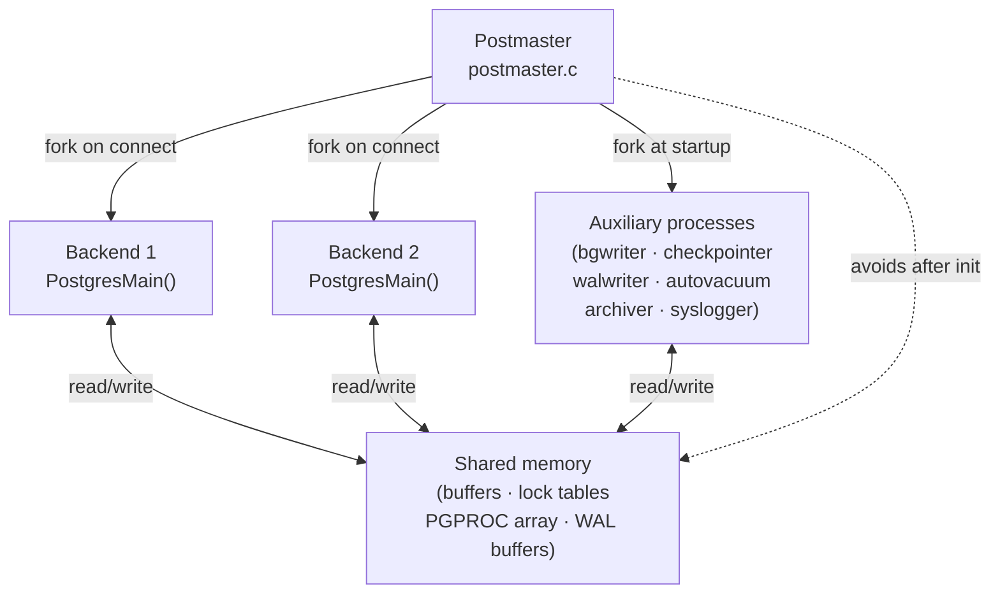
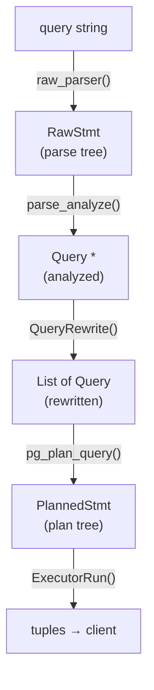

# Architecture Overview

PostgreSQL is a multi-process relational database. A single supervisor process (the postmaster) listens for connections and forks a dedicated backend process for each client. There are no threads — every backend runs alone in its address space, sharing state with peers only through a fixed shared-memory segment. This model trades some memory overhead for a high degree of isolation: a crash in one backend cannot corrupt another's in-memory state.

## Process model



### Postmaster

The postmaster is the root of the process tree. It allocates shared memory, sets up signal handlers, and then enters a connection-accept loop. When a client connects, the postmaster forks a new backend process. The backend process reads the startup packet, claims a `PGPROC` slot in shared memory, and hands off to the backend main loop (`PostmasterMain()` and `BackendStartup()`, `postmaster.c`).

After the initial allocation, the postmaster deliberately avoids touching shared memory. If the postmaster itself were to corrupt shared state, no new backends could start. Keeping it at arm's length from shared memory makes the postmaster crash-safe: only backends and auxiliary processes manipulate shared state.

The postmaster tracks its own lifecycle through a state machine (`PMState` enum, `postmaster.c`):

```
PM_INIT → PM_STARTUP → PM_RECOVERY → PM_HOT_STANDBY → PM_RUN
  → PM_STOP_BACKENDS → PM_WAIT_BACKENDS → PM_SHUTDOWN → PM_SHUTDOWN_2
  → PM_WAIT_DEAD_END → PM_NO_CHILDREN
```

### Backend main loop

Each backend runs an event loop that reads one client message at a time, processes it, and loops (`PostgresMain()`, `src/backend/tcop/postgres.c`). `PostgresMain()` wraps the loop in a `sigsetjmp`/`longjmp` recovery point, so any error thrown anywhere in the call stack — via `elog(ERROR, …)` — unwinds directly back to the top. This means lower-level code never needs to clean up partial state on error. The longjmp unwinds back to the event loop. The event loop resets the per-message [[subsystems/memory/contexts|memory context]] and transaction state before reading the next command.

Message types map to handlers:

| Wire byte | Protocol message | Handler |
|---|---|---|
| `Q` | Simple query | `exec_simple_query()` |
| `P` | Parse (extended protocol) | `exec_parse_message()` |
| `B` | Bind | `exec_bind_message()` |
| `E` | Execute | `exec_execute_message()` |
| `C` | Close | `exec_close_message()` |
| `S` | Sync | transaction boundary |

### Auxiliary processes

The postmaster launches several auxiliary processes at startup. They share the same shared-memory segment as backends. Each has its own purpose-built main loop:

| Process | Responsibility |
|---|---|
| [[subsystems/background/bgwriter|bgwriter]] | Proactively flushes dirty shared buffers to disk to reduce backend I/O stalls |
| checkpointer | Periodically writes a consistent checkpoint; limits WAL replay time on crash recovery |
| walwriter | Flushes WAL buffers to disk to meet commit durability guarantees |
| [[subsystems/background/autovacuum|autovacuum]] launcher | Schedules autovacuum worker processes per-database |
| archiver | Copies completed WAL segments to the archive location |
| syslogger | Collects stderr from all processes and writes to the log file |

## Shared memory

The postmaster allocates shared memory once before any fork. It computes the size from GUC parameters (`shared_buffers`, `max_connections`, `max_locks_per_transaction`, etc.). The size cannot change without a restart.

The major occupants:

| Area | Purpose |
|---|---|
| Buffer pool | `NBuffers` 8KB pages (controlled by `shared_buffers`) |
| `PGPROC` array | One entry per possible backend/worker; holds per-process transaction state |
| Lock tables | Partitioned hash table of granted and waiting locks |
| WAL buffers | Ring buffer of WAL records awaiting flush |
| ProcSignal array | Per-backend signal flags (cache invalidation, cancel, etc.) |
| Commit log ([[subsystems/storage/clog|clog]]) | Bitmap recording committed/aborted status of every transaction ID |

### PGPROC

`PGPROC` (`src/include/storage/proc.h`) is the shared-memory record for one backend. Other backends read it to determine visibility (via `xmin` and `xid`), to detect deadlocks (via `waitLock`), and to send cache-invalidation signals. Key fields:

| Field | Purpose |
|---|---|
| `xid` | Current top-level transaction ID (0 if idle or read-only) |
| `xmin` | Oldest XID that this backend's snapshot could see |
| `lxid` | Local transaction ID (unique within backend; not global) |
| `waitLock` | Lock this process is blocked on (for deadlock detection) |
| `heldLocks` | Bitmask of lock modes currently held |
| `fpRelId[]` | Fast-path lock slots — weak relation locks stored here bypass the main lock table |
| `sem` | Semaphore used to sleep/wake this backend |

All `PGPROC` entries live in `ProcGlobal->allProcs` (`src/include/storage/proc.h`). PostgreSQL mirrors hot fields like `xids` and `subxidStates` in dense arrays alongside `allProcs` to improve cache locality during snapshot computation. Snapshot computation iterates over every active backend.

## Memory management

PostgreSQL does not call `malloc`/`free` directly. Instead, all allocations go through a hierarchy of *memory contexts* (`src/backend/utils/mmgr/mcxt.c`). A context is a named arena. `palloc()` allocates within `CurrentMemoryContext`. PostgreSQL almost always frees memory by resetting or deleting a context rather than freeing individual objects.

The standard context hierarchy in a backend:

```
TopMemoryContext          (process lifetime)
  ├── CacheMemoryContext  (relcache, syscache — query-independent)
  ├── TopTransactionContext
  │     └── CurTransactionContext  (current statement)
  │           └── MessageContext   (per-message scratch space)
  └── PortalContext        (per-portal execution state)
        └── es_query_cxt   (per-query executor allocations)
```

`MemoryContextReset()` clears all allocations in a context and its children without destroying the context itself — used after each message to reclaim `MessageContext` scratch space. `MemoryContextDelete()` destroys the context and all children — used when a portal is dropped. The tree structure means that forgetting to free an individual object is usually harmless: it gets reclaimed when its owning context is reset.

Three allocator implementations handle different access patterns:
- **AllocSet** — general purpose; maintains free lists by size class.
- **Generation** — bump allocator; resets an entire generation at once (used for short-lived batches).
- **Slab** — fixed-size chunks; zero-copy reuse (used for executor tuple slots).

## Lock manager

PostgreSQL has four lock granularities, used at different layers:

| Granularity | Implementation | Scale |
|---|---|---|
| Spinlock | CPU atomic op, busy-wait | Nanoseconds; no deadlock detection |
| Lightweight lock ([[subsystems/locking/lwlocks|LWLock]]) | Shared-memory semaphore, shared+exclusive | Microseconds; protects in-memory structures |
| Heavyweight (regular) lock | Full lock manager with deadlock detection | Milliseconds; relation/row/advisory granularity |
| Predicate lock | SSI (`predicate.c`) | Transaction lifetime; tracks read/write dependencies |

The heavyweight lock manager (`src/backend/storage/lmgr/lock.c`) stores locks in a partitioned hash table — `NUM_LOCK_PARTITIONS` independent partitions each protected by its own LWLock. This eliminates the global `LockMgrLock` bottleneck that would otherwise serialise every lock acquisition. Deadlock detection locks all partitions in order when it needs a consistent view.

**Fast-path locking**: PostgreSQL stores weak relation locks (AccessShare, RowShare, RowExclusive) directly in `PGPROC.fpRelId[]` (16 slots per backend) rather than in the main hash table. A 1024-entry counter array tracks whether any strong lock conflicts with any fast-path entry. This brings the common case (read a table) to near-zero overhead.

## Buffer manager

The buffer pool is a fixed array of `NBuffers` 8KB pages in shared memory (`src/backend/storage/buffer/bufmgr.c`). Every access to a heap or index page goes through the buffer manager, which enforces a pin-then-lock discipline. The buffer manager first pins a page to prevent eviction, then locks it for the actual read or write, then unlocks and unpins it in reverse order (`ReadBuffer()`, `LockBuffer()`, `ReleaseBuffer()`). Pinning increments a reference count. While a page's reference count is nonzero, the clock-sweep eviction algorithm cannot select it as a victim.

When no free buffer is available, the clock-sweep algorithm selects a victim. It circularly scans `BufferDesc` entries, decrementing a usage counter on each pass. It evicts the first unpinned entry with a zero counter. It writes dirty victims to disk before eviction.

Sequential scans and VACUUM use *buffer rings* — small private pools of buffers that cycle without polluting the main cache. A sequential scan of a large table uses a 256KB ring. This ring cannot evict working data that fits in `shared_buffers`.

## Query pipeline

A query string passes through five stages before the executor runs it. Each stage produces a progressively more resolved data structure. The [[code-paths/simple-select]] page traces this pipeline in detail; the summary:



- **Parse** — Flex/Bison grammar; no catalog access; produces a `RawStmt`.
- **Analyze** — resolves names, expands `*`, resolves operators; produces a `Query`.
- **Rewrite** — expands views and row-security rules via the rule system; may produce multiple `Query` nodes.
- **Plan** — enumerates access paths, estimates costs via statistics, selects cheapest plan; produces a `PlannedStmt`.
- **Execute** — [[subsystems/executor/overview|Executor]] drives the plan tree in Volcano pull fashion.

## Transaction and visibility

PostgreSQL assigns every mutating transaction a `TransactionId` (XID). The commit log (clog, `src/backend/access/transam/clog.c`) records committed and aborted XIDs. It is a bitmap in shared memory (and on disk) indexed by XID.

PostgreSQL determines visibility per-tuple by comparing the tuple's `xmin` (inserting transaction) and `xmax` (deleting transaction) against a snapshot. A snapshot captures `xmax` (next XID to be assigned), `xmin` (oldest active XID), and the list of currently active XIDs at snapshot time. A tuple is visible if its inserter committed before the snapshot was taken and its deleter either hasn't committed or committed after.

Isolation levels determine when snapshots are taken:
- **Read Committed** — new snapshot per statement; sees other transactions' commits mid-query.
- **Repeatable Read** — snapshot at first statement of the transaction; consistent throughout.
- **Serializable** — adds predicate locks (`src/backend/storage/lmgr/predicate.c`) to detect serialisation anomalies.

## WAL

Write-ahead logging (`src/backend/access/transam/xlog.c`) ensures durability without synchronous page writes on every change. Before modifying a heap or index page, the backend writes a WAL record describing the change. The page itself may remain dirty in shared buffers for a long time. On crash, recovery replays WAL records from the last checkpoint forward to reconstruct any pages not yet flushed.

WAL also underpins streaming replication (standbys replay the same record stream) and logical decoding (logical replication decodes WAL records into SQL-level change events).

## See also

- [[code-paths/simple-select]] — traces a query end-to-end through the pipeline
- [[subsystems/executor/overview]] — executor internals in depth
