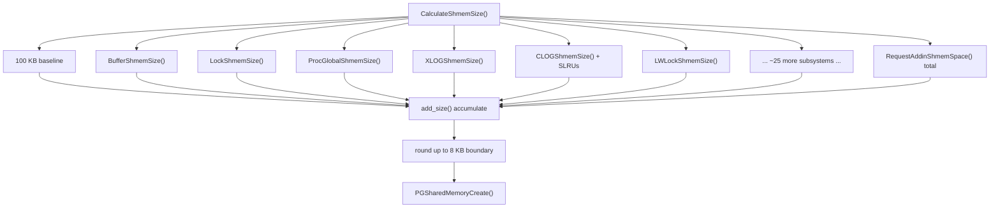

# Shared Memory Architecture

PostgreSQL is a multi-process, not a multi-threaded, server. The postmaster forks a separate backend process for every client connection. Auxiliary processes (checkpointer, background writer, WAL writer, [[subsystems/background/autovacuum|autovacuum]] workers, WAL senders) are also distinct OS processes. Separate processes do not share an address space by default, so PostgreSQL relies on a single region of operating-system shared memory as the common backbone that all processes read and write.

Three requirements make shared memory unavoidable in PostgreSQL's architecture:

1. **Shared buffer pool** — Pages read from disk must be reusable across backends without copying. Placing the buffer pool in shared memory means one backend's I/O directly benefits all others.
2. **Lock coordination** — Heavyweight locks, lightweight locks, and spinlocks must be visible to every process simultaneously. Lock tables, wait queues, and [[subsystems/locking/lwlocks|LWLock]] arrays all live in shared memory.
3. **Transaction state** — `ProcArray`, `pg_xact` SLRU caches, and WAL buffers must be globally consistent across all backends without any message-passing overhead on the critical path.

Without shared memory, every buffer read would require cross-process IPC, making an in-memory cache impractical.

## The single fixed segment

The postmaster creates exactly one shared memory segment at startup via `CreateSharedMemoryAndSemaphores()` (`src/backend/storage/ipc/ipci.c`). `CalculateShmemSize()` computes its total size before allocation, summing the `*ShmemSize()` contributions from every subsystem. The postmaster allocates the segment once and never resizes or frees it while the cluster is running.

After `fork()`, each child backend inherits the virtual address mapping. PostgreSQL requires every process to map the segment at the **same virtual address** so that C pointers inside the segment remain valid across process boundaries without offset translation.

```
Postmaster
  │
  ├── fork() ──► Backend 1   ─┐
  ├── fork() ──► Backend 2   ─┤─── all map shared memory at same address
  ├── fork() ──► Checkpointer ┤
  └── fork() ──► BGWriter    ─┘
```

## Sizing: how CalculateShmemSize works

Before allocating anything, the postmaster needs to know the total size of the segment. `CalculateShmemSize()` computes this by calling a dedicated `*ShmemSize()` function from every subsystem that needs shared memory. It then accumulates the results with `add_size()`. `add_size()` saturates at `SIZE_MAX` rather than wrapping, preventing silent overflow (`src/backend/storage/ipc/ipci.c`).

`CalculateShmemSize()` calls the major contributors in order: semaphore bookkeeping, the `ShmemIndex` directory itself, DSM control state, the buffer pool (`BufferShmemSize()`), the lock table (`LockShmemSize()`), predicate lock state, the PGPROC array, WAL buffers, [[subsystems/storage/clog|CLOG]]/SLRU caches, the LWLock array, and a collection of smaller subsystems (autovacuum, replication slots, WAL senders/receivers, snapshot manager, async notify, stats, etc.). Each `*ShmemSize()` function knows its own requirements — typically proportional to GUC settings like `max_connections`, `max_locks_per_transaction`, or `shared_buffers`.

`CalculateShmemSize()` also adds a baseline of 100 KB unconditionally to cover small allocations too minor to estimate individually. Extensions loaded via `shared_preload_libraries` contribute through `RequestAddinShmemSpace()`, which accumulates their requests in a module-level total. This total is added in at the end. `CalculateShmemSize()` rounds the final result up to a multiple of 8 KB (a typical OS page) so that the segment boundary stays page-aligned.



The size calculation runs twice. `CreateSharedMemoryAndSemaphores()` calls `CalculateShmemSize()` once to actually allocate memory. `InitializeShmemGUCs()` calls it again to populate the `shared_memory_size` and `shared_memory_size_in_huge_pages` read-only GUCs, which expose the result to users.

## Segment layout and relative sizes

The segment is a single contiguous block. Its first few bytes are occupied by `PGShmemHeader` — a fixed-size struct containing the magic number, total size, the current free offset (the bump pointer), a pointer to the `ShmemIndex` hash table, and the handle for the DSM control segment (`src/include/storage/pg_shmem.h`). The bump allocator allocates everything else sequentially as each subsystem initialises.

The following diagram shows typical proportions for a server with a modest `shared_buffers` (e.g. 128 MB) and `max_connections = 100`. With large `shared_buffers`, the buffer pool dwarfs everything else. With default settings, the lock table and PGPROC array are more visible.

```mermaid
flowchart TD
    SEG["Shared Memory Segment"]
    SEG --> HDR["PGShmemHeader<br/>(magic, freeoffset, index ptr)"]
    SEG --> IDX["ShmemIndex hash table<br/>(directory of named regions)"]
    SEG --> LWL["LWLock array<br/>(hundreds of named locks)"]
    SEG --> BUF["Buffer pool: descriptors + 8 KB blocks<br/>(dominates at large shared_buffers)"]
    SEG --> WAL["WAL buffers<br/>(wal_buffers, default ~4 MB)"]
    SEG --> PROC["PGPROC array + ProcArray<br/>(one slot per max_connections)"]
    SEG --> LOCK["Lock table + Proclock table<br/>(max_locks_per_transaction × max_connections)"]
    SEG --> SLRU["SLRU caches: CLOG, CommitTS,<br/>SubTrans, MultiXact"]
    SEG --> SINVAL["Shared invalidation queue<br/>(SISeg)"]
    SEG --> MISC["Smaller regions: autovacuum,<br/>replication slots, stats, notify, ..."]
    SEG --> FREE["(unused space)"]
```



## Principal residents

| Region | Role |
|---|---|
| Buffer pool (descriptors + 8KB blocks) | The shared page cache; dominates memory for large `shared_buffers` |
| WAL buffers | Ring buffer for in-flight WAL records before flush |
| PGPROC array | Per-process state: XID, wait event, fast-path lock slots, latch |
| Lock table + Proclock table | Heavyweight lock grant/wait tracking |
| LWLock array | Lightweight locks protecting shared data structures |
| CLOG / SLRU caches | Recently-accessed transaction status pages |
| Shared invalidation queue (`SISeg`) | Cross-backend catalog cache invalidation messages |
| Background process control structs | State for autovacuum, checkpointer, WAL archiver, WAL senders |
| `ShmemIndex` | Directory of all named regions; supports `pg_shmem_allocations` view |

## Allocation model

A bump-pointer allocator (`ShmemAlloc`, `src/backend/storage/ipc/shmem.c`) dispenses all shared memory. There is no `free()` — allocations are permanent for the cluster lifetime. The allocator advances `ShmemSegHdr->freeoffset` by the requested size, rounded up to a cache-line boundary (`CACHELINEALIGN`). Cache-line alignment is deliberate: placing hot structures at cache-line boundaries prevents false sharing. False sharing would otherwise force cache coherency traffic between CPU cores that access different fields in the same line.

`ShmemInitStruct(name, size, &found)` registers named regions in the `ShmemIndex` hash table. If the region does not yet exist, `ShmemInitStruct` allocates space with `ShmemAlloc` and inserts a `ShmemIndexEnt` record — holding the name, pointer, requested size, and actual allocated size — into the index. Backends that join after the segment is created find existing entries (`*found = true`) and receive the same pointer without re-initialising the region. EXEC_BACKEND processes cannot inherit pointers via `fork()`. This mechanism lets them relocate every shared data structure by name at startup instead of relying on inherited virtual addresses.

## The ShmemIndex as a segment directory

`ShmemIndex` is a fixed-capacity hash table resident in shared memory. It maps string names (up to 48 characters, `SHMEM_INDEX_KEYSIZE`) to `ShmemIndexEnt` records. `InitShmemIndex()` (`shmem.c`) initialises it. Bootstrapping it is circular: the index must register itself through the very `ShmemInitStruct` call that it will later serve for every other subsystem's registration. See [[subsystems/storage/shared-memory|Shared Memory Layout]] for how that special case is resolved.

The hash table lives in shared memory. Its directory therefore cannot grow dynamically the way a process-local hash table can. A growing directory would require reallocation at a new address, which would invalidate all pointers held by other processes. The table is therefore sized conservatively at startup (`SHMEM_INDEX_SIZE = 64` buckets) and pre-allocated in full. The `ShmemInitHash` wrapper sets both `init_size` and `max_size` to the same value for the same reason: pre-allocating all buckets ensures no run-time shared-memory failures occur when entries are added.

`ShmemIndexLock` (an LWLock) serialises all accesses to `ShmemIndex`. The postmaster allocates `ShmemIndexLock` before it initialises `ShmemIndex`. This is why the postmaster calls `CreateLWLocks()` first in `CreateSharedMemoryAndSemaphores()`.

The `pg_shmem_allocations` view (`src/backend/storage/ipc/shmem.c`) is a SQL-level scan of this table: it iterates all `ShmemIndexEnt` entries, emits a synthetic `<anonymous>` row for space used before the first named allocation, and a `NULL`-name row for free (unallocated) space at the end of the segment.

## OS-level implementation and shared_memory_type

PostgreSQL abstracts the actual OS mechanism behind `PGSharedMemoryCreate()` (`src/backend/port/sysv_shmem.c`). The `shared_memory_type` GUC (`src/include/storage/pg_shmem.h`, `src/backend/utils/misc/guc_tables.c`) selects the implementation at postmaster startup:

| Value | Mechanism | Notes |
|---|---|---|
| `mmap` | Anonymous `mmap(MAP_SHARED | MAP_ANONYMOUS)` | Default on Linux/macOS in non-`EXEC_BACKEND` builds; avoids SysV resource limits |
| `sysv` | `shmget` / `shmat` | Required for `EXEC_BACKEND`; subject to kernel limits (`SHMMAX`, `SHMALL`) |
| `windows` | `CreateFileMapping` | Windows only |

PostgreSQL introduced the `mmap` default in version 9.3 to work around the low `SHMMAX` kernel limits that were common on many Linux distributions. Because the `mmap` variant is anonymous and file-backed by nothing, it is not subject to the SysV resource accounting. PostgreSQL still creates a tiny SysV segment even in `mmap` mode — not to hold data, but as an interlock. It lets a restarting postmaster detect whether a previous instance is still alive by checking the SysV segment's attach count. Anonymous `mmap` has no equivalent to this attach count.

### Huge pages

On Linux, PostgreSQL can back the shared memory segment with huge pages (typically 2 MB rather than 4 KB) using the `MAP_HUGETLB` flag. The `huge_pages` GUC controls this behavior (`try` by default; see [[subsystems/storage/shared-memory|Shared Memory Layout]] for the full `try`/`on`/`off` behavior). Huge pages reduce TLB pressure on the shared memory segment. This matters most when backends are doing a high rate of random buffer pool accesses. The benefit is measurable on systems with large `shared_buffers` (tens of gigabytes).

The Linux kernel pre-allocates huge pages from a reserved pool set by `vm.nr_hugepages`. PostgreSQL reads `/proc/meminfo` at startup to discover the system's configured huge page size (`Hugepagesize`), then rounds the segment allocation up to a multiple of that size (since `mmap` with `MAP_HUGETLB` requires length to be a hugepage multiple on some kernel versions). The `shared_memory_size_in_huge_pages` read-only GUC (PG 15+) reports how many huge pages are needed, making it straightforward to compute the correct value for `vm.nr_hugepages`:

```sql
-- How many huge pages does this cluster need?
SHOW shared_memory_size_in_huge_pages;
```

A non-default huge page size (e.g., 1 GB pages on x86-64) can be requested via `huge_page_size` (PG 14+). The implementation encodes the size into the `MAP_HUGE_MASK`/`MAP_HUGE_SHIFT` bits of the `mmap` flags.

## Dynamic shared memory (DSM)

The main segment is fixed at startup. Parallel query workers need temporary cross-process memory (e.g. a shared hash table during a parallel hash join). DSM segments — created via `dsm_create()` and shared via a 32-bit handle — satisfy this need without growing the main segment. Each DSM segment is backed by `shm_open` (POSIX), `shmget` (System V), or anonymous `mmap`. It is destroyed when all processes detach from it.

The DSM control segment, whose handle is stored in `PGShmemHeader->dsm_control`, tracks all live DSM segments. Each entry has a reference count: 2+ means active, 1 means moribund (being destroyed), 0 means gone (`src/backend/storage/ipc/dsm.c`). Cleanup on process exit is automatic through resource owners. The postmaster also sweeps residual segments on restart after a crash.

## Observability

```sql
-- Inspect named regions and their sizes (PG 13+)
SELECT name, off, size, allocated_size
FROM pg_shmem_allocations
ORDER BY allocated_size DESC;
```

The `shared_memory_size` GUC reports the total segment size calculated at startup. `shared_memory_size_in_huge_pages` (PG 15+) reports how many huge pages the segment occupies, useful for sizing `vm.nr_hugepages` on Linux.

## See also

- [[architecture/overview]]
- [[architecture/process-architecture]]
- [[subsystems/storage/shared-memory]] — allocator internals, segment layout, DSM implementation details
- [[subsystems/storage/buffer-manager]] — buffer pool structure and pin/lock protocol
- [[subsystems/locking/overview]] — lock table layout in shared memory
- [[subsystems/transactions/transaction-lifecycle]] — PGPROC and ProcArray usage
