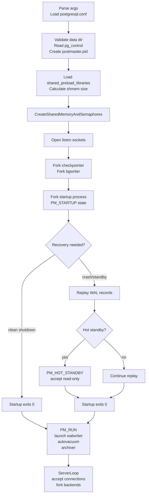
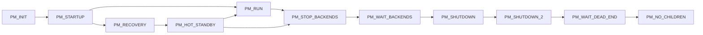

# Startup Sequence

Bringing a PostgreSQL cluster from a cold binary to a state where it can serve queries involves several coordinated phases: validating the data directory, allocating shared memory, replaying any outstanding WAL, launching a constellation of background processes, and finally opening the accept loop for client connections. Each phase has a clear design rationale. Each piece of state established in one phase is deliberately inherited by the next.

## The postmaster as supervisor

The postmaster (`PostmasterMain()`, postmaster.c) is the root of the entire process tree. It is not a query engine — it never touches a table, never runs a transaction, and deliberately avoids touching the shared memory it creates. The header comment in postmaster.c captures this design principle directly: the postmaster is almost always able to recover from crashes of individual backends by resetting shared memory. If it did much with shared memory, it would be prone to crashing along with the backends.

This hands-off stance is what makes the postmaster reliable enough to serve as the supervisor of everything else. If it held locks, owned transactions, or had deep state in the shared buffer pool, a cascading crash would be far more dangerous. By staying out of shared memory, it can tear down a failed cluster, reinitialise memory, and restart in a known-good state.

## Startup phases overview

## Configuration loading and data directory validation

The first thing the postmaster does after parsing command-line flags is call `SelectConfigFiles()` to locate and read `postgresql.conf`. The postmaster applies GUC (Grand Unified Configuration) parameters at this point. This establishes limits that cannot change while the server is running: `max_connections`, `shared_buffers`, `wal_level`, and many others. The postmaster computes parameters that depend on the size of shared memory — such as `shared_memory_size` — as runtime-derived GUCs. It prints them only after the segment is allocated.

After reading configuration, the postmaster validates the data directory (`checkDataDir()`) and checks that `global/pg_control` exists (`checkControlFile()`). The postmaster does not attempt to parse pg_control in detail at this point. That work is deferred to `LocalProcessControlFile()`, which reads and CRC-verifies the control file shortly before lock file creation.

`CreateDataDirLockFile()` then writes `postmaster.pid` into the data directory. This file records the postmaster's PID, the port number, the data directory path, and (later) the listen addresses. Its presence is the primary guard against accidentally starting two postmaster processes against the same data directory. The postmaster periodically re-checks that the file still exists and still refers to its own PID. If the file disappears, the postmaster forces an immediate shutdown. The file is the authoritative channel through which `pg_ctl` determines whether a server is running and what state it is in (`PM_STATUS_STARTING`, `PM_STATUS_READY`, `PM_STATUS_STOPPING`, etc.).

Before opening network sockets, `process_shared_preload_libraries()` loads any extensions listed in `shared_preload_libraries`. Extensions that need shared memory must call `RequestAddinShmemSpace()` during their `_PG_init` hook, which accumulates the requested bytes in `total_addin_request` (ipci.c). After all libraries have loaded, `process_shmem_requests()` allows them to register their sizes. `InitializeMaxBackends()` then finalises the maximum number of backend slots.

## Shared memory allocation

Once the required sizes are known, `CreateSharedMemoryAndSemaphores()` (ipci.c) allocates the shared memory segment. `CalculateShmemSize()` sums contributions from every subsystem — buffer pool, WAL buffers, [[subsystems/storage/clog|CLOG]], lock tables, procarray, [[subsystems/locking/lwlocks|LWLock]] array, replication slots, [[subsystems/background/autovacuum|autovacuum]] state, background worker registry, stats, and the add-in request total — and rounds up to a page boundary. `CreateSharedMemoryAndSemaphores()` passes the result to `PGSharedMemoryCreate()`, which allocates the segment in one shot.

On Linux and other POSIX platforms without `EXEC_BACKEND`, the default mechanism is an anonymous `mmap` (`SHMEM_TYPE_MMAP`, defined in pg_shmem.h). The segment has no name in the filesystem and no SysV key. Child processes inherit the mapping through `fork()` automatically, because the mapping is established before any forking occurs. Older builds and Windows use SysV `shmget` or a Windows named mapping respectively. The semantics seen by the rest of the server are identical.

The layout of the segment is fixed at startup. `InitShmemAllocation()` sets up a bump-pointer allocator. Each subsystem then calls `InitShmemIndex()`, `XLOGShmemInit()`, `InitBufferPool()`, `InitLocks()`, `InitProcGlobal()`, and so on, in a specific order that respects dependencies (LWLocks before everything else, the procarray after the global proc structure, etc.). No allocation is freed or recycled during the server's lifetime. The segment is destroyed only when the postmaster exits.

Extensions that registered space during `shared_preload_libraries` loading can initialise their regions through `shmem_startup_hook` at the end of `CreateSharedMemoryAndSemaphores()`.

## The control file and recovery mode determination

`pg_control` (stored as `global/pg_control` in the data directory) is a small binary file that records the cluster's system identifier, the location of the latest checkpoint, and WAL parameters. It also stores a `dbState` field. This field encodes what the cluster was doing when it was last written. The startup process (`StartupXLOG()`, xlog.c) reads and acts on this state as its first step.

The possible states are:

| State | Meaning |
|---|---|
| `DB_SHUTDOWNED` | Clean shutdown; no WAL replay required |
| `DB_SHUTDOWNED_IN_RECOVERY` | Shut down during standby replay |
| `DB_SHUTDOWNING` | Shutdown was interrupted |
| `DB_IN_CRASH_RECOVERY` | Crash recovery in progress (possibly stale) |
| `DB_IN_ARCHIVE_RECOVERY` | Archive recovery in progress |
| `DB_IN_PRODUCTION` | Was running normally when disrupted |

Any state other than `DB_SHUTDOWNED` or `DB_SHUTDOWNED_IN_RECOVERY` implies that WAL must be replayed before the database can be opened for writes. The control file is the canonical reference for where replay should start (the latest checkpoint LSN) and how far it must go (`minRecoveryPoint` in archive recovery scenarios).

## The startup subprocess

Rather than handling WAL recovery in the postmaster itself, PostgreSQL delegates it to a dedicated startup process. The postmaster forks this child (`StartupDataBase()`, postmaster.c) and enters `PM_STARTUP` state. In this state, the postmaster starts accepting connections only for the purpose of sending rejection messages — no real backends are launched yet.

The startup process runs `StartupXLOG()` (xlog.c), which:

1. Reads the control file and determines the recovery mode.
2. If a crash or archive recovery is needed, calls `PerformWalRecovery()`, which applies WAL records one by one from the last checkpoint forward.
3. On a crash recovery, the startup process works through `pg_wal` applying records until it reaches the end of available WAL, then calls `FinishWalRecovery()`, writes a new checkpoint, updates the control file to `DB_IN_PRODUCTION`, and exits with status 0.
4. For archive recovery (pitr or standby), the process continues fetching WAL from the archive or a streaming replication connection until it reaches the recovery target.

Notably, the postmaster forks the checkpointer and [[subsystems/background/bgwriter|bgwriter]] *before* the startup process, even while in `PM_STARTUP` state. This is intentional: both processes can assist with I/O during crash recovery (dirty buffer flushing, checkpoint writes), reducing the time before the cluster is usable.

### Hot standby and the consistency point

On a standby with `hot_standby = on`, the startup process does not simply replay WAL and exit. Instead, after WAL replay begins, it watches for a point where the database state is fully consistent. This means all active transactions at the time of the last checkpoint are accounted for. At that point it signals the postmaster via a `PMSignal`. The postmaster then transitions to `PM_HOT_STANDBY` state, which allows read-only query backends to be forked. The startup process then continues replaying WAL indefinitely in the background, applying changes to the buffer pool, keeping the standby current.

This design means that query backends and WAL replay coexist. The startup process holds no locks that block readers. Instead, it signals snapshot invalidation through the shared invalidation mechanism. Queries that conflict with recovery are either cancelled or made to wait. For instance, a query might need to read a page that recovery is about to reclaim with a vacuum operation. The `max_standby_streaming_delay` and `max_standby_archive_delay` settings control this behavior.

## Postmaster state machine

The postmaster's lifecycle is governed by a small state machine (`PMState`, postmaster.c):

`PM_RUN` is the normal steady state. The postmaster accepts connections and forks backends. `PM_HOT_STANDBY` is the standby equivalent. Transitions out of these states are triggered by shutdown signals or by a critical child process crashing.

## Background process launch sequence

When the startup process exits cleanly (transitioning the postmaster to `PM_RUN`), the postmaster launches the remaining background workers. The postmaster starts the walwriter (`StartWalWriter()`) because active WAL writing now begins. It starts the autovacuum launcher (`StartAutoVacLauncher()`) to manage table maintenance. It starts the archiver (`StartArchiver()`) if WAL archiving is enabled. It also launches any registered background workers whose `bgw_start_time` is `BgWorkerStart_RecoveryFinished`.

`ServerLoop()` (postmaster.c) continuously checks that each of these processes is alive and restarts them if they exit unexpectedly. The supervision is lightweight: the postmaster does not maintain timers or heartbeats. It simply checks at each iteration of the event loop whether a known PID is still present, and calls the appropriate `Start*` function if not.

## Connection handling and backend forking

The postmaster's event loop (`ServerLoop()`) waits on a `WaitEventSet` that includes both an internal latch (woken by signals) and each listen socket. When a client connects, `WL_SOCKET_ACCEPT` fires. The postmaster then calls `BackendStartup()`, which:

1. Allocates a `Backend` struct and assigns a `PMChildSlot` from the procarray's fixed-size slot array.
2. Calls `fork_process()` to create a child process.
3. In the parent: records the child's PID in `BackendList` and returns immediately to the accept loop.
4. In the child: calls `BackendInitialize()` then `BackendRun()`, which eventually calls `PostgresMain()`.

The parent never blocks waiting for the child to authenticate. This is intentional: a slow or misbehaving client cannot stall the postmaster from accepting other connections. The child process handles SSL negotiation, reads the startup packet, and performs authentication entirely on its own. If authentication fails, the child simply exits — no shared state needs to be cleaned up because the child has not yet joined the procarray or acquired any locks.

On Unix, the child inherits the shared memory mapping from `fork()` automatically. All pointers established during `CreateSharedMemoryAndSemaphores()` are valid in the child without any re-mapping. On Windows (built with `EXEC_BACKEND`), `fork()` is unavailable and the postmaster instead spawns a new `postgres.exe` process and serialises the necessary parameters — data directory, shared memory handle, socket handle — through a temporary file or pipe. The child then calls `read_backend_variables()` to reconstruct the state that a Unix child would have inherited.

## Crash recovery and process supervision

The postmaster collects child exit statuses via `waitpid()` and routes each one through `process_pm_child_exit()`, dispatching to `CleanupBackend()` for a normal exit (client disconnected, query completed, statement cancelled) or to `HandleChildCrash()` for an abnormal one. `HandleChildCrash()` sends `SIGQUIT` to every remaining child because a crashed backend may have left shared memory in an inconsistent state. See [[architecture/process-architecture|Process Architecture]] for the full reasoning behind that all-or-nothing response. Children that do not exit within 5 seconds are sent `SIGKILL`. Once all children have exited, the postmaster destroys and reinitialises the shared memory segment and restarts the startup subprocess described above to perform crash recovery.

Critical processes — bgwriter, checkpointer, walwriter, autovacuum launcher — trigger the same full-cluster restart as a backend crash. Individual autovacuum *workers* (as opposed to the launcher) are the exception: they can die without triggering a global restart, since the launcher simply spawns a replacement.

## Shutdown signals

PostgreSQL's three shutdown modes — smart, fast, and immediate — map to `SIGTERM`, `SIGINT`, and `SIGQUIT` sent to the postmaster. See [[architecture/process-architecture|Process Architecture]] for the signal table and what each mode does to running backends.

Within the running system, individual query cancellation is handled differently: `pg_cancel_backend()` sends `SIGINT` to the specific backend PID. The backend's signal handler converts this signal into an `ERROR` that unwinds the current query without affecting other sessions.

## Relationship to other articles

The process architecture choices described here underpin everything about how PostgreSQL manages concurrent access. The shared memory segment allocated during startup is described in more detail in [[architecture/shared-memory|Shared Memory]]. The WAL mechanics that the startup process replays are covered in the WAL articles. The fork-on-connect model and its implications for connection scaling are discussed in [[architecture/connection-pooling-impact|Connection Pooling Impact]].

## Related Topics

- [[architecture/process-architecture|Process Architecture]] — describes the overall postmaster/backend process model that the startup sequence brings to life.
- [[architecture/shared-memory|Shared Memory]] — covers the shared memory segment allocated during startup and the subsystems that carve it up.
- [[architecture/postmaster-child|Postmaster Child]] — details the lifecycle and supervision of child processes forked by the postmaster.
- [[subsystems/wal/recovery|WAL Recovery]] — explains how `StartupXLOG()` replays WAL records to restore a consistent database state.
- [[subsystems/wal/checkpoint|Checkpoint]] — describes the checkpoint process that bounds how much WAL must be replayed at startup.
- [[architecture/connection-pooling-impact|Connection Pooling Impact]] — discusses the implications of the fork-on-connect model established at the end of the startup sequence.
- [[subsystems/background/bgwriter|Background Writer]] — the bgwriter is forked before WAL recovery completes and assists with dirty-buffer flushing during startup.
