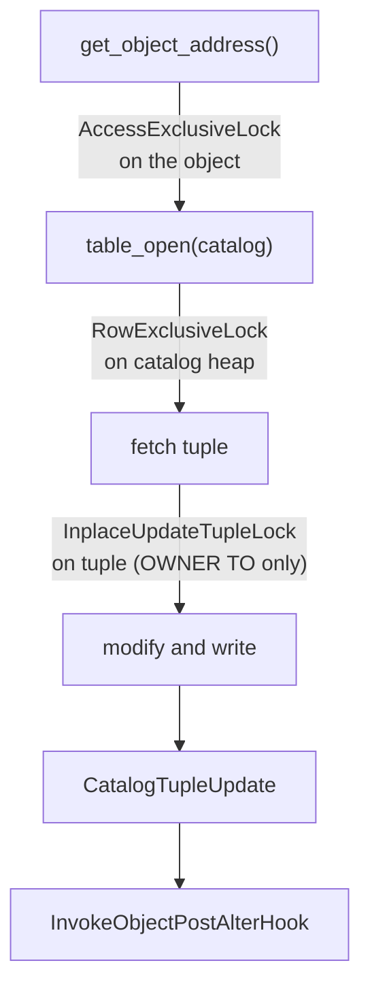

`src/backend/commands/alter.c` is the generic driver for three cross-cutting DDL operations — RENAME, SET SCHEMA, and OWNER TO — across almost every object type in PostgreSQL. It is explicitly not about ALTER TABLE. That command's complexity (column type changes, constraint validation, table rewrites) warrants its own file, `tablecmds.c`. That file is covered separately in [[code-paths/alter-table]]. Everything else — functions, operators, operator classes, collations, conversions, text search objects, subscriptions, publications, foreign data wrappers, and more — flows through the generic infrastructure here.

## Two-Tier Dispatch

Every entry point in `alter.c` (`ExecRenameStmt`, `ExecAlterObjectSchemaStmt`, `ExecAlterOwnerStmt`) follows the same pattern: a `switch` on the object type that routes to either a specialized handler or a generic internal engine.

The specialized handlers exist because some objects require more than a single catalog row update. Renaming a database, schema, or tablespace involves additional bookkeeping that the generic path cannot provide. Renaming a table, sequence, view, or index requires updating `pg_class` but also propagating through inheritance hierarchies and [[subsystems/storage/toast|toast]] table names. Those calls go to `RenameRelation()` in `tablecmds.c`. Types and domains carry their own array type. Ownership or namespace changes must also update the array type's catalog row, which is why they land in `typecmds.c`.

For all remaining objects — aggregates, functions, procedures, routines, collations, conversions, operator classes, operator families, statistic objects, text search configurations, parsers, dictionaries, templates, event triggers, foreign servers, foreign data wrappers, publications, and subscriptions — a single catalog row update suffices. These all go through the generic engines, which discover the relevant catalog and attribute numbers at runtime by consulting the `ObjectProperty[]` table in `objectaddress.c` (see [[subsystems/catalog/object-addressing]]).

The generic path is compact:

```c
address = get_object_address(stmt->renameType, stmt->object,
                             &relation, AccessExclusiveLock, false);
catalog = table_open(address.classId, RowExclusiveLock);
AlterObjectRename_internal(catalog, address.objectId, stmt->newname);
table_close(catalog, RowExclusiveLock);
```

`get_object_address()` resolves the name to an `ObjectAddress` and acquires `AccessExclusiveLock` on the object. `table_open()` then opens the catalog relation separately under `RowExclusiveLock`. These are two distinct lock subjects. The object lock prevents concurrent sessions from using the object while its metadata changes. The catalog lock serializes writes to the catalog heap itself.

## Rename

The generic rename engine (`AlterObjectRename_internal`) updates the name attribute of a single catalog tuple. It fetches the current tuple from the system cache, verifies that the caller is the object owner (or a superuser), checks that a duplicate name does not already exist in the target namespace, builds a modified tuple, and writes it back via `CatalogTupleUpdate`.

The duplicate-name check is a deliberate "friendliness check." Hitting a unique index violation produces an opaque constraint error. The pre-check instead produces a message that names the conflicting object. For most objects the check is a `SearchSysCacheExists` lookup. Several object types require special treatment because their uniqueness key is composite:

- **Functions and procedures**: uniqueness depends on name, argument types, and namespace. The check calls `IsThereFunctionInNamespace()`.
- **Collations**: `IsThereCollationInNamespace()` accounts for the collation's encoding.
- **Operator classes and families**: `IsThereOpClassInNamespace()` / `IsThereOpFamilyInNamespace()` incorporate the access method OID into the lookup.

Subscriptions receive additional treatment. The engine blocks a non-superuser from renaming a subscription when `subpasswordrequired = false`, because allowing an unprivileged user to rename such a subscription could facilitate a security bypass. After a successful rename, the engine calls `LogicalRepWorkersWakeupAtCommit()` so replication workers pick up the new name promptly.

For objects whose uniqueness is global — event triggers, foreign data wrappers, foreign servers, languages, publications, subscriptions — the duplicate check calls `report_name_conflict()`. For namespace-scoped objects it calls `report_namespace_conflict()`.

## Namespace Transfer (SET SCHEMA)

Moving an object to a different schema (`ALTER ... SET SCHEMA`) updates the namespace attribute of the catalog tuple and rewrites the object's namespace dependency in `pg_depend`. The generic engine (`AlterObjectNamespace_internal`) handles both steps atomically within the same transaction.

Before making any change, the engine checks:

1. `CheckSetNamespace()` validates that the destination is a legal target (e.g., objects cannot be moved into `pg_catalog`).
2. The caller must be the object owner and must hold `ACL_CREATE` on the destination namespace. Superusers bypass both checks.
3. A friendly duplicate-name check, following the same composite-key logic as the rename path.

If the object is already in the target schema, the engine fires the post-alter hook and returns immediately without writing any catalog row. This no-op path means that `ALTER FUNCTION f() SET SCHEMA current_schema` produces no catalog churn.

After updating the tuple's namespace attribute, the engine calls `changeDependencyFor(classId, objid, NamespaceRelationId, oldNspOid, nspOid)` to rewrite the `pg_depend` row. This row records which schema the object belongs to. This keeps the dependency graph consistent so that `DROP SCHEMA ... CASCADE` correctly reaches the moved object.

`AlterObjectNamespace_oid()` is the bulk variant used by `ALTER EXTENSION SET SCHEMA`. When an extension's schema changes, every member object must follow. This function iterates the extension's member list and dispatches each object to the appropriate handler: relations go to `AlterTableNamespaceInternal()`, types go to `AlterTypeNamespace_oid()`, and everything else goes through `AlterObjectNamespace_internal()`. The function silently skips object classes that cannot be schema-qualified — roles, databases, tablespaces, foreign data wrappers, foreign servers, event triggers, publications, subscriptions. These object classes are permitted to be extension members, but they have no schema to change.

## Ownership Transfer (OWNER TO)

Ownership changes (`AlterObjectOwner_internal`) require more caution than renames. The old owner's ACL entries must be rewritten. Concurrent sessions must not see a half-updated owner/ACL pair.

To prevent races, the engine uses `get_catalog_object_by_oid_extended(..., true)`. This function acquires `InplaceUpdateTupleLock` on the tuple before returning it. This is a third distinct lock subject on top of the object-level `AccessExclusiveLock` and catalog-level `RowExclusiveLock`. The in-place lock blocks any concurrent background process from modifying the tuple (notably, [[subsystems/background/autovacuum|autovacuum]] hint-bit updates) while the engine prepares the ownership update.

If the old and new owner are the same, the engine releases the in-place lock, fires the post-alter hook, and returns. No catalog write occurs.

When ownership genuinely changes, the engine enforces:

1. The caller must have the privileges of the current owner (`has_privs_of_role`).
2. The caller must be able to assume the new owner's role (`check_can_set_role`).
3. If the object is namespace-scoped, the new owner must have `ACL_CREATE` on the namespace.

After the permission checks, `aclnewowner()` rewrites any existing ACL on the object to replace references to the old owner with references to the new owner. This preserves equivalent access control for the new owner without requiring manual `GRANT` / `REVOKE` operations. The engine then writes the modified tuple, releases the in-place lock, and calls `changeDependencyOnOwner()` to update `pg_depend` / `pg_shdepend`.

Large objects complicate this flow because they use two catalog OIDs: `LargeObjectRelationId` for dependency and addressing purposes, and `LargeObjectMetadataRelationId` for the actual metadata row. The owner column lives in that metadata row. `ExecAlterOwnerStmt` remaps the class ID from the former to the latter before opening the catalog. `AlterObjectOwner_internal` remaps it back before calling `changeDependencyOnOwner` and firing the post-alter hook.

## Extension Dependencies (DEPENDS ON EXTENSION)

`ExecAlterObjectDependsStmt` implements `ALTER object DEPENDS ON EXTENSION ext` and its inverse. This command records a `DEPENDENCY_AUTO_EXTENSION` dependency from the object to the named extension in `pg_depend`.

`DEPENDENCY_AUTO_EXTENSION` is distinct from `DEPENDENCY_EXTENSION`. The latter means the extension created the object and fully owns it. The former means the user is explicitly opting in to automatic drop. If the extension is dropped and the object would be left dangling, it will be dropped automatically. The extension did not create the object, so there is no ownership transfer. There is only a drop-cascade agreement.

The permission model is intentionally asymmetric. The caller must own the object but need not hold any privilege on the extension. Allowing the extension owner to cascade-drop an object that the object's own owner opted in to is not considered a security concern.

When removing the dependency (`stmt->remove = true`), the engine calls `deleteDependencyRecordsForSpecific()` targeting only the `DEPENDENCY_AUTO_EXTENSION` row for that specific extension, leaving other dependencies intact. When adding, it first calls `getAutoExtensionsOfObject()` to check for existing auto-extension dependencies on the same extension and avoid inserting a duplicate row.

## Locking Summary



The three locks are held concurrently during the catalog update. `AccessExclusiveLock` on the object serializes against any session that looks up or uses the object. `RowExclusiveLock` on the catalog heap serializes against other DDL touching the same catalog. `InplaceUpdateTupleLock` on the individual tuple (ownership changes only) blocks in-place background modifications to that specific row.

## Related Topics

- [[code-paths/alter-table]] — ALTER TABLE's separate three-phase execution engine in `tablecmds.c`
- [[subsystems/catalog/object-addressing]] — `ObjectAddress`, `ObjectProperty[]`, `get_object_address()`, and object access hooks that `alter.c` consumes heavily
- [[code-paths/create-table]] — companion to the DDL lifecycle; CREATE TABLE and catalog row insertion
