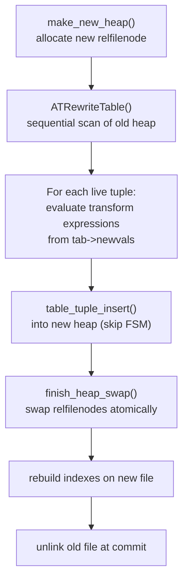

# ALTER TABLE Code Path

`ALTER TABLE` is the most complex DDL command in PostgreSQL. A single statement can combine multiple sub-commands (`ADD COLUMN`, `DROP COLUMN`, `ALTER COLUMN TYPE`, etc.), each with different lock requirements. Some of these sub-commands also require a full table rewrite. The machinery for handling this is in `src/backend/commands/tablecmds.c`. At around 20,000 lines, this is the largest single source file in the PostgreSQL tree.

## Entry Point and Three-Phase Structure

```
ProcessUtility
  └── standard_ProcessUtility
        └── AlterTable   (commands/tablecmds.c)
              └── ATController
                    ├── Phase 1: ATPrepCmd      (validate, classify, recurse)
                    ├── Phase 2: ATRewriteCatalogs  (update system catalogs)
                    └── Phase 3: ATRewriteTables    (scan/rewrite heap if needed)
```

`AlterTable` receives an `AlterTableStmt` containing a list of `AlterTableCmd` nodes. Each node carries an `AlterTableType` subcommand code that determines its lock requirement, pass assignment, and rewrite implications. The caller must have already acquired the lock (computed by `AlterTableGetLockLevel`) before `AlterTable` is entered. The function only opens the relation with `NoLock` (src/backend/commands/tablecmds.c).

The three-phase design exists because sub-commands within a single statement can depend on each other. For example, adding a column and then adding a constraint on that column must proceed in the right order. Some operations also need the catalog state from earlier sub-commands to be visible before they execute. Phases also allow the implementation to do all catalog updates before starting potentially expensive heap rewrites.

## Lock Level Taxonomy

Before acquiring any lock, `AlterTableGetLockLevel` inspects every sub-command in the list. It returns the highest lock required by any of them. The overall lock is thus the maximum — if any sub-command needs `AccessExclusiveLock`, the whole statement takes it (src/backend/commands/tablecmds.c).

The decision logic reveals the design rationale:

**`AccessExclusiveLock`** (blocks all concurrent readers and writers): PostgreSQL requires this lock whenever the operation changes data visible to concurrent `SELECT` queries — for example by changing the tuple format on disk, dropping columns, modifying rules, changing ownership that affects ACLs, or rewriting the heap.

**`ShareRowExclusiveLock`**: PostgreSQL uses this lock for trigger enable/disable operations and for adding a foreign key constraint. A foreign key requires adding triggers to both tables. A `ShareRowExclusiveLock` prevents concurrent DML that would fire those triggers before they exist, without fully blocking readers.

**`ShareUpdateExclusiveLock`**: PostgreSQL uses this lock for operations that affect only optimizer-level metadata. These operations do not change what queries return: `VALIDATE CONSTRAINT`, `SET STATISTICS`, `CLUSTER ON`, `SET STORAGE`, `AT_SetRelOptions` (when the option is not storage-altering), `ATTACH PARTITION`, and the concurrent variant of `DETACH PARTITION`. This lock prevents concurrent schema changes while allowing concurrent reads and writes.

**`AccessShareLock`**: PostgreSQL uses this lock only for `AT_CheckNotNull`, an internal sub-command that merely verifies schema state without modifying anything.

A summary of common cases:

| Sub-command | Lock |
|---|---|
| `ADD COLUMN` | `AccessExclusiveLock` |
| `DROP COLUMN` | `AccessExclusiveLock` |
| `ALTER COLUMN TYPE` | `AccessExclusiveLock` |
| `SET NOT NULL` | `AccessExclusiveLock` |
| `DROP NOT NULL` | `AccessExclusiveLock` |
| `ADD CONSTRAINT CHECK` | `AccessExclusiveLock` |
| `ADD CONSTRAINT UNIQUE/PRIMARY KEY` | `AccessExclusiveLock` |
| `ADD CONSTRAINT FOREIGN KEY` | `ShareRowExclusiveLock` |
| `ENABLE/DISABLE TRIGGER` | `ShareRowExclusiveLock` |
| `VALIDATE CONSTRAINT` | `ShareUpdateExclusiveLock` |
| `SET STATISTICS` | `ShareUpdateExclusiveLock` |
| `CLUSTER ON` / `DROP CLUSTER` | `ShareUpdateExclusiveLock` |
| `ATTACH PARTITION` | `ShareUpdateExclusiveLock` |
| `SET LOGGED` / `SET UNLOGGED` | `AccessExclusiveLock` |
| `SET ACCESS METHOD` | `AccessExclusiveLock` |

An important caveat noted in the source: Hot Standby replicas only process `AccessExclusiveLock` WAL records when deciding whether to cancel queries. Any operation that must be visible to standby queries must therefore use `AccessExclusiveLock`. This holds even if a weaker lock would suffice locally.

## Multi-Pass Execution

`AlteredTableInfo` is the per-table work record. It holds the pre-modification tuple descriptor, a list of sub-commands per pass, a list of constraints to validate in Phase 3, a list of new column expressions, and flags indicating whether a rewrite is needed and why (src/backend/commands/tablecmds.c).

Phase 2 (`ATRewriteCatalogs`) iterates over passes in order, executing sub-commands in each pass. The pass ordering is:

| Pass constant | Value | Purpose |
|---|---|---|
| `AT_PASS_DROP` | 0 | `DROP COLUMN`, `DROP CONSTRAINT`, `DROP IDENTITY` |
| `AT_PASS_ALTER_TYPE` | 1 | `ALTER COLUMN TYPE` |
| `AT_PASS_OLD_INDEX` | 2 | Re-add existing indexes (after type change) |
| `AT_PASS_OLD_CONSTR` | 3 | Re-add existing constraints (after type change) |
| `AT_PASS_ADD_COL` | 4 | `ADD COLUMN` |
| `AT_PASS_ADD_CONSTR` | 5 | `ADD CONSTRAINT` initial examination |
| `AT_PASS_COL_ATTRS` | 6 | Column attribute changes: `NOT NULL`, etc. |
| `AT_PASS_ADD_INDEXCONSTR` | 7 | Index-based constraints (`UNIQUE`, `PRIMARY KEY`) |
| `AT_PASS_ADD_INDEX` | 8 | Plain indexes |
| `AT_PASS_ADD_OTHERCONSTR` | 9 | Other constraints, column defaults |
| `AT_PASS_MISC` | 10 | Everything else |

The ordering reflects dependencies: drops happen before type changes, type changes happen before re-adding dependent objects, new columns appear before constraints that reference them. Scheduling a sub-command into a pass that has already been processed is an error. The code enforces this with an explicit check in `ATParseTransformCmd`.

## Catalog Updates for Common Operations

Each sub-command modifies a specific set of system tables. Understanding which tables are touched is useful for debugging lock conflicts and for understanding replication lag.

**ADD COLUMN**: inserts a row into `pg_attribute` with the new column's metadata. It updates `relnatts` in `pg_class`. If a DEFAULT is present, it inserts a row into `pg_attrdef`. If the missing-value optimization applies, it sets `atthasmissing = true` and `attmissingval` in `pg_attribute`.

**DROP COLUMN**: sets `attisdropped = true` in `pg_attribute`. PostgreSQL does not delete the row. It preserves the column number permanently to avoid confusion with historical tuple data. It does not decrement `relnatts` in `pg_class`.

**ALTER COLUMN TYPE**: updates `atttypid`, `atttypmod`, `attcollation`, `attlen`, `attbyval`, `attalign`, `attstorage` in `pg_attribute`. It drops and re-creates the dependency in `pg_depend`. It also drops the `pg_statistic` entry. It rebuilds entries in `pg_attrdef` if a default exists. It also rebuilds referencing indexes and constraints recorded in `changedIndexOids` / `changedConstraintOids`.

**ADD CONSTRAINT**: inserts a row into `pg_constraint` with fields including `contype`, `conrelid`, `convalidated`, `conbin` (for CHECK), or foreign key column arrays and the referenced index OID. For FK constraints, also creates trigger rows in `pg_trigger`.

**RENAME COLUMN**: updates `attname` in `pg_attribute`. A separate code path (`RenameAttribute`) handles this. It takes `AccessExclusiveLock` and does nothing more — no heap scan, no rewrite, no reindexing. All metadata that references the column uses `attnum`, not the name. As a result, renaming is purely a catalog operation.

## Fast-Path (Metadata-Only) Operations

Several operations look structural but require no heap scan and no rewrite.

**Renaming a column** updates only the `attname` field in `pg_attribute`. Indexes, constraints, and statistics all reference columns by attribute number, so they need no adjustment. The operation completes in constant time regardless of table size.

**Adding a nullable column with no DEFAULT** adds a `pg_attribute` row and increments `relnatts` in `pg_class`. It touches no tuple data at all. Existing tuples simply have fewer attributes than `relnatts`. The heap access layer treats any attribute number beyond the stored tuple width as NULL. No heap scan is needed.

**Adding a CHECK constraint with NOT VALID** (see below) writes only to `pg_constraint` with `convalidated = false`. The constraint enforcer checks new rows immediately on insert or update. The command does not scan existing rows. The operation is fast regardless of data volume.

## The Missing-Value Optimization for ADD COLUMN DEFAULT (PG 11+)

Before PostgreSQL 11, adding a column with a non-null DEFAULT required a full table rewrite, because the default value had to be physically written into every existing row. For large tables this was a multi-hour blocking operation.

PostgreSQL 11 introduced the "missing value" mechanism. When adding a column with a stable (non-volatile) non-null DEFAULT, the system stores the default value in `pg_attribute.attmissingval` and sets `atthasmissing = true`, instead of rewriting the heap. When an existing tuple is read, the access layer detects that the tuple has fewer attributes than `relnatts`. It then substitutes `attmissingval` for the missing attribute (src/backend/commands/tablecmds.c).

`ATExecAddColumn` checks the following conditions for taking the fast path:
- The relation must be a plain table (not a foreign table, view, or partitioned table without leaves).
- The column must not be generated (`attgenerated`).
- The column must not be of a domain type with constraints. Constraint failures on a NULL default should only fire when actual rows exist.
- The DEFAULT expression must not contain volatile functions. `ATExecAddColumn` calls `contain_volatile_functions` on the planned expression. It accepts the DEFAULT only when the expression is stable.

When these conditions are met, the executor evaluates the default expression once and stores the resulting `Datum` via `StoreAttrMissingVal`. It skips scheduling a rewrite. Phase 3 still adds a `NewColumnValue` entry for the column, to handle new rows written after the ALTER. However, `ATExecAddColumn` does not set the `AT_REWRITE_DEFAULT_VAL` flag, so `ATRewriteTables` does not build a new heap.

If the conditions are not met — for example because the default is `now()` or the column is in a domain with a NOT NULL constraint — `ATExecAddColumn` sets `tab->rewrite |= AT_REWRITE_DEFAULT_VAL`. A full rewrite follows.

When a column with a missing value is later changed via `ALTER COLUMN TYPE`, the code calls `RelationClearMissing` to remove the stored missing value before proceeding with the rewrite. This is necessary because the rewrite will physically materialize the default for all rows (src/backend/commands/tablecmds.c).

## Table Rewrites

A table rewrite happens when `tab->rewrite > 0` at the end of Phase 2. The flag is a bitmask. Current reasons include `AT_REWRITE_DEFAULT_VAL` (failed to use missing-value optimization), `AT_REWRITE_COLUMN_REWRITE` (column type change requires physical transformation), and `AT_REWRITE_ALTER_PERSISTENCE` (SET LOGGED / SET UNLOGGED).

The rewrite path in `ATRewriteTables` proceeds as follows (src/backend/commands/tablecmds.c):



Key details:

- `make_new_heap` creates a transient relation with a new `relfilenode` in the same tablespace (unless `SET TABLESPACE` was requested). The new file has the desired persistence, access method, and tablespace.
- The rewrite does not copy dead tuples. As a result, the rewrite leaves the table fully vacuumed.
- The `tab->newvals` list drives per-column expression evaluation. For `ALTER COLUMN TYPE`, the transform expression is the `USING` clause or an implicit cast. For `ADD COLUMN` on the slow path, it is the default expression. The rewrite copies columns not in `newvals` verbatim from the old tuple.
- `finish_heap_swap` performs an atomic relfilenode swap under the existing `AccessExclusiveLock`. From the perspective of other backends, the old file disappears and the new file appears in the same instant.
- The scan also evaluates NOT NULL checks and new CHECK constraints in `tab->constraints`. If any tuple fails a constraint, the rewrite aborts at that point. It discards the new file.

The `ATColumnChangeRequiresRewrite` function determines whether a column type change actually requires a rewrite. It allows binary coercions (where no function call is needed), unconstrained domain changes, and certain timezone conversions on timestamps at UTC to skip the rewrite. If `ATColumnChangeRequiresRewrite` returns false, the code updates the column's type metadata in `pg_attribute` without any heap scan.

## NOT VALID Constraints and Deferred Validation

For large tables, adding a CHECK or FK constraint in one shot acquires `AccessExclusiveLock` for the entire duration of the validation scan. On a table with hundreds of millions of rows this can mean hours of downtime.

The two-phase approach avoids this:

**Phase 1 — `ADD CONSTRAINT ... NOT VALID`**: The command writes the constraint to `pg_constraint` with `convalidated = false`. The lock required is `AccessExclusiveLock` for a CHECK constraint, since it still modifies catalog pages visible to the planner. However, the command holds the lock only for the brief catalog write. It releases the lock immediately at commit. Crucially, `ADD CONSTRAINT NOT VALID` never scans the heap. The constraint enforcer checks all rows written *after* this point immediately, on insert or update, because it applies all `convalidated = false` constraints to new data. The command leaves existing rows unchecked.

**Phase 2 — `VALIDATE CONSTRAINT`**: This acquires only `ShareUpdateExclusiveLock`. Concurrent reads and writes proceed while the scan runs. `ATExecValidateConstraint` queues a `NewConstraint` entry in the work queue. Phase 3 (`ATRewriteTable` with `OIDNewHeap = InvalidOid`) scans the table checking every existing row against the constraint expression. If all rows pass, the scan flips `convalidated` to `true` in `pg_constraint`. Any row that fails aborts the command with an error. The constraint remains in `convalidated = false` state for a later retry (src/backend/commands/tablecmds.c).

The net effect: the validation scan checks existing rows with a weak lock. The constraint enforcer always checks new rows immediately. The window of risk — where existing rows might violate the constraint — exists only between the two commands, and only for pre-existing data. Applications that need strict consistency can wrap both commands in a transaction, at the cost of holding the lock during the scan.

Foreign key NOT VALID constraints follow the same two-phase pattern. However, the code explicitly rejects `ADD CONSTRAINT ... NOT VALID` on partitioned tables.

## The Concurrent Index Trick for UNIQUE Constraints

`ADD CONSTRAINT UNIQUE` normally takes `AccessExclusiveLock` and builds the index inline. This blocks all concurrent access during index construction. For large tables, there is a way to add a unique constraint without a prolonged lock: build the index separately, then convert it into a constraint.

```sql
CREATE UNIQUE INDEX CONCURRENTLY my_idx ON t (col);
ALTER TABLE t ADD CONSTRAINT my_uq UNIQUE USING INDEX my_idx;
```

`CREATE UNIQUE INDEX CONCURRENTLY` builds the index without holding an `AccessExclusiveLock` (it uses multiple passes with weaker locks; see [[code-paths/create-index]]). Once the index exists and is valid, `ALTER TABLE ... ADD CONSTRAINT USING INDEX` wraps it in a constraint entry in `pg_constraint` by calling `ATExecAddIndexConstraint`.

`ATExecAddIndexConstraint` opens the index and verifies it is unique and valid (non-partial, non-expression). It determines whether the constraint should be `CONSTRAINT_PRIMARY` or `CONSTRAINT_UNIQUE`. It then calls `index_constraint_create`. This sets `indisprimary` or marks the constraint on the index. It also creates the `pg_constraint` row. If the caller specified a different constraint name than the index name, `ATExecAddIndexConstraint` renames the index to match. It then creates the constraint.

One important limitation: the code rejects this technique on partitioned tables, returning an error immediately for `RELKIND_PARTITIONED_TABLE`.

For primary keys, `ALTER TABLE t ADD CONSTRAINT pk PRIMARY KEY USING INDEX my_idx` follows the same path, with `index_check_primary_key` verifying that all columns in the index are `NOT NULL`.

## ADD COLUMN and DROP COLUMN

`ATExecAddColumn` inserts a new `pg_attribute` row by constructing a `FormData_pg_attribute` struct and calling `InsertPgAttributeTuples`. It increments `relnatts` in `pg_class`. If the column definition includes a DEFAULT, `AddRelationNewConstraints` stores it in `pg_attrdef`. It returns the cooked expression. The code then chooses the missing-value path or the rewrite path, as described above.

For inheritance hierarchies, `ATExecAddColumn` manually recurses one level at a time using `find_inheritance_children`. This is necessary because a merge may happen at each child: the child may already have a column of the same name. A merge affects `attinhcount`. As a result, the code must not recurse further once a merge occurs. When a child column matches name, type, typmod, and collation, `ATExecAddColumn` simply increments its `attinhcount`. The code does not insert a new `pg_attribute` row in that case.

`ATExecDropColumn` sets `attisdropped = true` on the `pg_attribute` row. The physical data in every tuple remains on disk. The table recovers the column's storage only if `VACUUM FULL` or `CLUSTER` rewrites it. Since `ATExecDropColumn` does not decrement `relnatts`, it does not affect the column number of subsequently added columns. Dropped columns are invisible to queries. However, the stored tuple width still reflects them. As a result, a table with many add-and-drop cycles will have tuples with a growing number of null holes.

## ALTER COLUMN TYPE

`ATPrepAlterColumnType` handles the Phase 1 work. It looks up the old and new types and constructs the transform expression (the `USING` clause, or an implicit cast from old to new type). It plans the expression via `expression_planner` and calls `ATColumnChangeRequiresRewrite` to decide whether a rewrite is actually needed.

If a rewrite is needed, the code stores the transform expression in `tab->newvals` as a `NewColumnValue`. It also sets `tab->rewrite |= AT_REWRITE_COLUMN_REWRITE`.

Because the transform expression references the original column types, PostgreSQL must parse the `USING` expressions for all `ALTER COLUMN TYPE` sub-commands in the same statement against the *unmodified* table schema. This is why `AT_PASS_DROP` and `AT_PASS_ALTER_TYPE` are the first two passes: they must not see catalog changes from other sub-commands.

When multiple columns are changed in one statement, all their transforms run in parallel during the single Phase 3 rewrite scan. Each row produces one transformed output row, with all column expressions evaluated simultaneously.

During the Phase 2 catalog update, `ATExecAlterColumnType` finds dependent objects by scanning `pg_depend` and remembers them in `tab->changedIndexOids` and `tab->changedConstraintOids`. After the code updates the type metadata in `pg_attribute`, `ATPostAlterTypeCleanup` drops and re-creates those indexes and constraints by running their definition strings through the parser again.

## Partition-Aware ALTER TABLE

When the target is a partitioned table, most structural changes propagate to all partitions. The propagation mechanism varies by operation.

`ATExecAddColumn` handles its own recursion using `find_inheritance_children`, going one level at a time to handle merge semantics correctly. `ATExecAddColumn` adds the column to each child with `inhcount = 1` and `is_local = false`.

Simpler operations use `ATSimpleRecursion`. It calls `find_all_inheritors` to get the full hierarchy. It then queues the same sub-command for each child in the work queue. This is safe for operations where no merge logic is needed.

For partitioned tables specifically, PostgreSQL restricts some operations. The code rejects `ADD CONSTRAINT ... NOT VALID` for foreign keys outright (src/backend/commands/tablecmds.c). It also rejects `ALTER TABLE ... ADD CONSTRAINT USING INDEX` for partitioned tables. It rejects adding a column directly to a partition instead of through the root. All structural changes must happen on the partitioned root.

When a new partition is attached (`ATTACH PARTITION`), `CloneForeignKeyConstraints` copies FK constraints from the parent to the new partition, either by finding an existing compatible constraint on the partition to reparent, or by creating fresh `pg_constraint` rows and triggers.

## See Also

- [[code-paths/create-table]] — original table creation
- [[code-paths/create-index]] — index creation, including the concurrent build path used with `ADD CONSTRAINT USING INDEX`
- [[subsystems/storage/heap]] — heap tuple layout and why type changes require rewrites
- [[subsystems/catalog/core-catalogs]] — pg_attribute and pg_constraint rows modified by ALTER TABLE
- [[subsystems/locking/overview]] — lock modes and why AccessExclusiveLock is needed
- [[code-paths/vacuum]] — VACUUM FULL reclaims space from dropped columns

## Related Topics

- [[subsystems/constraints|Constraints]] — how CHECK, FK, UNIQUE, and NOT NULL constraints are stored and enforced, complementing the ADD CONSTRAINT code paths
- [[subsystems/triggers|Triggers]] — FK constraints install triggers via pg_trigger; understanding trigger mechanics explains the ShareRowExclusiveLock requirement
- [[subsystems/table-inheritance|Table Inheritance]] — ALTER TABLE recursion through inheritance hierarchies and the attinhcount merge semantics
- [[subsystems/partitioning/overview|Partitioning Overview]] — structural changes on partitioned tables propagate to all partitions; ALTER TABLE restrictions for partitioned roots
- [[subsystems/storage/toast|TOAST]] — column type changes that alter storage can affect TOAST datum layout and may force a rewrite
- [[subsystems/transactions/mvcc|MVCC]] — table rewrites create a new relfilenode; old snapshots continue to read the old file until they commit, which is why AccessExclusiveLock is mandatory
- [[subsystems/storage/hot|HOT]] — HOT chains are invalidated by rewrites; understanding HOT explains why even a no-op rewrite has index-rebuild overhead
