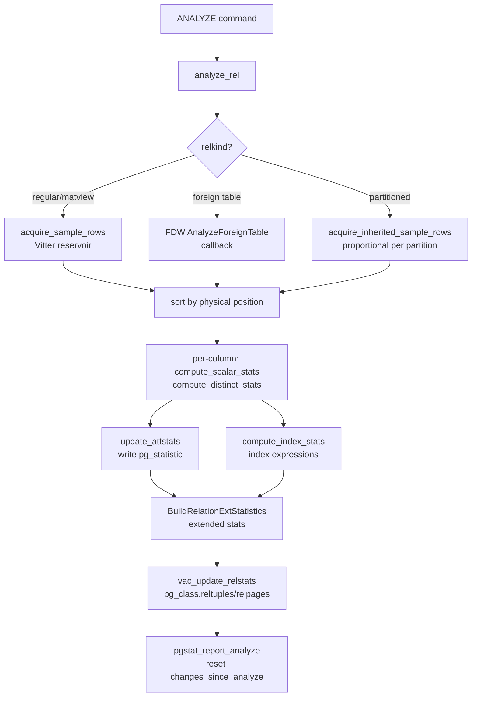

# ANALYZE

ANALYZE collects statistics about the distribution of values in each table column and stores them in `pg_statistic`. The [[subsystems/planner/overview|planner]] consults these statistics every time it estimates how many rows a WHERE clause or join will return. Without fresh statistics, cost estimates are guesses. With fresh statistics, the planner can distinguish a highly selective predicate from one that matches 80% of the table. It can then choose the right index, join order, and join strategy accordingly.

ANALYZE runs explicitly via the `ANALYZE` command, implicitly as part of `VACUUM ANALYZE`, and continuously in the background through the [[subsystems/background/autovacuum|autovacuum]] daemon. The autovacuum daemon triggers ANALYZE when a table's modification counter crosses a threshold. The command accepts an optional column list. When one is provided, ANALYZE re-analyzes only those columns. All other `pg_statistic` rows remain untouched. ANALYZE never analyzes system attributes.

## What ANALYZE measures — and what it does not

A common misconception is that ANALYZE updates all relation-level counters. It does not. ANALYZE computes column-level value distributions and updates `pg_class.reltuples` and `pg_class.relpages` based on extrapolation from the sampled pages. It does not update sequential scan counts, index usage counts, or tuple-level I/O statistics. Those come from the cumulative statistics system (`pgstat`). Backends maintain `pgstat` continuously and report at transaction end via `pgstat_report_analyze()` (`analyze.c`). After ANALYZE finishes, it calls `pgstat_report_analyze()` to reset the `changes_since_analyze` counter for the relation. This counter controls whether autovacuum will trigger ANALYZE again.

## The auto-analyze threshold

Autovacuum decides whether to analyze a table by comparing the table's `n_mod_since_analyze` counter against a threshold computed as:

```
autovacuum_analyze_threshold + autovacuum_analyze_scale_factor * reltuples
```

`autovacuum_analyze_threshold` (default 50) is a flat row count added as a minimum, preventing constant re-analysis of tiny tables. `autovacuum_analyze_scale_factor` (default 0.2) means that a table needs roughly 20% of its rows changed before auto-analyze fires. `ALTER TABLE ... SET (autovacuum_analyze_threshold = ...)` can override both parameters at the table level. This override matters for very large tables, where 20% represents hundreds of millions of rows. Stale statistics can otherwise persist far too long.

## Sampling: Vitter reservoir algorithm

Scanning every row of a large table to compute statistics would be prohibitively expensive and is unnecessary — a well-chosen sample is sufficient. ANALYZE uses a two-stage random sampling strategy implemented in `acquire_sample_rows()` (`analyze.c`).

The first stage selects a random subset of disk pages using a block sampler (`BlockSampler_Init()`, `utils/sampling.c`). The number of blocks targeted is proportional to the requested sample size, so sampling depth scales with `default_statistics_target`. The second stage reads tuples from those blocks. It applies Vitter's reservoir sampling algorithm to maintain a uniform random sample of exactly `targrows` live rows as tuples stream in.

The Vitter algorithm first fills the reservoir with the first `targrows` rows. It then computes — without examining each intermediate row — how many rows to skip before the next replacement. When a row is selected for replacement, it displaces a uniformly random existing entry. At all times the reservoir is a true random sample of all rows seen so far. When the scan ends, the reservoir therefore holds a statistically unbiased sample. Every row had an equal probability of inclusion (`analyze.c`, comment above `acquire_sample_rows()`).

The two stages run simultaneously. The block sampler emits each block number. The main loop then reads the page. The reservoir sampler processes the page's rows before the block sampler emits the next block number. On systems with prefetch support, ANALYZE runs a second `BlockSamplerData` with the same seed one step ahead. This lets the kernel initiate I/O before the main loop reaches that block.

After sampling, ANALYZE sorts the rows by physical position (block, offset). This ordering makes correlation estimates meaningful — they measure how well the physical row order matches the sorted-value order.

The total row count returned alongside the sample is an estimate, not a scan of every page. ANALYZE extrapolates live and dead row density from the sampled pages to the full relation, updating `pg_class.reltuples` and `pg_class.relpages` via `vac_update_relstats()`.

## The default_statistics_target GUC

`default_statistics_target` (default 100, range 1–10000) is the single most important tuning knob for ANALYZE quality. The target sample size for a column is `300 * attstattarget`. `attstattarget` defaults to `default_statistics_target` when set to −1 in `pg_attribute`. The constant 300 comes from a result in Chaudhuri, Motwani, and Narasayya (SIGMOD 1998): for a histogram of size k, maintaining ≤ 0.5 relative bin-size error at probability 0.99 requires about 305.82 * k rows. Because of the logarithmic dependence on total row count, 300 * k works well across many orders of magnitude of table size (`std_typanalyze()` comment, `analyze.c`).

Doubling `default_statistics_target` roughly doubles sample size and MCV/histogram array lengths, at the cost of more I/O during ANALYZE and slightly larger plan-time catalog lookup. Selectivity estimates improve as the histogram gains resolution. However, returns diminish quickly past a few hundred bins.

Per-column overrides take precedence over the GUC: `ALTER TABLE t ALTER COLUMN c SET STATISTICS 500` stores the target in `pg_attribute.attstattarget`. Setting a column's target to 0 disables statistics for that column entirely. `examine_attribute()` returns NULL for such columns. ANALYZE writes no `pg_statistic` row for it. The maximum target across all columns governs `targrows` for the entire ANALYZE run, so a single high-priority column can force a larger sample for the whole table.

Extended statistics objects can demand an even larger sample. `ComputeExtStatisticsRows()` (`extended_stats.c`) returns `300 * stattarget` for the extended-statistics object. `do_analyze_rel()` raises `targrows` to accommodate this before collecting any rows.

## Per-column statistics

For each analyzable column, ANALYZE allocates a `VacAttrStats` struct (`vacuum.h`) to accumulate everything that ANALYZE will eventually write into a `pg_statistic` row. ANALYZE looks up the type-specific analysis function from `pg_type.typanalyze`. For most built-in types, this resolves to `std_typanalyze()` (`analyze.c`). This function sets up the standard computation pipeline. Types without a `<` operator use `compute_distinct_stats()`. Types without even an `=` operator fall back to `compute_trivial_stats()`. Custom types register their own analysis functions to produce whatever statistic kinds their selectivity estimators consume.

### Null fraction and average width

`stanullfrac` is the fraction of sampled rows that were NULL, stored as float4 between 0 and 1. `stawidth` is the average storage size of non-NULL values in bytes, computed over the sample. The planner uses `stawidth` to estimate memory consumption for sort buffers and hash tables.

### Distinct-value count

`stadistinct` is an estimate of how many distinct non-NULL values the column contains. A positive value is an absolute count. A negative value is a fraction of total rows — so −0.1 means roughly 10% of rows have a distinct value. ANALYZE uses the negative form when the estimated count scales with table size. This is the normal case for non-low-cardinality columns. ANALYZE chooses the sign by this rule: if the absolute distinct estimate exceeds 10% of `totalrows`, it converts the estimate to a negative fraction (`analyze.c`, `compute_scalar_stats()`).

The estimate itself comes from the Haas-Stokes Duj1 estimator:

```
stadistinct ≈ n * d / (n - f1 + f1 * n / N)
```

where `n` is the sample size, `N` is the total row count, `d` is the number of distinct non-NULL values in the sample, and `f1` is the number of distinct values that appeared exactly once. This is a bias-corrected estimator that accounts for the probability that rare values were not observed at all. For the special cases where all sample values are unique (likely a key column) or all sample values appeared more than once (likely a low-cardinality column), simpler heuristics apply.

### MCV list (most common values)

The MCV list captures value skew that a histogram cannot. When one value appears in 40% of rows, recording that frequency directly is far more precise than any bin boundary. ANALYZE stores the list in two parallel arrays in slot 0 of `pg_statistic`. `stavalues1` holds the values in descending frequency order. `stanumbers1` holds the corresponding frequencies as float4 fractions.

ANALYZE limits MCV entries to values that appear frequently enough for the frequency estimate to be reliable. ANALYZE derives the threshold from a hypergeometric distribution bound: the relative standard error of a sample frequency must be below 20% (`analyze_mcv_list()`, `analyze.c`; `get_mincount_for_mcv_list()`, `mcv.c`). This caps the threshold at around 25 occurrences in the sample. The threshold approaches zero as sample coverage of the table approaches 100%.

For columns where every sampled value appears more than once and all of them fit within the target, ANALYZE stores the complete distribution as an MCV list. It omits the histogram. This is the common case for boolean, enum, and other low-cardinality columns.

### Histogram

The histogram covers the spread of values that are not common enough for the MCV list. ANALYZE removes MCV values from the sorted sample before it computes histogram boundaries. As a result, each bucket covers an approximately equal share of the non-MCV population. ANALYZE stores the boundaries as `stavalues2` — a sequence of `num_bins + 1` boundary values, where `num_bins` equals `attstattarget`. ANALYZE only generates a histogram when at least two distinct non-MCV values remain in the sample (`analyze.c`, `compute_scalar_stats()`).

### Correlation

Correlation is the Pearson coefficient between physical tuple position (0 to n−1 in scan order) and sorted-value position (0 to n−1 after sorting by the column's `<` operator). A value of 1.0 means the column sits in perfectly sorted order on disk; −1.0 means reverse-sorted order; near-zero means random order. The planner uses correlation to decide whether an index scan followed by a heap fetch will have sequential or random access patterns. High correlation makes index scans much cheaper because consecutive index entries map to consecutive heap pages. Low correlation makes a sequential scan cheaper despite reading more rows (`analyze.c`, `compute_scalar_stats()`, correlation computation section).

## Storage: pg_statistic and pg_stats

Statistics land in the `pg_statistic` system catalog, written by `update_attstats()` (`analyze.c`). Each row identifies the relation (`starelid`), column (`staattnum`), and whether these are inheritance-tree statistics (`stainherit`), followed by the scalar statistics and then up to `STATISTIC_NUM_SLOTS` (currently 5) typed slots.

Each slot consists of five parallel fields:

| Field | Type | Content |
|-------|------|---------|
| `stakindN` | int2 | Kind code identifying what the slot contains |
| `staopN` | oid | The operator used (e.g., `=` for MCV, `<` for histogram) |
| `stacollN` | oid | The collation used for comparisons |
| `stanumbersN` | float4[] | Numeric data (e.g., MCV frequencies, correlation coefficient) |
| `stavaluesN` | anyarray | Value data (e.g., MCV values, histogram boundaries) |

The standard `stakind` codes are:

| `stakind` constant | Meaning |
|--------------------|---------|
| `STATISTIC_KIND_MCV` (1) | Most-common values + parallel frequency array |
| `STATISTIC_KIND_HISTOGRAM` (2) | Boundaries of equal-frequency histogram buckets |
| `STATISTIC_KIND_CORRELATION` (3) | Pearson correlation between physical and logical order |
| `STATISTIC_KIND_MCELEM` (4) | Most-common elements (for arrays, tsvectors) |
| `STATISTIC_KIND_DECHIST` (5) | Distinct-elements count histogram (arrays) |
| `STATISTIC_KIND_RANGE_LENGTH_HISTOGRAM` (6) | Range length histogram (range types) |
| `STATISTIC_KIND_BOUNDS_HISTOGRAM` (7) | Range bounds histogram (range types) |

`pg_statistic` is intentionally hard to read directly. The typed `stavalues` arrays use internal representations. The slot layout is an implementation detail. The `pg_stats` view decodes this into human-readable columns like `null_frac`, `avg_width`, `most_common_vals`, and `histogram_bounds`. This view is the practical interface for diagnosing planner problems.

One critical detail: ANALYZE never analyzes `pg_statistic` itself. `analyze_rel()` explicitly skips the `pg_statistic` relation (`StatisticRelationId`) to avoid the circularity of maintaining statistics about statistics.

ANALYZE silently excludes wide varlena values (> 1024 bytes after detoast) from MCV and histogram computation. Such values rarely repeat. Their impact on range estimates is minor (`WIDTH_THRESHOLD`, `analyze.c`).

## Extended statistics

Single-column statistics assume independence: the planner multiplies per-column selectivities together. This underestimates cardinality when columns are correlated. `CREATE STATISTICS` (PG 10+) captures inter-column relationships and stores them in `pg_statistic_ext` (the definition) and `pg_statistic_ext_data` (the computed data).

PostgreSQL supports three kinds of extended statistics:

**ndistinct** (`STATS_EXT_NDISTINCT`): the number of distinct value combinations across a column group. Useful when the planner estimates GROUP BY output cardinality or the selectivity of multi-column equality predicates.

**Functional dependencies** (`STATS_EXT_DEPENDENCIES`): a set of dependency coefficients expressing the degree to which knowing column A's value reduces uncertainty about column B's value. The planner uses these to adjust selectivity estimates downward when predicates on correlated columns are combined.

**MCV lists for column combinations** (`STATS_EXT_MCV`): the most-common value tuples across a column group, with actual frequencies and base frequencies (the product of per-column frequencies under the independence assumption). Comparing actual frequency to base frequency is what reveals correlation. The multivariate MCV build in `statext_mcv_build()` (`mcv.c`) sorts the sample by column combination and counts distinct groups. It filters by a minimum count threshold derived from the same hypergeometric bound used for single-column MCVs. It stores frequencies alongside `base_frequency` so the planner can compute how much to adjust selectivity estimates upward or downward.

All three types reuse the same sample of rows collected for single-column statistics. `do_analyze_rel()` calls `BuildRelationExtStatistics()` (`extended_stats.c`) after the per-column pass completes. `BuildRelationExtStatistics()` iterates over every `pg_statistic_ext` entry for the relation. The `StatExtEntry` struct carries the column bitmap, the requested statistic kinds, and the statistics target for the object.

Extended statistics objects have their own target, settable via `ALTER STATISTICS ... SET STATISTICS N`. The resolution order is: object-level target → maximum of constituent column targets → `default_statistics_target` (via `statext_compute_stattarget()`). Because extended stats demand a sample size of `300 * stattarget`, a high extended-statistics target can drive ANALYZE to sample more rows than the per-column targets alone would require.

## ANALYZE on partitioned tables

Partitioned tables present a special case because the parent table has no storage of its own. When `analyze_rel()` encounters a `RELKIND_PARTITIONED_TABLE`, it skips the non-inherited scan. It calls `do_analyze_rel()` only in inherited mode (`inh = true`). `analyze_rel()` also analyzes each leaf partition separately, in its own call with `inh = false`.

For the partition-level scan, each partition gets its own sample, its own per-column statistics, and its own `pg_statistic` rows tagged with `stainherit = false`. These are the statistics used when the planner works on a query targeting a specific partition after partition pruning.

For the inherited-mode scan of the parent, `acquire_inherited_sample_rows()` draws samples proportionally from all leaf partitions: each partition's share of `targrows` is `targrows * childblocks / totalblocks`, so larger partitions contribute more samples. The resulting `pg_statistic` rows are tagged with `stainherit = true` and represent the distribution across the entire partitioned table. `do_analyze_rel()` updates the parent's `pg_class.reltuples` to the sum of estimated rows across all partitions.

The planner consults the inheritance-tree statistics when planning queries against the partitioned parent. It uses partition-level statistics when planning against individual partitions after pruning.

One important consequence: there are no global statistics that span all partitions independently of the individual partition statistics. If the data distribution within a partition diverges significantly from the aggregate distribution, estimates based on inherited statistics may be off. This affects queries that land on a single partition.

## Foreign tables and ANALYZE

Foreign tables bypass the normal heap sampling path entirely. When `analyze_rel()` encounters `RELKIND_FOREIGN_TABLE`, it calls `fdwroutine->AnalyzeForeignTable()` to ask the FDW whether it supports statistics collection (`analyze.c`). This callback must either return `false` (causing ANALYZE to skip the table with a WARNING) or return `true` and populate a function pointer for `acquirefunc` along with an estimated page count.

The `acquirefunc` has the same signature as `acquire_sample_rows()`. It must fill the rows array with a random sample and estimate live and dead row counts. Once it returns, the rest of the ANALYZE pipeline — per-column statistics, extended statistics, `pg_statistic` writes — runs unchanged. FDWs that do not implement `AnalyzeForeignTable` produce no statistics. As a result, queries against them receive default selectivity estimates (typically 0.005 for equality predicates).

## Index expression statistics

Partial and expression indexes receive their own statistics. For each index with expression columns, `do_analyze_rel()` builds per-expression `VacAttrStats` structs. It evaluates the index expressions against the sampled heap rows via `compute_index_stats()`. `compute_index_stats()` stores the results as `pg_statistic` rows keyed on the index relation's OID rather than the table's OID. This means the planner can consult selectivity for an expression like `lower(email)` directly, provided an index on that expression exists.

For partial indexes, ANALYZE estimates the fraction of rows satisfying the index predicate (`tupleFract`) from the sample. It records the fraction in the index's `pg_class.reltuples`.

## Locking

ANALYZE takes `ShareUpdateExclusiveLock` on the target table. This is the same lock level used by autovacuum and by the non-full form of `VACUUM`, so concurrent reads and writes proceed unimpeded. Two concurrent ANALYZEs on the same table block each other but do not block normal DML. ANALYZE holds the lock until the transaction commits. As a result, concurrent planners cannot see the `pg_statistic` updates before they are durable.

## Planner integration

Selectivity estimator functions consume the statistics ANALYZE writes. These include functions in `src/backend/optimizer/path/clausesel.c` and the type-specific estimator functions registered in `pg_operator.oprrest` and `pg_operator.oprjoin`. Functions like `eqsel()`, `scalarltsel()`, and `mcv_selectivity()` look up `pg_statistic` rows and decode the relevant slot. They return a fraction of rows expected to satisfy a predicate.

For multi-column predicates where extended statistics exist, `statext_mcv_clauselist_selectivity()` and the dependency-adjusted estimators in `extended_stats.c` override the independence assumption. They return better-calibrated row counts. These estimates feed directly into join size estimation and into the planner's choice between a nested loop, hash join, or merge join.



## Related Topics

- [[subsystems/background/autovacuum|Autovacuum]] — the background daemon that triggers ANALYZE automatically when a table's modification counter crosses the configured threshold
- [[subsystems/planner/statistics|Planner Statistics]] — covers how the planner reads MCV lists, histograms, and correlation from `pg_statistic` to produce selectivity estimates
- [[subsystems/planner/extended-statistics|Extended Statistics]] — documents the `CREATE STATISTICS` framework that ANALYZE populates for multi-column dependency and MCV statistics
- [[subsystems/planner/selectivity-estimation|Selectivity Estimation]] — explains how selectivity estimator functions translate `pg_statistic` slots into row-count fractions used in cost modeling
- [[subsystems/planner/stale-statistics-and-bad-plans|Stale Statistics and Bad Plans]] — describes the practical consequences of outdated or missing ANALYZE output on planner decisions
- [[subsystems/partitioning/overview|Partitioning Overview]] — partitioned tables require inherited-mode sampling and per-partition statistics, both driven by ANALYZE
- [[subsystems/extensions/foreign-data-wrappers|Foreign Data Wrappers]] — FDWs must implement the `AnalyzeForeignTable` callback to participate in ANALYZE's statistics pipeline
- [[code-paths/vacuum|VACUUM]] — shares the `VacuumParams` struct and buffer access strategy with ANALYZE
- [[subsystems/planner/overview|Planner Overview]] — the planner is the primary consumer of the statistics ANALYZE produces, using them to estimate selectivity and cost
- [[subsystems/storage/buffer-manager|Buffer Manager]] — ANALYZE uses a ring buffer strategy to avoid polluting the shared buffer cache while sampling pages
- [[architecture/overview|Architecture Overview]] — situates ANALYZE within the broader parse-plan-execute pipeline that all commands pass through
