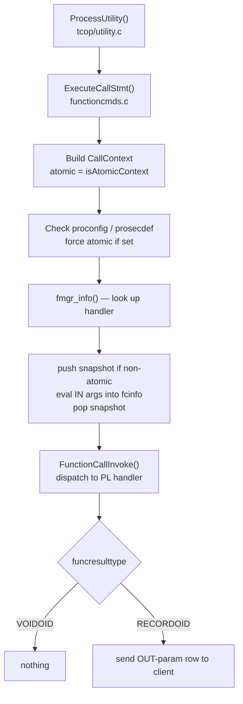
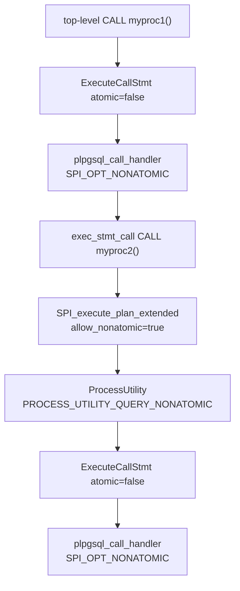

`CALL` is the SQL command for invoking a stored procedure. Its execution path is deliberately different from function invocation via `SELECT`. The key difference is not syntactic but semantic: a procedure body can issue `COMMIT` and `ROLLBACK`. Doing so ends the current transaction and starts a new one mid-execution. Functions cannot do this. The entire machinery around `CALL` — the `atomic` flag, `CallContext`, portal-lifespan memory, `SPI_OPT_NONATOMIC` — exists to permit and safely manage that single capability.

## Procedures vs Functions in the Catalog

PostgreSQL stores both functions and procedures in `pg_proc`. The `prokind` column distinguishes them:

| `prokind` | Meaning |
|-----------|---------|
| `'f'` | Ordinary function (`PROKIND_FUNCTION`) |
| `'a'` | Aggregate (`PROKIND_AGGREGATE`) |
| `'w'` | Window function (`PROKIND_WINDOW`) |
| `'p'` | Procedure (`PROKIND_PROCEDURE`) |

`CREATE PROCEDURE`, not `CREATE FUNCTION`, creates a procedure. It has no `RETURNS` clause. When a procedure has `OUT` parameters, its result type in `pg_proc` is always `RECORD`. Procedures with output parameters always return a composite, even if there is only one output column. Functions with a single `OUT` parameter use that parameter's type directly as the return type.

Procedures have two restrictions that functions do not. They cannot appear after the `FROM` clause, because they are not set-returning. Their `OUT` parameters cannot follow a parameter with a default value. The second restriction exists specifically because CALL syntax needs to unambiguously match positional output slots.

The parser enforces the `CALL`-must-be-a-procedure rule inside `ParseFuncOrColumn()` (`parse_func.c`). When the `proc_call` flag is true, the lookup loop checks each candidate's `prokind`. It skips any candidate that is not `PROKIND_PROCEDURE`. It raises an error if a matching name resolves to a function instead.

## Parsing: from SQL Text to CallStmt

The grammar produces a `CallStmt` node whose `funccall` field holds the raw, unresolved `FuncCall` from the parser. Semantic analysis runs in `transformCallStmt()` (`analyze.c`).

`transformCallStmt` calls `ParseFuncOrColumn()` with `proc_call = true`. This call resolves the procedure OID and constructs a `FuncExpr`. It then reads `pg_proc.proargmodes` to classify each parameter as IN, OUT, or INOUT. Input-mode arguments stay in `fexpr->args` (they will be evaluated and passed to the callee). `transformCallStmt` separates output-mode arguments into `stmt->outargs` — expressions representing the PL variables or placeholders that will receive the procedure's output values after execution.

INOUT arguments appear in both lists: once in `fexpr->args` as an input value, and once in `stmt->outargs` as an output target (the object is shallow-copied so the two lists have independent nodes).

```c
typedef struct CallStmt
{
    NodeTag     type;
    FuncCall   *funccall;   /* raw parse tree */
    FuncExpr   *funcexpr;   /* resolved, input args only */
    List       *outargs;    /* output-arg expressions */
} CallStmt;
```

Because `CallStmt` is a utility statement, it never goes through the planner. `transformCallStmt` calls `expand_function_arguments()` directly at analysis time to handle named-argument notation and defaults — work that the planner would normally handle for `FuncExpr` nodes inside queries.

## The Atomic Context Decision

The most important decision in the CALL path is whether the execution context is *atomic* (no transaction control allowed) or *non-atomic* (transaction control allowed). This flag flows from `ProcessUtility()` in `tcop/utility.c`:

```c
bool isAtomicContext =
    (!(context == PROCESS_UTILITY_TOPLEVEL ||
       context == PROCESS_UTILITY_QUERY_NONATOMIC) ||
     IsTransactionBlock());
```

A `CALL` issued directly from a client session at the top level (`PROCESS_UTILITY_TOPLEVEL`) is non-atomic as long as no explicit `BEGIN` has been issued. The same `CALL` inside an explicit transaction block (`BEGIN … CALL … COMMIT`) becomes atomic because `IsTransactionBlock()` returns true. The client has already committed to a transaction that must finish before a new one begins.

This means that writing `BEGIN; CALL myproc(); COMMIT;` removes the procedure's ability to issue its own `COMMIT`/`ROLLBACK`. The feature only works when the caller lets PostgreSQL manage the transaction boundaries.

Two additional conditions force atomic mode regardless of the caller's context, checked inside `ExecuteCallStmt()`:

- **`proconfig` is set** — GUC settings layered via `SET LOCAL` within a function definition sit on a stack that must align with transaction boundaries. Allowing a mid-body commit would pop GUC settings from the wrong level. The restriction exists because the GUC nesting mechanism was not redesigned to tolerate transaction boundaries inside a procedure.
- **`prosecdef` is true (SECURITY DEFINER)** — `StartTransaction()` requires an empty security context stack. `AbortTransaction()` resets it. Permitting commits inside a security-definer procedure would interleave role-switching with transaction management in ways the current code does not handle.

## Execution entry point

`ExecuteCallStmt()` (`functioncmds.c`) is the entry point for the command, called from `ProcessUtility()` with the `isAtomicContext` flag already computed.



Before evaluating arguments, `ExecuteCallStmt` pushes a fresh snapshot when running non-atomically (`PushActiveSnapshot(GetTransactionSnapshot())`). In atomic contexts the caller already holds a snapshot. In non-atomic contexts there may be no active snapshot at all, because a prior `COMMIT` inside the procedure would have destroyed it. `ExecuteCallStmt` pops the snapshot immediately after argument evaluation, before the procedure body runs.

The arguments live in a [[subsystems/memory/contexts|memory context]] that is a child of the portal's `portalContext`. This is a deliberate choice: portal memory survives transaction commits. If the procedure commits internally, the argument values remain valid for the duration of the `CALL`. This is because PostgreSQL allocated them in portal memory, not in the now-dead transaction's context. A known hazard noted in the source: [[subsystems/storage/toast|TOAST]] pointer arguments fetched before a mid-body commit may reference storage that no longer exists. PL implementations are responsible for de-toasting before committing.

`ExecuteCallStmt` passes a `CallContext` node as `fcinfo->context`:

```c
typedef struct CallContext
{
    NodeTag  type;
    bool     atomic;   /* false = transaction control permitted */
} CallContext;
```

Every PL handler that supports procedures checks this node to decide how to configure its SPI connection.

## Dispatch to the PL Handler

`ExecuteCallStmt` invokes the actual procedure body through the standard fmgr machinery — `FunctionCallInvoke(fcinfo)` — exactly as it would for any function. The `lanpltrusted`/`lanplcallfoid` indirection via `pg_language` applies the same way. From fmgr's perspective there is no distinction between calling a function and calling a procedure.

For PL/pgSQL the handler is `plpgsql_call_handler()` (`pl_handler.c`). It reads the `CallContext` to decide whether to open a non-atomic SPI connection:

```c
nonatomic = fcinfo->context &&
    IsA(fcinfo->context, CallContext) &&
    !castNode(CallContext, fcinfo->context)->atomic;

SPI_connect_ext(nonatomic ? SPI_OPT_NONATOMIC : 0);
```

`SPI_OPT_NONATOMIC` sets `_SPI_current->atomic = false` in the SPI stack entry. This flag is what `SPI_commit()` and `SPI_rollback()` check before proceeding. Without it, any attempt to commit inside the procedure raises `ERRCODE_INVALID_TRANSACTION_TERMINATION`.

`plpgsql_call_handler` creates a procedure-lifespan [[subsystems/memory/resource-owner|ResourceOwner]] when `nonatomic` is true and the function's compiled representation (`PLpgSQL_function`) has `requires_procedure_resowner = true`. The compiler sets this flag at compile time when the body contains any `CALL` or `DO` statement. This resource owner holds plan cache references that must outlive individual transactions. The cached plan for an inner `CALL` must survive across the transaction boundary.

## Transaction Control Inside a Procedure

`SPI_commit()` and `SPI_rollback()` delegate to `_SPI_commit()` and `_SPI_rollback()` respectively (`spi.c`). Both follow the same pattern:

1. Refuse if `_SPI_current->atomic` is true.
2. Refuse if `IsSubTransaction()` — a `SAVEPOINT` is active.
3. Call `HoldPinnedPortals()` — it converts any portals (open cursors) still active into held portals so they survive the transaction boundary. This must happen before the transaction state changes. Portal cleanup may execute user-defined code.
4. Call `ForgetPortalSnapshots()` — release snapshot references held by portals.
5. Call `CommitTransactionCommand()` (or `AbortCurrentTransaction()` for rollback).
6. Immediately call `StartTransactionCommand()` to begin the next transaction.
7. Restore the memory context.

The consequence of step 6 is that there is no gap where the session has no active transaction. The new transaction starts synchronously within the same `SPI_commit()` call before it returns to the procedure body.

After a commit, `pl_exec.c` detects the transaction change by comparing `MyProc->lxid` before and after the inner `CALL`:

```c
before_lxid = MyProc->lxid;
rc = SPI_execute_plan_extended(expr->plan, &options);
after_lxid = MyProc->lxid;

if (before_lxid != after_lxid)
{
    /* rebuild simple-expression infrastructure for the new transaction */
    estate->simple_eval_estate = NULL;
    plpgsql_create_econtext(estate);
}
```

This is necessary because the expression evaluation infrastructure (`EState`, expression contexts, snapshots) is bound to a transaction. After a commit, the old infrastructure is gone. `pl_exec.c` must recreate it.

## Snapshots and the SPI Stack After a Commit

Each `SPI_commit()` call destroys the current snapshot and all per-transaction state. The new transaction started by `StartTransactionCommand()` does not automatically acquire a snapshot. The SPI execution machinery pushes a fresh `GetTransactionSnapshot()` before each SQL command it runs. This means that any SQL executed after a `COMMIT` inside a procedure sees a new, up-to-date snapshot — it does not inherit the pre-commit view of the world.

There is a subtle TOAST pointer hazard. The procedure may return `OUT` parameter values that were fetched before the last `COMMIT`. Those values might be TOAST pointers into the old transaction's storage. That storage may no longer exist. PL implementations are responsible for not returning such pointers. `ExecuteCallStmt` calls `EnsurePortalSnapshotExists()` before dereferencing the returned record. However, that does not address references into now-gone storage.

## OUT Parameters and Result Delivery

When a procedure has `OUT` or `INOUT` parameters, the procedure body fills them and returns a composite `RECORD` datum. Inside `ExecuteCallStmt`, when `fexpr->funcresulttype == RECORDOID`, `ExecuteCallStmt` decodes the returned datum as a `HeapTupleHeader` and looks up its tuple descriptor via `lookup_rowtype_tupdesc()`. It then sends the single result row to the `DestReceiver`. For a top-level `CALL`, the `DestReceiver` delivers the row to the client.

In the PL/pgSQL layer, inside a procedure body calling another procedure with `CALL`, `exec_stmt_call()` builds a `PLpgSQL_row` target (`make_callstmt_target()`) by inspecting the inner `CallStmt.outargs` list and mapping each output argument to a PL variable. After the inner call returns, `exec_move_row()` assigns the returned composite's fields back to those variables.

The argument splitting during analysis determines what the caller must provide:

| Mode | `fexpr->args` | `stmt->outargs` | Caller must supply |
|------|--------------|----------------|-------------------|
| IN | yes | no | any expression |
| OUT | no | yes | variable or `NULL` placeholder |
| INOUT | yes | yes (copy) | a variable (value passed in and out) |
| VARIADIC | yes | no | any expression |

The `NULL` placeholders in `CALL get_stats('orders', NULL, NULL)` are grammatically required — the parser needs positional slots for OUT arguments even though their input values are discarded. Some drivers accept omitting trailing OUT slots. The wire protocol always sends them as `NULL` to the server.

## Nested CALL and Transaction Propagation

When a procedure issues a nested `CALL` to another procedure, the inner call goes through the same path. However, the `isAtomicContext` flag at that point depends on how the outer call is running.

The critical rule is that atomicity is a property of the execution context, not just of the immediate caller. A top-level `CALL` sets `atomic = false`. If the procedure body executes `SELECT myproc2()` (via `SELECT`, not `CALL`), that establishes an atomic context for `myproc2`. This happens because `SELECT` runs utility statements with `PROCESS_UTILITY_QUERY` — an atomic context. The inner procedure loses the ability to commit even though the outer one has it.

By contrast, `CALL myproc2()` inside a procedure body propagates non-atomic context, because `exec_stmt_call()` passes `allow_nonatomic = true` to `SPI_execute_plan_extended()`. `SPI_execute_plan_extended()` then calls `ProcessUtility()` with `PROCESS_UTILITY_QUERY_NONATOMIC`. The chain:



The `allow_nonatomic` field in `SPIExecuteOptions` is the handoff point. Without it, `SPI_execute_plan_extended` uses `PROCESS_UTILITY_QUERY` (atomic) even for `CALL` statements.

## Subtransactions and SAVEPOINT Interaction

A `SAVEPOINT` inside a procedure body creates a subtransaction. `SPI_commit()` and `SPI_rollback()` both check `IsSubTransaction()`. They raise an error if a subtransaction is active. PL/pgSQL implements exception blocks using subtransactions (`BeginInternalSubTransaction` / `RollbackAndReleaseCurrentSubTransaction` under the hood). This means a procedure that wraps any section in a `BEGIN … EXCEPTION … END` block loses the ability to issue `COMMIT` or `ROLLBACK` within that block:

```sql
CREATE PROCEDURE bad_example() LANGUAGE plpgsql AS $$
BEGIN
    BEGIN
        INSERT INTO t VALUES (1);
        COMMIT;  -- ERROR: cannot commit while a subtransaction is active
    EXCEPTION WHEN others THEN
        RAISE;
    END;
END;
$$;
```

Commits remain possible in portions of the procedure outside exception-handling blocks, as long as no subtransaction is active at the moment of the commit call. A procedure can commit before entering an exception block and after leaving it. The restriction applies only to the duration of the subtransaction.

## CALL in psql vs Application Drivers

`psql` handles `CALL` transparently. `psql` prints the result row from `OUT` parameters as a single-row result set, exactly as it would print `SELECT` output. `CallStmtResultDesc()` (`functioncmds.c`) computes the result descriptor. It calls `build_function_result_tupdesc_t()` to build the `TupleDesc` from `pg_proc`. This happens during portal creation, before execution. As a result, wire protocol metadata (column names and types) is available to the client before any rows are sent.

In the simple query protocol, the server returns `OUT` parameter values as a normal `DataRow` message. Clients using the extended query protocol (prepared statements) also work. They require the driver to recognize `CALL` as a statement that produces a result row. This holds even when the SQL text contains no `SELECT`. libpq, psycopg, and modern JDBC handle this transparently. Some older drivers pre-date PostgreSQL 11 procedures and may require workarounds such as wrapping the `CALL` in a `SELECT * FROM` or using a function instead.

## Reference: Key Symbols

| Symbol | Location | Role |
|--------|----------|------|
| `CallStmt` | `src/include/nodes/parsenodes.h` | Parse/analysis node for CALL |
| `CallContext` | `src/include/nodes/parsenodes.h` | Passed via `fcinfo->context`; carries `atomic` flag |
| `transformCallStmt()` | `src/backend/parser/analyze.c` | Semantic analysis; OUT-arg splitting |
| `ExecuteCallStmt()` | `src/backend/commands/functioncmds.c` | Command executor; builds `CallContext`, dispatches via fmgr |
| `CallStmtResultDesc()` | `src/backend/commands/functioncmds.c` | Builds result tuple descriptor for wire protocol |
| `plpgsql_call_handler()` | `src/pl/plpgsql/src/pl_handler.c` | PL/pgSQL entry point; decides non-atomic SPI connect |
| `exec_stmt_call()` | `src/pl/plpgsql/src/pl_exec.c` | Executes nested CALL inside PL/pgSQL |
| `SPI_connect_ext()` | `src/backend/executor/spi.c` | Opens SPI connection; `SPI_OPT_NONATOMIC` sets `atomic=false` |
| `SPI_commit()` | `src/backend/executor/spi.c` | Issues `CommitTransactionCommand` + `StartTransactionCommand` |
| `SPI_rollback()` | `src/backend/executor/spi.c` | Issues `AbortCurrentTransaction` + `StartTransactionCommand` |
| `PROKIND_PROCEDURE` (`'p'`) | `src/include/catalog/pg_proc.h` | `pg_proc.prokind` value for procedures |

## Related Topics

- [[code-paths/do|DO]] — anonymous code block execution shares the same PL/pgSQL handler and SPI machinery, but without OUT parameters or transaction control
- [[code-paths/create-function|CREATE FUNCTION / CREATE PROCEDURE]] — how `pg_proc` entries are created and how `prokind` differentiates procedures from functions
- [[subsystems/plpgsql/overview|PL/pgSQL Overview]] — the estate, expression evaluation, and execution model that backs `plpgsql_call_handler` and `exec_stmt_call`
- [[subsystems/transactions/transaction-lifecycle|Transaction Lifecycle]] — internals of `CommitTransactionCommand` and `StartTransactionCommand` that `SPI_commit` and `SPI_rollback` delegate to
- [[subsystems/transactions/subtransactions|Subtransactions]] — how `SAVEPOINT` and PL/pgSQL exception blocks create subtransactions that block mid-procedure commits
- [[subsystems/transactions/snapshot|Snapshots]] — how snapshots are acquired, pushed, and destroyed across transaction boundaries inside non-atomic procedures
- [[subsystems/extensions/procedural-languages|Procedural Languages]] — the `pg_language` and handler dispatch mechanism that fmgr uses to reach PL/pgSQL and other PLs
