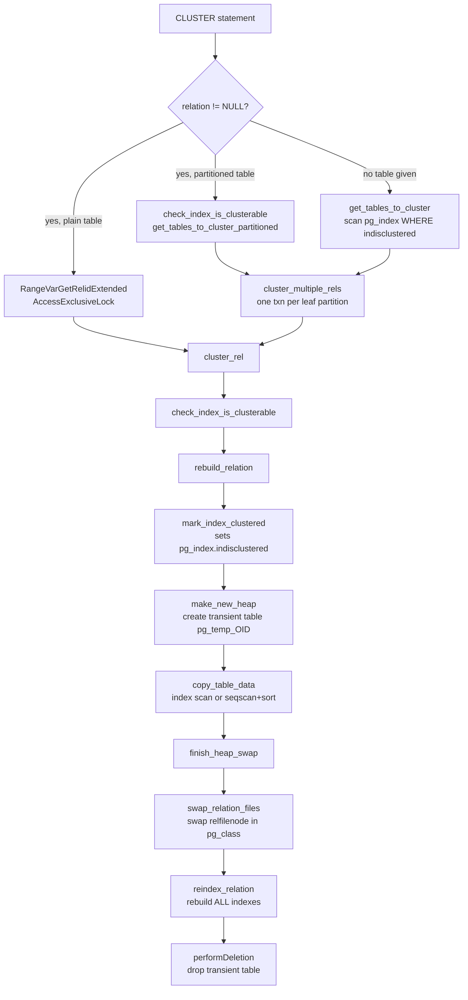
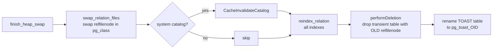

`CLUSTER` rewrites an entire heap in the physical order defined by one of its B-tree indexes, then drops the old storage. It is not an incremental or background operation — CLUSTER locks the table fully and rebuilds it from scratch inside a single transaction.

## Syntax

```sql
-- Cluster using a specific index (also marks that index as the clustered one)
CLUSTER my_table USING my_index;

-- Re-cluster using the previously recorded clustering index
CLUSTER my_table;

-- Re-cluster every table in the database that has indisclustered set
CLUSTER;

-- VERBOSE shows per-relation progress
CLUSTER VERBOSE my_table USING my_index;
```

The index named in `USING` must be a non-partial, valid index whose access method has `amclusterable = true`. Only B-tree indexes satisfy this today; GIN, GiST, BRIN, Hash, and SP-GiST all refuse. PostgreSQL rejects partial indexes because they may not cover every row. Covering the remainder would require a separate sequential scan pass.

## High-Level Flow



## Invocation Modes

The top-level function `cluster()` in `src/backend/commands/cluster.c` handles three distinct invocation modes:

1. **Single named table** — locks immediately with `AccessExclusiveLock`, calls `cluster_rel()` in the current transaction.
2. **Named partitioned table** — resolves all leaf partitions via `get_tables_to_cluster_partitioned()`, then processes each in a separate transaction through `cluster_multiple_rels()`.
3. **No table given** — scans `pg_index` for rows with `indisclustered = true` and owned by the current user, processes each in its own transaction.

The multi-relation path requires `PreventInTransactionBlock` — you cannot run a bare `CLUSTER` (no table name) inside an explicit `BEGIN` block. This mirrors VACUUM's behaviour for the same reason: holding `AccessExclusiveLock` on dozens of tables simultaneously is a deadlock invitation.

```c
typedef struct
{
    Oid tableOid;
    Oid indexOid;
} RelToCluster;
```

`RelToCluster` is a minimal struct. PostgreSQL allocates the list in a long-lived `MemoryContext` so it survives across the per-table transaction boundaries.

## Per-relation clustering logic

The common workhorse for all three invocation modes (`cluster_rel()`, `cluster.c`) handles the following responsibilities:

- Acquires `AccessExclusiveLock` on the heap (and index, inside `check_index_is_clusterable`).
- Switches to the table owner's user ID with `SECURITY_RESTRICTED_OPERATION` so index expression functions run as the table owner, not the caller.
- Calls `TransferPredicateLocksToHeapRelation()` — this promotes all tuple-level and page-level predicate locks to relation-level locks, because every tuple's physical location will change.
- Delegates to `rebuild_relation()`.

The `recheck` flag (set for multi-table paths) re-validates ownership and `indisclustered` between transactions — a concurrent `DROP TABLE` or `ALTER INDEX` can render a stale entry invalid between the scan and the per-table transaction.

## Two-Phase Rewrite

### Phase 1: Building the New Heap

`rebuild_relation()` calls `make_new_heap()` to create a transient table named `pg_temp_<OID>` in the same namespace and tablespace as the original, using `heap_create_with_catalog()`. Crucially:

- The new table inherits `reloptions` (including `fillfactor`) from the original.
- It does **not** inherit constraints or defaults — they are never needed on a transient heap.
- `make_new_heap()` creates a new [[subsystems/storage/toast|TOAST]] table if the original has one.
- The new heap's OID is a fresh value; its `relfilenode` is what matters.

Then `copy_table_data()` fills the new heap.

### Scan Strategy Decision

For B-tree clustering indexes, `copy_table_data()` invokes `plan_cluster_use_sort()` in `src/backend/optimizer/plan/planner.c`. This constructs a minimal dummy planner state and compares:

- Cost of an index scan over the old heap (reads tuples in index order, incurring random I/O into the heap).
- Cost of a sequential scan over the old heap followed by an in-memory `tuplesort_begin_cluster()`.

```c
if (OldIndex != NULL && OldIndex->rd_rel->relam == BTREE_AM_OID)
    use_sort = plan_cluster_use_sort(OIDOldHeap, OIDOldIndex);
else
    use_sort = false;
```

Non-B-tree indexes (were they ever supported) would always use index scan. If `enable_indexscan = off`, `plan_cluster_use_sort()` short-circuits to `true`. The sort path uses `maintenance_work_mem`; for large tables on fast disks, the index-scan path is often faster because it avoids materialising the entire table in memory.

### Tuple copying via the Table AM

`copy_table_data()` dispatches the actual tuple copying through the Table AM API as `table_relation_copy_for_cluster()`, which resolves to `heapam_relation_copy_for_cluster()` in `src/backend/access/heap/heapam_handler.c`.

This function:

1. Opens a `RewriteState` via `begin_heap_rewrite()`.
2. Scans the old heap via index scan (`index_beginscan`) or sequential scan depending on `use_sort`.
3. For each live or recently-dead tuple, calls `rewrite_heap_tuple()`.
4. Finalises with `end_heap_rewrite()`. This flushes buffered pages to the new heap's smgr file.

The scan uses `SnapshotAny` and reads all tuple versions, including recently-dead ones. `HeapTupleSatisfiesVacuum` decides what to do:

| Tuple State | Action |
|---|---|
| `HEAPTUPLE_LIVE` | Copy to new heap |
| `HEAPTUPLE_RECENTLY_DEAD` | Copy (needed for update chains) |
| `HEAPTUPLE_DEAD` | Skip (counted in `tups_vacuumed`) |
| `HEAPTUPLE_INSERT_IN_PROGRESS` | Copy (we hold the lock; this is our own xact) |
| `HEAPTUPLE_DELETE_IN_PROGRESS` | Copy |

### Freeze-on-Rewrite

Because every tuple is visited, `copy_table_data()` aggressively freezes transaction IDs. It calls `vacuum_get_cutoffs()` (same logic VACUUM uses) to compute `FreezeLimit` and `MultiXactCutoff`. Then `rewrite_heap_tuple()` calls `heap_freeze_tuple()` on each copied tuple. The resulting `relfrozenxid` is the new `FreezeLimit`. The table carries this value forward.

This means `CLUSTER` resets the anti-wraparound clock, just like `VACUUM FREEZE`.

### HOT Chains and fillfactor

`rewrite_heap_tuple()` explicitly clears the HOT status bits (`HEAP_HOT_UPDATED`, `HEAP_ONLY_TUPLE`) when copying tuples into the new heap:

```c
/* intentionally clear the HOT status bits */
new_tuple->t_data->t_infomask2 &= ~HEAP2_XACT_MASK;
```

The new heap contains no HOT chains at all — every tuple is a fresh root. This is intentional and correct: HOT chains are a physical layout optimisation tied to page locations. All those locations have changed.

The new heap respects `fillfactor`. Inside `raw_heap_insert()` (called by `rewrite_heap_tuple()`), CLUSTER fills each page to `RelationGetTargetPageFreeSpace(new_rel, HEAP_DEFAULT_FILLFACTOR)`, leaving the configured free space for future updates. A table with `fillfactor = 70` written by CLUSTER will have 30% of each page reserved, just as if tuples had been inserted normally.

### Phase 2: The Heap Swap

After `copy_table_data()` returns, `finish_heap_swap()` orchestrates the atomic swap:



#### The Atomic relfilenode Swap

This is the critical atomic step (`swap_relation_files()`, `cluster.c`). It opens both `pg_class` rows and swaps:
- `relfilenode`
- `reltablespace`
- `relam` (access method)
- `relpersistence`
- TOAST links (when swapping by links)
- Size statistics: `relpages`, `reltuples`, `relallvisible`
- `relfrozenxid` and `relminmxid` are updated on the original table's row to the values computed during the copy.

The OID of the table never changes. Grants, ownership, dependencies, foreign keys, and inheritance relationships all survive intact — they reference the OID, not the file.

For mapped relations (certain system catalogs), `pg_class.relfilenode` is zero. The mapping instead lives in the relation map file. `swap_relation_files()` calls `RelationMapUpdateMap()` instead.

```c
swaptemp = relform1->relfilenode;
relform1->relfilenode = relform2->relfilenode;
relform2->relfilenode = swaptemp;
/* also swap reltablespace, relam, relpersistence ... */
```

After the swap, the original table OID now points to the new file (with ordered data). The transient OID points to the old file, which will be deleted.

#### Index Rebuild

`finish_heap_swap()` calls `reindex_relation()` with `REINDEX_REL_SUPPRESS_INDEX_USE`. `reindex_relation()` rebuilds **all** indexes, not just the clustering index. This is unavoidable — every tuple has a new physical location (`ctid`), so every index entry is stale. `reindex_relation()` never sets the `indcheckxmin` flag during this rebuild because the new heap contains no broken HOT chains.

The rebuild uses `maintenance_work_mem` per index, same as a standalone `REINDEX`.

#### Drop of Transient Table

`performDeletion()` drops the transient heap (which now holds the old data). This removes both the catalog entries and the physical file. If the transaction aborts before this point, the old file is still intact under its original OID. PostgreSQL rolls back the swap automatically.

## Catalog State After CLUSTER

| pg_class column | Effect |
|---|---|
| `oid` | Unchanged |
| `relfilenode` | Points to newly written file |
| `relfrozenxid` | Advanced to freeze cutoff computed during copy |
| `relminmxid` | Similarly advanced |
| `relpages` | Updated to reflect new file |
| `reltuples` | Updated |
| `relallvisible` | Reset to 0 (no pages are all-visible yet) |

| pg_index column | Effect |
|---|---|
| `indisclustered` | Set true on the clustering index, false on all others |
| `indisvalid` | All indexes rebuilt; all valid after commit |

The `indisclustered` flag is the only persistent record of which index was used. Running `CLUSTER my_table` (no index) reads this flag to find the target.

## Lock Requirements

`CLUSTER` acquires `AccessExclusiveLock` on the table (and `AccessExclusiveLock` on the index inside `check_index_is_clusterable`) for the entire duration of the rewrite. No other session can read or write the table while CLUSTER is running. This is a hard requirement: PostgreSQL must serialise the rewrite against all concurrent access.

The TOAST table also receives `AccessExclusiveLock` early in `copy_table_data()` to prevent [[subsystems/background/autovacuum|autovacuum]] from removing TOAST rows that the rewrite considers recently-dead and needs to copy.

Autovacuum will not attempt to start on a table that it cannot lock. If CLUSTER is running, autovacuum skips the table for that cycle.

## Partitioned Tables

CLUSTER on a partitioned table (`RELKIND_PARTITIONED_TABLE`) never processes the partitioned table itself — it has no heap storage. Instead `get_tables_to_cluster_partitioned()` walks the index inheritance tree via `find_all_inheritors()` and collects all leaf `RELKIND_INDEX` entries along with their corresponding heap OIDs. `cluster_multiple_rels()` then clusters each leaf partition individually in its own transaction.

```sql
-- Clusters all leaf partitions using corresponding partition indexes
CLUSTER orders USING orders_created_at_idx;
```

## Re-clustering

Once `indisclustered` is set, future invocations without an index name will use it:

```sql
-- First CLUSTER: specify index, sets indisclustered
CLUSTER orders USING orders_created_at_idx;

-- Later, after many updates have scattered rows:
CLUSTER orders;  -- uses the stored indisclustered index
```

PostgreSQL does not maintain this state automatically. PostgreSQL has no concept of an automatically maintained clustered index (unlike SQL Server's clustered index or MySQL's InnoDB primary key ordering). The physical ordering decays as rows are updated and new pages are appended.

## CLUSTER vs VACUUM FULL

`cluster_rel()` is also the implementation of `VACUUM FULL`. When called with `indexOid = InvalidOid`, it performs the same two-phase rewrite without sorting, resulting in a heap compacted in heap-scan order (roughly sequential by insertion time). The `PROGRESS_CLUSTER_COMMAND` field in `pg_stat_progress_cluster` distinguishes the two:

| `command` value | Meaning |
|---|---|
| `1` | CLUSTER |
| `2` | VACUUM FULL |

Both call `make_new_heap()`, `copy_table_data()`, and `finish_heap_swap()`. The code path diverges only in whether an index OID is passed and whether `plan_cluster_use_sort()` is called.

## Monitoring with pg_stat_progress_cluster

Since PostgreSQL 12, `pg_stat_progress_cluster` tracks CLUSTER and VACUUM FULL progress:

```sql
SELECT
    pid,
    relid::regclass AS table,
    command,
    phase,
    heap_blks_total,
    heap_blks_scanned,
    heap_tuples_scanned,
    heap_tuples_written,
    index_rebuild_count
FROM pg_stat_progress_cluster;
```

The `phase` column cycles through these values as defined in `src/include/commands/progress.h`:

| Phase value | Constant | Description |
|---|---|---|
| 1 | `PHASE_SEQ_SCAN_HEAP` | Sequential scan of old heap (sort path) |
| 2 | `PHASE_INDEX_SCAN_HEAP` | Index scan of old heap |
| 3 | `PHASE_SORT_TUPLES` | Sorting tuples in memory |
| 4 | `PHASE_WRITE_NEW_HEAP` | Writing sorted tuples to new heap |
| 5 | `PHASE_SWAP_REL_FILES` | Swapping relfilenodes |
| 6 | `PHASE_REBUILD_INDEX` | Rebuilding all indexes |
| 7 | `PHASE_FINAL_CLEANUP` | Dropping transient table and renaming TOAST |

The scan only reaches the sort and write phases when `use_sort = true`. For the index-scan path, phase 2 and phase 4 overlap.

## Performance Characteristics

**When CLUSTER helps:**

A range scan like `WHERE created_at BETWEEN '2024-01-01' AND '2024-06-01'` on a table where rows are physically scattered requires one buffer read per row. After clustering on `created_at`, the same rows sit in contiguous pages, so the scan reads only as many 8 kB pages as the data fills, with minimal random I/O.

The benefit decays over time as updates scatter rows again. Tables with a high update rate on the clustering key see diminishing returns quickly.

**When CLUSTER is expensive:**

- CLUSTER locks the table for the entire duration — unacceptable for high-availability tables without maintenance windows.
- CLUSTER rebuilds all indexes: a table with ten indexes incurs ten full index builds after the heap is written.
- The temporary heap requires roughly as much free space as the table itself.
- Large tables may need the sort to spill to `temp_file_limit` if `maintenance_work_mem` is insufficient.

**Estimating lock duration:**

```sql
-- Rough estimate: heap size + index build time
SELECT
    pg_size_pretty(pg_table_size(oid)) AS heap_size,
    pg_size_pretty(pg_indexes_size(oid)) AS index_size,
    pg_size_pretty(pg_total_relation_size(oid)) AS total_size
FROM pg_class
WHERE relname = 'my_table';
```

## Interaction with Logical Replication

`finish_heap_swap()` calls `begin_heap_rewrite()` / `end_heap_rewrite()`. These interact with logical replication state. The rewrite machinery tracks which old CTIDs map to new CTIDs through two in-memory hash tables (`unresolved_tups` and `old_new_tid_map`) so that update chains in the heap are correctly re-linked in the new file. Logical decoding does not need to follow this path. However, `raw_heap_insert()` logs the WAL it emits — writing entire pages as `FPI` records — so physical standbys stay consistent.

## Constraints and Limitations

- Cannot cluster a **partial index** (predicate is non-null). This would leave some rows without a natural home in the sort order.
- Cannot cluster a **shared catalog** (`pg_authid`, etc.). The `indisclustered` bit is per-database, which would create an inconsistency across databases.
- Cannot cluster **temporary tables of other sessions**.
- Cannot cluster a **materialized view** that has not been populated.
- Cannot cluster inside an explicit transaction block when using the no-table form (`CLUSTER;`).
- The access method must advertise `amclusterable = true` (checked via `rd_indam->amclusterable`).

## Related Topics

- [[code-paths/vacuum|VACUUM]] — VACUUM FULL reuses the same two-phase heap rewrite machinery as CLUSTER, differing only in the absence of index-ordered sorting
- [[code-paths/reindex|REINDEX]] — CLUSTER triggers a full `reindex_relation()` call after the heap swap; understanding REINDEX explains the per-index cost
- [[subsystems/storage/heap|Heap Storage]] — the physical heap file format that CLUSTER reads, rewrites, and swaps in two phases
- [[subsystems/storage/toast|TOAST]] — CLUSTER creates a new TOAST table alongside the new heap and locks the old one during the copy to prevent concurrent autovacuum interference
- [[subsystems/transactions/mvcc|MVCC]] — CLUSTER's `SnapshotAny` scan and `HeapTupleSatisfiesVacuum` tuple visibility logic are rooted in MVCC semantics
- [[subsystems/locking/overview|Locking Overview]] — CLUSTER acquires `AccessExclusiveLock` for the full duration, blocking all concurrent readers and writers
- [[subsystems/storage/fillfactor|Fillfactor]] — the rewritten heap respects the table's fillfactor setting, leaving configured free space on each page for future updates
- [[code-paths/create-index|CREATE INDEX]] — index creation, which CLUSTER also drives internally through `reindex_relation()` when rebuilding indexes on the new heap
- [[code-paths/refresh-materialized-view|REFRESH MATERIALIZED VIEW]] — another command that uses `finish_heap_swap()` for its swap step, following the same two-phase rewrite-and-swap pattern as CLUSTER
