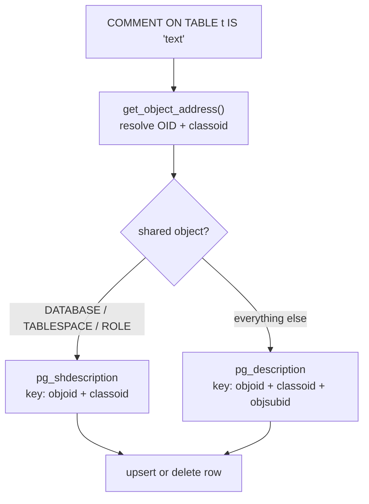

`COMMENT ON` attaches a human-readable description to any database object — table, column, function, index, schema, role, database, and dozens of other object types. The comment has no effect on query execution. Its value is as structured documentation that survives schema migrations. Client tools surface it automatically.

## Where comments live

PostgreSQL stores comments in two system catalogs, not in the object's own catalog row. `pg_description` records comments for per-database objects (tables, columns, functions, indexes, schemas, sequences, types, etc.). Cluster-wide shared objects — databases, tablespaces, and roles — use `pg_shdescription` instead. This catalog lives in the global catalog directory, and every database in the cluster shares it.

Both catalogs share the same keying strategy: each row identifies its subject by the object's OID (`objoid`) together with the OID of the catalog that owns that object (`classoid`, e.g. `pg_class` OID for relations). `pg_description` adds a third key column, `objsubid`, to identify sub-objects. For column comments, `objsubid` holds the column's `attnum`. For the relation itself, `objsubid` is zero. This three-column key means a single table can have one comment for the table and independent comments for each of its columns, all stored as ordinary rows in the same catalog.

The design avoids adding a comment column to every system catalog. `pg_class`, `pg_proc`, `pg_attribute`, and the others remain compact. `pg_description` is a pure side-table. Readers can ignore it entirely when comments are not needed.

## Object resolution and ownership checks

Before touching either catalog, PostgreSQL must resolve the target object's OID from the name the user provided. `get_object_address()` (`objectaddress.c`) centralises this resolution. It knows how to look up every supported object type: it queries `pg_class` for relations, `pg_proc` for functions, `pg_attribute` for columns, and so on. As a side effect it acquires a `ShareUpdateExclusiveLock` on the target, preventing a concurrent `DROP` from removing the object before the comment is recorded.

PostgreSQL enforces ownership immediately after resolution. Only the object owner or a superuser may attach a comment. `check_object_ownership()` raises an error for anyone else. This check precedes the catalog write, so unprivileged users never touch `pg_description`.

Columns are the one object type with an additional integrity constraint. PostgreSQL permits comments only on columns of relations that pg_dump knows how to handle: ordinary tables, views, materialized views, composite types, foreign tables, and partitioned tables. PostgreSQL explicitly excludes index columns because index column names can change across PostgreSQL versions. A per-column comment tied to an index column number could then fail to reload correctly after a dump/restore cycle.

## Upsert semantics and clearing comments

The write path is an upsert. PostgreSQL scans `pg_description` by the three-part index key. If the scan finds an existing row and the command supplies a non-empty comment string, PostgreSQL updates the row in place. If the comment string is `NULL` or empty, PostgreSQL deletes the existing row instead. If no row exists and the command supplies a comment string, PostgreSQL inserts a new row.

`COMMENT ON ... IS NULL` is therefore the canonical way to remove a comment. PostgreSQL treats an empty string (`IS ''`) identically to `NULL`. It also removes any existing row this way. After a delete, querying `obj_description()` returns `NULL` rather than an empty string. This is the intended contract: absence of a row means absence of a comment.

PostgreSQL uses this same delete logic internally when an object is dropped. The DROP machinery calls `DeleteComments()` to clean up `pg_description` rows for the dropped object, preventing orphaned comment rows from accumulating. When `subid` is zero, `DeleteComments()` removes all rows matching the object's OID and classoid (the whole object). When `subid` is non-zero, it removes only the sub-object's row (a single column, for example).

## Reading comments back

PostgreSQL exposes two SQL-callable helper functions for reading comments without querying the system catalogs directly:

- `obj_description(oid, catalog_name)` returns the comment for any object given its OID and the name of its owning catalog (`'pg_class'`, `'pg_proc'`, etc.).
- `col_description(table_oid, column_number)` is a shorthand for column comments, taking the table OID and the `attnum`.

These functions wrap the same index scan that `GetComment()` performs internally. `psql`'s `\d` family of commands uses `col_description()` to show column comments inline in the table description output. GUI tools such as pgAdmin and DBeaver call the same functions or query `pg_description` directly to populate their object-property panels and generate hover tooltips.

The SQL standard `information_schema` does not expose `pg_description` directly. Many ORMs and documentation generators instead read it through `obj_description()` or through direct catalog queries, to produce API documentation from the database schema.

## Shared-object comments and the global catalog

The split between `pg_description` and `pg_shdescription` mirrors the broader PostgreSQL distinction between per-database and cluster-wide state. A role or tablespace is visible to all databases in a cluster. PostgreSQL must therefore store its comment somewhere all databases can read: `pg_shdescription`. This catalog resides in `$PGDATA/global/` alongside `pg_authid` and other shared catalogs.

The practical consequence is that `pg_dump` and `pg_dumpall` handle the two catalogs differently. `pg_dump` includes per-database comments in individual database dumps. Only `pg_dumpall` (or the `--globals-only` flag) emits role and tablespace comments, because they belong to the cluster rather than any single database.

## Related Topics

- [[subsystems/catalog/core-catalogs|System Catalog Overview]]
- [[code-paths/drop-commands]]
