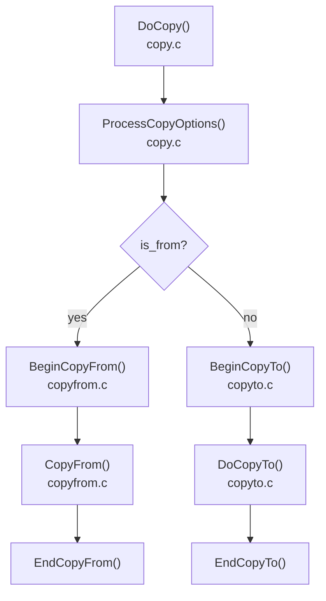
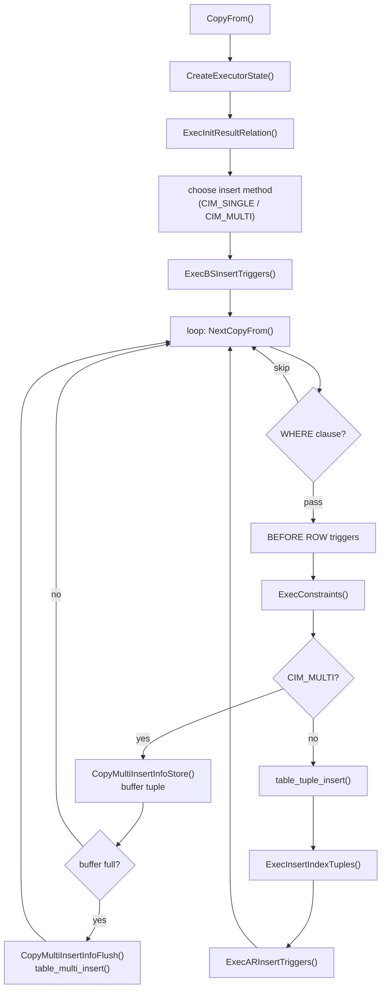
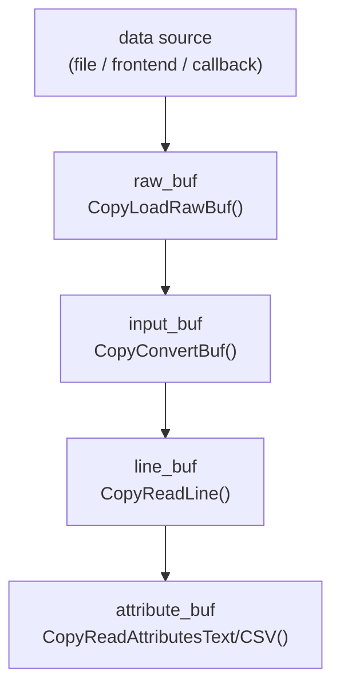
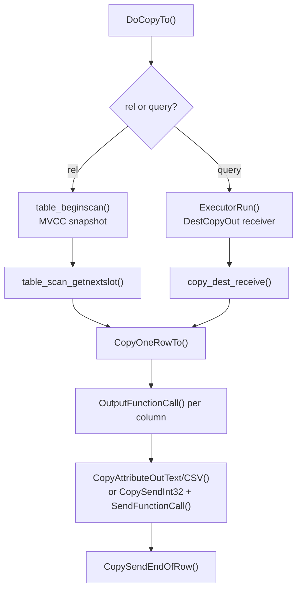

# COPY FROM / COPY TO Code Paths

`COPY` is PostgreSQL's bulk data transfer mechanism. `COPY FROM` loads rows from a file, program, or client stream into a table; `COPY TO` exports rows from a table or query result to a file, program, or client stream. Both directions share a common entry point and option-parsing layer but diverge into entirely separate code paths for the actual data movement.

## Entry point and shared setup

`DoCopy()` in `src/backend/commands/copy.c` is the single entry point for the SQL `COPY` statement. It handles:

- **Privilege checks**: file-based COPY requires the `pg_read_server_files` or `pg_write_server_files` role. Program-based COPY requires `pg_execute_server_program`.
- **Lock acquisition**: `COPY FROM` acquires `RowExclusiveLock`. `COPY TO` acquires `AccessShareLock`. Neither takes an exclusive lock on the table. Concurrent reads and DML proceed while a COPY runs.
- **RLS rewriting**: when row-level security is enabled on the target, `DoCopy()` silently rewrites `COPY TO` into a query-based `COPY (SELECT ...) TO`. This lets the rewriter inject the security policies. `DoCopy()` rejects `COPY FROM` outright if RLS is active.
- **Option parsing**: `ProcessCopyOptions()` normalises the `FORMAT`, `DELIMITER`, `NULL`, `QUOTE`, `ESCAPE`, `HEADER`, `FREEZE`, `ENCODING`, and related options into a `CopyFormatOptions` struct. `ProcessCopyOptions()` rejects incompatible combinations (e.g. `BINARY` with `DELIMITER`) here. **PostgreSQL 17:** `ProcessCopyOptions()` also handles the new `ON_ERROR`, `LOG_VERBOSITY`, and wildcard forms of `FORCE_NULL` / `FORCE_NOT_NULL` introduced in that release. **PostgreSQL 18:** `ProcessCopyOptions()` parses `REJECT_LIMIT` here as a companion to `ON_ERROR = ignore`.

---

## COPY FROM

### Initialising the ingestion state

Before it reads any rows, COPY FROM resolves everything it will need per-column and allocates its working buffers (`BeginCopyFrom()`, `copyfrom.c`). For each physical attribute, `BeginCopyFrom()` looks up and caches the appropriate type conversion function. Text and CSV modes use the type's text input function (via `getTypeInputInfo()`). Binary mode uses the binary receive function (via `getTypeBinaryInputInfo()`). `BeginCopyFrom()` stores these `FmgrInfo` pointers in `cstate->in_functions[]`. This makes per-row conversion a direct function dispatch with no catalog lookups in the hot loop.

`BeginCopyFrom()` initialises the default-expression `ExprState` here via `ExecInitExpr()` for columns absent from the input column list and for any column flagged with the `DEFAULT` marker. This makes default evaluation during ingestion as cheap as any other expression evaluation.

`BeginCopyFrom()` allocates two 64 kB I/O buffers. `raw_buf` always holds the bytes read from the source. `input_buf` is a separate buffer used only when encoding conversion is required. `BeginCopyFrom()` aliases `input_buf` to `raw_buf` when the source and database encodings match. `BeginCopyFrom()` opens the source itself as a `FILE *`, a `popen()` pipe, a frontend protocol stream, or a callback, depending on the command.

**PostgreSQL 17:** `FORCE_NULL *` and `FORCE_NOT_NULL *` wildcard syntax applies the null-handling option to all columns at once. This eliminates the need to enumerate every column name. `ProcessCopyOptions()` expands the wildcard during option parsing and stores it in `CopyFormatOptions` before `BeginCopyFrom()` runs. As a result, the per-column initialisation loop sees no structural difference.

### The ingestion loop and insert strategy

The ingestion loop (`CopyFrom()`, `copyfrom.c`) sets up an `EState` and `ResultRelInfo`, opens indexes, fires `BEFORE STATEMENT` triggers, and then reads rows until the source is exhausted. `CopyFrom()` selects one of two insertion strategies once at the start:

- **`CIM_MULTI`**: `CopyFrom()` accumulates tuples in a buffer and writes them to the heap in batches via `table_multi_insert()`. This is the normal path.
- **`CIM_SINGLE`**: `CopyFrom()` inserts each tuple individually via `table_tuple_insert()`. This is a fallback required when certain triggers or other conditions are present (see the batch insert section below).

### The text and CSV parsing pipeline

`src/backend/commands/copyfromparse.c` handles parsing. The raw bytes from the source travel through four distinct buffers before becoming typed `Datum` values, each stage handling a progressively more structured view of the data:

`CopyLoadRawBuf()` reads up to 64 kB from the source into `raw_buf` via `CopyGetData()`. When encoding conversion is required, `CopyConvertBuf()` converts `raw_buf` bytes from the file encoding to the database encoding and writes the result into `input_buf`. When no conversion is needed, `input_buf` and `raw_buf` are the same physical buffer. In that case `CopyConvertBuf()` only validates encoding.

Line extraction (`CopyReadLineText()`, called from `CopyReadLine()`) scans `input_buf` byte by byte, tracking quote and escape state for CSV, until it finds a line terminator (`\n`, `\r`, or `\r\n`). The complete line lands in `line_buf`. `CopyReadLineText()` detects the end-of-copy marker `\.` at this stage and signals EOF.

Field splitting then walks `line_buf`, splitting on the delimiter. In text mode, `CopyReadAttributesText()` de-escapes backslash sequences. In CSV mode, `CopyReadAttributesCSV()` handles quoted fields and doubled-quote escapes. Field splitting stores the resulting field strings in `attribute_buf` and points to them from `cstate->raw_fields[]`. If a field exactly matches `null_print`, field splitting records it as NULL. When the `DEFAULT` option is active, field splitting flags a field that matches `default_print`. This flag triggers default-expression evaluation instead of calling the type input function.

The loop processes the entire input buffer in chunks rather than one character at a time. It flushes to `line_buf` only when the buffer needs refilling. This avoids per-character overhead in the tight inner loop.

### Binary format parsing

Binary COPY bypasses the text pipeline entirely — there is no `line_buf`. Each row begins with a 16-bit field count in `raw_buf` (or `-1` for the EOF marker). For each field, a 32-bit length prefix (or `-1` for NULL) precedes that many bytes of data. Type conversion uses `ReceiveFunctionCall()` — the type's binary receive function — rather than the text `InputFunctionCall()`.

The binary format begins with the signature `PGCOPY\n\377\r\n\0` followed by 4-byte flags and a 4-byte extension-area length. `COPY TO BINARY` writes the same signature.

### Type conversion

`NextCopyFrom()` (`copyfromparse.c`) converts each parsed field string to a typed `Datum` by calling the type's text input function — `int4in`, `timestamptz_in`, and so on — via `InputFunctionCall()` with the raw field string, the type's element OID, and `atttypmod`. It places the result directly into the slot's `tts_values[]` array. NULL fields skip the call and set `tts_isnull[]` instead. `NextCopyFrom()` fills columns absent from the input column list from their default expression via `ExecEvalExpr()`, or leaves them NULL if no default exists.

This is the same `InputFunctionCall()` path used by [[code-paths/insert]] for each value expression. The difference is that COPY exercises it for every field of every row in a tight loop with no expression-planning overhead beyond the function dispatch itself.

### Batch insertion

Rather than inserting each row individually, COPY FROM normally accumulates tuples in a `CopyMultiInsertBuffer` and flushes them in batches (`src/backend/commands/copyfrom.c`). The buffer holds up to `MAX_BUFFERED_TUPLES` (1000) tuples, or `MAX_BUFFERED_BYTES` (65535 bytes of input), in a `TupleTableSlot *slots[]` array before it flushes via `CopyMultiInsertBufferFlush()`.

On flush, `table_multi_insert()` — `heap_multi_insert()` for the heap AM — packs multiple tuples onto a single page, acquires and releases the page lock once for the entire batch, and writes a single `XLOG_HEAP2_MULTI_INSERT` WAL record covering the whole batch rather than one record per row. This is the primary source of COPY's throughput advantage over individual `INSERT` statements.

For partitioned tables, COPY FROM maintains a separate `CopyMultiInsertBuffer` per leaf partition, with up to `MAX_PARTITION_BUFFERS` (32) live simultaneously, so it batches tuples routed to different partitions independently.

COPY FROM disables multi-insert — falling back to `CIM_SINGLE` with `table_tuple_insert()` — when:

- The table has any `BEFORE ROW INSERT` or `INSTEAD OF INSERT` triggers.
- The target is a foreign table whose FDW does not support batch insertion.
- There are statement-level insert triggers on a partitioned table.
- Any column has a volatile default expression (other than `nextval()`).
- The `WHERE` clause contains a volatile function.

COPY FROM uses the `CIM_MULTI_CONDITIONAL` path for partitioned tables when it does not yet know whether a given leaf partition will be eligible for batching. It makes that determination per partition when the first tuple routes there.

### The COPY FREEZE optimisation

When you specify `COPY ... WITH (FREEZE)`, COPY FROM marks inserted tuples as already frozen — it sets their `xmin` to the `FrozenTransactionId` epoch using `HeapTupleHeaderSetXminFrozen()`. This means subsequent VACUUM passes will not need to visit these pages to advance the freeze horizon. The tuples also become immediately visible to all transactions without any MVCC visibility check overhead.

The optimisation is only legal under tight conditions, all checked in `CopyFrom()`:

1. The relation must have been created or truncated in the **current subtransaction** (checked via `rd_createSubid` or `rd_newRelfilelocatorSubid`). This guarantees no pre-existing data on the pages.
2. There must be **no prior registered snapshots** in the session (checked via `ThereAreNoPriorRegisteredSnapshots()`) and no open portals with active queries (checked via `ThereAreNoReadyPortals()`). This rules out scenarios where another transaction or query in the same session could see the frozen rows at an unexpected point.
3. COPY FROM explicitly rejects partitioned tables for FREEZE, because it has not yet checked the partitions.

When conditions are met, COPY FROM passes `ti_options |= TABLE_INSERT_FROZEN` down to `table_multi_insert()`. In `heap_multi_insert()`, if the page being written started empty (`starting_with_empty_page` is true), the function sets `all_frozen_set` and marks the page with `PageSetAllVisible()`. This sets the all-visible flag in the [[subsystems/storage/visibility-map]], so sequential scans and index-only scans can skip the page's visibility check entirely.

Pages written with frozen tuples at `wal_level=minimal` skip WAL for the data (see the WAL section below). This is a further performance benefit of the freeze path in bulk-load scenarios.

### Trigger handling

COPY fires triggers, but not in the same way for all trigger types:

- `BEFORE STATEMENT` (`ExecBSInsertTriggers()`) fires once before the first row is processed.
- `BEFORE ROW` (`ExecBRInsertTriggers()`) fires per row. Its presence forces `CIM_SINGLE` mode, disabling multi-insert. The trigger function may query the table being loaded. If already-parsed but not-yet-inserted tuples were buffered, it would see inconsistent state.
- COPY calls `AFTER ROW` (`ExecARInsertTriggers()`) after the batch flush in multi-insert mode, or immediately after the single-row insert in `CIM_SINGLE` mode.
- `AFTER STATEMENT` (`ExecASInsertTriggers()`) fires once after COPY processes all rows. `AfterTriggerEndQuery()` also fires any deferred after-row triggers at that point.
- COPY also supports `INSTEAD OF INSERT` triggers (on views); their presence forces `CIM_SINGLE`.

### Constraint checking

`ExecConstraints()` verifies `NOT NULL`, `CHECK`, and `DOMAIN` constraints for each row before COPY stores the row in the multi-insert buffer or hands it to `table_tuple_insert()`. These are immediate constraints: they raise an error on the spot.

The after-trigger machinery enqueues foreign key constraints implemented as deferred triggers. They fire when `AfterTriggerEndQuery()` runs at the end of the COPY command, or when the constraint is explicitly set to immediate. During a large COPY, PostgreSQL therefore reports FK violations only after the entire load completes, not row by row.

### Error handling

COPY stops on the first error it encounters. COPY pushes the error callback `CopyFromErrorCallback()` onto `error_context_stack` before the main loop runs. This ensures any error includes the relation name, line number, column name, and (for text/CSV) the offending field value.

**PostgreSQL 17:** `ON_ERROR = ignore` changes this behaviour: COPY skips rows that fail type conversion or constraint checks, rather than aborting the command. The `tuples_skipped` counter, added to `pg_stat_progress_copy`, tracks the skipped-row count. The `LOG_VERBOSITY` option controls whether each skipped row emits a `DEBUG` log message (`LOG_VERBOSITY = verbose`, the default when `ON_ERROR = ignore`) or not. In PostgreSQL 16 and earlier, every parse error, type conversion failure, or constraint violation terminates the entire COPY command.

**PostgreSQL 18:** `REJECT_LIMIT` sets an upper bound on tolerated errors when `ON_ERROR = ignore` is active. Once the number of skipped rows reaches the limit, the command aborts with an error, preventing a misconfigured load from silently discarding large volumes of data. `LOG_VERBOSITY = silent` suppresses all per-row error log output entirely, complementing the `verbose` and `default` levels introduced in PG17.

---

## COPY TO

### Preparing the output

`COPY TO` must accommodate two fundamentally different row sources: a direct heap scan when given a relation, and full query execution when given an arbitrary `SELECT`. `BeginCopyTo()` (`copyto.c`) handles both: for a relation, it derives the tuple descriptor from `RelationGetDescr()`; for a query, it runs parse analysis, rewriting (`pg_analyze_and_rewrite_fixedparams()`), planning (`pg_plan_query()`), and executor startup (`ExecutorStart()`). This is how `COPY (SELECT ...) TO` works — it runs a complete query and feeds the output into the COPY output path rather than returning it to the client.

For each attribute in the output column list, `BeginCopyTo()` looks up and caches the appropriate type output function: `getTypeOutputInfo()` for text and CSV modes, `getTypeBinaryOutputInfo()` for binary. Caching these `FmgrInfo` pointers avoids per-row catalog lookups during the export loop.

**PostgreSQL 18:** `COPY TO` can use a populated materialized view directly as its source, without needing to wrap it in a `SELECT`. `BeginCopyTo()` accepts a materialized view relation and opens its physical storage with the existing heap scan path, the same as a regular table.

### The export loop

The export loop (`DoCopyTo()`, `copyto.c`) drives row retrieval and serialisation through one of two mechanisms depending on the row source:

- For a **relation**, it opens a heap scan with the active MVCC snapshot (`GetActiveSnapshot()`) via `table_beginscan()`, then iterates with `table_scan_getnextslot()`.
- For a **query**, it runs `ExecutorRun()` with a `DestReceiver` of type `DestCopyOut`. The executor calls `copy_dest_receive()` for each output tuple.

Both paths converge on `CopyOneRowTo()` for every row, regardless of source. The heap scan uses the `AccessShareLock` acquired in `DoCopy()` and the MVCC snapshot, so it sees exactly the rows visible at the snapshot instant, regardless of concurrent inserts or deletes — standard [[subsystems/transactions/mvcc]] behaviour.

### Output serialisation

For each non-null value, `CopyOneRowTo()` converts the `Datum` to its text representation using the type's output function via `OutputFunctionCall()` — the symmetric inverse of the `InputFunctionCall()` used during ingestion.

**Text mode**: `CopyAttributeOutText()` scans the string for characters that require backslash escaping (`\n`, `\t`, `\\`, the delimiter, etc.). It emits safe character runs in bulk to avoid per-character overhead.

**CSV mode**: `CopyAttributeOutCSV()` quotes a field if it contains the delimiter, the quote character, a newline, or matches the null string. If quoting is needed, it wraps the field in the quote character and doubles any embedded quote or escape characters.

**Binary mode**: `CopyOneRowTo()` uses `SendFunctionCall()` in place of `OutputFunctionCall()`, returning a `bytea`. `CopySendInt32()` emits the 32-bit length, followed by the raw bytes.

COPY accumulates all output in `cstate->fe_msgbuf` (a `StringInfo`) and flushes it atomically at the end of each row via `CopySendEndOfRow()`, which writes to the file, sends a protocol `CopyData` message to the frontend, or invokes the callback, as appropriate.

---

## Shared aspects

### Lock mode

`COPY FROM` holds `RowExclusiveLock` — the same lock acquired by `INSERT`. It does not block concurrent reads (`SELECT`) or other writes to different rows. `COPY TO` holds `AccessShareLock`. This blocks only DDL that requires `AccessExclusiveLock`. Neither form of COPY creates a table-level bottleneck under normal concurrent workloads.

### WAL and the wal_level=minimal bypass

COPY generates WAL. There is no special fsync bypass. However, the amount of WAL written depends on conditions:

- Under `wal_level >= replica` (the default), every inserted page gets a full WAL record. `heap_multi_insert()` emits a single `XLOG_HEAP2_MULTI_INSERT` record per page batch. This is more compact than one record per row.
- Under `wal_level = minimal`, the `RelationNeedsWAL()` macro returns `false` for relations that were created or truncated in the current transaction (checked via `rd_createSubid` and `rd_firstRelfilelocatorSubid`). In that case, `needwal` is false in `heap_multi_insert()`, and it writes no WAL records for the data pages at all. If crash recovery is needed, PostgreSQL re-creates the relation from scratch. The data WAL would therefore be redundant. This is the only scenario where COPY avoids WAL writes. It requires both `wal_level=minimal` and loading into a table that was created in the same transaction.

See `src/include/utils/rel.h` for the `RelationNeedsWAL` macro definition and `src/backend/access/transam/README` for the full explanation of the "Skipping WAL for New RelFileLocator" policy.

### Performance characteristics vs. INSERT

The performance gap between COPY and individual `INSERT` statements has several sources:

| Factor | INSERT (per row) | COPY FROM |
|--------|------------------|-----------|
| Parse overhead | Full SQL parse per statement | Parse happens once (option parsing only) |
| Plan overhead | Planner runs per statement | No per-row planning |
| Heap insertion | `table_tuple_insert()` per row | `table_multi_insert()` per batch of up to 1000 |
| WAL records | One record per row | One record per page (many rows per page) |
| Index updates | `ExecInsertIndexTuples()` per row | Deferred until batch flush, same call |
| Buffer lock | Acquired and released per row | Held across entire page batch |

COPY is also faster than `INSERT ... VALUES (r1),(r2),...` multi-row inserts in most scenarios, because the text parsing pipeline is simpler than expression evaluation. COPY also manages the batch size automatically.

The freeze optimisation (`COPY ... WITH (FREEZE)`) adds further benefit for initial bulk loads: frozen tuples skip subsequent VACUUM freeze passes. Pages written entirely with frozen rows are immediately marked all-visible, allowing [[subsystems/storage/visibility-map]]-based skips in later scans.

---

## Related Topics

- [[code-paths/bulk-loading]] — higher-level bulk loading strategies that build on COPY, including pg_restore and logical replication apply
- [[code-paths/insert]] — the single-row insertion path that COPY FROM shares type-conversion and constraint-checking machinery with
- [[subsystems/storage/heap]] — heap page layout, `heap_multi_insert()`, and the `XLOG_HEAP2_MULTI_INSERT` WAL record that COPY FROM emits
- [[subsystems/transactions/mvcc]] — snapshot visibility rules that govern which rows COPY TO exports and how frozen tuples bypass xmin checks
- [[subsystems/storage/visibility-map]] — all-visible and all-frozen flags that COPY FREEZE sets, enabling subsequent index-only scans and VACUUM skips
- [[subsystems/wal/overview]] — WAL record structure and the `wal_level=minimal` bypass that eliminates data WAL for new-relation COPY loads
- [[subsystems/row-level-security]] — RLS enforcement that rewrites COPY TO into a SELECT and rejects COPY FROM on secured tables
