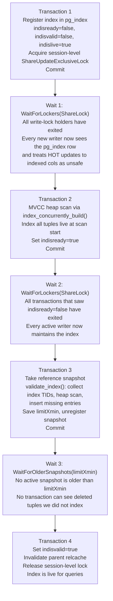

# CREATE INDEX

Building an index in PostgreSQL is a controlled, multi-step process. At its simplest it is a heap scan followed by a bulk load into index pages. At its most careful — `CREATE INDEX CONCURRENTLY` — it is a three-transaction, three-scan protocol designed to give correctness guarantees while never blocking normal DML for more than a moment.

Understanding this process matters for several reasons. Index builds are among the most resource-intensive operations a database performs. Their memory, I/O, and locking behaviour are all tunable. The concurrent variant has failure modes that demand operator attention. An interrupted concurrent build leaves behind an invalid index. The invalid index consumes write overhead but cannot serve queries until it is cleaned up. Both regular and concurrent builds also interact with heap visibility, HOT chains, and MVCC. These interactions have practical consequences for diagnosing unexpected behaviour.

## The locking fork: one decision drives everything

Before it touches any catalog entries, `DefineIndex()` (indexcmds.c) chooses a lock mode. That single decision determines the structure of the entire operation:

A **regular `CREATE INDEX`** acquires `ShareLock` on the table. ShareLock conflicts with `RowExclusiveLock`, the lock that INSERT, UPDATE, and DELETE hold. This means all writers must wait until the build finishes. The trade-off is simplicity. With no concurrent writers, the heap is perfectly stable throughout the scan. A single MVCC-free pass is then sufficient to produce a correct index. The build happens inside one transaction; the index either fully exists or does not.

**`CREATE INDEX CONCURRENTLY`** acquires only `ShareUpdateExclusiveLock`. This lock conflicts only with schema-change operations — DDL, VACUUM, another concurrent index build — so normal INSERT, UPDATE, and DELETE run freely the entire time. The price is a fundamentally different build structure: three separate transactions, two full heap scans, and three lock-drain waits before the index is live. On a busy production table, that can mean minutes of elapsed time versus seconds for a regular build on the same data.

Temporary tables always use the non-concurrent path even if `CONCURRENTLY` is specified. No other session can ever see a temporary table, so there is no point running a complex multi-transaction protocol to avoid blocking them.

## Catalog registration: what index_create writes

Regardless of build mode, the first substantive work is creating catalog entries, handled by `index_create()` (catalog/index.c). This allocates a new relation file. It writes a `pg_class` row describing the index relation. It appends `pg_attribute` rows for each key column, using the expression result type for expression indexes. It also writes a `pg_index` row encoding the semantic definition of the index. This row records which heap columns or expressions are indexed, which operator classes and collations apply, whether the index is unique or a primary key, and what predicate it carries.

Two flags in the `pg_index` row govern when the index participates in normal database activity:

- **`indisready`** controls whether DML inserts new entries into the index. When this flag is false, the executor's tuple-routing code ignores this index during tuple maintenance. Writers will not insert into it.
- **`indisvalid`** controls whether the planner can use the index to answer queries. When this flag is false, no query plan will reference the index. This holds even if the index would otherwise be the best access path.

For a normal build, both flags start as `true`, because catalog creation and the heap scan happen within the same transaction. For a concurrent build, both flags start as `false`. The build advances them one at a time through the multi-phase protocol. This creates a carefully ordered window: DML maintains the index, but the planner does not yet trust it for queries.

A third flag, **`indislive`**, tracks whether the index should be consulted at all when evaluating HOT-safety. It is set to `true` at creation and cleared only during a concurrent drop. Its presence from the very first commit of the concurrent build is what forces all subsequent writers to treat HOT updates to indexed columns as unsafe, even before any index entries exist.

## Heap scan and tuple visibility

The heap scan is dispatched through the table access method interface: `index_build()` (catalog/index.c) invokes the AM's `ambuild` function. For the heap AM, `ambuild` calls `heapam_index_build_range_scan()` (heapam_handler.c). The scan must classify every fetched tuple correctly so the index is consistent with what all concurrent transactions can see.

The choice of snapshot is the key variable:

A **normal build** uses `SnapshotAny`. `SnapshotAny` returns every tuple regardless of transaction status. This is necessary because other sessions may hold snapshots that still consider recently-dead tuples live. Those sessions need index entries to exist for those rows. For each tuple, `heapam_index_build_range_scan()` classifies it by heap visibility state. It then decides whether to pass the tuple to the AM callback. Live tuples are always indexed. Recently-dead tuples are indexed too, so old snapshots can navigate to them through the index. However, they are excluded from uniqueness checks. Genuinely dead tuples are skipped entirely.

A **concurrent build** uses an ordinary MVCC snapshot from the current transaction. Only tuples live at the snapshot's start are indexed. Rows inserted or deleted while the scan runs are deliberately left out. The validation pass handles them later.

### HOT chains and index integrity

Heap-Only Tuple (HOT) updates place the updated version on the same heap page as the root tuple, without adding a new index entry. The index always points to the root TID. Heap scans walk the HOT chain to find the current version. An index build must honour this: if it encounters a heap-only tuple, it must file the index entry under the root TID, not the heap-only tuple's own location.

At the start of each heap page, the scan builds a `root_offsets[]` map. The scan remaps any heap-only tuple's TID to its chain root before it invokes the AM callback. If the scan encounters a recently-dead predecessor in a HOT chain, it skips the tuple and sets `ii_BrokenHotChain` on the `IndexInfo`. This flag causes PostgreSQL to set `indcheckxmin` in `pg_index` for non-concurrent builds. This signals that the planner must not use the index until the current transaction's xmin is newer than the index's `pg_index` tuple. Concurrent builds never set `indcheckxmin`. The build withholds `indisvalid` until all transactions that could see the broken chains have exited.

## Sort-based B-tree build

Inserting index tuples one at a time into a B-tree during the heap scan would be functionally correct but slow: each insertion walks from root to leaf, and as the tree grows, the leaf level stops fitting in cache, turning every insert into random I/O. The bulk-load strategy in nbtsort.c avoids this entirely.

During the heap scan, every qualifying tuple is fed into a `Tuplesortstate` via the `_bt_build_callback()` function. The sort buffer is sized at `maintenance_work_mem` rather than the per-query `work_mem`, reflecting that index builds are expected to benefit from generous memory and only one normally runs per backend at a time. Once the heap scan finishes, `tuplesort_performsort()` produces a fully sorted stream of index tuples.

For unique indexes, a second sort spool (`spool2`) accumulates recently-dead tuples separately. Dead tuples must still appear in the final index for the benefit of old snapshots, but must not participate in uniqueness checking during the merge phase. The secondary spool is sized at `work_mem`, since it is expected to remain small relative to the live-tuple spool.

Pages are built bottom-up from the sorted output by `_bt_leafbuild()` and `_bt_load()`. Leaf pages are written in block-number order, producing a physically sequential file. Pages are written directly to the storage manager (`smgrwrite`/`smgrextend`) rather than through shared buffers — no other backend has any interest in these pages until the index becomes visible, and holding them in the buffer pool would have created locking problems for checkpoints. Leaf pages are packed to the configured fill factor (default 90%); internal pages are packed to 70%, leaving room for early insertions without triggering cascading splits. The metapage is written last, pointing to the new root. If the relation requires WAL, index pages are WAL-logged as full-page images.

### Parallel B-tree builds

The B-tree access method supports parallel index builds; no other AM does. When `max_parallel_maintenance_workers` and the table size warrant it, PostgreSQL decides how many parallel workers to launch. Each worker gets a share of `maintenance_work_mem` and independently scans a portion of the heap, feeding tuples into a shared parallel `Tuplesortstate` coordinated through a `BTShared` segment in dynamic shared memory. The leader merges the sorted runs from all workers and performs the bulk load.

The design ensures that `maintenance_work_mem` remains an absolute ceiling on total sort memory regardless of the number of workers: because the leader and worker Tuplesortstates' active phases do not significantly overlap in time, the peak memory in use at any moment stays within that bound (nbtsort.c).

### The role of maintenance_work_mem

The sort phase is the primary consumer of memory during an index build. If the data to be sorted exceeds `maintenance_work_mem`, the sort spills temporary files to disk. This can add substantial I/O time. For large tables, raising `maintenance_work_mem` in the session before running `CREATE INDEX` is one of the most effective ways to speed up the build. The setting applies per-backend: running multiple parallel workers does not multiply the memory beyond the configured ceiling, but setting it too high in a system with many concurrent builds can exhaust shared memory.

## Concurrent index build: a three-phase protocol

The concurrent build's central challenge is this: to be useful for queries, the index must eventually contain every heap tuple that any active snapshot can see. But the build may not hold a lock that would block writes during the many seconds or minutes it takes to scan a large table. The solution is to divide the work across three transactions, each committed before the next begins, and to use lock-drain waits at each boundary to close correctness gaps.



### Transaction 1: registering the index

The `pg_index` row is written with `indisready = false` and `indisvalid = false`, but `indislive = true`. The `indislive` flag is what forces HOT-safety evaluation to include this index immediately: even though the index has no entries and will not accept writes, every backend that opens the table will now refuse to create a HOT update that changes any column the new index covers. This is the seed of the protocol's correctness.

Before committing, `DefineIndex()` acquires a session-level `ShareUpdateExclusiveLock` on the heap. This lock persists across transaction boundaries and prevents the table or index from being dropped while the multi-transaction build is in progress. The transaction is then committed, making the `pg_index` row visible to all other backends.

### Wait 1: draining write-lock holders

After committing, the build calls `WaitForLockers(heaplocktag, ShareLock, true)` (indexcmds.c). This blocks until every transaction that held a `ShareLock` or stronger on the table at the time of the call has either committed or rolled back. Deadlock safety is the reason for using lock acquisition rather than directly inspecting the process list: a transaction waiting to acquire an exclusive lock on the table would otherwise create a cycle.

Once this wait completes, no running transaction can still be operating with an index list that omits the new entry. Every transaction opened after this point will find the `pg_index` row visible, will see `indislive = true`, and will treat HOT updates to indexed columns as unsafe. This is the HOT-safety invariant that makes the subsequent heap scan trustworthy.

### Transaction 2: the initial heap scan

With the HOT-safety invariant established, the build performs its first full heap scan via `index_concurrently_build()` (catalog/index.c). This uses an MVCC snapshot, indexing only tuples live at the scan's start. Rows inserted or deleted while the scan is running are deliberately excluded — they will be caught by the validation pass. After the scan, `indisready` is set to `true` and the transaction is committed. From this point forward, every new transaction that inserts or updates rows will also insert the corresponding index entries.

### Wait 2: draining transactions that missed indisready

Setting `indisready = true` is not enough on its own. Transactions that started before this commit — and thus saw `indisready = false` — may have been inserting rows without maintaining the index. The second `WaitForLockers()` drains these transactions (indexcmds.c). After it returns, every active transaction either started after `indisready` became `true` (and is maintaining the index) or has already committed or rolled back. The gap in coverage is precisely the set of rows committed by transactions that ran while `indisready` was still false. The next step fills that gap.

### Transaction 3: validate_index fills the gap

`validate_index()` (catalog/index.c) closes the residual gap. It proceeds in three steps:

**Step 1: collect existing index TIDs.** Using the bulk-delete interface (`ambulkdelete`), the function walks every index page and records all TIDs currently present, without actually deleting anything. These TIDs are fed into a `Tuplesortstate` sized at `maintenance_work_mem`, encoded as `int8` values for efficiency. The result after sorting is a complete, ordered list of every heap row the index already covers.

**Step 2: heap scan against the reference snapshot.** A new snapshot is taken after the second `WaitForLockers()` returns, ensuring it reflects a state where all transactions that could have missed `indisready` have exited. The heap is scanned with this snapshot via `table_index_validate_scan()`, and each live tuple's TID is merge-joined against the sorted TID list from the index. Any tuple that is live in the snapshot but absent from the index is inserted now, using `validate_index_callback()`. This insertion uses the same code path as ordinary executor-driven index maintenance.

**Step 3: save limitXmin and unregister.** After `validate_index()` returns, the reference snapshot's `xmin` is saved as `limitXmin` and the snapshot is unregistered. Unregistering before the third wait is critical: if the snapshot were still registered, it would appear in the list of snapshots that other concurrent index builds must wait for, creating a mutual deadlock.

The transaction is committed.

### Wait 3: draining old snapshots before activation

The reference snapshot used by `validate_index()` sees only tuples that were committed before the snapshot was taken. A snapshot older than the reference snapshot — one with an `xmin` older than `limitXmin` — might still consider visible some tuples that were deleted just before the reference snapshot was taken. Those deleted tuples have no index entries, because `validate_index()` only indexed tuples live in the reference snapshot. Suppose the index were marked valid while such old snapshots were still active. An index scan using one of them might then find a heap tuple it considers live. The index would have no entry for that tuple, producing incorrect query results.

`WaitForOlderSnapshots(limitXmin, true)` (indexcmds.c) blocks until no active transaction advertises an `xmin` older than `limitXmin`. The implementation polls `GetCurrentVirtualXIDs()` and waits on each remaining virtual transaction ID. [[subsystems/background/autovacuum|Autovacuum]] processes and processes running `VACUUM` can be excluded because they do not hold data snapshots in the relevant sense.

Once the wait completes, `indisvalid` is set to `true`. A relcache invalidation is sent on the parent table, forcing all backends to replan any cached queries that could now exploit the new index. The session-level lock is released.

### The two wait phases and the races they cover

The two `WaitForLockers()` calls before `validate_index()` are not redundant. They protect against two distinct races.

After Transaction 1 commits the `pg_index` row, some transactions may already be mid-write. Those transactions decided whether a particular update was HOT-safe before they could see the new index. As a result, they may have created HOT chains that violate the new index's key constraints — updating an indexed column while pointing the index entry to the old TID. The first wait ensures all such transactions have finished before the heap scan begins. Only then is every HOT chain in the heap guaranteed to be compatible with the new index.

After Transaction 2 commits `indisready = true`, the same problem arises for index maintenance. Transactions that started before this commit may have inserted rows without maintaining the index, having already decided (from the old `indisready = false`) that they had nothing to do. The second wait ensures those transactions have finished before the reference snapshot is taken. The reference snapshot therefore covers all rows that any transaction might have inserted without maintaining the index.

The combination guarantees complete coverage: the initial scan covers rows live before the scan's snapshot; `validate_index()` covers rows written while `indisready` was false; and the executor maintains the index for all rows written after `indisready = true`. No row that any eventual query could see is left without an index entry.

## pg_index lifecycle flags

| Flag | Normal build | Concurrent: after Txn 1 | Concurrent: after Txn 2 | Concurrent: after Txn 4 |
|---|---|---|---|---|
| `indislive` | `true` from creation | `true` | `true` | `true` |
| `indisready` | `true` from creation | `false` | `true` | `true` |
| `indisvalid` | `true` from creation | `false` | `false` | `true` |
| `indcheckxmin` | set if broken HOT chains | not set | not set | not set |

The state `indisready = true, indisvalid = false` is the narrow window during and after `validate_index()`: the executor maintains the index, but the planner ignores it. This is also the state left behind after an interrupted concurrent build. `indislive` is cleared only during a concurrent drop, when PostgreSQL wants writers to stop maintaining the index but does not want it to disappear atomically.

## Partial indexes

A partial index carries a `WHERE` predicate. During the heap scan, each tuple is tested against the predicate before being passed to the AM callback; only matching tuples are indexed. For a non-concurrent build this evaluation uses the normal expression executor. For a concurrent build, the same MVCC snapshot that governs tuple visibility also governs predicate evaluation.

The predicate must use only immutable functions. `DefineIndex()` enforces this via `CheckPredicate()` before acquiring any locks, because a non-immutable predicate could return different results at different points during a multi-transaction build, producing an inconsistent index.

A partial index can significantly reduce build time and index size by excluding rows that will never be searched through the index — for example, an index on `status` that includes only rows where `status = 'active'`. During `validate_index()`, the predicate is re-evaluated for each candidate tuple, so only tuples that still satisfy the predicate at validation time receive entries.

## Expression indexes

An expression index stores the result of an arbitrary expression rather than raw column values. During the build, `FormIndexDatum()` (catalog/index.c) evaluates each tuple's expression. It drives the expression through the executor. The result type determines the logical type of the index key column. Operator classes and collations are chosen against the expression's result type, not the underlying column types.

Because expression evaluation can call user-defined functions with arbitrary side effects, the build always runs under the table owner's user ID and with security-restricted operations enabled. This prevents privilege escalation through malicious index expressions: a user who can define an index cannot use it to run code as the table owner beyond the expression's own logic.

## Unique index validation

For a unique index built non-concurrently, uniqueness is enforced during the sort-merge-load phase. As sorted tuples are merged into B-tree leaf pages, adjacent entries with equal keys signal a violation. Dead tuples are kept in the separate `spool2` and loaded without uniqueness checking, so a recently-deleted row does not falsely block a new insertion of the same key value. Deduplication for non-unique indexes similarly happens during the leaf-build phase.

For a concurrent unique index, uniqueness checking during `validate_index()` is more delicate. A tuple found missing from the index might already have been deleted by the time it is inserted — because `validate_index()` runs after the second wait, and row visibility can change between the reference snapshot and the insertion attempt. The index AM is expected to recheck liveness before declaring a uniqueness violation, to avoid false failures against in-progress deletes. If a genuine violation is detected during `validate_index()`, the concurrent build is aborted and an error is reported; the invalid index is left behind and must be cleaned up manually.

## Failure handling: invalid indexes

If `CREATE INDEX CONCURRENTLY` is interrupted — by a server crash, client cancellation, a uniqueness violation detected during `validate_index()`, or any other error — the index is left in a partially built state with `indisvalid = false`. If `indisready` was already set to `true` at the time of failure, the executor keeps maintaining it on every DML operation. That write overhead continues until the index is dropped.

Invalid indexes are visible in `pg_indexes` and in `\d` output, and they can be diagnosed directly:

```sql
SELECT schemaname, tablename, indexname
FROM pg_indexes
JOIN pg_class ON relname = indexname
JOIN pg_index ON indexrelid = pg_class.oid
WHERE NOT indisvalid;
```

The clean remediation is to drop the invalid index and retry. `DROP INDEX CONCURRENTLY` can be used to avoid a lock conflict during the drop itself:

```sql
DROP INDEX CONCURRENTLY invalid_index_name;
```

After the drop, `CREATE INDEX CONCURRENTLY` can be retried. If the original failure was a uniqueness violation, the duplicate data must be resolved first, or a non-unique index must be chosen instead.

## REINDEX and REINDEX CONCURRENTLY

`REINDEX` replaces an existing index's storage by running a fresh build. In the non-concurrent case it acquires `ShareLock` on the table — the same lock mode as `CREATE INDEX` — and rebuilds the index storage in one transaction. The old storage is replaced atomically when the transaction commits.

`REINDEX CONCURRENTLY` follows a protocol similar to `CREATE INDEX CONCURRENTLY`: it builds a new replacement index alongside the old one, advancing through the same three-phase, three-wait sequence. Once the replacement index is valid, `index_concurrently_swap()` (catalog/index.c) atomically transfers the index OID, name, and catalog entries from the old index to the new one and marks the old index invalid. The old index storage is then dropped after a final wait that ensures no backend still references it.

`REINDEX CONCURRENTLY` is particularly useful for reclaiming space after heavy write activity on an index with a high fill factor: a plain `REINDEX` would block all writers for the duration, while the concurrent variant allows normal DML throughout at the cost of building the replacement in parallel with live traffic.

Neither `REINDEX` nor `REINDEX CONCURRENTLY` can be used on system catalog indexes without a special startup sequence. `REINDEX CONCURRENTLY` on system catalogs is not supported at all.

## Partitioned tables

For a partitioned table, `DefineIndex()` creates a catalog entry for the partitioned index — which has no physical storage. It then recurses into each leaf partition, running a full `DefineIndex()` for each one (indexcmds.c). The partition-level indexes carry the actual B-tree (or other AM) storage; the parent partitioned index serves only as a namespace placeholder linking them.

`CREATE INDEX CONCURRENTLY` is not supported directly on partitioned tables; attempting it raises an error. A user can still build each partition index concurrently, by running `CREATE INDEX CONCURRENTLY` directly on the individual partition. This is exactly what scripts that need to avoid outages on partitioned tables do.

## Observing build progress

Index build progress is exposed through `pg_stat_progress_create_index`. The view reports the current phase (waiting for old snapshots, scanning the heap, loading tuples, and so on), the number of tuples processed, and when in a wait phase, the PID of the backend currently being waited on. Monitoring this view is the main tool for diagnosing a stalled concurrent build and deciding whether to cancel and retry.

## See also

- [[subsystems/indexes/btree|B-tree index structure]] — page layout, deduplication, and search mechanics
- [[subsystems/storage/heap|Heap storage]] — HOT chains, tuple visibility, MVCC
- [[code-paths/insert|INSERT code path]] — how DML maintains indexes after the build
- [[code-paths/vacuum|VACUUM]] — interaction with `indcheckxmin` and dead tuple cleanup
