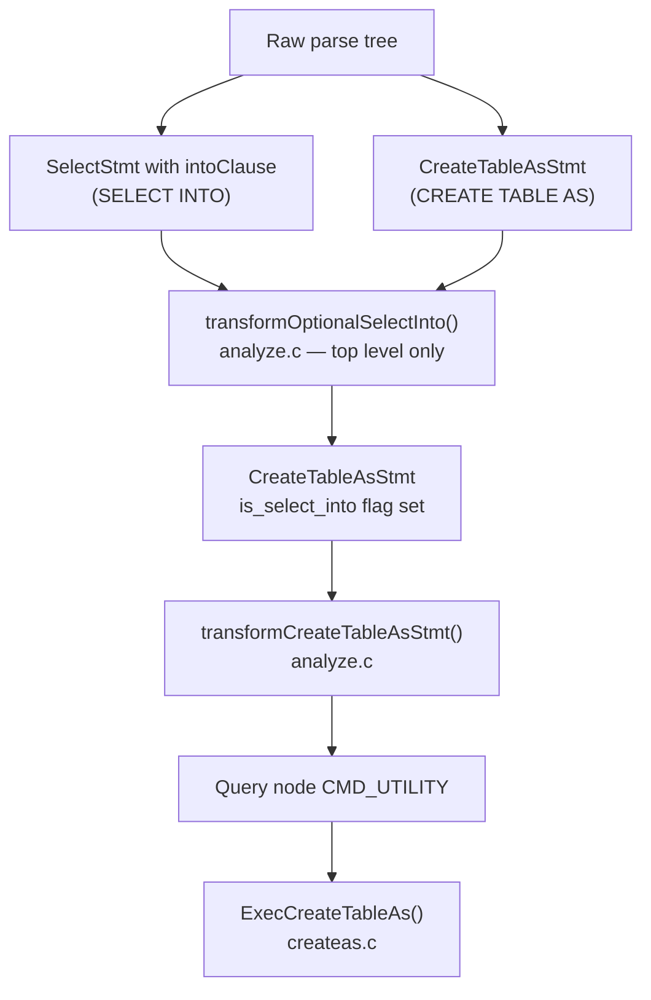
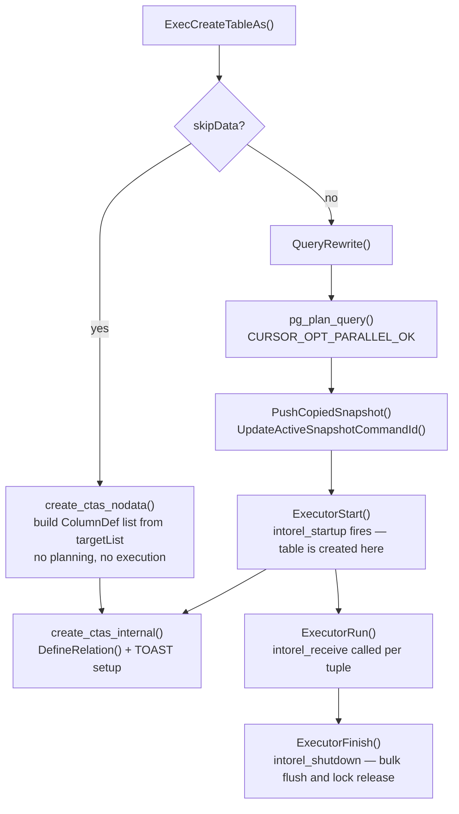

`CREATE TABLE AS` materialises the result of a query into a new heap relation in a single command. It is the workhorse behind ETL pipelines, snapshot tables, and denormalisation. It also shares almost all of its implementation with `CREATE MATERIALIZED VIEW AS` — `src/backend/commands/createas.c` handles both entirely.

## Syntax Variants and the Common Parse Node

Three surface syntaxes all converge on a single parse-tree node:

```sql
-- explicit form
CREATE TABLE t AS SELECT ...;
CREATE UNLOGGED TABLE t AS SELECT ...;
CREATE TEMP TABLE t (col1, col2) AS SELECT ... WITH NO DATA;

-- legacy form (same semantics)
SELECT * INTO t FROM ...;

-- materialized view (same code path, different relkind)
CREATE MATERIALIZED VIEW mv AS SELECT ...;
```

All three produce a `CreateTableAsStmt` node (`parsenodes.h`):

```c
typedef struct CreateTableAsStmt {
    NodeTag     type;
    Node       *query;          /* the SELECT (or EXECUTE) */
    IntoClause *into;           /* destination table */
    ObjectType  objtype;        /* OBJECT_TABLE or OBJECT_MATVIEW */
    bool        is_select_into; /* written as SELECT INTO */
    bool        if_not_exists;
} CreateTableAsStmt;
```

The `IntoClause` carries every option the user can specify for the target:

```c
typedef struct IntoClause {
    NodeTag          type;
    RangeVar        *rel;           /* target name */
    List            *colNames;      /* optional column rename list */
    char            *accessMethod;  /* USING clause */
    List            *options;       /* WITH (storage_parameter = ...) */
    OnCommitAction   onCommit;      /* for temporary tables */
    char            *tableSpaceName;
    Node            *viewQuery;     /* non-NULL only for matviews */
    bool             skipData;      /* WITH NO DATA */
} IntoClause;
```

`viewQuery` is the only structural difference that distinguishes a materialised view from a plain table throughout the code — `createas.c` checks `(into->viewQuery != NULL)` in a dozen places.

The grammar stores table persistence (permanent, temporary, unlogged) on `rel->relpersistence`, based on the `OptTemp` production. It also stashes `WITH NO DATA` directly into `skipData`.

## How SELECT INTO Becomes CreateTableAsStmt

The grammar parses `SELECT INTO` as an ordinary `SelectStmt` with an `intoClause` field set. It attaches the `INTO target` directly to the `simple_select` production. The conversion to `CreateTableAsStmt` happens during semantic analysis, not parsing.

`transformTopLevelStmt()` calls `transformOptionalSelectInto()` before delegating to `transformStmt()`. If the parse tree is a `SelectStmt` with a non-NULL `intoClause`, the wrapper allocates a fresh `CreateTableAsStmt`, sets `is_select_into = true`, nulls out `stmt->intoClause`, and continues. From that point forward the two syntaxes are indistinguishable.

This transformation only happens at the top level. Subqueries and CTEs call `transformStmt()` directly. This function does not call `transformOptionalSelectInto()`, so bare `SELECT INTO` is illegal inside a subquery. The same `transformStmt()` will error if it sees a `SelectStmt` with `intoClause` still set.



`transformCreateTableAsStmt()` runs the inner SELECT through `transformStmt()` normally, then validates materialized-view-specific constraints: no data-modifying CTEs, no references to temporary objects, no bound parameters, and no unlogged persistence. For matviews it stashes the parsed query into `into->viewQuery` so `intorel_startup()` can later hand it to `StoreViewQuery()`.

## Execution entry point

`standard_ProcessUtility()` in `utility.c` invokes `ExecCreateTableAs()` via the `T_CreateTableAsStmt` case. It is the single entry point for all three syntax forms.

The function first handles `IF NOT EXISTS` via `CreateTableAsRelExists()`. This helper does a catalog lookup and returns `InvalidObjectAddress` if the relation already exists and the flag is set. The function then allocates the `DestReceiver` via `CreateIntoRelDestReceiver()`.

One special case: if the contained query is an `EXECUTE` statement (i.e., `CREATE TABLE t AS EXECUTE prep_stmt`), `ExecCreateTableAs()` delegates execution to `ExecuteQuery()`, forwarding the `IntoClause`. That path sets up its own `DestReceiver` through the same interface. The rest of `ExecCreateTableAs()` assumes a plain `CMD_SELECT`.

## Two Paths: WITH NO DATA vs WITH DATA



**WITH NO DATA** skips the planner and executor entirely. The query's target list — already parsed and type-resolved — serves only to derive column names and types. `create_ctas_nodata()` converts each non-junk `TargetEntry` into a `ColumnDef`. It then passes the list straight to `create_ctas_internal()`. This matters for dump and restore: `pg_dump` emits `WITH NO DATA` for materialized views. It re-populates them after all dependencies are restored. This avoids planner failures when referenced objects do not yet exist.

**WITH DATA** (the default) rewrites the query and plans it with parallel execution permitted. It pushes a snapshot, then runs the executor to completion. The executor feeds every output tuple through the `DestReceiver` into the new table.

## The DR_intorel DestReceiver

PostgreSQL's `DestReceiver` interface (`dest.h`) abstracts the destination for executor output. It carries four function pointers: `rStartup`, `receiveSlot`, `rShutdown`, and `rDestroy`. CTAS implements all four using the private `DR_intorel` struct. The struct embeds a `DestReceiver` as its first field:

```c
typedef struct {
    DestReceiver  pub;          /* must be first — used as DestReceiver* */
    IntoClause   *into;
    Relation      rel;          /* populated during startup */
    ObjectAddress reladdr;      /* saved so ExecCreateTableAs can return it */
    CommandId     output_cid;   /* cmin stamped on every inserted tuple */
    int           ti_options;   /* TABLE_INSERT_SKIP_FSM */
    BulkInsertState *bistate;
} DR_intorel;
```

### intorel_startup: table creation and lock acquisition

`ExecutorStart()` calls `intorel_startup` once, before any tuples arrive. This is where the function creates the physical table.

The function builds a `ColumnDef` list from the executor's output `TupleDesc`, not from the query target list. The target list has already been resolved through planning. The function applies user-supplied column name overrides from `into->colNames` left-to-right. Too many names is an error. Too few names silently inherits query-derived names.

`create_ctas_internal()` synthesises a `CreateStmt` node from the `IntoClause`, copying `options`, `onCommit`, `tableSpaceName`, and `accessMethod` directly. It then calls `DefineRelation()` with `relkind = RELKIND_RELATION` (or `RELKIND_MATVIEW`). This is the same function invoked by a standalone `CREATE TABLE`. After `DefineRelation()` returns, a `CommandCounterIncrement()` makes the new relation visible within the transaction. `NewRelationCreateToastTable()` then creates a [[subsystems/storage/toast|TOAST]] relation if needed. For matviews, `StoreViewQuery()` records the defining query in `pg_rewrite`.

Back in `intorel_startup`, the function opens the new relation with `AccessExclusiveLock`. It then:
- Verifies RLS is not enabled (it cannot be on a freshly created table, but the check is a forward guard).
- Sets `ti_options = TABLE_INSERT_SKIP_FSM`, telling the heap AM not to consult the free-space map. The table is brand new. It gets written sequentially from block zero, so the [[subsystems/storage/fsm|FSM]] lookup is wasted work.
- Captures `GetCurrentCommandId(true)` into `output_cid` — the command ID that will be stamped on every inserted tuple.
- Allocates a `BulkInsertState` for sequential-block writes.

### intorel_receive: tuple insertion

The executor delivers each tuple as a `TupleTableSlot`. The receive function calls `table_tuple_insert()` directly with the pre-captured `output_cid` and `bistate`. There is no trigger firing, no index maintenance, and no constraint checking — the comment in the source says plainly: "We know this is a newly created relation, so there are no indexes."

This is the fundamental difference from `INSERT INTO ... SELECT`. An `INSERT` routes through `ExecModifyTable`. `ExecModifyTable` fires `BEFORE ROW` and `AFTER ROW` triggers, enforces `CHECK` constraints, and updates all indexes. CTAS bypasses all of that. The destination table is new, with no triggers, indexes, or constraints defined on it. Skipping them is correct, not merely faster.

The input slot does not need to match the destination AM's native tuple format. `table_tuple_insert()` handles the conversion, but this is slightly less efficient than a matching-slot insert. The alternative would be an explicit slot copy, which is no cheaper.

### intorel_shutdown: finalisation

`ExecutorFinish()` calls `intorel_shutdown`. It flushes and frees the bulk insert state (`FreeBulkInsertState`, `table_finish_bulk_insert`), then closes the relation with `NoLock`. The transaction holds the `AccessExclusiveLock` acquired in `intorel_startup` until commit. This prevents any other session from reading or modifying the relation before the transaction ends.

## MVCC and Command Visibility

All rows inserted by CTAS share the same `xmin` (the current transaction's XID) and the same `cmin` (`output_cid`, captured once before execution begins). Within the same transaction, a `SELECT` run after the CTAS completes — carrying a newer command ID — sees all of the rows. The CTAS query itself cannot see its own output, but there is no mechanism by which it would try to.

`ExecCreateTableAs()` pushes the snapshot for the SELECT part with `PushCopiedSnapshot`, then updates it via `UpdateActiveSnapshotCommandId`. This ensures the query sees any rows written by earlier commands in the same transaction, consistent with normal statement-boundary semantics. `ExecCreateTableAs()` pops the snapshot after the executor finishes.

If the enclosing transaction aborts, the entire table creation is rolled back. Both the catalog entry added by `DefineRelation()` and the heap pages written during insertion are subject to normal MVCC rollback — no special cleanup is needed.

## No Triggers, No RLS on the Destination

CTAS writes to the destination through `intorel_receive` → `table_tuple_insert()`. This completely bypasses `ExecModifyTable` and its associated infrastructure:

| Mechanism | CTAS | INSERT INTO ... SELECT |
|---|---|---|
| BEFORE/AFTER ROW triggers | Not fired | Fired |
| Per-row CHECK constraints | Not enforced | Enforced |
| Index maintenance | None | All indexes updated |
| RLS on destination | Blocked by check in startup | Applied normally |
| Logical replication origin | Not set | Set via trigger infra |

The planner evaluates RLS on the *source* tables in the SELECT normally, applying RLS policies to source scans as it would for any query. Only the destination is exempt, and only because it is newly created with no policies.

## Parallel Query

CTAS passes `CURSOR_OPT_PARALLEL_OK` to `pg_plan_query()`, signalling that the planner may build a parallel plan. Parallel workers operate on the SELECT side only: they produce tuples and ship them back to the leader through tuple queues in shared memory. The leader's `intorel_receive` inserts them sequentially into the heap. No parallel-awareness is needed in `createas.c` — the gather node at the top of the plan serialises tuples before they reach the `DestReceiver`.

## Materialized Views

`CREATE MATERIALIZED VIEW AS` goes through the same `ExecCreateTableAs()` entry point with `into->viewQuery != NULL`. The differences are:
- `create_ctas_internal()` calls `DefineRelation()` with `RELKIND_MATVIEW` instead of `RELKIND_RELATION`.
- `StoreViewQuery()` records the defining query in `pg_rewrite`, enabling `REFRESH MATERIALIZED VIEW` to re-execute it later.
- `intorel_startup` calls `SetMatViewPopulatedState()` to mark the matview as populated (or not, for `WITH NO DATA`).
- For materialized views, `ExecCreateTableAs()` wraps the execution in `SECURITY_RESTRICTED_OPERATION` to prevent the defining query from making changes that would render the view unrefreshable.

The parser forbids unlogged materialized views by rejecting `CREATE UNLOGGED MATERIALIZED VIEW`, because a crash would empty an unlogged matview with no way to repopulate it.

## Storage Options Passthrough

Every storage-related option flows through `IntoClause` to `DefineRelation()` unchanged:

| User option | IntoClause field | Where consumed |
|---|---|---|
| `WITH (fillfactor=…)` | `options` | `DefineRelation()` / reloptions |
| `TABLESPACE ts` | `tableSpaceName` | `DefineRelation()` |
| `ON COMMIT …` | `onCommit` | `DefineRelation()` |
| `USING am` | `accessMethod` | `DefineRelation()` |
| `UNLOGGED` | `rel->relpersistence` | `DefineRelation()` |
| `TEMP/TEMPORARY` | `rel->relpersistence` | `DefineRelation()` |

PostgreSQL silently ignores `ON COMMIT` for permanent tables — it only takes effect when `relpersistence` is `RELPERSISTENCE_TEMP`.

## EXPLAIN Interaction

`explain.c` handles `EXPLAIN CREATE TABLE t AS SELECT ...`. It detects the inner `CreateTableAsStmt` and extracts the query and `IntoClause`. It then passes `GetIntoRelEFlags(into)` to communicate the `WITH NO DATA` flag to the plan. The table is not created during `EXPLAIN`. For `WITH NO DATA`, `ExecCreateTableAs()` never enters the executor; otherwise, it enters the executor with a `None_Receiver` that discards all tuples.

## SQL Examples

```sql
-- Basic CTAS
CREATE TABLE order_summary AS
SELECT customer_id, SUM(total) AS total_spend
FROM orders
GROUP BY customer_id;

-- Rename output columns
CREATE TABLE archived_events (event_id, ts, payload) AS
SELECT id, created_at, data FROM events
WHERE created_at < now() - interval '1 year';

-- Structure only, no data
CREATE TABLE orders_copy AS TABLE orders WITH NO DATA;

-- Temporary table that drops on commit
CREATE TEMP TABLE session_work AS
SELECT * FROM candidates WHERE score > 90
ON COMMIT DROP;

-- Unlogged table for intermediate ETL
CREATE UNLOGGED TABLE etl_stage AS
SELECT * FROM raw_data WHERE processed = false;

-- Non-default table access method
CREATE TABLE columnar_data USING columnar AS
SELECT ts, value FROM sensor_readings ORDER BY ts;

-- Idempotent creation
CREATE TABLE IF NOT EXISTS snapshot_20240101 AS
SELECT * FROM accounts;

-- SELECT INTO (legacy syntax, same result as CREATE TABLE AS)
SELECT id, name INTO legacy_copy FROM users WHERE active;
```

## Related Topics

- [[code-paths/create-table|CREATE TABLE]] — covers `DefineRelation()` and the catalog machinery that CTAS delegates to for table creation.
- [[code-paths/insert|INSERT]] — the `INSERT INTO ... SELECT` path that CTAS deliberately bypasses, including trigger firing, index maintenance, and constraint enforcement.
- [[code-paths/refresh-materialized-view|REFRESH MATERIALIZED VIEW]] — re-executes the stored query via the same `DestReceiver` infrastructure that CTAS uses on initial population.
- [[subsystems/storage/heap|Heap Storage]] — the underlying heap AM that `table_tuple_insert()` and `BulkInsertState` write into during `intorel_receive`.
- [[subsystems/executor/tuple-store-receiver|TupleStore Receiver]] — another `DestReceiver` implementation, useful contrast to understand the `DR_intorel` design.
- [[subsystems/planner/ctes|CTEs in the Planner]] — `WITH` queries are an alternative to CTAS for materialising intermediate results, with different visibility and performance trade-offs.
- [[subsystems/transactions/mvcc|MVCC]] — explains how the shared `xmin`/`cmin` stamped on all CTAS-inserted rows interacts with snapshot visibility within the same transaction.
