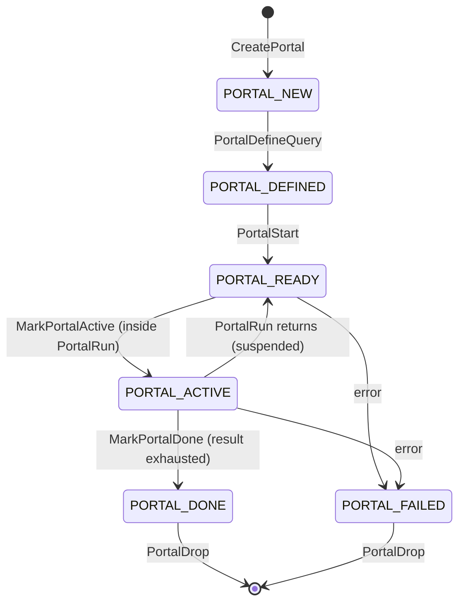
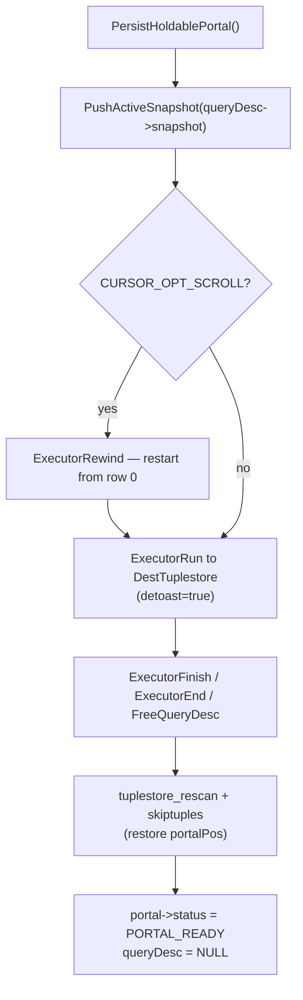
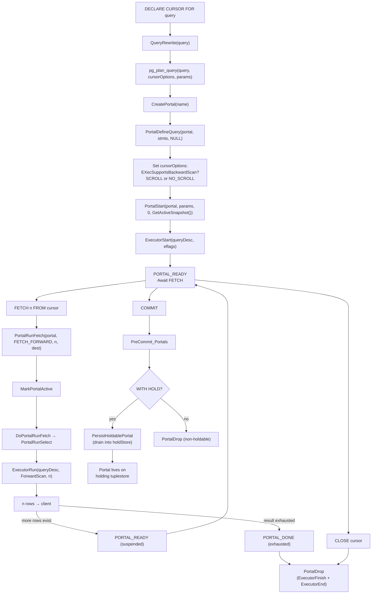

# Cursors and Portals

A portal is the unit of suspended query execution in PostgreSQL: it holds a `PlannedStmt`, the executor state, a snapshot, and a position counter. Every query — including those never exposed as cursors — runs through a portal. SQL cursors are simply portals that the client has named and suspended rather than run to completion in one shot.

## DECLARE CURSOR syntax variants

```sql
DECLARE name
  [ BINARY ] [ ASENSITIVE | INSENSITIVE ] [ [ NO ] SCROLL ]
  CURSOR [ { WITH | WITHOUT } HOLD ]
  FOR query
```

Each keyword sets a bit in the `cursorOptions` integer copied into `PortalData.cursorOptions`:

| Keyword | Bit constant | Effect |
|---|---|---|
| `BINARY` | `CURSOR_OPT_BINARY` (0x0001) | Output columns in binary wire format instead of text |
| `SCROLL` | `CURSOR_OPT_SCROLL` (0x0002) | Allow backward fetches; forces a Materialize node if needed |
| `NO SCROLL` | `CURSOR_OPT_NO_SCROLL` (0x0004) | Prohibit any backward movement |
| `INSENSITIVE` | `CURSOR_OPT_INSENSITIVE` (0x0008) | Accepted but treated identically to `ASENSITIVE` (see below) |
| `WITH HOLD` | `CURSOR_OPT_HOLD` (0x0020) | Cursor survives transaction commit |

Neither `SCROLL` nor `NO SCROLL` is the default. When the user omits both, `PerformCursorOpen` creates the portal and calls `ExecSupportsBackwardScan(plan->planTree)`. It then sets whichever option is appropriate without overhead: if the plan can already go backward, it sets `CURSOR_OPT_SCROLL`; otherwise it sets `CURSOR_OPT_NO_SCROLL`.

**INSENSITIVE** is SQL-standard but PostgreSQL does not implement it as a separate mechanism. PostgreSQL accepts the keyword to avoid syntax errors. It sets `CURSOR_OPT_INSENSITIVE`. The code then checks for conflicting options (`FOR UPDATE` is disallowed). At runtime, though, the cursor uses the same MVCC snapshot it would use without the keyword. PostgreSQL's snapshot isolation already provides the property the standard intends: the cursor sees a consistent view of data as it existed at `DECLARE` time.

**WITH HOLD** and `FOR UPDATE` are explicitly incompatible, as are `SCROLL` and `FOR UPDATE`. The analyzer enforces both constraints (`transformDeclareCursorStmt`, `src/backend/parser/analyze.c`).

## Portal struct

`PortalData` (`src/include/utils/portal.h`) is the complete runtime record for one cursor or query:

```c
typedef struct PortalData
{
    const char     *name;           /* key in PortalHashTable */
    const char     *prepStmtName;   /* backing prepared statement, if any */
    MemoryContext   portalContext;   /* per-portal allocations */
    ResourceOwner   resowner;        /* tracks locks, buffer pins, snapshots */

    SubTransactionId createSubid;   /* subxact that ran DECLARE */
    SubTransactionId activeSubid;   /* subxact of last FETCH */
    int             createLevel;

    const char     *sourceText;     /* original query string */
    CommandTag      commandTag;
    List           *stmts;          /* list of PlannedStmt */
    CachedPlan     *cplan;          /* non-NULL if from prepared statement */

    ParamListInfo   portalParams;
    PortalStrategy  strategy;
    int             cursorOptions;  /* CURSOR_OPT_* bitmask */

    PortalStatus    status;
    bool            portalPinned;   /* drop blocked; see Pinning section */
    bool            autoHeld;       /* converted from pinned during commit */

    QueryDesc      *queryDesc;      /* live executor state, or NULL after hold */
    TupleDesc       tupDesc;        /* result column descriptors */
    int16          *formats;        /* per-column format codes (0=text, 1=binary) */

    Snapshot        portalSnapshot; /* active snapshot during execution */
    Tuplestorestate *holdStore;     /* materialized rows for held/returning portals */
    MemoryContext    holdContext;    /* long-lived context owning holdStore */
    Snapshot         holdSnapshot;  /* snapshot kept for TOAST deref, or NULL */

    bool     atStart;
    bool     atEnd;
    uint64   portalPos;             /* rows fetched so far */

    TimestampTz  creation_time;
    bool         visible;           /* show in pg_cursors? */
} PortalData;
```

`portalContext` is a child of `TopPortalContext` (itself a child of `TopMemoryContext`). It holds all per-portal allocations including the plan copy, parameter list, and expression state. `holdContext` is intentionally a separate peer child so that it can outlive `portalContext` after the executor shuts down.

### Portal strategy

The `strategy` field determines how `PortalRun` drives execution:

| Strategy | Set when | Behavior |
|---|---|---|
| `PORTAL_ONE_SELECT` | Single SELECT query | Volcano model, incremental; used by all SQL cursors |
| `PORTAL_ONE_RETURNING` | INSERT/UPDATE/DELETE with RETURNING | Run to completion on first fetch, store in tuplestore |
| `PORTAL_ONE_MOD_WITH` | SELECT with data-modifying CTE | Same as RETURNING strategy |
| `PORTAL_UTIL_SELECT` | EXPLAIN, SHOW, etc. | Run utility, store result in tuplestore |
| `PORTAL_MULTI_QUERY` | Everything else | Run all statements to completion in one call |

Only `PORTAL_ONE_SELECT` portals support genuine cursor semantics (incremental fetching, backward scans). All cursors declared via `DECLARE CURSOR` land in this strategy. The analyzer guarantees this because it allows only SELECT statements to back a cursor.

### Portal status state machine



The ACTIVE state is intentionally narrow: it spans exactly one call to `PortalRun` or `PortalRunFetch`. Between fetches the portal is READY. This means callers can invoke `PortalDrop` at any point between fetches (e.g., via `CLOSE cursor`). Dropping an ACTIVE portal raises an error; dropping a pinned portal also raises an error (see Pinning).

## Portal lifecycle

### Portal allocation and registration

```c
Portal portal = CreatePortal(cstmt->portalname, false, false);
```

`CreatePortal` (`portalmem.c:176`) allocates a `PortalData` in `TopPortalContext` and creates the `portalContext` child context. It also creates a `ResourceOwner` whose parent is `CurTransactionResourceOwner`. Finally, it inserts the portal into the process-wide `PortalHashTable` (a fixed-key-size `HTAB` with `PORTALS_PER_USER = 16` initial buckets). `CreatePortal` sets the portal's `name` pointer to the hash table entry's key storage, avoiding a separate allocation.

The initial `cursorOptions` is `CURSOR_OPT_NO_SCROLL`; `PerformCursorOpen` overwrites this after calling `CreatePortal`.

### Binding the query and plan to the portal

`PortalDefineQuery()` (`pquery.c`) stores the `sourceText`, `commandTag`, `stmts` (list of `PlannedStmt *`), and optional `CachedPlan *` reference into the portal. If `cplan` is non-NULL the caller must have already called `GetCachedPlan()` to increment the plan's refcount; `PortalDrop` will call `ReleaseCachedPlan()`. The function is deliberately minimal — it must not risk an error between receiving the `cplan` refcount and storing it in the portal, or the refcount would leak.

For `DECLARE CURSOR`, `PerformCursorOpen` copies the plan into `portal->portalContext` before calling `PortalDefineQuery`. As a result, `cplan` is NULL. The plan tree lives in the portal's own memory.

### Snapshot acquisition and executor setup

`PortalStart` (`pquery.c:433`) drives strategy-specific setup. For `PORTAL_ONE_SELECT`:

1. `PortalStart` pushes a transaction snapshot, calling `PushActiveSnapshot(GetTransactionSnapshot())` if the caller did not supply one, or `PushActiveSnapshot(snapshot)` if it did. `PerformCursorOpen` passes `GetActiveSnapshot()` so the cursor inherits the snapshot already active at `DECLARE` time. This is the snapshot the executor will use for all MVCC visibility checks throughout the cursor's lifetime.
2. `PortalStart` creates a `QueryDesc` in `portalContext`.
3. If `CURSOR_OPT_SCROLL` is set, `PortalStart` calls `ExecutorStart` with `EXEC_FLAG_REWIND | EXEC_FLAG_BACKWARD`; otherwise it passes `eflags = 0`. These flags propagate into plan nodes during `ExecInitNode`. Nodes that need extra structures for backward scanning allocate them at startup instead of on the first backward fetch.
4. `portal->queryDesc = queryDesc` records the live executor state.
5. `portalPos = 0`, `atStart = true`, `atEnd = false`.
6. `PortalStart` pops the active snapshot; the executor holds its own reference to the snapshot inside `queryDesc->snapshot`.

After `PortalStart`, `portal->status = PORTAL_READY` and the cursor is ready to receive `FETCH` commands.

### PortalRun and PortalRunFetch

`PortalRun` is the general entry point used by non-cursor queries. `PortalRunFetch` is the cursor-specific variant that understands `FetchDirection` and row counts.

`PortalRunFetch` (`pquery.c:1380`) calls `MarkPortalActive` to transition to ACTIVE state, then dispatches on strategy. For `PORTAL_ONE_SELECT` it calls `DoPortalRunFetch`. `DoPortalRunFetch` translates `FetchDirection` and count into one or more calls to `PortalRunSelect`. The translation handles all four directions:

| SQL syntax | FetchDirection | count |
|---|---|---|
| `FETCH n` | `FETCH_FORWARD` | n |
| `FETCH PRIOR` | `FETCH_BACKWARD` | 1 |
| `FETCH ABSOLUTE n` | `FETCH_ABSOLUTE` | n |
| `FETCH RELATIVE n` | `FETCH_RELATIVE` | n |
| `FETCH ALL` | `FETCH_FORWARD` | `FETCH_ALL` (LONG_MAX) |
| `FETCH LAST` | `FETCH_ABSOLUTE` | -1 |
| `MOVE n` | same as FETCH | same | (result sent to `None_Receiver`) |

For `FETCH_ABSOLUTE` and `FETCH_RELATIVE`, `DoPortalRunFetch` may issue multiple calls to `PortalRunSelect` — first to reposition (discarding rows into `None_Receiver`), then to return the target row(s) to the real destination.

`PortalRunSelect` calls `ExecutorRun(queryDesc, direction, count, ...)`. `ExecutorRun` drives the Volcano pull model for up to `count` tuples in the given direction. If count is exhausted before the result set ends, the executor suspends mid-plan. `PortalRun` then returns `PORTAL_SUSPENDED` to the caller. The portal remains READY for the next `FETCH`.

### Tearing down a portal

`PortalDrop` (`portalmem.c:469`) runs the cleanup hook (`PortalCleanup`, which calls `ExecutorFinish` then `ExecutorEnd` if the executor is still running). It removes the portal from `PortalHashTable`, releases the `CachedPlan` reference if any, and drops the `holdSnapshot` registration. It then releases the `ResourceOwner` and tears down `holdStore` and `holdContext`. Finally, it deletes `portalContext` and frees the `PortalData` itself.

For failed portals, `PortalDrop` skips `PortalCleanup` if `portal->status == PORTAL_FAILED`. The transaction abort machinery has already cleaned up executor resources.

## WITH HOLD cursors: materializing at commit

A `WITH HOLD` cursor must survive the end of the transaction that created it. At transaction commit, `PreCommit_Portals` (`portalmem.c:678`) iterates all portals. For each holdable portal whose `createSubid` is not `InvalidSubTransactionId` — meaning the portal was created in this transaction — it calls `HoldPortal`:

```c
static void
HoldPortal(Portal portal)
{
    PortalCreateHoldStore(portal);   /* allocates holdStore and holdContext */
    PersistHoldablePortal(portal);   /* drains executor into holdStore */
    PortalReleaseCachedPlan(portal); /* plan no longer needed */
    portal->resowner = NULL;         /* transaction cleanup owns its resources */
    portal->createSubid = InvalidSubTransactionId;  /* no longer tx-owned */
    portal->activeSubid = InvalidSubTransactionId;
}
```

`PortalCreateHoldStore` allocates `holdContext` as a peer of `portalContext` under `TopPortalContext` — crucially **not** a child of `portalContext`, so it survives `portalContext` deletion. It creates a `Tuplestorestate` with `cross-transaction temp files` enabled and random access enabled if and only if `CURSOR_OPT_SCROLL` is set.

`PersistHoldablePortal` (`portalcmds.c:316`) drains the executor:



For a `SCROLL` cursor, `PersistHoldablePortal` rewinds the executor to the beginning before draining, so `holdStore` contains the entire result set. For a `NO SCROLL` cursor, `PersistHoldablePortal` stores only the rows not yet fetched and skips `tuplestore_rescan`. The start position of the tuplestore then corresponds to the current cursor position. The `detoast=true` flag on `SetTuplestoreDestReceiverParams` expands all [[subsystems/storage/toast|TOAST]] values into inline data before storage. This means `holdSnapshot` does not need to stay alive for TOAST dereferences. That is why `holdSnapshot` stays NULL for held cursors.

After `PersistHoldablePortal` returns, `portal->queryDesc` is NULL. The executor is gone. All future `FETCH` calls will read from `holdStore` instead of driving `ExecutorRun`. The transaction then commits, releasing all transaction-level resources, but the portal and its `holdContext` survive in `TopPortalContext`.

`PREPARE TRANSACTION` refuses to proceed if any holdable cursors exist in the current transaction. The semantics of a two-phase commit that includes a cursor materialization are undefined.

## WITHOUT HOLD cursors: cleanup at transaction end

On commit, `PreCommit_Portals` drops non-holdable portals created in the current transaction. On abort, `AtAbort_Portals` followed by `AtCleanup_Portals` drops them instead. At abort, the cleanup is deliberately conservative. `AtAbort_Portals` calls the cleanup hook, nulls `resowner`, and marks the portal FAILED. The transaction's resource cleanup will reclaim those resources anyway. `AtCleanup_Portals` then calls `PortalDrop` on all portals with non-null `createSubid`. This tears down memory without trying to run executor shutdown again.

Portals created in a committed subtransaction survive the subtransaction's commit: `AtSubCommit_Portals` re-parents the portal's `createSubid` and its `ResourceOwner` to the parent subtransaction. If the subtransaction aborts, `AtSubAbort_Portals` marks affected portals FAILED and strips `resowner`. `AtSubCleanup_Portals` then drops them.

## SCROLL vs NO SCROLL: backward scan feasibility

`ExecSupportsBackwardScan` (`src/backend/executor/execAmi.c:512`) inspects the plan tree recursively to determine whether backward scanning is possible without adding nodes:

```c
bool
ExecSupportsBackwardScan(Plan *node)
{
    if (node->parallel_aware)
        return false;  /* parallel plans can't back up */

    switch (nodeTag(node))
    {
        case T_SeqScan:
        case T_TidScan:
        case T_TidRangeScan:
        case T_FunctionScan:
        case T_ValuesScan:
        case T_CteScan:
        case T_Material:
        case T_Sort:
            return true;

        case T_IndexScan:
        case T_IndexOnlyScan:
            return IndexSupportsBackwardScan(node->indexid);

        case T_IncrementalSort:
            return false;  /* only keeps one group in memory */

        case T_SampleScan:
            return false;  /* tablesample methods can't reverse */

        case T_Gather:
            return false;

        case T_LockRows:
        case T_Limit:
            return ExecSupportsBackwardScan(outerPlan(node));

        /* Hash, Agg, NestLoop, MergeJoin, HashJoin, etc. */
        default:
            return false;
    }
}
```

When the user specifies `SCROLL` explicitly but `ExecSupportsBackwardScan` returns false, the planner adds a `Materialize` node above the plan root before handing the plan to `PortalStart`. The Materialize node caches all tuples it has seen and can re-serve them in reverse order, at the cost of memory (up to `work_mem`; spills to disk beyond that).

If the underlying plan cannot go backward, `DECLARE SCROLL CURSOR FOR SELECT * FROM large_table` will buffer the entire result set before returning even the first row. Users should specify `SCROLL` only when the application genuinely needs random access.

Key plans that cannot go backward without Materialize: `HashJoin`, `MergeJoin`, `NestLoop` (in general), `Agg`, `Hash`, `IncrementalSort`, `Gather`/`GatherMerge` (all parallel nodes). Plans that support it natively: `SeqScan`, `Sort` (a sort has the entire dataset in memory), `IndexScan` (when the index supports reverse scan), `Material` (naturally), `Limit` and `LockRows` (delegate to their child).

## Snapshot semantics

For `WITHOUT HOLD` cursors, `PortalStart` takes the snapshot once and holds it for the lifetime of the cursor within the transaction. The call is `GetTransactionSnapshot()` or, when `PerformCursorOpen` is the caller, `GetActiveSnapshot()`. This means:

- Rows inserted or updated by other transactions after `DECLARE` are not visible, regardless of when `FETCH` runs.
- Rows deleted by other transactions after `DECLARE` remain visible.
- The cursor's own transaction's changes are visible.

The executor does not re-acquire this snapshot on each `FETCH`. `ExecutorRun` uses `queryDesc->snapshot`, set at `ExecutorStart`. This snapshot does not change between fetches. This gives stable results across a series of fetches, matching the `REPEATABLE READ` isolation semantics for cursor visibility.

For `WITH HOLD` cursors, the situation is different. `PersistHoldablePortal` drains the executor using the same snapshot that was active during the original transaction, then stores raw tuples in `holdStore` with TOAST values fully expanded. After commit, there is no snapshot; reads from `holdStore` are pure in-memory tuple access. The data is frozen at the moment the transaction committed.

## BINARY cursors

`CURSOR_OPT_BINARY` changes the wire format of result columns from text to binary. It does not affect any internal computation. Binary format is faster for clients that consume numeric or binary data without needing to parse text representations — notably libpq applications using `PQgetvalue` with explicit type handling, or JDBC drivers in binary mode.

The format selection happens at output time. When `exec_simple_query` processes a `FETCH` from a binary cursor (`postgres.c:1243`):

```c
if (PortalIsValid(fportal) &&
    (fportal->cursorOptions & CURSOR_OPT_BINARY))
    format = 1;   /* 1 = binary; 0 = text */
```

`exec_simple_query` passes this format code to `PortalSetResultFormat`. `PortalSetResultFormat` fills `portal->formats[]` with per-column format codes. The `DestRemote` receiver reads these codes when constructing `DataRow` wire messages: for binary columns it calls the type's `send` function (e.g., `int4send`) instead of its `output` function (e.g., `int4out`). The result is a raw byte sequence without null terminators or text quoting. This raw format is smaller than text. It also eliminates parsing overhead on the client.

Binary cursors do not interact with `SCROLL`, `WITH HOLD`, or snapshot semantics. The `holdStore` for a held binary cursor contains the same tuple data as any other held cursor. The `DestRemote` receiver applies the binary format only at wire-send time.

## Portal pinning and reference counting

`PortalData.portalPinned` is a boolean (not a count) that prevents `PortalDrop` from destroying a portal during iteration. PL/pgSQL, PL/Perl, and PL/Python all pin portals that back cursor FOR loops:

```c
/* pl_exec.c, before entering a cursor FOR loop */
PinPortal(portal);
...
/* after the loop ends or on error */
UnpinPortal(portal);
```

`PinPortal` simply sets `portalPinned = true`; a double-pin is an error (only one caller at a time can pin). `PortalDrop` checks the flag and raises `ERROR` if set. This prevents a user-defined function called inside the cursor loop from inadvertently closing the cursor — a `CLOSE cursor_name` or `DISCARD ALL` inside the loop body would otherwise destroy the portal mid-iteration.

A pinned portal is still subject to forced cleanup on transaction abort: `AtCleanup_Portals` forcibly sets `portalPinned = false` before calling `PortalDrop`, because the aborting transaction means whoever pinned the portal is no longer running.

### Auto-held portals

Suppose a procedure calls `COMMIT` or `ROLLBACK` while a pinned portal exists. The commit-time machinery (`HoldPinnedPortals`, `portalmem.c:1207`) then converts all pinned non-auto-held portals into held portals by calling `HoldPortal` and setting `portal->autoHeld = true`. This allows the procedure to resume iterating the cursor after the commit, since `HoldPortal` has already materialized the data. Only `PORTAL_ONE_SELECT` portals can be auto-held; attempts to hold a portal backed by an INSERT/UPDATE/DELETE raise an error.

`PortalErrorCleanup` (`portalmem.c:917`) cleans up auto-held portals on error exit. It drops them even though they have `createSubid == InvalidSubTransactionId` (the flag that normally protects held cursors from cleanup). This asymmetry is intentional: auto-held portals are not user-managed holdable cursors. They are an implementation detail of how a procedure controls its own transaction. They should not outlive the procedure's error recovery.

## Connection to the extended query protocol

Named portals in the extended query protocol are the same `PortalData` objects as SQL cursors. The Bind message (`exec_bind_message`, `postgres.c:1630`) reads a portal name from the wire:

```c
portal_name = pq_getmsgstring(input_message);
/* "" means the unnamed portal */
portal = CreatePortal(portal_name, true, true);
```

`allowDup=true, dupSilent=true` means `CreatePortal` silently drops an existing portal of the same name first. After parameter binding and planning, `PortalDefineQuery` and `PortalStart` run exactly as they do for SQL cursors. `CreatePortal` stores the resulting portal in `PortalHashTable` under the given name, where it becomes available for subsequent Execute messages.

The Execute message (`exec_execute_message`, `postgres.c:2105`) retrieves the portal by name and calls `PortalRun` with a row limit equal to the Execute message's `max_rows` field. If `max_rows > 0` and the result set is not exhausted, `PortalRun` returns `PORTAL_SUSPENDED` and the backend sends a `PortalSuspended` (`'s'`) message. The portal then remains READY for another Execute. If `max_rows == 0`, the portal runs to completion.

This maps exactly to SQL cursor semantics: a named portal bound via the extended protocol can be fetched in batches across multiple Execute messages, exactly as `FETCH n FROM cursor_name` fetches in batches. The key differences are:

| Feature | SQL cursor | Extended protocol portal |
|---|---|---|
| Declared by | `DECLARE CURSOR FOR query` | Bind message |
| Named by | User-chosen cursor name | Portal name in Bind message |
| Visible in `pg_cursors` | Yes | No (`visible = false`) |
| `SCROLL` support | Yes | No (always `NO SCROLL`) |
| `WITH HOLD` | Yes | No |
| `BINARY` | Yes | Format codes per column in Bind |

Extended protocol portals are not visible in `pg_cursors` because `visible` is only set to `true` for portals created via `PerformCursorOpen`; `exec_bind_message` leaves it at the default `false`.

## Performance characteristics

### When cursors help

The primary use case is streaming large result sets to the client without buffering the entire result in the backend or the client. With a cursor, the query plan runs incrementally: the SeqScan reads one page at a time, the plan tree pulls one tuple at a time, and each `FETCH` cycle transmits a bounded number of rows. Memory consumption stays proportional to the `FETCH` size, not the result set size.

Useful patterns:

```sql
BEGIN;
DECLARE c CURSOR FOR
    SELECT * FROM events WHERE ts > now() - interval '30 days'
    ORDER BY ts;

FETCH 500 FROM c;  -- process batch, e.g. in application
FETCH 500 FROM c;
-- ...
CLOSE c;
COMMIT;
```

ETL pipelines reading multi-million-row tables, and applications using server-side paging, benefit substantially from this pattern.

### When cursors hurt

The planner sees the full query shape at `DECLARE` time and produces a plan, but it cannot optimize across multiple `FETCH` calls. More importantly:

- **No join pushdown across fetches.** If the cursor query joins two tables and the application fetches 10 rows at a time from a 10-million-row result, the planner must choose between a nested-loop index join (great for small results) and a hash join (great for large results). With a cursor, the planner sees the query but not the final fetch count, so it applies generic cost estimates. A single large query without a cursor would see the full `LIMIT` or lack thereof and choose correctly.
- **No late binding of LIMIT.** `FETCH 10 FROM c` does not push a LIMIT into the plan; the plan runs without a limit and the executor simply stops after 10 tuples. An equivalent `SELECT ... LIMIT 10` would allow the planner to choose an index scan for small limits.
- **SCROLL adds Materialize.** A scrollable cursor that forces a Materialize node buffers the entire result set at first fetch, negating any streaming benefit.
- **Snapshot held open.** Each open cursor holds a snapshot. A large number of concurrent open cursors can raise `xmin` pressure (the backend's `xmin` stays low only as long as it holds no old snapshots). This can block VACUUM from removing dead tuples.

### Interplay with `work_mem`

`PortalCreateHoldStore` creates the tuplestore for `WITH HOLD` cursors with `work_mem` as the memory limit:

```c
portal->holdStore =
    tuplestore_begin_heap(
        portal->cursorOptions & CURSOR_OPT_SCROLL,
        true,   /* cross-transaction temp files allowed */
        work_mem);
```

A holdable cursor that materializes more than `work_mem` of data will spill to a temporary file in `$PGDATA/pgsql_tmp/`. The spill is transparent to the client but carries the I/O overhead of writing and reading back the full result set from disk. Increasing `work_mem` before declaring a large holdable cursor can avoid this.

## Observing cursors

```sql
-- All open cursors in this session
SELECT name, statement, is_holdable, is_binary, is_scrollable, creation_time
FROM pg_cursors;

-- Current position (no built-in view; track manually or use MOVE 0)
MOVE FORWARD 0 FROM my_cursor;  -- returns count of rows moved (0)
-- Now check portal state via pg_cursors (no portalPos exposed)
```

`pg_cursor()` (`portalmem.c:1132`) implements the `pg_cursors` view. It iterates `PortalHashTable` and returns one row per visible portal (`portal->visible == true`).

```sql
-- CLOSE ALL closes every non-active cursor in the session
CLOSE ALL;
```

## Lifecycle flowchart



## Related Topics

- [[code-paths/extended-query|Extended Query Protocol]] — named portals created via Bind/Execute messages share the same PortalData infrastructure as SQL cursors
- [[code-paths/simple-select|Simple SELECT]] — the unnamed portal that backs every non-cursor SELECT, illustrating the baseline portal lifecycle
- [[code-paths/prepared-statements|Prepared Statements]] — portals backed by a CachedPlan reference and how ReleaseCachedPlan interacts with PortalDrop
- [[subsystems/executor/tuplestore|Tuplestore]] — the in-memory spill-to-disk store that backs WITH HOLD cursor materialization and RETURNING portals
- [[subsystems/transactions/snapshot|Snapshot]] — how GetTransactionSnapshot works and what holding an open cursor snapshot means for VACUUM xmin pressure
- [[subsystems/plpgsql/cursors|PL/pgSQL Cursors]] — how PL/pgSQL pins portals during cursor FOR loops and uses HoldPinnedPortals across procedure COMMIT
- [[subsystems/transactions/subtransactions|Subtransactions]] — how AtSubCommit_Portals and AtSubAbort_Portals re-parent or drop portals when savepoints commit or roll back
