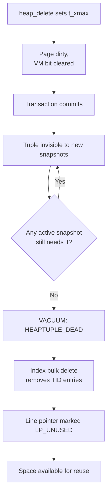

# DELETE Code Path

A `DELETE` in PostgreSQL does not remove a tuple from the heap immediately. It marks the tuple as deleted by writing the current transaction's XID into its `t_xmax` field. The tuple remains physically present and visible to older snapshots until VACUUM reclaims it. This design is the foundation of MVCC: deletion is a metadata operation, not a storage operation. Its cost is nearly constant regardless of row size.

## Plan shape

The root plan node is `ModifyTable` (operation=DELETE). Its subplan produces one row per tuple to delete, containing a `ctid` junk column with the physical address of the tuple to mark. The planner applies any WHERE clause as a filter above the sequential or index scan that produces candidate rows. By the time `ModifyTable` receives a row, it has already passed predicate evaluation once.

### Partitioned tables

A `DELETE` cannot target an internal partitioned table node directly. The planner expands the partitioned table into its leaf partitions. It attaches a separate `ModifyTable` target for each leaf that survives partition pruning. Rows already contain a `tableoid` system column that identifies which leaf they came from. This lets the executor route the deletion to the correct result relation. Attempting to call `heap_delete()` on a partitioned table's parent relation would fail: the parent has no heap pages of its own.

## Row-level processing

Each tuple passes through a fixed sequence of checks and side-effects before `ExecDelete()` touches the heap (`nodeModifyTable.c`).

### BEFORE ROW triggers

BEFORE DELETE FOR EACH ROW triggers fire first via `ExecDeletePrologue()`. A trigger may return NULL to suppress the delete entirely; in that case, the executor skips the row without touching the heap (`ExecBRDeleteTriggers()`, `trigger.c`). The trigger receives the old row in `TriggerData.tg_trigtuple`; there is no new tuple for a DELETE trigger.

Before fetching the tuple for trigger execution, `GetTupleForTrigger()` locks it exclusively. If a concurrent transaction is also modifying the tuple, this locking step may block. It may then discover that the tuple has changed. The `epqslot_candidate` path allows the trigger machinery to hand an EPQ-refetched row back to the caller rather than firing triggers against a version that no longer matches the original scan.

### Writing the deletion marker

Once triggers have passed, `ExecDeleteAct()` hands the tuple to the heap access method via `table_tuple_delete()`. This function dispatches to `heap_delete()`. The function returns a `TM_Result` indicating whether the delete succeeded or encountered a conflict (`ExecDeleteAct()`, `nodeModifyTable.c`).

### Handling concurrent modifications

When two transactions target the same row, the second to arrive finds that `table_tuple_delete()` returns `TM_Updated` — another transaction has already modified the tuple. Rather than silently skip or error, PostgreSQL refetches the latest committed version of the row. It then re-evaluates the original WHERE clause and join conditions against that row. This EvalPlanQual (EPQ) recheck is what gives `DELETE` its correct READ COMMITTED semantics. The delete proceeds if the updated row still satisfies the predicate. Otherwise, the executor skips it. `table_tuple_lock()` locates the latest version using `TUPLE_LOCK_FLAG_FIND_LAST_VERSION`; then `EvalPlanQual()` runs the plan's qual expressions against it (`nodeModifyTable.c`).

Under `REPEATABLE READ` or `SERIALIZABLE` isolation, there is no EPQ retry. Encountering `TM_Updated` immediately raises a serialization failure error, because allowing a retry would violate snapshot isolation.

If `table_tuple_delete()` returns `TM_Deleted` instead, a concurrent transaction has already deleted the row. The executor then skips it.

### AFTER ROW triggers and RETURNING

After a successful heap deletion, `ExecDeleteEpilogue()` queues AFTER DELETE FOR EACH ROW triggers via `ExecARDeleteTriggers()`. These fire deferred, after all rows in the statement have been processed. Triggers marked `IMMEDIATE` fire immediately instead. If the statement has a `RETURNING` clause, `ExecProcessReturning()` evaluates it against the deleted tuple. It then returns a result row. This evaluation happens while the tuple is still visible on the page, before any cleanup.

## RETURNING clause evaluation

`ExecDelete()` evaluates `RETURNING` after the heap deletion succeeds but before releasing the buffer pin. The deleted tuple is still physically present on the page with its `t_xmax` set. It remains readable by the deleting transaction, because the transaction's own snapshot can see tuples with `t_xmax` equal to its own XID at command IDs after `cmax`. `ExecProcessReturning()` evaluates the expression list in `ri_projectReturning` against that tuple. It materializes the result into a slot (`nodeModifyTable.c`).

**PostgreSQL 18:** `RETURNING` accepts `OLD` and `NEW` aliases. For DELETE, `OLD.*` is the deleted row. `NEW.*` is always null. Applications can use a single `RETURNING OLD.col, NEW.col` pattern across INSERT, UPDATE, and DELETE to detect which values changed.

If `oldtuple` was supplied (e.g. from an FDW or a trigger), the executor uses it directly. Otherwise, `table_tuple_fetch_row_version()` with `SnapshotAny` re-reads the tuple from the page. `SnapshotAny` bypasses normal visibility checks, so the deleted-but-not-yet-committed tuple is accessible.

## Marking a tuple deleted in the heap

The heap-level operation records the deletion without moving or removing any bytes on the page (`heap_delete()`, `heapam.c`). `heap_delete()` reads the page into a buffer, pins it, and locks it exclusively. Before writing anything, `HeapTupleSatisfiesUpdate()` confirms that the tuple is visible and not already locked by a conflicting transaction. If another transaction holds such a lock, the backend waits.

The core of the deletion is a small set of field updates to the tuple header:

- `t_xmax` is set to the current transaction's XID.
- `t_infomask` is updated with lock and committed-status bits. The exact values depend on any existing lock modes already recorded for the tuple (e.g. from a `SELECT FOR UPDATE`), computed by `compute_new_xmax_infomask()`.
- The command ID (`t_cmax`) is recorded so the deleting transaction can track visibility within the same statement.
- `t_ctid` is set to point to the tuple itself, signalling that there is no successor version — this is the end of the version chain.

### Replica identity

`ExtractReplicaIdentity()` copies the old tuple's replica identity columns (primary key or full row, depending on the table's `REPLICA IDENTITY` setting) into `old_key_tuple` before entering the critical section. `heap_delete()` includes this copy in the WAL record so that logical replication subscribers can identify which row was deleted. On the replica, the physical TID is meaningless.

### WAL record for heap delete

With the in-memory header fields updated and the buffer marked dirty, `heap_delete()` writes an `XLOG_HEAP_DELETE` WAL record inside a critical section (`heapam.c`). The record carries:

- `xl_heap_delete.offnum` — the offset number of the deleted item on its page.
- `xl_heap_delete.xmax` — the new `t_xmax` value.
- `xl_heap_delete.infobits_set` — a compact encoding of the new infomask bits, computed by `compute_infobits()`.
- `xl_heap_delete.flags` — whether the page was previously all-visible (`XLH_DELETE_ALL_VISIBLE_CLEARED`) and whether this deletion is part of a cross-partition move (`XLH_DELETE_IS_PARTITION_MOVE`).
- Optionally, the replica identity tuple appended after the fixed header.

This is sufficient for crash recovery and physical streaming replication to replay the deletion: the redo routine sets `t_xmax` and `t_infomask` exactly as the original, marks the page dirty, and clears the visibility map bit if the flag says so. No predicate re-evaluation or trigger execution happens during replay.

Two cleanup steps follow. If the page was previously all-visible, `heap_delete()` clears the visibility map bit via `visibilitymap_clear()`. This lets VACUUM know to revisit the page. If the tuple held external [[subsystems/storage/toast|TOAST]] values, `heap_toast_delete()` queues their removal. Finally, `CacheInvalidateHeapTuple()` sends a sinval message so other backends can drop any cached entries for this tuple.

## HOT chains and delete

Heap-Only Tuple (HOT) chains arise when an UPDATE writes a new tuple version on the same page without updating any index entry. This leaves a chain of versions linked through `t_ctid`. A DELETE always targets the latest live member of such a chain — the member whose `t_xmax` is currently invalid. This member also satisfies the query's snapshot.

Deleting the tail of a HOT chain does not break or invalidate the chain. `heap_delete()` resets the deleted tuple's `t_ctid` to point to itself (as with any delete), terminating the forward chain at that version. Older members of the chain remain in their prior state. Their `t_ctid` still points to the next member. They remain dead (with committed `t_xmax`), or they are simply redirected slot entries. VACUUM treats them the same way it would any dead versions. It reclaims each one individually once no active snapshot needs it. It can also compact the page by updating the HOT chain root's line pointer to redirect directly to a surviving version.

`heap_delete()` sets the deleted tuple's `t_ctid` to `tp.t_self`. Index scans that follow the HOT chain then stop at that version. There is no dangling pointer left in the chain.

## Foreign key cascade deletes vs trigger-based cascades

PostgreSQL implements `ON DELETE CASCADE` and `ON DELETE SET NULL` foreign key actions through trigger machinery, not through a separate executor path. When a table with a foreign key referencing the deleted table exists, the system creates internal `RI_FKey_cascade_del` or `RI_FKey_setnull_del` triggers on the referenced table. These are AFTER ROW DELETE triggers that fire once per deleted row and issue a new `DELETE` or `UPDATE` on the referencing table.

This means the cascade is recursive at the executor level: each cascaded delete goes through the full `ModifyTable` path, including its own BEFORE triggers, EPQ checks, heap deletions, WAL writes, and its own cascaded FK triggers. The length of the FK dependency chain and PostgreSQL's trigger execution stack bound the depth of recursion.

The distinction from user-defined `ON DELETE` triggers is largely administrative. The system creates and owns FK triggers. They run at `INITIALLY IMMEDIATE` or `INITIALLY DEFERRED` constraint timing. They enforce the referential integrity check before firing the actual DML. User-defined AFTER triggers run after FK triggers at the same timing point, so any cascaded deletes are visible to them.

Deferrable foreign keys (`INITIALLY DEFERRED`) queue the constraint check and cascade action to end of transaction rather than firing immediately after each row. PostgreSQL implements this through the deferred trigger machinery (`AfterTriggerSaveEvent()`), not through any special delete path.

## MVCC after delete

After `heap_delete()`, the tuple has `t_xmax` set to the deleting transaction's XID. It remains visible to:
- The deleting transaction itself (only for commands before `cmax`).
- Any snapshot taken before the deleting transaction commits.

It becomes invisible to snapshots taken after the commit. PostgreSQL considers the tuple dead — eligible for reclamation — only once no active snapshot in any backend can still see it. The `GlobalVisTestIsRemovableXid()` function encapsulates this test. `heap_page_prune()` uses it during [[subsystems/background/autovacuum|autovacuum]] or manual VACUUM passes.

## VACUUM reclaiming deleted tuples

VACUUM scans each heap page and calls `HeapTupleSatisfiesVacuum()` on every tuple. A deleted tuple returns `HEAPTUPLE_DEAD` when its `t_xmax` is a committed transaction and it is no longer visible to any active snapshot. VACUUM then:

1. Marks the item's line pointer as unused (`LP_UNUSED`).
2. Adds the freed space to the page's free space accounting.
3. Records the TID in a dead-tuple array for index vacuuming.

For each index on the table, VACUUM issues a bulk index delete pass (`index_bulk_delete()`) that removes any index entries pointing to those dead TIDs. Only after VACUUM removes all index entries does the heap page space become safely reusable. If an index entry for a dead TID remained, an index scan could fetch a stale page offset. That offset might now hold a different tuple.

The visibility map plays a central role here. `heap_delete()` clears the all-visible bit for the affected page. VACUUM will not skip that page in its next pass. VACUUM confirms that every tuple on a page is visible to all current and future snapshots (i.e., all live tuples have committed `t_xmin` and no `t_xmax`). Once it does, it sets the all-visible bit again. This allows index-only scans to skip the heap. It also lets future VACUUM passes skip the page entirely.

PostgreSQL handles TOAST values separately. `heap_delete()` calls `heap_toast_delete()` immediately after the in-place header write and before it releases the buffer. This makes TOAST chunk removal part of the same transaction. If the transaction later aborts, PostgreSQL also rolls back the TOAST deletion.

## Trigger summary

| Point | Type | Function |
|---|---|---|
| Before first row | BEFORE STATEMENT | Fired in `ExecModifyTable()` |
| Before each row | BEFORE ROW | `ExecBRDeleteTriggers()` |
| After each row | AFTER ROW | `ExecARDeleteTriggers()` |
| After all rows | AFTER STATEMENT | Fired in `ExecutorFinish()` |

FK cascade triggers fire as AFTER ROW triggers at the same timing point as user-defined AFTER ROW triggers. The system orders them before the user-defined triggers.

## See also

- [[subsystems/storage/heap]] — tuple header layout; how t_xmax encodes deletion
- [[subsystems/transactions/mvcc]] — how deleted tuples remain visible to older snapshots
- [[code-paths/vacuum]] — how VACUUM reclaims tuples after their xmax is committed and no snapshot needs them
- [[code-paths/update]] — UPDATE comparison (writes a new version in addition to marking old)
- [[subsystems/storage/visibility-map]] — how the all-visible bit controls VACUUM and index-only scans
- [[subsystems/wal/overview]] — WAL record structure and redo machinery