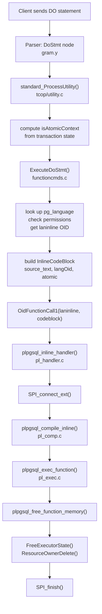

`DO` executes an anonymous block of procedural code without creating a stored function. PostgreSQL compiles, executes, and discards the block in a single operation: it writes no catalog entries, no plan cache survives the call, and nothing remains after the block returns.

## Syntax and Language Selection

```sql
DO [ LANGUAGE lang_name ] code
DO code [ LANGUAGE lang_name ]
```

The `LANGUAGE` clause is optional and positionally flexible; `plpgsql` is the default. The grammar (`gram.y`) permits the body and language in either order, because it parses both as `dostmt_opt_item` alternatives collapsed into a flat `DefElem` list. The grammar treats the body as an `Sconst` (string constant); dollar-quoting is the idiomatic form for multi-line blocks:

```sql
DO $$
DECLARE
    v_count int;
BEGIN
    SELECT count(*) INTO v_count FROM orders WHERE status = 'pending';
    RAISE NOTICE 'Pending orders: %', v_count;
END;
$$;
```

`ExecuteDoStmt()` (`functioncmds.c`) iterates the `DefElem` list. It defaults `language` to `"plpgsql"` if no language option is present. `ExecuteDoStmt()` recognises only the `"as"` and `"language"` option names; anything else raises an error at parse time.

## What DO Does Not Create

The most important characteristic of `DO` is what it omits relative to `CREATE FUNCTION`. A stored function produces:

- a row in `pg_proc` giving the function a permanent OID and identity
- `pg_depend` entries linking the function to its language, argument types, and return type
- a hash-table entry inside the PL handler so subsequent calls reuse the compiled `PLpgSQL_function`

None of these exist for a `DO` block. The `PLpgSQL_function` allocated by `plpgsql_compile_inline()` carries `fn_oid = InvalidOid` (inferred from `fake_fcinfo->flinfo->fn_oid = InvalidOid` set by the handler). The handler never inserts it into the PL/pgSQL function hash. The function's internal name is the literal string `"inline_code_block"`, hardcoded in `pl_comp.c`. When the handler returns, `plpgsql_free_function_memory()` releases every cached `CachedPlan` inside the statement list. The handler also deletes the function's [[subsystems/memory/contexts|memory context]] at that point. Re-running the same `DO` statement compiles from scratch every time.

The absence of `pg_proc` also means there is no `pg_depend` graph to maintain, no `ALTER FUNCTION`, no `REVOKE`, and no `DROP FUNCTION`. The only permission gate is the language itself: trusted languages require `USAGE` on the language OID; untrusted languages require superuser.

## Execution Path



`ExecuteDoStmt()` builds an `InlineCodeBlock` node. It dispatches the node to the language's `laninline` function via `OidFunctionCall1`. The struct defined in `parsenodes.h` is intentionally marked `nodetag_only` — it is not a member of any parse tree, only an execution-time API contract between `ExecuteDoStmt` and the language handler:

```c
typedef struct InlineCodeBlock
{
    pg_node_attr(nodetag_only)

    NodeTag  type;
    char    *source_text;   /* body of the anonymous block */
    Oid      langOid;       /* OID of selected language */
    bool     langIsTrusted; /* from pg_language.lanpltrusted */
    bool     atomic;        /* true when inside a transaction block */
} InlineCodeBlock;
```

The `laninline` column in `pg_language` is the extensibility point. PL/pgSQL registers `plpgsql_inline_handler`, PL/Python registers `plpython3_inline_handler`, PL/Perl registers `plperl_inline_handler`. PL/Tcl ships without a `laninline` handler; attempting `DO LANGUAGE pltcl` raises `"language does not support inline code execution"`.

## Inside plpgsql_inline_handler

`plpgsql_inline_handler()` mirrors the regular call handler for a stored function, but without any caching infrastructure. The steps are tightly coupled by design:

**SPI connection.** The handler opens an SPI connection with `SPI_connect_ext()`. The handler passes the `SPI_OPT_NONATOMIC` flag when `codeblock->atomic` is false. This flag enables transaction control inside the block (see the next section).

**Compilation.** `plpgsql_compile_inline()` allocates a `PLpgSQL_function` struct with `palloc0` in `CurrentMemoryContext`. It then creates a child context named `"PL/pgSQL inline code context"` for all compile-time storage (the parse tree, statement nodes, expression trees). `plpgsql_compile_inline()` hardwires the function as void-returning with zero arguments:

- `fn_rettype = VOIDOID`
- `fn_prokind = PROKIND_FUNCTION` (not `PROKIND_PROCEDURE`)
- `fn_is_trigger = PLPGSQL_NOT_TRIGGER`
- `out_param_varno = -1`
- `extra_warnings = 0`, `extra_errors = 0` (validation spam suppressed at runtime)

**Private EState and [[subsystems/memory/resource-owner|ResourceOwner]].** The handler creates a private `EState` via `CreateExecutorState()` and a private `ResourceOwner` named `"PL/pgSQL DO block simple expressions"`. These are deliberately separate from the session-level `shared_simple_eval_estate` used by stored functions. The comment in `pl_exec.c` explains the reason: results from executing simple expressions accumulate in the EState. Those results cannot be shared across calls, because DO blocks run one-shot. Using the shared estate would cause memory to accumulate indefinitely if the user repeatedly submits DO blocks. The handler also reuses the private ResourceOwner as the "procedure resowner" for any `CALL` statements executed inside the block.

**Execution.** `plpgsql_exec_function()` runs the compiled tree. This function is identical for DO blocks and for stored void-returning functions. The only distinction is the non-null `simple_eval_estate` and `simple_eval_resowner` arguments. These arguments trigger the code path for the private estate.

**Cleanup.** Both on success and on error (via `PG_CATCH`), the handler:
1. Calls `plpgsql_free_function_memory()` to release cached `CachedPlan` references in the statement list
2. Calls `FreeExecutorState()` to destroy the private EState
3. Calls `ResourceOwnerReleaseAllPlanCacheRefs()` and `ResourceOwnerDelete()` for the private owner
4. Closes the SPI connection with `SPI_finish()`

On error, the handler also calls `plpgsql_subxact_cb()` before freeing the EState to clean up any `simple_econtext_stack` entries pointing into it.

## Transaction Context and the atomic Flag

`standard_ProcessUtility()` computes the `isAtomicContext` flag before calling `ExecuteDoStmt()`:

```c
bool isAtomicContext =
    (!(context == PROCESS_UTILITY_TOPLEVEL ||
       context == PROCESS_UTILITY_QUERY_NONATOMIC)
     || IsTransactionBlock());
```

This evaluates to true whenever the DO is issued inside an explicit `BEGIN`/`COMMIT` block, or called from inside another function or procedure. When `atomic` is true, the block cannot commit or roll back. If it tries, `SPI_commit()` raises `"invalid transaction termination"`. The block runs entirely within the caller's transaction.

When `atomic` is false — the DO is issued at top level, outside any explicit transaction block — PL/pgSQL opens the SPI connection with `SPI_OPT_NONATOMIC`. Inside that context, `COMMIT` and `ROLLBACK` statements are legal. Each commit closes the current transaction and opens a new one. This requires the handler to replace the private EState: it hands off to the shared estate for the remainder of execution after a COMMIT, per the `exec_stmt_commit` path in `pl_exec.c`. This mechanism is shared with `CALL` on procedures.

```sql
-- Works: DO is at the top level, outside any explicit BEGIN
DO $$
BEGIN
    INSERT INTO audit_log(msg) VALUES ('step 1');
    COMMIT;
    INSERT INTO audit_log(msg) VALUES ('step 2');
    COMMIT;
END;
$$;

-- Fails: the outer BEGIN makes the context atomic
BEGIN;
DO $$
BEGIN
    COMMIT;  -- ERROR: invalid transaction termination
END;
$$;
COMMIT;
```

The asymmetry with `CALL` is subtle: a procedure invoked by a top-level `CALL` can always perform transaction control; a DO block can only do so when the `DO` itself is at the top level. The same PL/pgSQL `COMMIT`/`ROLLBACK` syntax works in both cases — the difference is purely in how the `atomic` flag is set.

## Memory Context Lifetime

The `PLpgSQL_function` struct for a DO block lives in `CurrentMemoryContext` at compilation time, with a child context `"PL/pgSQL inline code context"` holding all compile-time allocations. Variable-length data created during execution — SPI query results, detoasted values, tuple data — lives in per-SPI-call contexts, not in the function context. This matches the behaviour of stored functions.

Because the handler tears down the private EState unconditionally at the end of the block, there is no risk of expression state accumulating across repeated DO submissions. Each execution starts from a clean slate. Stored functions accumulate expression state in the shared EState across calls. This design is intentional for performance, but it is impossible to apply to DO blocks.

## Output and Side Effects

A DO block has no return value. The mechanism to convey information to the caller is limited to observable side effects:

| Mechanism | Notes |
|---|---|
| `RAISE NOTICE / WARNING / INFO` | Messages sent to the client via the message protocol |
| `INSERT / UPDATE / DELETE` | Committed with the surrounding transaction |
| `COPY TO STDOUT` | Streams data to the client directly |
| Writing to shared tables | Other sessions see the data after commit |

There is no `RETURN` statement in an anonymous block and no mechanism to bind output parameters. `plpgsql_compile_inline()` hardwires the block's return type to `VOIDOID`.

## Security Context

DO blocks always execute as the calling user. There is no `SECURITY DEFINER` option. The permission check in `ExecuteDoStmt()` is the only privilege gate:

- Trusted languages (`lanpltrusted = true`): requires `USAGE` on the language, checked via `object_aclcheck()`
- Untrusted languages (`lanpltrusted = false`): requires `superuser()`

This is stricter than the stored-function model, where `SECURITY DEFINER` allows escalation to the function owner's role. A DO block cannot impersonate another user.

## pg_stat_activity and Observability

While a DO block is executing, `pg_stat_activity.query` contains the full text of the `DO` statement including the body. Individual statements inside the block are not separately visible — the outer `DO` text is what monitoring queries see. The command tag returned to the client on completion is `DO`.

```sql
-- In another session, during a long-running DO block:
SELECT pid, query FROM pg_stat_activity WHERE state = 'active';
-- query column shows the full DO $$ ... $$ text
```

## Common Use Cases

**Conditional DDL in migrations.** Schema migrations often need idempotent object creation:

```sql
DO $$
BEGIN
    IF NOT EXISTS (
        SELECT 1 FROM pg_indexes
        WHERE schemaname = 'public' AND indexname = 'idx_orders_status'
    ) THEN
        CREATE INDEX idx_orders_status ON orders(status);
    END IF;
END;
$$;
```

**Dynamic DDL across multiple objects.** DO blocks can use `EXECUTE` to construct DDL dynamically, common in schema-generation scripts:

```sql
DO $$
DECLARE
    tbl text;
BEGIN
    FOREACH tbl IN ARRAY ARRAY['orders','shipments','invoices'] LOOP
        EXECUTE format(
            'ALTER TABLE %I ADD COLUMN IF NOT EXISTS updated_at timestamptz',
            tbl
        );
    END LOOP;
END;
$$;
```

**One-off data migrations.** Complex transformations that are too narrow to warrant a permanent function:

```sql
DO $$
DECLARE
    r record;
BEGIN
    FOR r IN
        SELECT id, raw_data FROM import_staging ORDER BY id
    LOOP
        INSERT INTO canonical_table
            SELECT r.id, parse_raw(r.raw_data)
        ON CONFLICT (id) DO UPDATE SET data = EXCLUDED.data;
    END LOOP;
    RAISE NOTICE 'Migration complete';
END;
$$;
```

**Transactional multi-step migrations.** When running at top level with explicit commits:

```sql
DO $$
BEGIN
    -- Each COMMIT is a hard checkpoint; work done so far cannot be rolled back
    UPDATE large_table SET status = 'archived' WHERE created_at < '2020-01-01';
    COMMIT;
    DELETE FROM large_table WHERE status = 'archived' AND created_at < '2019-01-01';
    COMMIT;
END;
$$;
```

## Limitations vs Stored Procedures

| Capability | DO block | Stored procedure (CALL) |
|---|---|---|
| COMMIT / ROLLBACK at top level | Yes | Yes |
| COMMIT / ROLLBACK inside BEGIN block | No | No |
| Return values | None | OUT parameters |
| Plan caching across calls | No | Yes (via pg_proc hash) |
| SECURITY DEFINER | No | Yes |
| pg_depend tracking | No | Yes |
| Callable by name | No | Yes |
| Trigger function | No | No (requires CREATE FUNCTION) |
| Event trigger target | No | No |
| extra_warnings / extra_errors | Suppressed | Configurable |

The absence of plan caching is the most significant performance difference. A stored procedure called in a tight loop compiles once per session and reuses the cached plan; the same logic in a DO block recompiles every time the caller executes the outer `DO` statement. For logic that runs repeatedly, a stored function or procedure is the right choice. DO blocks are best reserved for one-off operations where the compilation overhead is negligible relative to the work performed.

## Related Topics

- [[code-paths/call|CALL]] — stored procedure invocation shares the non-atomic SPI path and the same transaction-control semantics as a top-level DO block
- [[subsystems/plpgsql/overview|PL/pgSQL Overview]] — the compilation and execution engine that backs the default language for DO blocks
- [[code-paths/create-function|CREATE FUNCTION]] — how stored functions differ from DO blocks: pg_proc entries, plan caching, and pg_depend tracking
- [[subsystems/extensions/procedural-languages|Procedural Languages]] — how language handlers register laninline, enabling DO support for PL/Python, PL/Perl, and other PL handlers
- [[subsystems/memory/contexts|Memory Contexts]] — the per-block memory context created by plpgsql_compile_inline and destroyed on block completion
- [[subsystems/transactions/subtransactions|Subtransactions]] — exception handling inside DO blocks uses savepoints, the same subtransaction mechanism available to stored functions
- [[subsystems/observability/pg-stat-activity|pg_stat_activity]] — how DO block query text appears in the activity view and what monitoring queries see during long-running blocks
