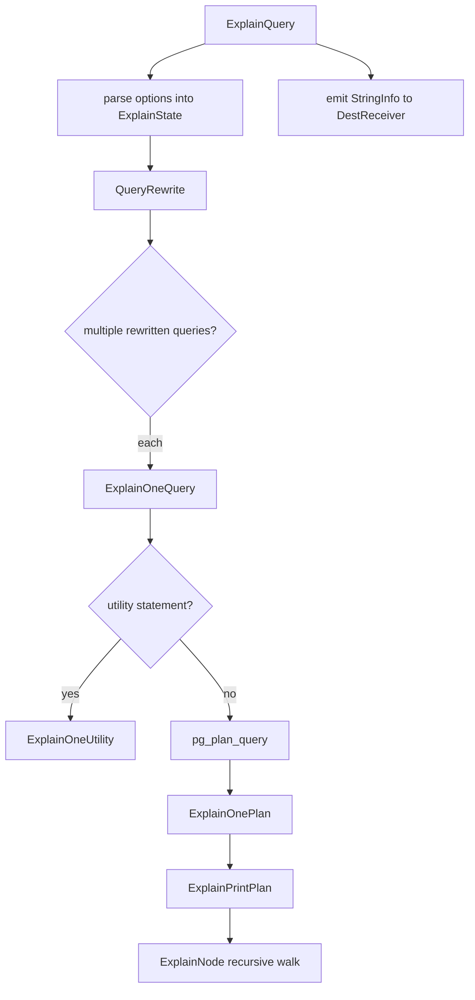
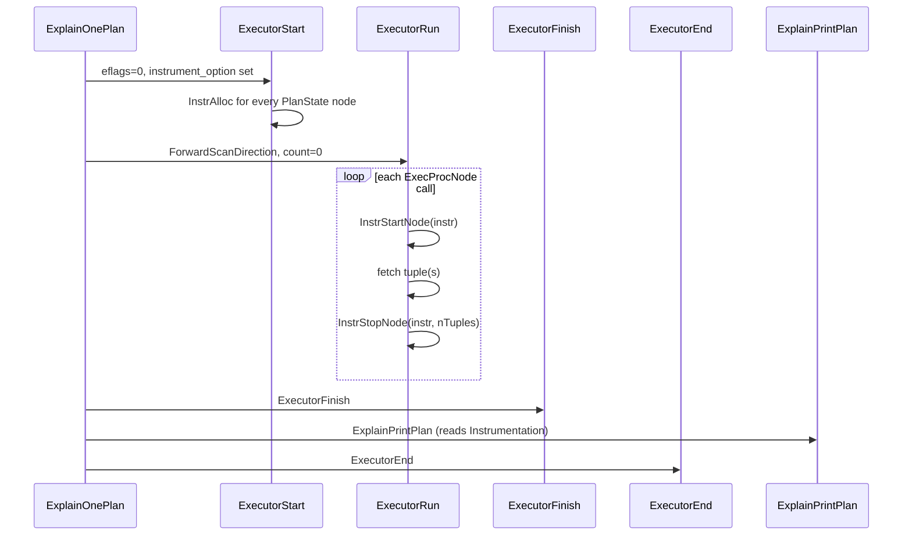

# EXPLAIN and EXPLAIN ANALYZE Code Path

`EXPLAIN` is a utility statement. Without `ANALYZE`, it prints the planner's chosen plan tree without executing the query. With `ANALYZE`, it fully executes the query. It also wraps each executor node with instrumentation probes that capture per-node timing, row counts, and resource usage. Both paths converge in `src/backend/commands/explain.c`, a ~5000-line file that owns output serialization, plan-tree walking, and statistics reporting.

**PostgreSQL 18 refactoring:** PostgreSQL 18 split the monolithic `explain.c` into four files: `explain.c` (plan traversal and node-level logic), `explain_format.c` (format dispatch and output primitives), `explain_state.c` (`ExplainState` lifecycle and extension API), and `explain_dr.c` (the serialization `DestReceiver` for `EXPLAIN (SERIALIZE)`). Earlier versions keep all this logic in a single file. The design described here applies to both generations; only the file boundaries differ.

## Entry point

`standard_ProcessUtility` (in `src/backend/tcop/utility.c`) dispatches `T_ExplainStmt` directly to:

```c
ExplainQuery(pstate, (ExplainStmt *) parsetree, params, dest);
```

`ExplainQuery` is the sole public entry point. It:

1. Allocates an `ExplainState` via `NewExplainState()` (defaults: `costs = true`, all other flags false, format text).
2. Parses the option list from the `ExplainStmt` node, setting fields on `ExplainState`.
3. Validates option combinations (e.g., `WAL` and `TIMING` require `ANALYZE`; `GENERIC_PLAN` and `ANALYZE` are mutually exclusive).
4. Runs the query rewriter on the contained `Query` node.
5. For each rewritten query, calls `ExplainOneQuery`.
6. Serializes `es->str` to the output `DestReceiver` as a single-column text/XML/JSON/YAML result set.



## ExplainState struct

`ExplainState` (`src/include/commands/explain.h`) carries both the user-visible options and the mutable formatting state for the current walk:

| Field | Type | Default | Purpose |
|---|---|---|---|
| `str` | `StringInfo *` | allocated | Accumulates all output text |
| `verbose` | `bool` | false | Print target lists, schema-qualified names |
| `analyze` | `bool` | false | Execute the query; print actual row/time stats |
| `costs` | `bool` | true | Print estimated startup/total cost and row/width |
| `buffers` | `bool` | false | Print per-node buffer hit/read/dirtied/written |
| `wal` | `bool` | false | Print per-node WAL records/FPI/bytes |
| `timing` | `bool` | = `analyze` | Print per-node actual startup and total time |
| `summary` | `bool` | = `analyze` | Print planning time and total execution time |
| `settings` | `bool` | false | Print non-default planner-relevant GUC settings |
| `generic` | `bool` | false | Ask the planner for a generic (unbound) plan |
| `format` | `ExplainFormat` | TEXT | TEXT / XML / JSON / YAML |
| `indent` | `int` | 0 | Current indentation depth (text: spaces; structured: nesting level) |
| `grouping_stack` | `List *` | NIL | Per-level comma/dash state for JSON and YAML |
| `pstmt` | `PlannedStmt *` | — | Top-level plan (set by `ExplainPrintPlan`) |
| `rtable` | `List *` | — | Range table for deparsing |
| `rtable_names` | `List *` | — | Alias list from `select_rtable_names_for_explain` |
| `deparse_cxt` | `List *` | — | Deparse context for printing expressions |
| `printed_subplans` | `Bitmapset *` | — | SubPlan node ids already visited (prevents duplicates) |
| `hide_workers` | `bool` | false | Suppress per-worker lines when invisible `Gather` is at top |
| `workers_state` | `ExplainWorkersState *` | — | Per-worker output buffers for parallel plans |
| `memory` | `bool` | false | Print planner memory consumption (`EXPLAIN (MEMORY)`) |
| `serialize` | `ExplainSerializeOption` | off | Drive a `SerializeDestReceiver` and report wire-format serialization cost |
| `extension_state` | `void **` | — | Opaque per-slot pointer array for extension-registered options (PG18+) |

`NewExplainState` palloc0s the struct, zeroing all booleans. It then sets `costs = true` and initialises `str`.

**PostgreSQL 17:** PostgreSQL 17 added two new options. `EXPLAIN (MEMORY)` reports the amount of memory the planner consumes while it builds the plan tree. This is useful for diagnosing planning regressions on complex queries with large join sets. `EXPLAIN (SERIALIZE)` runs the output through the wire-format serializer after execution. It reports the time and buffer activity consumed by that step. This isolates the overhead of network serialization from the cost of executing the query.

## EXPLAIN without ANALYZE

When `analyze` is false the execution pipeline runs in explain-only mode:

1. `ExplainOneQuery` calls `pg_plan_query`, recording wall-clock time around it via `INSTR_TIME_SET_CURRENT` to populate `planduration`. If `buffers` is on, `ExplainOneQuery` snapshots `pgBufferUsage` before and after planning.
2. `ExplainOnePlan` passes `eflags = EXEC_FLAG_EXPLAIN_ONLY` to `ExecutorStart`. This flag causes the executor to build the `PlanState` tree and allocate resources. The executor skips any actual I/O. The executor initialises expression evaluation state. Scan nodes do not open relations for reading.
3. `ExplainOnePlan` does **not** call `ExecutorRun`.
4. `ExplainPrintPlan` walks the already-initialized `PlanState` tree, reading only the static `Plan` node fields (`startup_cost`, `total_cost`, `plan_rows`, `plan_width`). No `Instrumentation` data is present.
5. `ExplainOnePlan` calls `ExecutorEnd` to clean up. Because the executor fetched no rows, this step is fast.

The key invariant: the query affects no data, acquires no row locks, and produces no side effects. `EXEC_FLAG_EXPLAIN_ONLY` propagates into each executor node's `ExecInit*` function so scan nodes do not call `table_beginscan`.

## EXPLAIN ANALYZE

With `analyze = true` the query runs to completion inside `ExplainOnePlan`:



**PostgreSQL 18:** PostgreSQL 18 includes `BUFFERS` output by default when `ANALYZE` is used, without needing to pass `BUFFERS TRUE` explicitly. The `buffers` flag in `ExplainState` defaults to true whenever `analyze` is true.

**PostgreSQL 18:** PostgreSQL 18 adds more detail to `EXPLAIN ANALYZE` output. Each Index Scan node reports the number of index searches performed, not just loops. EXPLAIN prints row counts as fractional values rather than rounded integers. Material, Window Aggregate, and CTE nodes report memory and disk usage. Parallel Bitmap Heap Scan nodes report per-worker statistics on cache hits and misses. EXPLAIN flags plan nodes that were disabled via `enable_*` GUCs inline in the plan output. EXPLAIN reports how many times the WAL buffer became full when WAL tracking is active.

### Instrument option flags

`ExplainOnePlan` assembles `instrument_option` from the user options before calling `CreateQueryDesc`:

| Condition | Flag added |
|---|---|
| `analyze && timing` | `INSTRUMENT_TIMER` |
| `analyze && !timing` | `INSTRUMENT_ROWS` |
| `buffers` | `INSTRUMENT_BUFFERS` |
| `wal` | `INSTRUMENT_WAL` |

`INSTRUMENT_TIMER` enables wall-clock timing per node. `INSTRUMENT_ROWS` enables only tuple counting. Tuple counting is cheaper because it skips `clock_gettime` per node. `CreateQueryDesc` stores the `instrument_option` bitmask in `QueryDesc->instrument_options`. `ExecutorStart` passes it to `InstrAlloc`.

### Allocating instrumentation per plan node

Each `PlanState` node that needs statistics gets its own `Instrumentation` struct, sized and flagged according to the same bitmask computed above. `InstrAlloc(n, instrument_options, async_mode)` (`src/backend/executor/instrument.c`) palloc0s an array of `n` `Instrumentation` structs. It sets `need_timer`, `need_bufusage`, and `need_walusage` on each entry based on the bitmask. Every `PlanState` node that receives a non-zero `instrument_options` gets a pointer to one of these structs in `planstate->instrument`.

## Instrumentation struct

`Instrumentation` (`src/include/executor/instrument.h`) accumulates statistics across all execution cycles of a single plan node:

| Field | Type | Meaning |
|---|---|---|
| `need_timer` | `bool` | Whether timing data is being collected |
| `need_bufusage` | `bool` | Whether buffer counters are being collected |
| `need_walusage` | `bool` | Whether WAL counters are being collected |
| `async_mode` | `bool` | Node operates in async (non-blocking) mode |
| `running` | `bool` | True from first tuple of current cycle until `InstrEndLoop` |
| `starttime` | `instr_time` | Wall-clock time at `InstrStartNode` |
| `counter` | `instr_time` | Accumulated CPU/wall time for the current cycle |
| `firsttuple` | `double` | Elapsed time to first tuple of the current cycle |
| `tuplecount` | `double` | Tuples returned in the current cycle |
| `bufusage_start` | `BufferUsage` | Snapshot of `pgBufferUsage` at node entry |
| `walusage_start` | `WalUsage` | Snapshot of `pgWalUsage` at node entry |
| `startup` | `double` | Total startup time across all completed loops (seconds) |
| `total` | `double` | Total time across all completed loops (seconds) |
| `ntuples` | `double` | Total tuples produced across all loops |
| `ntuples2` | `double` | Secondary tuple counter (e.g., heap fetches for Index Only Scan) |
| `nloops` | `double` | Number of completed execution cycles |
| `nfiltered1` | `double` | Tuples removed by scan qual or join qual |
| `nfiltered2` | `double` | Tuples removed by a secondary qual |
| `bufusage` | `BufferUsage` | Accumulated buffer counters across all loops |
| `walusage` | `WalUsage` | Accumulated WAL counters across all loops |

### InstrStartNode / InstrStopNode lifecycle

`ExecProcNode` calls `InstrStartNode` at the top of each invocation, before it does any work. `InstrStartNode`:
- Records `pgBufferUsage` into `bufusage_start` (if `need_bufusage`).
- Records `pgWalUsage` into `walusage_start` (if `need_walusage`).
- Sets `starttime` to the current wall clock (if `need_timer`).

`ExecProcNode` calls `InstrStopNode(instr, nTuples)` after the node has produced its tuple(s). `InstrStopNode`:
- Accumulates `INSTR_TIME_ACCUM_DIFF(counter, endtime, starttime)`.
- Computes `BufferUsageAccumDiff` against the saved snapshot.
- Computes `WalUsageAccumDiff` against the saved snapshot.
- Sets `running = true` and records `firsttuple` on the first call of a cycle.

`ExplainNode` calls `InstrEndLoop` before it reads the instrumentation data. `ExecutorEnd` also calls it. `InstrEndLoop` moves the current-cycle accumulators into the per-loop totals (`startup`, `total`, `ntuples`, `nloops`) and resets cycle state for a potential next loop. This is necessary because plan nodes can be rescanned (e.g., the inner side of a nested loop); `nloops` counts the total number of rescan cycles.

EXPLAIN prints per-loop averages: `startup_ms = 1000.0 * instr->startup / nloops`, `rows = instr->ntuples / nloops`.

### Parallel worker instrumentation

For parallel plans, each worker process has its own `Instrumentation` array. `InstrAccumParallelQuery` aggregates these into the leader's `WorkerInstrumentation` array (accessible via `planstate->worker_instrument`) using DSM-based communication. `ExplainNode` reads `worker_instrument->instrument[n]` and, when `verbose` is on, emits per-worker timing lines via `ExplainOpenWorker` / `ExplainCloseWorker`.

## ExplainPrintPlan and ExplainNode

`ExplainPrintPlan(es, queryDesc)` sets up the per-tree fields of `ExplainState` (range table, deparse context, alias list) and then calls `ExplainNode` on the root `PlanState`. A pre-scan via `ExplainPreScanNode` walks the tree to collect the set of RTEs actually referenced. This lets `select_rtable_names_for_explain` assign un-suffixed aliases only to RTEs that appear in output.

`ExplainNode` is the recursive workhorse. For each node it:

1. Identifies the display name (`pname`) and structured name (`sname`) from `nodeTag(plan)`.
2. Opens a `Plan` group via `ExplainOpenGroup`.
3. Emits static cost/width estimates if `es->costs`.
4. Calls `InstrEndLoop` on `planstate->instrument` to finalize cycle state. It then emits actual rows and time if `es->analyze` is true and `nloops > 0`. It emits `(never executed)` if `nloops == 0`.
5. Dispatches to node-type-specific show functions for quals, keys, and other node details.
6. Emits buffer usage (`show_buffer_usage`) and WAL usage (`show_wal_usage`) if requested.
7. Recursively calls `ExplainNode` on `initPlan` subplans, the outer plan state, the inner plan state, and any member plans (Append, BitmapAnd, etc.).
8. Closes the `Plan` group.

### Node-type dispatch for scan targets and index details

| Call | Nodes covered |
|---|---|
| `ExplainScanTarget` | SeqScan, BitmapHeapScan, TidScan, SubqueryScan, FunctionScan, ValuesScan, CteScan, WorkTableScan |
| `ExplainIndexScanDetails` + `ExplainScanTarget` | IndexScan, IndexOnlyScan |
| `ExplainModifyTarget` | ModifyTable (Insert/Update/Delete/Merge) |
| `show_scan_qual` | Index Cond, Recheck Cond, Filter per scan type |
| `show_upper_qual` | Join Filter, Hash Cond, Merge Cond, One-Time Filter |
| `show_sort_keys` / `show_sort_info` | Sort, IncrementalSort |
| `show_hash_info` | Hash (batches, memory peak) |
| `show_hashagg_info` | HashAggregate (batches, memory peak) |
| `show_memoize_info` | Memoize (cache hits/misses/evictions) |
| `show_agg_keys` | Agg (group keys) |
| `show_modifytable_info` | ModifyTable (conflict info for INSERT ON CONFLICT) |

`ExplainIndexScanDetails` looks up the index name via `explain_get_index_name`. `explain_get_index_name` consults `explain_get_index_name_hook` first, then falls back to `get_rel_name`. It also emits the scan direction ("Backward" or absent for forward).

`show_instrumentation_count()` reads `instrument->ntuples2` to emit "Rows Removed by Filter" and similar lines. Filter-evaluating nodes (Index Scan, Bitmap Heap Scan, join nodes) maintain these counters. The same `InstrEndLoop` averaging that applies to main tuple counts also normalizes them. In text format the actual timing and row counts appear on the same line as the node type as `(actual time=... rows=... loops=N)`; in structured formats they become separate labeled properties. Nodes that were never executed emit `(never executed)` in text format, or zero-valued properties in structured formats.

## Buffer tracking

`BufferUsage` (`src/include/executor/instrument.h`) carries all buffer counters as `int64` fields:

| Field | Meaning |
|---|---|
| `shared_blks_hit` | Pages found in shared buffer pool |
| `shared_blks_read` | Pages read from OS (cache miss) |
| `shared_blks_dirtied` | Pages dirtied (first dirty in this backend) |
| `shared_blks_written` | Pages written by [[subsystems/background/bgwriter|bgwriter]] or checkpoint triggered by this query |
| `local_blks_hit/read/dirtied/written` | Same for temp-table local buffers |
| `temp_blks_read/written` | Blocks read/written for sort/hash temp files |
| `blk_read_time` | Time spent in OS read calls (requires `track_io_timing`) |
| `blk_write_time` | Time spent in OS write calls (requires `track_io_timing`) |
| `temp_blk_read_time` | Time spent reading temp blocks |
| `temp_blk_write_time` | Time spent writing temp blocks |

The buffer manager increments the global `pgBufferUsage` counter whenever a buffer access occurs. `InstrStartNode` snapshots it; `InstrStopNode` calls `BufferUsageAccumDiff(dst, &pgBufferUsage, &bufusage_start)` to accumulate the delta into `instr->bufusage`.

`show_buffer_usage` in text mode suppresses zero-value categories to keep output compact. In structured formats, `show_buffer_usage` always emits all fields. `ExplainOneQuery` passes the buffer usage for the planning phase itself (the snapshot taken around `pg_plan_query`) separately to `ExplainOnePlan` as the `bufusage` parameter. `ExplainOnePlan` prints it under a `Planning:` sub-section.

**PostgreSQL 17:** PostgreSQL 17 added `local_blk_read_time` and `local_blk_write_time` fields to `BufferUsage`. They appear in `EXPLAIN (ANALYZE, BUFFERS)` output, reporting time spent on local buffer I/O (temp tables) separately from shared buffer I/O. This requires `track_io_timing` to be on.

## WAL tracking

`WalUsage` tracks WAL generation attributable to the query:

| Field | Type | Meaning |
|---|---|---|
| `wal_records` | `int64` | Number of WAL records written |
| `wal_fpi` | `int64` | Number of full-page images written |
| `wal_bytes` | `uint64` | Total bytes of WAL generated |

WAL usage accumulates the same way as buffer usage: `InstrStartNode` snapshots `pgWalUsage`; `InstrStopNode` calls `WalUsageAccumDiff`. The `WAL` option requires `ANALYZE` because WAL is generated only during actual execution. `show_wal_usage` suppresses the line entirely in text mode when all three counters are zero.

## JIT statistics

EXPLAIN gates [[subsystems/executor/jit-llvm|JIT]] stats on `es->costs` (to suppress them in regression tests) and on `queryDesc->estate->es_jit_flags` having `PGJIT_PERFORM` set. `ExplainPrintJITSummary` aggregates `JitInstrumentation` from the leader (`es_jit`) and from any parallel workers (`es_jit_worker_instr`) via `InstrJitAgg`, then calls `ExplainPrintJIT`.

`ExplainPrintJIT` emits:
- Number of JIT-compiled functions.
- Options: Inlining, Optimization, Expressions, Deforming (from `jit_flags` bitmask).
- Timing breakdown (Generation, Inlining, Optimization, Emission, Total) — only when `analyze && timing`.

`ExplainNode` emits per-worker JIT instrumentation inside the worker sub-groups when `verbose && costs`.

## EXPLAIN (SERIALIZE)

`EXPLAIN (ANALYZE, SERIALIZE)` measures the overhead of converting query results into the PostgreSQL wire protocol without actually transmitting any data to the client. This isolates network serialization cost from query execution cost — a distinction that matters for wide or [[subsystems/storage/toast|TOAST]]-heavy result sets where the serialization step can dominate.

The mechanism is a dedicated `DestReceiver` implemented in `explain_dr.c`. `CreateExplainSerializeDestReceiver(es)` builds a `SerializeDestReceiver` that mirrors `printtup()` as closely as possible. Its receive callback calls `slot_getallattrs()` to detoast varlena columns, runs each attribute through its type output function (`OutputFunctionCall` for text, `SendFunctionCall` for binary), packs the result into a `PqMsg_DataRow` buffer, then discards it rather than transmitting it. Timing, buffer usage, and a byte count accumulate into a `SerializeMetrics` struct retrieved at output time via `GetSerializationMetrics()`.

Because `SERIALIZE` uses the same `es->timing` and `es->buffers` flags as the executor metrics, its measurements appear in the same sections of the EXPLAIN output. `SERIALIZE` requires `ANALYZE`; the `serialize` field (an `ExplainSerializeOption` enum) in `ExplainState` represents it.

## Output format implementation

All four formats share the same `ExplainNode` walk. The format-specific logic lives in a small set of primitives.

### Property emission API

Every piece of data written to `es->str` goes through one of a set of typed dispatch functions. The internal `ExplainProperty()` function is the single implementation point; all public wrappers call it:

| Function | Value type | Notes |
|---|---|---|
| `ExplainPropertyText` | string | Quoted in JSON and YAML |
| `ExplainPropertyInteger` | `int64` | Emitted without quotes |
| `ExplainPropertyUInteger` | `uint64` | Unsigned variant |
| `ExplainPropertyFloat` | `double` | Precision controlled by `ndigits` argument |
| `ExplainPropertyBool` | bool | `true`/`false` unquoted in JSON and YAML |
| `ExplainPropertyList` | list of C strings | Comma-separated inline in text; array in JSON/XML/YAML |

In text format, `ExplainProperty()` calls `ExplainIndentText()` then appends `"label: value\n"`. For XML it wraps the value in a sanitised tag (spaces and slashes become dashes). For JSON and YAML the format is driven by the `grouping_stack`.

`ExplainBeginOutput()` and `ExplainEndOutput()` bracket the entire output: JSON wraps everything in a top-level array (`[…]`) because multiple statements in a single `EXPLAIN` can produce multiple plans; XML wraps everything in `<explain xmlns="http://www.postgresql.org/2009/explain">`; text and YAML emit no wrapper. `ExplainSeparatePlans()` adds a blank line between plans in text format.

### Text format

In text format, `es->indent` counts plan-node depth. `ExplainIndentText()` emits `es->indent * 2` spaces, but only when the output buffer is empty or the last character was a newline — this prevents double-indentation when worker data has already been placed on the current line.

`ExplainNode()` emits the `->  ` arrow prefix at the start of every non-root node. The root node has `es->indent == 0` and gets no arrow. After appending the four-character arrow, `ExplainNode()` raises `es->indent` by 2, so child nodes align their own arrows and properties correctly. It restores the saved indent value before returning, so siblings are unaffected. This produces output like:

```
->  Seq Scan on orders  (cost=0.00..1.23 rows=10 width=32) (actual time=0.012..0.034 rows=10 loops=1)
```

`ExplainOpenGroup` and `ExplainCloseGroup` are no-ops in text format; `ExplainNode()` manages indentation instead, by incrementing, saving, and restoring `es->indent` around child nodes.

### JSON format

`ExplainOpenGroup` emits `{` (labeled) or `[` (unlabeled) and pushes `0` onto `grouping_stack`. `ExplainJSONLineEnding` prepends `,\n` if the stack top is non-zero (items already emitted at this level), then flips it to `1`. This lazy-comma approach means JSON output never has a trailing comma. `ExplainProperty` formats each key-value pair using `escape_json`.

The set-aside/save/restore triad (`ExplainOpenSetAsideGroup`, `ExplainSaveGroup`, `ExplainRestoreGroup`) supports parallel worker output: a worker's data is built into a side buffer then spliced into the main buffer, requiring grouping state to be saved, redirected, and restored without emitting stray delimiters.

### XML format

`ExplainBeginOutput` emits the `<explain xmlns="...">` root element. `ExplainXMLTag` replaces non-XML-identifier characters (spaces, slashes) with dashes when constructing tag names. The XML formatter emits each property as `<Tag>value</Tag>` and wraps groups in their `objtype` tag.

### YAML format

YAML uses `grouping_stack` similarly to JSON but with different indentation rules. Unlabeled groups emit `- ` (YAML sequence item marker); labeled groups emit `key: `. `ExplainYAMLLineStarting` handles newline and indentation before each item.

## Utility statement delegation

`ExplainOneUtility` handles utility statements that appear inside an `EXPLAIN`:

| Statement | Handling |
|---|---|
| `CreateTableAsStmt` | Rewrites inner SELECT, recurses to `ExplainOneQuery` with `into` set |
| `DeclareCursorStmt` | Rewrites inner SELECT, recurses to `ExplainOneQuery` |
| `ExecuteStmt` | Delegates to `ExplainExecuteQuery` in `prepare.c` (fetches cached plan) |
| `NotifyStmt` | Emits literal `NOTIFY` string |
| All others | Emits `Utility statements have no plan structure` |

`CREATE INDEX`, `VACUUM`, `COPY`, and other DDL statements fall into the "all others" bucket — they have no planner-generated plan tree to display.

## Trigger timing

After `ExecutorFinish` and before `ExecutorEnd`, `ExplainPrintTriggers` iterates `estate->es_opened_result_relations`, `es_tuple_routing_result_relations`, and `es_trig_target_relations`. For each `ResultRelInfo` that has `ri_TrigInstrument` populated, it calls `InstrEndLoop` to finalize timing. It then emits per-trigger name, constraint name, relation, cumulative time, and call count. `ExplainPrintTriggers` silently omits triggers with zero `ntuples` (never fired).

## Summary line

`ExplainOnePlan` records a wall-clock `starttime` before `ExecutorStart` and another after `ExecutorEnd` (which includes cleanup cost). Planning time comes from `planduration` computed in `ExplainOneQuery`. `ExplainOnePlan` prints both in milliseconds when `es->summary` is true:

```
Planning Time: 0.123 ms
Execution Time: 4.567 ms
```

The `summary` flag defaults to the value of `analyze`. As a result, plain `EXPLAIN` never prints these lines unless the user explicitly adds `SUMMARY ON`.

## Extension hooks

Two extension hooks allow plugins to intercept the explain path:

| Hook | Type | Purpose |
|---|---|---|
| `ExplainOneQuery_hook` | `ExplainOneQuery_hook_type` | Replace or augment plan display for a single query (e.g., `auto_explain`) |
| `explain_get_index_name_hook` | `explain_get_index_name_hook_type` | Override index name resolution |

`auto_explain` uses `ExecutorEnd_hook` combined with its own invocation of `ExplainOnePlan` to log slow queries, reusing the same infrastructure.

### Extension options API (PostgreSQL 18+)

PostgreSQL 18 added a formal API for extensions to register their own EXPLAIN options, implemented in `explain_state.c`. An extension calls `RegisterExtensionExplainOption(option_name, handler)` at load time. `ParseExplainOptionList()` falls through to `ApplyExtensionExplainOption()` for any unrecognised keyword. `ApplyExtensionExplainOption()` searches the registered option array and invokes the matching handler.

Each extension receives a stable integer slot in `es->extension_state[]` via `GetExplainExtensionId()`. `GetExplainExtensionId()` obtains the slot once per session. It backs the slot with `TopMemoryContext`, so IDs persist across statements. The extension reads and writes its per-statement state with `GetExplainExtensionState()` and `SetExplainExtensionState()`. The slot array grows on demand, so extensions do not need to coordinate slot numbers.

## See also

- [[subsystems/planner/overview]]
- [[subsystems/executor/overview]]
- [[subsystems/executor/expression-eval]]
- [[code-paths/simple-select]]
- [[subsystems/storage/heap]]
- [[subsystems/wal/archiving]]
