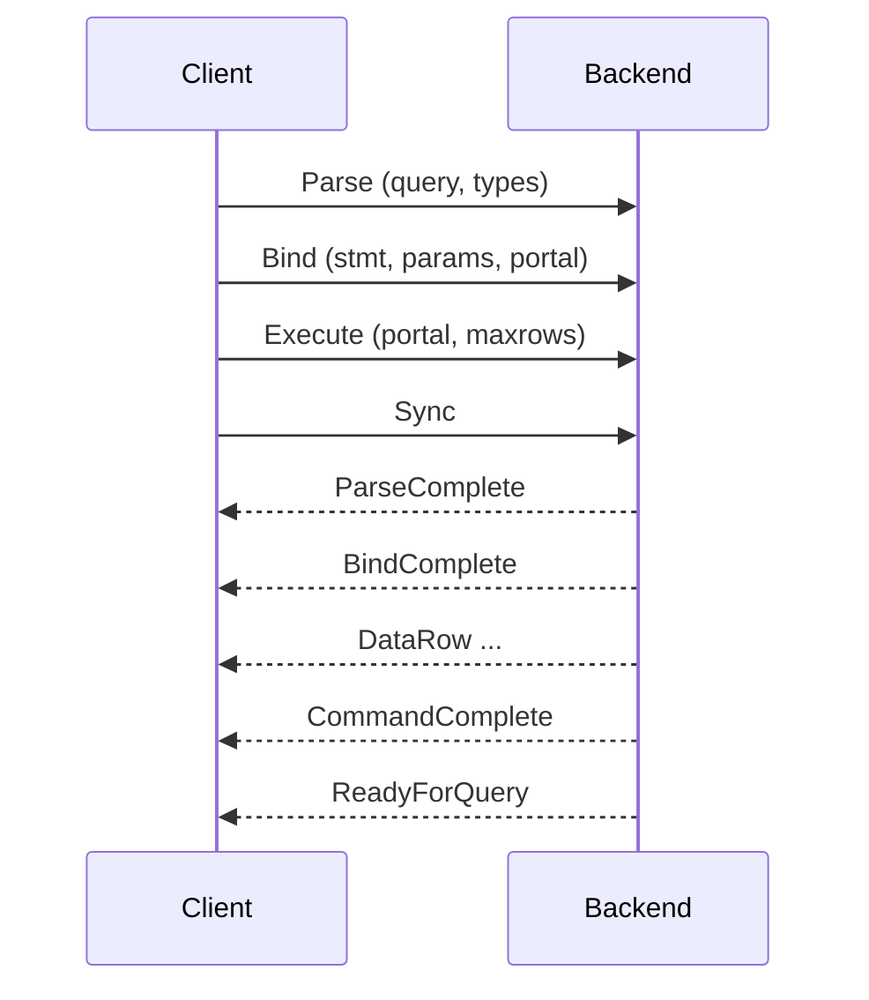
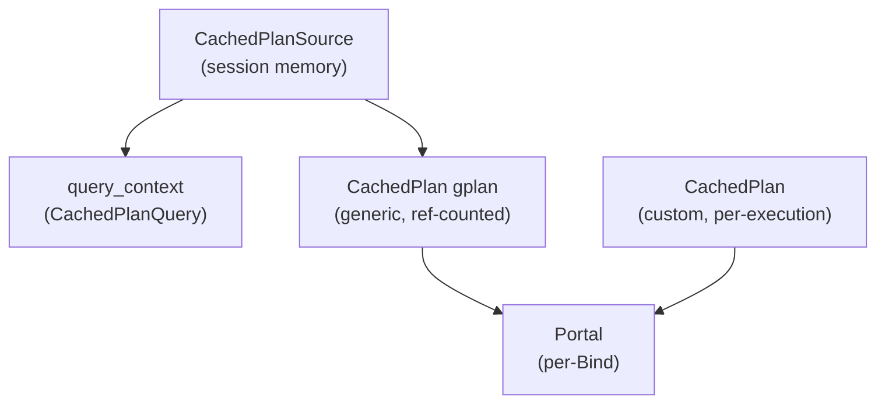
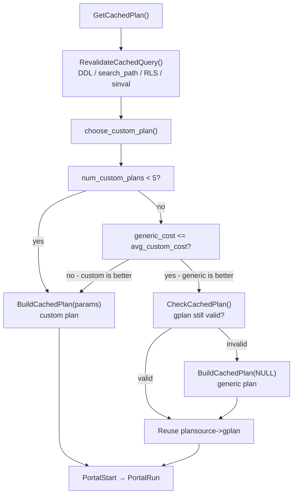

# Extended Query Code Path

The extended query protocol separates the [[code-paths/simple-select|simple query pipeline]] into distinct wire messages, each handled by a dedicated function in `src/backend/tcop/postgres.c`. This separation is what makes prepared statements and plan caching possible. The parse and analysis stages happen once, and their results persist in session memory. Subsequent executions with different parameter values skip straight to planning or reuse an already-built generic plan.

## The six message types

The protocol defines six message types that a client can send. Each type maps to a single byte identifier. The backend processes them in a `switch` on `firstchar` inside its main message loop (`postgres.c`):

| Message | Byte | Handler | Backend response |
|---|---|---|---|
| Parse | `P` | `exec_parse_message()` | ParseComplete (`1`) |
| Bind | `B` | `exec_bind_message()` | BindComplete (`2`) |
| Describe | `D` | `exec_describe_statement_message()` / `exec_describe_portal_message()` | ParameterDescription + RowDescription / NoData |
| Execute | `E` | `exec_execute_message()` | DataRow... + CommandComplete / PortalSuspended |
| Close | `C` | inline in message loop | CloseComplete (`3`) |
| Sync | `S` | inline in message loop | ReadyForQuery |

The same pipeline stages from the simple query path still apply — parse, analyze, rewrite, plan, execute — but they are distributed:

| Message | Stages |
|---|---|
| Parse | Raw parse → Analyze → Rewrite → store in `CachedPlanSource` |
| Bind | Plan (if needed) → decode parameter values → create portal |
| Execute | Execute via `PortalRun()` |

### Sync and error recovery

Sync (`S`) does two things. It commits (or aborts) the open transaction command by calling `finish_xact_command()`. It also causes the backend to send ReadyForQuery. If an error occurs mid-pipeline — during Parse, Bind, or Execute — the backend sets `ignore_till_sync = true`. It then discards all subsequent extended-query messages until it receives a Sync. This design means the client must always send a Sync before it can safely send new work; pipelining does not bypass this requirement for error recovery (`postgres.c`).

Close (`C`) takes a subtype byte — `S` to close a prepared statement, `P` to close a portal — followed by the name. Closing a named prepared statement calls `DropPreparedStatement()`. This call frees the `CachedPlanSource`. Closing a named portal calls `PortalDrop()`. The next Parse or Bind replaces the unnamed statement and unnamed portal, instead of closing them explicitly.

Flush (`H`) just calls `pq_flush()` to push buffered output to the client without committing anything. It has no handler function of its own.

## Pipelining

Because the backend processes each message independently, a client can send a sequence of Parse, Bind, and Execute messages without waiting for the backend's response to each. The backend buffers output and only sends it when it flushes — either on Sync or when the output buffer fills. This lets a single round trip carry many statements.

The backend processes the messages in order and queues the responses. The client therefore receives all four responses in one network round trip. The backend sets the `XACT_FLAGS_PIPELINING` flag on the transaction whenever an Execute message completes without an immediate commit. This lets the code handle the resulting transaction state correctly across multiple statements (`exec_execute_message()`, `postgres.c`).

An error during any pipelined message causes the backend to skip all remaining messages until Sync. The client will still receive responses for already-processed messages, then ErrorResponse, then ReadyForQuery.

## Parse: creating the prepared statement

When the Parse message arrives, the backend extracts the statement name, query text, and an optional array of parameter type OIDs. Param type OIDs can be sent as zero to mean "infer the type". The backend calls `exec_parse_message()`, which:

1. Calls `pg_parse_query()` to produce a raw AST.
2. Creates a `CachedPlanSource` with `CreateCachedPlan()` — this happens before analysis so the unmodified raw parse tree can be stored.
3. Calls `pg_analyze_and_rewrite_varparams()`. This performs semantic analysis, applies rewrite rules, and fills in any zero parameter OIDs by inference. The resulting `param_types` array is stored in `CachedPlanSource`.
4. Calls `CompleteCachedPlan()` to finalize the structure, recording the rewritten query list, the result tuple descriptor, the current `search_path`, and dependency information (relation OIDs and `invalItems`) extracted from the query tree.

No planning happens here. Planning requires actual parameter values for best results, and those arrive later.

The prepared statement is a single-statement restriction: if the query string parses into more than one command, Parse raises an error (`postgres.c`). This keeps the protocol simple — there is always exactly one result descriptor per prepared statement.

### Named vs unnamed statements

A statement name of `""` denotes the unnamed statement, held in the module-level `unnamed_stmt_psrc`. Only one unnamed statement exists at a time; a new Parse with an empty name silently drops the previous one via `drop_unnamed_stmt()`. `StorePreparedStatement()` stores named prepared statements in a per-session hash table; they persist until the client sends Close(`S`) or the session ends.

The memory layout differs between the two cases. For a named statement, parsing happens in `MessageContext`. `exec_parse_message()` copies the completed trees into a fresh `CachedPlanSource` context. `SaveCachedPlan()` then reparents this context under `CacheMemoryContext`, giving it session-level lifetime. For the unnamed statement, the backend creates a short-lived context directly as the plan source's context, since it expects the statement to be replaced soon (`exec_parse_message()`, `postgres.c`).

## The plan cache data structures

`CachedPlanSource` (`src/include/utils/plancache.h`) is the durable record of a prepared statement. It holds everything needed to replan without re-parsing:

| Field | Purpose |
|---|---|
| `raw_parse_tree` | Copy of the original raw AST, used for re-analysis after invalidation |
| `query_string` | Original query text |
| `param_types` | Array of parameter type OIDs (one per `$n`) |
| `num_params` | Length of `param_types` |
| `query_list` | Rewritten `Query` nodes; lives in `query_context` |
| `query_context` | Child [[subsystems/memory/contexts|memory context]] holding `query_list` |
| `relationOids` | OIDs of relations the query depends on |
| `invalItems` | Syscache items (functions, types) the query depends on |
| `search_path` | The `search_path` in effect when the query was last analyzed |
| `rewriteRoleId` | Role used during the last rewrite phase |
| `dependsOnRLS` | Whether row-level security affected the rewrite |
| `gplan` | Cached generic `CachedPlan`, if one exists |
| `is_valid` | Whether `query_list` reflects current schema |
| `generic_cost` | Estimated cost of the generic plan (set after first generic build) |
| `total_custom_cost` | Accumulated execution cost of all custom plans |
| `num_custom_plans` | Count of custom plans generated so far |
| `num_generic_plans` | Count of times the generic plan was reused |
| `generation` | Incremented each time a new plan is built |

`CachedPlan` is a separate, shorter-lived structure that holds the actual `PlannedStmt` list. The generic plan is stored as `plansource->gplan` with a reference count. Custom plans are built fresh each execution. They are freed when the portal is done. A `CachedPlan` tracks `planRoleId` and `dependsOnRole` for plans that are sensitive to the current role (e.g., those affected by row-level security). It also tracks `saved_xmin` for plans that are valid only within a specific transaction (`plancache.c`).

## Bind: parameter decoding and portal creation

Bind is the most complex message. The wire format carries: portal name, statement name, parameter format codes (text=0, binary=1), parameter values, and result format codes. `exec_bind_message()` decodes all of this.

### Parameter decoding

For each parameter `$n`, Bind reads a 4-byte length prefix followed by the encoded value, or `-1` for NULL. Text-format values go through the type's input function (`OidInputFunctionCall` with `typinput`) after client encoding conversion. Binary-format values go through the receive function (`OidReceiveFunctionCall` with `typreceive`). Bind assembles the decoded `Datum` values into a `ParamListInfo`. It flags each entry `PARAM_FLAG_CONST`, telling the planner it can treat the value as a literal constant. This flag enables optimal selectivity estimates for custom plans.

Format codes can be: a single code applying to all parameters, one code per parameter, or zero codes defaulting to text. The same scheme applies to result format codes. These tell the server whether each output column should be sent as text or binary.

Bind installs an error callback for each parameter during decoding, so errors report the specific `$n` that failed (`bind_param_error_callback`, `postgres.c`).

### Portal creation

The Bind message names both the source statement and a destination portal. The unnamed portal (`""`) replaces any existing unnamed portal silently; named portals fail with an error if the name is already in use. `exec_bind_message()` creates the portal with `CreatePortal()` and allocates all portal data — query string, statement name, decoded parameters — in the portal's own memory context.

After decoding parameters, `exec_bind_message()` calls `GetCachedPlan(psrc, params, ...)` to plan the query. `GetCachedPlan()` decides between a generic and a custom plan (see below). `exec_bind_message()` then attaches the plan to the portal via `PortalDefineQuery()`. `PortalStart()` initializes the executor state. At this point the portal holds all live execution state: open relation handles, executor nodes, snapshot references, and the plan. A BindComplete message (`2`) is sent once the portal is ready (`exec_bind_message()`, `postgres.c`).

`exec_bind_message()` applies result format codes after `PortalStart`, via `PortalSetResultFormat()`.

## Describe: inspecting before executing

Before sending Execute, a client can send a Describe message to learn about the query's inputs and outputs. The Describe subtype byte (`S` or `P`) determines what is described.

**Statement describe** (`D`+`S`, handled by `exec_describe_statement_message()`) responds with two messages: first a ParameterDescription (`t`) listing the OID of each `$n` parameter, then either a RowDescription for the result columns or NoData (`n`) for statements that return nothing. Statement describe operates on the `CachedPlanSource` and does not require a portal to exist yet — it is therefore valid between Parse and Bind.

**Portal describe** (`D`+`P`, handled by `exec_describe_portal_message()`) responds with a RowDescription for an already-bound portal, using the tuple descriptor computed at `PortalStart`. This is useful when the client knows the portal exists and wants to verify column metadata before fetching rows.

Clients that cannot statically determine the output schema — dynamic SQL, generic query runners — rely on Describe to allocate result buffers correctly. ORM frameworks typically send Describe(`S`) before the first Bind to cache column metadata.

## Execute: draining a portal

Execute is intentionally thin. `exec_execute_message()` finds the portal by name and calls `PortalRun(portal, max_rows, ...)`. All execution state lives in the portal from the time Bind called `PortalStart`.

### Partial execution and row limits

The `max_rows` value from the Execute message wire format (`pq_getmsgint(..., 4)`) controls how many rows are returned before suspending. If `max_rows` is 0, the backend treats it as `FETCH_ALL` and returns all rows. If `max_rows > 0` and the result set is not exhausted when the limit is reached, `PortalRun()` returns false and the backend sends PortalSuspended (`s`) instead of CommandComplete. The portal remains open.

The client can resume by sending another Execute against the same portal name. The portal detects that it is being re-executed by checking `portal->atStart` — if false, `exec_execute_message()` sets `execute_is_fetch` true, and the log message uses "execute fetch from" to distinguish a continuation from a fresh execution (`postgres.c`).

When the result set is exhausted, `exec_execute_message()` sends CommandComplete and automatically drops the portal.

### No replanning

No replanning occurs during Execute. The plan chosen at Bind time runs unchanged. If the plan needs to change (e.g., due to schema changes), the client must issue a new Bind.

## Plan caching

### Revalidation before use

Before deciding which plan to use, `GetCachedPlan()` calls `RevalidateCachedQuery()` to ensure `query_list` reflects current schema. The cached query is invalidated in several ways:

- **Relcache invalidation**: `InitPlanCache()` registers the callback `PlanCacheRelCallback()` at session start. When any relation is dropped, altered, or has its indexes rebuilt, the callback marks `is_valid = false` on every `CachedPlanSource` whose `relationOids` list contains that relation's OID. It also marks the generic plan, if any, invalid.
- **Syscache invalidation**: `PlanCacheObjectCallback()` handles invalidations of functions and types referenced in `invalItems`. `PlanCacheSysCallback()` handles namespace changes, operator changes, and similar events by invalidating all plans.
- **search_path change**: `RevalidateCachedQuery()` calls `OverrideSearchPathMatchesCurrent()` against the saved `search_path`. Any mismatch triggers re-analysis from `raw_parse_tree`.
- **RLS change**: if `dependsOnRLS` is true, a change in the current role or `row_security` GUC triggers re-analysis.

When revalidation determines the query is stale, `RevalidateCachedQuery()` deletes the old `query_context`, copies and re-analyzes `raw_parse_tree` from scratch, and extracts new dependency information. `RevalidateCachedQuery()` intentionally preserves the cost counters (`generic_cost`, `total_custom_cost`, `num_custom_plans`) across revalidation (`plancache.c`) — the code comments note that resetting them would discard hard-won knowledge about the relative plan costs, and that the cost structure rarely changes when, say, a table gets a new index.

### Generic vs custom plans

`BuildCachedPlan()` builds a **custom plan** by using the full `ParamListInfo` bound to the portal. The planner sees actual constant values for each `$n` (flagged `PARAM_FLAG_CONST`), so it can compute precise selectivity estimates. PostgreSQL does not cache custom plans; the portal frees each one when it closes.

`BuildCachedPlan()` builds a **generic plan** by using `NULL` for params. The planner uses generic parameter estimates. The plan cache caches one generic plan as `plansource->gplan` and reuses it for all subsequent Binds, subject to re-validation.

`choose_custom_plan()` (`plancache.c`) implements the selection policy:

1. If `plan_cache_mode = force_generic_plan`, always use generic.
2. If `plan_cache_mode = force_custom_plan`, always use custom.
3. If the statement has no parameters, always use generic (no benefit from custom).
4. If `num_custom_plans < 5`, use custom to gather a baseline sample.
5. After five custom executions, compare `generic_cost` to `total_custom_cost / num_custom_plans`. Use generic if it is cheaper.

The custom plan cost includes a planning overhead charge of `1000.0 * cpu_operator_cost * (nrelations + 1)`, added inside `cached_plan_cost(plan, include_planner=true)`. This means a custom plan must be cheaper not just to execute but cheap enough to overcome repeated planning costs. A point query on a highly selective index typically wins custom easily; a full-table scan with no useful selectivity will converge to generic.

When `GetCachedPlan()` first considers using a generic plan (after the five-execution warmup), it builds the generic plan, records `generic_cost`, then immediately re-evaluates `choose_custom_plan()` with that now-known cost. If the generic plan turns out to be a loser, the code falls back to a custom plan for that execution without actually running the generic plan — preventing a performance glitch on the first "probe" execution (`GetCachedPlan()`, `plancache.c`).

### DDL invalidation in detail

The invalidation mechanism is callback-driven. `InitPlanCache()` registers callbacks against the relcache and several syscaches at session startup (`plancache.c`). These callbacks fire synchronously when the backend processes sinval messages — typically at transaction boundaries, but also at certain points during command execution.

The callback sets `is_valid = false` on the `CachedPlanSource` and on any associated generic `CachedPlan`. No re-parsing happens in the callback itself; the next `GetCachedPlan()` call defers that. If the DDL removed a column the query referenced, `RevalidateCachedQuery()` will raise an error at that point — a prepared statement that was valid at Bind time can fail with an error on the next use after a schema change.

The two-level invalidation (querytree invalidation vs. generic plan invalidation) matters because the generic plan may have additional dependencies introduced by the planner — for example, it may have inlined a function or chosen a specific index. The plan can become invalid even when the querytree is still valid, so `PlanCacheRelCallback()` checks both independently (`plancache.c`).

## Close message

Close removes a named prepared statement (`S`) or a named portal (`P`). For a statement, `DropPreparedStatement()` frees the `CachedPlanSource` and everything under it. For a portal, `PortalDrop()` tears down the executor state and frees the portal memory context. `drop_unnamed_stmt()` drops the unnamed statement. The backend replies with CloseComplete (`3`).

Clients should close prepared statements they no longer need. On a long-running session that prepares many ad-hoc queries, the `CachedPlanSource` structures and their associated query contexts accumulate under `CacheMemoryContext` until explicitly freed.

## Difference from simple query

`exec_simple_query()` runs all pipeline stages in one function call with no caching. Every execution pays full parse and plan costs.

The extended protocol amortises those costs:

- Parsing and analysis happen once at Parse time, preserved in `CachedPlanSource`.
- `GetCachedPlan()` computes the generic plan after five executions and reuses it indefinitely, subject to revalidation.
- The client can suspend and resume the portal created at Bind across multiple Execute messages without replanning.
- The invalidation mechanism handles schema changes automatically, so applications do not need to detect DDL and re-prepare manually.

For applications that issue the same query thousands of times with different parameters — bulk inserts, ORM queries, batch jobs — the savings in CPU time from avoiding repeated planning can be substantial. The plan cache also means that the next revalidation automatically picks up a useful new index or updated statistics, rather than requiring application restarts.

## See also

- [[code-paths/simple-select]] — the simple query path for comparison
- [[subsystems/executor/overview]] — executor entry points called from PortalStart and PortalRun
- [[subsystems/planner/overview]] — planning stages invoked by BuildCachedPlan
- [[subsystems/planner/statistics]] — why generic vs. custom plan costs differ
