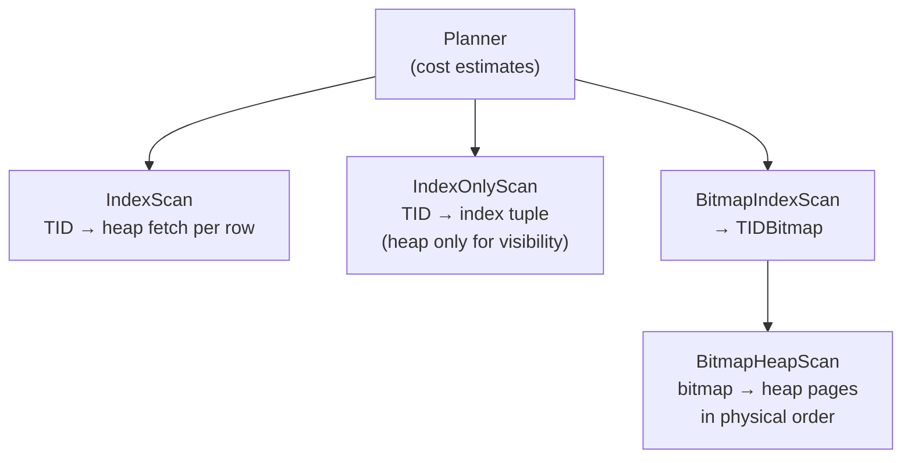
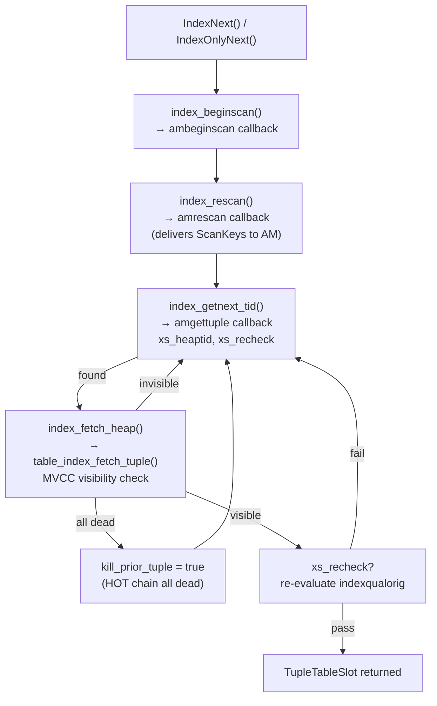
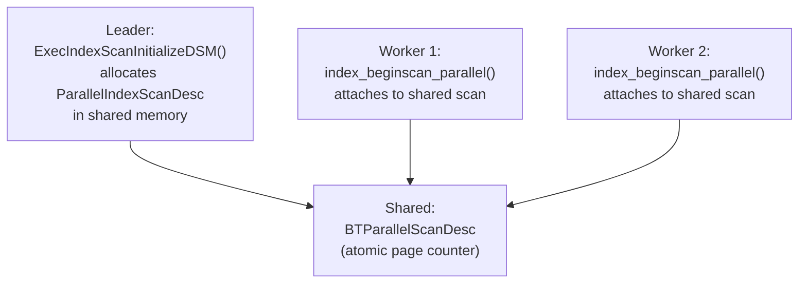

# Index Scan Code Path

PostgreSQL provides three executor nodes for index-based access: `IndexScan`, `IndexOnlyScan`, and `BitmapHeapScan`. They differ in when and whether they access the heap, but all three sit above a common index access method (AM) interface. The executor layer, the generic AM interface in `indexam.c`, and a specific AM implementation like B-tree each have distinct responsibilities. Understanding this division clarifies why the code is structured as it is. It also explains what happens at each stage of retrieving a row.

## Three Plan Nodes, Three Access Patterns

The planner chooses among the three index scan nodes based on cost estimates. These estimates reflect the predicted selectivity and the fraction of heap pages that are all-visible.

**IndexScan** uses the index to locate matching TIDs one at a time. For each TID, it fetches the corresponding heap tuple. It then checks MVCC visibility before returning the tuple. The rows come back in index order (or the order the AM produces them). This is the most general form. It works for any index type.

**IndexOnlyScan** also traverses the index in TID order, but it reads column values directly from the index tuple rather than from the heap. The scan needs a heap access only to confirm visibility, and only when the heap page is not yet marked all-visible in the visibility map. On well-vacuumed tables this makes it a near-heap-free operation.

**BitmapHeapScan** separates index traversal from heap access entirely. A companion `BitmapIndexScan` node traverses the index. It accumulates all matching TIDs into an in-memory bitmap. `BitmapHeapScan` then reads the heap pages referenced by that bitmap in physical block order. This amortizes I/O cost across many matching rows at the price of losing index ordering and requiring an intermediate bitmap structure.



The boundary between `BitmapIndexScan` and `BitmapHeapScan` also enables multi-index access: multiple `BitmapIndexScan` nodes can feed their bitmaps into `BitmapAnd` or `BitmapOr` nodes before passing the combined bitmap to `BitmapHeapScan`.

## Scan Key Compilation

Before any index AM sees a query, the executor translates SQL qual expressions into `ScanKey` structs — a compact, pre-compiled form the AM can evaluate without re-parsing the expression tree (nodeIndexscan.c, `ExecIndexBuildScanKeys`).

Each `ScanKey` encodes:
- the index column number (`sk_attno`)
- the comparison operator's strategy number within its operator family (`sk_strategy`)
- the operator's comparison function OID (`sk_func`)
- the comparison value (`sk_argument`)
- flags controlling special cases (`sk_flags`)

The `sk_strategy` number is AM-specific. For B-tree, strategy 1 is `<`, 2 is `<=`, 3 is `=`, 4 is `>=`, 5 is `>`. The executor looks this up from `pg_amop` at init time by calling `get_op_opfamily_properties()`.

`ExecIndexBuildScanKeys` handles five classes of qual expression:

- **Simple operators** (`indexkey op constant`): the executor fully populates the scan key at init time. It detoasts the constant upfront to avoid repeated detoasting per row.
- **Runtime keys** (`indexkey op expression`): the executor creates the scan key but leaves `sk_argument` blank. An `IndexRuntimeKeyInfo` records the expression and a pointer back to the scan key. At each rescan, `ExecIndexEvalRuntimeKeys` re-evaluates the expression and patches the argument in. Volatile expressions like `now()` and references to outer-query parameters fall into this category.
- **Row comparison expressions** (`(col1, col2) op (val1, val2)`): a header scan key with `SK_ROW_HEADER` points to a subsidiary array of per-column scan keys, each with `SK_ROW_MEMBER` (and the last with `SK_ROW_END`).
- **Array keys** (`indexkey op ANY (array)`): when the index AM advertises `amsearcharray = true`, the executor sets `SK_SEARCHARRAY` and hands the array to the AM directly. Otherwise the executor iterates through array elements itself via `IndexArrayKeyInfo`, calling `index_rescan` for each element.
- **Null tests** (`indexkey IS NULL / IS NOT NULL`): the executor sets flags `SK_SEARCHNULL` or `SK_SEARCHNOTNULL` with no comparison function.

The separation of compile-time constant keys from runtime keys is a deliberate optimization: inner loops that repeatedly re-execute a nested-loop join's index scan pay only the cost of re-evaluating the non-constant expressions, not the cost of rebuilding the entire scan key array from scratch.

## The Index AM Callback Interface

The generic layer in `indexam.c` defines a uniform protocol that every index AM must implement. The executor never calls B-tree functions directly. It calls the generic wrappers, which dispatch through function pointers stored in `IndexRelation->rd_indam`.

**`index_beginscan`** allocates the `IndexScanDesc` by calling the AM's `ambeginscan` callback. It attaches the heap relation and snapshot. It sets up the `xs_heapfetch` handle for later heap accesses. For bitmap scans, a separate `index_beginscan_bitmap` path handles setup instead. It skips heap fetch infrastructure because the AM's `amgetbitmap` callback handles everything.

**`index_rescan`** (called after `index_beginscan` and after every rescan) delivers the compiled scan keys to the AM via `amrescan`. This is the moment the AM actually sees the key values and positions itself. Separating begin and rescan allows the scan descriptor to be reused across outer-loop iterations of a nested-loop join without re-allocating it.

**`index_getnext_tid`** drives the core per-tuple loop. It calls the AM's `amgettuple` callback with a scan direction. The callback places the next matching TID in `scan->xs_heaptid`. It also sets `scan->xs_recheck` if the index AM cannot guarantee the entry fully satisfies the qual (more on this below). The generic layer resets `kill_prior_tuple` and `xs_heap_continue` each time to prevent stale state from leaking across calls.

**`index_fetch_heap`** fetches the heap tuple for the current TID by calling `table_index_fetch_tuple`. This is where the function checks MVCC visibility. If the tuple is invisible (e.g., deleted by a committed transaction), the function returns false. The caller then loops to get the next TID. If the entire HOT chain for the TID consists of dead tuples, the function returns `all_dead` as true and sets `scan->kill_prior_tuple`. This causes the AM to mark the index entry as dead on the next `amgettuple` call. This lazily cleans up dead index entries during normal scan operation.

**`index_getnext_slot`** is the combined loop used by `IndexScan`. It calls `index_getnext_tid` and `index_fetch_heap` in a tight loop, handling HOT chains (multiple visible tuples under one index entry) via the `xs_heap_continue` flag.

**`index_endscan`** calls `amendscan` to let the AM release its resources, then drops the heap fetch handle and the relcache reference count acquired at begin time.

The index stores only indexed column values plus the TID of the heap tuple — it carries no MVCC information, no `xmin`, `xmax`, or [[subsystems/transactions/hint-bits|hint bits]]. A deleted row remains in the index until VACUUM removes it. So when `amgettuple` returns a TID, the index AM cannot know whether that heap tuple is visible to the current transaction's snapshot. The heap visit therefore serves two purposes: reading the tuple data, and performing the visibility check. If the check fails — the tuple was deleted, not yet committed, or locked — the executor discards the TID and requests the next one. This is why an `IndexScan` may visit far more index entries than the number of rows it ultimately returns. This gap grows when a table has high churn. The lazy `kill_prior_tuple` mechanism mitigates some of this cost. When `index_fetch_heap` finds that a TID's entire HOT chain is dead, it sets the flag. The next `amgettuple` call then marks the index entry with an LP_DEAD marker. Subsequent B-tree scans can skip a marked entry. VACUUM removes it during its next pass.



## Index-Only Scan Mechanics

An index-only scan is viable when the planner can prove that every column needed by the query — both in the output list and in all qual expressions — is present in the index. The planner verifies this by checking `index_can_return()` for each relevant column. This function calls the AM's optional `amcanreturn` callback.

The executor sets `scan->xs_want_itup = true` to signal to the AM that it should fill `scan->xs_itup` (or `scan->xs_hitup` for a pre-formed heap-format tuple) in addition to `xs_heaptid`. The B-tree AM honors this by keeping its leaf page pinned during index-only scans so it can copy the index tuple.

The scan cannot skip visibility checks entirely. The index-only scan path in `IndexOnlyNext` (nodeIndexonlyscan.c) checks the visibility map for each TID before deciding whether to visit the heap:

```
if (!VM_ALL_VISIBLE(heapRelation, block, &ioss_VMBuffer))
    /* must visit heap */
```

A page flagged all-visible guarantees that every tuple on it is visible to all current and future transactions — any snapshot will see all of them. This invariant lets the scan satisfy the visibility check without reading the heap page itself. For pages not yet marked all-visible, the scan falls back to `index_fetch_heap` to confirm visibility, but still takes its column values from the index tuple.

The scan checks the visibility map without locking the VM buffer, to avoid contention. The memory ordering argument in the source code explains why this is safe. Inserts clear the VM bit before updating the index, using locks on the index page as barriers. So if the scan sees a freshly-inserted TID via the index, it will also see the cleared VM bit. Deletes are different: deleting a row does not update the index, so the VM bit clearing is not synchronized with the index page lock. This is acceptable because a deleted tuple remains visible until the deleting transaction commits.

When no heap visit occurs, the scan must still acquire predicate locks for serializable isolation. Because the heap page was not touched, the scan takes the predicate lock on the page explicitly via `PredicateLockPage`.

`StoreIndexTuple` unpacks index tuple values into the result slot by calling `index_deform_tuple`. An edge case exists for `name`-typed columns: B-tree stores `name` values as `cstring` (without the trailing null padding), so the code must copy them into a `NAMEDATALEN`-sized allocation to match the type contract.

## Backward Scans

Many index AMs can traverse their entries in reverse order. The AM declares this capability with `amcanbackward = true` in its `IndexAmRoutine`. B-tree supports it; hash, GIN, GiST, and BRIN do not.

The `ScanDirection` argument passed to `amgettuple` controls the direction. `IndexNext` computes the effective direction by combining the plan-level `indexorderdir` with the executor's `es_direction`:

```c
direction = ScanDirectionCombine(estate->es_direction,
                                 ((IndexScan *) node->ss.ps.plan)->indexorderdir);
```

This combination lets a query with `ORDER BY col DESC` scan the index forward while the sort requests backward output, or vice versa. The planner picks whichever combination avoids a sort node.

For B-tree, `_bt_first` handles the initial positioning for both directions. A backward scan positions on the last matching entry rather than the first. `_bt_next` follows left-sibling links instead of right-sibling links when moving between leaf pages. The scan key preprocessing step detects when the key set is unsatisfiable (e.g., `x > 5 AND x < 3`). In that case, it avoids I/O entirely.

When `IndexNextWithReorder` is active (queries with `ORDER BY` on approximate distance operators), the executor supports only forward scans. The comment in the source notes that no AM currently advertises both `amcanorderbyop` and `amcanbackward`.

## MVCC During Index Scans

Because index entries are not updated on DELETE (only on INSERT and by VACUUM), a B-tree scan may encounter entries pointing to tuples that are dead under the current snapshot. The sequence of events is:

1. Transaction A deletes a row, setting `xmax` in the heap tuple.
2. The index entry pointing to that tuple still exists.
3. Transaction B scans the index, receives the TID, fetches the heap tuple.
4. `table_index_fetch_tuple` evaluates the heap tuple's visibility against B's snapshot.
5. If A has committed and B's snapshot started after A committed, the tuple is invisible and the TID is silently discarded.

For snapshot isolation to hold, the visibility check must always use the snapshot that was active at `index_beginscan` time. The scan stores the snapshot in `scan->xs_snapshot` and passes it through to the heap AM's visibility routines. This also explains why bitmap scans require MVCC snapshots. Bitmap scans separate index traversal from heap access in time: the bitmap is built under one snapshot, but the heap tuples might be read later. MVCC provides the necessary stability guarantee across that gap.

The `xs_heap_continue` flag handles one subtlety: a single index TID may correspond to multiple heap tuples in a HOT chain (updates that reuse the same page slot). For MVCC snapshots, at most one tuple in the chain is visible at any given snapshot, so the loop terminates quickly. Non-MVCC snapshots (like `SnapshotAny`) can see multiple versions. When `xs_heap_continue` is true, it tells `index_getnext_slot` not to fetch the next TID from the index, and instead to continue fetching heap tuples for the current TID.

## Recheck Conditions

Not all index AMs can evaluate their predicates with perfect precision. Some encode keys in a lossy way that may admit false positives; others compute bounding approximations because the exact match test is too expensive to perform during index traversal. When this happens, the AM sets `scan->xs_recheck = true` in its `amgettuple` (or `amgetbitmap`) callback.

The executor interprets this as: "the TID is a candidate match, but you must re-evaluate the original qual against the heap tuple before returning it."

In `IndexNext`:

```c
if (scandesc->xs_recheck)
{
    econtext->ecxt_scantuple = slot;
    if (!ExecQualAndReset(node->indexqualorig, econtext))
    {
        InstrCountFiltered2(node, 1);
        continue;
    }
}
```

`indexqualorig` holds the original qual expressions as an `ExprState` tree — the same predicate the planner generated before the executor compiled it into scan keys. Re-evaluating this against the heap tuple guarantees correctness even if the index returned a false positive.

The AMs that need recheck are:

- **GiST**: stores bounding boxes or other approximations; the stored representation may contain the query shape without the indexed value actually matching.
- **GIN**: for phrase-search and partial-match queries, the posting list may be an overapproximation.
- **BRIN**: stores min/max (or other summaries) per page range; a page range's min/max may contain the search value even if no individual tuple on those pages actually satisfies the predicate.
- **SP-GiST**: similar to GiST, depends on the operator class.

B-tree never sets `xs_recheck` for equality and range conditions because B-tree stores exact values. It does set `xs_recheckorderby` for KNN queries using operator classes that return approximate distances.

For `BitmapHeapScan`, recheck works at the page granularity. When the bitmap degrades to a lossy representation (page-level rather than TID-level), the executor must recheck every tuple on the referenced page against the original qual. The bitmap no longer encodes which specific tuples matched.

## Ordering Operators and the Reorder Queue

Queries with `ORDER BY` on index operators (KNN queries: `ORDER BY point <-> '(1,2)'`) use `IndexNextWithReorder`. The GiST index AM can return approximate distances, setting `xs_recheckorderby = true`. Because the index-delivered distance may be pessimistic — the actual heap-computed distance could be smaller — the executor cannot return tuples immediately in the order the index delivers them.

The executor maintains a pairing heap (`iss_ReorderQueue`) keyed by ORDER BY distance. Tuples with inaccurate distances go into the queue. The executor returns a tuple from the queue only when the topmost queue entry's recalculated distance is smaller than or equal to the next distance the index would return. At that point, no future index entry could displace it. This merge of heap-recomputed distances with index-delivered distances ensures the output order is correct even when the index's distance function is lossy.

## Parallel Index Scans

Both `IndexScan` and `IndexOnlyScan` support parallel execution. The leader process allocates a `ParallelIndexScanDesc` in shared memory via `ExecIndexScanInitializeDSM`. This calls `index_parallelscan_initialize`. That function serializes the snapshot and calls the AM's `aminitparallelscan` callback to set up any AM-specific shared state. For B-tree, this includes a mutex-protected `BTParallelScanDesc` that tracks which leaf page a worker is processing next.

Worker processes attach via `ExecIndexScanInitializeWorker`, which calls `index_beginscan_parallel`. This restores the serialized snapshot and creates a per-worker `IndexScanDesc`, all pointing to the same shared `ParallelIndexScanDesc`.

The key to splitting work between workers is inside the AM. B-tree's parallel scan implementation issues pages to workers atomically: when a worker finishes a leaf page, it increments a shared atomic counter to claim the next page. Workers do not pre-divide the key range statically. Instead they claim pages dynamically as they finish. This naturally load-balances across workers, even when some leaf pages have more matching entries than others.

The executor side is largely unaware of this partitioning. Each worker runs the same `IndexNext` loop as a serial scan. The only difference is that the worker calls `index_beginscan_parallel` instead of `index_beginscan`. Internally, the AM's `amgettuple` coordinates with the shared state to avoid returning the same TID to two workers.



## B-tree Descent and Leaf Traversal

B-tree is the most common index AM. It illustrates how `amgettuple` works in practice.

The first call to B-tree's `amgettuple` calls `_bt_first`, which pre-processes the scan keys (`_bt_preprocess_keys`) to collapse redundant conditions and detect unsatisfiable combinations. It then descends the tree from the root by binary-searching each internal page for the correct child downlink. It follows that downlink after releasing the parent page lock. The right-sibling link invariant handles concurrent splits: if the target key has migrated to a sibling due to a split, the scan follows right links at the current level. It continues until it lands on the correct page.

Once positioned on the first matching leaf entry, `_bt_readpage` reads the qualifying entries from the current leaf page into an in-memory array. Subsequent calls to `amgettuple` advance through this array cheaply until the page is exhausted, then follow the leaf's `btpo_next` right-link to the next leaf page. This page-level prefetch of TIDs amortizes the cost of page locking across multiple tuples on the same page.

## Scan Lifecycle

The lifecycle of a single `IndexScan` execution:

1. `ExecInitIndexScan` — opens heap and index relations, compiles quals into `ScanKey` and `IndexRuntimeKeyInfo` arrays.
2. First call to `ExecIndexScan` — lazy-initializes the `IndexScanDesc` via `index_beginscan` and `index_rescan`.
3. Per-tuple loop via `IndexNext` — calls `index_getnext_slot`, which alternates between `index_getnext_tid` (AM) and `index_fetch_heap` (heap AM), with `xs_recheck` evaluation after each heap fetch.
4. Rescan (e.g., inner side of a nested-loop join) — `ExecReScanIndexScan` re-evaluates runtime keys and calls `index_rescan` to reposition the AM.
5. `ExecEndIndexScan` — calls `index_endscan` then `index_close`.

## See Also

- [[subsystems/planner/overview]] — how the planner chooses between sequential scan, index scan, and bitmap scan
- [[subsystems/planner/index-selection]] — cost model for index scans
- [[subsystems/storage/visibility-map]] — the visibility map that index-only scans consult
- [[subsystems/transactions/mvcc]] — MVCC visibility rules applied during `index_fetch_heap`
- [[subsystems/storage/fsm]] — related storage infrastructure
- [[code-paths/vacuum]] — VACUUM's role in marking pages all-visible and removing dead index entries

## Related Topics

- [[subsystems/indexes/index-am|Index Access Method Interface]] — the `IndexAmRoutine` callbacks (`ambeginscan`, `amgettuple`, `amrescan`) that every AM must implement
- [[subsystems/indexes/index-only-scans|Index-Only Scans]] — deeper coverage of the visibility-map check and index tuple projection that avoid heap access
- [[subsystems/indexes/btree|B-tree Index AM]] — how `_bt_first`, `_bt_readpage`, and leaf-page traversal implement `amgettuple` for the most common AM
- [[subsystems/transactions/snapshot|Snapshots]] — snapshot acquisition and the MVCC visibility rules applied inside `index_fetch_heap`
- [[subsystems/storage/buffer-manager|Buffer Manager]] — how heap pages are pinned and read during `index_fetch_heap` and bitmap heap scan
- [[subsystems/executor/parallel|Parallel Query]] — the DSM / worker framework that `ExecIndexScanInitializeDSM` plugs into
- [[subsystems/executor/seq-scan|Sequential Scan]] — the simpler scan path used when index access is not cost-effective
