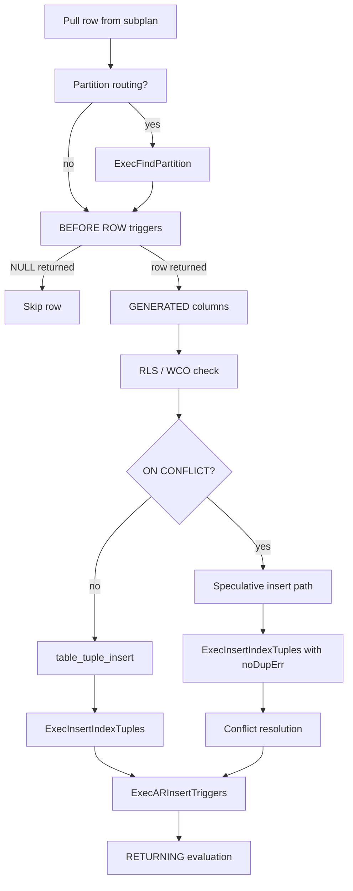

# INSERT Code Path

An `INSERT` statement follows the same parse → analyze → rewrite → plan → execute pipeline as a `SELECT`. The difference appears in the plan tree: the root node is a `ModifyTable` rather than a scan or join. `ModifyTable` drives the write path through the heap access method.

## Plan shape

For a simple `INSERT INTO t VALUES (...)` the plan tree is:

```
ModifyTable (operation=INSERT, resultRelation=t)
  └── Result (constant projection of the VALUES row)
```

For `INSERT INTO t SELECT ...` the subplan is a normal query plan rooted under `ModifyTable`. `ModifyTable` pulls rows from its subplan and inserts each one.

## The ModifyTable executor node

`ModifyTable` is the single executor node responsible for INSERT, UPDATE, and DELETE. Unifying all write operations under one node keeps trigger firing, RETURNING evaluation, and partition routing in one place rather than scattered across separate node types. Before processing any rows, it fires BEFORE STATEMENT triggers. It then pulls rows from its subplan one at a time, routing each to the appropriate per-row write path. For partitioned tables, a `tableoid` junk column on each row identifies which partition the row belongs to. When the subplan is exhausted, execution is complete. The implementation lives in `ExecModifyTable()` (`nodeModifyTable.c`).

## Per-row processing

The per-row flow in `ExecInsert()` is more involved than it appears at first glance. The sequence below represents the order of operations for a plain heap INSERT with no partition routing and no ON CONFLICT clause, with other cases diverging at the noted points.



### BEFORE ROW triggers and row suppression

Before writing to the heap, each row passes through BEFORE ROW triggers (`ExecBRInsertTriggers()`, `nodeModifyTable.c`). A trigger may return a modified version of the row or return NULL to suppress the insert entirely. Suppression happens silently — no error, no row written. This design gives trigger authors full control over which rows ultimately reach storage.

### GENERATED columns and constraint checks

After any BEFORE ROW trigger modifications, the executor computes `GENERATED ALWAYS AS` column values and stores them in the slot. The executor then validates the row against row-level security policies (`ExecWithCheckOptions()`), CHECK constraints, and — for partitioned targets — the partition constraint. Checking after BEFORE ROW triggers rather than before them ensures that the checks test the row the executor will actually write, not the row as it arrived.

The executor evaluates CHECK constraints declared `NOT DEFERRABLE` immediately here. Deferrable constraints work differently. Deferrable constraints postpone enforcement until end-of-transaction or end-of-statement. Each deferred constraint registers itself in the constraint trigger queue via `AfterTriggerSaveEvent()`. At the deferred firing point, the constraint re-checks every affected row by re-fetching it from the heap and applying the constraint predicate. This means the executor still inserts a row into the heap even when the row fails a deferred constraint. The deferred check discovers the violation only when it fires. Foreign key constraints follow the same deferred model: the referential integrity check is a special trigger registered on both the referencing and referenced tables.

### ON CONFLICT: speculative insertion

When the statement includes an `ON CONFLICT` clause, PostgreSQL uses speculative insertion to detect unique-constraint conflicts without holding heavyweight locks. The sequence is:

1. Conflict pre-check: the executor scans every arbiter index with a `DirtySnapshot` — a snapshot that sees even uncommitted tuples — to detect conflicts before writing anything to the heap (`ExecCheckIndexConstraints()`). If the scan finds a conflict, it returns the TID.
2. If the pre-check detects no conflict, the executor writes the tuple to the heap under a per-XID speculative token (`table_tuple_insert_speculative()`). This token acts as a [[subsystems/locking/lwlocks|lightweight lock]] that other transactions can wait on instead of taking a full row lock.
3. Index entry insertion proceeds with `noDupErr=true` (`ExecInsertIndexTuples()`). This setting suppresses the unique-violation error and returns the conflicting TID instead.
4. If index insertion finds a conflicting entry: for `ON CONFLICT DO NOTHING`, `table_tuple_complete_speculative(succeeded=false)` cancels the speculative tuple; for `ON CONFLICT DO UPDATE`, `ExecOnConflictUpdate()` runs the update on the conflicting row.
5. If no conflict: `table_tuple_complete_speculative(succeeded=true)` promotes the tuple to a normal heap tuple.

The outer retry loop in `ExecInsert()` handles the case where another session inserts a conflicting row between step 1 and step 3. Because the speculative token is visible to concurrent transactions, they wait on it rather than proceeding past the conflict check. This prevents phantom conflicts. (`execIndexing.c`, `nodeModifyTable.c`.)

### Writing to the heap

Without ON CONFLICT, the row is handed to the table access method via `table_tuple_insert()`. For heap tables this dispatches to `heap_insert()` (`heapam.c`), described in the next section.

### Index maintenance

The executor inserts index entries only after the heap insert completes, not before. This ordering matters. An index entry pointing to a non-existent heap tuple would be dangerously inconsistent. A heap tuple without an index entry is merely invisible to index scans until the entry is added. `ExecInsertIndexTuples()` (`execIndexing.c`) iterates every index on the relation and inserts an entry for the new tuple's TID.

For each index, `ExecInsertIndexTuples()` computes the index key values with `FormIndexDatum()`, then calls `index_insert()`. The uniqueness check mode passed to `index_insert()` depends on the index and context:

- `UNIQUE_CHECK_NO` for non-unique indexes.
- `UNIQUE_CHECK_YES` for immediate unique constraints — a violation raises an error immediately.
- `UNIQUE_CHECK_PARTIAL` for deferred unique constraints or the speculative insertion path — the index AM detects potential violations but does not raise an error. Instead, it returns a flag so the caller can decide.

The executor skips partial indexes whose predicate the new row does not satisfy. `check_exclusion_or_unique_constraint()` checks exclusion constraints after insertion. It uses a `DirtySnapshot` to find even uncommitted conflicting tuples and waits on in-progress inserters as needed.

### AFTER ROW triggers and RETURNING

`ExecARInsertTriggers()` (`nodeModifyTable.c`) queues AFTER ROW triggers after the heap and index writes succeed. The executor defers them rather than firing them immediately, so they observe committed heap state. If the statement has a `RETURNING` clause, `ExecProcessReturning()` evaluates it against the new tuple and returns a result row to the caller.

## Writing a tuple to the heap

`heap_insert()` (`heapam.c`) performs four logical operations to durably place a tuple on a heap page.

**Header preparation.** `heap_prepare_insert()` clears all transaction-related infomask bits, then stamps the tuple header with the inserting transaction's XID in `t_xmin`, zero in `t_xmax`, and the current command ID in `t_cid`. `heap_prepare_insert()` also sets the `HEAP_XMAX_INVALID` flag. The infomask bits reflect that `t_xmin` is in progress — neither `HEAP_XMIN_COMMITTED` nor `HEAP_XMIN_INVALID` is set — so the tuple is invisible to all other transactions until the inserter commits. This is MVCC's fundamental write-visibility rule expressed at the tuple level. If the tuple exceeds `TOAST_TUPLE_THRESHOLD` or already carries external [[subsystems/storage/toast|TOAST]] data, `heap_prepare_insert()` calls `heap_toast_insert_or_update()` and returns the toasted version of the tuple. (`heap_prepare_insert()`, `heapam.c`.)

**Page selection.** `RelationGetBufferForTuple()` (`hio.c`) finds a page with enough free space to hold the new tuple. The search follows a preference order designed to balance locality against wasted space: first a cached last-insert-target block, then a page from the [[subsystems/storage/fsm|Free Space Map]] (which tracks approximate free space per page), then the last page of the relation, and finally a new extended page. Caching the last insert target is a cheap optimization for bulk-load workloads. Falling back to the FSM handles the general case without scanning pages directly. If the chosen page was previously all-visible, `heap_insert()` clears both the page's all-visible flag and the corresponding bit in the [[subsystems/storage/visibility-map]]. This tells VACUUM it must re-examine the page.

**Placement and dirty marking.** `RelationPutHeapTuple()` copies the tuple bytes onto the chosen page, assigns an offset number, and sets `t_ctid` to the tuple's own TID. `MarkBufferDirty()` then marks the buffer dirty, making it eligible for eventual writeback by the background writer or checkpointer.

**WAL logging.** Before releasing the buffer, `heap_insert()` assembles and writes a WAL record. The record type `XLOG_HEAP_INSERT` carries an `xl_heap_insert` header — which contains the page offset number and flags — followed by an `xl_heap_header` with the tuple's infomask fields, and finally the tuple data itself. The `XLOG_HEAP_INSERT_ALL_VISIBLE_CLEARED` flag in the record signals the redo routine to also re-clear the visibility map bit during recovery. `XLogInsert()` submits the record to the WAL buffer. `PageSetLSN()` stamps the page with the returned LSN, establishing the causal link between the in-memory page state and the WAL stream that can reconstruct it. (`XLogInsert()`, `heapam.c`.)

## Bulk insert optimizations

Two `heap_insert()` flags exist specifically for high-throughput workloads that bypass normal WAL and visibility behavior.

**`HEAP_INSERT_FROZEN`** marks `t_xmin` as frozen (setting `HEAP_XMIN_FROZEN` in the infomask) at insert time. MVCC treats a frozen tuple as visible to all transactions regardless of their snapshot age — it is as if the inserting transaction committed at the beginning of time. `COPY` uses this flag when loading into a freshly created table inside the same transaction. This is safe because no other session can see the table until the transaction commits. The optimization avoids the overhead of later freeze passes by VACUUM on bulk-loaded data.

**`HEAP_INSERT_SKIP_WAL`** suppresses WAL logging for the insert. This is valid only when the relation itself is not WAL-logged. The relation qualifies either because it was created with `UNLOGGED`, or because it was created in the current transaction and is therefore crash-safe to lose. `COPY` uses this flag for unlogged tables, dramatically reducing I/O for bulk loads at the cost of durability. With `HEAP_INSERT_SKIP_WAL` set, `heap_insert()` skips WAL logging and does not call `PageSetLSN()`, so the page carries LSN 0. It still marks the buffer dirty for normal shared-buffer writeback.

A third optimization relevant to `COPY` is the bulk buffer-flushing mode. `RelationGetBufferForTuple()` enables this mode when the caller holds an exclusive lock on the relation. In this mode, newly allocated pages skip the normal FSM lookup and extend sequentially, improving write locality and reducing lock contention in `hio.c`.

## Partition routing

When the target relation is partitioned, `ExecInsert()` calls `ExecPrepareTupleRouting()` before the BEFORE ROW trigger step. This function calls `ExecFindPartition()` (`execPartition.c`) to identify the correct leaf partition for the incoming row.

`ExecFindPartition()` traverses the partition hierarchy starting at the root. At each level it calls `FormPartitionKeyDatum()` to extract the partition key's column values from the tuple slot, then calls `get_partition_for_tuple()` to binary-search the partition bounds. For HASH partitioning, the search is a direct index into the bounds array using the computed hash. For LIST and RANGE partitioning, it is a binary search that caches the result after `PARTITION_CACHED_FIND_THRESHOLD` (16) consecutive hits on the same partition. This caching provides O(1) dispatch for workloads that insert rows in sorted order.

If no partition matches and a default partition exists, the executor re-checks the partition constraint to confirm the row does not actually belong to any defined partition, then routes the row to the default partition. If no partition matches and there is no default, the executor raises an error immediately.

`ExecInitPartitionInfo()` builds partition `ResultRelInfo` objects lazily, on first use. Opening a partition requires translating WCO lists, RETURNING target lists, and ON CONFLICT projection state from the root relation's attribute numbers to the partition's — each partition may have different physical column ordering. Once built, the executor registers the `ResultRelInfo` in `estate->es_tuple_routing_result_relations` and reuses it for subsequent rows that route to the same partition. This way, the executor pays the setup cost only once per partition per statement.

After routing, the insert proceeds against the leaf partition's `ResultRelInfo` rather than the root's. The executor opens and maintains indexes on the partition independently. It does not touch the root's indexes. AFTER ROW triggers on both the root and the partition fire if defined.

## RETURNING clause handling

`ExecProcessReturning()` (`nodeModifyTable.c`) implements the `RETURNING` clause. The executor calls it once per row after the heap write and index maintenance succeed. The function sets up a `TupleTableSlot` containing the newly inserted tuple and evaluates the RETURNING projection expression against it.

For a plain insert the newly inserted tuple is already in the slot used during insertion, so no additional heap fetch is required. The executor pre-compiles the projection during executor initialization into a `ProjectionInfo` that maps heap attributes to output columns, evaluates expressions, and handles type coercions. The executor returns the resulting slot up through to the portal. The portal streams it to the client the same way it streams a SELECT result.

When `RETURNING` references columns modified by a BEFORE ROW trigger, the result reflects those modifications. This is because the slot contains the post-trigger version of the row written to the heap.

**PostgreSQL 18:** `RETURNING` can reference both `OLD` and `NEW` aliases. For INSERT, `OLD.*` is always null (there was no prior row); `NEW.*` is the inserted row. UPDATE, DELETE, and MERGE share this symmetric alias scheme, allowing unified application code that handles all DML types.

## Trigger firing sequence

The full trigger firing sequence for INSERT, accounting for all trigger types, is:

| Point in execution | Trigger type | Function |
|---|---|---|
| Before any rows are processed | BEFORE STATEMENT | `ExecModifyTable()` calls trigger manager |
| Before each heap write | BEFORE ROW | `ExecBRInsertTriggers()` |
| After heap write and index maintenance | AFTER ROW (queued) | `ExecARInsertTriggers()` |
| After all rows, during executor shutdown | AFTER STATEMENT | `ExecutorFinish()` flushes trigger queue |
| At end of transaction (deferred) | AFTER ROW or AFTER STATEMENT deferred | Flushed by `AfterTriggerEndXact()` |

`AfterTriggerSaveEvent()` does not fire AFTER ROW triggers immediately — it places them into an in-memory event queue. The trigger manager flushes the queue at statement end (for non-deferred triggers) or transaction end (for deferred ones). Queuing rather than immediate firing allows the trigger to observe the fully committed effects of the statement rather than intermediate states. AFTER STATEMENT triggers fire in `ExecutorFinish()` (`execMain.c`), not inside `ExecInsert()`, ensuring they see the complete result of the statement.

## Visibility after insert

The new tuple is visible only to the inserting transaction until it commits. Other transactions see `t_xmin` as an in-progress XID (present in their `snapshot->xip[]`) and skip the tuple. After commit, `t_xmin` is known committed (via [[subsystems/storage/clog|CLOG]]). `HeapTupleSatisfiesMVCC()` then returns visible for any snapshot taken after the commit. Subsequent reads may set the `HEAP_XMIN_COMMITTED` [[subsystems/transactions/hint-bits|hint bit]] on the page to avoid re-checking CLOG. This hint write is itself a buffer-dirtying operation. Read-only replicas may skip it.

## See also

- [[subsystems/storage/heap]] — tuple header format, HOT, heap page layout
- [[subsystems/storage/visibility-map]] — all-visible flag clearing during insert
- [[subsystems/transactions/mvcc]] — how t_xmin and snapshot visibility interact
- [[subsystems/executor/overview]] — ModifyTable in the executor node taxonomy
- [[code-paths/simple-select]] — the same pipeline for a read-only query
- [[code-paths/upsert]] — ON CONFLICT in depth
- [[code-paths/bulk-loading]] — COPY and bulk insert optimizations
