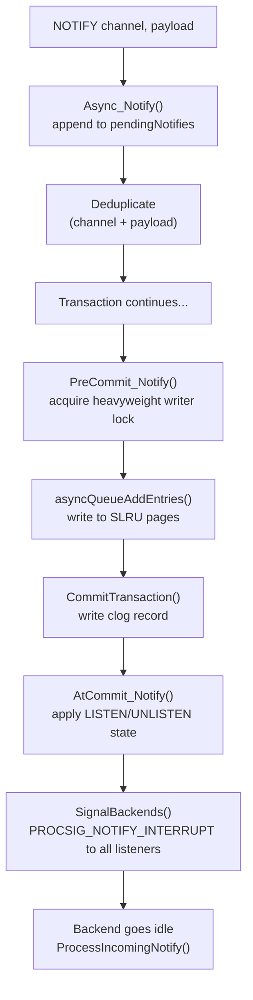
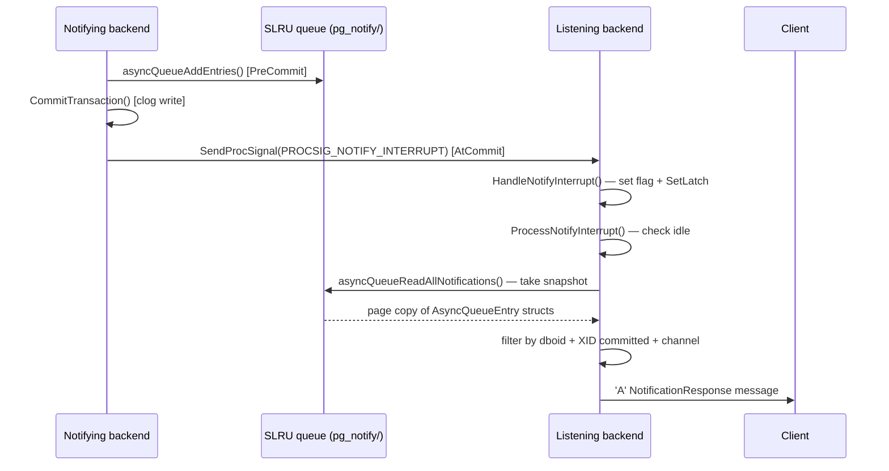

`LISTEN` / `NOTIFY` is PostgreSQL's built-in publish/subscribe mechanism. A backend registers interest in a named channel with `LISTEN`. Another backend fires `NOTIFY` (or calls `pg_notify()`) to broadcast a message with an optional string payload. Every listening backend in the same database receives an asynchronous notification. The entire machinery lives in `src/backend/commands/async.c`.

## The Shared Queue

Notifications flow through a single cluster-wide queue backed by SLRU pages stored in the `pg_notify/` directory. The SLRU layer (`slru.c`) maps the most-recently-used pages into a small shared-memory buffer pool — 8 buffers by default (`NUM_NOTIFY_BUFFERS = 8`, `src/include/commands/async.h`). Pages are `BLCKSZ` bytes each (8 KB by default). They are never WAL-logged or fsync'd. The postmaster wipes `pg_notify/` clean on every startup.

The queue is addressed by `(page, offset)` pairs stored in the `QueuePosition` struct. Page numbers wrap around modulo `QUEUE_MAX_PAGE + 1` (defined as `SLRU_PAGES_PER_SEGMENT * 0x10000`). Because SLRU wraparound detection operates on half the address space, the practical limit on data that can accumulate in the queue at any one time is about 4 GB at default `BLCKSZ` — far larger than any realistic workload, but finite.

Each entry in the queue is an `AsyncQueueEntry`:

```c
typedef struct AsyncQueueEntry
{
    int           length;   /* aligned total size of this entry */
    Oid           dboid;    /* sender's database OID */
    TransactionId xid;      /* sender's XID, used to filter uncommitted entries */
    int32         srcPid;   /* sender's PID, forwarded to client */
    char          data[NAMEDATALEN + NOTIFY_PAYLOAD_MAX_LENGTH];
    /* data: null-terminated channel name, then null-terminated payload */
} AsyncQueueEntry;
```

The `dboid` field is the critical isolation boundary. The queue is shared by all databases in the cluster, but each backend silently ignores entries whose `dboid` does not match its own. This also enforces encoding consistency: channel names and payloads are interpreted using the sender's database encoding. All parties in the same database share that encoding.

The payload limit is `BLCKSZ - NAMEDATALEN - 128` bytes (8,063 bytes with default `BLCKSZ`). The channel name is limited to `NAMEDATALEN - 1` bytes (63 characters with the default `NAMEDATALEN = 64`). An entry must fit within a single SLRU page. If the remaining space on the current page is too small, `asyncQueueAddEntries` writes a sentinel entry with `dboid = InvalidOid` to pad the page to its end. It then advances to the next page.

## Shared-Memory Control Structure

The `AsyncQueueControl` structure lives in shared memory and is the single authoritative source for queue positions:

```c
typedef struct AsyncQueueControl
{
    QueuePosition head;          /* next free write position */
    QueuePosition tail;          /* minimum of all per-backend read positions */
    int           stopPage;      /* oldest un-truncated page */
    BackendId     firstListener; /* head of linked list of listening backends */
    TimestampTz   lastQueueFillWarn;
    QueueBackendStatus backend[FLEXIBLE_ARRAY_MEMBER]; /* indexed by BackendId */
} AsyncQueueControl;
```

Each listening backend occupies `backend[MyBackendId]`, which records its PID, database OID, next-listener link, and current read position. Backends that are not listening have `pid = InvalidPid`. The linked list (`firstListener` → `nextListener`) lets `SignalBackends` and `asyncQueueAdvanceTail` scan only active listeners without iterating over the entire `backend[]` array (which has `MaxBackends` slots). The list is kept sorted by `BackendId`. This keeps the scan cache-friendly when there are many listeners.

Three [[subsystems/locking/lwlocks|LWLocks]] protect the structure:

| Lock | Scope |
|---|---|
| `NotifyQueueLock` shared | Read own entry; read `head` and `tail` |
| `NotifyQueueLock` exclusive | Update `head`; inspect other entries; modify listener list |
| `NotifyQueueTailLock` exclusive | Advance `tail`; truncate old pages |
| `NotifySLRULock` | Standard SLRU bank lock acquired by `SimpleLru*` calls |

The required acquisition order to avoid deadlocks is: `NotifyQueueTailLock`, then `NotifyQueueLock`, then `NotifySLRULock`.

## LISTEN Registration

`LISTEN channel` does not register the backend immediately. `Async_Listen` appends a `LISTEN_LISTEN` action to a backend-local `pendingActions` list (allocated in `CurTransactionContext`). The actual registration happens in two phases at transaction commit.

**Pre-commit** (`Exec_ListenPreCommit`): Before the transaction is marked committed in the commit log, the backend inserts itself into `asyncQueueControl->backend[MyBackendId]`. It sets its read position to the maximum of the current tail pointer and the furthest-advanced position of any other listener in the same database — skipping over already-committed notifications that arrived before this session was listening. The registration also installs an `on_shmem_exit` callback (`Async_UnlistenOnExit`). This callback cleans up if the backend dies. The registration must happen pre-commit to close a race window. Without it, a concurrent NOTIFY transaction could commit before the new listener registers, causing the new listener to miss the notification.

**Post-commit** (`Exec_ListenCommit`): After the transaction commits, the channel name is appended to the backend-local `listenChannels` list (a `List` of C strings in `TopMemoryContext`). This is the list checked when filtering incoming notifications. There is a brief window between pre-commit registration and post-commit channel addition. During this window, the backend is in the listener array but matches nothing. This is harmless because the queue read position was already advanced to skip stale entries.

`LISTEN` is idempotent: listening on a channel already in `listenChannels` is silently ignored. `UNLISTEN channel` removes the name; `UNLISTEN *` removes all. If `listenChannels` becomes empty, the backend removes itself from `asyncQueueControl` with `asyncQueueUnregister`.

LISTEN state is session-scoped and survives transaction boundaries. Rolling back a transaction that executed `LISTEN` unregisters the backend from shared memory (in `AtAbort_Notify`) but does not touch any listen state that was committed earlier in the session.

Two-phase commit (`PREPARE TRANSACTION`) is not allowed when the transaction has any pending `LISTEN`, `UNLISTEN`, or `NOTIFY` actions; `AtPrepare_Notify` raises an error.

## NOTIFY: Transaction-Local Staging

`NOTIFY channel [, payload]` (handled by `Async_Notify`) does not touch shared memory at all during execution. It appends a `Notification` struct to the backend-local `pendingNotifies` list, also held in `CurTransactionContext`. The operation is purely local and takes no locks.

**Deduplication**: If the same `(channel, payload)` pair is NOTIFYed more than once within the same transaction, `Async_Notify` keeps only one entry. For up to 15 pending notifications, the check is a linear scan over the list. Once the list reaches `MIN_HASHABLE_NOTIFIES` (16), `Async_Notify` lazily builds a hash table, and all subsequent duplicate checks use it. When subtransactions commit into their parent, the merge process eliminates duplicate notifications. This deduplication is intentional. A trigger that fires once per row on a million-row table emits only one notification, as long as the channel and payload are identical. When callers need distinct notifications despite identical channel names, they can put unique data in the payload.

NOTIFY is blocked inside parallel workers (`Async_Notify` raises an error if called from a parallel worker).

## Committing Notifications

The commit sequence is split into pre-commit and post-commit phases, mirroring the LISTEN registration split.

**`PreCommit_Notify`** writes the pending notifications into the SLRU queue. Before writing, it acquires a heavyweight `AccessExclusiveLock` on a synthetic lock target (`(DatabaseRelationId, InvalidOid, 0)`) — informally the "database 0" lock — which serializes all concurrently-committing notifying transactions. This ensures queue entries appear in strict commit order. It also ensures that no uncommitted entry appears ahead of a committed one in page order. Readers rely on this invariant to know when to stop scanning.

With that lock held, `asyncQueueAddEntries` is called in a loop (once per page) to copy the buffered `Notification` structs into the SLRU pages. `PreCommit_Notify` does not update the global head pointer in shared memory until a full page-worth of writes succeeds, so a disk-full error can still roll the transaction back cleanly. If the queue is full (`asyncQueueIsFull`), an error is raised and the transaction rolls back.

**`AtCommit_Notify`** runs after the commit record is written to `pg_xact`. It applies any pending LISTEN/UNLISTEN actions to `listenChannels`, then calls `SignalBackends` to wake every listening backend that has not yet read up to the new head.



## Signaling Listening Backends

`SignalBackends` scans the linked list of active listeners under `NotifyQueueLock` (exclusive) and builds a list of PIDs and `BackendId`s to signal. It then releases the lock before sending signals, keeping the critical section short.

For backends in the same database, `SignalBackends` signals every listener whose read position is behind the current head. For backends in other databases, it sends the signal only if they are more than `QUEUE_CLEANUP_DELAY` (4) pages behind the head. This is just enough to prod them into advancing their read pointer, which allows the global tail to move forward. Those backends will not deliver the notification, because the `dboid` check filters it out. The signal is purely to prevent tail stall.

If the notifying backend is itself a listener, it sets `notifyInterruptPending = true` directly rather than sending a signal to itself.

The signal used is `PROCSIG_NOTIFY_INTERRUPT`. On Linux this translates to `SIGUSR2` delivered via `kill(2)`, using the `BackendId` to look up the PID quickly.

## Receiving Notifications

When a backend receives `PROCSIG_NOTIFY_INTERRUPT`, the signal handler `HandleNotifyInterrupt` does two things: sets the `notifyInterruptPending` flag and calls `SetLatch(MyLatch)`. The latch wakeup matters when the backend is idle and blocked in `WaitLatchOrSocket`, waiting for the next client command. In that case, the latch interrupts the wait immediately.

`ProcessNotifyInterrupt` is called from two places:
- From `ProcessClientReadInterrupt` while the backend is idle and waiting for client input
- Just before sending `ReadyForQuery` at the end of any frontend command

It returns immediately if called while the backend is inside a transaction block. Actual notification delivery happens only when the backend is truly idle — outside any transaction. This is deliberate: errors during delivery (e.g., encoding conversion failures) would be catastrophic inside a commit sequence.



`ProcessIncomingNotify` wraps the queue read in a short synthetic transaction (`StartTransactionCommand` / `CommitTransactionCommand`) because `asyncQueueReadAllNotifications` takes a snapshot to determine which XIDs have committed. The snapshot is needed because the queue may contain entries from transactions that are still in progress. `asyncQueueReadAllNotifications` skips those entries and leaves the backend's read pointer before them, so it checks them again on the next signal.

`asyncQueueProcessPageEntries` copies the raw page bytes into a local buffer before releasing `NotifySLRULock`. It then iterates over the copy and calls `NotifyMyFrontEnd` for each entry whose channel appears in `listenChannels`. It does not hold the lock during the channel-name comparison or the network write, which is essential for concurrency. If sending a notification to the frontend fails (e.g., due to an encoding error), PostgreSQL upgrades the error to `FATAL` and closes the connection, rather than silently losing a notification.

`NotifyMyFrontEnd` formats the wire-protocol `NotificationResponse` message (type byte `'A'`):

```c
pq_beginmessage(&buf, 'A');
pq_sendint32(&buf, srcPid);   /* sender's backend PID */
pq_sendstring(&buf, channel);
pq_sendstring(&buf, payload);
pq_endmessage(&buf);
```

The `srcPid` field lets clients distinguish self-notifications from notifications sent by other backends. A self-notify is guaranteed to arrive. Applications that want to ignore self-notifies compare `be_pid` in the notification to the PID received during connection startup in `BackendKeyData`.

After scanning, the backend updates its read position in `asyncQueueControl->backend[MyBackendId]` under shared `NotifyQueueLock`. This update is what eventually allows the global tail to advance.

## Queue Tail Advancement and Wraparound

The queue tail (`QUEUE_TAIL`) is the minimum read position across all listening backends. Old SLRU pages cannot be truncated and their disk space reclaimed until the tail advances past them.

*Sending* backends drive tail advancement, not receiving ones. `asyncQueueAddEntries` sets the flag `tryAdvanceTail` whenever the head crosses a page whose number is a multiple of `QUEUE_CLEANUP_DELAY` (4). At the end of `AtCommit_Notify`, if that flag is set, `asyncQueueAdvanceTail` runs. It takes `NotifyQueueTailLock` exclusively, recomputes the minimum position across all listeners, and advances `QUEUE_TAIL`. It then calls `SimpleLruTruncate` to free whole SLRU segments that are now below the new tail.

Concentrating truncation work in senders, rather than having each receiver trigger it, reduces contention. Deferring truncation to segment boundaries reduces the frequency of the `pg_notify/` directory scan.

If a listener falls far behind — specifically, if writing the next head page would produce a page number that logically precedes the tail — `asyncQueueIsFull()` returns true. `PreCommit_Notify` then raises:

```
ERROR:  too many notifications in the NOTIFY queue
```

Because this fires before the transaction commits, the transaction can still roll back cleanly. A warning fires at 50% utilization (at most once every five seconds). It identifies the PID of the slowest listener:

```
WARNING:  NOTIFY queue is 52% full
DETAIL:   The server process with PID 12345 is among those with the oldest transactions.
HINT:     The NOTIFY queue cannot be emptied until that process ends its current transaction.
```

## SQL Surface and Monitoring

`pg_notify(channel text, payload text)` is the SQL-callable equivalent of the `NOTIFY` command:

```sql
-- These are equivalent:
NOTIFY my_channel, 'hello';
SELECT pg_notify('my_channel', 'hello');

-- Empty payload:
NOTIFY my_channel;
SELECT pg_notify('my_channel', '');
```

`pg_notify` is blocked on standby servers (`PreventCommandDuringRecovery`).

`pg_listening_channels()` returns the channels the current session is actively listening on:

```sql
LISTEN jobs;
LISTEN cache_invalidation;

SELECT * FROM pg_listening_channels();
-- jobs
-- cache_invalidation
```

`pg_notification_queue_usage()` returns the fraction of the notification queue currently occupied, from 0.0 to 1.0. It first calls `asyncQueueAdvanceTail` to ensure a fresh reading before measuring:

```sql
SELECT pg_notification_queue_usage();
-- 0.00031...
```

| Property | Value |
|---|---|
| Maximum channel name length | 63 bytes (`NAMEDATALEN - 1`) |
| Maximum payload length | `BLCKSZ - NAMEDATALEN - 128` ≈ 8,063 bytes at default `BLCKSZ` |
| Maximum queued data at one time | ~4 GB at default `BLCKSZ` |
| Queue page size | `BLCKSZ` (default 8,192 bytes) |
| In-memory SLRU buffer pool | `NUM_NOTIFY_BUFFERS` = 8 pages |
| Dedup hash table threshold | 16 notifications per transaction (`MIN_HASHABLE_NOTIFIES`) |
| Tail cleanup interval | Every `QUEUE_CLEANUP_DELAY` = 4 new pages |
| Queue fill warning threshold | 50% |
| Queue fill warning interval | 5 seconds |

## Transaction Semantics

NOTIFY is fully transactional. If the transaction rolls back, `AtAbort_Notify` discards its pending notifications, and no queue entry is ever written. There is no way to send a notification from a transaction that will roll back.

The writer-serialization lock ensures entries appear in the queue in strict commit order. A reader scanning forward will never encounter an entry from a transaction that committed after a later-appearing entry. So the reader can safely stop at the first in-progress XID it encounters, knowing that no committed entries follow it.

LISTEN and UNLISTEN are also transactional: if a `LISTEN` transaction rolls back after `Exec_ListenPreCommit` has already registered the backend in shared memory, `AtAbort_Notify` calls `asyncQueueUnregister` to clean up. `Exec_ListenCommit` never adds the channel name to `listenChannels`, because it only runs on the commit path.

Subtransaction semantics follow the same principle: a subtransaction's pending notifications and LISTEN/UNLISTEN actions bubble up to the parent on commit (`AtSubCommit_Notify`), or `AtSubAbort_Notify` discards them on abort. Merging subtransaction lists into the parent eliminates duplicate notifications.

## Performance Characteristics

LISTEN / NOTIFY is not designed for high-throughput message passing. Several structural constraints limit throughput:

- A single cluster-wide heavyweight lock, held from `PreCommit_Notify` until after `AtCommit_Notify`, serializes concurrent notifying transactions. This is a hard serialization point.
- `SignalBackends` wakes every listener in the same database regardless of which channel they care about. With many listeners, the linear scan and the batch of `kill(2)` calls grow with the listener count, not the channel count.
- PostgreSQL batches notification delivery on the receiver side at idle points, so a backend executing a long-running query delays delivery by the full query duration.
- There is no acknowledgement protocol. If a listening client's connection drops, it permanently loses any notifications sent while it was disconnected.

The typical pattern for high-reliability use is to treat the notification as a wakeup signal and maintain the actual state in a durable table. Workers listen for `NOTIFY new_job`, then `SELECT ... FOR UPDATE SKIP LOCKED` to claim work items. This combines NOTIFY's low-latency wakeup with the RDBMS's durability guarantees.

## Practical Patterns

**Cache invalidation.** A write to a configuration or lookup table fires `NOTIFY cache_invalidation, 'product_prices'`. Application servers listening on `cache_invalidation` flush their in-process caches on receipt. The deduplication guarantee means a batch update generating millions of row changes emits only one notification per transaction (assuming the payload is constant).

```sql
-- Inside a trigger or after an UPDATE:
PERFORM pg_notify('cache_invalidation', 'product_prices');
```

**Lightweight job queues.** A producer inserts a row and issues `NOTIFY new_job`. Workers listening on `new_job` wake up and use `SELECT ... FOR UPDATE SKIP LOCKED` to claim a row. This avoids polling while keeping work items durable in the table.

```sql
-- Producer:
INSERT INTO jobs (task) VALUES ('do something');
NOTIFY new_job;

-- Worker (long-lived connection):
LISTEN new_job;
-- On notification: SELECT ... FROM jobs WHERE ... FOR UPDATE SKIP LOCKED LIMIT 1
```

**DDL change notifications.** Event triggers can call `pg_notify()` on schema changes, letting monitoring tools or migration frameworks react without polling `information_schema`.

```sql
CREATE OR REPLACE FUNCTION ddl_notify() RETURNS event_trigger LANGUAGE plpgsql AS $$
BEGIN
    PERFORM pg_notify('ddl_change', TG_TAG || ':' || TG_EVENT);
END;
$$;

CREATE EVENT TRIGGER ddl_watcher ON ddl_command_end
    EXECUTE FUNCTION ddl_notify();
```

## Related Topics

- [[subsystems/storage/slru|SLRU]] — the Simple LRU buffer layer that backs the `pg_notify/` on-disk queue, managing page reads, writes, and truncation
- [[subsystems/storage/procsignal|ProcSignal]] — the inter-process signaling infrastructure (`PROCSIG_NOTIFY_INTERRUPT`) used to wake listening backends after a NOTIFY commit
- [[subsystems/locking/lwlocks|LWLocks]] — `NotifyQueueLock` and `NotifyQueueTailLock` coordinate access to the shared `AsyncQueueControl` structure
- [[subsystems/transactions/transaction-lifecycle|Transaction Lifecycle]] — NOTIFY and LISTEN actions are staged locally and committed or discarded at pre-commit/post-commit hooks
- [[subsystems/transactions/subtransactions|Subtransactions]] — pending notification lists bubble up or are discarded across subtransaction commit and abort boundaries
- [[subsystems/wire-protocol|Wire Protocol]] — the `NotificationResponse` message (`'A'`) that carries channel name, payload, and sender PID to the client
- [[subsystems/event-triggers|Event Triggers]] — a common use case for `pg_notify()`, firing notifications on DDL changes from within an event trigger function
- [[subsystems/notifications|LISTEN / NOTIFY (subsystem overview)]] — a component-reference view of the same `async.c` machinery, covering `asyncQueueControl` and the notification queue objects directly
