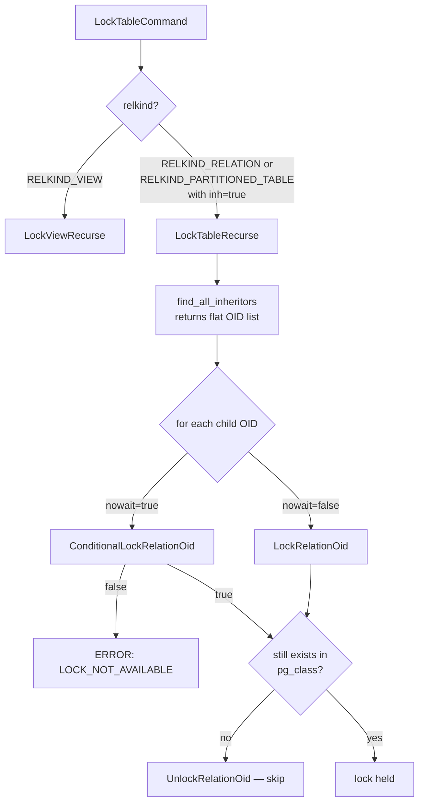
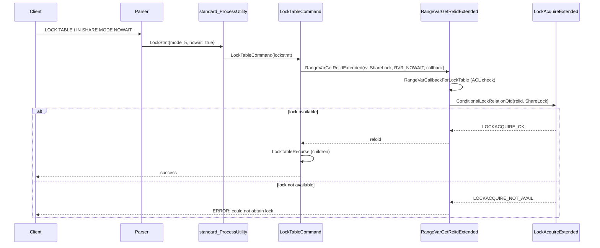

# LOCK TABLE Code Path

`LOCK TABLE` is an explicit relation-level locking statement that gives application code direct control over the PostgreSQL lock manager. Unlike implicit locks acquired by DML, `LOCK TABLE` persists for the full transaction. It also lets the caller choose among all eight lock modes. Application code typically uses it to serialise concurrent schema changes, to prevent phantom reads in application-managed transactions, or to guarantee that a subsequent `ALTER TABLE` or similar DDL will not be blocked by long-running readers.

## SQL Syntax

```sql
LOCK [ TABLE ] [ ONLY ] name [, ...] [ IN lockmode MODE ] [ NOWAIT ]

lockmode :=
    ACCESS SHARE
  | ROW SHARE
  | ROW EXCLUSIVE
  | SHARE UPDATE EXCLUSIVE
  | SHARE
  | SHARE ROW EXCLUSIVE
  | EXCLUSIVE
  | ACCESS EXCLUSIVE
```

`ONLY` is meaningful only for inheritance hierarchies: when specified, `LOCK TABLE` does not lock child tables. Without `ONLY` (or when `inh = true` in the `RangeVar`), `LOCK TABLE` locks child and partition tables recursively. The default mode when none is specified is `ACCESS EXCLUSIVE`.

## Parse Node

The parser emits a `LockStmt` node (`src/include/nodes/parsenodes.h`):

```c
typedef struct LockStmt
{
    NodeTag     type;
    List       *relations;  /* list of RangeVar nodes */
    int         mode;       /* LOCKMODE integer (1..8) */
    bool        nowait;     /* no wait mode */
} LockStmt;
```

`mode` is an integer constant from `src/include/storage/lockdefs.h`. `nowait` maps directly to the `NOWAIT` keyword.

## Dispatching LOCK TABLE

`standard_ProcessUtility` in `src/backend/tcop/utility.c` handles the `T_LockStmt` case at line 934:

```c
case T_LockStmt:
    LockTableCommand((LockStmt *) parsetree);
    break;
```

`LockTableCommand` (`src/backend/commands/lockcmds.c`) iterates over `lockstmt->relations` and, for each `RangeVar`, calls `RangeVarGetRelidExtended` to resolve the name to an OID and simultaneously acquire the lock on it. The callback `RangeVarCallbackForLockTable` performs permission checks before the lock is granted.

```
ProcessUtility
  └─ standard_ProcessUtility  [utility.c:934]
       └─ LockTableCommand     [lockcmds.c:42]
            ├─ RangeVarGetRelidExtended(rv, mode, RVR_NOWAIT?, callback)
            │    └─ ConditionalLockRelationOid / LockRelationOid  [namespace.c:389-404]
            ├─ LockViewRecurse  (if RELKIND_VIEW)
            └─ LockTableRecurse (if inh=true and not a view)
```

The double duty of `RangeVarGetRelidExtended` — name resolution plus locking — avoids a TOCTOU window between lookup and lock acquisition.

## Lock Modes

All eight standard lock modes are defined in `src/include/storage/lockdefs.h` as integer constants:

| Constant | Value | SQL Name | Implicitly acquired by |
|---|---|---|---|
| `AccessShareLock` | 1 | ACCESS SHARE | `SELECT` |
| `RowShareLock` | 2 | ROW SHARE | `SELECT FOR UPDATE / FOR SHARE` |
| `RowExclusiveLock` | 3 | ROW EXCLUSIVE | `INSERT`, `UPDATE`, `DELETE` |
| `ShareUpdateExclusiveLock` | 4 | SHARE UPDATE EXCLUSIVE | `VACUUM` (non-FULL), `ANALYZE`, `CREATE INDEX CONCURRENTLY` |
| `ShareLock` | 5 | SHARE | `CREATE INDEX` (without CONCURRENTLY) |
| `ShareRowExclusiveLock` | 6 | SHARE ROW EXCLUSIVE | Triggers that acquire row locks while holding a table lock |
| `ExclusiveLock` | 7 | EXCLUSIVE | Inplace-updated catalog rows (`InplaceUpdateTupleLock`) |
| `AccessExclusiveLock` | 8 | ACCESS EXCLUSIVE | `ALTER TABLE`, `DROP TABLE`, `VACUUM FULL`, unqualified `LOCK TABLE` |

`NoLock` (value 0) is not a real lock mode; it is a sentinel meaning "do not acquire a lock at all."

### Conflict Matrix

The `LockConflicts[]` table in `src/backend/storage/lmgr/lock.c` encodes which modes block each other. A row entry for mode *M* lists every mode that conflicts with *M* (i.e., cannot be held simultaneously by another backend):

| Requesting mode | Conflicts with |
|---|---|
| ACCESS SHARE (1) | ACCESS EXCLUSIVE |
| ROW SHARE (2) | EXCLUSIVE, ACCESS EXCLUSIVE |
| ROW EXCLUSIVE (3) | SHARE, SHARE ROW EXCLUSIVE, EXCLUSIVE, ACCESS EXCLUSIVE |
| SHARE UPDATE EXCLUSIVE (4) | SHARE UPDATE EXCLUSIVE, SHARE, SHARE ROW EXCLUSIVE, EXCLUSIVE, ACCESS EXCLUSIVE |
| SHARE (5) | ROW EXCLUSIVE, SHARE UPDATE EXCLUSIVE, SHARE ROW EXCLUSIVE, EXCLUSIVE, ACCESS EXCLUSIVE |
| SHARE ROW EXCLUSIVE (6) | ROW EXCLUSIVE, SHARE UPDATE EXCLUSIVE, SHARE, SHARE ROW EXCLUSIVE, EXCLUSIVE, ACCESS EXCLUSIVE |
| EXCLUSIVE (7) | ROW SHARE, ROW EXCLUSIVE, SHARE UPDATE EXCLUSIVE, SHARE, SHARE ROW EXCLUSIVE, EXCLUSIVE, ACCESS EXCLUSIVE |
| ACCESS EXCLUSIVE (8) | All modes (1–8) |

Key practical consequence: `LOCK TABLE ... IN ACCESS EXCLUSIVE MODE` conflicts with every other lock holder, including plain `SELECT` readers (who hold `AccessShareLock`). It must wait for all open transactions that have even a read lock on the table.

## Permission Check

`RangeVarCallbackForLockTable` invokes `LockTableAclCheck` before the lock is granted. The privilege mapping (`src/backend/commands/lockcmds.c:281`):

| Lock mode | Required privilege |
|---|---|
| ACCESS SHARE (≤1) | `SELECT`, `UPDATE`, `DELETE`, or `TRUNCATE` |
| ROW EXCLUSIVE (≤3) | `INSERT`, `UPDATE`, `DELETE`, or `TRUNCATE` |
| Any higher mode | `UPDATE`, `DELETE`, or `TRUNCATE` |

Owning the relation satisfies all privilege checks. Table superusers bypass ACL checks entirely via `pg_class_aclcheck`.

## Core Lock Acquisition

After permission is confirmed, the actual lock is acquired via `LockRelationOid` (`src/backend/storage/lmgr/lmgr.c:109`):

```c
void
LockRelationOid(Oid relid, LOCKMODE lockmode)
{
    LOCKTAG     tag;
    LOCALLOCK  *locallock;
    LockAcquireResult res;

    SetLocktagRelationOid(&tag, relid);
    res = LockAcquireExtended(&tag, lockmode, false, false, true, &locallock);

    if (res != LOCKACQUIRE_ALREADY_CLEAR)
    {
        AcceptInvalidationMessages();
        MarkLockClear(locallock);
    }
}
```

`SetLocktagRelationOid` populates a `LOCKTAG` of type `LOCKTAG_RELATION` with the database OID and relation OID. For shared relations (like those in `pg_global`), the database OID is `InvalidOid`. The `LOCKTAG` is the key used to look up the lock object in the shared hash table for locks.

`LockAcquireExtended` is the main entry point of the lock manager. Its `sessionLock=false` and `dontWait=false` parameters specify: transaction-scoped lock, blocking acquisition.

After acquiring the lock, `AcceptInvalidationMessages` flushes any pending relcache invalidations — critical because another backend may have `DROP`ped or `ALTER`ed the relation while we were waiting.

### LOCKTAG Structure for Relations

```
SET_LOCKTAG_RELATION(tag, dbOid, relOid)
  → tag.locktag_field1 = dbOid
  → tag.locktag_field2 = relOid
  → tag.locktag_type   = LOCKTAG_RELATION
```

`LockConflicts[]` is indexed by `LOCKMODE` value. The lock manager checks whether any currently granted mode conflicts with the requested mode before granting or queuing.

## NOWAIT Behaviour

When `NOWAIT` is specified, `LockTableCommand` passes `RVR_NOWAIT` to `RangeVarGetRelidExtended`. Inside `namespace.c:391`, a `ConditionalLockRelationOid` call is made instead of `LockRelationOid`:

```c
else if (!ConditionalLockRelationOid(relId, lockmode))
{
    ereport(ERROR,
            (errcode(ERRCODE_LOCK_NOT_AVAILABLE),
             errmsg("could not obtain lock on relation \"%s\"", ...)));
}
```

`ConditionalLockRelationOid` passes `dontWait=true` to `LockAcquireExtended`. Inside `lock.c:1068`, if the lock is not immediately available:

1. The pending request entries in `LOCK` and `PROCLOCK` shared objects are cleaned up.
2. `LOCKACQUIRE_NOT_AVAIL` is returned.
3. The caller raises `ERROR` with `ERRCODE_LOCK_NOT_AVAILABLE`.

No process queuing occurs; the statement fails immediately rather than blocking. The same `dontWait=true` path applies to child tables inside `LockTableRecurse` (via `ConditionalLockRelationOid`) and inside `LockViewRecurse_walker`.

## Inheritance and Partitioning



`find_all_inheritors` (`src/backend/catalog/pg_inherits.c`) performs a breadth-first traversal of the `pg_inherits` catalog and returns a flat `List` of OIDs including both traditional inheritance children and partition leaves. The parent OID itself is in the list but is skipped (`childreloid == reloid`) because the parent was already locked in the main `LockTableCommand` loop.

For views, `LockViewRecurse_walker` walks the view's `Query` tree (via `query_tree_walker`) and locks every base relation or nested view referenced in the `rtable`. This recursion is guarded against cycles by tracking `ancestor_views`. Permission checks for view base relations use the view owner's identity (or the current user if the view has `security_invoker`).

## Transaction-Level vs Session-Level Locking

`LOCK TABLE` acquires a **transaction-level** lock: it is released automatically at `COMMIT` or `ROLLBACK`. The `sessionLock=false` argument to `LockAcquireExtended` enforces this. There is no mechanism to release a `LOCK TABLE` lock before the end of the transaction.

This is distinct from session-level relation locks used internally (e.g., `LockRelationIdForSession` in `lmgr.c:392`, which passes `sessionLock=true` to `LockAcquire`). Session locks persist across transaction boundaries and must be explicitly released with `UnlockRelationIdForSession`.

PostgreSQL does **not** perform automatic lock escalation. A row-level lock is never promoted to a table-level lock. `LOCK TABLE` is the only way to obtain an explicit relation-level lock from SQL.

## Interaction with Concurrent DDL and DML

Because `ACCESS EXCLUSIVE` conflicts with all other modes, `LOCK TABLE ... IN ACCESS EXCLUSIVE MODE` is the standard preparation pattern before a DDL statement:

```sql
BEGIN;
LOCK TABLE orders IN ACCESS EXCLUSIVE MODE;
ALTER TABLE orders ADD COLUMN archived boolean DEFAULT false;
COMMIT;
```

The explicit lock ensures the `ALTER TABLE` does not race with readers that opened the table after the lock was requested but before the DDL could acquire its own lock. Without the explicit `LOCK TABLE`, the `ALTER TABLE` acquires `ACCESS EXCLUSIVE` itself. But doing so while other backends hold `ACCESS SHARE` can cause long waits.

`CREATE INDEX` uses the `SHARE` mode to block concurrent writes while allowing readers. `VACUUM` and `CREATE INDEX CONCURRENTLY` use `SHARE UPDATE EXCLUSIVE` to block conflicting schema changes while allowing normal DML.

## WAL Logging of ACCESS EXCLUSIVE Locks

When a backend acquires an `AccessExclusiveLock` on a relation, the lock manager logs an `xl_standby_lock` WAL record (`src/include/storage/lockdefs.h:54`):

```c
typedef struct xl_standby_lock
{
    TransactionId xid;    /* xid of holder */
    Oid           dbOid;
    Oid           relOid;
} xl_standby_lock;
```

Hot-standby replicas replay this record to re-acquire the lock so that standby queries are correctly blocked during recovery. The lock manager WAL-logs only `ACCESS EXCLUSIVE` locks. Weaker modes do not affect replay correctness.

## Advisory Locks as an Alternative

When coordination is needed but no relation OID is a natural key, advisory locks provide a user-space equivalent without touching `pg_class`:

| Function | Mode | Scope |
|---|---|---|
| `pg_advisory_lock(key bigint)` | Exclusive | Transaction |
| `pg_advisory_lock_shared(key bigint)` | Share | Transaction |
| `pg_advisory_xact_lock(key bigint)` | Exclusive | Transaction (same as above) |
| `pg_advisory_lock(key1 int, key2 int)` | Exclusive | Transaction |
| `pg_try_advisory_lock(key bigint)` | Exclusive | Transaction, non-blocking |
| `pg_advisory_lock(key bigint)` called with `sessionLock=true` | Exclusive | Session |

Advisory locks use `LOCKTAG_ADVISORY` tags with the same `LockConflicts[]` conflict matrix. They appear in `pg_locks` like any other lock. Callers must explicitly release session-scoped advisory locks with `pg_advisory_unlock`.

## Observing Locks with pg_locks

The `pg_locks` view (`src/backend/utils/adt/lockfuncs.c`, function `pg_lock_status`) exposes every granted and waiting lock in shared memory:

```sql
SELECT pid, mode, granted, relation::regclass
FROM pg_locks
WHERE locktype = 'relation'
ORDER BY granted DESC, pid;
```

Key columns for `LOCK TABLE` diagnosis:

| Column | Meaning |
|---|---|
| `locktype` | `'relation'` for table locks |
| `relation` | OID of the locked relation (join to `pg_class`) |
| `mode` | Lock mode name string (e.g., `'AccessExclusiveLock'`) |
| `granted` | `true` if held, `false` if waiting in queue |
| `pid` | Backend PID |
| `transactionid` | Populated for transaction-ID locks, not relation locks |

To identify blockers:

```sql
SELECT blocker.pid, blocker.mode, blocker.relation::regclass,
       waiter.pid AS waiting_pid, waiter.mode AS waiting_mode
FROM pg_locks waiter
JOIN pg_locks blocker
  ON blocker.relation = waiter.relation
  AND blocker.granted = true
  AND waiter.granted = false
WHERE waiter.locktype = 'relation';
```

## Full Sequence: LOCK TABLE with NOWAIT



## See also

- [[subsystems/locking/overview]]
- [[subsystems/locking/row-level-locking]]
- [[subsystems/locking/deadlock]]
- [[subsystems/locking/predicate-locking]]
- [[code-paths/transaction]]
- [[code-paths/alter-table]]
