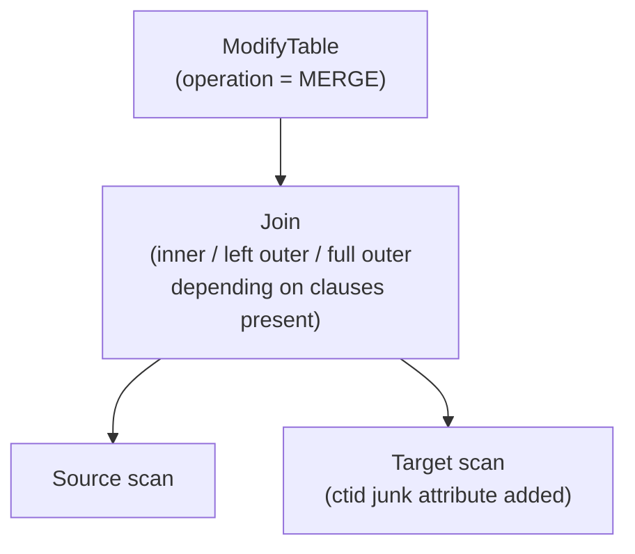
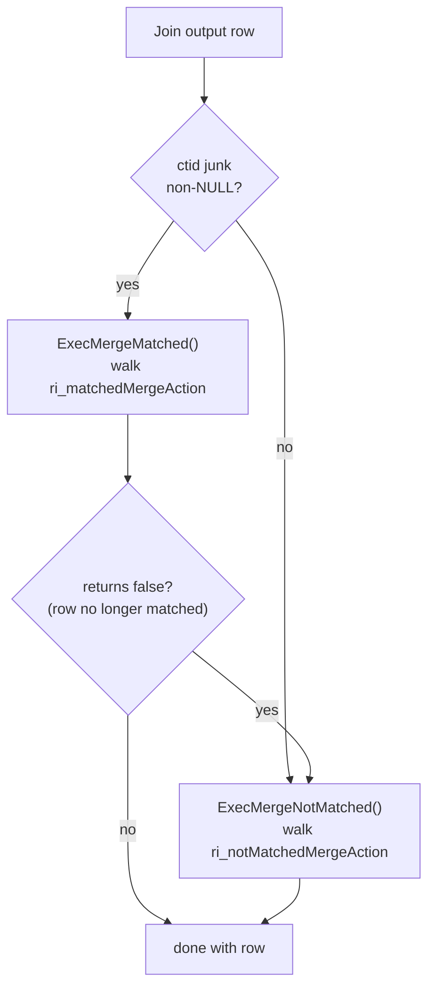
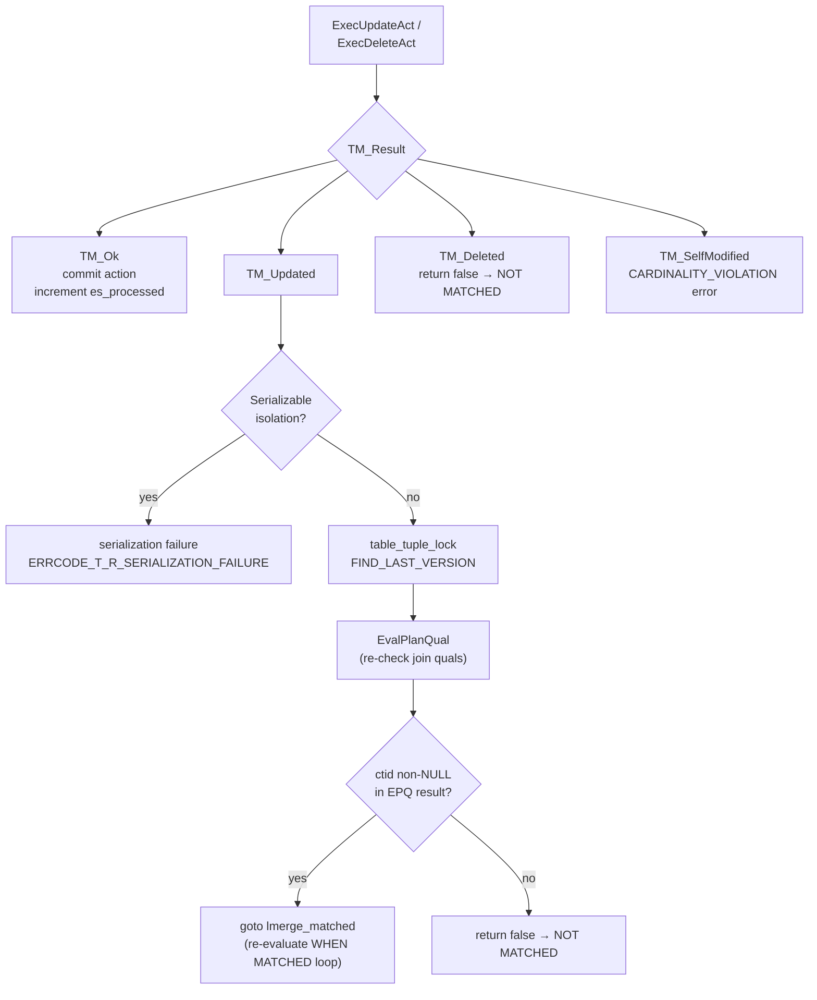

# MERGE

`MERGE` is the SQL-standard mechanism for performing INSERT, UPDATE, or DELETE on a target relation in a single statement, driven by whether each incoming source row matches an existing target row. The appeal is expressive power. A single statement can say "insert if new, update if existing, delete if an additional condition holds on the match." The planner treats this as one join rather than a sequence of independent probes. PostgreSQL introduced `MERGE` in version 15.

The statement is built around three clause families. `WHEN MATCHED` fires when a source row joins to an existing target row. `WHEN NOT MATCHED BY TARGET` (usually written simply as `WHEN NOT MATCHED`) fires when a source row finds no counterpart in the target — the classic insert path. `WHEN NOT MATCHED BY SOURCE` fires when a target row has no matching source row, enabling in-place synchronisation (delete or update rows in the target that have disappeared from the source). PostgreSQL evaluates multiple clauses of the same family in definition order. The first clause whose optional `AND` condition passes is the one that executes. Evaluation then stops for that row. The SQL standard requires this sequential-first-match guarantee. It is not merely an optimisation choice.

## Plan shape

The central insight in PostgreSQL's MERGE implementation is that the planner treats the source-target matching problem as an ordinary relational join. Parse analysis (`transformMergeStmt()`, parse_merge.c) builds a `Query` with `commandType = CMD_MERGE`. It also synthesises a join tree connecting the source relation to the target relation. From that point on, the query travels through the optimiser as a join plan. The MERGE-specific logic lives almost entirely in the executor, not the planner.

The key structural decision made during parse analysis is the join type. The join type determines which rows reach the executor:

- An **inner join** suffices when the statement has only `WHEN MATCHED` clauses. The join discards source rows that find no target row. These rows never reach `ExecMerge()`. This is correct, because there are no actions to take for them.
- Parse analysis requires a **left outer join** (source driving) when any `WHEN NOT MATCHED BY TARGET` INSERT clause is present. Unmatched source rows must survive the join. They arrive at the executor with NULLs on the target side, so that the NOT MATCHED path can insert them.
- Parse analysis requires a **full outer join** when `WHEN NOT MATCHED BY SOURCE` clauses are also present. Target rows that have no matching source row must also survive the join. They arrive with NULLs on the source side, so the BY SOURCE path can act on them.

`Query.mergeUseOuterJoin` (parsenodes.h) records this decision. `transformMergeStmt()` sets the flag whenever it finds a `CMD_INSERT` action among the WHEN clauses (parse_merge.c). For the full-outer-join case, `transform_MERGE_to_join()` in prepjointree.c selects `JOIN_FULL` directly.

`transform_MERGE_to_join()` manufactures a `JoinExpr` node. It then hands the node to the normal join planner. For the left-outer-join case, `transform_MERGE_to_join()` initially types the node `JOIN_RIGHT` — with the source on the right (nullable side) and the target on the left — so that unmatched source rows produce NULLs on the target columns. Later in planning, `reduce_outer_joins()` canonicalises `JOIN_RIGHT` to `JOIN_LEFT` by swapping the inputs. As a result, all subsequent planner stages only need to handle left-side nullability, which simplifies a large body of join inference code.

Because `transform_MERGE_to_join` delegates to the ordinary join planner, MERGE inherits every join strategy — nested loop, hash join, merge join. It can also exploit indexes on the target relation's join key just as any other query can. The source-target join condition lives in `JoinExpr.quals`. PostgreSQL keeps the individual WHEN clause conditions as separate `MergeAction.qual` expressions. PostgreSQL does not push them into the join quals. It defers their evaluation to execution time, so that the executor can fire the correct action per row rather than filter rows at the join level.

The clause mix determines the join type:

| Clause mix | Join type |
|---|---|
| WHEN MATCHED only | Inner join |
| WHEN NOT MATCHED BY TARGET | Left outer join (source on nullable side) |
| WHEN NOT MATCHED BY SOURCE only | Full outer join |
| Both NOT MATCHED families | Full outer join |

The target scan always includes a `ctid` junk attribute. This attribute is how the executor identifies, at runtime, which join output rows are matched (non-NULL `ctid`) and which are not (NULL `ctid`).

### Initialising action states

The MERGE action list travels from parse analysis through the planner as `mergeActionLists` on the `ModifyTable` plan node. During executor initialisation, `ExecInitMerge()` (nodeModifyTable.c) compiles each `MergeAction` plan node into a runtime `MergeActionState`:

- `mas_whenqual` holds the compiled `ExprState` for the optional `AND` condition on the clause.
- `mas_proj` holds a `ProjectionInfo` that produces the replacement tuple for UPDATE actions, built from the action's target list.
- `mas_action` back-links to the original `MergeAction` plan node for `commandType` and other static properties.

`ExecInitMerge()` sorts the states into two lists on the `ResultRelInfo`: `ri_matchedMergeAction` for WHEN MATCHED clauses and `ri_notMatchedMergeAction` for WHEN NOT MATCHED clauses. This preserves their definition order. This ordering is what enforces the "first qualifying clause wins" semantics at runtime.

A separate bitmask, `mt_merge_subcommands` on `ModifyTableState`, records which DML types (INSERT, UPDATE, DELETE) appear anywhere in the WHEN clause list. Statement-level trigger firing consults this mask to decide which trigger events to fire at statement start and end.

## Action routing in the executor

`ExecModifyTable()` drives all write operations. For MERGE it calls `ExecMerge()` once per row produced by the join subplan. The dispatcher is simple. If the row carries a valid `ctid` junk attribute, the row is matched. The executor then calls `ExecMergeMatched()`. Otherwise, the row is not matched. The executor calls `ExecMergeNotMatched()`.

`ExecMerge()` is intentionally thin. Its only non-trivial logic is the fallthrough. When `ExecMergeMatched()` returns `false`, control passes to `ExecMergeNotMatched()`. A `false` return means the matched row can no longer be considered matched, because a concurrent transaction has altered it. The reverse path does not exist. A NOT MATCHED row cannot promote to a MATCHED row mid-execution. As a result, there is no possibility of infinite retry.

### WHEN MATCHED: selecting and executing an action

`ExecMergeMatched()` (nodeModifyTable.c) fetches the current target tuple from the heap using `SnapshotAny` — a visibility-ignoring snapshot. `ExecMergeMatched()` requires `SnapshotAny` here. This is because EvalPlanQual may later supply a tuple version that was committed after the statement's regular MVCC snapshot was taken. The regular snapshot would not see that later version. `ExecMergeMatched()` places the fetched tuple in `econtext->ecxt_scantuple`, so that WHEN condition expressions can reference the existing target row's columns.

The function then walks `ri_matchedMergeAction` in definition order, calling `ExecQual()` on each action's `mas_whenqual`. The first action whose qualifier passes executes. An action with no qualifier at all also counts as passing, since `ExecQual()` returns true for an empty condition. If no action qualifies, the function returns `true`, indicating the row was handled with no write needed. The executor then moves on to the next join row.

Once `ExecMergeMatched()` identifies a qualifying action, it checks RLS USING policies via `ExecWithCheckOptions()`, using `WCO_RLS_MERGE_UPDATE_CHECK` or `WCO_RLS_MERGE_DELETE_CHECK`. This check happens before any write occurs. This placement is deliberate. The policy check only fires for the action that will actually execute. It also sees the specific existing tuple the action is about to modify or delete. Only then does execution proceed:

- **UPDATE**: `ExecProject()` builds the replacement tuple from `mas_proj`. The standard update sequence then runs. `ExecUpdatePrologue()` fires BEFORE ROW UPDATE triggers. It may cancel the action if a trigger returns NULL. `ExecUpdateAct()` performs the heap update and index maintenance. `ExecUpdateEpilogue()` queues AFTER ROW UPDATE triggers. It also handles foreign-key enforcement.

- **DELETE**: `ExecDeletePrologue()` fires BEFORE ROW DELETE triggers. `ExecDeleteAct()` performs the heap deletion. `ExecDeleteEpilogue()` queues AFTER ROW DELETE triggers.

- **DO NOTHING**: The executor sets `result` to `TM_Ok`. The action loop exits immediately. The executor attempts no heap operation. It acknowledges the row but leaves it untouched. This is useful to explicitly express "ignore rows that match condition X" before a fallthrough clause, or to suppress all action for a class of matched rows.

### WHEN NOT MATCHED: inserting or ignoring

`ExecMergeNotMatched()` (nodeModifyTable.c) works analogously over `ri_notMatchedMergeAction`. It walks the list in definition order. It executes the first qualifying action. There is one important asymmetry. `ExecMergeNotMatched()` sets `econtext->ecxt_scantuple` to NULL for WHEN NOT MATCHED BY TARGET rows, because there is no existing target row. WHEN NOT MATCHED conditions and INSERT target-list expressions may therefore reference only the source relation.

`setNamespaceForMergeWhen()` (parse_merge.c) enforces this restriction at parse time. It removes the target relation from the parse namespace while transforming NOT MATCHED clauses. The executor can therefore run these expressions without guarding against accidental target-column references at runtime.

The action types reachable in a `WHEN NOT MATCHED BY TARGET` clause are `CMD_INSERT` and `CMD_NOTHING`. INSERT routes through the standard `ExecInsert()` path, exactly as a standalone INSERT would. This path handles partition routing for partitioned targets. It fires BEFORE ROW INSERT and AFTER ROW INSERT triggers. It checks `WITH CHECK` RLS policies. It also maintains all indexes.

The executor dispatches `WHEN NOT MATCHED BY SOURCE` actions through the same `ExecMergeNotMatched()` path. The difference is that for these rows, `econtext->ecxt_scantuple` holds the existing target tuple. The source side is NULL. Accordingly, `setNamespaceForMergeWhen()` hides the source relation when transforming BY SOURCE clauses. The available actions are UPDATE, DELETE, and DO NOTHING. INSERT is not permitted here, since there is no source row to supply values.

## Concurrency and EvalPlanQual

The most intricate aspect of MERGE is handling concurrent modifications. The join executes under the statement's MVCC snapshot before the executor takes any heap locks. Because of this timing, another transaction may update or delete a target tuple in the window between the join phase and the write phase. This is the same race that UPDATE and DELETE face. MERGE has an additional complication. The concurrent change might not just affect the write attempt. It might also change whether the row is MATCHED or NOT MATCHED. This can alter which action should fire.

When `ExecUpdateAct()` or `ExecDeleteAct()` returns `TM_Updated` (a concurrent, already-committed transaction modified the tuple), `ExecMergeMatched()` responds with a two-step recovery. First, it calls `table_tuple_lock()` with `TUPLE_LOCK_FLAG_FIND_LAST_VERSION` to follow the update chain to the newest committed version of the tuple. This call blocks until that version is stable. Second, it calls `EvalPlanQual()` to re-evaluate the join's qualification conditions against that new version. Two outcomes are possible:

- The new version still satisfies the join condition: EPQ returns a non-NULL slot with a non-NULL `ctid`. The executor jumps to `lmerge_matched` at the top of the WHEN MATCHED action loop (a C `goto` label in nodeModifyTable.c). It re-evaluates the full WHEN clause list from the beginning against the new row. The first qualifying action may well differ from what would have fired on the original row. The new row state may satisfy a WHEN clause's `AND` condition when the old state did not, or vice versa.

- The new version no longer satisfies the join condition, or EPQ returns no tuple at all. EPQ returns no tuple when the row was deleted before the lock could be acquired. In either case, `ExecMergeMatched()` returns `false`. The caller falls through to `ExecMergeNotMatched()`. It treats the source row as unmatched. It then executes the first qualifying NOT MATCHED action instead.

A `TM_Deleted` result — a concurrent transaction deleted the row — skips the EPQ step. It returns `false` immediately, routing the source row to the NOT MATCHED path without any retry. There is no point re-evaluating the join condition against a deleted row.

### Isolation level behaviour

Under **READ COMMITTED**, the retry-with-new-version behaviour just described is the normal response to both `TM_Updated` and concurrent deletions detected as `TM_Deleted` after an EPQ miss. This mirrors the behaviour of standalone UPDATE and DELETE at that isolation level, which also re-evaluate their WHERE clauses against the latest committed version.

Under **REPEATABLE READ** or **SERIALIZABLE** isolation, `IsolationUsesXactSnapshot()` returns true. In that case, both `TM_Updated` and `TM_Deleted` raise an immediate serialization failure (`ERRCODE_T_R_SERIALIZATION_FAILURE`) rather than retrying. The application must re-execute the transaction from its beginning. This is consistent with the snapshot isolation guarantee. Under RR/Serializable, the transaction declared a view of the world at its start. That view must remain consistent throughout.

### Cardinality violation

The SQL standard prohibits a MERGE from visiting the same target row twice in one statement. If the join condition is under-constrained and two source rows both match the same target row, the second write attempt encounters `TM_SelfModified`. The heap recognises that the current transaction already modified the tuple in the current command. The executor raises `ERRCODE_CARDINALITY_VIOLATION` with a hint to make the join condition more selective.

The same error fires in one more situation. A BEFORE trigger modifies the same tuple that MERGE is currently processing. That situation is equally ambiguous about which modification should win. PostgreSQL uses the `tmfd.cmax` field to distinguish "modified by the current MERGE command" from "modified by a later command in the same transaction" (the latter being a different case, `TRIGGERED_DATA_CHANGE_VIOLATION`).

### Acknowledged gap: late-arriving matches

The comment in `ExecMerge()` (nodeModifyTable.c) acknowledges a remaining open question. A concurrent update might transform a previously-unmatched source row into one that would now match a target row. The current implementation does not detect this. `ExecMergeNotMatched()` runs without checking for late-arriving matches. This is a known limitation, not a silent correctness error. The SQL standard does not require MERGE to retry the entire match decision after every concurrent change. It is still worth understanding when reasoning about MERGE under high concurrency.

## Trigger interaction

MERGE fires row-level triggers exactly as equivalent standalone DML would. A `WHEN MATCHED ... UPDATE` action fires BEFORE ROW UPDATE and AFTER ROW UPDATE triggers. `WHEN MATCHED ... DELETE` fires BEFORE ROW DELETE and AFTER ROW DELETE. `WHEN NOT MATCHED ... INSERT` fires BEFORE ROW INSERT and AFTER ROW INSERT. `MergeAction.commandType` determines the trigger type. As a result, existing trigger functions written for standalone INSERT, UPDATE, or DELETE work on MERGE targets without modification.

A BEFORE ROW trigger that returns NULL for an INSERT or UPDATE action suppresses that action, just as for standalone DML. A BEFORE ROW UPDATE trigger may return a modified tuple. This tuple then replaces the projected replacement row from `mas_proj`, before the executor attempts the heap update.

The `mt_merge_subcommands` bitmask, built during `ExecInitMerge()`, coordinates statement-level triggers. The bitmask records which DML types appear anywhere in the WHEN clause list. Statement-level triggers for each action type present in the clause list fire exactly once, at the very start and end of `ExecModifyTable()`, via `fireBSTriggers()` and `fireASTriggers()`. This happens regardless of how many rows actually triggered that action type at runtime. It also happens regardless of whether the executor processed any rows at all. This mirrors standalone DML. There, a statement trigger fires even if zero rows matched.

Because a single MERGE statement may fire triggers of multiple types, deferred constraint checking covers all of them uniformly through the standard AFTER trigger queue. INSTEAD OF triggers on views also work with MERGE. The executor routes each action through the appropriate INSTEAD OF trigger function, which is responsible for performing the underlying DML.

## Partitioned targets

INSERT actions within MERGE on a partitioned target use the standard partition routing infrastructure (`ExecSetupPartitionTupleRouting()`, execPartition.c). `ExecInitMerge()` builds `mas_proj` for an INSERT action against the root partitioned relation's descriptor. At execution time, the partition router maps the projected tuple to the correct leaf partition. It then inserts the tuple there. This fires that child's BEFORE ROW INSERT triggers. It also maintains that child's indexes.

Cross-partition UPDATE happens when new row values cause a row to migrate from one partition to another. `ExecUpdateAct()` sets the `updateCxt.crossPartUpdate` flag to record this. When this flag is true, `ExecUpdateAct()` has already decomposed the update internally into a DELETE on the old partition and an INSERT on the new partition. `ExecMergeMatched()` detects the flag. It then exits the action loop immediately, skipping the normal post-update epilogue steps. These steps would otherwise double-count the operation.

There is a known limitation. If a concurrent update migrates a target tuple to a different partition between the join snapshot and the row lock, `ExecMergeMatched()` detects `ItemPointerIndicatesMovedPartitions` in the tuple ID. It then raises a serialization error rather than following the migrated tuple. The source code (nodeModifyTable.c) acknowledges this as a gap to address in a future release.

## Row-level security

RLS interacts with MERGE in a non-trivial way because the final action is not known at planning time. PostgreSQL resolves this at rewrite time. It collects USING policies for all possible actions (UPDATE, DELETE, INSERT). It attaches them all as `WithCheckOption` entries on the range table entry for the target relation. The executor then evaluates only the subset of those policies that corresponds to the action chosen for each row.

At runtime, the executor determines the qualifying WHEN clause first. It then calls `ExecWithCheckOptions()`, before the write executes. For UPDATE and DELETE in WHEN MATCHED clauses, it uses `WCO_RLS_MERGE_UPDATE_CHECK` and `WCO_RLS_MERGE_DELETE_CHECK` respectively. `ExecInsert()` applies INSERT `WITH CHECK` policies through the normal mechanism.

An important difference from standalone DML: MERGE raises an error when a USING policy blocks an intended action, rather than silently skipping the row as standalone UPDATE and DELETE would. The rationale is that MERGE has already committed to acting on that row through the join result. Silently suppressing the action would leave the data in a state inconsistent with the statement's declared intent. It would also give the caller no indication that MERGE skipped the row.

## RETURNING clause

MERGE supports a RETURNING clause that returns one row per action taken. The `merge_action()` function can appear in the RETURNING list to identify which action — `'INSERT'`, `'UPDATE'`, or `'DELETE'` — MERGE applied to each output row. This makes it possible for the calling application to count outcomes by type, log the specific rows affected by each action type, or drive further processing based on what MERGE decided, all without issuing additional queries.

The RETURNING implementation routes MERGE output rows through the standard `ExecProcessReturning()` infrastructure, with `merge_action()` provided as a special expression node that reads the action type recorded in `ModifyTableContext`. In PostgreSQL 16, `ExecMerge()` returns NULL unconditionally. RETURNING is not supported in that version. PostgreSQL 17 added the feature.

## NOT MATCHED BY SOURCE

`WHEN NOT MATCHED BY SOURCE` is the third matching condition, covering target rows that exist in the target but have no corresponding row in the source. **PostgreSQL 17** introduced this clause. It enables full table synchronisation: a MERGE statement can now simultaneously insert new rows, update changed rows, and delete rows that have disappeared from the source — all in one pass.

Mechanically, BY SOURCE requires a full outer join instead of a left outer join. With a left outer join, the join discards target rows that have no source match. These rows never reach the executor. A full outer join preserves both sides. Rows with a NULL source side reach `ExecMergeNotMatched()` with an appropriate flag. The executor then consults the `ri_notMatchedMergeAction` list for BY SOURCE clauses separately from the BY TARGET list.

The available actions in a `WHEN NOT MATCHED BY SOURCE` clause are UPDATE, DELETE, and DO NOTHING. INSERT is not permitted because there is no source row to supply values for the new columns. UPDATE in this context updates the existing target row using expressions that can reference only the target relation (the source side is NULL).

## Updatable views as MERGE targets

**PostgreSQL 17** extended MERGE to accept updatable views as the target relation, not just base tables. The rewriter expands each action in the WHEN clause list through the view's rewrite rules, the same way it expands standalone INSERT, UPDATE, and DELETE. INSTEAD OF triggers on the view handle the underlying DML when the view is not auto-updatable. The executor routes each action through the appropriate trigger or rewrite path after the WHEN clause evaluation. From the executor's perspective, the target therefore behaves like a base table. All view expansion happens in the rewriter before execution begins.

## MERGE vs. INSERT ON CONFLICT

`INSERT ... ON CONFLICT DO UPDATE` ("upsert") and `MERGE` both handle the insert-or-update pattern, but they differ fundamentally in their detection mechanism.

`ON CONFLICT` works by attempting a heap insert. It detects a unique-index conflict through speculative insertion. It then optionally executes an update in-place. It never runs a join. Conflict detection is index-driven and largely lock-free in the optimistic case. This makes it faster and simpler for key-based upsert. There is no join planning overhead. There is also no window between join-time and write-time in which concurrent changes can surprise the executor. The EXCLUDED pseudo-relation gives the update expression access to the values that were proposed for insertion but rejected.

`MERGE` runs a full join. That join carries more overhead. It also delivers much richer expressiveness. There is no EXCLUDED relation in MERGE — the source relation is directly accessible by name in all WHEN clause expressions. MERGE does not use speculative insertion. As a result, uniqueness conflicts during a MERGE INSERT surface as ordinary unique-constraint errors, rather than being caught and rerouted.

| Capability | MERGE | ON CONFLICT |
|---|---|---|
| Multiple conditional actions | Yes | No |
| DELETE based on match state | Yes | No |
| Match on non-unique conditions | Yes | No |
| Speculative insertion | No | Yes |
| Reference EXCLUDED pseudo-relation | No | Yes |
| Arbitrary join conditions | Yes | No (unique index only) |
| WHEN NOT MATCHED BY SOURCE | Yes (PG17+) | No |
| Partition routing for inserts | Yes | Yes |
| Updatable view as target | Yes (PG17+) | No |
| RETURNING with merge_action() | Yes (PG17+) | Yes |

The practical guideline: use `ON CONFLICT` for the common "insert, fall back to update on duplicate key" pattern where uniqueness-index semantics are sufficient and performance is important. Use `MERGE` when the logic requires multiple WHEN clauses, non-key join conditions, conditional DELETE, or a full synchronisation pass over the source.

## Version History

**PostgreSQL 15** introduced `MERGE` with `WHEN MATCHED` and `WHEN NOT MATCHED BY TARGET` clause support, targeting base tables only, without a RETURNING clause.

**PostgreSQL 17** delivered three significant extensions. `WHEN NOT MATCHED BY SOURCE` added full-outer-join semantics, so a single statement can insert, update, and delete in one pass. Target rows with no matching source row now reach the executor. The executor can update or delete them. The RETURNING clause became supported, with the `merge_action()` function available in the return list to report which DML action (`'INSERT'`, `'UPDATE'`, or `'DELETE'`) MERGE applied to each output row. PostgreSQL 17 expanded MERGE targets to include updatable views, with action dispatch going through the standard view rewrite and INSTEAD OF trigger infrastructure.

## Related Topics

- [[code-paths/upsert|Upsert (INSERT ON CONFLICT)]] — the alternative upsert path using speculative insertion rather than a join, useful for comparing how conflict detection differs between the two approaches.
- [[code-paths/update|UPDATE]] — the core UPDATE executor path that MERGE delegates to for WHEN MATCHED UPDATE actions, including EvalPlanQual retry logic.
- [[code-paths/insert|INSERT]] — the INSERT executor path that MERGE uses for WHEN NOT MATCHED INSERT actions, including partition routing and trigger firing.
- [[subsystems/transactions/mvcc|MVCC]] — snapshot and visibility mechanics that underpin the SnapshotAny fetch and EvalPlanQual re-evaluation inside ExecMergeMatched.
- [[subsystems/locking/row-locking-patterns|Row Locking Patterns]] — how table_tuple_lock and TUPLE_LOCK_FLAG_FIND_LAST_VERSION are used to follow update chains during concurrent modification recovery.
- [[subsystems/executor/joins|Joins]] — the join executor nodes (nested loop, hash join, merge join) that MERGE relies on for source-target matching.
- [[subsystems/rewriter/rules-vs-triggers|Rules vs. Triggers]] — explains how view rewrite rules and INSTEAD OF triggers interact with DML, relevant to MERGE on updatable views.
- [[code-paths/delete|DELETE]] — the DELETE code path and visibility rules that MERGE reuses for WHEN MATCHED DELETE actions.
- [[subsystems/locking/overview|Locking Overview]] — tuple locking and `TM_Result` codes that MERGE's concurrent-update handling checks when a target row changes mid-statement.
- [[subsystems/planner/overview|Planner Overview]] — how the join plan behind MERGE's source-to-target matching is built.
- [[architecture/overview|Architecture Overview]] — the parse-plan-execute pipeline that a MERGE statement flows through like any other DML command.
