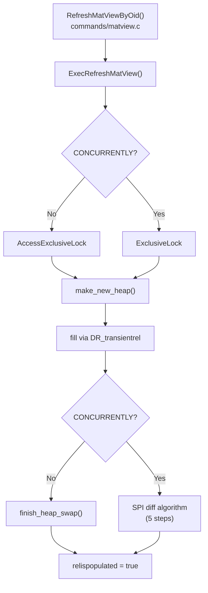
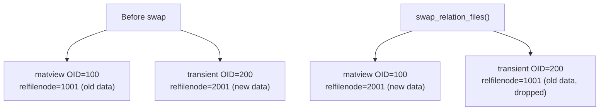

# REFRESH MATERIALIZED VIEW

`REFRESH MATERIALIZED VIEW` replaces the contents of a materialized view with the result of re-executing its defining query. It is the only built-in mechanism for keeping a materialized view up to date; PostgreSQL has no automatic, incremental refresh in core.

Two surface-level options control the operation:

- **`CONCURRENTLY`** keeps the old data visible to readers throughout the refresh by computing a diff and applying it as individual DML. It requires at least one unique index on the view. It is also slower than the non-concurrent path for large full rebuilds.
- **`WITH NO DATA`** marks the view as unpopulated without executing the query at all. The two options are mutually exclusive. `CONCURRENTLY` needs existing data to diff against, so PostgreSQL rejects the combination at parse time.

The implementation lives in `src/backend/commands/matview.c`, with the entry point `ExecRefreshMatView()`.

## Retrieving the stored query

A materialized view stores its defining query as a rewrite rule in `pg_rewrite`, exactly like a regular view. When the executor opens the relation, `rd_rules` on the `RelationData` cache entry holds the parsed-and-rewritten rule tree. `ExecRefreshMatView()` extracts the query from that rule tree rather than re-parsing the original `CREATE MATERIALIZED VIEW` statement text. This means the query seen during refresh is the post-rewrite, post-analysis form — substitutions, function inlining, and view expansions already applied.

## Call flow



Both paths build a fresh heap into a temporary relation first. The difference is what happens after the heap is filled. The non-concurrent path swaps the relfilenode atomically. The concurrent path diffs the new heap against the live view and applies row-level changes.

## WITH NO DATA

When `WITH NO DATA` is specified, the executor sets `relispopulated = false` on the materialized view in `pg_class` and returns immediately. No rows are written. Any subsequent `SELECT` against an unpopulated view raises:

```
ERROR:  materialized view "..." has not been populated
HINT:  Use the REFRESH MATERIALIZED VIEW command.
```

`execUtils.c` enforces this check before query execution begins. The view relation is physically present, and the relfilenode exists. However, the flag tells the executor the contents are undefined. `REFRESH MATERIALIZED VIEW` without `WITH NO DATA` is the only way to clear the flag.

`relispopulated` lifecycle:

| Event | Value |
|---|---|
| `CREATE MATERIALIZED VIEW` (default) | `true` (populated immediately) |
| `CREATE MATERIALIZED VIEW WITH NO DATA` | `false` |
| `REFRESH MATERIALIZED VIEW WITH NO DATA` | `false` |
| `REFRESH MATERIALIZED VIEW` (non-concurrent) | `true` after swap |
| `REFRESH MATERIALIZED VIEW CONCURRENTLY` | unchanged during diff; set `true` at commit |
| `REFRESH` transaction aborts | rolls back to prior value |

## Non-concurrent path

The non-concurrent path holds `AccessExclusiveLock` on the materialized view from start to finish, blocking all readers and writers for the full duration.

`make_new_heap()` (`cluster.c`) creates a new, empty heap. This allocates a new relfilenode under the same namespace but with a transient OID. The executor runs the query with a special destination receiver, `DR_transientrel`, that writes rows directly into this new heap using `TABLE_INSERT_FROZEN | TABLE_INSERT_SKIP_FSM`:

- `TABLE_INSERT_FROZEN` marks all inserted tuples with `FrozenTransactionId` as their `xmin`. Because the data will not be visible to other transactions until after the relfilenode swap commits, it is safe and efficient to pre-freeze them, avoiding a future `VACUUM` pass.
- `TABLE_INSERT_SKIP_FSM` bypasses the free-space map. `DR_transientrel` writes the heap sequentially from scratch. There is no pre-existing free space to track.

No row-level triggers fire during this phase. The destination receiver writes tuples directly into the storage layer without passing through the executor's trigger machinery. Materialized views cannot have row-level triggers defined on them. The same mechanism is why bulk-load paths such as `COPY` can also bypass triggers.

Once the heap is fully populated, `finish_heap_swap()` calls `swap_relation_files()` to exchange the relfilenodes of the live view and the new heap. From that point forward, the live view's OID refers to the new data. PostgreSQL drops the old data, now referenced by the transient OID, at the end of the transaction.



The swap is a catalog update inside the current transaction, so it is atomic from the perspective of concurrent sessions: a reader either sees the old data or the new data, never a mix. After `swap_relation_files()`, `finish_heap_swap()` calls `reindex_relation()` to rebuild all indexes on the view. It then calls `performDeletion()` on the transient OID to reclaim the old heap's storage. The materialized view's OID never changes, so grants, views, foreign keys, and any other object depending on it by OID remain valid.

## Concurrent path

The concurrent path holds only `ExclusiveLock` while building the new heap. Ordinary `SELECT` queries take `AccessShareLock`. This does not conflict with `ExclusiveLock`, so reads proceed throughout. The trade-off is complexity and overhead: computing and applying the diff is significantly more work than a relfilenode swap, especially when most rows have changed.

The key lock mode distinction:

| Lock acquired | Conflicts with SELECT (`AccessShareLock`)? |
|---|---|
| `AccessExclusiveLock` (non-concurrent) | Yes — blocks all reads |
| `ExclusiveLock` (concurrent) | No — reads proceed |

### Unique index requirement

Before proceeding, `ExecRefreshMatView()` calls `is_usable_unique_index()` to verify that the view has at least one non-partial, non-deferred, btree-based unique index. The diff algorithm requires this index to correlate rows between the old and new snapshots. The requirements are strict: the index must be `indisunique`, `indimmediate`, built on the `btree` access method, have `indisvalid = true`, have no `WHERE` predicate (no partial indexes), and cover only plain table columns (no expressions, no system columns). The btree restriction exists because the diff algorithm constructs a FULL OUTER JOIN. Its join conditions use equality operators derived from each index column's operator class. Non-btree access methods do not supply these operators in the same way.

### Five-step SPI diff algorithm

The concurrent path computes the diff via five SPI (Server Programming Interface) operations inside the same transaction, against a temporary table holding the new data:

1. **Duplicate check.** This step scans the new data for rows that are fully identical across all columns, excluding NULLs, which are not equal to each other. If this step finds duplicates, the refresh aborts before applying any changes. The unique index would otherwise reject the result.
2. **Create diff table.** This step creates a temporary staging table with two columns: the TID of the matching old row (if any) and the composite-typed new row (if any).
3. **Populate diff table via FULL OUTER JOIN.** This step joins the live view and the new data heap on the unique key columns. The `WHERE` clause excludes rows that are unchanged (matching on both key and non-key columns). The result contains rows present only in the old view (to be deleted) and rows present only in the new data (to be inserted).
4. **Apply deletes.** Deletions run before insertions to avoid unique-index violations when a row's key value changes.
5. **Apply inserts.** This step inserts the new rows from the diff table into the live view.

Both DML steps execute with `matview_maintenance_depth > 0`, set by `OpenMatViewIncrementalMaintenance()`. This session-level depth counter allows the executor to permit DML against a materialized view, which it otherwise rejects. The guard also prevents recursive refresh cycles. The defining query of one materialized view might reference another materialized view that is itself being refreshed concurrently in the same session. In that case, the depth counter makes the inner refresh detectable and safe.

For a view where the entire content changes, the concurrent path reads every row twice: once from the live view, once from the new heap. It executes a FULL OUTER JOIN and populates a diff table. It then writes every row as a DELETE plus an INSERT. The non-concurrent path writes everything once. It replaces the heap with a single catalog update. Concurrent refresh is worth its overhead only when a small fraction of rows change, reads must not be blocked, and a qualifying unique index exists.

## No row-level triggers during refresh

The standard refresh path writes to the transient heap directly through `table_tuple_insert()` with the `DR_transientrel` destination receiver, bypassing the executor's trigger machinery entirely. No `BEFORE` or `AFTER` row-level triggers fire on the transient heap.

The concurrent refresh path applies its DELETEs and INSERTs through SPI, which does pass through the executor. Statement-level triggers (`AFTER STATEMENT`) on the materialized view would fire during concurrent refresh. Row-level triggers (`FOR EACH ROW`) would only fire if the materialized view had them. Materialized views cannot have row-level triggers, however. The executor enforces this restriction independently. So in practice, neither refresh path fires row-level triggers.

## No built-in progress view

Unlike `CLUSTER` (`pg_stat_progress_cluster`) and `CREATE INDEX` (`pg_stat_progress_create_index`), `REFRESH MATERIALIZED VIEW` has no built-in progress view in core PostgreSQL. For large materialized views, the only visibility into progress is through `pg_stat_activity` (which shows the query text) and wait event monitoring.

## Security context

`ExecRefreshMatView()` runs under `SECURITY_RESTRICTED_OPERATION`. The operation runs with the privileges of the view owner, not the caller — matching the behaviour of `SECURITY DEFINER` functions. This means a user with `REFRESH` privilege but without direct access to the underlying tables can still refresh the view, subject to whatever permissions the owner held at definition time. `SECURITY_RESTRICTED_OPERATION` also prevents the stored query from making security-relevant GUC changes. `AtEOXact_GUC()` rolls back any `SET LOCAL` calls within the query at the end of the function.

## Incremental materialized views

PostgreSQL core does not support incremental or automatic refresh. When a base table changes, the materialized view remains stale until explicitly refreshed.

Three common workarounds exist outside core:

- **`pg_ivm` extension.** The extension implements incremental view maintenance using triggers. After each DML statement on a base table, the extension updates only the affected rows in the materialized view. The per-DML overhead is higher than a plain trigger, but large views stay nearly current without a full refresh.
- **Trigger-based shadow tables.** Row-level triggers on base tables write change records to a staging table. A periodic job reads the staging table and applies updates to the materialized view manually. This is effectively a hand-rolled version of what `pg_ivm` automates. It is fragile for complex queries.
- **Logical replication patterns.** A logical replication subscriber can intercept change events and maintain a denormalised table that acts like a materialised view. This keeps the maintenance logic outside the primary database process entirely.

## Practical SQL examples

```sql
-- Standard refresh (blocks readers for full duration)
REFRESH MATERIALIZED VIEW sales_summary;

-- Mark as unpopulated without running the query
REFRESH MATERIALIZED VIEW sales_summary WITH NO DATA;

-- Concurrent refresh (requires unique index; readers unblocked)
CREATE UNIQUE INDEX ON sales_summary (region_id, period_start);
REFRESH MATERIALIZED VIEW CONCURRENTLY sales_summary;

-- Check population status for all materialized views
SELECT relname, relispopulated
FROM pg_class
WHERE relkind = 'm';

-- Find matviews lacking a usable unique index (cannot use CONCURRENTLY)
SELECT c.relname
FROM pg_class c
WHERE c.relkind = 'm'
  AND NOT EXISTS (
    SELECT 1
    FROM pg_index i
    JOIN pg_class ic ON ic.oid = i.indexrelid
    WHERE i.indrelid = c.oid
      AND i.indisunique
      AND i.indimmediate
      AND ic.relam = (SELECT oid FROM pg_am WHERE amname = 'btree')
      AND i.indisvalid
      AND i.indpred IS NULL
  );

-- Monitor refresh duration (no built-in progress view exists)
SELECT pid, query, query_start, state
FROM pg_stat_activity
WHERE query LIKE 'REFRESH MATERIALIZED VIEW%';
```

## GUC reference

| GUC | Default | Effect on refresh |
|---|---|---|
| [[subsystems/executor/work-mem-and-spill|work_mem]] | 4 MB | Memory available to each sort/hash node within the stored query. |
| `maintenance_work_mem` | 64 MB | Memory for index builds during `reindex_relation()` after the heap swap. |
| `enable_parallel_query` | on | Controls whether the stored query may use parallel workers. |
| `max_parallel_workers_per_gather` | 2 | Upper bound on parallel workers used by the stored query. |
| `lock_timeout` | 0 (disabled) | If set, `REFRESH MATERIALIZED VIEW` aborts if it cannot acquire the required lock within the timeout. Useful for concurrent refresh in high-contention environments. |
| `statement_timeout` | 0 (disabled) | Applies to the entire refresh operation. Long refreshes on large views may need this raised or disabled. |

## See also

- [[subsystems/executor/overview|Executor overview]]
- [[code-paths/vacuum|Vacuum code path]]
- [[subsystems/storage/visibility-map|Visibility map]]
- [[subsystems/transactions/multixact|MultiXact]]
