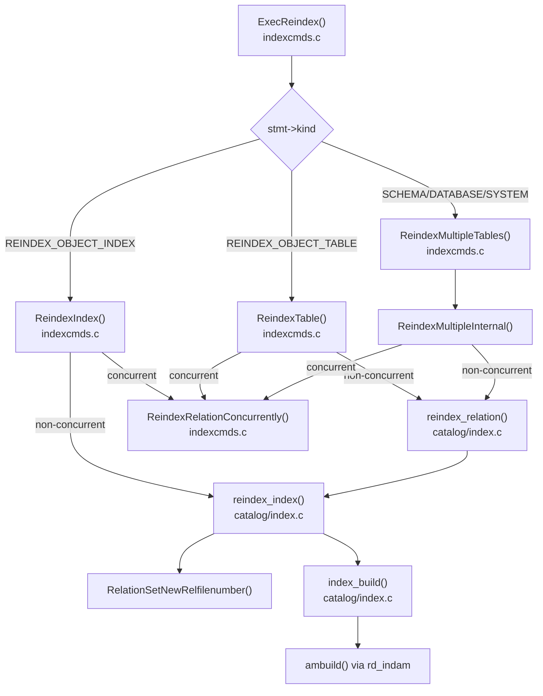
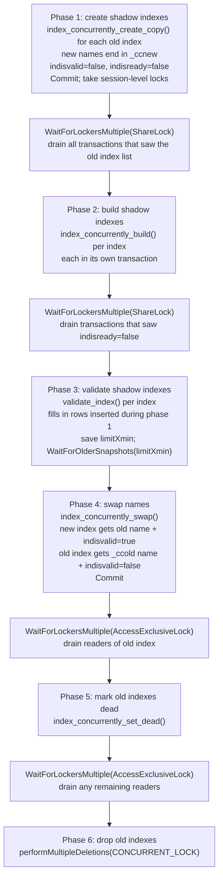

`REINDEX` rebuilds one or more indexes from scratch by re-scanning the heap. It is the only way to reclaim storage from a heavily bloated index, repair an index whose pages have been corrupted, or recover from a failed `CREATE INDEX CONCURRENTLY` that left an invalid index behind. Non-concurrent `REINDEX` rebuilds the index in-place under `AccessExclusiveLock`. Concurrent `REINDEX` (introduced in PostgreSQL 12) uses a six-phase protocol that never acquires `AccessExclusiveLock` on the table.

## Syntax and scope

```sql
REINDEX [ ( option [, ...] ) ] { INDEX | TABLE | SCHEMA | DATABASE | SYSTEM } [ CONCURRENTLY ] name
```

| Target | What is rebuilt |
|---|---|
| `INDEX` | A single named index |
| `TABLE` | All valid indexes on the table and its [[subsystems/storage/toast|toast]] table |
| `SCHEMA` | All valid indexes on all user tables in the schema |
| `DATABASE` | All valid indexes in the current database |
| `SYSTEM` | All valid indexes on system catalogs in the current database |

Options accepted in the parenthesised form: `VERBOSE` (print a message per index), `CONCURRENTLY` (same as writing the keyword before the target), and `TABLESPACE name` (move the rebuilt index to a different tablespace).

`REINDEX SCHEMA`, `REINDEX DATABASE`, and `REINDEX SYSTEM` must run outside a transaction block — the command internally commits and starts new transactions for each index. `REINDEX CONCURRENTLY` on any target also requires being outside a transaction block because the multi-phase protocol spans multiple committed transactions.

`REINDEX CONCURRENTLY` cannot rebuild indexes on system catalogs (`ERROR: cannot reindex system catalogs concurrently`), exclusion constraint indexes, or indexes on temporary tables (which are always rebuilt non-concurrently regardless of the flag).

## Call hierarchy



## Non-concurrent REINDEX

### Lock acquisition

`reindex_index()` acquires a `ShareLock` on the heap relation and `AccessExclusiveLock` on the index. The `ShareLock` on the heap prevents schema changes and concurrent `VACUUM FULL` or `CLUSTER`. It allows normal DML, however — inserts, updates, and deletes continue. The `AccessExclusiveLock` on the index is what blocks all concurrent reads and writes through that index for the duration of the rebuild.

`RangeVarCallbackForReindexIndex()` enforces lock ordering: the heap lock is always acquired before the index lock to avoid deadlock. The table lock level for the non-concurrent path is `ShareLock` (matching what `reindex_relation()` takes internally).

### In-place storage replacement

The defining feature of non-concurrent `REINDEX` is that the index OID does not change. `RelationSetNewRelfilenumber()` abandons the old physical file and creates a new file under the same OID:

```c
/* Suppress use of the target index while rebuilding it */
SetReindexProcessing(heapId, indexId);

/* Create a new physical relation for the index */
RelationSetNewRelfilenumber(iRel, persistence);

/* Initialize the index and rebuild */
index_build(heapRelation, iRel, indexInfo, true, true);

/* Re-allow use of target index */
ResetReindexProcessing();
```

`RelationSetNewRelfilenumber()` allocates a new `relfilenode` in `pg_class` and schedules the old storage file for deletion at transaction commit. After the commit, `pg_class.relfilenode` holds the new value. `pg_class.oid` is unchanged. Any cached plans referencing the index OID remain valid because the relcache refreshes the OID-to-physical-file mapping.

`SetReindexProcessing()` records the heap OID and index OID in two process-local globals (`currentlyReindexedHeap`, `currentlyReindexedIndex`). This sentinel prevents the reindex executor from attempting to use the index being rebuilt — for example, a unique index being reindexed must not try to consult itself to enforce uniqueness during the build. `RelationGetIndexList()` checks the sentinel. It excludes the under-construction index from the list visible to DML within the same transaction.

### IndexInfo construction and expression/partial indexes

`BuildIndexInfo()` reconstructs the `IndexInfo` structure from the existing `pg_index` row:

```c
ii = makeIndexInfo(indexStruct->indnatts,
                   indexStruct->indnkeyatts,
                   index->rd_rel->relam,
                   RelationGetIndexExpressions(index),   /* deserialise indexprs */
                   RelationGetIndexPredicate(index),     /* deserialise indpred */
                   indexStruct->indisunique,
                   indexStruct->indnullsnotdistinct,
                   indexStruct->indisready,
                   false,
                   index->rd_indam->amsummarizing);
```

Expression indexes store their key expressions as a serialised `pg_node_tree` in `pg_index.indexprs`. `RelationGetIndexExpressions()` deserialises and expression-tree-fixes this list. During the heap scan, `FormIndexDatum()` evaluates these expressions for each tuple using the executor machinery. Expression indexes therefore require an `EState` and `ExprContext` during the build. `index_build()` sets these up automatically.

Partial indexes store their predicate in `pg_index.indpred`. The heap scan callback checks `predicate_satisfied_by()` for each candidate tuple. The build does not add tuples that fail the predicate to the index. The rebuild faithfully reproduces the same selective coverage as the original.

### Recovering invalid indexes

After `index_build()` returns, `reindex_index()` checks and possibly repairs `pg_index` flags:

```c
index_bad = (!indexForm->indisvalid ||
             !indexForm->indisready ||
             !indexForm->indislive);
if (index_bad ||
    (indexForm->indcheckxmin && !indexInfo->ii_BrokenHotChain) ||
    early_pruning_enabled)
{
    if (!indexInfo->ii_BrokenHotChain && !early_pruning_enabled)
        indexForm->indcheckxmin = false;
    else if (index_bad || early_pruning_enabled)
        indexForm->indcheckxmin = true;
    indexForm->indisvalid = true;
    indexForm->indisready = true;
    indexForm->indislive = true;
    CatalogTupleUpdate(pg_index, &indexTuple->t_self, indexTuple);
}
```

This is the mechanism by which `REINDEX` rescues an invalid index left by a failed `CREATE INDEX CONCURRENTLY`. The non-concurrent build scans the heap under `SnapshotAny` and sets all three flags unconditionally. If there were no broken HOT chains, the build also clears `indcheckxmin`, moving the index's usability horizon back to the beginning of time. If the build did encounter broken HOT chains, it sets or keeps `indcheckxmin` instead. This prevents old-snapshot transactions from using the index unsafely.

### Interaction with [[subsystems/background/autovacuum|autovacuum]]

Non-concurrent `REINDEX` holds `AccessExclusiveLock` on the index. If autovacuum is currently vacuuming the same table, it holds a `ShareUpdateExclusiveLock`. This lock mode does not conflict with `AccessExclusiveLock` on the index itself. However, autovacuum may also be updating index statistics and scanning index pages. Those operations do not block `REINDEX`.

The more important interaction runs in the other direction: if a backend is waiting to acquire `AccessExclusiveLock` on the index (or the heap, in the case of `REINDEX TABLE`) and autovacuum holds a conflicting lock, PostgreSQL's deadlock detector treats autovacuum as a victim. When the lock manager detects that a non-autovacuum session is blocked by an autovacuum worker, it sends `SIGINT` to the autovacuum worker (`proc.c: DS_BLOCKED_BY_AUTOVACUUM`), causing it to abort and retry. This means `REINDEX` will eventually acquire its lock without indefinitely blocking on a running autovacuum. However, autovacuum's work is lost and must be restarted.

During `REINDEX TABLE` or multi-table variants, each index rebuild runs in a new subtransaction so that a failure on one index does not roll back progress on already-rebuilt indexes.

## Concurrent REINDEX (PostgreSQL 12+)

`ReindexRelationConcurrently()` implements the concurrent path. It never acquires `AccessExclusiveLock` on the table. Instead, it uses `ShareUpdateExclusiveLock` throughout. This lock conflicts only with `VACUUM`, `ANALYZE`, `CREATE INDEX CONCURRENTLY`, and other `REINDEX CONCURRENTLY` operations on the same object.

The algorithm follows six phases separated by transaction boundaries and lock-drain waits. All phase logic lives in a single function (`indexcmds.c:3427–4265`). A `MemoryContext` child of `PortalContext` survives the forced transaction commits and holds the index OID lists across phases.

### The six-phase rebuild sequence



### Phase 1: shadow index creation

For each index to be rebuilt, `index_concurrently_create_copy()` creates a new catalog entry that is a structural clone of the original. `ChooseRelationName()` gives the shadow index a temporary name with suffix `ccnew`:

```c
concurrentName = ChooseRelationName(get_rel_name(idx->indexId),
                                    NULL,
                                    "ccnew",
                                    get_rel_namespace(indexRel->rd_index->indrelid),
                                    false);

newIndexId = index_concurrently_create_copy(heapRel,
                                            idx->indexId,
                                            tablespaceid,
                                            concurrentName);
```

`ChooseRelationName()` appends the `ccnew` suffix to the original index name, with a uniqueness suffix if needed. PostgreSQL truncates names at `NAMEDATALEN-1` (63 bytes), so for long index names the result may not visually resemble the original name. `index_concurrently_create_copy()` registers the shadow index with `indisvalid = false` and `indisready = false` — invisible to the planner and not yet receiving DML inserts.

After catalog creation, the transaction commits. `ReindexRelationConcurrently()` then takes session-level `ShareUpdateExclusiveLock` on every relation involved (heap and both old and new indexes). These session locks survive transaction boundaries and prevent concurrent `DROP` from racing with the build.

### Phase 2: building shadow indexes

`WaitForLockersMultiple(ShareLock)` drains all transactions that observed the pre-`ccnew` index list. `index_concurrently_build()` then builds each shadow index in a separate transaction. This function sets `indisready = true` and performs the initial heap scan using an MVCC snapshot — the same mechanism as `CREATE INDEX CONCURRENTLY` phase 1. Rows inserted or deleted concurrently during this scan are not in the shadow index yet. Phase 3 handles them.

Indexes with no expression columns and no predicate set the `PROC_IN_SAFE_IC` flag (`set_indexsafe_procflags()`). This flag tells other concurrent index builds that they can safely skip inserting into this index. The index is in the `indisready = true, indisvalid = false` state at that point. This matters when multiple concurrent index operations run simultaneously on the same table.

### Phase 3: validation

After a second `WaitForLockersMultiple(ShareLock)` (ensuring all transactions have seen `indisready = true` and are therefore inserting into the shadow index), `validate_index()` closes the gap left by phase 2. It scans the shadow index to collect all TIDs currently present and sorts them. It then scans the heap with a reference MVCC snapshot. `validate_index()` inserts any heap tuple live in the reference snapshot but absent from the index. It saves the reference snapshot's `xmin` as `limitXmin`. After committing, `WaitForOlderSnapshots(limitXmin, true)` blocks until no active transaction holds a snapshot older than `limitXmin`. This eliminates the window where a very old snapshot could see a tuple with no matching index entry.

### Phase 4: name swap

`index_concurrently_swap()` performs the catalog swap in a single transaction:

```c
/* Swap the names in pg_class */
namestrcpy(&newClassForm->relname, NameStr(oldClassForm->relname));
namestrcpy(&oldClassForm->relname, oldName);   /* oldName = <original>_ccold */

/* Swap validity flags in pg_index */
newIndexForm->indisvalid = true;
oldIndexForm->indisvalid = false;

/* Transfer constraint and trigger ownership */
conForm->conindid = newIndexId;
tgForm->tgconstrindid = newIndexId;
```

`index_concurrently_swap()` renames the old index to a `_ccold` variant. It migrates constraint metadata (`pg_constraint.conindid`) and foreign-key trigger metadata (`pg_trigger.tgconstrindid`) to the new index OID. It also copies the primary-key, unique, and `indisreplident` flags. It invalidates the relcache for the table so all backends refresh their index lists after the commit.

After this commit, the rebuilt index is live under the original name. The old physical file still exists under the `_ccold` name.

### Phases 5 and 6: mark dead and drop

Two more `WaitForLockersMultiple(AccessExclusiveLock)` calls drain any remaining transactions that could be executing index scans against the old (`_ccold`) index. Between the two waits, `index_concurrently_set_dead()` sets `indislive = false` on the old index, which prevents new index scans from starting. The final wait ensures no scan is mid-flight. `performMultipleDeletions()` then drops the old index files using `PERFORM_DELETION_CONCURRENT_LOCK`, which acquires `AccessExclusiveLock` on the index file itself but not on the heap.

### Catalog-only swap avoids table locks

The swap in phase 4 modifies only catalog rows (`pg_class`, `pg_index`, `pg_constraint`, `pg_trigger`). It does not touch heap or index data files. The relcache invalidation message causes other backends to re-read the index list on their next access. The swap therefore requires no data-level lock on the table, because the new index already contains all live tuples. As a result, no window of inconsistency is visible to DML.

The two `WaitForLockersMultiple(AccessExclusiveLock)` calls in phases 5 and 6 wait for the old index's lock tag, not the table's lock tag. They ensure old index scans complete before `performMultipleDeletions()` deletes the old index files.

## pg_class.relfilenode after REINDEX

After a non-concurrent `REINDEX`, `pg_class.relfilenode` changes — the physical file on disk is different. The OID in `pg_class.oid` does not change. Tools that track index files by relfilenode (e.g. storage-level monitoring) must re-query after a `REINDEX`. The following query exposes the `oid -> relfilenode` mapping:

```sql
SELECT oid, relname, relfilenode
FROM pg_class
WHERE relname = 'my_index';
```

After a concurrent `REINDEX`, the situation is different: phase 1 created the shadow index with a new OID and a new relfilenode. After the name swap, the original index OID is gone. Phase 6 dropped it. The surviving index has a new OID. Callers that stored the old OID must re-derive it from the index name.

## What triggers a REINDEX

### Corruption

Index page corruption — most commonly a torn write, storage-layer corruption, or a bug in the access method — produces errors like `ERROR: invalid page in block N of relation base/...`. A non-concurrent `REINDEX` rebuilds the storage from scratch. PostgreSQL discards the corrupted file at transaction commit.

### Bloat

B-tree indexes accumulate bloat when rows are deleted or updated. Vacuum marks deleted index entries as dead but does not consolidate pages unless an entire page becomes empty. An index with `avg_leaf_density` below 50% (visible via `pgstatindex()` from `contrib/pgstattuple`) reads roughly twice the necessary blocks per scan. `REINDEX` rebuilds leaf pages at the configured fill factor (default 90%), returning the index to a dense, sequentially-ordered state.

### Invalid indexes

`pg_index.indisvalid = false` is the primary trigger. An index becomes invalid when:

1. `CREATE INDEX CONCURRENTLY` is interrupted (process killed, session disconnected, server restarted during the build).
2. `REINDEX CONCURRENTLY` is interrupted before phase 4 — the `_ccnew` shadow index is left with `indisvalid = false`.

The planner does not use an invalid index. However, if `indisready = true`, the index still receives DML inserts. This imposes write overhead for no query benefit.

```sql
-- Find invalid indexes
SELECT schemaname, tablename, indexname
FROM pg_indexes
JOIN pg_index ON indexrelid = (schemaname || '.' || indexname)::regclass
WHERE NOT indisvalid;

-- Equivalent using pg_index directly
SELECT indexrelid::regclass, indrelid::regclass
FROM pg_index
WHERE NOT indisvalid;
```

Non-concurrent `REINDEX INDEX` on an invalid index works: `reindex_index()` explicitly permits rebuilding invalid indexes and clears all bad flags after a successful build. `REINDEX CONCURRENTLY` skips invalid indexes with a WARNING (`cannot reindex invalid index ... concurrently, skipping`). Administrators must use the non-concurrent path for the initial recovery.

## Monitoring with pg_stat_progress_create_index

Both `REINDEX` and `REINDEX CONCURRENTLY` report progress through `pg_stat_progress_create_index`. The `command` column distinguishes them:

```sql
SELECT pid, relid::regclass AS table, index_relid::regclass AS index,
       command, phase,
       blocks_done, blocks_total,
       tuples_done, tuples_total,
       lockers_done, lockers_total
FROM pg_stat_progress_create_index;
```

| phase | meaning |
|---|---|
| `initializing` | setting up data structures |
| `waiting for writers before build` | phase 2 wait (WaitForLockersMultiple) |
| `building index` | heap scan and sort; AM-specific sub-phases appended |
| `waiting for writers before validation` | phase 3 first wait |
| `index validation: scanning index` | validate_index collecting TIDs |
| `index validation: sorting tuples` | sorting TID list |
| `index validation: scanning table` | merge scan against heap |
| `waiting for old snapshots` | WaitForOlderSnapshots(limitXmin) |
| `waiting for readers before marking dead` | phase 5 wait |
| `waiting for readers before dropping` | phase 6 wait |

`lockers_total` and `lockers_done` count backends that must drain during the current wait phase. A large and slowly-decreasing `lockers_done` indicates long-running transactions are holding up the operation.

`blocks_done` / `blocks_total` track the heap scan progress during the build phase. `validate_index()` populates `tuples_done` / `tuples_total` during its table scan phase.

For non-concurrent `REINDEX`, only `building index` and the AM-specific sub-phases are visible.

## Handling interrupted REINDEX CONCURRENTLY

If `REINDEX CONCURRENTLY` is interrupted before phase 4 (the name swap), one or more shadow indexes named `<original>_ccnew` are left behind. These are ordinary indexes in an invalid state.

```sql
-- Find leftover _ccnew indexes
SELECT indexrelid::regclass AS shadow_index,
       indrelid::regclass AS table,
       indisvalid,
       indisready
FROM pg_index
WHERE NOT indisvalid
  AND indexrelid::regclass::text LIKE '%_ccnew%';
```

Administrators must drop these indexes before `REINDEX CONCURRENTLY` can run again on the same table (though a non-concurrent `REINDEX` is unaffected). Dropping them requires `DROP INDEX CONCURRENTLY`. A plain `DROP INDEX` would require `AccessExclusiveLock` on the table, which may be undesirable in production.

```sql
DROP INDEX CONCURRENTLY public.orders_customer_id_idx_ccnew;
```

There is one pathological case: a `_ccnew` shadow index on a TOAST table. The error `cannot reindex invalid index on TOAST table` blocks both concurrent and non-concurrent `REINDEX` on that specific invalid index. Because TOAST indexes cannot have `DROP INDEX CONCURRENTLY` run against them directly (their names are system-internal), this scenario requires manual catalog surgery or recreating the entire table.

If the interruption occurred after phase 4 (name swap committed) but before phase 6 (drop), the old index survives under a `_ccold` name with `indisvalid = false` and `indislive = false`. It imposes no query overhead (the planner ignores it, and DML does not insert into `indislive = false` indexes). It does occupy storage, however. It can be dropped with `DROP INDEX CONCURRENTLY`.

## Interaction with VACUUM and autovacuum

### Concurrent REINDEX

`REINDEX CONCURRENTLY` takes `ShareUpdateExclusiveLock`, which conflicts with `VACUUM` and `ANALYZE` (also `ShareUpdateExclusiveLock` holders). They cannot run simultaneously on the same table. Autovacuum might already be running when `REINDEX CONCURRENTLY` starts. In that case, the `REINDEX` blocks until autovacuum finishes or is cancelled. Conversely, autovacuum trying to start on a table that already has a `REINDEX CONCURRENTLY` in progress will fail to acquire its lock and back off.

### Non-concurrent REINDEX

Non-concurrent `REINDEX TABLE` takes `ShareLock` on the heap. `VACUUM` normally holds `ShareUpdateExclusiveLock`. These two modes do not conflict at the table level. However, `VACUUM FULL` and `CLUSTER` hold `AccessExclusiveLock` on the table and do conflict.

`reindex_index()` holds `AccessExclusiveLock` on the index. This lock conflicts with autovacuum if autovacuum is currently performing an index vacuum scan on the same index. In that case, the lock manager's deadlock detector treats autovacuum as a cancel candidate. The backend waiting for `AccessExclusiveLock` sends `SIGINT` to the autovacuum worker, which aborts the vacuum cycle. Autovacuum will reschedule and retry. This behaviour is intentional: autovacuum is meant to yield to user workloads. However, this means autovacuum's progress is wasted and must restart from scratch.

### CLUSTER and VACUUM FULL

`reindex_relation()` accepts the flag `REINDEX_REL_SUPPRESS_INDEX_USE`. `CLUSTER` and `VACUUM FULL` pass this flag after they rewrite the heap. Once this flag is set, `reindex_relation()` marks all indexes as `pendingReindexedIndexes`. This happens before rebuilding begins. The `SetReindexPending()` / `RemoveReindexPending()` mechanism then ensures that no catalog lookup uses those indexes. Each index remains pending until it is rebuilt and removed from the pending list.

## Related Topics

- [[code-paths/create-index|CREATE INDEX]] — covers the concurrent index build protocol that REINDEX CONCURRENTLY mirrors, including the same phase structure and WaitForLockersMultiple mechanics
- [[subsystems/indexes/index-maintenance|Index Maintenance]] — explains how indexes accumulate bloat and dead entries over time, providing the context for when REINDEX becomes necessary
- [[subsystems/storage/table-and-index-bloat|Table and Index Bloat]] — covers the pgstatindex() diagnostics and bloat metrics that signal when an index needs rebuilding
- [[subsystems/catalog/pg-class|pg_class]] — documents the relfilenode and OID fields that REINDEX modifies, including how the physical mapping changes after a rebuild
- [[subsystems/locking/overview|Locking Overview]] — describes the lock modes (ShareLock, AccessExclusiveLock, ShareUpdateExclusiveLock) that REINDEX acquires and their compatibility matrix
- [[subsystems/background/autovacuum|Autovacuum]] — details the autovacuum cancellation behavior when it conflicts with REINDEX's lock acquisition
- [[troubleshooting/bloat|Bloat Troubleshooting]] — practical guidance on identifying bloated indexes and deciding between REINDEX and other remediation strategies
- [[subsystems/indexes/btree|B-Tree Indexes]] — the default index access method whose internal page structure REINDEX rebuilds from scratch by re-scanning the table
