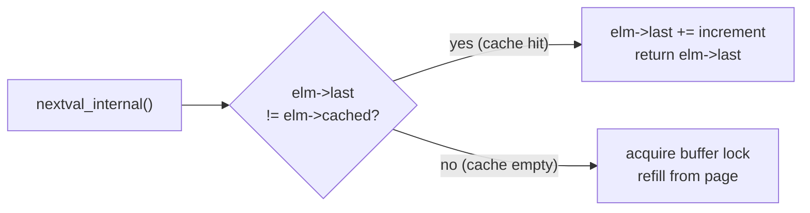
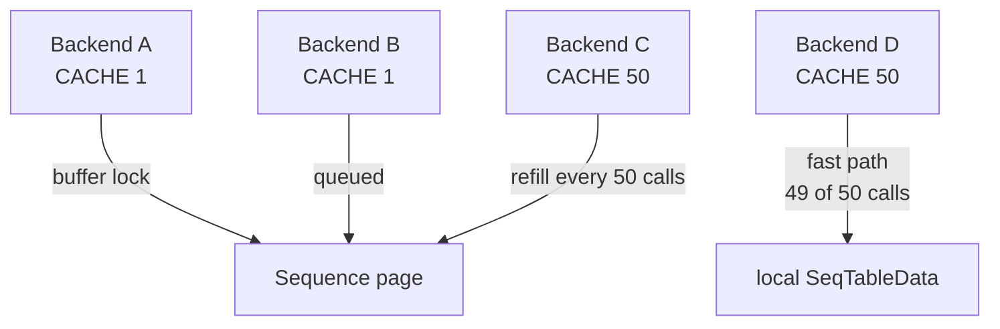

# nextval execution path

`SELECT nextval('seq')` is one of the most concurrency-sensitive operations in PostgreSQL, yet under ordinary conditions it touches no shared state at all. Understanding that apparent paradox — and knowing precisely when shared state does get touched — explains both the performance characteristics of sequences and the gaps that inevitably appear in their output.

For the data-structure side (on-disk layout, catalog representation, `SERIAL` vs. identity columns), see [[subsystems/sequences]]. This article traces the execution flow.

## From SQL call to sequence.c

`nextval('seq')` is a plain SQL function registered in `pg_proc`. The parser treats it as a normal function call; the executor dispatches it through `ExecMakeFunctionResultNoSets`, which reaches `nextval_oid()` in `src/backend/commands/sequence.c`. That wrapper resolves the text name to an OID via `pg_get_sequencedef`. It then calls `nextval_internal(relid, true)`, passing `true` to enable the privilege check.

The first thing `nextval_internal` does is call `init_sequence()`, which finds or creates a `SeqTableData` entry in `seqhashtab`, a backend-local hash table keyed by sequence OID. If this is the first call for this sequence for this backend, `init_sequence()` zero-initialises the entry with `last == cached == 0` and `last_valid == false`.

After the hash lookup, `lock_and_open_sequence()` acquires a `RowExclusiveLock` on the sequence relation via the heavyweight lock manager — but only once per transaction. `lock_and_open_sequence()` pins the lock to `TopTransactionResourceOwner` so that repeated `nextval` calls within the same transaction skip the lock manager entirely. This is the relation-level lock that prevents concurrent DDL (`ALTER SEQUENCE`, `DROP SEQUENCE`) from interfering with active callers.

## Cache hit: the lockless fast path



When `elm->last != elm->cached`, the backend has pre-allocated values that it has not yet returned to callers. It increments `elm->last` by the sequence's increment, closes the relation (without releasing the transaction-level lock), and returns. No other backend is involved. No buffer is touched. No WAL is written.

This path is entirely lockless from the perspective of other backends. A backend running at high concurrency with `CACHE 50` will touch shared memory only once every fifty calls — the other forty-nine are pure local computation.

## Cache refill: acquiring the buffer lock

When `elm->last == elm->cached`, the local pre-allocation is exhausted and the backend must go to the sequence page. `read_seq_tuple()` pins the buffer and acquires an **exclusive buffer content lock** — an LWLock — on the single-page sequence relation. This is the serialisation point for concurrent `nextval` calls: multiple backends wanting to refill their caches must queue on this lock one at a time.

Once inside the critical section, the backend reads the `FormData_pg_sequence_data` tuple to obtain `last_value`, `log_cnt`, and `is_called`, then computes the next batch:

- If `is_called` is false (the sequence has never been advanced), the current `last_value` is itself the first value to return. No increment happens on this initial call.
- Otherwise the backend walks a loop, advancing `next` by `increment` for each slot, checking against `MAXVALUE`/`MINVALUE` at every step and cycling or erroring as appropriate.
- It pre-allocates exactly `CACHE` values for local use (tracking them in `elm->last` and `elm->cached`).

The page write, `MarkBufferDirty`, and WAL insertion all happen while the buffer lock is held. The lock is released with `UnlockReleaseBuffer` as soon as the critical section ends.

Contention on a hot sequence therefore surfaces as LWLock waits, not heavyweight lock waits. It will not appear in `pg_locks`, but it will be visible in `pg_stat_activity` (wait event `LWLock: buffer_content`). If `pg_wait_sampling` is installed, contention will be visible there too.

## WAL pre-logging

Cache refill only forces a WAL write when the pre-logged budget is exhausted or a checkpoint has passed since the sequence's last WAL record. See [[subsystems/sequences|Sequences]] for the two trigger conditions (`log_cnt < fetch` and `PageGetLSN(page) <= GetRedoRecPtr()`) and the `SEQ_LOG_VALS = 32` lookahead scheme.

What matters for the execution path is the ordering inside the critical section. The backend writes the `XLOG_SEQ_LOG` record describing the far-ahead lookahead state first. Then it rewrites the page back to the real `last_value`/`log_cnt` before releasing the buffer lock. The page and the WAL record intentionally disagree from that point until a crash makes the gap visible during replay.

## Where gaps come from

The three sources of gaps — unused cache values discarded on backend exit, transaction rollback (since `nextval` writes outside the calling transaction's undo chain), and crash recovery losing the pre-logged lookahead described above — are a direct consequence of the locking and WAL behavior traced in this article. See [[subsystems/sequences|Sequences]] for the full explanation of each source and why gap-free numbering isn't a design goal.

## SETVAL semantics

`SETVAL(seq, n)` and `SETVAL(seq, n, is_called)` both route through `do_setval()` in `sequence.c`. The locking path is identical to `nextval_internal`: the same `RowExclusiveLock` via `init_sequence`, the same exclusive buffer content lock via `read_seq_tuple`.

The write is simpler than a cache refill:

```
seq->last_value = next;
seq->is_called  = iscalled;   /* true for 2-arg form, caller-supplied for 3-arg */
seq->log_cnt    = 0;          /* force fresh WAL record on next nextval */
```

Setting `log_cnt = 0` is the critical step. It guarantees that the next `nextval` call will write a new WAL record for the explicitly set value, rather than relying on a pre-logged record that may describe a different state. Without this, a crash after `SETVAL` but before the next WAL-triggering `nextval` could leave the sequence at the old pre-logged position.

The `is_called` flag determines how the next `nextval` interprets `last_value`. When `is_called = true` (the default two-argument form), the next `nextval` returns `last_value + increment`. When `is_called = false` (three-argument form with `false`), the next `nextval` returns `last_value` itself — the value is treated as not yet consumed. This is primarily used by `pg_dump` to restore a sequence to exactly its original state, including the "has it ever been called" condition.

`do_setval` also invalidates the calling backend's local cache by setting `elm->cached = elm->last`. This ensures the backend does not use pre-allocated values that are now below the new sequence position.

## Concurrent nextval performance



With `CACHE 1` (the default for `SERIAL` columns), every `nextval` call acquires the buffer content lock. At high concurrency — say, a hundred backends each inserting one row per millisecond — the sequence page becomes a contention point. Backends queue on `LWLock: buffer_content`, throughput plateaus, and latency climbs.

`GENERATED AS IDENTITY` defaults to `CACHE 1` as well, but the DDL syntax makes it easy to specify a larger value:

```sql
id BIGINT GENERATED ALWAYS AS IDENTITY (CACHE 50)
```

With `CACHE 50`, ninety-eight percent of `nextval` calls hit the local fast path. Only one in fifty backends need the buffer lock at any given moment. They hold it for microseconds. A busy table serving many concurrent inserts benefits greatly from cache values in the 10–100 range. The trade-off is up to 50 × `number_of_backends` wasted values per crash, which is irrelevant for most applications.

Parallel query workers cannot call `nextval` at all: `PreventCommandIfParallelMode` raises an error. This is because the backend-local `SeqTableData` cache is not shared among parallel workers. Each worker would need its own cache state, which the current implementation does not support.

## Sequences on standbys and after failover

On a physical standby, calling `nextval` immediately raises an error. The standby replays the primary's WAL stream. Any local write to the sequence page would diverge from that stream and corrupt the sequence state on failover.

Logical decoding does not decode sequence changes: the `XLOG_SEQ_LOG` records of the sequence resource manager are WAL-logged for physical replication and crash recovery, but the decoder ignores them. Through PostgreSQL 18, logical replication therefore never replicates sequence state. PostgreSQL 19 adds sequence synchronization (`FOR ALL SEQUENCES` publications, `ALTER SUBSCRIPTION ... REFRESH SEQUENCES`, and a sequencesync worker, `sequencesync.c`). It copies the current sequence values on request. It does not stream each `NEXTVAL`, so a subscriber's sequences still lag the publisher's between refreshes. After a logical replication failover to a new primary, the new primary's sequences still hold the values they had when the base backup was taken or when replication was set up. Those values are almost certainly lower than the values already inserted on the former primary. Every sequence used for primary-key generation must be manually advanced with `SETVAL` before the new primary accepts writes. Otherwise subsequent inserts will produce duplicate-key errors on values that already exist in the replicated data. With sequence synchronization, the step can be replaced by a final `REFRESH SEQUENCES` before promotion, if the publisher is still reachable. Otherwise it remains a manual operational step.

## See also

- [[subsystems/sequences]] — reference article on data structures, storage layout, and design
- [[subsystems/wal/overview]] — WAL record format and the `XLOG_SEQ_LOG` resource manager
- [[subsystems/locking/lwlocks]] — buffer content locks used during the cache refill critical section
- [[code-paths/insert]] — sequences consumed as column defaults during INSERT
