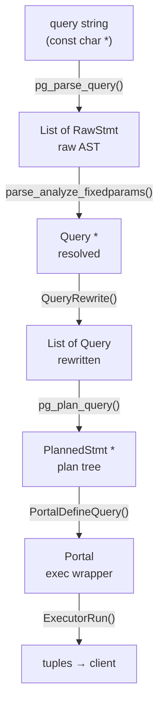
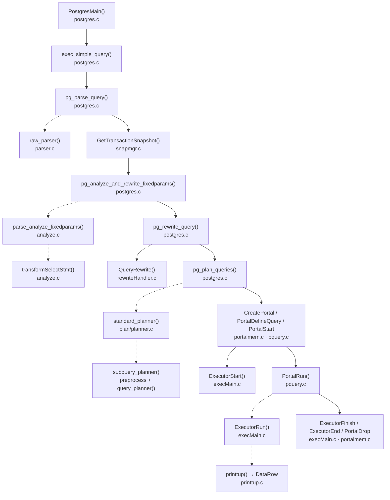

# Simple SELECT Code Path

How PostgreSQL turns a query string into rows on the wire. This page follows a simple `SELECT` — one table, no subqueries, no CTEs — to keep the path clear. Where the path diverges for parallel execution or extended-query protocol, those branches are called out explicitly.

## The pipeline at a glance

PostgreSQL does not process a query in one pass. It deliberately breaks work into stages, each producing a progressively more resolved data structure. The boundaries exist for concrete reasons: parsing is stateless and fast, so it happens before any catalog lock is taken; the planner's output can be cached and reused without reparsing; execution can be suspended mid-stream for cursors. Understanding the boundaries tells you a lot about how PostgreSQL is designed to be extended and reused.

## Request entry and memory ownership

A single function, `exec_simple_query()` (`src/backend/tcop/postgres.c`), owns every simple-query request end-to-end. The main backend loop in `PostgresMain()` invokes it when the client sends a simple-query protocol message (`'Q'`). It allocates the [[subsystems/memory/contexts|memory context]] for the entire request. It then drives every subsequent stage. A single call may process multiple statements if the client sent a semicolon-separated batch.

The function begins by calling `start_xact_command()`, which opens or continues a transaction. Multiple statements in a single query message share the same implicit transaction block unless explicit `BEGIN`/`COMMIT` statements appear between them. Parsing happens next in `MessageContext`, then execution happens in the transaction context. The design keeps tree construction in a context that survives across statements. Per-statement allocations that can be freed early go into a separate `per_parsetree_context`.

## Parsing

The parser converts the query string into a raw abstract syntax tree without touching any catalog or acquiring any locks. At this stage, table names are still unresolved strings and operators are unresolved text. This isolation is deliberate: keeping parsing stateless means the same raw tree can be cached by the prepared-statement machinery and re-analyzed later under a different schema. The Bison/Flex grammar in `src/backend/parser/gram.y` produces a `SelectStmt` node wrapped in a `RawStmt` (`raw_parser()`, `src/backend/parser/parser.c`). The `pg_parse_query()` wrapper in `src/backend/tcop/postgres.c` drives this step.

Importantly, parsing is the only stage that can safely run in an aborted transaction state. If a transaction has already failed, PostgreSQL still runs the raw parser to check whether the statement is a `COMMIT` or `ROLLBACK`. All subsequent stages require catalog access and will correctly error out if a transaction is aborted.

## Snapshot acquisition

Before semantic analysis begins, `exec_simple_query` pushes an active snapshot with `GetTransactionSnapshot()`. The catalog is MVCC-visible: the analyzer reads `pg_class`, `pg_attribute`, `pg_operator`, and others. It must see a consistent view of those tables. The snapshot ensures that catalog reads during analysis see the same state regardless of concurrent DDL.

Critically, `exec_simple_query` explicitly discards this planning-time snapshot before execution begins. The source code comment explains why: reusing the planning snapshot for execution would mean the query scans heap data using a snapshot taken before any table locks were acquired. That creates user-visible read anomalies (`src/backend/tcop/postgres.c`, around line 1201). Execution therefore acquires a fresh snapshot — via `PortalStart` → `GetTransactionSnapshot` — after the appropriate relation locks are already held. This ordering guarantee is what makes a `SELECT` see a consistent snapshot of the heap.

## Semantic analysis

Analysis is where the query crosses from user language into executor language. SQL lets you write `SELECT *` or `name = 'alice'` without specifying column numbers or operator OIDs; the executor needs exact `Var` nodes pointing to specific attribute numbers, and operator function pointers it can call directly. Closing that gap is the analyzer's job.

The analyzer consults the catalog here first: it resolves table names via `pg_class`, matches columns to range-table entries, expands `*`, and resolves operators by argument types. Each output column becomes a `TargetEntry` wrapping a fully typed expression tree. The entry point is `parse_analyze_fixedparams()` (`src/backend/parser/analyze.c`), which builds a `ParseState` and drives `transformSelectStmt()` to produce a resolved `Query *`.

The `Query` carries:
- `rtable` — one entry per FROM item; the executor uses it to open the right heap
- `targetList` — the projection, as resolved expression trees
- `qual` — the WHERE clause; evaluated per tuple at runtime
- `sortClause`, `groupClause`, `havingQual`

The `Query` contains no access-path decisions — it describes *what* to compute, not *how*.

## Rule rewriting

PostgreSQL's rule system predates the modern planner. Views are not special syntax handled throughout the engine — they are stored `SELECT` rules. When the rewriter finds a range-table entry with rules attached, it substitutes the rule body. The substitution recurses until only base relations remain. Row-level security works the same way: it injects additional `qual` conditions at this stage rather than scattering policy checks across the planner and executor.

For a plain table with no rules, rewriting is a no-op, returning the original `Query` in a single-element list. The list form exists to handle `DO ALSO` rules, which can expand one query into several. The implementation lives in `QueryRewrite()` (`src/backend/rewrite/rewriteHandler.c`).

## Planning

The same logical query can be answered many ways — sequential scan, index scan, bitmap scan, various join orders if multiple tables are involved, parallel or serial execution. The planner enumerates the options, estimates the cost of each using table statistics, and emits the cheapest one as a tree of `Plan` nodes. It never changes the result; it only changes how cheaply the result is obtained.

### Planner entry points

The call chain runs through `pg_plan_query()` → `planner()` → `standard_planner()` → `subquery_planner()` → `query_planner()` (`src/backend/optimizer/plan/planner.c`). The outer two layers handle the hook mechanism and global planner state setup (`PlannerGlobal`). `subquery_planner()` is the recursive workhorse: it calls itself for subqueries and CTEs, runs expression preprocessing on all query clauses, and delegates scan/join planning to `query_planner()`. `query_planner()` builds `RelOptInfo` structures for each base relation, enumerates access paths, and returns the cheapest path for the scanner/join portion of the query.

After `query_planner()` returns the cheapest scan-join path, `subquery_planner()` adds upper-planner stages for any aggregation, sorting, windowing, or limiting. The result is a `Path` tree. `standard_planner()` then calls `create_plan()` to convert the cheapest path into a concrete `Plan` node tree, producing the final `PlannedStmt`.

### Expression preprocessing and constant folding

Before generating paths, `subquery_planner()` runs `preprocess_expression()` over every expression in the query: the target list, WHERE clause, HAVING clause, ORDER BY expressions, window frame offsets, and range table function expressions (`src/backend/optimizer/plan/planner.c`). This step does several things in sequence:

- Flattens join alias variables into base-relation references.
- Calls `eval_const_expressions()` to evaluate constant subexpressions at planning time. An expression like `2 + 2` becomes `4`, `EXTRACT(year FROM '2024-01-01'::date)` becomes a literal integer, and calls to stable functions with constant arguments are resolved. This reduces the expression tree the executor must evaluate per row.
- Applies `canonicalize_qual()` to normalize boolean expressions into flat AND/OR form, which the selectivity estimators and index-scan matching logic depend on.
- Converts `ScalarArrayOpExpr` nodes with large constant arrays into hash-based lookups (`convert_saop_to_hashed_saop`).
- Expands sublinks into subplan or initplan nodes.

Constant folding is not optional. The code comment in `preprocess_expression()` notes that named-argument function calls must be converted to positional form here. It also notes that default arguments must be inserted at this point. Skipping the step, even when it looks unnecessary, caused bugs in older versions, so PostgreSQL no longer allows it.

### Catalog access during planning

The planner calls `get_relation_info()` (`src/backend/optimizer/util/plancat.c`) once per base relation to populate the `RelOptInfo` it uses. It opens the relation with `table_open(relationObjectId, NoLock)`, since the rewriter or an earlier range-table expansion already took the lock. It also reads row count estimates, page count, the parallel_workers reloption, and the full index list. For each index, it builds an `IndexOptInfo` with the AM's capability flags, sort order information, expression trees for expression indexes, and partial-index predicates. At this point, the planner learns which access methods are available and their cost characteristics.

### Parallel query

During `standard_planner()`, before calling `subquery_planner()`, the planner checks whether parallel execution is viable. The conditions are: the query is a plain `SELECT`, the backend is running under the postmaster, `max_parallel_workers_per_gather > 0`, no parallel-unsafe functions appear in the query tree, and the query is not already running inside a parallel worker (`src/backend/optimizer/plan/planner.c`, around line 347).

If parallelism is permitted, path generation in `query_planner()` includes parallel scan paths. Each base-relation access method that supports parallelism — heap sequential scans, B-tree index scans — advertises a `parallel_workers` estimate. The path planner computes a `GatherPath` or `GatherMergePath` atop the parallel child paths. `create_gather_plan()` creates the `Gather` plan node and records the number of workers requested.

At execution time, the Gather node initializes lazily: on the first call to `ExecGather()`, it calls `ExecInitParallelPlan()` to set up shared memory, then `LaunchParallelWorkers()` to start background worker processes (`src/backend/executor/nodeGather.c`). Each worker runs the subtree below the `Gather` independently on a disjoint subset of the heap. The leader process optionally participates as a worker itself (controlled by `parallel_leader_participation`). Workers send finished tuples back through tuple queues in shared memory; the Gather node reads from all queues in round-robin order and presents tuples to its parent as if they came from a single stream.

If the system launches fewer workers than requested — because it has hit `max_parallel_workers` or the relation is too small — the Gather node falls back to running the subtree locally in the leader process.

## Portal setup

Before execution, PostgreSQL wraps the plan in a portal. A portal is the unit of cursor execution: it holds a `PlannedStmt`, a memory context that persists across fetches, the source text, and the current position in the result set. Even queries that are not declared as cursors go through this layer. This is why `DECLARE cursor; FETCH 10; FETCH 10;` gets cursor semantics essentially for free.

`CreatePortal()` creates the unnamed portal, and `PortalDefineQuery()` (`src/backend/utils/mmgr/portalmem.c`) loads it. `PortalStart()` (`src/backend/tcop/pquery.c`) assigns the `PORTAL_ONE_SELECT` strategy, builds a `QueryDesc`, and calls `ExecutorStart()` to initialise executor state.

## The executor lifecycle

The executor lifecycle has four phases, each a distinct function call:

**ExecutorStart** (`src/backend/executor/execMain.c`) allocates the `EState`, which is the per-statement execution state. It calls `InitPlan()`, which walks the `Plan` node tree recursively and allocates a matching `PlanState` node for every plan node. This walk also opens heap relations. For a plain `SELECT` without modifying CTEs, `ExecutorStart` skips trigger setup entirely as an optimisation. `ExecutorStart` also registers a snapshot into `estate->es_snapshot`; every subsequent heap page read uses it to determine tuple visibility.

**ExecutorRun** drives actual tuple production. It calls `ExecutePlan()`, which calls the root plan node's execution function via `ExecProcNode()` in a loop. In the Volcano model, the root node pulls tuples from its children on demand; nothing is materialised before being sent to the client. `ExecutorRun` immediately passes each tuple produced by `ExecProcNode()` to the destination receiver's `receiveSlot` callback. `PortalRun` can call `ExecutorRun` multiple times on the same `QueryDesc` — each call fetches up to `count` tuples — which is how cursor `FETCH` works.

**ExecutorFinish** runs after the last `ExecutorRun` call. It fires any AFTER-statement triggers. For a plain `SELECT`, this phase is a no-op because `EXEC_FLAG_SKIP_TRIGGERS` was set in `ExecutorStart`.

**ExecutorEnd** releases all resources held by the executor: closes heap relations, frees expression contexts, shuts down [[subsystems/executor/jit-llvm|JIT]] compilation state, and drops the `EState` memory context.

## Destination receivers and result sending

To send a result set to the client, `exec_simple_query` creates the destination receiver with `CreateDestReceiver(DestRemote)` and calls `SetRemoteDestReceiverParams()` to attach the portal. The receiver implementation lives in `src/backend/access/common/printtup.c`; its internal struct is `DR_printtup`.

When `ExecutorRun` calls `dest->rStartup()`, the receiver sends a `RowDescription` wire message. It lists the column names, OIDs, and type modifiers the client needs to decode each data row that follows. Each subsequent call to `dest->receiveSlot()` — the `printtup()` function — encodes one tuple into the libpq `DataRow` wire format and flushes it to the client output buffer. Because this happens inside the `ExecProcNode()` loop, rows reach the network before the full result set exists. There is no intermediate accumulation step.

The `DR_none` receiver (used when `dest == DestNone`) discards tuples silently; this is the path taken by `EXPLAIN` without `ANALYZE`, and by utility queries that produce no rows.

## Heap access and locking

A simple `SELECT` holds no locks on heap pages at any point during its execution. The lock protocol for reads works at a much finer granularity.

When `heapgetpage()` reads a new block, it calls `LockBuffer(buffer, BUFFER_LOCK_SHARE)` before inspecting the page, then `LockBuffer(buffer, BUFFER_LOCK_UNLOCK)` immediately after determining which tuples pass the visibility check (`src/backend/access/heap/heapam.c`). `ReadBufferExtended()` takes the buffer pin and holds it for the duration of the page visit. This pin prevents the buffer manager from evicting the page, but it does not block concurrent writers. The scan releases the pin when it moves to the next page.

This means a full sequential scan acquires and releases a buffer-lock share per page. It never holds more than one page lock at a time, and it never holds any lock between successive `ExecProcNode()` calls that return tuples to the caller. Relation-level locks (`AccessShareLock` on the table) last for the duration of the query. They prevent concurrent `DROP TABLE` or `TRUNCATE`, but they do not block concurrent inserts, updates, or deletes.

## Call graph

The spine (solid arrows) shows the sequential call order inside `exec_simple_query`. Dotted arrows show key internal delegates.

## Version notes

The pipeline structure has been stable across major versions. Notable variation points:
- `raw_parser()` gained a `RawParseMode` parameter in PG 14.
- The extended-query protocol distributes the pipeline across three message types: the Parse message runs stages 2–4 (parse, analyze, rewrite) and caches the result as a prepared statement; Bind runs stage 5 (plan) and creates the portal (stage 6); Execute runs stage 7. Stages 2–4 are paid once and reused across many executions. `exec_simple_query` is specific to the simple-query protocol.
- Parallel query was introduced in PG 9.6 with basic sequential scan support, and has been extended in each major release to cover more node types and aggregate strategies.
- The snapshot ordering fix — discarding the planning snapshot before execution — was established behaviour by PG 9.x; the code comment references a thread from 2012 explaining the anomaly it prevents.

## Related Topics

- [[code-paths/extended-query]] — the extended-query protocol distributes the same parse/analyze/plan/execute pipeline across three message types, enabling prepared-statement reuse
- [[code-paths/cursor]] — cursor mechanics built on the portal layer that simple SELECT traverses, showing how FETCH reuses the executor across multiple ExecutorRun calls
- [[subsystems/parser/overview]] — details of the raw parser and semantic analysis stages that produce the RawStmt and Query structures this page follows
- [[subsystems/rewriter/overview]] — how the rule rewriter expands views and injects row-level security quals between semantic analysis and planning
- [[subsystems/executor/seq-scan]] — the sequential scan node that executes at the bottom of the plan tree for a plain single-table SELECT
- [[subsystems/transactions/snapshot]] — how transaction snapshots are acquired and used to enforce MVCC visibility during heap access
- [[subsystems/planner/cost-model]] — the cost formulas the planner applies when choosing between access paths during planning
- [[subsystems/executor/overview|Executor Overview]] — the general Volcano-style node iteration model that drives the plan tree once `ExecutorRun` begins
- [[subsystems/planner/index-selection|Index Selection and Index Path Costing]] — how the planner chooses between sequential and index scan paths for the query's base relation during planning
- [[subsystems/replication/streaming|Streaming Replication]] — how WAL streaming keeps standbys current, relevant to how MVCC visibility behaves for SELECTs run against a standby
