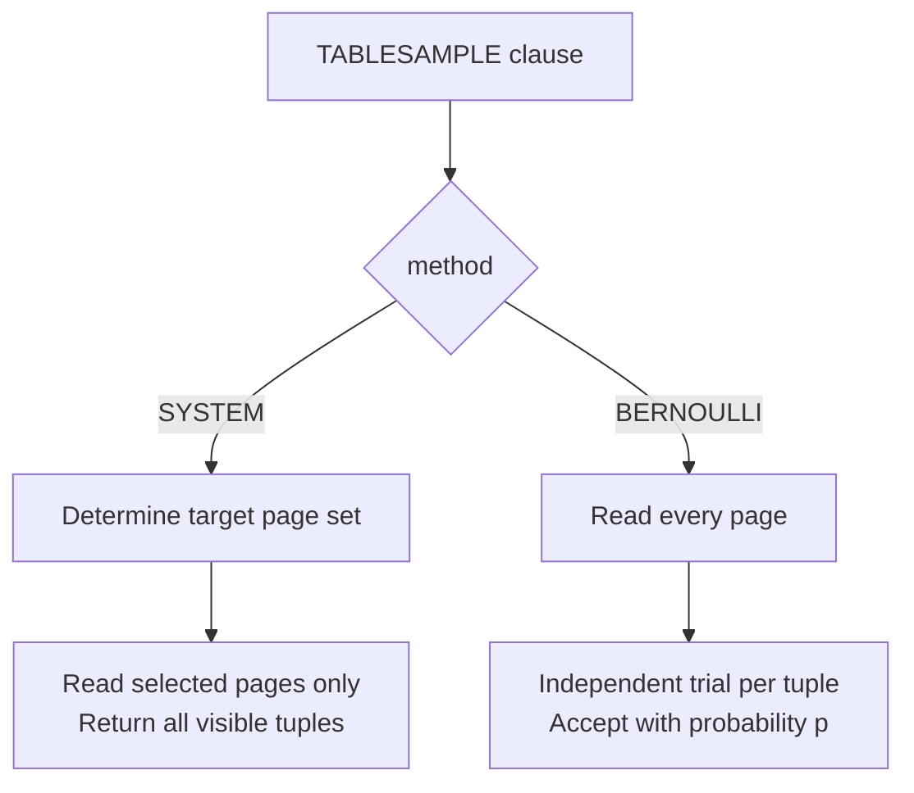

`TABLESAMPLE` allows a query to read a random subset of a table without scanning the entire relation. Unlike `ORDER BY random() LIMIT n`, a table sample can skip entire heap pages. This makes it practical for approximate analytics on large tables, where statistical precision is acceptable in exchange for speed.

```sql
SELECT * FROM orders TABLESAMPLE BERNOULLI(10);            -- ~10% of rows
SELECT * FROM orders TABLESAMPLE SYSTEM(1) REPEATABLE(42); -- ~1% of pages, deterministic
```

The executor node implementing this is `SampleScan`. It is backed by a pluggable sampling method that decides which blocks and tuples to include. Both the sampling method and the executor cooperate through a `TsmRoutine` callback vtable.

## The Two Built-in Methods

PostgreSQL ships two methods, each representing a different trade-off between speed and statistical quality.

**SYSTEM** sampling operates at the block level. It determines a target set of heap pages and reads only those pages. Reading a page returns every visible tuple on it, without any per-row trial. Because unselected pages are never fetched, I/O scales with the sampling fraction rather than with the table size. The cost is correlation: rows on the same page are either all included or all excluded together. On tables where rows of similar type cluster on the same pages — bulk inserts, for instance — a `SYSTEM` sample can be systematically skewed relative to the true distribution.

**BERNOULLI** sampling operates at the row level. The method reads every page, but subjects each tuple to an independent probabilistic trial with probability equal to the requested percentage. Because no page is skipped, I/O is equivalent to a full sequential scan. The benefit is a statistically unbiased sample: every row has an equal and independent chance of inclusion regardless of storage layout or page fullness.



Both methods accept a `float8` percentage argument. Values outside `[0, 100]` are rejected at parse time.

## How SYSTEM Selects Blocks

The built-in `SYSTEM` method converts the sampling percentage into a `uint64` cutoff. For each candidate block number, it hashes the pair `(blockno, seed)` and accepts the block when the hash falls below the cutoff. Because the acceptance decision depends only on the block number and the seed, not on any prior scan state, the method is history-independent. It does not need to track which blocks it has already evaluated. Inserting or deleting rows in other parts of the table does not change which blocks are selected. The buffer manager never accesses pages that are not selected, so they do not pollute the shared buffer cache.

The `sampling.c` infrastructure provides a complementary block-selection utility, `BlockSampler`, which implements Knuth's Algorithm S (Vol. 2 §3.4.2). Rather than drawing one random number per candidate block, Algorithm S computes how many blocks to skip in a single step — the number of random draws scales with the *sample size*, not the table size. Extensions such as `tsm_system_rows` use this approach when they need to guarantee an exact block count. The full callback implementation for both built-in methods is documented in [[subsystems/storage/tablesample-methods|TABLESAMPLE Methods]].

## The Scan Loop

`ExecInitSampleScan` sets up the scan state and prepares expression states for the method's arguments and any `REPEATABLE` clause. `ExecInitSampleScan` obtains the `TsmRoutine` vtable via `GetTsmRoutine`, which calls the handler OID stored in `TableSampleClause.tsmhandler` in the plan.

`tablesample_init` runs at execution start (and on each rescan): it evaluates the method's parameters and the `REPEATABLE` seed, then calls `BeginSampleScan`. `BeginSampleScan` creates the underlying `HeapScanDesc` (or equivalent for non-heap access methods) here, because parameters may not be evaluable until runtime.

`tablesample_getnext` drives the block-and-tuple loop. For methods that provide `NextSampleBlock` (such as `SYSTEM`), it requests the next page from the method, reads it, then asks `NextSampleTuple` which offsets within that page to accept. For methods that omit `NextSampleBlock` (such as `BERNOULLI`), it feeds every page in sequence to `NextSampleTuple` for per-tuple filtering. After each accepted tuple passes MVCC visibility and any `WHERE` predicate, `tablesample_getnext` returns it to the caller. The `haveblock` and `done` flags on `SampleScanState` track loop position across successive executor calls.

## REPEATABLE and Seed Handling

`REPEATABLE(seed)` makes the sample deterministic. The SQL-level `float8` seed is hashed via `hashfloat8` to produce a `uint32` passed to `BeginSampleScan`. Using a hash rather than a direct cast ensures the same seed value maps to the same `uint32` on all platforms. This consistency matters for regression tests using `REPEATABLE(0)`.

When no `REPEATABLE` clause is present, `ExecInitSampleScan` draws a random seed from the server's global PRNG once at initialisation. This seed is fixed for the lifetime of the scan node; it is not re-drawn on rescan.

Determinism under `REPEATABLE` is conditional on table stability. If rows are inserted, deleted, or pages are reorganised between two runs with the same seed, results will differ. This happens because the block numbers and tuple offsets being hashed have changed. `REPEATABLE` combined with a transaction does not provide snapshot-quality consistency: `TABLESAMPLE` uses the regular heap scan path with the current snapshot, so concurrent modifications can change results even with a fixed seed.

## Predicates and Visibility

The executor applies three filters in sequence: the sampling method's block and tuple selection, MVCC visibility, and then the `WHERE` clause predicate. The sampling method never sees invisible tuples. If rows are deleted after statement start but before their page is sampled, those rows will not appear. `BERNOULLI` may then return fewer than the stated percentage of live rows. Neither method samples through indexes; both require a heap scan, so index-only scans are not available. Visibility checks via hint bits apply normally to filter dead tuples.

## Performance Characteristics

| Method | Pages read | Random draws | Statistical property |
|---|---|---|---|
| SYSTEM | O(sample pages) | O(sample pages) | Block-level uniform |
| BERNOULLI | O(all pages) | O(all rows) | Row-level uniform |

For large tables, `SYSTEM` is typically orders of magnitude faster than `BERNOULLI` because it skips the vast majority of heap pages. However, after heavy deletion without a `VACUUM`, a `SYSTEM` sample under-represents sparse pages and over-represents denser surviving-row pages. `BERNOULLI` is the correct choice when statistical exactness matters, or when the table fits comfortably in the buffer pool. In the latter case, page-read cost becomes negligible.

`SYSTEM` enables the page-mode visibility check unconditionally, since it reads all tuples on each selected page. `BERNOULLI` enables page-mode visibility only at fractions of 25% or higher; below that threshold, the overhead of acquiring page-level visibility information exceeds the benefit for the small number of tuples accepted per page.

## Extensible Sampling API

`TABLESAMPLE` is not limited to the two built-in methods. The `TsmRoutine` callback interface (`access/tsmapi.h`) allows extensions to register additional methods as table access method handlers. Two are shipped in `contrib`:

- **tsm_system_rows** — a variant of `SYSTEM` that accepts a target row count instead of a percentage. It uses reservoir sampling (Algorithm Z, Vitter 1985) to select exactly that many rows, even when the relation size is unknown in advance.
- **tsm_system_time** — stops sampling after a wall-clock time limit, returning however many rows were collected within that budget.

The reservoir sampling infrastructure in `sampling.c` (`reservoir_get_next_S`, `reservoir_init_selection_state`) supports these and any extension that needs to sample from a population of unknown size. Algorithm Z is more complex than Algorithm S but handles the unknown-population case by skipping geometrically increasing gaps between selected records, keeping the number of random draws proportional to the sample size.

[[subsystems/storage/tablesample-methods|TABLESAMPLE Methods]] documents the full `TsmRoutine` callback contract, including the `NextSampleBlock` / `NextSampleTuple` distinction, planner cost callbacks, and how to write a custom method.

## Practical Use

`TABLESAMPLE SYSTEM(1)` is a common idiom for approximate aggregate queries on large OLAP tables — estimating a count or average without a full scan. The planner treats the sample as a `SampleScan` node, which participates normally in joins and aggregation; the planner scales its row count estimate by the sampling fraction.

For building representative test datasets from production data, `BERNOULLI` gives a cleaner random draw since every row has an equal chance of selection independent of storage layout. For raw speed on well-packed large tables where the bias is acceptable, `SYSTEM` is the practical default. `tsm_system_rows` is the right tool when a fixed row count budget matters more than a fixed percentage.

## Related Topics

- [[subsystems/storage/tablesample-methods|TABLESAMPLE Methods]] — the TsmRoutine callback API, how BERNOULLI and SYSTEM implement each callback, and how to write a custom method
- [[subsystems/executor/seq-scan|Sequential Scan]] — the full-table scan equivalent
- [[subsystems/executor/overview|Executor Overview]]
- [[subsystems/storage/table-am|Table Access Method API]]
