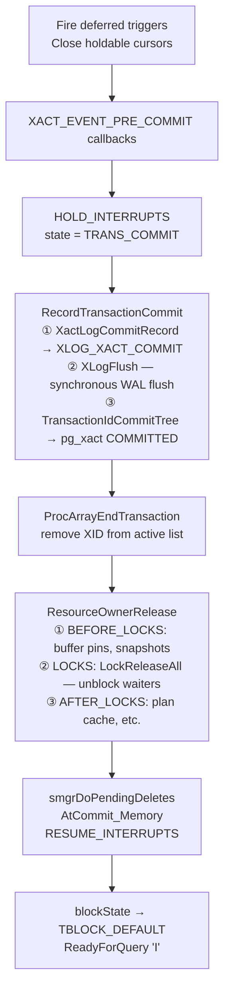

# BEGIN / COMMIT / ROLLBACK Code Path

This article traces the execution path of the SQL transaction control statements `BEGIN`, `COMMIT`, and `ROLLBACK` from the parser through to WAL and lock release. The detailed state machine and data structures are in [[subsystems/transactions/begin-commit-rollback]].

## Parser output

The parser produces a `TransactionStmt` node for all transaction control commands. The `kind` field (`TransactionStmtKind`) determines which internal function is called:

| SQL | `kind` | Internal function |
|---|---|---|
| `BEGIN` / `START TRANSACTION` | `TRANS_STMT_BEGIN` | `BeginTransactionBlock()` |
| `COMMIT` / `END` | `TRANS_STMT_COMMIT` | `EndTransactionBlock()` |
| `ROLLBACK` / `ABORT` | `TRANS_STMT_ROLLBACK` | `UserAbortTransactionBlock()` |
| `SAVEPOINT name` | `TRANS_STMT_SAVEPOINT` | `DefineSavepoint()` |
| `RELEASE SAVEPOINT name` | `TRANS_STMT_RELEASE` | `ReleaseSavepoint()` |
| `ROLLBACK TO SAVEPOINT name` | `TRANS_STMT_ROLLBACK_TO` | `RollbackToSavepoint()` |
| `PREPARE TRANSACTION gid` | `TRANS_STMT_PREPARE` | `PrepareTransactionBlock()` |

All arrive at `standard_ProcessUtility()` (`src/backend/tcop/utility.c`) via the normal utility statement dispatch.

## The autocommit wrapper

Every command — including ordinary DML — runs inside a transaction. The backend main loop in `PostgresMain()` calls `StartTransactionCommand()` before handing the command to the executor, and `CommitTransactionCommand()` afterward. For a single DML statement outside an explicit `BEGIN` block, these two calls form a complete autocommit transaction.

```
PostgresMain loop:
  StartTransactionCommand()    ← blockState: DEFAULT → STARTED
  ReadCommand → parse → execute
  CommitTransactionCommand()   ← blockState: STARTED → DEFAULT (autocommit)
  ReadyForQuery()
```

## BEGIN

`BeginTransactionBlock()` is a **state-setting-only** function. It transitions `blockState` from `TBLOCK_STARTED` to `TBLOCK_BEGIN` and returns immediately — no transaction work is done yet.

```
client sends: BEGIN
  standard_ProcessUtility
    BeginTransactionBlock()      blockState: TBLOCK_STARTED → TBLOCK_BEGIN
  command returns
  CommitTransactionCommand()     blockState: TBLOCK_BEGIN → TBLOCK_INPROGRESS
  ReadyForQuery('T')             'T' = inside transaction block
```

`BEGIN` does **not** assign an XID. PostgreSQL uses lazy XID assignment: it allocates the XID only on the first write inside the transaction (heap_insert, heap_update, and similar functions call `AssignTransactionId()`). Read-only transactions may complete without ever consuming an XID.

## COMMIT

`EndTransactionBlock()` sets `blockState = TBLOCK_END`. The real work runs when the backend main loop calls `CommitTransactionCommand()`, which calls `CommitTransaction()` (`xact.c`).



`RecordTransactionCommit()` is the durability boundary. Once `XLogFlush` returns, the commit is durable regardless of a subsequent crash.

### ProcArray and the visibility handoff

ProcArray (`src/backend/storage/ipc/procarray.c`) is a shared-memory structure holding an array of `PGPROC` structs — one per active backend — together with parallel arrays maintained in `ProcGlobal`. Among other fields, each entry carries the backend's current transaction ID (`xid`) and its `xmin`. When a backend calls `GetSnapshotData()` to build a snapshot, it acquires a shared `ProcArrayLock` and scans `ProcGlobal->xids[]` to determine which XIDs are currently in progress. The snapshot treats any XID found in that scan as in-progress. Rows written by that XID are invisible to the snapshot.

`ProcArrayEndTransaction()` is the moment a committing transaction exits the set of running transactions. It acquires `ProcArrayLock` in exclusive mode and zeroes out `ProcGlobal->xids[pgxactoff]` and `proc->xid`. From this point forward, any snapshot built by another backend will not see this XID in the running-transaction list. Combined with the `pg_xact` commit record written earlier, this means those snapshots will now see the XID as committed and its rows as visible.

The ordering relative to `RecordTransactionCommit()` is deliberate: PostgreSQL updates WAL and `pg_xact` first, then removes the XID from ProcArray. If the removal happened before WAL flush, a crash between the two steps would leave no commit record on disk. Recovery would then incorrectly treat the transaction as aborted. Conversely, a backend that takes a snapshot in the window between the WAL flush and `ProcArrayEndTransaction()` will still see the XID as in-progress. This is correct: MVCC visibility depends on ProcArray state at snapshot time, not on WAL state. Those backends will see the committed rows once they take their next snapshot after the XID is out of ProcArray.

### Lock release ordering after ProcArrayEndTransaction

PostgreSQL releases heavyweight locks only after `ProcArrayEndTransaction()` returns, not before. The `xact.c` comment explains the intent directly: locks are released "at the point where any backend waiting for us will see our transaction as being fully cleaned up." The full consequence of releasing locks first would be: a waiting backend acquires the lock, immediately builds a snapshot, and finds the committing XID still present in ProcArray as in-progress — so it sees an older version of the row rather than the committed data. PostgreSQL removes the XID from ProcArray first and releases locks second. This order guarantees that any backend unblocked by the lock release will see the committed data the next time it reads the row.

The `RESOURCE_RELEASE_LOCKS` phase of `ResourceOwnerRelease()` calls `LockReleaseAll()`, which wakes up all backends waiting on locks this transaction held. At that point, `ProcArrayEndTransaction()` has already completed, so their snapshots — whenever built — will correctly reflect the committed state.

## ROLLBACK

`UserAbortTransactionBlock()` sets `blockState = TBLOCK_ABORT_PENDING`. `CommitTransactionCommand()` then calls `AbortTransaction()` followed by `CleanupTransaction()`.

Key differences from commit:
- PostgreSQL releases [[subsystems/locking/lwlocks|LWLocks]] first (before cleanup), because cleanup code may need to re-acquire them.
- PostgreSQL holds heavyweight locks until after `RecordTransactionAbort()` and `ProcArrayEndTransaction()` run — other backends waiting on those locks must see the abort before they are granted them.
- `RecordTransactionAbort()` writes `XLOG_XACT_ABORT` to WAL but does **not** call `XLogFlush`. Loss of an abort record is safe: crash recovery treats any transaction without a commit record in WAL as aborted.
- `CleanupTransaction()` resets `blockState` to `TBLOCK_DEFAULT` and frees the transaction [[subsystems/memory/contexts|memory context]].

## Error-induced abort

When a command inside a transaction block raises an `ERROR`, the backend unwinds to the command boundary and calls `AbortCurrentTransaction()`. This sets `blockState = TBLOCK_ABORT`. The session is now in an error state. All subsequent commands fail with "ERROR: current transaction is aborted" until the client sends `ROLLBACK` (`TBLOCK_ABORT → TBLOCK_ABORT_END → TBLOCK_DEFAULT`).

## SAVEPOINT / RELEASE / ROLLBACK TO

Savepoints are handled by `PushTransaction()` / `PopTransaction()`, which maintain a linked list of `TransactionStateData` nodes. Each subtransaction has its own `subTransactionId` and `ResourceOwner`.

| Statement | State transition | Effect |
|---|---|---|
| `SAVEPOINT x` | `TBLOCK_INPROGRESS → TBLOCK_SUBBEGIN → TBLOCK_SUBINPROGRESS` | New `TransactionStateData` pushed; sub-XID assigned lazily |
| `RELEASE SAVEPOINT x` | `TBLOCK_SUBINPROGRESS → TBLOCK_SUBRELEASE → TBLOCK_INPROGRESS` | `CommitSubTransaction()` — no WAL commit record; sub-XID propagated to parent's `childXids` |
| `ROLLBACK TO SAVEPOINT x` | Intermediate levels → `TBLOCK_SUBABORT` | `AbortSubTransaction()` + `RecordSubTransactionAbort()` writes WAL; savepoint re-established |

## See also

- [[subsystems/transactions/begin-commit-rollback]] — full state machine, `TransactionStateData` struct, `TBlockState` / `TransState` enumerations, PREPARE TRANSACTION
- [[subsystems/transactions/transaction-lifecycle]] — per-command XID lifecycle and `ProcArray`
- [[subsystems/transactions/mvcc]] — how commit/abort status is read by concurrent snapshots
- [[subsystems/transactions/subtransactions]] — subtransaction XID chains and `pg_subtrans`
- [[subsystems/storage/clog]] — `pg_xact` (CLOG) commit/abort marking
- [[subsystems/locking/overview]] — lock release ordering on commit and abort
- [[subsystems/wal/overview]] — WAL flush on commit
