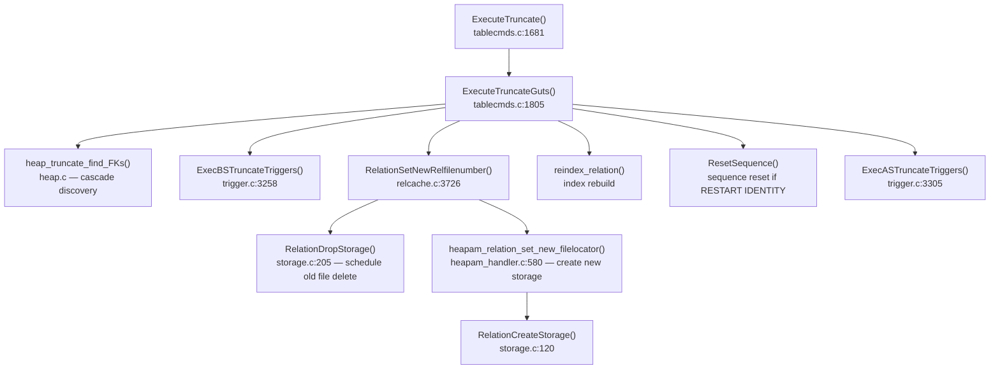
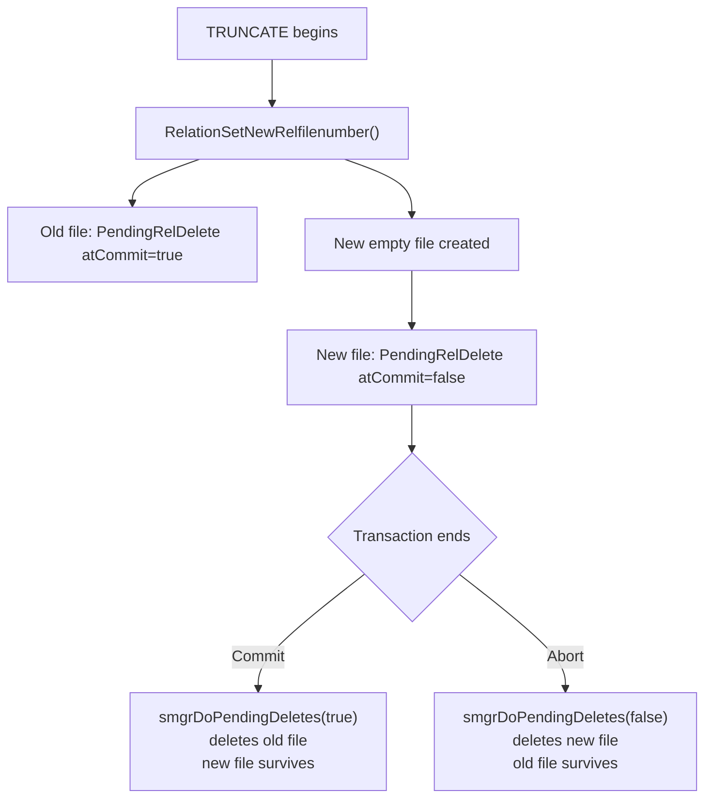

# TRUNCATE Code Path

`TRUNCATE` removes all rows from one or more tables by replacing each table's physical storage files with new empty ones. It never touches individual tuples. There are no dead-tuple versions to clean up, no MVCC bookkeeping per row, and no sequential scan of the heap. For large tables this is orders of magnitude faster than `DELETE FROM t` and produces zero table bloat.

The tradeoff is that `TRUNCATE` is a statement-level operation that cannot be made predicated: it removes everything or nothing. It also requires `AccessExclusiveLock`, which blocks all other access to each relation for the duration of the statement.

`DELETE` marks each tuple's `t_xmax` field with the deleting transaction's XID and leaves the tuple on disk. The page-level data survives until VACUUM reclaims it. Every backend that was running at the time of the `DELETE` may still see those rows through MVCC snapshot rules. The disk space is not recovered until [[subsystems/background/autovacuum|autovacuum]] or a manual `VACUUM` runs.

`TRUNCATE` sidesteps all of that. Instead of touching existing pages it allocates a brand-new relfilenumber for the relation and schedules the old file for deletion at commit. No per-row MVCC work occurs at all. The old storage disappears atomically when the transaction commits; if the transaction aborts, PostgreSQL keeps the old storage and deletes the new (empty) file instead.

This also means `TRUNCATE` interacts differently with concurrent transactions. A snapshot taken before the `TRUNCATE` commits still sees the old data — but once the transaction commits, the files backing those pages are gone. Any backend that still has a snapshot open from before the truncation and tries to scan the heap will hit an already-deleted file. This is safe in practice: `TRUNCATE` holds `AccessExclusiveLock` until it commits, so no other backend can be scanning the heap concurrently.

## Call hierarchy

## Lock acquisition and relation resolution

The utility command dispatcher calls `ExecuteTruncate()` (`src/backend/commands/tablecmds.c`) directly; it is the entry point for `TRUNCATE`. Its responsibility is to resolve table names to `Relation` objects and acquire locks before any work begins.

Each relation named in the statement receives `AccessExclusiveLock` before it is opened, preventing any concurrent reader or writer from slipping in between name resolution and the actual truncation. When the statement targets a partitioned table without `ONLY`, `find_all_inheritors()` collects all leaf partitions, and each also receives `AccessExclusiveLock`. All locks last until the transaction ends.

Partitioned tables (`RELKIND_PARTITIONED_TABLE`) have no storage of their own, so the truncation loop silently skips them. Only leaf partitions with actual heap files get truncated.

## Foreign key handling and cascade

`ExecuteTruncateGuts()` in `src/backend/commands/tablecmds.c` is the shared implementation used by both the `TRUNCATE` command and logical replication subscribers that replay a replicated `TRUNCATE`.

Because `TRUNCATE` skips per-row foreign key checks entirely, it must account for FK relationships at the statement level. In `CASCADE` mode, `heap_truncate_find_FKs()` searches `pg_constraint` for foreign key constraints that reference any relation already in the truncation set. `heap_truncate_find_FKs()` opens each newly discovered referencing relation with `AccessExclusiveLock` and adds it to the working set. The loop repeats until no new relations are found. This handles chains of FK references that span several tables.

In `RESTRICT` mode (the default), `heap_truncate_check_FKs()` raises an error if any FK from outside the truncation set points into it. The statement must either pull in all referencing tables (`CASCADE`) or refuse the operation.

## BEFORE TRUNCATE triggers

Before any storage modification, each relation's `BEFORE TRUNCATE FOR EACH STATEMENT` triggers fire via `ExecBSTruncateTriggers()` (`src/backend/commands/trigger.c`, line 3258). TRUNCATE triggers are always statement-level; PostgreSQL explicitly disallows `FOR EACH ROW` TRUNCATE triggers. A BEFORE trigger cannot suppress the truncation (returning a value from a BEFORE STATEMENT trigger is an error).

## Choosing between the fast path and the transactional file-swap

Not every truncation needs the full file-swap mechanism. If the relation was created or had its relfilenumber changed in the current subtransaction (`rel->rd_createSubid == mySubid || rel->rd_newRelfilelocatorSubid == mySubid`), rollback will discard the old storage anyway. In that case `heap_truncate_one_rel()` performs an immediate, non-rollbackable in-place truncation via `RelationTruncate(rel, 0)`.

`heap_truncate()` in `src/backend/catalog/heap.c` also uses this fast path; it handles `ON COMMIT DELETE ROWS` truncation of temporary tables at transaction end.

## Transactional file-swap

For relations that pre-date the current subtransaction, the core operation is `RelationSetNewRelfilenumber()` (`src/backend/utils/cache/relcache.c`, line 3726). It allocates a new relfilenumber from the tablespace via `GetNewRelFileNumber()`. `RelationDropStorage()` registers the old physical file for deletion at commit by appending a `PendingRelDelete` entry with `atCommit = true` to the `pendingDeletes` list (`src/backend/catalog/storage.c`, line 205). `heapam_relation_set_new_filelocator()` then creates new empty storage for the new relfilenumber; it calls `RelationCreateStorage()` to create the main fork and — for unlogged tables — the init fork. This registers the new file for deletion at abort with a second `PendingRelDelete` entry with `atCommit = false`. Finally, `RelationSetNewRelfilenumber()` updates `pg_class.relfilenode` to point to the new relfilenumber.

At this point the relation's catalog entry already points to the empty new file, but both the old and new physical files are still on disk. The old file stays alive until commit so that a concurrent abort can restore the original state.

### [[subsystems/storage/toast|TOAST]] table truncation

PostgreSQL also truncates the TOAST table immediately after truncating the heap, if `rel->rd_rel->reltoastrelid` is non-zero. It receives the same transactional file-swap via `RelationSetNewRelfilenumber()`: this queues its old file for deletion at commit, and a new empty file takes its place.

### Index truncation

After `RelationSetNewRelfilenumber()` assigns new relfilenumbers to the heap (and its TOAST table), `ExecuteTruncateGuts()` calls `reindex_relation()` with `REINDEX_REL_PROCESS_TOAST` to rebuild all indexes from scratch. An empty heap requires empty indexes, not the old indexes full of pointers into the defunct pages.

For the non-transactional path via `heap_truncate_one_rel()`, `RelationTruncateIndexes()` in `src/backend/catalog/heap.c` handles this directly: it physically zeroes out each index file via `RelationTruncate(currentIndex, 0)`, then reinitialises it with `index_build()`.

## Physical file truncation

When a relation needs to be physically reduced in size — to zero blocks for a truncate-to-empty, or to a smaller block count for a partial truncation — `RelationTruncate()` in `src/backend/catalog/storage.c` operates on all three forks simultaneously. The MAIN fork holds the actual heap or index data pages. If a Free Space Map exists, `FreeSpaceMapPrepareTruncateRel()` computes the new FSM size. If a Visibility Map exists, `visibilitymap_prepare_truncate()` does the same for the VM fork.

A concurrent checkpoint must not overtake truncation, so the function sets `DELAY_CHKPT_START | DELAY_CHKPT_COMPLETE` on the process before entering a critical section. Inside that section it WAL-logs an `XLOG_SMGR_TRUNCATE` record and then calls `smgrtruncate2()`. `RelationTruncate()` flushes the WAL record before the actual disk truncation, so that crash recovery can replay it correctly.

`smgrtruncate2()` in `src/backend/storage/smgr/smgr.c` (line 681) first evicts — without writing — any shared buffer pages belonging to the about-to-be-removed blocks via `DropRelationBuffers()`. It then sends a `CacheInvalidateSmgr()` sinval message to force other backends to close their smgr handles, and finally invokes the storage manager's `smgr_truncate` callback, which for the standard `md` (magnetic disk) layer calls `mdtruncate()` to truncate the OS file.

After the critical section, `FreeSpaceMapVacuumRange()` repairs any upper-level FSM pages that referred to the truncated range.

## FSM and visibility map

Because `TRUNCATE` replaces storage entirely rather than modifying individual pages, the old FSM and VM files disappear along with the old heap file. The new empty relation starts with no FSM and no VM. PostgreSQL creates the FSM file lazily, the first time the table needs a free-space entry. It likewise creates the VM file lazily, as VACUUM processes pages.

For the non-transactional path (`RelationTruncate(rel, 0)`), `smgrtruncate2()` truncates existing FSM and VM forks to zero length rather than deleting them. The effect is the same: no stale entries for pages that no longer exist.

## Transaction safety: the pending-delete mechanism

The `pendingDeletes` linked list in `src/backend/catalog/storage.c` is what makes `TRUNCATE` transactional at no extra cost.

Each `PendingRelDelete` entry records a relfilenumber and a flag (`atCommit`). At transaction end:

- **On commit**: the commit path calls `smgrDoPendingDeletes(true)`. It deletes entries where `atCommit = true` — these are the old files that were replaced by new ones. It discards entries with `atCommit = false` (the new files, which should have been kept) without action.
- **On abort**: the abort path calls `smgrDoPendingDeletes(false)`. It deletes entries where `atCommit = false` — these are the new empty files that should never have been created. PostgreSQL leaves the old files with `atCommit = true` alone, effectively restoring the table to its pre-TRUNCATE state.

For subtransactions, `AtSubCommit_smgr()` reassigns pending-delete entries to the parent transaction level, and `AtSubAbort_smgr()` calls `smgrDoPendingDeletes(false)` immediately to undo the subtransaction's storage changes.

Rolling back a `TRUNCATE` is therefore identical in cost to rolling back any other DDL: no heap scan, no undo log, no tuple reinsertion. The old file simply was never deleted.

## RESTART IDENTITY

When the statement specifies `TRUNCATE ... RESTART IDENTITY`, `ExecuteTruncateGuts()` calls `getOwnedSequences()` for each relation to find all `SERIAL`/`GENERATED` sequences owned by columns of that table. `ExecuteTruncateGuts()` opens each sequence with `AccessExclusiveLock` and collects its OID. After the physical truncation completes, `ExecuteTruncateGuts()` calls `ResetSequence()` for each sequence to reset it to its starting value. Sequence reset happens after truncation, so that a failed truncation (e.g. a BEFORE trigger raising an error) does not reset the sequences.

## AFTER TRUNCATE triggers

After `ExecuteTruncateGuts()` finishes all storage work and sequence resets, `ExecASTruncateTriggers()` queues `AFTER TRUNCATE FOR EACH STATEMENT` trigger events via `AfterTriggerSaveEvent()`. `AfterTriggerEndQuery()` fires the queued events; it runs at the end of `ExecuteTruncateGuts()`. AFTER triggers fire after the data is gone; they cannot observe the truncated rows.

## WAL logging for logical decoding

`TRUNCATE` does not need physical WAL logging of individual page changes, because it simply replaces the old files. When `wal_level >= logical`, however, `ExecuteTruncateGuts()` writes a single `XLOG_HEAP_TRUNCATE` record containing the list of relation OIDs, the `CASCADE` flag, and the `RESTART_SEQS` flag. This record is what allows logical decoding to replicate the `TRUNCATE` to subscribers.

## TRUNCATE vs DELETE vs DROP TABLE

| Aspect | TRUNCATE | DELETE | DROP TABLE |
|---|---|---|---|
| Removes rows | All rows, unconditionally | Rows matching WHERE clause | All rows (table removed) |
| Per-row work | None | Yes — marks each t_xmax | None |
| MVCC dead tuples | No | Yes — until VACUUM | No |
| Lock mode | AccessExclusiveLock | RowExclusiveLock (per-row) | AccessExclusiveLock |
| WHERE clause | Not supported | Supported | N/A |
| Triggers | STATEMENT-level TRUNCATE triggers only | ROW and STATEMENT DELETE triggers | None |
| Indexes | Rebuilt empty | Updated per row | Dropped |
| TOAST | Replaced with empty storage | Rows deleted individually | Dropped |
| Sequences | Optional RESTART IDENTITY | Not affected | Not affected |
| Transaction-safe | Yes (file-swap mechanism) | Yes (MVCC) | Yes |
| Rollback cost | Free (old file kept) | Expensive for large tables | Free (new files deleted) |
| Post-operation bloat | None | Dead tuples until VACUUM | N/A |
| Disk space freed | At commit | Not until VACUUM | At commit |

## See also

- [[code-paths/delete]] — per-tuple deletion and t_xmax mechanics
- [[code-paths/vacuum]] — how VACUUM reclaims dead tuples left by DELETE
- [[subsystems/storage/heap]] — heap page layout; tuple header fields
- [[subsystems/storage/fsm]] — Free Space Map structure and maintenance
- [[subsystems/storage/visibility-map]] — Visibility Map and its role in VACUUM
