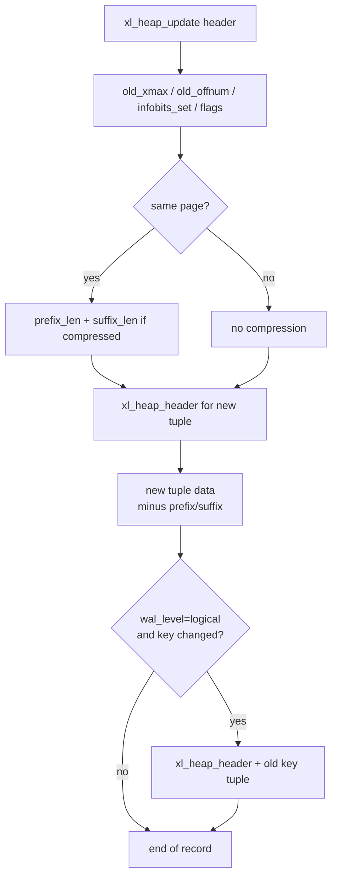

# UPDATE Code Path

An `UPDATE` in PostgreSQL is not an in-place modification. It writes a new tuple version and marks the old one as deleted by setting its `t_xmax`. This approach — creating a new version rather than overwriting — is fundamental to MVCC: readers holding older snapshots continue to see the old version, while readers with newer snapshots see the new one.

## Plan shape

The root plan node for `UPDATE` is `ModifyTable` (operation=UPDATE). Its subplan produces one row per row to be updated, containing both the new column values and a `ctid` junk column identifying the old tuple to replace.

For a `SELECT ... FOR UPDATE` that feeds a subsequent update in the same transaction, the plan may include a `LockRows` node between the scan and the `ModifyTable` node. This is not the normal case for a plain `UPDATE` statement — see the section on locking below.

## Trigger call sequence

Triggers fire at well-defined points around each heap write. The exact call sequence is:

1. **BEFORE STATEMENT** — fired once before any rows are processed, inside `ExecModifyTable()`.
2. **BEFORE ROW** — fired per row inside `ExecUpdatePrologue()` via `ExecBRUpdateTriggers()`. A trigger may modify the new row values or return NULL to skip the update entirely. The row that exits this stage is what gets written to the heap.
3. **AFTER ROW** — queued per row inside `ExecUpdateEpilogue()` via `ExecARUpdateTriggers()`. These fire after the heap write and index updates for that row, but deferred-mode triggers may batch until statement end.
4. **AFTER STATEMENT** — fired once after all rows, deferred until `ExecutorFinish()`.

| Point | Type | Function |
|---|---|---|
| Before first row | BEFORE STATEMENT | `ExecModifyTable()` |
| Before each row | BEFORE ROW | `ExecBRUpdateTriggers()` |
| After each row | AFTER ROW | `ExecARUpdateTriggers()` |
| After all rows | AFTER STATEMENT | `ExecutorFinish()` |

One subtlety applies when a BEFORE ROW trigger is present. Because the trigger may change any column, PostgreSQL cannot narrow the set of generated columns needing recomputation down from the query's update target list. `ExecInitStoredGenerated()` detects this. Whenever a BEFORE ROW trigger exists, it forces recomputation of all stored generated columns depending on any updated column (nodeModifyTable.c).

## Generated columns

`ExecComputeStoredGenerated()` computes stored generated columns; `ExecUpdatePrepareSlot()` calls it immediately before the heap write. `ExecInitStoredGenerated()` prepares the generation expressions during executor initialization; it walks the tuple descriptor looking for attributes with `attgenerated == ATTRIBUTE_GENERATED_STORED`.

For UPDATE, a useful optimization applies: if no BEFORE ROW trigger exists, `ExecInitStoredGenerated()` compares each generated column's expression dependencies against the set of columns being updated (`ExecGetUpdatedCols()`). `ExecComputeStoredGenerated()` can skip a generated column entirely when its expression references no updated column — its value carries forward unchanged from the existing tuple. The planner places a NULL placeholder in the target list for generated columns; `ExecComputeStoredGenerated()` overwrites those placeholders with the computed values before the slot reaches the heap layer (nodeModifyTable.c).

When a cross-partition update occurs (the row moves to a different partition), `ExecUpdateAct()` recomputes generated columns for the destination partition at the `lreplace:` label. Different partitions may have different generation expressions.

## Constraint checking

Constraint evaluation in UPDATE has two distinct layers.

`ExecConstraints()` handles traditional NOT NULL and CHECK constraints. `ExecUpdateAct()` calls it after preparing the new slot. `ExecConstraints()` checks NOT NULL by iterating over all non-null attributes in the tuple descriptor and testing `slot_attisnull()`. It evaluates CHECK constraints as expression trees, treating NULL as a pass (following SQL semantics). `ExecUpdateAct()` does *not* check the partition constraint here — `ExecPartitionCheck()` handles it separately, earlier in `ExecUpdateAct()` (execMain.c, nodeModifyTable.c).

An important optimization: `ExecUpdateAct()` only calls `ExecConstraints()` when `rd_att->constr` is non-NULL. PostgreSQL skips the call if the table has no constraints at all. However, there is no mechanism at the UPDATE level to skip checking constraints on columns that were not modified — `ExecConstraints()` always checks the full tuple. This is conservative but safe; the existing values of unmodified columns are already known to be valid, so the check is redundant but not harmful.

`ExecWithCheckOptions()` checks WITH CHECK OPTION constraints from parent views separately. It runs both inside `ExecUpdateAct()` (for RLS update-check policies) and again at the end of `ExecUpdateEpilogue()` (for view check options), after all index updates are applied (nodeModifyTable.c).

## Writing the new tuple and marking the old one

`heap_update()` (heapam.c) performs the actual heap work. It locks the old tuple's page exclusively, and `HeapTupleSatisfiesUpdate()` confirms that the tuple is still the current version and not held by a conflicting lock. If another transaction is in the middle of modifying the same tuple (`TM_BeingModified`), the backend waits for that transaction to commit or abort before proceeding.

Inside the critical section, the sequence is:

1. `RelationPutHeapTuple()` physically inserts the new tuple on the target page.
2. `heap_update()` clears the old tuple's `t_infomask` bits related to `t_xmax` (`HEAP_XMAX_BITS | HEAP_MOVED`), then writes the new `xmax_old_tuple` value and infomask.
3. `HeapTupleHeaderSetCmax()` records the command ID on the old tuple.
4. `heap_update()` sets `oldtup.t_data->t_ctid` to the new tuple's TID.
5. `heap_update()` clears the [[subsystems/storage/visibility-map|visibility map]] for the old page (and new page if different).
6. `heap_update()` marks both pages dirty and writes a WAL record.

After the critical section, `heap_update()` records the lock mode used in `*update_indexes`, which tells the caller which index entries need to be updated.

## Infomask transitions

Understanding what changes in the tuple headers is essential for reasoning about visibility.

**Old tuple** after `heap_update()` commits:
- `t_xmax` = the updating transaction's XID (or a MultiXactId if other transactions have row locks).
- `HEAP_XMAX_COMMITTED` is not set immediately; it is set as a hint the next time any backend visits the tuple and finds the XID committed.
- `HEAP_XMAX_INVALID` is cleared.
- `HEAP_UPDATED` is not set on the old tuple; it is set on the *new* tuple.
- `t_ctid` points to the new tuple's physical location.

**New tuple** immediately after insertion:
- `t_xmin` = the updating transaction's XID.
- `HEAP_XMIN_COMMITTED` is not set; it becomes a hint once the transaction commits and a backend notices.
- `t_xmax` = 0 (or a pre-existing row-lock XID carried forward from the old tuple, if applicable).
- `HEAP_XMAX_INVALID` is set, marking `t_xmax` as not a real deleter.
- `HEAP_UPDATED` is set, indicating this is a replacement tuple, not a freshly inserted one.
- `t_ctid` points to itself.

The `compute_new_xmax_infomask()` function handles the case where the old tuple already has row lockers in its `t_xmax`. If those lockers are still active (e.g., key-share lockers on a non-key update), `compute_new_xmax_infomask()` preserves them on the new tuple using a MultiXact. Key-column updates use `LockTupleExclusive` mode; non-key updates use `LockTupleNoKeyExclusive`, which allows coexistence with key-share locks (heapam.c).

## HOT updates

When an update changes only columns outside any index, and the new tuple fits on the same page as the old one, PostgreSQL can avoid writing new index entries entirely. This optimization — Heap Only Tuple (HOT) — works because index entries already point to the original tuple, and a chain of `t_ctid` pointers links old versions to new ones on the same page. An index scan follows this chain automatically, so no new index entry is required.

### What makes a column "indexed" for HOT purposes

The relevant bitmap is `hot_attrs`, populated before the buffer lock is acquired by:

```c
hot_attrs = RelationGetIndexAttrBitmap(relation, INDEX_ATTR_BITMAP_HOT_BLOCKING);
```

This bitmap includes every column that appears in any index on the relation — ordinary B-tree indexes, expression indexes (which track column dependencies), partial indexes (which track columns in the WHERE clause), and functional indexes. PostgreSQL includes columns referenced only in an index predicate, because changing such a column might remove the tuple from the partial index's coverage.

Additionally, `heap_update()` computes `modified_attrs` by calling `HeapDetermineColumnsInfo()`, which performs a value-level comparison of the old and new tuples restricted to `interesting_attrs`. This means `HeapDetermineColumnsInfo()` does not count a column as modified for HOT purposes if it is nominally in the SET list but its value did not actually change.

`heap_update()` makes the HOT decision only after it determines the new tuple's page:

```c
if (newbuf == buffer)
{
    if (!bms_overlap(modified_attrs, hot_attrs))
        use_hot_update = true;
    ...
}
```

If the new tuple does not fit on the same page — possible even for small tuples on a sufficiently full page — HOT is impossible regardless of which columns changed. `heap_update()` calls `PageSetFull()` on the old page as a hint for future vacuuming. The table's [[subsystems/storage/fillfactor|fillfactor]] directly influences HOT eligibility: a fillfactor below 100 reserves free space on each heap page specifically to accommodate HOT updates without forcing cross-page moves.

`heap_update()` handles **summarized indexes** (such as BRIN) separately. Even when HOT applies, a modified column covered by a summarized index changes the outcome. If any modified column belongs to a summarized index (`bms_overlap(modified_attrs, sum_attrs)`), the function returns `TU_Summarizing` rather than `TU_None`. This prompts the caller to update those indexes while still skipping B-tree index maintenance.

When HOT applies, `HeapTupleSetHotUpdated()` marks the old tuple with `HEAP_HOT_UPDATED` and `HeapTupleSetHeapOnly()` marks the new one with `HEAP_ONLY_TUPLE` in `t_infomask2`. VACUUM can reclaim HOT chain members page-locally without touching indexes, making HOT updates substantially cheaper to vacuum than ordinary updates.

## Partition routing on UPDATE

When the target table is partitioned, an update may change a partition key column. The new row may then no longer satisfy the current partition's constraint. The executor detects this via `ExecPartitionCheck()` inside `ExecUpdateAct()`. If the partition constraint fails, the row must move.

`ExecCrossPartitionUpdate()` (nodeModifyTable.c) handles row movement. The mechanism is a logical DELETE on the source partition followed by an INSERT routed through the partition tree root. The insert uses `ExecPrepareTupleRouting()` to determine the destination partition and convert the tuple to that partition's column layout if needed.

Cross-partition updates have several notable constraints:
- `INSERT ON CONFLICT DO UPDATE` cannot trigger a cross-partition update. The semantics of which partition "owns" the conflicting tuple would become ambiguous.
- When run directly on a leaf partition (not through the root), they fail with a partition constraint violation.
- `ExecCrossPartitionUpdateForeignKey()` fires AFTER ROW UPDATE triggers on the root partitioned table, rather than the normal epilogue path, to ensure foreign key checks see the operation as an UPDATE rather than a DELETE+INSERT pair.
- PostgreSQL projects the RETURNING clause, if present, from the INSERT result, not the DELETE result (nodeModifyTable.c).

A successful partition move sets the `UpdateContext.crossPartUpdate` flag to true. `ExecUpdate()` detects this and returns `context->cpUpdateReturningSlot` directly, skipping the normal RETURNING projection that would apply to an in-place update.

## RETURNING clause

When an `UPDATE ... RETURNING` is present, PostgreSQL evaluates the projection on the *new* tuple after the heap write. `ExecUpdate()` calls `ExecProcessReturning()` at the very end, after `ExecUpdateEpilogue()` completes (after index updates and AFTER ROW triggers). The `tupleSlot` passed to it holds the new version of the tuple; `planSlot` provides access to junk columns and values from join relations that may appear in the RETURNING expressions (nodeModifyTable.c).

Because `ExecProcessReturning()` reinitializes `tts_tableOid` from the result relation before evaluating expressions, RETURNING expressions can safely reference the `tableoid` system column even when routing through partitions.

When a RETURNING clause is present, `ExecModifyTable()` must return one tuple at a time, and the caller must invoke it again to process the next row. Without RETURNING, the entire update loop runs inside a single call.

**PostgreSQL 18:** `RETURNING` accepts `OLD` and `NEW` aliases — `OLD.*` refers to the row before the update, `NEW.*` to the row after. Both old and new column values are available in the same result row, making it straightforward to compute deltas or audit changes without a separate `SELECT` before the update.

## Handling concurrent updates with EvalPlanQual

When two transactions attempt to update the same row, the second cannot simply overwrite the first's changes without re-checking whether the row still qualifies. PostgreSQL uses **EvalPlanQual (EPQ)** to handle this correctly: if `table_tuple_update()` returns `TM_Updated` — meaning another transaction modified the row after it was read but before the update was attempted — the executor fetches the latest committed version of that row and re-runs the plan's join and filter conditions against it (`EvalPlanQual()`, nodeModifyTable.c).

If the row still satisfies the WHERE clause and join conditions, EPQ reprojects the new column values from the updated row and retries the write via `goto redo_act`. If the row no longer qualifies — for example, a concurrent update moved it outside the predicate — PostgreSQL silently skips the update. Fetching the latest committed version uses `table_tuple_lock()` with `TUPLE_LOCK_FLAG_FIND_LAST_VERSION`, which follows the `t_ctid` chain to the end regardless of how many intervening versions exist.

At `REPEATABLE READ` and `SERIALIZABLE` isolation, PostgreSQL does not use EPQ. Instead, a `TM_Updated` result from `table_tuple_update()` immediately raises a serialization failure error, since those isolation levels prohibit reading data modified by another concurrent transaction (nodeModifyTable.c).

## Locking: when LockRows precedes UPDATE

A plain `UPDATE` statement does not use a `LockRows` executor node — the `ModifyTable` node obtains the tuple lock it needs as part of `heap_update()` itself. However, a `SELECT ... FOR UPDATE` or `SELECT ... FOR SHARE` does insert a `LockRows` node (`ExecLockRows()`, nodeLockRows.c) that calls `table_tuple_lock()` for each row during the scan.

This matters for UPDATE plans that involve joins or cursors. The outer side of a join may reference rows that a concurrent transaction could delete or update. If that happens before the `ModifyTable` node reaches them, the planner inserts a `LockRows` node to pin those rows. Locking them early prevents the join from producing a result row that becomes stale between scan time and write time. EPQ would otherwise need to bridge that gap.

The lock mode used depends on whether key columns are involved. A non-key update acquires `LockTupleNoKeyExclusive`, which is compatible with `FOR KEY SHARE` locks. A key-column update acquires `LockTupleExclusive`. This distinction matters for foreign key checks: `RI_FKey_check` uses `FOR KEY SHARE` to assert that key values remain stable, and that lock is compatible with an ongoing non-key update on the same row.

## WAL: xl_heap_update record format

Every heap update on a WAL-logged relation records an `xl_heap_update` entry (heapam_xlog.h). The record distinguishes HOT from non-HOT via the WAL record type: `XLOG_HEAP_HOT_UPDATE` versus `XLOG_HEAP_UPDATE`. Redo applies identically for both; only recovery tooling and monitoring treat them differently.

The `xl_heap_update` struct contains:
- `old_xmax` — the XID written into the old tuple's `t_xmax`.
- `old_offnum` — offset of the old tuple on its page.
- `old_infobits_set` — a compact encoding of the important infomask bits on the old tuple, allowing redo to reconstruct visibility state without storing the full infomask.
- `new_xmax` — the XID written into the new tuple's `t_xmax` (non-zero if lockers are inherited).
- `new_offnum` — offset of the new tuple.
- `flags` — a bitmask that encodes whether the old/new pages were all-visible, whether the new tuple data is included verbatim, and whether prefix/suffix compression was applied.

When the old and new tuples are on the same page and logical decoding is not required, `log_heap_update()` applies prefix-suffix compression: it records only the changed bytes in the middle of the tuple body, encoding the lengths of the unchanged prefix and suffix. This can significantly reduce WAL volume for updates that change a single narrow column near the middle of a wide row. PostgreSQL disables the compression when `wal_level = logical`. Logical decoding requires the full new tuple to be available in the WAL record.

For logical replication, when `wal_level >= logical`, `log_heap_update()` appends the `old_key_tuple` (the replica identity of the old row) after the main record. If the replica identity is `FULL`, it logs the entire old tuple (`XLH_UPDATE_CONTAINS_OLD_TUPLE`); otherwise it logs only the identity key columns (`XLH_UPDATE_CONTAINS_OLD_KEY`).



## Visibility map and page maintenance

If the page was previously marked all-visible in the visibility map, `heap_update()` clears that bit — the page now contains a tuple version that is not yet visible to all transactions. `visibilitymap_clear()` clears both the all-visible and all-frozen bits together, with `VISIBILITYMAP_VALID_BITS`. `heap_update()` records this clearing in the WAL flags (`XLH_UPDATE_OLD_ALL_VISIBLE_CLEARED`, `XLH_UPDATE_NEW_ALL_VISIBLE_CLEARED`), so redo can replicate it on standbys.

## MVCC after update

After `heap_update()`, two versions of the row coexist on disk:

- **Old version**: `t_xmax` = updating XID, `HEAP_XMAX_INVALID` cleared. Visible only to snapshots taken before the current transaction commits.
- **New version**: `t_xmin` = updating XID, `t_xmax` = 0, `HEAP_XMAX_INVALID` set, `HEAP_UPDATED` set. Visible to the updating transaction (modulo command IDs) and to snapshots taken after it commits.

Both versions exist until VACUUM reclaims the old one. For HOT chains, VACUUM can reclaim old members without touching index entries, by redirecting the index's item pointer to point to the newest live version in the chain.

## See also

- [[subsystems/storage/heap]] — HOT chain mechanics and tuple header layout
- [[subsystems/transactions/mvcc]] — how old and new versions interact with snapshots
- [[code-paths/insert]] — heap_insert for comparison (no old version to mark)
- [[code-paths/delete]] — only marks old tuple; no new version written
- [[subsystems/planner/overview]] — how ModifyTable fits into the overall plan tree
