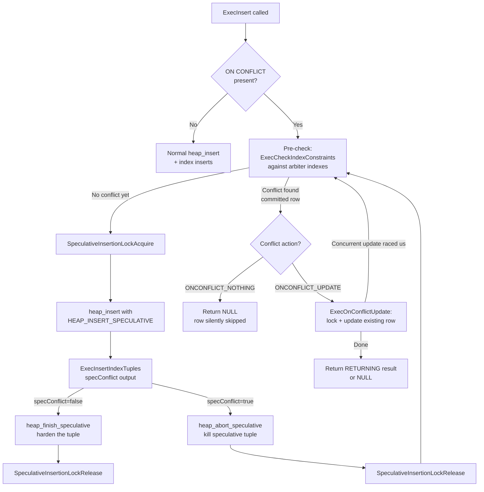

`INSERT ... ON CONFLICT` — commonly called "upsert" — lets a single statement insert a row or, when a matching row already exists, either silently skip it or update it in place. It is a cornerstone of idempotent write patterns: a race-safe replacement for the "SELECT then INSERT" sequences that require explicit locking to be correct under concurrency.

The feature rests on a mechanism called *speculative insertion*: PostgreSQL tentatively writes the incoming tuple to the heap before it knows whether a conflict exists, then either hardens the tuple (no conflict) or abandons it and routes to the conflict action (conflict found). This design avoids holding row-level locks during the conflict check and prevents a class of deadlocks that would otherwise arise under concurrent inserts to the same key.

## Syntax and the Conflict Target

```sql
-- Ignore the incoming row if a conflict occurs on any unique constraint
INSERT INTO t (col1, col2) VALUES ($1, $2)
ON CONFLICT DO NOTHING;

-- Ignore only if a specific index is the arbiter
INSERT INTO t (col1, col2) VALUES ($1, $2)
ON CONFLICT (col1) DO NOTHING;

-- Update the existing row when a conflict occurs
INSERT INTO t (col1, col2) VALUES ($1, $2)
ON CONFLICT (col1) DO UPDATE
    SET col2 = EXCLUDED.col2
    WHERE t.col2 IS DISTINCT FROM EXCLUDED.col2;

-- Use a named constraint as the arbiter
INSERT INTO t (col1, col2) VALUES ($1, $2)
ON CONFLICT ON CONSTRAINT t_col1_key DO UPDATE
    SET col2 = EXCLUDED.col2;
```

The `ON CONFLICT` clause takes an optional *conflict target*. This identifies which uniqueness constraint acts as the arbiter, the gatekeeper that decides whether an incoming row conflicts.

Three forms are accepted:

- **Column list** — `(col_a, col_b)` — must exactly match a `UNIQUE` or `PRIMARY KEY` index covering those columns, including expression indexes and partial index predicates.
- **Constraint name** — `ON CONFLICT ON CONSTRAINT name` — directly names the constraint whose backing index becomes the arbiter.
- **No target** — only legal with `DO NOTHING`; every unique constraint on the table is treated as a potential arbiter.

The planner validates the conflict target and records the matching arbiter index OID(s) at plan time. If the planner cannot find a suitable unique index for a column-list target, planning fails with an error rather than silently falling back.

## Arbiter Index Inference

Before the executor ever runs, the planner resolves the conflict target into a set of arbiter index OIDs stored in the `ModifyTable` plan node. The inference matches the user-supplied column list against every non-deferrable unique index on the target relation. A match requires:

- Every column in the conflict target appears in the index, and no extra index columns exist (exact coverage).
- For expression indexes, the expression trees must be structurally identical.
- For partial indexes, the partial predicate in the `ON CONFLICT` clause must logically imply the index predicate — checked via `predicate_implied_by`.
- Only `UNIQUE` and `PRIMARY KEY` indexes qualify. Exclusion constraints are never eligible arbiters (see Limitations).
- nodeModifyTable.c explicitly rejects deferrable unique constraints at execution time by checking `indimmediate`. A deferred constraint's violation check happens at end of transaction, which is incompatible with the per-row conflict resolution upsert requires.

The resolved OIDs flow from `ResultRelInfo.ri_onConflictArbiterIndexes` into `ExecCheckIndexConstraints` at execution time. When `DO NOTHING` omits a conflict target, the arbiter list is empty, and PostgreSQL checks all unique indexes.

## Speculative Insertion: The Core Mechanism

The fundamental challenge of upsert is detecting a uniqueness conflict without creating a race window. A naïve approach — check for an existing row, then insert if none found — has an unavoidable gap where another session can insert the same key between the two steps. PostgreSQL closes this window with speculative insertion.

The key insight is to write the new tuple into the heap *before* checking for conflicts, but mark it as provisional so that concurrent sessions can recognise it as tentative. The mechanism works in three phases.

### Acquiring the Speculative Lock

Before writing anything, the inserting backend calls `SpeculativeInsertionLockAcquire` (lmgr.c) to take an exclusive lock on a tag keyed by `(transaction_id, token)`, where the token is a per-backend monotonically increasing counter. This lock acts as a rendezvous point: any concurrent session that sees the speculative tuple in an index scan and needs to wait for its fate can block on this lock specifically, rather than waiting for the entire transaction to complete or abort.

### The Tentative Heap Write

`heap_insert` inserts the tuple with the `HEAP_INSERT_SPECULATIVE` flag (heapam.c). `heap_insert` encodes the provisional marker in the tuple header's `t_ctid` field: rather than holding a self-pointing TID (the normal state for a freshly inserted tuple), `t_ctid` holds the speculative token value in the block-number half, with the offset number set to the sentinel constant `SpecTokenOffsetNumber`. The macro `HeapTupleHeaderIsSpeculative` (htup_details.h) detects this state by checking that offset number against the sentinel. `t_ctid` is overloaded this way. Code that would normally follow an update chain via `t_ctid` must first rule out the speculative case.

`ExecInsertIndexTuples` (execIndexing.c) inserts index entries immediately after the heap write, because the conflict check works by scanning those indexes.

### Conflict Check and Resolution

`ExecCheckIndexConstraints` scans the arbiter indexes using a *dirty snapshot* (`SnapshotDirty`), which sees tuples regardless of their inserting transaction's commit status — including rows inserted by in-progress transactions and by other speculative inserters.

When the dirty snapshot sees an in-progress tuple, it records the inserting (`xmin`) or deleting (`xmax`) transaction ID. The code then decides whether to wait. If the in-progress tuple carries a speculative token, `SpeculativeInsertionWait` (lmgr.c) blocks by acquiring a shared lock on that backend's speculative insertion lock tag, then immediately releases it — effectively waiting until the other backend calls `SpeculativeInsertionLockRelease`. At that point, the other backend has either hardened its tuple into an ordinary committed tuple or killed it, and the index scan restarts.

If the scan finds no conflict, `table_tuple_complete_speculative` calls down to `heap_finish_speculative` (heapam.c), which overwrites `t_ctid` with the tuple's real TID — a self-pointer — making it an ordinary tuple. The WAL record written here (`XLOG_HEAP_CONFIRM`) ensures standbys and logical replication consumers see the correct final state. `heap_finish_speculative` then releases the speculative lock via `SpeculativeInsertionLockRelease`, waking any waiters.

If the scan finds a conflict, `table_tuple_complete_speculative` calls `heap_abort_speculative` instead. This sets `t_xmin` to `InvalidTransactionId` directly in the tuple header, making the tuple immediately dead to all transactions including the inserting one. Waiters that wake up after this observe a dead tuple and proceed as if it never existed. `heap_abort_speculative` marks the killed tuple as a pruning candidate on the page (`PageSetPrunable`), making it eligible for reclamation without waiting for the inserting transaction to end.



### The Pre-Check Optimisation

Before acquiring the speculative lock, `ExecInsert` performs a preliminary call to `ExecCheckIndexConstraints` without holding any lock (nodeModifyTable.c, label `vlock`). This pre-check catches the common case of a conflict against an already-committed row early, saving the cost of writing and then immediately aborting a speculative tuple. The pre-check is not atomic — a concurrent insert can still win the race after it passes — but the full speculative write plus index scan loop that follows is the authoritative conflict check.

The code loops back to `vlock` whenever the speculative index scan detects a conflict. It also loops back when `ExecOnConflictUpdate` reports that the target row was concurrently modified (`TM_Updated` or `TM_Deleted`). The loop calls `CHECK_FOR_INTERRUPTS()` at the top, to handle the theoretical case of a bug causing infinite retries.

### Livelock Prevention in the Conflict Loop

Two backends racing to insert the same key face a subtle livelock risk. If both write speculative tuples and both immediately abort on seeing the other's tuple, they will both retry and conflict again indefinitely. PostgreSQL resolves this with an asymmetric wait rule implemented through the `CEOUC_LIVELOCK_PREVENTING_WAIT` mode in execIndexing.c.

When the dirty snapshot reveals a speculative tuple from another transaction, the waiting decision depends on transaction ID ordering: only the backend with the *lower* XID waits; the backend with the higher XID backs out (aborts its speculative tuple) and retries. Exactly one backend waits while the other resolves. This breaks the livelock cycle. The waiting backend then finds either a committed conflicting row or a dead tuple, and proceeds accordingly. This rule does not affect correctness — it is purely a livelock-prevention measure, and PostgreSQL reaches the correct outcome regardless of which backend ends up waiting.

### NULL Handling

The standard `UNIQUE` constraint treats NULL as distinct from every other value, including another NULL, so a unique index that contains `NULL` in a key column does not conflict with an incoming row that also has `NULL` in that column. The conflict check in `check_exclusion_or_unique_constraint` (execIndexing.c) respects this: when any key column is NULL and the index does *not* use `NULLS NOT DISTINCT`, the uniqueness check passes immediately without scanning the index.

With `CREATE UNIQUE INDEX ... NULLS NOT DISTINCT`, NULLs are treated as equal, and a NULL-keyed incoming row will conflict with an existing NULL-keyed row. The `ii_NullsNotDistinct` flag in `IndexInfo` controls this path.

## Conflict Resolution: DO NOTHING

When the arbiter indexes report a definitive conflict and the action is `DO NOTHING`, PostgreSQL discards the incoming row. The speculative tuple was already aborted, no heap write survives, no index entry survives, and no `AFTER INSERT` trigger fires for that row.

PostgreSQL does not evaluate `RETURNING` on a `DO NOTHING` outcome; the skipped row simply does not appear in the result set. It does not increment the statement's affected-row count for skipped rows, though the executor's `instrument` counter (`InstrCountTuples2`) counts them for planning statistics.

At `REPEATABLE READ` or `SERIALIZABLE` isolation, `DO NOTHING` still verifies that the conflicting tuple is visible to the statement's snapshot (`ExecCheckTIDVisible`). This matters because a conflict against a row invisible to the current snapshot would otherwise go undetected under strict snapshot semantics; the insert should proceed instead of being silently suppressed.

## Conflict Resolution: DO UPDATE

`DO UPDATE` is the richer path. Once a definitive conflict is found, `ExecOnConflictUpdate` (nodeModifyTable.c) takes over.

### Locking the Conflicting Row

The first step is acquiring a row-level lock on the conflicting tuple via `table_tuple_lock`. `ExecUpdateLockMode` chooses the lock mode based on whether the `SET` clause touches any key columns of the table — a key-modifying update requires a stronger lock than a non-key update.

The lock attempt can return several results:

- `TM_Ok` — the row is locked and ready to update.
- `TM_Updated` or `TM_Deleted` — a concurrent transaction modified or deleted the row between conflict detection and the lock attempt. At `READ COMMITTED`, the entire insertion loop restarts from `vlock`. At `REPEATABLE READ` or `SERIALIZABLE`, this raises a serialization failure error.
- `TM_Invisible` — this happens when the same transaction has already updated this row within the same command (i.e., two incoming rows share the same conflict key). PostgreSQL raises a `cardinality_violation` error — the same restriction imposed by SQL MERGE. The user must deduplicate input before presenting it to an upsert.

### Evaluating the WHERE Clause

After locking, `ExecOnConflictUpdate` evaluates the optional `WHERE` clause on the `DO UPDATE` action. If it returns false, `ExecOnConflictUpdate` skips the row: it acknowledges the conflict, releases the lock, and returns true (done) without writing anything. A filtered row counts in `InstrCountFiltered1` rather than the affected-row count. This is the mechanism behind conditional upserts that suppress unnecessary writes — for instance, skipping the update when the incoming value is identical to the stored one.

Importantly, `ExecOnConflictUpdate` calls `ExecCheckTupleVisible` after acquiring the lock, before evaluating the WHERE clause (nodeModifyTable.c). This ensures the existing row is visible to the current transaction before the conflict update proceeds. The check matters at higher isolation levels, where a row visible to a dirty scan might not yet be visible to the statement's snapshot.

### Applying the SET List and Writing the Update

`ExecProject` evaluates the `ON CONFLICT SET` target list using the conflict projection info (`oc_ProjInfo`), producing a new tuple version. This projection references `EXCLUDED.*` (the incoming values) as inner-tuple variables set up by `setrefs.c`, and the current row as the scan tuple. The projected tuple passes through `ExecUpdate`, which writes the new heap version via MVCC, updates all indexes (not just the arbiters), evaluates `WITH CHECK OPTION` for security barrier views and RLS policies, and fires `AFTER UPDATE` triggers. `ExecUpdate` evaluates a `RETURNING` clause against the newly written version.

## The EXCLUDED Pseudo-Relation

`EXCLUDED` is a range table entry synthesised by the query rewriter that makes the would-be-inserted values accessible inside the `DO UPDATE` clause. It represents the tuple that was rejected by the conflict — the `VALUES` row (or row from a subquery) that triggered it.

In the executor, `ExecOnConflictUpdate` materialises `EXCLUDED` as `excludedSlot` and installs it as `econtext->ecxt_innertuple`. Plan nodes reference `EXCLUDED` columns through `INNER_VAR` Var nodes. This wiring allows `EXCLUDED` to appear in both the `SET` list and the `WHERE` clause:

```sql
ON CONFLICT (id) DO UPDATE
    SET val        = EXCLUDED.val,             -- incoming value
        updated_at = now(),                    -- arbitrary expression
        count      = t.count + EXCLUDED.count  -- mix existing and incoming
    WHERE t.val IS DISTINCT FROM EXCLUDED.val  -- skip if unchanged
```

`EXCLUDED` columns are read-only inputs — they cannot appear on the left side of a `SET`. Generated columns are absent from `EXCLUDED`; the update path recomputes their values from the new base column values.

## Trigger Interactions

Trigger firing around upsert follows precise rules that reflect the logical semantics of each outcome.

`BEFORE INSERT` triggers fire before the speculative insert is attempted, for every incoming row. This is intentional: BEFORE triggers can modify the values to be inserted, so they must run before any heap write. If a BEFORE INSERT trigger returns `NULL`, the entire upsert for that row is cancelled — the speculative insert never happens and no conflict action is taken.

`AFTER INSERT` triggers fire only when the incoming row is actually inserted (the non-conflict path, after `heap_finish_speculative`). They do not fire on `DO NOTHING` or `DO UPDATE` paths.

`AFTER UPDATE` triggers fire when `DO UPDATE` successfully writes a new tuple version. The "old" tuple presented to the trigger is the pre-update row; the "new" tuple is the result of the SET list.

A statement that routes some rows through `DO UPDATE` and inserts others without conflict will fire BEFORE INSERT for every row, AFTER INSERT for non-conflicting rows, and AFTER UPDATE for rows that were updated. A statement-level `AFTER INSERT` trigger fires if any rows were inserted; a statement-level `AFTER UPDATE` trigger fires if any rows were updated. Both can fire in the same statement.

## RETURNING Clause Semantics

`RETURNING` behaves asymmetrically across the three possible outcomes for each row:

| Outcome | RETURNING result |
|---|---|
| Row inserted (no conflict) | Returns the newly inserted row |
| DO NOTHING (conflict, skipped) | No row returned — the row is silently omitted |
| DO UPDATE (conflict, updated) | Returns the updated row (post-SET values) |

If a statement inserts 100 rows and 30 conflict with `DO NOTHING`, `RETURNING` yields 70 rows. If those same 30 conflict with `DO UPDATE`, `RETURNING` yields all 100. This asymmetry is a consequence of semantics: `DO NOTHING` means "this row had no effect on the database", while `DO UPDATE` means "this row caused a write".

## Row-Level Security

When row-level security (RLS) is active, the `DO UPDATE` path applies update-applicable RLS `USING` policies to the conflicting existing row before performing the update. PostgreSQL stores these as `WITH CHECK OPTION` entries of kind `WCO_RLS_CONFLICT_CHECK` and evaluates them in `ExecWithCheckOptions` inside `ExecUpdate`. A policy that prevents updating the existing row raises an error rather than silently skipping it — this mirrors the behaviour of a plain `UPDATE` blocked by RLS. INSERT RLS policies do not independently check the EXCLUDED values on the `DO UPDATE` path; only UPDATE policies apply.

## Isolation Level Interactions

The `DO UPDATE` conflict resolution loop is sensitive to the current isolation level. Under `READ COMMITTED`, when `table_tuple_lock` returns `TM_Updated` or `TM_Deleted` (meaning the conflicting row was concurrently modified), the loop simply retries from `vlock`. Under `REPEATABLE READ` or `SERIALIZABLE`, the same situation raises a serialization failure (`ERROR 40001`). Allowing the retry would mean the statement acts on a database state different from its snapshot, which violates snapshot isolation guarantees.

The `DO NOTHING` path has a related subtlety: at `REPEATABLE READ` or `SERIALIZABLE`, `ExecCheckTIDVisible` verifies that the conflicting row is visible to the statement snapshot. Consider a row visible to the dirty snapshot (used for conflict detection) but not yet visible to the statement snapshot. This can happen because a transaction that committed after the statement started inserted the row. Ordinarily, this statement would not see that row. Without the check, a conflict against a row invisible to the current snapshot would silently suppress the incoming row, which would violate snapshot isolation. If the check fails, PostgreSQL raises a serialization error rather than silently skipping the row.

## Interaction with Partitioned Tables

On a partitioned table, partition routing happens inside `ExecInsert` before the speculative insertion logic runs: `ExecPrepareTupleRouting` selects the leaf partition that will receive the tuple, and the speculative insert and conflict check occur entirely within that partition. PostgreSQL enforces cross-partition uniqueness only if a unique index spans the entire partitioned table. That requires the partition key to be part of the index. The `ON CONFLICT` mechanism does not handle conflicts against rows in a different partition — they surface as ordinary unique violation errors.

## Uniqueness Checking in Depth

The conflict detection scan uses `SnapshotDirty`, which is initialised fresh at the start of each index scan iteration. When the scan finds a tuple whose inserting or deleting transaction is still in progress, the dirty snapshot records that transaction's XID in its `xmin` or `xmax` field along with any speculative token. The caller in `check_exclusion_or_unique_constraint` (execIndexing.c) then decides whether to wait.

The livelock-preventing wait logic reads the `speculativeToken` field of the dirty snapshot. If it is set, the conflicting tuple is still speculative, and the code applies the asymmetric rule: call `SpeculativeInsertionWait` only if the current transaction has a lower XID than the one being waited on (`TransactionIdPrecedes(GetCurrentTransactionId(), xwait)`). If the token is not set, an ordinary in-progress transaction wrote the conflicting tuple, and the code uses `XactLockTableWait` to wait for that transaction to commit or roll back. In either case, the entire index scan restarts after the wait — the code does not attempt to resume where it left off.

## Limitations and Edge Cases

**Exclusion constraints** cannot be arbiters. An exclusion constraint uses a generalised inequality operator rather than equality, so the insert-time conflict detection mechanism (which relies on exact-match index scans) cannot use it. Exclusion constraints can still cause errors on the `DO UPDATE` path if the update itself violates one.

**Deferrable unique constraints** are not eligible arbiters. The conflict must be resolvable per-row within the statement, but a deferred constraint's check is postponed to end of transaction. Attempting to use a deferrable constraint as an arbiter is rejected at execution time.

**Conflicts on non-arbiter indexes** are not handled by the upsert mechanism. If the incoming row violates a unique constraint that is not the nominated arbiter, PostgreSQL raises a regular unique violation error regardless of any `ON CONFLICT` clause.

**Multiple conflicting rows in the same statement.** If a single `INSERT ... ON CONFLICT DO UPDATE` statement presents two rows with the same conflict key, the second row attempts to update the row just updated by the first row in the same command. This triggers `TM_Invisible` in `ExecOnConflictUpdate`, because the current transaction's own update is not visible to itself in the same command. `ExecOnConflictUpdate` then raises a `cardinality_violation` error. Users must deduplicate input before calling an upsert — the same constraint imposed by SQL MERGE.

**CTEs.** A data-modifying CTE containing `INSERT ... ON CONFLICT` uses a snapshot taken at statement start. The CTE's conflict check cannot see, via the MVCC snapshot, concurrent modifications that commit after that snapshot, though the dirty snapshot in `ExecCheckIndexConstraints` still detects in-progress conflicting transactions.

**NOT NULL and CHECK constraints.** These are evaluated on the incoming values (the tuple being inserted), not on the `EXCLUDED` pseudo-relation. A row that passes the conflict check and enters the `DO UPDATE` path but violates a NOT NULL or CHECK constraint on the target table raises an error.

## Comparison with MERGE

SQL `MERGE` (PostgreSQL 15 and later) and `INSERT ON CONFLICT` address overlapping problems with different designs.

`INSERT ON CONFLICT` is optimised for single-table, single-arbiter, high-throughput upsert. Its speculative insertion mechanism is tailored to concurrent inserts to unique keys and provides strong concurrency guarantees with minimal locking overhead. `MERGE` supports multiple WHEN clauses, multiple actions per clause (INSERT, UPDATE, DELETE), and join-based source relations. It does not use speculative insertion and does not support `RETURNING`. For pure upsert workloads on a single table, `INSERT ON CONFLICT` is generally simpler and often faster.

## Practical Guidance

**Always specify a conflict target when using `DO UPDATE`.** An omitted target (only legal with `DO NOTHING`) matches any unique violation, which can mask unexpected conflicts on unintended indexes and produce confusing silent skips.

**Use the WHERE clause on DO UPDATE** to suppress unnecessary writes. A guard like `WHERE t.col IS DISTINCT FROM EXCLUDED.col` prevents writing an identical value, avoiding WAL generation, index maintenance, [[subsystems/background/autovacuum|autovacuum]] churn, and AFTER UPDATE trigger fires when nothing actually changed.

**Prefer `ON CONFLICT ON CONSTRAINT constraint_name`** when the target constraint has a stable name. Column-list inference is sensitive to index changes: adding a column, modifying an expression, or altering a partial predicate can silently break the match and cause planning failures.

**High conflict-rate workloads** should consider whether `DO NOTHING` or `DO UPDATE` is cheaper. `DO NOTHING` aborts the speculative tuple and writes nothing, but still pays for the heap write and index insertion of the speculative tuple. If most inserts are expected to conflict, a pure `UPDATE` with a conditional `INSERT` fallback inside an explicit transaction may be more efficient — though that pattern requires careful locking (typically `SELECT FOR UPDATE` on the existing row) to remain race-safe.

**Monitor write amplification.** In `DO UPDATE` workloads, compare `pg_stat_user_tables.n_tup_hot_upd` with `n_tup_upd`. HOT (Heap Only Tuple) updates — where no indexed column changes — avoid index maintenance and are significantly cheaper. Structuring the SET list to avoid updating indexed columns where possible improves HOT eligibility.

**Bulk upserts** should prefer `INSERT ... ON CONFLICT` over per-row SELECT + INSERT loops. The per-row approach cannot be made race-safe without explicit locking, whereas `INSERT ON CONFLICT` collapses detect-and-act into a single atomic operation, at the cost of occasional speculative tuple churn when conflicts are rare.

**Logical replication.** Each speculative insertion generates a WAL record, and the confirmation (`XLOG_HEAP_CONFIRM`) or abort path generates another. Logical decoders see the confirmation record and emit the INSERT only after the tuple is hardened. PostgreSQL does not emit aborted speculative tuples to subscribers. This means logical replication consumers always see the finalised outcome, never an intermediate speculative state.

## Related Topics

- [[code-paths/insert|INSERT]] — the base path that upsert extends; speculative insertion is layered on top of the normal heap insert flow.
- [[code-paths/merge|MERGE]] — the SQL-standard alternative for multi-action conditional upsert, with a different concurrency model that does not use speculative insertion.
- [[subsystems/transactions/mvcc|MVCC]] — the snapshot and tuple-visibility rules that govern which conflicting rows are visible to the conflict-detection scan and to each isolation level's retry logic.
- [[subsystems/locking/row-locking-patterns|Row Locking Patterns]] — the row-level lock modes used when `DO UPDATE` locks the conflicting tuple before applying the SET list.
- [[subsystems/locking/predicate-locking|Predicate Locking]] — the predicate lock interactions relevant to `SERIALIZABLE` isolation, where upsert's conflict loop raises serialization failures instead of retrying.
- [[subsystems/indexes/index-maintenance|Index Maintenance]] — how index entries for speculative tuples are inserted and then either confirmed or cleaned up after abort, including HOT eligibility for DO UPDATE paths.
- [[subsystems/storage/hot|HOT]] — Heap Only Tuple updates, which apply when `DO UPDATE` modifies no indexed columns and avoid the index maintenance cost that would otherwise accompany every conflict-triggered update.
- [[code-paths/update|UPDATE]] — the core UPDATE code path that `DO UPDATE` invokes on a conflicting tuple, including the new-tuple-version-per-update MVCC model.
- [[subsystems/storage/heap|Heap Storage]] — the tuple header fields, such as `t_xmax`, that speculative insertion and conflict detection read and set on candidate rows.
- [[subsystems/indexes/btree|B-Tree Indexes]] — the default index type against which the arbiter index and conflict-detection scan typically run.
- [[subsystems/locking/overview|Locking Overview]] — the heavyweight lock manager that underlies the row-level locks `DO UPDATE` takes on a conflicting tuple.
