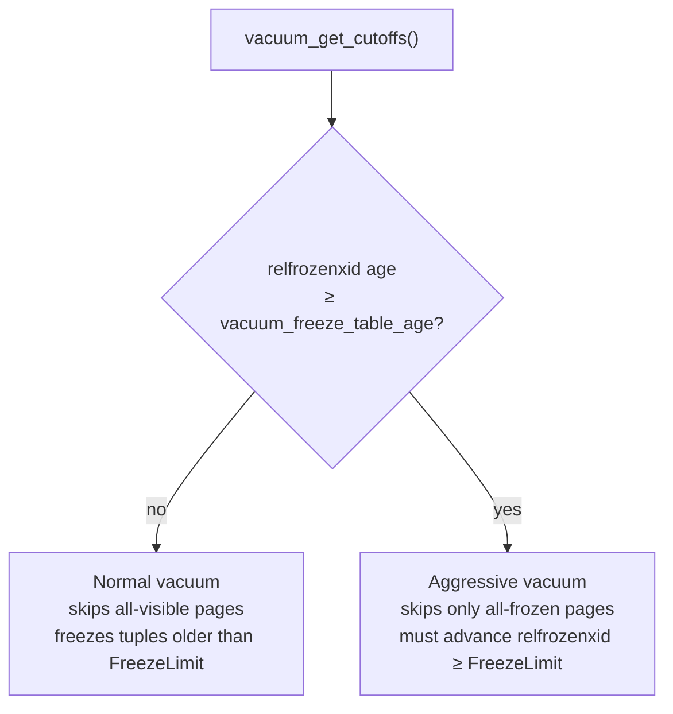
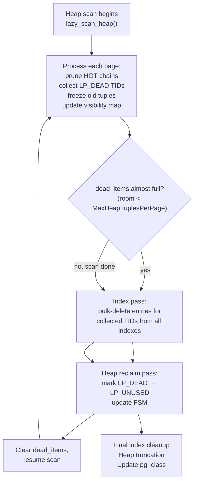

# VACUUM

VACUUM is PostgreSQL's mechanism for reclaiming storage space occupied by dead tuple versions and for preventing transaction ID (XID) wraparound — an existential threat that would corrupt the database if left unchecked. Under MVCC, every update and delete leaves old row versions in place, visible to snapshots that were open at the time of the change. VACUUM sweeps through the heap, identifies versions that no longer belong to any live snapshot, and makes their space available for reuse.

Two very different operations share the `VACUUM` command name. Routine *lazy* (non-blocking) VACUUM is what matters for ongoing maintenance: it holds only a `ShareUpdateExclusiveLock`, allowing concurrent reads and writes throughout. `VACUUM FULL` is an emergency tool that rewrites the entire table under an `AccessExclusiveLock`, compacting it to minimum size and returning disk space to the OS at the cost of blocking all access for the duration. Unless a table is severely bloated and the downtime cost is acceptable, prefer tuning [[subsystems/background/autovacuum|autovacuum]] to run more aggressively over `VACUUM FULL`.

Both manual `VACUUM` commands and autovacuum workers enter through the same dispatch path (`vacuum()`, vacuum.c), which iterates over the target relations, acquires locks, and calls `vacuum_rel()`. For each heap relation, `heap_vacuum_rel()` in vacuumlazy.c does the core work. VACUUM also vacuums [[subsystems/storage/toast|TOAST]] tables associated with a relation automatically, unless the user explicitly requests otherwise. **PostgreSQL 18:** VACUUM and ANALYZE now process inheritance children by default; use the `ONLY` option for the old behavior of operating on the parent table alone.

## Tuple visibility from VACUUM's perspective

Before deciding what to remove, VACUUM must classify every tuple it encounters. The visibility function `HeapTupleSatisfiesVacuum()` (heapam_visibility.c) answers a simpler question than the MVCC snapshot check used by ordinary reads: is this tuple still potentially visible to *any* running transaction? It does not care about a particular snapshot's xmin/xmax boundaries — it cares only whether any backend anywhere could still see the tuple.

The function returns one of five states:

- `HEAPTUPLE_LIVE` — the tuple is the current valid version of the row. Do not touch it.
- `HEAPTUPLE_RECENTLY_DEAD` — the deleting transaction committed, but the deletion XID is >= `OldestXmin`, meaning some open snapshot might still need this version. Leave it for now.
- `HEAPTUPLE_DEAD` — the deleting transaction committed and the deletion XID is older than `OldestXmin`. No snapshot can see this version. It is safe to remove.
- `HEAPTUPLE_INSERT_IN_PROGRESS` — the inserting transaction has not yet committed. Leave it alone.
- `HEAPTUPLE_DELETE_IN_PROGRESS` — the deleting transaction is still running.

The key cutoff, `OldestXmin`, is the oldest XID for which any active snapshot exists. `vacuum_get_cutoffs()` (vacuum.c) computes it once at the start of a vacuum run, by examining the process array for all running transactions. A tuple's `t_xmax` below `OldestXmin` means the deletion is old enough that every possible reader has either committed or aborted — no one can still be using that old version.

An important performance property falls out of the `HEAPTUPLE_RECENTLY_DEAD` state: tuples deleted by very recent transactions do not need to be revisited on every page. Each heap page stores a `pd_prune_xid` hint in its page header. This field holds the minimum deletion XID among recently-dead tuples on the page. When `pd_prune_xid` is still >= `OldestXmin`, VACUUM knows the page contains nothing removable yet and can skip the per-tuple examination entirely. Pruning updates the hint whenever it runs. `heap_page_prune_opt()` (pruneheap.c) also consults the hint; it runs opportunistically during ordinary INSERT, UPDATE, and SELECT operations to do lightweight pruning without a full VACUUM pass.

## Lazy versus aggressive vacuum

Every vacuum run is either *normal* or *aggressive*. The distinction matters for XID wraparound prevention.

PostgreSQL's 32-bit XID counter wraps around after about 4 billion transactions. Consider a tuple whose `t_xmin` or `t_xmax` was written with an XID. If that XID has since wrapped around, visibility checks would misread it as being in the future rather than the past. The mechanism that prevents this is *freezing*: replacing old XIDs in tuple headers with the special `FrozenTransactionId` value (XID 2), which all visibility checks permanently treat as committed and which is immune to wraparound.

`vacuum_get_cutoffs()` (vacuum.c) decides whether a given vacuum run should be aggressive by comparing the table's `relfrozenxid` against two GUC thresholds:

- `vacuum_freeze_table_age` (default 150 million transactions): when the table's `relfrozenxid` is this many transactions behind the current XID, every vacuum run on the table becomes aggressive.
- `autovacuum_freeze_max_age` (default 200 million): when `relfrozenxid` is this far behind, autovacuum will launch a vacuum of the table even if the dead-tuple count has not crossed its normal threshold.

These defaults leave a comfortable margin before the 2 billion XID limit at which PostgreSQL will refuse to continue and will require a manual `VACUUM FREEZE`.

A **normal vacuum** freezes only tuples whose XID is older than `FreezeLimit`, which is derived from `vacuum_freeze_min_age` (default 50 million transactions). It can skip pages the visibility map marks as all-visible and all-frozen, because those pages contain no dead tuples and no tuples needing freezing.

An **aggressive vacuum** must ensure that, after the run, it can advance `relfrozenxid` to at least `FreezeLimit`. It must visit every page that might contain an unfrozen tuple below `FreezeLimit`, so it cannot skip pages that are merely all-visible — it will skip only pages already marked all-frozen. The `VACUUM FREEZE` command forces aggressive mode unconditionally, as does the `DISABLE_PAGE_SKIPPING` option (`VACUUM (DISABLE_PAGE_SKIPPING)` from SQL).

The `LVRelState.aggressive` flag (vacuumlazy.c) tracks the distinction. When verbose output is requested, VACUUM reports whether it is running in aggressive mode before beginning the scan.

**PostgreSQL 18:** Vacuum *eager freeze* reduces the long-term frequency of aggressive vacuum runs. During a normal pass, VACUUM can now freeze all-visible pages otherwise skipped, as long as the effort spent on failed attempts (pages that turn out to need skipping after all) stays within the `vacuum_max_eager_freeze_failure_rate` GUC threshold. By opportunistically freezing such pages during normal runs, the table's `relfrozenxid` advances more quickly, pushing the point at which a full aggressive vacuum becomes necessary further into the future.

## The dead-tuple collection limit and multi-pass strategy

The central constraint on lazy vacuum's design is memory. A naive implementation would collect all dead TIDs in memory, then clean all indexes in one pass, then clean the heap. For a large table with millions of dead tuples, that dead-TID array would consume gigabytes. PostgreSQL instead bounds the array by `maintenance_work_mem` (or `autovacuum_work_mem` for autovacuum workers) and runs multiple index+heap cleanup cycles when the bound is exceeded.

`dead_items_alloc()` (vacuumlazy.c) allocates the array with a size derived from the memory limit: each TID is 6 bytes (`ItemPointerData`), and it also caps the maximum number of items as a fraction of the total table size, to avoid wasteful over-allocation for small tables. **PostgreSQL 17:** VACUUM now stores dead tuple TIDs in an ART-based (Adaptive Radix Tree) `TidStore` (src/backend/lib/tidstore.c) rather than a flat array. This removes the implicit ~1 GB cap that the old array design imposed and reduces memory usage for sparse dead-TID sets, since the radix tree compresses common TID prefixes rather than allocating a slot per item.

Before processing each new page, the scan checks whether the remaining capacity in `dead_items` is less than `MaxHeapTuplesPerPage` (the maximum number of tuples a single page could contribute). If so, the scan triggers a mid-scan `lazy_vacuum()` cycle immediately, before reading the page. This conservative threshold ensures the array never overflows during a single page's processing.

In practice, tables that generate moderate dead-tuple volumes will complete the entire heap scan before the array fills, resulting in exactly one index pass and one heap reclaim pass. Tables with very high churn or very small `maintenance_work_mem` settings will require multiple cycles per vacuum run. Each early cycle processes all indexes in full even though the heap scan has not finished, which is expensive; this is why tuning `maintenance_work_mem` to be large enough to absorb a full table's dead tuples in one pass is a meaningful performance lever.

For tables with no indexes, the two-pass constraint disappears entirely. `lazy_vacuum_heap_page()` can promote dead line pointers from `LP_DEAD` to `LP_UNUSED` immediately during the first pass, since no index entries need removal first. For very large index-free tables, VACUUM also vacuums the FSM every 8 GB of pages processed (`VACUUM_FSM_EVERY_PAGES`), to propagate newly-freed space up the FSM tree without waiting until the end of the scan.

## Heap scanning and pruning

The scan (`lazy_scan_heap()`, vacuumlazy.c) reads the heap sequentially, doing as much work as possible in a single read of each page. Before processing a page, VACUUM consults the visibility map to determine whether the page can be skipped or requires reduced processing.

**PostgreSQL 17:** VACUUM now combines the heap prune pass and the tuple freeze pass into a single heap scan, rather than running them as two separate passes. For freeze-heavy tables this halves the number of heap page reads, since it reads each page once and makes both dead-tuple collection and freeze decisions together. Additionally, sequential heap reads during VACUUM use vectored `ReadBuffer` I/O, batching reads according to the `io_combine_limit` GUC to reduce the number of system calls for large sequential scans.

### Skipping with the visibility map

`lazy_scan_skip()` (vacuumlazy.c) advances through the visibility map to find the next unskippable block, returning entire ranges that can be bypassed. Rather than checking every page individually, the scan jumps directly from one unskippable block to the next. To avoid the overhead of skipping very small ranges, a minimum skip threshold of `SKIP_PAGES_THRESHOLD` (32 pages) applies: VACUUM scans ranges shorter than this page by page, even if they are marked all-visible.

The skip rules are:

- Pages marked **all-frozen** are skipped entirely in both normal and aggressive mode — their tuples are immune to wraparound and have no dead versions.
- Pages marked **all-visible but not all-frozen** are skipped for dead-tuple collection in normal mode but must still be visited in aggressive mode to freeze qualifying tuples.
- All other pages are read and processed.

When non-aggressive vacuum skips an all-visible page because `relfrozenxid` tracking requires it, VACUUM sets the `skippedallvis` flag. VACUUM later checks this flag when updating `relfrozenxid`: if it skipped pages, it can only advance the new value as far as the oldest XID seen among actually-scanned pages, not all the way to `FreezeLimit`.

### Cleanup lock versus shared lock

Processing a page that needs pruning requires a *cleanup lock* — an exclusive buffer lock that waits for the pin count to drop to one. This ensures no other backend is in the middle of traversing a HOT chain on that page. VACUUM attempts to acquire the cleanup lock *conditionally* (`ConditionalLockBufferForCleanup()`), meaning it does not block if another backend holds a pin.

If the conditional lock fails, VACUUM falls back to `lazy_scan_noprune()` (vacuumlazy.c), which acquires only a shared buffer lock. In this reduced mode, VACUUM can still collect already-existing `LP_DEAD` line pointers left by earlier pruning (set during normal reads via `heap_page_prune_opt()`), update tuple counts, and record free space in the FSM — but it cannot collapse HOT chains or prune recently-dead tuples. VACUUM counts any tuples that were prunable but not pruned as `missed_dead_tuples` and reports them in verbose output.

VACUUM waits for a full cleanup lock without a conditional attempt in only one case: aggressive vacuum on a page with unfrozen tuples. Those tuples must be frozen before `relfrozenxid` can advance. Skipping such a page is not an option, so the cleanup lock wait is unavoidable.

### HOT pruning

HOT pruning (`heap_page_prune()`, pruneheap.c) is the core of the page processing phase. Heap-Only Tuple (HOT) chains arise from updates that fit the new row version on the same page as the old one and do not change any indexed column; they form a linked chain of versions, each pointing to the next via `t_ctid`. When intermediate chain members are dead (their deleting transaction committed before `OldestXmin`), pruning collapses the chain:

- Intermediate dead versions become *redirect* line pointers, pointing directly to the surviving chain head without needing an index entry update. Index entries for the root of the chain still work: the redirect leads to the current version without a heap scan for each intermediate step.
- Terminal dead versions — at the end of a chain with no live successor — become `LP_DEAD` line pointers.
- Already-dead tuples with no HOT chain relationships are also marked `LP_DEAD`.

The prune state (`PruneState`, pruneheap.c) tracks three lists of affected line pointers: `redirected[]`, `nowdead[]`, and `nowunused[]`. Visibility is computed once per tuple and cached in `htsv[]` to avoid re-examining the same tuple through multiple chain paths. `heap_page_prune()` applies all changes together and WAL-logs them as a single atomic operation.

After pruning, `lazy_scan_prune()` (vacuumlazy.c) records the TIDs of all `LP_DEAD` line pointers into the `dead_items` array. These TIDs are what the index cleanup pass will use. `lazy_scan_prune()` counts tuples classified as `HEAPTUPLE_RECENTLY_DEAD`, and their deletion XID contributes to `pd_prune_xid`, scheduling the page for future vacuum attention.

At the end of pruning and freezing for a page, VACUUM measures the free space and records it in the FSM, and updates the visibility map bits: if the page now has no dead or unfrozen tuples, it sets the all-visible bit; if every tuple is frozen, it sets the all-frozen bit too. In aggressive mode, VACUUM only sets the all-frozen bit when it has confirmed every tuple on the page is frozen.

## Tuple freezing

Freezing replaces a tuple's in-header XID with `FrozenTransactionId` (XID 2), which visibility checks always consider committed. Once a tuple is frozen, its `t_xmin` and `t_xmax` fields are no longer meaningful XID comparisons — VACUUM never needs to visit it again for wraparound prevention.

`heap_prepare_freeze_tuple()` (heapam.c) decides, for each live tuple, whether freezing is needed. The decision is governed by `FreezeLimit` — the oldest XID that VACUUM is permitted to leave unfrozen. Any `t_xmin` or effective `t_xmax` XID older than `FreezeLimit` must be frozen. Beyond just the `FrozenTransactionId` replacement, the freeze operation may also:

- Clear `HEAP_XMIN_COMMITTED` and set `HEAP_XMIN_FROZEN` to signal that the insert is permanently visible without a [[subsystems/storage/clog|clog]] lookup.
- Clear `t_xmax` when the locking or deleting transaction is no longer relevant, reducing future visibility check cost.

`heap_freeze_execute_prepared()` batches freeze plans per page and applies them together with a single WAL record (`XLOG_HEAP2_FREEZE_PAGE`), keeping the critical section short and write amplification low. VACUUM counts pages where any tuples were frozen in `frozen_pages` and reports them in verbose output.

### MultiXact handling

A tuple's `t_xmax` can hold either a plain XID or a `MultiXactId`. A MultiXact arises when two or more transactions hold a row-level lock on the same tuple simultaneously — for example, two `SELECT FOR SHARE` holders, or a locker alongside an updater. The `HEAP_XMAX_IS_MULTI` bit in `t_infomask` signals which case applies.

When `HEAP_XMAX_IS_MULTI` is set, `heap_prepare_freeze_tuple()` delegates to `FreezeMultiXactId()` (heapam.c). The decision hinges on two cutoffs: if the `MultiXactId` predates `MultiXactCutoff`, none of its members can still be running, and VACUUM must resolve it. If any member XID would remain below `FreezeLimit`, the Multi must also be resolved.

Resolving a Multi requires inspecting each member and classifying it as a locker (merely locked the row, no lasting effect) or an updater (deleted or updated it). VACUUM discards members whose transactions have ended. The outcome:

- All members gone: `t_xmax` is set to `InvalidTransactionId`, `HEAP_XMAX_IS_MULTI` is cleared. The row looks as if it was never locked.
- Exactly one updater survives: the Multi is replaced by a plain XID. If that updater has committed, `HEAP_XMAX_COMMITTED` is set.
- Multiple members must survive: a new, smaller MultiXact is allocated. This path is rare and deliberately avoided where possible.

VACUUM may leave a `HEAP_XMAX_IS_MULTI` tuple untouched only when the Multi is young enough that none of the above conditions apply. An analogous `relminmxid` value in `pg_class` tracks the oldest MultiXact that may exist in the table, paralleling `relfrozenxid` for the plain XID dimension.

## Index vacuuming

Index vacuuming must happen before the heap reclaim pass. If VACUUM freed dead heap line pointers first, a concurrent index scan could follow a still-valid index entry to a slot reused for a completely different tuple. Since heap visibility checks would then read the new tuple's XID — not the one the index entry points to — the result could be a silently wrong answer. The ordering guarantee prevents this.

Each index access method receives the collected dead-TID array through its `ambulkdelete` callback. For B-tree indexes, `btbulkdelete()` (nbtree.c) scans all leaf pages and removes any index entry whose heap TID appears in the dead list. The comparison is efficient because the dead-TID array is sorted, allowing binary search rather than linear scan.

After bulk deletion, each index runs its cleanup phase (`amvacuumcleanup`). For B-tree, `btvacuumcleanup()` removes pages that became entirely empty during bulk deletion, updates the index's statistics in `pg_class`, and recycles deleted pages when they are old enough to be safe to reuse. Other index AMs perform analogous maintenance steps.

When the `index_cleanup` option is set to `DISABLED`, or when VACUUM detects that only a negligible fraction of pages (below about 2% of the relation, `BYPASS_THRESHOLD_PAGES` in vacuumlazy.c) had dead items, VACUUM may bypass the entire index pass as an optimisation. This *index bypass* avoids the overhead of scanning all indexes when dead-tuple counts are trivially small. However, VACUUM automatically disables the bypass if the dead-items array filled to capacity during the scan. That means a mid-scan `lazy_vacuum()` already triggered, making the decision to bypass moot.

## Heap reclaim pass

With indexes clean, dead line pointers can be safely freed. `lazy_vacuum_heap_rel()` and `lazy_vacuum_heap_page()` (vacuumlazy.c) iterate over the collected dead-TID batches, revisiting each affected page and promoting its `LP_DEAD` line pointers to `LP_UNUSED`. The promotion steps are:

1. Acquire a cleanup lock on the page.
2. Walk the TID list for this page, setting each matching line pointer to `LP_UNUSED`.
3. Trim trailing unused slots from the end of the line pointer array. Since the page header records the maximum offset number, trimming reduces the array length and reclaims those header bytes for future tuple storage.
4. Compact the page's free space into a contiguous region (`PageRepairFragmentation()`).
5. WAL-log the changes (`XLOG_HEAP2_VACUUM`).
6. If the page is now free of dead or unfrozen tuples, set the all-visible bit in both the page header and the visibility map.
7. Record the updated free space in the FSM.

The heap reclaim pass reports progress via `PROGRESS_VACUUM_HEAP_BLKS_VACUUMED`, which is visible in `pg_stat_progress_vacuum`. **PostgreSQL 17:** `pg_stat_progress_vacuum` gains two new columns, `indexes_total` and `indexes_processed`, which report how many indexes the current vacuum run must process and how many have been completed so far.

## Visibility map maintenance

The visibility map (one bit per heap page, stored in a fork of the relation file) is VACUUM's primary tool for skipping work on subsequent runs. Two bits matter:

- **All-visible**: every tuple on the page is visible to all current and future snapshots. Index-only scans can skip the heap entirely for pages with this bit set, making it critical for read performance. Any modification to the page (inserts, updates, deletes) clears the bit; VACUUM sets it when it has confirmed no dead or recently-dead tuples remain.
- **All-frozen**: every tuple on the page is frozen. VACUUM can skip the page entirely even during aggressive runs. VACUUM sets this bit during an aggressive run, when every tuple on the page is confirmed frozen. Once set, only `VACUUM FULL` or `CLUSTER` clears it, since both rewrite the table.

The all-visible bit also serves as the gating condition for index-only scans. When a query can satisfy a `SELECT` from an index alone (without touching heap pages for data), it still needs to confirm the heap tuple is live. The visibility map lets it skip the heap check for all-visible pages, yielding a substantial speedup for read-heavy workloads on well-vacuumed tables.

Setting the all-visible bit is an optimistic operation: VACUUM sets the bit even if a concurrent transaction might later need to clear it. The transaction that clears the bit writes to the heap page and WAL-logs the clear before modifying the tuple, ensuring readers always get a consistent view.

## VACUUM FULL

PostgreSQL implements `VACUUM FULL` as a variant of `CLUSTER` (cluster.c), not through vacuumlazy.c at all. It acquires an `AccessExclusiveLock` on the relation, blocking all concurrent access, then rewrites every heap page into a new relation file. It simply does not copy dead tuples over. The resulting file is as compact as possible. It rebuilds indexes from scratch. It then deletes the old file and returns its space to the OS.

The advantage is complete space reclamation without any wasted page headers or slack. The disadvantages are substantial:

- Total lock exclusion for the duration, which can be minutes or hours for large tables.
- Double the disk space is required temporarily, to hold both old and new copies.
- Full index rebuilds are expensive and generate significant WAL.
- Buffer pool is cold for the new file, increasing I/O load immediately after.

For ongoing maintenance, tuning autovacuum to reclaim space continuously is almost always preferable to periodic `VACUUM FULL`. The appropriate use case for `VACUUM FULL` is a table that has shrunk dramatically (e.g. after a bulk delete) and will not regrow, where the permanent space saving justifies the one-time cost. The `pg_squeeze` and `pg_repack` community extensions offer a way to achieve similar compaction without full exclusive locking.

## Parallel vacuum

When a table has multiple indexes, the index vacuuming work can be distributed across parallel worker processes. The heap passes — both the initial scan and the reclaim pass — always run serially in the leader. Parallelism applies only to index bulk-deletion and index cleanup, which is the right boundary: each index is an independent structure with no shared state between it and other indexes, while heap scanning involves tightly coupled state (the `dead_items` array, FSM, visibility map) that would require expensive synchronisation.

The leader initialises a Dynamic Shared Memory (DSM) segment containing the shared dead_items array, per-index result slots, a shared cost-balance counter, and an atomic work-distribution counter (`parallel_vacuum_init()`, vacuumparallel.c). Workers and the leader claim indexes by atomically incrementing this counter, process one index at a time, and write their results back into the shared result slots.

The number of useful workers is capped at `(number of parallel-eligible indexes − 1)`, since launching more workers than indexes provides no benefit, and `max_parallel_maintenance_workers` provides an absolute ceiling. An index is eligible for parallel processing only if it exceeds `min_parallel_index_scan_size` and its access method declares support via `amparallelvacuumoptions`.

A subtlety: each worker might otherwise allocate its own full `maintenance_work_mem` for index operations. To avoid multiplying peak memory by worker count, `parallel_vacuum_init()` divides `maintenance_work_mem` among the workers that actually use it, keeping the aggregate cost comparable to a serial vacuum.

`VACUUM FULL` cannot be parallelised.

## Wraparound failsafe

If `relfrozenxid` reaches a critically dangerous age (controlled by `vacuum_failsafe_age`, default 1.6 billion transactions from the current XID), VACUUM activates a failsafe mode (`lazy_check_wraparound_failsafe()`, vacuumlazy.c). In failsafe mode:

- Cost-based throttling is disabled entirely, so VACUUM runs at full I/O speed.
- Index vacuuming may be skipped if it is impeding progress — the priority is to freeze tuples and advance `relfrozenxid` before wraparound occurs.
- The global flag `VacuumFailsafeActive` (vacuum.c) is set, preventing re-enabling of cost delays even if the table is vacuumed again within the same session.

The failsafe is checked periodically during the scan — once every `FAILSAFE_EVERY_PAGES` pages, which corresponds to 4 GB of pages at the default block size. An additional check runs inside `lazy_vacuum_all_indexes()` before each index pass. Checking frequently enough matters because `relfrozenxid` might look dangerously old before the scan reaches the index-processing phase.

This is a last-resort mechanism. Reaching failsafe mode indicates that autovacuum has been unable to keep up, which is a configuration or workload problem that should be addressed independently. The failsafe trades index hygiene for progress on wraparound prevention: it is acceptable to leave index bloat behind as long as the database survives.

## Heap truncation

After the vacuum passes, if trailing pages of the heap are empty, the relation file can be shortened with `lazy_truncate_heap()`. Truncation is only attempted when at least `REL_TRUNCATE_MINIMUM` (1000) pages, or 1/`REL_TRUNCATE_FRACTION` (1/16) of the relation's page count — whichever is smaller — are potentially freeable. This avoids the overhead of attempting truncation for trivially small savings.

Truncation requires waiting for all other backends to release pins on the trailing pages. VACUUM polls for this condition using `count_nondeletable_pages()`, checking every `VACUUM_TRUNCATE_LOCK_CHECK_INTERVAL` (20 ms) and waiting up to `VACUUM_TRUNCATE_LOCK_TIMEOUT` (5 seconds) total. If the timeout expires, VACUUM gives up on truncation for this run without failing — the pages will simply remain, and a future vacuum run can try again. This conservative design avoids indefinitely blocking concurrent queries just to reclaim disk space.

## Updating relation metadata

At the end of a run, `pg_class` is updated with new `relfrozenxid`, `relminmxid`, `reltuples`, and `relpages` values (`vacuum_rel()`, vacuum.c). Advancing `relfrozenxid` is the primary measure of progress against XID wraparound: the further it advances, the more headroom remains before the wraparound horizon.

The constraint on advancing `relfrozenxid` is strict: for an aggressive vacuum, the new value must be at least `FreezeLimit`. For a normal vacuum, it can advance by any amount (or not at all) depending on what was actually visited. If pages were skipped because they were already all-visible (tracked by `skippedallvis`), the new `relfrozenxid` can only advance as far as the minimum unfrozen XID seen on actually-scanned pages, not all the way to `FreezeLimit`.

After updating per-relation metadata, the cluster-wide `pg_database.datfrozenxid` and `pg_xact` SLRU are also updated. `pg_xact` stores commit/abort status for recent XIDs; once every database's `datfrozenxid` advances past a certain XID, the corresponding `pg_xact` segment pages are no longer needed and can be truncated (`vac_truncate_clog()`, vacuum.c), reclaiming a small amount of disk space. This SLRU truncation is skipped when only a subset of tables was vacuumed (the `skip_database_stats` option), since global safety cannot be confirmed without checking all tables.

**PostgreSQL 18:** `pg_class` gains a `relallfrozen` column that tracks whether every heap page in the relation is fully frozen. This allows tools and queries to identify tables that will never need a freeze pass again without scanning the visibility map or running a full VACUUM.

## Autovacuum

Relying on manual VACUUM scheduling is error-prone. [[subsystems/background/autovacuum|Autovacuum]] is the background subsystem — a launcher process plus a pool of workers running `do_autovacuum()` (autovacuum.c) — that scans `pg_class` and `pg_stat_user_tables` and triggers VACUUM (and ANALYZE) automatically once dead-tuple, insert, or freeze-age thresholds are crossed. See that page for the threshold formulas, the per-table storage parameter overrides, and the cost-balance mechanism that divides `autovacuum_vacuum_cost_limit` across concurrently running workers.

Once a worker decides to vacuum a relation, it goes through the exact same `heap_vacuum_rel()` path described in the rest of this page — pruning, freezing, index vacuuming, and relfrozenxid advancement are identical whether VACUUM was triggered manually or by an autovacuum worker.

## Cost-based throttling

Left unconstrained, VACUUM would read and write as fast as the I/O subsystem allows, potentially starving concurrent workloads of I/O capacity. Cost-based throttling (`vacuum_cost_delay`, `vacuum_cost_limit`) introduces deliberate pauses to rate-limit vacuum's I/O.

Each buffer access is charged a cost:

- Buffer hits (page already in shared buffers): `vacuum_cost_page_hit` (default 1) — cheap because no physical I/O occurs.
- Buffer misses (page must be read from disk): `vacuum_cost_page_miss` (default 2) — more expensive.
- Dirtied pages (page written back to disk): `vacuum_cost_page_dirty` (default 20) — most expensive, since it generates write I/O.

When the accumulated cost balance exceeds `vacuum_cost_limit`, VACUUM sleeps for `vacuum_cost_delay` milliseconds before continuing. The sleep resets the cost balance. Manual `VACUUM` runs default to no throttling (`vacuum_cost_delay = 0`); autovacuum workers use `autovacuum_vacuum_cost_delay` (default 2ms).

In parallel vacuum, each worker maintains its own local cost counter (`VacuumCostBalanceLocal`) but all workers share a common cost balance via DSM (`VacuumSharedCostBalance`, vacuum.c). When checking whether to sleep, each worker adds its local balance to the shared balance and evaluates the total. The shared balance prevents the combined I/O rate from exceeding what a single unparallelised vacuum would be permitted to do. `VacuumActiveNWorkers` tracks how many workers are active at each moment to allow the throttle to scale appropriately.

Failsafe mode overrides throttling completely: once `VacuumFailsafeActive` is set, cost checks are bypassed until the current table finishes vacuuming.

## Configuration reference

The key GUCs governing vacuum behaviour:

| Parameter | Default | Effect |
|---|---|---|
| `vacuum_freeze_min_age` | 50,000,000 | Minimum XID age before freezing a tuple |
| `vacuum_freeze_table_age` | 150,000,000 | Table age that triggers aggressive vacuum |
| `autovacuum_freeze_max_age` | 200,000,000 | Table age at which autovacuum forces a vacuum |
| `vacuum_failsafe_age` | 1,600,000,000 | XID age that activates wraparound failsafe |
| `maintenance_work_mem` | 64MB | Memory for dead-TID collection per vacuum |
| `autovacuum_work_mem` | -1 (use maintenance_work_mem) | Memory for autovacuum dead-TID collection |
| `vacuum_cost_delay` | 0 (disabled for manual VACUUM) | Sleep duration per cost cycle |
| `vacuum_cost_limit` | 200 | Cost units before sleeping |
| `vacuum_cost_page_hit` | 1 | Cost for a buffer cache hit |
| `vacuum_cost_page_miss` | 2 | Cost for a buffer cache miss requiring disk read |
| `vacuum_cost_page_dirty` | 20 | Cost for dirtying a page |
| `autovacuum_vacuum_cost_delay` | 2ms | Cost delay for autovacuum workers |
| `autovacuum_vacuum_scale_factor` | 0.2 | Fraction of table size for dead-tuple threshold |
| `autovacuum_vacuum_threshold` | 50 | Base dead-tuple count for autovacuum trigger |
| `max_parallel_maintenance_workers` | 2 | Maximum parallel vacuum workers |
| `min_parallel_index_scan_size` | 512kB | Minimum index size for parallel vacuum eligibility |
| `io_combine_limit` | — | **PG17:** Maximum number of blocks combined into a single vectored read during sequential heap scans |
| `vacuum_max_eager_freeze_failure_rate` | — | **PG18:** Maximum tolerated failure rate for eager freeze attempts on all-visible pages during normal vacuum |
| `vacuum_truncate` | on | **PG18:** Now a server-level GUC (previously only a per-table storage parameter); controls whether VACUUM attempts to truncate trailing empty pages |

## See also

- [[subsystems/storage/heap|Heap Storage]] — LP_DEAD, LP_UNUSED line pointer states; HOT chains and how pruning collapses them
- [[subsystems/storage/fsm|Free Space Map]] — FSM updates after reclaiming dead tuples
- [[subsystems/storage/visibility-map|Visibility Map]] — all-visible and all-frozen bit maintenance
- [[subsystems/transactions/mvcc|MVCC]] — OldestXmin and FreezeLimit derivation from active snapshots
- [[subsystems/transactions/xid-wraparound|XID Wraparound]] — why freezing is necessary and how the wraparound horizon is computed
