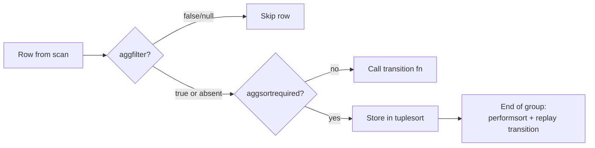

PostgreSQL aggregate function calls accept three optional modifiers — `FILTER`, `ORDER BY`, and `DISTINCT` — that reshape which rows reach the transition function and in what sequence. Each modifier is independent of the query-level `WHERE`, `ORDER BY`, and `SELECT DISTINCT`. It applies only to the single aggregate it annotates. Together they make many analytical queries expressible in a single scan instead of multiple passes.

## The Aggref node and its modifier fields

The parser represents every aggregate call as an `Aggref` node (defined in `src/include/nodes/primnodes.h`). Three fields carry the modifier information:

- `aggfilter` — an `Expr *` holding the `FILTER (WHERE ...)` predicate, or `NULL` when absent.
- `aggorder` — a `List *` of `SortGroupClause` nodes encoding the `ORDER BY` key list.
- `aggdistinct` — a `List *` of `SortGroupClause` nodes encoding the `DISTINCT` key list.

The planner sets a fourth field, `aggpresorted`, when the chosen plan already delivers rows in the order required by `aggorder` or `aggdistinct`, allowing the executor to skip a per-aggregate sort.

## FILTER (WHERE condition)

`FILTER (WHERE expr)` restricts which rows reach a specific aggregate's transition function. A query-level `WHERE` clause eliminates rows before grouping begins. A `FILTER` predicate works differently. PostgreSQL evaluates a `FILTER` predicate per row, per aggregate, after grouping has isolated the current group. Different aggregates in the same query can carry different `FILTER` conditions:

```sql
SELECT
    COUNT(*)                                      AS total,
    COUNT(*) FILTER (WHERE status = 'active')     AS active_count,
    SUM(amount) FILTER (WHERE region = 'EMEA')    AS emea_revenue,
    AVG(score) FILTER (WHERE cohort = 'A')        AS cohort_a_avg
FROM events
GROUP BY month;
```

All four aggregates read the same group's rows from a single scan. Each has its own predicate evaluated independently.

**Execution path.** During expression compilation (`src/backend/executor/execExpr.c`, function `ExecInitAggref`), when `aggfilter` is non-NULL the compiler emits the filter expression followed by an `EEOP_JUMP_IF_NOT_TRUE` step. If the predicate is false or null, control jumps past all argument evaluation and the transition function call entirely. The executor skips the row at zero additional allocation cost. Crucially, this jump happens *before* the executor evaluates the aggregate's arguments. That order avoids unnecessary work and prevents errors from expressions that would fail on the filtered-out rows.

`FILTER` also works on window functions. In `src/backend/executor/nodeWindowAgg.c`, `advance_windowaggregate` evaluates `wfuncstate->aggfilter` at the start of each row and returns early when the predicate fails. As a result, window aggregate transition functions see only the filtered subset.

**Interaction with presorted aggregates.** When a planner decides to presort input for an `ORDER BY` or `DISTINCT` aggregate, it must be conservative with `FILTER`. If the sort arguments can raise errors on some rows (non-Var, non-Const expressions), the planner skips presort optimisation for that `Aggref`. Presorting would apply the sort before the filter. Without presorting, the executor applies the filter first, as required. This safety check lives in `planner.c` around the `aggpresorted` flag assignment.

## ORDER BY inside aggregate calls

An `ORDER BY` clause inside an aggregate call controls the sequence in which rows are fed to the transition function. It has no effect on the order of query results:

```sql
SELECT
    string_agg(name, ', ' ORDER BY name)          AS sorted_names,
    array_agg(event_time ORDER BY event_time DESC) AS newest_first,
    jsonb_agg(row_to_json(t) ORDER BY created_at)  AS ordered_json
FROM t;
```

This is only meaningful for aggregates whose output depends on input order: `string_agg`, `array_agg`, `xmlagg`, `json_agg`, `jsonb_agg`, and user-defined aggregates that accumulate state in an order-sensitive way. For commutative aggregates like `sum` or `max`, an inner `ORDER BY` is legal but pointless.

**Execution path.** When `aggorder` is non-NIL and the planner has not set `aggpresorted`, the executor sets `pertrans->aggsortrequired = true` for that transition state. During the group's row accumulation phase (`advance_aggregates`), instead of calling the transition function directly the executor stores each row into a per-`AggStatePerTrans` `tuplesort` object. At `finalize_aggregates` time, after the executor has seen all rows for the group, `process_ordered_aggregate_single` (single sort column, datum-level sort) or `process_ordered_aggregate_multi` (multi-column tuple sort) performs the sort and then replays rows through the transition function in sorted order. Each ORDER BY aggregate maintains its own independent `tuplesort`. Multiple such aggregates in the same query each get a separate sort.

When the planner detects that the scan or join plan already produces rows in the required order — matching the pathkeys — it marks `aggpresorted = true`. The executor then treats the aggregate as a plain aggregate with no internal sort needed.



## DISTINCT inside aggregate calls

`DISTINCT` inside an aggregate deduplicates rows before passing them to the transition function. `COUNT(DISTINCT col)` is the canonical usage, but the syntax applies to any aggregate:

```sql
SELECT
    COUNT(DISTINCT user_id)                   AS unique_users,
    array_agg(DISTINCT category ORDER BY category) AS unique_categories,
    SUM(DISTINCT amount)                      AS sum_of_unique_amounts
FROM events;
```

**Execution path.** The executor uses the same per-`AggStatePerTrans` `tuplesort` infrastructure as `ORDER BY`. After accumulating rows, `finalize_aggregates` calls `process_ordered_aggregate_single` or `process_ordered_aggregate_multi`. Inside those functions, the executor detects and skips consecutive duplicate values (`numDistinctCols > 0` signals dedup mode). For a single-column `DISTINCT`, the comparison is datum-level; for multi-column `DISTINCT`, it compares full tuple slots via `execTuplesMatch`.

The `aggdistinct` list in `Aggref` encodes the distinct keys as `SortGroupClause` nodes, the same representation as `aggorder`. By construction, the grammar ensures the `ORDER BY` clause is a prefix of the `DISTINCT` keys when both appear (see below). This lets the single tuplesort serve both dedup and ordering.

**Optimisation when input is presorted.** If the planner can prove the input arrives in the right order for DISTINCT dedup, it sets `aggpresorted = true`. The executor then emits `EEOP_AGG_PRESORTED_DISTINCT_SINGLE` or `EEOP_AGG_PRESORTED_DISTINCT_MULTI` expression steps. These opcodes perform an inline duplicate check against the previous datum/tuple rather than buffering all rows in a tuplesort, reducing memory overhead significantly.

## Interaction between the three modifiers

The three modifiers form a pipeline when combined:

1. **FILTER is applied first** — cheapest gate, skips argument evaluation entirely when false.
2. **DISTINCT dedup (or ORDER BY sort) happens after** — the executor buffers rows that passed the filter in a tuplesort and replays them sorted or deduped before calling the transition function.

The grammar enforces one restriction: `DISTINCT` and `ORDER BY` cannot both appear in the same aggregate call unless `ORDER BY` is a prefix of the `DISTINCT` keys (as produced by `array_agg(DISTINCT x ORDER BY x)`). Specifying both with independent key lists is a parse error. This restriction exists because the `DISTINCT` sort already implies an order, making a separate `ORDER BY` sort either redundant or contradictory.

```sql
-- Legal: ORDER BY is the same key as DISTINCT
SELECT array_agg(DISTINCT x ORDER BY x) FROM t;

-- Illegal: independent ORDER BY not a prefix of DISTINCT keys
-- SELECT array_agg(DISTINCT x ORDER BY y) FROM t;  -- parse error
```

## Hash aggregation incompatibility

When any aggregate in the query carries an `ORDER BY` or `DISTINCT` modifier, the planner increments `root->numOrderedAggs` in `prepagg.c`. A non-zero `numOrderedAggs` blocks the hash aggregation strategy in `planner.c` — the planner comment explains the reason: supporting per-aggregate tuplesorts inside a hash table would require storing all input rows in the table and running many concurrent sorts. That is invariably slower than a sort-based strategy.

## Partial aggregation and parallelism

`ORDER BY` and `DISTINCT` inside aggregates also block partial aggregation. In `prepagg.c`, when `aggorder != NIL || aggdistinct != NIL` the planner counts the aggregate into `root->hasNonPartialAggs`. The `can_partial_agg` function in `planner.c` returns false whenever `hasNonPartialAggs` is true, preventing the query from using a parallel partial-aggregate/gather-merge plan. This rule blocks parallel execution entirely for queries that mix `FILTER`-only aggregates with `ORDER BY` or `DISTINCT` aggregates.

## Performance implications

Each aggregate with `aggsortrequired = true` allocates its own `tuplesort` per grouping set. For a query with three `ORDER BY` aggregates and ten grouping sets, that is up to thirty concurrent sorts. Each sort spills to disk at [[subsystems/executor/work-mem-and-spill|work_mem]] boundaries. As a result, `work_mem` is divided across all active sorts. The per-aggregate sort is unavoidable unless the planner can satisfy `aggpresorted`. That requires the overall plan to produce rows in an order compatible with the aggregate's key list.

When the same `ORDER BY` or `DISTINCT` key appears across multiple aggregates, the planner in `planner.c` tries to find a single set of pathkeys that serves the largest coalition of aggregates. A single presort step can then handle all of them, tracked via `aggpresorted` on compatible `Aggref` nodes.

`FILTER`-only aggregates have negligible overhead: the predicate evaluation and conditional jump cost is typically a few nanoseconds per row. They do not touch the `tuplesort` machinery at all.

## Related Topics

- [[sql-features/advanced-aggregation|Advanced Aggregation]] — GROUPING SETS, ROLLUP, CUBE, and the broader aggregation feature set.
- [[sql-features/window-functions|Window Functions]] — FILTER also applies to window function calls, handled by `advance_windowaggregate` in `nodeWindowAgg.c`.
- [[sql-features/grouping-sets|Grouping Sets]] — multi-dimensional grouping that multiplies the number of active `tuplesort` objects when combined with ORDER BY or DISTINCT aggregates.
- [[subsystems/executor/aggregate|Aggregate Executor Node]] — the full lifecycle of `AggState`, pergroup and pertrans structs, and the three aggregation strategies.
- [[subsystems/planner/partial-aggregation|Partial Aggregation]] — why DISTINCT and ORDER BY aggregates block partial/parallel plans.
- [[subsystems/executor/work-mem-and-spill|work_mem and Spill]] — memory budget shared across all concurrent tuplesorts.
- [[subsystems/parser/aggregate-analysis|Aggregate Analysis]] — parser validation of FILTER, ORDER BY, and DISTINCT syntax within aggregate calls.
