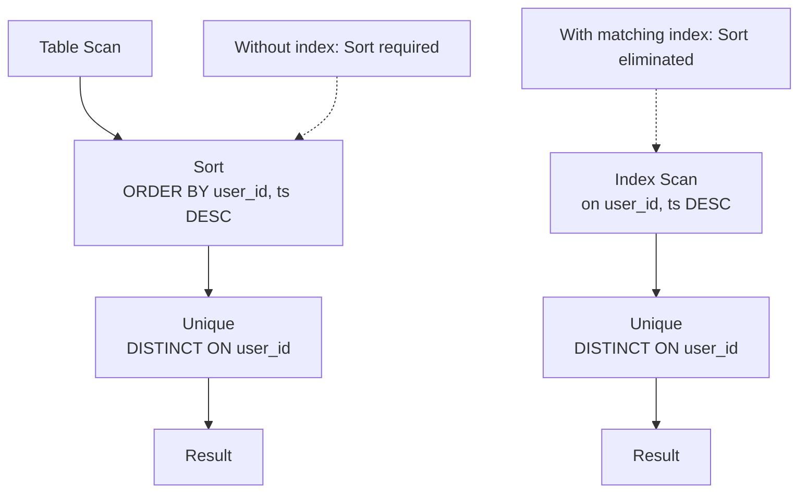

`DISTINCT ON (expr, ...)` is a PostgreSQL extension that keeps exactly one row per distinct combination of the given expressions. The `ORDER BY` clause that follows determines which row is kept. It solves the "first row per group" problem directly in SQL without requiring window functions or self-joins. It is often the most efficient approach for single-column partitioning when the right index is available.

## What DISTINCT ON Does

Standard `DISTINCT` deduplicates across all selected columns. `DISTINCT ON` narrows that scope: only the listed expressions determine group boundaries. Within each group, PostgreSQL retains the first row as ordered by the `ORDER BY` clause and discards the rest. All columns of that chosen row are available in the output, not just the grouping expressions. This is the key distinction from `GROUP BY`, where every non-aggregated column must appear in the `GROUP BY` list.

```sql
-- Keeps the most recent event per user; all event columns are returned.
SELECT DISTINCT ON (user_id) *
FROM events
ORDER BY user_id, ts DESC;
```

This is not expressible in standard SQL without a subquery or window function. The closest standard equivalents are a `ROW_NUMBER() OVER (PARTITION BY ...)` filtered in a CTE, or a `LATERAL` subquery — both more verbose and often slower for simple partitioning cases.

## Ordering Requirement and Parse-Time Enforcement

`DISTINCT ON` has a hard constraint: the listed expressions must form a leading prefix of the `ORDER BY` clause. `ORDER BY user_id, ts DESC` is valid when `DISTINCT ON (user_id)` is used. `ORDER BY ts DESC, user_id` is not, because `ts` appears before `user_id`.

`transformDistinctOnClause` inside `src/backend/parser/parse_clause.c` checks and enforces this rule. During parse analysis, the function walks the `DISTINCT ON` expression list. It verifies that each expression maps to a sort key preceding any sort key outside the `DISTINCT ON` set. If the `ORDER BY` clause omits the `DISTINCT ON` columns entirely, the parser inserts them at the front of the sort list automatically, choosing the default ascending sort order. This insertion preserves the prefix property. The user still controls the secondary sort that picks which row survives within each group.

The practical effect: the `ORDER BY` after `DISTINCT ON` always serves two roles. The leading keys establish group boundaries. The trailing keys determine which group member is "first."

## Planner: Sort + Unique

After parse analysis, `DISTINCT ON` appears in the query tree as a `distinctClause` alongside the augmented `sortClause`. The [[subsystems/planner/overview|planner]] translates this into two physical nodes:

1. **Sort** — orders the input by the full `ORDER BY` key sequence (DISTINCT ON columns first, then secondary sort columns). This guarantees that all rows belonging to the same DISTINCT ON group are adjacent in the stream.
2. **Unique** — reads the sorted stream and emits only the first row per group. It compares each incoming row's DISTINCT ON expressions against the previous row's values and discards the row if they match.

`create_upper_unique_plan` in `createplan.c` builds the `Unique` node, calling `make_unique_from_sortclauses` to wire up the equality operators for each DISTINCT ON expression. The executor side lives in `nodeUnique.c`: `ExecInitUnique` allocates a `UniqueState`. `ExecUnique` runs the comparison loop on each tuple received from the child node.



When a [[subsystems/indexes/btree|btree]] index already delivers rows in the required order, the planner can drop the Sort node entirely. An index on `(user_id, ts DESC)` matches the full `ORDER BY user_id, ts DESC` prefix. The plan then becomes an Index Scan feeding directly into Unique — no sort step, no [[subsystems/executor/work-mem-and-spill|work_mem]] pressure.

## EXPLAIN Output

A typical plan without a covering index:

```
Sort  (cost=... rows=... width=...)
  Sort Key: user_id, ts DESC
  ->  Seq Scan on events
Unique
  ->  Sort
```

With a matching index:

```
Unique  (cost=... rows=... width=...)
  ->  Index Scan using events_user_ts_idx on events
```

The presence or absence of the Sort node in [[code-paths/explain|EXPLAIN]] output is the fastest way to confirm whether the query is benefiting from an index. See [[troubleshooting/slow-queries|slow queries]] if the Sort dominates runtime on large tables.

## Performance Characteristics

Without a helpful index, DISTINCT ON is always O(N log N): the planner must sort all N rows before the Unique node can stream through them. The Unique node itself is O(N) once data is sorted — it makes a single pass over the stream comparing adjacent tuples. The bottleneck is always the Sort when no index is available.

| Scenario | Complexity | Notes |
|---|---|---|
| No index, in-memory sort | O(N log N) | Bounded by work_mem; spills to disk if exceeded |
| No index, external sort | O(N log N) + disk I/O | Avoid by raising `work_mem` or adding an index |
| Index provides sort order | O(N) | Index Scan + Unique; best case |

The planner never chooses hash-based DISTINCT (used internally for plain `SELECT DISTINCT`) for `DISTINCT ON`. Hash aggregation cannot preserve the ORDER BY semantics that determine which row is kept per group. As a result, the planner unconditionally selects the sort-based path.

## DISTINCT ON vs GROUP BY vs Window Functions

`GROUP BY` collapses groups into single rows via [[subsystems/executor/aggregate|aggregation]]. Every column in the `SELECT` list must either appear in `GROUP BY` or be wrapped in an aggregate function. `DISTINCT ON` imposes no such restriction. It picks a complete row, so any column from that row is freely selectable. This also means `DISTINCT ON` cannot compute aggregates like `SUM` or `COUNT` across the group. It simply picks one row.

[[subsystems/executor/window-functions|Window functions]] using `ROW_NUMBER() OVER (PARTITION BY user_id ORDER BY ts DESC)` followed by `WHERE rn = 1` are semantically equivalent. They require full materialization of the window partition before filtering can occur. For simple "latest per group" queries, `DISTINCT ON` is typically shorter, easier to read, and faster because it filters during the Unique pass rather than after.

`LATERAL` subqueries can push the per-group lookup into an index seek. This is competitive or faster when the number of distinct groups is small relative to total rows, but the query structure is more complex.

## Common Pattern: Latest Record Per Group

```sql
-- Index: CREATE INDEX ON events (user_id, ts DESC);
SELECT DISTINCT ON (user_id)
    user_id, ts, payload
FROM events
ORDER BY user_id, ts DESC;
```

This pattern is idiomatic PostgreSQL. The index on `(user_id, ts DESC)` allows the executor to read at most one index page per user and emit one row per group, making total cost proportional to the number of distinct users rather than the total event count.

For queries that need the latest row across multiple partition columns, extend both the `DISTINCT ON` list and the index accordingly:

```sql
SELECT DISTINCT ON (account_id, event_type)
    account_id, event_type, ts, payload
FROM events
ORDER BY account_id, event_type, ts DESC;
-- Index: (account_id, event_type, ts DESC)
```

## No Standard SQL Equivalent

`DISTINCT ON` is a PostgreSQL extension and does not appear in any SQL standard. The closest standard forms are:

- `ROW_NUMBER() OVER (PARTITION BY ... ORDER BY ...)` in a CTE filtered with `WHERE rn = 1`
- A correlated subquery or `LATERAL` join with `ORDER BY ... LIMIT 1`

Both are valid and portable. `DISTINCT ON` is shorter. The planner's Sort + Unique plan is well-optimized for it, especially when an index eliminates the Sort.

## Related Topics

- [[subsystems/planner/overview|Planner overview]] — how the planner selects Sort + Unique vs index paths
- [[subsystems/executor/sort|Sort node]] — work_mem, external sort, sort spill behaviour
- [[subsystems/executor/group-by|GROUP BY executor]] — contrast with aggregation-based deduplication
- [[subsystems/executor/window-functions|Window functions executor]] — ROW_NUMBER() alternative; full partition materialization
- [[subsystems/indexes/btree|Btree indexes]] — index structure that enables sort elimination
- [[code-paths/explain|EXPLAIN]] — reading Sort and Unique nodes in query plans
- [[subsystems/executor/work-mem-and-spill|work_mem and spill]] — memory limits affecting sort cost
- [[troubleshooting/slow-queries|Slow queries]] — diagnosing DISTINCT ON performance problems
