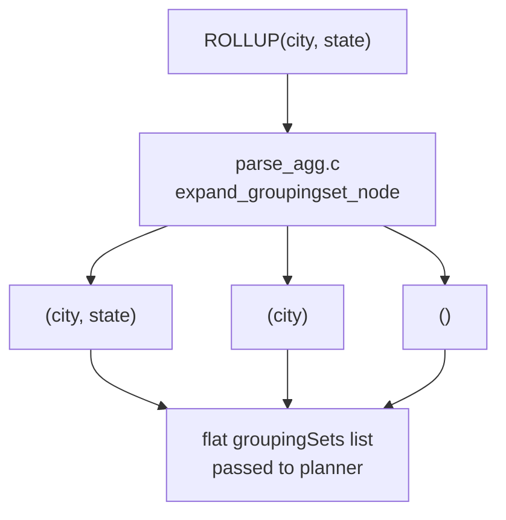

`GROUPING SETS` lets a single query produce results for multiple `GROUP BY` combinations in one pass, avoiding the boilerplate of writing several `GROUP BY` queries joined with `UNION ALL`. The extensions `ROLLUP` and `CUBE` are shorthand for the most common patterns — hierarchical subtotals and full cross-tabulation. The parser expands them into explicit `GROUPING SETS` lists before the planner ever sees them. Understanding how PostgreSQL represents, plans, and executes grouping sets is essential for writing efficient analytics queries and for interpreting `EXPLAIN` output when something is slower than expected.

## What GROUPING SETS does

`GROUP BY GROUPING SETS ((a, b), (a), ())` is semantically identical to:

```sql
SELECT a, b, agg(...) FROM t GROUP BY a, b
UNION ALL
SELECT a, NULL, agg(...) FROM t GROUP BY a
UNION ALL
SELECT NULL, NULL, agg(...) FROM t
```

Each element of the `GROUPING SETS` list names one `GROUP BY` variant to compute. PostgreSQL produces all of them in a single query execution. This lets the executor share sort and scan work across variants that share a common key prefix.

## ROLLUP: hierarchical subtotals

`ROLLUP(a, b, c)` generates N+1 grouping sets for N columns, each one dropping the rightmost key:

```
(a, b, c), (a, b), (a), ()
```

The empty set `()` is the grand total. This matches the natural hierarchy of reporting: drill down from grand total to region to city. For a three-column rollup you get four result bands, one per level of aggregation.

## CUBE: all subsets

`CUBE(a, b)` generates 2^N grouping sets — every possible subset of the listed columns:

```
(a, b), (a), (b), ()
```

Use `CUBE` when you want cross-tabulation: totals by each dimension independently, by every combination, and the overall total. Growth is exponential. `CUBE` with many columns produces enormous result sets quickly.

## Parse-time expansion

The parse phase turns `ROLLUP` and `CUBE` into flat `GROUPING SETS` lists before the query tree reaches the planner. The entry point is `expand_groupingset_node` in `src/backend/parser/parse_agg.c`, which dispatches on the `GroupingSet.kind` field:

- `GROUPING_SET_ROLLUP` iterates from the full column list down to the empty set, emitting one `GROUPING_SET_SIMPLE` node per level.
- `GROUPING_SET_CUBE` iterates over all 2^N bitmasks of the column list, emitting one node per subset.
- `GROUPING_SET_SETS` is the explicit `GROUPING SETS (...)` form; its children are already `GROUPING_SET_SIMPLE` nodes.

After expansion, `expand_grouping_sets` deduplicates the resulting list (respecting `DISTINCT`) and enforces a hard limit of 4096 grouping sets per query. By the time the planner receives the query tree, `groupingSets` contains only `GROUPING_SET_SIMPLE` and `GROUPING_SET_EMPTY` nodes. There is no `ROLLUP` or `CUBE` in the plan tree.



## Nullability and GROUPING()

When a column appears as `NULL` in a `GROUPING SETS` result row, there are two possible causes:

1. The column was not part of the grouping set for that row — PostgreSQL fills the output slot with `NULL`.
2. The column genuinely contained `NULL` in the source data.

These are visually indistinguishable. The `GROUPING(col)` function resolves the ambiguity. It returns a bitmask integer. Bit N is 1 if the Nth argument is not part of the grouping set for the current output row. A result of `0` means all listed columns are in the grouping set. Any other value identifies which columns were absent.

```sql
SELECT city, state, sum(sales),
       GROUPING(city, state) AS grp
FROM orders
GROUP BY ROLLUP(city, state);
```

- `grp = 0`: city and state are both grouped — leaf row.
- `grp = 1`: state is absent — subtotal per city (state bit set).
- `grp = 3`: both absent — grand total row.

Always use `GROUPING()` rather than `IS NULL` checks when distinguishing aggregate levels from genuine `NULL` data.

## Planner strategy: AGG_MIXED vs multiple branches

The planner chooses between two execution strategies for grouping sets, recorded in `Agg.aggstrategy` (type `AggStrategy`, defined in `src/include/nodes/plannodes.h`):

**AGG_MIXED — single sorted pass.** When all grouping sets share a common sort prefix (the most specific set's keys are a leading prefix of the sort order), the planner emits a single `Sort` followed by a single `Agg` node. That `Agg` node transitions between grouping sets as it scans the sorted input. This is the efficient path. The executor reads and sorts the data once, then resets its accumulators at each boundary.

**Multiple Sort+Agg branches under Append.** When the grouping sets have incompatible key orders — no shared prefix — the planner generates one `Sort -> Agg` subtree per grouping set and combines them with an `Append` node. Each branch reads and sorts the input independently. This multiplies I/O and CPU work.

`EXPLAIN` output for AGG_MIXED looks like:

```
Aggregate  (cost=...) (strategy: mixed)
  ->  Sort
        Sort Key: city, state
  ->  Seq Scan on orders
```

`EXPLAIN` output for the multi-branch path looks like:

```
Append
  ->  Aggregate
        ->  Sort  (Sort Key: city, state)
              ->  Seq Scan on orders
  ->  Aggregate
        ->  Sort  (Sort Key: city)
              ->  Seq Scan on orders
  ->  Aggregate
        ->  Seq Scan on orders
```

The [[code-paths/explain|EXPLAIN]] guide covers reading cost estimates across these shapes.

## Performance guidance

AGG_MIXED is strongly preferable. To encourage it:

- Order your `ROLLUP` or `GROUPING SETS` columns from most to least selective — the planner can then satisfy all grouping sets with one sort on the full key list.
- Provide an `ORDER BY` clause on the leading grouping columns if the query feeds a cursor or is part of a larger CTE — this steers the planner toward a compatible sort.
- Avoid `CUBE` with many columns. Six columns produces 64 grouping sets. Eight produces 256. The planner may fall back to multiple branches when the key orders diverge. Memory pressure from [[subsystems/executor/work-mem-and-spill|work_mem]] spills then multiplies across branches.

For exploratory analytics where only a few combinations matter, explicit `GROUPING SETS ((a,b),(a))` beats `CUBE(a,b)` — it tells the planner exactly which sets you need and avoids computing the rest.

## HAVING and FILTER with grouping sets

`HAVING` applies per grouping set, after aggregation. A `HAVING sum(sales) > 1000` clause filters rows from each grouping level independently. As a result, a city-level subtotal row can pass while the grand-total row fails (or vice versa).

`FILTER` on aggregate functions (`sum(sales) FILTER (WHERE region = 'North')`) works the same way it does in ordinary aggregation: the [[subsystems/executor/aggregate|aggregate]] executor evaluates the filter predicate before feeding each input row to the transition function. It interacts with grouping sets normally — the filter applies within each grouping level.

Be careful combining `HAVING` with `GROUPING()`. Since `GROUPING()` returns different values at each level, a `HAVING GROUPING(city) = 0` clause keeps only the most-granular rows. This discards the subtotals that `ROLLUP` was added to produce.

## Related Topics

- [[subsystems/executor/aggregate|Aggregate executor]] — transition functions, `build_pertrans_for_aggref`, hash vs. sort strategies
- [[subsystems/executor/group-by|Group-By execution]] — how sorted grouping advances the group boundary
- [[subsystems/planner/overview|Planner overview]] — where `AggStrategy` is chosen and costed
- [[subsystems/planner/cost-model|Cost model]] — how the planner prices sort + agg vs. multi-branch append
- [[subsystems/executor/sort|Sort node]] — the Sort that AGG_MIXED depends on
- [[subsystems/executor/work-mem-and-spill|work_mem and spill]] — memory limits that affect sort cost across branches
- [[code-paths/explain|EXPLAIN]] — reading strategy labels and cost estimates
- [[subsystems/executor/window-functions|Window functions executor]] — related SQL analytic feature sharing sort infrastructure
