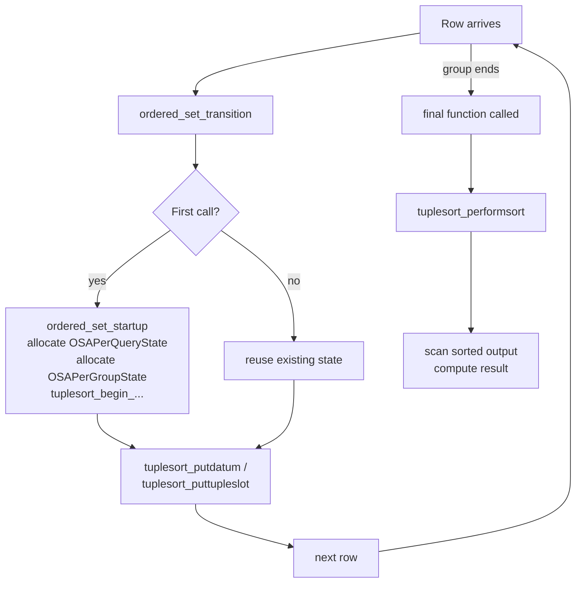

Ordered-set aggregates are a class of aggregate functions that require their input to arrive in a specific order before they can produce a result. In an ordinary aggregate, the transition function processes each input row as it arrives, and row order is irrelevant. An ordered-set aggregate works differently: it defers computation entirely until it has collected and sorted all rows. PostgreSQL encodes this in the catalog with `aggkind = 'o'` (`AGGKIND_ORDERED_SET`) or `aggkind = 'h'` (`AGGKIND_HYPOTHETICAL`) in `pg_aggregate`, distinguishing them from normal aggregates (`aggkind = 'n'`). The macro `AGGKIND_IS_ORDERED_SET(kind)` returns true for both variants.

## WITHIN GROUP syntax

Ordered-set aggregates use a dedicated SQL clause to carry the sort specification:

```sql
aggregate_name(direct_args) WITHIN GROUP (ORDER BY sort_expr [ASC|DESC] [NULLS {FIRST|LAST}] [, ...])
```

The `direct_args` (also called the *direct arguments*) are evaluated once per group, not once per row. They appear inside the aggregate call proper. The `WITHIN GROUP (ORDER BY ...)` clause defines the column(s) over which rows are sorted before the final function runs. The number of direct arguments is stored in `aggnumdirectargs` in `pg_aggregate`.

Because the sort specification is part of the aggregate call, not of the surrounding query, it is entirely independent from any `ORDER BY` on the outer `SELECT` or from window frame ordering. A `FILTER` clause may also appear after `WITHIN GROUP` and behaves identically to its use with ordinary aggregates: rows that do not satisfy the filter condition are never fed to the transition function.

```sql
-- Median salary, excluding contractors
SELECT percentile_cont(0.5) WITHIN GROUP (ORDER BY salary)
       FILTER (WHERE employment_type = 'full-time')
FROM employees;
```

## Built-in ordered-set aggregates

### percentile_disc

`percentile_disc(fraction) WITHIN GROUP (ORDER BY val)` returns the smallest value in the sorted set such that at least `fraction` of the rows are at or below it. It always returns an actual value from the input — there is no interpolation. The final function `percentile_disc_final` computes the 1-based row index as `ceil(fraction * N)` and retrieves that datum from the [[subsystems/executor/work-mem-and-spill|tuplesort]] by skipping `rownum - 1` entries forward. If `fraction = 0`, the function returns the first row. If `fraction = 1`, it returns the last.

An array-valued overload, `percentile_disc(float8[]) WITHIN GROUP (ORDER BY val)`, accepts multiple fractions in a single pass. `percentile_disc_multi_final` handles it.

### percentile_cont

`percentile_cont(fraction) WITHIN GROUP (ORDER BY val)` performs continuous interpolation: when the desired percentile falls between two consecutive sorted values, it linearly interpolates between them. The final function `percentile_cont_final_common` computes:

```
first_row  = floor(fraction * (N - 1))
second_row = ceil(fraction  * (N - 1))
proportion = fraction * (N - 1) - first_row
result     = first_val + proportion * (second_val - first_val)
```

When `first_row == second_row` (i.e., the fraction maps exactly onto a row), no interpolation is needed. Two type-specific wrappers delegate to the common code: `percentile_cont_float8_final` for `float8` and `percentile_cont_interval_final` for `interval`, each supplying a different lerp helper (`float8_lerp` or `interval_lerp`). Like `percentile_disc`, array-valued variants (`percentile_cont_float8_multi_final`, etc.) handle multiple fractions in one scan.

### mode

`mode() WITHIN GROUP (ORDER BY val)` returns the most frequent value in the set. The final function `mode_final` scans the sorted stream and counts consecutive runs of equal values, tracking which run is longest. `mode_final` breaks ties by position in the sort order: it returns the value that appears earliest among those with the maximum frequency. If the input is empty or all-NULL, the result is NULL.

## Hypothetical-set aggregates

Hypothetical-set aggregates are a closely related subtype (`aggkind = 'h'`). They answer the question: *if a hypothetical row with these values were inserted into the set, what would its rank be?* The hypothetical row's values are passed as direct arguments and are injected into the sort just before `tuplesort_performsort` is called, tagged with a sentinel column so the final function can identify it. Because the injection happens at final-function time and must alter the sort, hypothetical aggregates cannot share transition state between identical inputs the way non-hypothetical ordered-set aggregates can.

The four built-in hypothetical-set aggregates share the common helper `hypothetical_rank_common`:

| Function | Direct arg | Result type | Description |
|---|---|---|---|
| `rank(val, ...)` | Values matching `ORDER BY` | `bigint` | Rank with gaps (ties get the same rank; next rank skips) |
| `dense_rank(val, ...)` | Values matching `ORDER BY` | `bigint` | Rank without gaps |
| `percent_rank(val, ...)` | Values matching `ORDER BY` | `float8` | `(rank - 1) / N` |
| `cume_dist(val, ...)` | Values matching `ORDER BY` | `float8` | `rank / (N + 1)` |

`rank` and `percent_rank` sort the hypothetical row *ahead* of its peers (flag `-1`), so ties go to the peer rows. `cume_dist` sorts it *behind* its peers (flag `+1`). `dense_rank` requires a second pass through peers to count distinct values, handled by `hypothetical_dense_rank_final` independently of the common helper.

```sql
-- What rank would a salary of 95000 have?
SELECT rank(95000) WITHIN GROUP (ORDER BY salary DESC)
FROM employees;
```

## Implementation: two-level state and tuplesort

All ordered-set aggregates are implemented in `src/backend/utils/adt/orderedsetaggs.c` using two cooperating structs:

**`OSAPerQueryState`** — allocated once per query, lives in the executor's per-query [[subsystems/memory/contexts|memory context]]. It holds the sort descriptor (`tupdesc`), sort column metadata (operators, collations, null-ordering), and for datum-only sorts the type metadata (`sortColType`, `typLen`, `typByVal`). It also caches the equality function (`equalfn`) used by `mode_final`.

**`OSAPerGroupState`** — allocated once per aggregate group and returned as the `internal`-typed transition state. It contains a pointer back to `OSAPerQueryState`, the active `Tuplesortstate *sortstate`, the count of rows accumulated (`number_of_rows`), and a flag `sort_done` that prevents calling `tuplesort_performsort` twice (rescan uses `tuplesort_rescan` instead).

The transition functions `ordered_set_transition` (for single-column sorts) and `ordered_set_transition_multi` (for multi-column or hypothetical sorts) each call `ordered_set_startup` on first invocation to allocate these structures and begin a heap sort via `tuplesort_begin_datum` or `tuplesort_begin_heap`. Subsequent calls feed data with `tuplesort_putdatum` or `tuplesort_puttupleslot`. The actual sort runs only when the final function calls `tuplesort_performsort`.

This deferred-sort model means the sort happens inside the final-function call, not incrementally during the transition phase. The `aggfinalmodify` field in `pg_aggregate` is set to `'s'` (read-once) for most ordered-set aggregates. This indicates that the final function reads the sort output sequentially. The planner must not call it more than once per group unless it can rescan. `OSAPerGroupState.sort_done` tracks whether a rescan is possible.



## Parallelism

Ordered-set aggregates are **not parallelisable**. The reason is architectural: their transition state is of type `internal` (a pointer to `OSAPerGroupState`). None of them register an `aggcombinefn` in `pg_aggregate`. Without a combine function, the planner's `prepagg.c` sets `root->hasNonPartialAggs = true`. That prevents the generation of a partial-aggregation plan. Even if a combine function existed, the `OSAPerGroupState` carries a live `Tuplesortstate` that cannot be serialised across worker boundaries. There are no `aggserialfn` / `aggdeserialfn` entries either. Missing those entries sets `hasNonSerialAggs = true` for any `INTERNAL`-type aggregate that lacks them.

The practical consequence is that a query containing an ordered-set aggregate will not use a parallel gather plan for the aggregation stage. The scan beneath can still be parallel if the overall query permits it, but the aggregation node itself runs in the leader. This is visible through `EXPLAIN (ANALYZE)` — the `Aggregate` node will show no partial workers.

## Interaction with FILTER

The `FILTER (WHERE condition)` clause works with ordered-set aggregates the same way it does with ordinary ones: rows failing the filter are excluded before they reach the transition function. In `nodeAgg.c`, the filter expression is evaluated per row. Rows that do not pass are never passed to `ordered_set_transition`. The sort therefore contains only the filtered rows. `number_of_rows` reflects only those rows. This means, for example, that `percentile_cont(0.5)` with a restrictive `FILTER` computes the median of only the matching rows, not of the whole group.

## Related Topics

- [[sql-features/advanced-aggregation|Advanced Aggregation (GROUPING SETS, ROLLUP, FILTER)]]
- [[sql-features/window-functions|Window Functions]]
- [[sql-features/grouping-sets|GROUPING SETS, ROLLUP, and CUBE]]
- [[subsystems/executor/work-mem-and-spill|work_mem and Sort/Hash Spill]]
- [[subsystems/memory/contexts|Memory Contexts]]
- [[subsystems/planner/partial-aggregation|Aggregation Strategies: Hash, Sort, Partial]]
