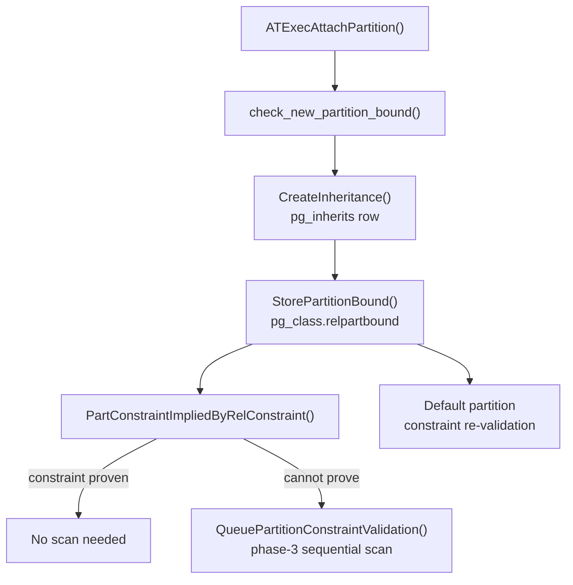
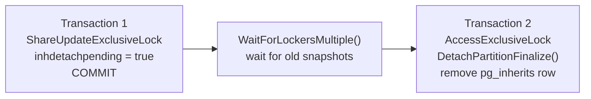
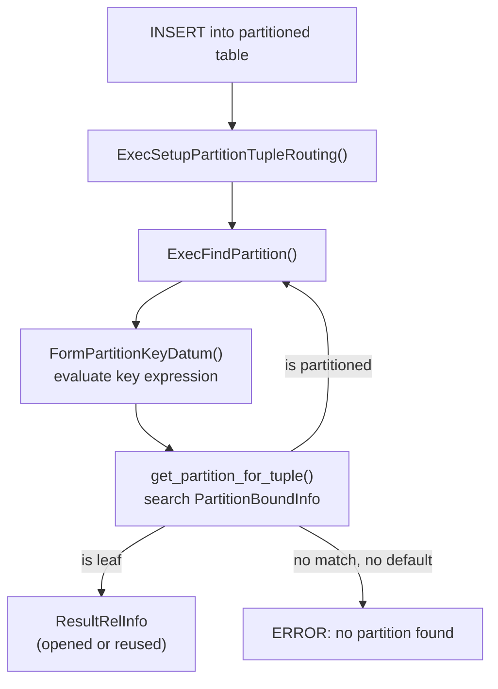

Declarative partitioning in PostgreSQL is controlled by a small set of DDL statements that share the same underlying catalog machinery. `CREATE TABLE … PARTITION BY` registers a table as a partitioned relation and records the partition key in `pg_partitioned_table`. `CREATE TABLE … PARTITION OF` and `ALTER TABLE … ATTACH PARTITION` both add children to that hierarchy. The former does so at creation time. The latter adopts an already-existing table. `ALTER TABLE … DETACH PARTITION` reverses the operation. Its `CONCURRENTLY` variant (introduced in PG 14) does so without holding an exclusive lock for the full duration. Together these statements form the lifecycle of a partition hierarchy. Understanding their internals is essential for diagnosing locking surprises, attachment scan costs, and runtime routing behaviour.

## PARTITION BY — Registering the Partition Key

`CREATE TABLE orders (…) PARTITION BY RANGE (created_at)` creates a table with `relkind = 'p'` (`RELKIND_PARTITIONED_TABLE`) in `pg_class`. The table has no heap storage of its own. It is a logical container whose sole function is to describe the partition scheme and serve as the parent of the inheritance chain.

After creating the relation, `DefineRelation()` (`tablecmds.c`) calls `transformPartitionSpec()` to resolve column references and expression trees in the partition key. It then calls `ComputePartitionAttrs()` to map those to attribute numbers and operator class OIDs. Finally, it calls `StorePartitionKey()`, which inserts a single row into `pg_partitioned_table`:

| Column | Type | Meaning |
|---|---|---|
| `partrelid` | `oid` | OID of the parent in `pg_class` |
| `partstrat` | `char` | Strategy: `'r'` RANGE, `'l'` LIST, `'h'` HASH |
| `partnatts` | `int2` | Number of key columns (max `PARTITION_MAX_KEYS` = 32) |
| `partdefid` | `oid` | OID of the DEFAULT partition, or zero |
| `partattrs` | `int2vector` | Attribute numbers; zero for expression-based keys |
| `partclass` | `oidvector` | Operator class OIDs for comparisons |
| `partcollation` | `oidvector` | Collation OIDs for string keys |
| `partexprs` | `pg_node_tree` | Serialised expression list; one entry per zero in `partattrs` |

The strategy constants are `PARTITION_STRATEGY_RANGE = 'r'`, `PARTITION_STRATEGY_LIST = 'l'`, and `PARTITION_STRATEGY_HASH = 'h'` (`parsenodes.h`). Expression-based keys (e.g., `PARTITION BY RANGE (date_trunc('month', ts))`) store zero in the corresponding `partattrs` slot and the serialised expression tree in `partexprs`.

The key must be immutable: `ComputePartitionAttrs()` rejects volatile functions, generated columns, and system columns. Only one DEFAULT partition can exist at a time. Attempting to create a second raises an error inside `check_new_partition_bound()`.

## PARTITION OF — Creating a Child at Definition Time

```sql
CREATE TABLE orders_2024 PARTITION OF orders
    FOR VALUES FROM ('2024-01-01') TO ('2025-01-01');
```

This is syntactic sugar that combines table creation with attachment. `DefineRelation()` processes the `stmt->partbound` field by calling `transformPartitionBound()` (to resolve expressions), `check_new_partition_bound()` (to verify there is no overlap with existing partitions), and — if a DEFAULT partition exists — `check_default_partition_contents()` to confirm no existing default-partition row would fall into the new bounds.

Once those checks pass, `StorePartitionBound()` serialises the `PartitionBoundSpec` node into `pg_class.relpartbound` using `nodeToString()`. `StoreCatalogInheritance()` adds a row to `pg_inherits` linking the child to its parent.

The bound specifications differ per strategy:

- **RANGE**: `FOR VALUES FROM (lower) TO (upper)`. Each bound is a list of datums (multi-column keys use a tuple). The special keywords `MINVALUE` and `MAXVALUE` represent negative and positive infinity without storing an actual datum.
- **LIST**: `FOR VALUES IN (v1, v2, …)`. Each element is a single key value. An `IN (NULL)` clause makes the partition accept NULL keys explicitly.
- **HASH**: `FOR VALUES WITH (MODULUS m, REMAINDER r)`. The row belongs here when `hash(key) % m = r`. All sibling partitions of a hash-partitioned table must share the same modulus (or a multiple of it to allow later subdivision).
- **DEFAULT**: `DEFAULT`. No bound values. This partition catches any row not matched by another partition.

## ATTACH PARTITION — Adopting an Existing Table

`ALTER TABLE parent ATTACH PARTITION child FOR VALUES …` re-parents an independent table as a partition. The entry point is `ATExecAttachPartition()` (`tablecmds.c`). The operation runs in three conceptual phases.

### Pre-flight checks

Before touching the catalog the function:

1. Locks the DEFAULT partition (if one exists) with `AccessExclusiveLock`, because attaching a new partition changes the DEFAULT partition's implied constraint.
2. Locks the table to be attached with `AccessExclusiveLock`.
3. Checks that the table is not already a partition, is not a typed table, is not part of any inheritance chain as a child or parent, has no identity columns, and has no row-level triggers with transition tables.
4. Calls `check_new_partition_bound()` to verify the new bounds do not overlap any existing sibling.

### Catalog updates

`CreateInheritance()` inserts the `pg_inherits` row. `StorePartitionBound()` writes `relpartbound` and sets `relispartition = true` in `pg_class`. `AttachPartitionEnsureIndexes()` creates matching indexes on the child for every index on the partitioned parent. `CloneRowTriggersToPartition()` and `CloneForeignKeyConstraints()` propagate triggers and foreign-key constraints.

### Constraint validation scan

The attachment generates a partition constraint — the boolean expression that every row in the child must satisfy — by calling `get_qual_from_partbound()`. Before the constraint can be trusted, PostgreSQL must verify that all existing rows in the child satisfy it. PostgreSQL queues this as a phase-3 work item via `QueuePartitionConstraintValidation()`.

PostgreSQL skips the scan when `PartConstraintImpliedByRelConstraint()` can prove the constraint holds without a scan. That function collects the table's existing `CHECK` constraints and NOT NULL column constraints, then calls `predicate_implied_by()` to test whether they logically imply the new partition constraint. If they do — for example, the table already has `CHECK (created_at >= '2024-01-01' AND created_at < '2025-01-01')` — no scan is needed. If they do not, PostgreSQL queues a full sequential scan. This scan runs at phase 3 under `ShareUpdateExclusiveLock` on the parent (not `AccessExclusiveLock`), so concurrent reads and inserts to other partitions are not blocked.



### DEFAULT partition interaction

If a DEFAULT partition exists, attaching any non-default partition tightens the implicit constraint on the DEFAULT partition: the DEFAULT can no longer accept rows that fall in the newly attached range or list. `ATExecAttachPartition()` therefore also calls `QueuePartitionConstraintValidation()` on the DEFAULT partition (with `validate_default = true`). This queues a scan to confirm the DEFAULT partition holds no rows that should have gone to the new partition. This scan can be expensive on large default partitions.

## DETACH PARTITION — Removing a Child from the Hierarchy

`ALTER TABLE parent DETACH PARTITION child` takes an `AccessExclusiveLock` on both the parent and the child, removes the `pg_inherits` row via `RemoveInheritance()`, clears `pg_class.relpartbound`, and resets `relispartition = false`. The operation is atomic within a single transaction but blocks all access to both relations for its duration.

### DETACH … CONCURRENTLY (PG 14+)

The concurrent variant (`ATExecDetachPartition()` with `concurrent = true`) uses a two-transaction protocol to avoid holding an exclusive lock for the scan phase:

**Transaction 1:**
1. Takes `ShareUpdateExclusiveLock` on the partition (not `AccessExclusiveLock`), allowing ongoing reads and DML to continue.
2. Calls `MarkInheritDetached()`, which sets `pg_inherits.inhdetachpending = true` on the relevant row. Any backend that subsequently builds a partition descriptor will omit this partition when `omit_detached = true` is passed to `RelationGetPartitionDesc()`. As a result, new queries will not route to it.
3. For non-hash strategies, `DetachAddConstraintIfNeeded()` materialises the partition's implicit partition constraint as an explicit `CHECK` constraint on the child table. This ensures the child can stand alone after full detachment.
4. Commits, making the `inhdetachpending` flag visible to all backends.

**Transaction 2:**
1. Calls `WaitForLockersMultiple()` on the parent relation, waiting until all transactions that might have seen the partition as attached are gone.
2. Takes `AccessExclusiveLock` on the now-isolated child.
3. Calls `DetachPartitionFinalize()`, which removes the `pg_inherits` row entirely and clears `relpartbound`.



If transaction 2 is interrupted after transaction 1 commits, the partition is left with `inhdetachpending = true` and a redundant check constraint. Re-running `ALTER TABLE parent DETACH PARTITION child FINALIZE` calls `ATExecDetachPartitionFinalize()` to complete the operation.

A key restriction: `DETACH … CONCURRENTLY` is not allowed when a DEFAULT partition exists. The DEFAULT partition's constraint would change, and there is no safe way to handle rows being inserted into the detached range during the window between the two transactions.

## The pg_inherits Chain and Partition Descriptor

PostgreSQL represents every partition relationship, whether created by `PARTITION OF` or `ATTACH PARTITION`, as a row in `pg_inherits` with `(inhparent, inhrelid, inhseqno)`. The same catalog serves classical table inheritance. What distinguishes partition children is `relispartition = true` on the child and a non-null `relpartbound`.

`RelationBuildPartitionDesc()` (`partdesc.c`) reads all `pg_inherits` rows for a given parent, parses each child's `relpartbound` back from its serialised form, and calls `partition_bounds_create()` (`partbounds.c`) to construct an in-memory `PartitionBoundInfo` sorted for fast lookup. The resulting `PartitionDesc` is cached in the relation's relcache entry.

`RelationGetPartitionDesc()` automatically passes `omit_detached = true` for executor calls. In that mode, the function excludes any partition with `inhdetachpending = true` whose `pg_inherits.xmin` is visible to the current snapshot. This is what makes concurrent detach safe: once transaction 1 commits, new planners and routers ignore the departing partition.

The [[subsystems/planner/overview|planner]] traverses `pg_inherits` transitively when building Append paths for a partitioned table, using the partition descriptor at each level to generate pruning steps. Details of the pruning algorithm are in [[subsystems/partitioning/partition-pruning]].

## Partition Routing at INSERT Time

When PostgreSQL inserts a row into a partitioned table, the executor must find the leaf partition that should receive it. `ExecFindPartition()` (`execPartition.c`), called from the `ModifyTableState` node, handles this.

`ExecSetupPartitionTupleRouting()` builds a `PartitionTupleRouting` structure that owns an array of `PartitionDispatch` objects — one per partitioned level in the hierarchy. Each `PartitionDispatch` holds the `PartitionDesc` for that level together with expression-evaluation state for the partition key.

`ExecFindPartition()` then:

1. Evaluates the partition key against the incoming tuple slot using `FormPartitionKeyDatum()`, producing an array of `Datum` values.
2. Calls `get_partition_for_tuple()` to search `PartitionBoundInfo`: binary search over sorted datums for RANGE and LIST, modular hash lookup for HASH.
3. If the result index is a partitioned table itself (a sub-partitioned child), the loop descends into that level using its own `PartitionDispatch`.
4. When a leaf is reached, opens the corresponding `ResultRelInfo` (or reuses one from a cache) and returns it.

If no partition matches and no DEFAULT exists, the function raises `ERROR: no partition of relation "…" found for row`. This is the error that appears when data is inserted outside all defined ranges without a catch-all DEFAULT partition.



PostgreSQL allocates `PartitionDispatch` objects lazily: it does not initialise a child's `PartitionDispatch` until the first row that reaches that sub-level. For workloads that insert into many partitions this amortises the setup cost, but it means the first insert to a new sub-partition in a session pays a slightly higher cost.

## PG 12 Changes: enable_partition_pruning

Before PG 12, declarative partitioning had no runtime pruning. The planner could only prune at plan time, and even that required the `constraint_exclusion` GUC. PG 12 introduced the `enable_partition_pruning` GUC (default `on`) and moved all partition-aware pruning logic into `partprune.c`, separate from the generic constraint-exclusion path.

Setting `enable_partition_pruning = off` disables both plan-time and runtime pruning for declarative partitions. The planner still builds an Append over all partitions but does not generate any `PartitionPruneInfo` nodes. The older `constraint_exclusion` GUC continues to apply to non-declarative (old-style inheritance) partitioning and to CHECK constraints on plain tables. It has no effect on declarative partition pruning when `enable_partition_pruning` is active.

The key distinction between the two mechanisms: constraint exclusion works by calling `predicate_implied_by()` on the table's CHECK constraints for each child — a general but relatively expensive test run at planning time only. Partition pruning uses the structured bound information in `PartitionBoundInfo` directly, is much faster, and can operate at both plan time and execution time.

## Related Topics

- [[subsystems/partitioning/overview|Table Partitioning]] — the full picture of declarative partitioning including pruning, routing, and partition-wise operations
- [[subsystems/partitioning/partition-pruning|Partition Pruning]] — how `partprune.c` converts WHERE clauses into pruning steps and evaluates them against partition bounds
- [[subsystems/partitioning/partitioned-indexes|Partitioned Indexes]] — how `CREATE INDEX` on a partitioned table creates and attaches child indexes, and the role of `AttachPartitionEnsureIndexes()`
- [[subsystems/catalog/pg-class|pg_class]] — the `relkind`, `relispartition`, and `relpartbound` columns that mark partitioned relations
- [[subsystems/catalog/ddl-locking|DDL Locking]] — lock levels taken by ATTACH and DETACH and their concurrency implications
- [[subsystems/planner/constraint-exclusion|Constraint Exclusion]] — the older `predicate_implied_by()`-based approach that ATTACH uses to skip the validation scan
- [[code-paths/create-table|CREATE TABLE]] — the full `DefineRelation()` code path that both `PARTITION BY` and `PARTITION OF` go through
- [[code-paths/insert|INSERT]] — the full INSERT execution path that calls `ExecFindPartition()`
