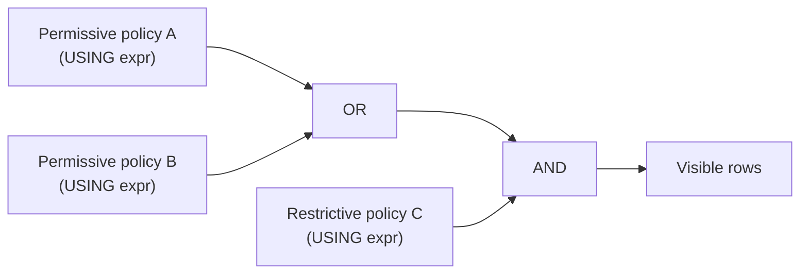

`CREATE POLICY`, `ALTER POLICY`, and `DROP POLICY` are the DDL commands that define, modify, and remove the row-level security policies that govern which rows a session can read or write. These commands operate at the policy-definition layer. The actual enforcement happens during query rewrite, when [[subsystems/row-level-security|row-level security]] injects filter expressions derived from the stored policy definitions into every relevant query. This page focuses on the DDL interface and catalog representation. The enforcement mechanics are described in [[subsystems/row-level-security|Row-Level Security]].

## Relationship to RLS on the Table

A policy definition has no effect unless RLS is enabled on its target table. Enabling RLS is a separate step performed by the table owner:

```sql
ALTER TABLE orders ENABLE ROW LEVEL SECURITY;
```

This sets `relrowsecurity = true` in `pg_class`. The `check_enable_rls()` function in `src/backend/utils/misc/rls.c` reads this flag early in query rewrite and short-circuits all policy evaluation when it is false. Enabling RLS with no policies defined produces a default-deny state: `add_security_quals()` in `rowsecurity.c` injects a literal `false` constant as a security qualifier, so no rows are visible to anyone subject to RLS.

The two flags in `pg_class` that govern this:

| Flag | Set by | Meaning |
|---|---|---|
| `relrowsecurity` | `ENABLE ROW LEVEL SECURITY` | Activate policy filtering |
| `relforcerowsecurity` | `FORCE ROW LEVEL SECURITY` | Apply policies even to the table owner |

Dropping all policies from a table does not disable RLS. Disabling RLS requires an explicit `ALTER TABLE ... DISABLE ROW LEVEL SECURITY` statement.

## CREATE POLICY

`CREATE POLICY` inserts a row into the `pg_policy` system catalog and registers dependency records. The implementation lives in `CreatePolicy()` in `src/backend/commands/policy.c`. It acquires `AccessExclusiveLock` on the target table (through `RangeVarGetRelidExtended()` with `RangeVarCallbackForPolicy()`) and validates that the target is an ordinary or partitioned table owned by the current user.

```sql
CREATE POLICY name ON table_name
    [ AS { PERMISSIVE | RESTRICTIVE } ]
    [ FOR { ALL | SELECT | INSERT | UPDATE | DELETE } ]
    [ TO { role_name | PUBLIC | CURRENT_ROLE | CURRENT_USER | SESSION_USER } [, ...] ]
    [ USING ( using_expression ) ]
    [ WITH CHECK ( check_expression ) ];
```

### Policy Name

The name must be unique per table. `CreatePolicy()` scans `pg_policy` using the `PolicyPolrelidPolnameIndexId` index (on `(polrelid, polname)`) before inserting. A duplicate name raises `ERRCODE_DUPLICATE_OBJECT`. The stored column is `polname` (type `name`).

### Target Table (ON)

Only ordinary tables (`RELKIND_RELATION`) and partitioned tables (`RELKIND_PARTITIONED_TABLE`) are accepted. Views, foreign tables, and sequences are rejected. The callback `RangeVarCallbackForPolicy()` enforces this. Policy rows reference the table via `polrelid` (`pg_class.oid`). `CreatePolicy()` records `DEPENDENCY_AUTO` so that dropping the table cascades to its policies.

### Permissive vs. Restrictive (AS)

The `polpermissive` boolean in `pg_policy` (set from `stmt->permissive`) controls how a policy combines with others at enforcement time:

- **Permissive** (default): the USING expressions from all applicable permissive policies are combined with `OR`. A row is visible if any permissive policy allows it.
- **Restrictive**: the USING expressions from restrictive policies are ANDed onto the combined permissive result. A row must pass the permissive union AND every restrictive policy.

The combining logic is implemented in `add_security_quals()` (`rowsecurity.c`). Critically, if there are no permissive policies applicable to the current user and command, `add_security_quals()` inserts a literal `false` constant regardless of any restrictive policies — a table with only restrictive policies returns no rows.



### Target Command (FOR)

`parse_policy_command()` converts the SQL keyword to a single character stored in `polcmd`:

| SQL keyword | `polcmd` value |
|---|---|
| `ALL` | `'*'` |
| `SELECT` | `ACL_SELECT_CHR` (`'r'`) |
| `INSERT` | `ACL_INSERT_CHR` (`'a'`) |
| `UPDATE` | `ACL_UPDATE_CHR` (`'w'`) |
| `DELETE` | `ACL_DELETE_CHR` (`'d'`) |

The enforcement code in `get_policies_for_relation()` filters `pg_policy` rows by matching `polcmd` against the command being executed.

### Target Roles (TO)

The `polroles` column is an `oid[]` array of role OIDs. An absent `TO` clause defaults to `PUBLIC` (represented as a zero OID in the array, `ACL_ID_PUBLIC`). At enforcement time, `check_role_for_policy()` iterates over `polroles` and returns true if the current user is any of those roles (or if the array contains `PUBLIC`). `policy_role_list_to_array()` constructs the array from the role list. Non-public roles receive a `SHARED_DEPENDENCY_POLICY` dependency so that dropping a role that is the sole target of a policy raises a dependency error.

### USING Expression

`USING (expr)` provides the row-visibility filter for existing rows. It applies to `SELECT`, `UPDATE`, and `DELETE`. Rows for which the expression evaluates to false or null are silently invisible — queries behave as though those rows do not exist. `transformWhereClause()` transforms the expression with `EXPR_KIND_POLICY` and stores it as a `pg_node_tree` in `polqual`. Enforced as a security qualifier on the RTE's `securityQuals` list during rewrite.

`SELECT` and `DELETE` policies may only have `USING` — `CreatePolicy()` rejects `WITH CHECK` with `ERRCODE_SYNTAX_ERROR`. `INSERT` policies may only have `WITH CHECK` — `CreatePolicy()` also rejects a `USING` clause for an `INSERT` policy.

### WITH CHECK Expression

`WITH CHECK (expr)` validates new or modified row content for `INSERT` and `UPDATE`. It runs after a new row has been constructed but before the row is written. Unlike `USING`, a violation here is not silent: the operation fails with an error. This asymmetry is intentional: invisible rows avoid leaking data, but silent data loss on write would be difficult to diagnose.

If a policy for `UPDATE` specifies only a `USING` clause (no `WITH CHECK`), PostgreSQL also applies the USING expression as the write-time check. `CreatePolicy()` stores the with-check expression in `polwithcheck` in `pg_policy`.

```sql
-- USING hides rows silently; WITH CHECK rejects writes loudly
CREATE POLICY tenant_select ON orders
    FOR SELECT
    USING (tenant_id = current_setting('app.tenant')::int);

CREATE POLICY tenant_insert ON orders
    FOR INSERT
    WITH CHECK (tenant_id = current_setting('app.tenant')::int);
```

## ALTER POLICY

`ALTER POLICY` modifies an existing policy's role list, USING expression, or WITH CHECK expression. The implementation is `AlterPolicy()` in `policy.c`. It also acquires `AccessExclusiveLock` on the target table and uses the same `PolicyPolrelidPolnameIndexId` index to locate the existing policy row.

```sql
ALTER POLICY name ON table_name
    [ RENAME TO new_name ]
    [ TO { role_name | PUBLIC | CURRENT_ROLE | CURRENT_USER | SESSION_USER } [, ...] ]
    [ USING ( using_expression ) ]
    [ WITH CHECK ( check_expression ) ];
```

`ALTER POLICY` cannot change the `AS` (permissive/restrictive) or `FOR` (command) attributes. Those are immutable after creation and require `DROP POLICY` followed by `CREATE POLICY`. This constraint is not enforced with a special error — those fields simply are not part of the `AlterPolicyStmt` structure.

A separate function, `rename_policy()` in `policy.c`, handles renaming. It performs two index scans: one to detect a name conflict with the proposed new name, and a second to locate and update the existing row.

When `AlterPolicy()` updates the qual or with-check expressions, it calls `deleteDependencyRecordsFor()` to remove the existing expression dependencies, then re-records them. This ensures that functions or types referenced in policy expressions are properly tracked.

## DROP POLICY

`DROP POLICY` removes a policy from `pg_policy`. `RemovePolicyById()` in `policy.c` performs the catalog-level deletion. The standard dependency-dropping path invokes it. It takes `AccessExclusiveLock` on the table, deletes the `pg_policy` row with `CatalogTupleDelete()`, and invalidates the relation cache entry so that subsequent queries immediately see the changed policy set.

```sql
DROP POLICY [ IF EXISTS ] name ON table_name [ CASCADE | RESTRICT ];
```

A critical operational point: dropping the last policy on a table that has RLS enabled does not disable RLS. The table reverts to the default-deny state — all rows become invisible to users subject to RLS. This is often surprising when policies are being rotated. The correct procedure is either to create the replacement policy before dropping the old one, or to temporarily disable RLS if the table must remain readable during the transition.

## The pg_policy Catalog

PostgreSQL stores all policy definitions in `pg_policy` (OID 3256, `PolicyRelationId`), defined in `src/include/catalog/pg_policy.h`:

| Column | Type | Description |
|---|---|---|
| `oid` | `oid` | Policy OID |
| `polname` | `name` | Policy name (unique per table) |
| `polrelid` | `oid` | OID of the target relation (`pg_class`) |
| `polcmd` | `char` | Command: `'*'` `'r'` `'a'` `'w'` `'d'` |
| `polpermissive` | `bool` | `true` = permissive, `false` = restrictive |
| `polroles` | `oid[]` | Roles; zero OID means `PUBLIC` |
| `polqual` | `pg_node_tree` | USING expression (nullable) |
| `polwithcheck` | `pg_node_tree` | WITH CHECK expression (nullable) |

Two unique indexes exist: `PolicyOidIndexId` on `(oid)` and `PolicyPolrelidPolnameIndexId` on `(polrelid, polname)`. All policy-lookup operations in `policy.c` use the second index.

`get_policies_for_relation()` (`rowsecurity.c`) queries the catalog at query-rewrite time and builds in-memory `RowSecurityPolicy` structs from the catalog rows. PostgreSQL caches these structs on the relation's `rd_rsdesc` field in `RelCache` and invalidates them whenever a policy DDL command issues `CacheInvalidateRelcache()`.

## Superuser and BYPASSRLS Bypass

`check_enable_rls()` in `src/backend/utils/misc/rls.c` determines whether RLS applies before any policy expressions are evaluated:

1. Roles with the `BYPASSRLS` attribute (including superusers, who always have it) return `RLS_NONE_ENV` — policies are not applied. The plan is still sensitive to this decision so caches are correctly invalidated if the role changes.
2. The table owner returns `RLS_NONE_ENV` unless `relforcerowsecurity` is set (`FORCE ROW LEVEL SECURITY`). With `FORCE ROW LEVEL SECURITY`, the owner is subject to policies just like other users.
3. All other users return `RLS_ENABLED`. PostgreSQL then injects the policy expressions into the query.

The `row_security` GUC provides a session-level escape hatch: if it is set to `off` and RLS would apply, the query raises an error rather than silently filtering rows. Administrators can use this to learn explicitly when RLS affects their query, rather than receiving a potentially incomplete result set.

Granting `BYPASSRLS` requires superuser privilege and is managed via [[subsystems/roles-privileges|roles and privileges]] DDL:

```sql
ALTER ROLE reporting_user BYPASSRLS;
```

## Related Topics

- [[subsystems/row-level-security|Row-Level Security]] — enforcement mechanics, USING/WITH CHECK semantics, policy combining logic
- [[subsystems/roles-privileges|Roles and Privileges]] — BYPASSRLS attribute, role membership, privilege checking
- [[subsystems/rewriter/overview|Query Rewriter]] — where RLS quals are injected into the query tree
