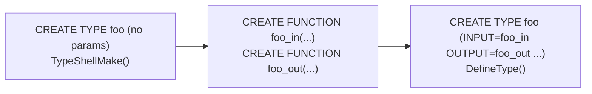

# CREATE TYPE and CREATE DOMAIN DDL

`CREATE TYPE` and `CREATE DOMAIN` are the two DDL statements that register new types in the [[subsystems/catalog/core-catalogs|pg_type catalog]]. They cover four distinct flavors of user-defined type — enum, composite, range, and base (shell) — plus a fifth mechanism for layering constraints on an existing type via `CREATE DOMAIN`. Each flavor ends up as a row in `pg_type` with a different `typtype` discriminator. Some flavors also write additional rows into specialized satellite catalogs. The common workhorse is `TypeCreate()` in `src/backend/catalog/pg_type.c`. The flavor-specific wrappers (`DefineEnum`, `DefineRange`, `DefineCompositeType`, `DefineDomain`, `DefineType`) in `src/backend/commands/typecmds.c` prepare arguments and handle satellite catalog entries before calling it.

## CREATE TYPE AS ENUM

An enum type is a statically ordered set of string labels. `DefineEnum()` creates one `pg_type` row with `typtype = 'e'` (`TYPTYPE_ENUM`). It then calls `EnumValuesCreate()` to insert one row per label into [[subsystems/types/enum-internals|pg_enum]].

`pg_enum` has three meaningful columns:

| Column | Role |
|--------|------|
| `oid` | The OID used as the physical storage value for this label |
| `enumtypid` | Foreign key to `pg_type` |
| `enumsortorder` | A `float4` sort key that determines comparison order |
| `enumlabel` | The text of the label |

Enum values are stored and compared by OID, not by text. The initial labels receive consecutive integer `enumsortorder` values (1, 2, 3, …). Two unique indexes enforce that `(enumtypid, enumlabel)` and `(enumtypid, enumsortorder)` are each unique.

Adding a value with `ALTER TYPE ... ADD VALUE` calls `AddEnumLabel()` in `pg_enum.c`. `AddEnumLabel()` computes the new label's `enumsortorder` to fall between its neighbors using floating-point arithmetic. If the gap between adjacent `enumsortorder` values is too small to insert a new float4 without collision, the code triggers `RenumberEnumType()`. This function rewrites all existing rows with fresh integer spacing. The `BEFORE` / `AFTER` placement clause (available since the syntax was introduced) is encoded as a neighbor label plus a boolean `newValIsAfter` flag. Both are threaded through `AlterEnumStmt` in the parse tree to `AddEnumLabel()`.

A newly added label has a transaction-safety restriction. It cannot be used in the same transaction that added it. This restriction holds as long as that transaction might still abort. Rolling back the transaction would delete the label, but the value might already be stored in heap tuples visible to other backends. `EnumUncommitted()` checks whether a given enum OID was created or extended in the current transaction. The executor calls it to reject unsafe uses.

## CREATE TYPE AS COMPOSITE

A composite type is a row of named, typed fields. `DefineCompositeType()` delegates almost entirely to `DefineRelation()` with `relkind = RELKIND_COMPOSITE_TYPE`. This means a composite type is represented by a `pg_class` entry (with no physical storage pages) whose columns are `pg_attribute` rows. It also has a single `pg_type` row with `typtype = 'c'` (`TYPTYPE_COMPOSITE`) and `typrelid` pointing back to that `pg_class` entry.

This duality — every table and every named composite type has both a `pg_class` entry and a `pg_type` entry — is a fundamental PostgreSQL design choice. When a table is created, the system creates a composite type for its row type at the same time. The consequence is that the row type of a table can be used anywhere PostgreSQL accepts a type name: as a function return type, as a column type in another table, as a PL/pgSQL variable type, and in `CAST` expressions.

Column definitions live in `pg_attribute` rows associated with the `pg_class` entry. `lookup_type_cache()` in `typcache.c` caches a `TupleDesc` for composite types when `TYPECACHE_TUPDESC` is requested. This lets record-handling functions like `record_eq()` and `hash_record()` avoid re-fetching the tuple descriptor on every call. `ALTER TABLE` or `ALTER TYPE` invalidates the cached `TupleDesc`, via the cache invalidation machinery, whenever it modifies the column layout.

## CREATE TYPE AS RANGE

A range type represents a contiguous span of values of some subtype. `DefineRange()` creates three related types in one DDL statement:

1. The range type itself (`typtype = 'r'`, `TYPTYPE_RANGE`).
2. An implicit array type for the range (e.g., `int4range[]`).
3. A multirange type (`typtype = 'm'`, `TYPTYPE_MULTIRANGE`, added in PG 14) and its own array type.

The subtype is required; `DefineRange()` rejects pseudotypes as subtypes. All range-specific metadata goes into a row in `pg_range`:

| Column | Purpose |
|--------|---------|
| `rngtypid` | OID of the range type |
| `rngsubtype` | OID of the subtype |
| `rngmultitypid` | OID of the automatically created multirange type |
| `rngcollation` | Collation for the subtype, if collatable |
| `rngsubopc` | B-tree opclass used for subtype comparisons |
| `rngcanonical` | Optional canonicalization function |
| `rngsubdiff` | Optional subtype difference function |

The **canonical function** normalizes range bounds to a canonical form. It is required when the subtype is discrete (integers, dates). The built-in `int4range`, for example, uses `int4range_canonical`. A canonical function must accept and return the range type being defined. This means the range type itself must exist before the function can be created. Hence, specifying a canonical function requires a pre-existing shell type.

The **subtype_diff function** accepts two subtype values and returns a `float8` measuring their distance. Range GiST and SP-GiST indexes use it to estimate selectivity. Without it, the planner uses conservative heuristics. The function signature is `(subtype, subtype) → float8`.

`lookup_type_cache()` caches range metadata in `TypeCacheEntry` fields `rngelemtype`, `rng_opfamily`, `rng_cmp_proc_finfo`, `rng_canonical_finfo`, and `rng_subdiff_finfo` when `TYPECACHE_RANGE_INFO` is requested. For multirange types, `lookup_type_cache()` caches the `rngtype` back-pointer under `TYPECACHE_MULTIRANGE_INFO`.

The multirange type's name defaults to the range name prefixed with `_` in the same namespace, but can be overridden with the `multirange_type_name` parameter to `CREATE TYPE AS RANGE`. PostgreSQL 14 introduced multirange support; earlier versions have no `rngmultitypid` column in `pg_range`.

## Shell types (CREATE TYPE with no parameters)

A shell type is a placeholder row in `pg_type` with `typisdefined = false`. It exists so that C-language I/O functions for a base type can reference the type OID in their `pg_proc` signatures. That reference has to be possible before the full `CREATE TYPE` definition is issued. `TypeShellMake()` in `pg_type.c` inserts this placeholder row. The row has `typtype = TYPTYPE_PSEUDO` as extra insurance against accidental use, dummy storage properties copied from `int4`, and the stub I/O functions `shell_in` and `shell_out`. When the full `CREATE TYPE` command follows, `DefineType()` detects the existing shell row. It overwrites the row in-place with the real attributes and flips `typisdefined` to `true`.

The typical workflow is:

A canonical function for a range type similarly requires a pre-existing shell of the range type, for the same reason. The function's argument type must be declared before the function can be created.

## CREATE DOMAIN

A domain is a named constraint layer over an existing base type. `DefineDomain()` accepts any `typtype` other than pseudo as the underlying type, including enums, composites, ranges, multiranges, and other domains. It creates one `pg_type` row with `typtype = 'd'` (`TYPTYPE_DOMAIN`). It also copies all storage properties from the base type:

- `typlen`, `typbyval`, `typalign`, `typstorage` — inherited unchanged.
- `typinput`, `typoutput`, `typreceive`, `typsend` — `DefineDomain()` inherits the output and send functions unchanged. It overrides the input and receive functions with `domain_in` and `domain_recv`, which apply constraint checks after the underlying I/O.
- `typbasetype` — set to the base type's OID.
- `typtypmod` — the typmod of the base type, if parameterized (e.g., `varchar(20)`).
- `typnotnull` — set to `true` when a `NOT NULL` constraint is declared.

Constraints are stored in `pg_constraint` rows with `contypid` = domain OID and `contype = 'c'` (CHECK) or `contype = 'n'` (NOT NULL). `domainAddCheckConstraint()` and `domainAddNotNullConstraint()` create these rows after the `pg_type` row exists, because the constraint rows need to reference the domain's OID. PostgreSQL stores the constraint expression as a `nodeToString` representation in `pg_constraint.conbin`.

Domain constraint checking happens at value assignment time. The special input function `domain_in` calls `ExecEvalConstraintCheck()` (via a compiled expression state containing `EEOP_DOMAIN_CHECK` steps) for every constraint on the domain and its ancestors. This is the `CoerceToDomain` execution node. Any assignment that would coerce a value to a domain type compiles to a `CoerceToDomain` expression. At execution time, this expression evaluates each constraint and raises an error if one fails. The constraint expression refers to the domain value via a `CoerceToDomainValue` placeholder node, not a `Var`.

When a domain is based on another domain, the full constraint chain is the union of all constraints at every level. `DefineDomain()` does not duplicate ancestor constraints into the child domain's `pg_constraint` rows. They remain in their respective ancestors' rows. PostgreSQL re-fetches them at constraint evaluation time through the domain chain.

Domains also inherit the base type's operators and index support: a column declared as a domain over `int4` supports all `int4` operators. It can also be indexed with a B-tree index. The planner resolves operators against the domain by unwrapping the domain chain to reach the base type.

## Type OIDs: built-ins vs. user-defined

Every PostgreSQL type has an OID. The OIDs of built-in types such as `int4` (OID 23) and `text` (OID 25) are hardcoded in the catalog `.dat` files. They are then compiled into the binary. These OIDs fall below `FirstNormalObjectId` (16384 in `src/include/access/transam.h`). Specifically:

- OIDs 1–9999 are manually assigned in the `.dat` source files.
- OIDs 10000–11999 are assigned by `genbki.pl` for catalog entries that do not specify an OID.
- OIDs 12000–16383 are assigned during `initdb` post-bootstrap processing.

User-created types receive OIDs from the normal OID generator, starting at 16384 and increasing. These OIDs are not portable across installations; `pg_dump` captures types by name and schema, not by OID.

## The type cache (TypeCacheEntry)

`lookup_type_cache()` in `typcache.c` maintains a process-local hash table of `TypeCacheEntry` structs, keyed by type OID. The cache is populated lazily: a caller requests specific information by ORing together `TYPECACHE_*` flag constants. `lookup_type_cache()` then fetches only the requested fields from the system catalogs. Once populated, entries live for the lifetime of the backend — there is no eviction. If the underlying `pg_type` row changes (detected via syscache invalidation), a syscache invalidation callback clears the `TCFLAGS_HAVE_PG_TYPE_DATA` flag. `lookup_type_cache()` then re-fetches the core fields on next access.

For composite types, the cached `TupleDesc` is reference-counted. It also carries a `tupDesc_identifier`. This value changes whenever the descriptor is rebuilt. This lets callers that cache the descriptor externally detect staleness. For domain types, `domainData` points to a `DomainConstraintCache` holding a compiled expression tree for all constraints in the domain chain. This cache is rebuilt whenever `pg_constraint` rows for the domain are invalidated.

## Related Topics

- [[subsystems/types/enum-internals|Enum Type Internals]] — pg_enum catalog, sort order, uncommitted enum values
- [[subsystems/types/composite-types|Composite Types]] — row type duality, TupleDesc caching, anonymous records
- [[subsystems/types/range-types|Range and Multirange Types]] — RangeType storage, GiST/SP-GiST support, multirange operators
- [[subsystems/types/domains|Domain Types]] — domain constraint evaluation, CoerceToDomain, domain chain
- [[subsystems/types/base-types|Base Types]] — full base type DDL, TypeCreate parameters, type categories
- [[subsystems/catalog/core-catalogs|Core System Catalogs]] — pg_type schema, typtype values, catalog organization
- [[subsystems/constraints|Constraints]] — pg_constraint catalog, CHECK and NOT NULL enforcement
