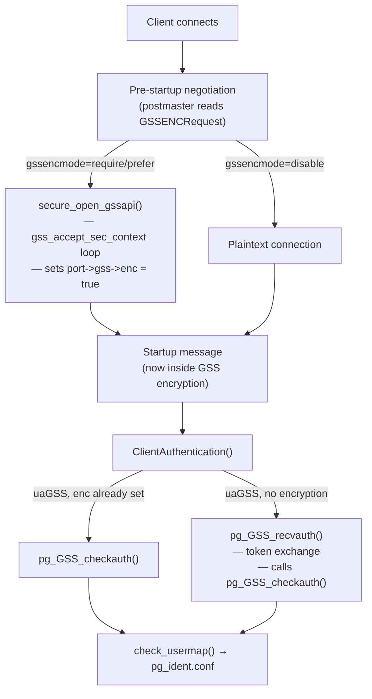

GSSAPI is a standard API (RFC 2743) through which PostgreSQL integrates with Kerberos and other security mechanisms. It serves two distinct roles: it can authenticate a client by validating a Kerberos ticket, and it can independently encrypt the TCP connection via the `gssencmode` connection parameter. The two roles share infrastructure but can be used independently. In Kerberos environments this is particularly attractive because both authentication and transport security reuse the same ticket infrastructure, with no need to provision TLS certificates alongside Kerberos service principals.

## Two Roles, One Infrastructure

GSSAPI support compiles into a single backend object (`be-gssapi-common.c`, `be-secure-gssapi.c`) guarded by `ENABLE_GSS`. The split in naming reflects the logical separation:

- **Authentication path** (`auth.c`): `pg_GSS_recvauth()` and `pg_GSS_checkauth()` run during `ClientAuthentication()` when `pg_hba.conf` specifies `gss` as the auth method. These functions exchange GSS tokens over the regular PostgreSQL message protocol (using `AUTH_REQ_GSS` / `AUTH_REQ_GSS_CONT` message types).

- **Encryption path** (`be-secure-gssapi.c`): `secure_open_gssapi()` runs before `ClientAuthentication()`, during the pre-startup negotiation phase (alongside SSL negotiation). It also calls `gss_accept_sec_context()` internally to establish the GSS security context, but writes and reads raw framed packets rather than using the PostgreSQL auth message types. Once the security context is established, `be_gssapi_write()` and `be_gssapi_read()` replace the functions that perform raw socket I/O.

When both are active — a connection using `hostgssenc` that also authenticates via `gss` — the encryption context is established first. `ClientAuthentication()` detects `port->gss->enc` and skips the token exchange. It calls `pg_GSS_checkauth()` directly instead, because the security context was already negotiated during encryption setup.



## Context Negotiation

Both paths use `gss_accept_sec_context()` as the core operation. The server passes `GSS_C_NO_CREDENTIAL` to use the default credential (the service principal derived from `KRB5_KTNAME`, which can be overridden by `krb_server_keyfile`). The function returns `GSS_S_CONTINUE_NEEDED` while the multi-step token exchange is in progress and `GSS_S_COMPLETE` when the context is fully established. Each call may produce an output token to send back to the client, which the server writes before reading the next input token.

During `secure_open_gssapi()`, the token exchange uses large (64 KiB) buffers because GSSAPI libraries are not constrained by the normal limit on packet size during context negotiation. Once the context is complete, these authentication buffers are freed and replaced with the 16 KiB production buffers used by `be_gssapi_write()` and `be_gssapi_read()`.

The optional `pg_gss_accept_delegation` GUC (corresponding to `gss_accept_delegation` in `pg_hba.conf`) controls whether `gss_accept_sec_context()` is passed a pointer to receive delegated credentials. See [Credential Delegation](#credential-delegation) below.

## Principal-to-Username Mapping

After context establishment, `pg_GSS_checkauth()` calls `gss_display_name()` on the authenticated principal to get its string form (e.g., `alice@EXAMPLE.COM`). This full principal name is stored in `port->gss->princ` and recorded as the authenticated identity via `set_authn_id()`.

The principal string is then processed for username mapping:

- The realm part (`@EXAMPLE.COM`) is stripped unless `include_realm = 1` is set on the `pg_hba.conf` line.
- If `krb_realm` is specified on the `pg_hba.conf` line, the realm in the principal must match it exactly (case-insensitively if `krb_caseins_users` is on).
- The resulting name (with or without realm) is passed to `check_usermap()`, which walks `pg_ident.conf` for a `map=` entry if one was specified.

This means `alice@EXAMPLE.COM` with `include_realm = 0` maps to the PostgreSQL username `alice`, subject to any `pg_ident.conf` rules.

## Packet Framing for GSS Encryption

The encryption layer uses a simple framing format: a 4-byte big-endian length word followed by the encrypted payload. This framing sits below the PostgreSQL message layer — the application-level messages (query, data row, etc.) are wrapped entirely inside these GSS packets.

```
+-----------+-----------+
| uint32 len|  gss_wrap |
|  (4 bytes)| payload   |
+-----------+-----------+
```

The maximum packet size is fixed at `PQ_GSS_MAX_PACKET_SIZE` (16384 bytes, including the 4-byte header). Both client and server must agree on this limit because `gss_unwrap()` requires the entire ciphertext before it can decrypt — the server rejects any incoming packet claiming to be larger than `PQ_GSS_MAX_PACKET_SIZE - 4` bytes. This constant is part of the protocol specification and cannot be changed.

`be_gssapi_write()` calls `gss_wrap()` with `conf_req_flag = 1` (requesting confidentiality). If the GSSAPI mechanism returns `conf_state = 0` (indicating the message was integrity-protected but not encrypted), the connection is treated as a hard error. This ensures that `gssencmode=require` actually encrypts data and does not silently fall back to an integrity-only mode. `be_gssapi_read()` makes the symmetric check on `gss_unwrap()` output.

The implementation maintains three static buffers:
- `PqGSSSendBuffer` — encrypted data ready to be written to the socket
- `PqGSSRecvBuffer` — raw encrypted bytes read from the socket
- `PqGSSResultBuffer` — plaintext output of `gss_unwrap()`, consumed by the caller

Partial writes are handled by tracking `PqGSSSendConsumed`: how many bytes of the current plaintext batch have already been encrypted and placed into the send buffer. On a retryable write failure, the caller must re-offer the same data so the layer can resume sending the already-encrypted remainder.

## Channel Binding

Channel binding ties the GSSAPI exchange to the underlying TLS session using the `tls-server-end-point` binding type, which incorporates a hash of the server's TLS certificate into the security context. When a client connects with both TLS and GSSAPI encryption, channel binding prevents an attacker who can strip TLS but preserve the GSSAPI layer from successfully completing authentication. The GSS context established over a stripped connection would use different channel binding data, so the `gss_accept_sec_context()` call would fail.

PostgreSQL advertises channel binding support. When the client requests it, PostgreSQL passes the binding data through the `input_chan_bindings` argument to `gss_accept_sec_context()`. The current code in `secure_open_gssapi()` passes `GSS_C_NO_CHANNEL_BINDINGS`. Channel binding for the encryption path is not yet implemented; it is available on the authentication-only path. The design goal is the same as SCRAM-SHA-256-PLUS: ensure that network-layer security and application-layer security cannot be independently subverted.

## Credential Delegation

When `pg_gss_accept_delegation = on` (a GUC, controlled by `gss_accept_delegation` in `pg_hba.conf`), the server passes a `&delegated_creds` pointer to `gss_accept_sec_context()`. If the client's Kerberos ticket was obtained with forwardable credentials, the KDC includes delegated credentials in the GSS exchange. The server then receives a usable `gss_cred_id_t`.

`pg_store_delegated_credential()` (`be-gssapi-common.c`) stores this credential in an in-memory credential cache that is local to the process (`MEMORY:` prefix, via `gss_store_cred_into()`). It also sets the environment variable `KRB5CCNAME` to `MEMORY:` for the backend process, so that subsequent calls to `gss_acquire_cred()` — by extensions like `postgres_fdw` or `dblink` — will find the delegated credential. The backend can then authenticate to downstream Kerberized services as the original client principal without requiring a separate password or keytab.

The delegated credential is scoped to the current backend process. It is never written to disk and is not accessible to other backends.

## Error Reporting

GSSAPI functions return a pair of status codes: a major status (`OM_uint32`) encoding the operation result class and a minor status encoding the mechanism-specific error. `pg_GSS_error()` (`be-gssapi-common.c`) translates both using `gss_display_status()` and emits them as `COMMERROR`-level log messages. All GSSAPI errors use `COMMERROR` rather than `ERROR` or `FATAL`, because sending an error to the client during a failed crypto operation could itself invoke the encrypted write path. This would cause infinite recursion.

## Comparison with TLS Encryption

Both GSSAPI encryption and TLS provide authenticated, encrypted TCP transport. The choice depends on the deployment:

| Aspect | GSSAPI encryption | TLS |
|---|---|---|
| Credential source | Kerberos ticket (KDC-issued) | X.509 certificate |
| Infrastructure | KDC + keytab | CA + certificate management |
| Authentication | Kerberos ticket exchange | Separate (cert, SCRAM, etc.) |
| Preferred when | Kerberos already deployed | No Kerberos, or mixed clients |
| `pg_hba.conf` type | `hostgssenc` | `hostssl` |

In a pure Kerberos environment, GSSAPI encryption is preferred because it reuses the existing ticket infrastructure for both authentication and encryption. There is no separate certificate to provision or rotate: the server's Kerberos service principal (`postgres/host@REALM`) serves both roles. In mixed environments or when clients do not have Kerberos, TLS remains the standard choice.

A connection can have at most one encryption layer active. The pre-startup negotiation checks `port->gss->enc` and `port->ssl_in_use` so that GSS negotiation is skipped once TLS is established, and vice versa.

## See also

- [[subsystems/auth/overview|Authentication overview]] — `pg_hba.conf` connection types `hostgssenc`/`hostgssnoenc`, the `gss` auth method, and username mapping
- [[subsystems/auth/ssl-tls|SSL/TLS]] — TLS negotiation, certificates, and how GSSAPI and TLS coexist in the pre-startup negotiation phase
- [[subsystems/auth/pg-hba-conf|pg_hba.conf]] — rule matching, `include_realm`, `krb_realm`, and `map=` options for GSSAPI entries
