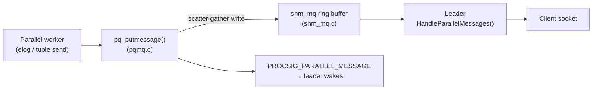

Three files in `src/backend/libpq/` handle concerns that sit underneath the main authentication and connection code. `crypt.c` manages password hashing and verification for MD5 and SCRAM-stored credentials. `ifaddr.c` enumerates the server's network interfaces to support `samehost` and `samenet` matching in `pg_hba.conf`. `pqmq.c` adapts the libpq wire-format output layer so that parallel workers can send tuples and protocol messages through shared-memory queues rather than a socket. Together they illustrate how PostgreSQL isolates low-level platform concerns behind narrow interfaces.

## Password storage and verification (crypt.c)

`crypt.c` is the server-side counterpart to whatever hashing the client or password-change command performs. Its responsibilities are narrow: fetch a stored credential from `pg_authid`, determine its format, and compare it against whatever the client presented.

### Password format detection

The format of `pg_authid.rolpassword` determines the entire verification path. `get_password_type()` classifies a stored value into one of three `PasswordType` variants:

- **`PASSWORD_TYPE_MD5`** — the string starts with `md5`, is exactly `MD5_PASSWD_LEN` (35) characters, and the suffix is all hex digits.
- **`PASSWORD_TYPE_SCRAM_SHA_256`** — `parse_scram_secret()` succeeds, meaning the value matches the `SCRAM-SHA-256$<iterations>:<base64-salt>$<base64-StoredKey>:<base64-ServerKey>` format.
- **`PASSWORD_TYPE_PLAINTEXT`** — anything else; used as a catch-all and should not appear in production.

This classification drives every code path in `crypt.c`. The `CREATE ROLE` and `ALTER ROLE` commands call `encrypt_password()`, which inspects the incoming value first. If the value is already a recognised hash, `encrypt_password()` returns it unchanged. There is no way to re-encrypt an opaque hash into a different format.

### MD5 challenge-response

The `md5` authentication method in `pg_hba.conf` operates as a two-round challenge-response protocol. The server sends a 4-byte random salt (generated in `auth.c`). The client computes `MD5(MD5(password || username) || salt)` and sends back the hex digest prefixed with `md5`.

Including the username in the inner hash is deliberate. A rainbow table precomputed over `MD5(password)` would be useless here because the same password hashed for user `alice` produces a different stored value than for user `bob`. Including the username also prevents cross-user reuse of a stolen hash. Even if an attacker extracts the stored `md5...` value for user `alice`, they cannot use it to authenticate as a different user. The stored hash is bound to `alice`'s name.

Verification in `md5_crypt_verify()` takes the already-hashed stored value (stripping the `md5` prefix), applies the session salt on top of it, and compares the result against what the client sent using `timingsafe_bcmp()`. The timing-safe comparison prevents inferring correctness from response latency.

When the auth method is `password` (plaintext over the wire), `plain_crypt_verify()` handles the matching. It re-hashes the client's cleartext using `pg_md5_encrypt()` with the username as salt before comparing it to the stored MD5 hash, keeping the verification path symmetric.

### MD5 limitations and migration to scram-sha-256

MD5 is cryptographically broken for collision resistance and is deprecated in PostgreSQL's authentication stack. The stored hash in `pg_authid` is a reusable credential: anyone who can read the `pg_authid` system catalog can construct a valid MD5 authentication response for any session salt without knowing the original password. SCRAM-SHA-256 avoids this because `pg_authid` stores only a key derivation artifact (`StoredKey` and `ServerKey`) that cannot be used to directly answer a challenge.

`crypt.c` continues to handle MD5 for installations that have not yet migrated. Converting existing users requires password resets — `encrypt_password()` cannot transform an MD5 hash into a SCRAM verifier because the original plaintext is not recoverable from the hash. The `password_encryption` GUC controls which format is produced for new passwords; setting it to `scram-sha-256` affects only future `CREATE ROLE` / `ALTER ROLE` statements.

## Network interface enumeration (ifaddr.c)

`ifaddr.c` provides the machinery for discovering what IP addresses the server itself owns. This is needed because `pg_hba.conf` allows `samehost` (match any of the server's own addresses) and `samenet` (match any address on a network the server is directly attached to) as special address tokens.

### The pg_foreach_ifaddr callback interface

The public API is a single function `pg_foreach_ifaddr(callback, cb_data)`. It iterates over every network interface on the host and calls the supplied `PgIfAddrCallback` once per address, passing the address and its netmask. The callback pattern keeps the OS-specific enumeration logic hidden; callers only handle individual `(addr, netmask)` pairs.

The HBA subsystem (`hba.c`) calls `pg_foreach_ifaddr()` at `pg_hba.conf` reload time to build a list of local addresses. For each new connection, `check_hba()` compares the client's IP against this list using `pg_range_sockaddr()`. The `samehost` keyword matches if the client address equals any local address exactly; `samenet` matches if it falls within any local address's directly-attached subnet (computed via bitwise AND with the netmask).

Subnet membership is tested in `pg_range_sockaddr()` with a direct bitmask operation:

```c
((addr ^ netaddr) & netmask) == 0
```

For IPv6 this test is applied byte-by-byte across all 16 bytes of the address. For IPv4 it is a single 32-bit operation. The logic is the same in both cases: any bits in the address that differ from the network address, after masking, indicate the address is outside the network.

### Platform portability

Three implementations of `pg_foreach_ifaddr()` are compiled depending on the platform:

| Platform | Mechanism |
|---|---|
| POSIX with `getifaddrs()` (Linux, macOS, BSDs, Solaris, illumos) | `getifaddrs()` returns a linked list of `ifaddrs` structs; iterate and call the callback |
| POSIX without `getifaddrs()` | `ioctl(SIOCGIFCONF)` fills a buffer with `ifreq` entries; iterate with a size-aware pointer walk |
| Windows | `WSAIoctl(SIO_GET_INTERFACE_LIST)` fills an `INTERFACE_INFO` array |
| Last resort (no known enumeration method) | Returns only the loopback addresses `127.0.0.1/8` and `::1/128` |

The `SIOCGIFCONF` path carries a portability caveat: on some systems it reports only IPv4 addresses, making `samehost`/`samenet` matching unreliable for IPv6 on those platforms. `getifaddrs()` is preferred wherever available because it handles both address families uniformly.

`pg_sockaddr_cidr_mask()` constructs a netmask from a prefix length string. When no prefix length is supplied the function generates a fully-set mask (host route), ensuring that a bare IP address in `pg_hba.conf` is always treated as a `/32` or `/128`.

## Shared-memory message queues for parallel workers (pqmq.c)

Parallel workers cannot write to the client socket — that socket belongs to the leader process and is not shared. Workers need a way to send query results (tuples) and protocol messages (notices, warnings, errors) back to the leader, which will relay them to the client. `pqmq.c` solves this by implementing a `PQcommMethods` dispatch table that routes all libpq output through a shared-memory message queue instead of a socket.

### Redirecting the output stream

`pq_redirect_to_shm_mq(seg, mqh)` is called by a worker during its startup sequence. It swaps the global `PqCommMethods` pointer to `PqCommMqMethods` — the vtable defined in `pqmq.c` — and sets `whereToSendOutput = DestRemote`. From this point, every call to `pq_putmessage()` from anywhere in the backend (the tuple-sending code in `tqueue.c`, `elog()`, `ereport()`, etc.) is transparently redirected to the queue. The worker also registers a DSM detach callback so the queue handle is cleared when the DSM segment goes away; after that point any messages are silently discarded rather than crashing.

The leader's PID and backend ID are registered separately via `pq_set_parallel_leader()`. This is used to send a `PROCSIG_PARALLEL_MESSAGE` signal to the leader after each message is written, waking it up promptly rather than making it poll.

### Wire format on the queue

Each call to `mq_putmessage()` writes a two-element scatter-gather write to the `shm_mq`:

1. The single-byte message type character (`msgtype`)
2. The message body (`s`, `len` bytes)

The length word that normally precedes the body in the TCP stream is omitted. The `shm_mq` layer delivers messages as discrete, length-prefixed records, so the receiver already knows the payload length from `shm_mq_receive()`. The message type byte is preserved because the leader must distinguish tuple data messages (`'D'`) from notice/error messages (`'N'`, `'E'`) to route them correctly.

### Blocking, re-entrancy, and backpressure

The queue can fill if the leader is slow to drain it. `mq_putmessage()` blocks by waiting on `MyLatch` when `shm_mq_sendv()` returns `SHM_MQ_WOULD_BLOCK`, then calls `CHECK_FOR_INTERRUPTS()` before retrying. This means a worker can be interrupted (e.g., by a cancel) even while blocked on a full queue.

A `pq_mq_busy` flag guards against re-entrancy. If an interrupt fires while the worker is blocked inside `mq_putmessage()` and that interrupt handler also tries to emit a message (for example, an error from a signal handler), the reentered call detaches the queue and returns `EOF`. Detaching is the only safe option: returning to the original blocked context with a half-written message in flight is not possible.

### Relationship with shm_mq.c and the parallel framework

`pqmq.c` is purely a framing layer. The underlying `shm_mq` machinery — ring-buffer allocation, latch-based blocking, and the `SHM_MQ_DETACHED` sentinel — lives in `src/backend/storage/ipc/shm_mq.c`. The parallel framework (`src/backend/access/transam/parallel.c`) allocates two sets of queues per worker in the DSM segment: one tuple queue carrying `MinimalTuple` bytes (used via `tqueue.c`) and one error queue carrying libpq protocol messages (used via `pqmq.c`).



The leader drains error queues in `HandleParallelMessages()` whenever `CHECK_FOR_INTERRUPTS()` fires and the `ParallelMessagePending` flag is set. `pq_parse_errornotice()` (also in `pqmq.c`) decodes the binary `ErrorResponse` / `NoticeResponse` payload into an `ErrorData` struct. The leader then re-reports the message as if it originated locally, appending a `"parallel worker"` context line.

Tuple queues use a different path: `tqueue.c` writes raw `MinimalTuple` bytes directly via `shm_mq_send()` without going through `pqmq.c` at all. `pqmq.c` handles only the protocol-level messages that flow through the `PQcommMethods` dispatch table.

## See also

- [[subsystems/auth/overview|Authentication overview]] — pg_hba.conf parsing, `samehost`/`samenet` address matching, and the MD5 and SCRAM-SHA-256 auth methods in context
- [[subsystems/executor/parallel|Parallel query framework]] — how workers are launched, how DSM is structured, and how Gather/GatherMerge nodes de-multiplex worker output
- [[subsystems/memory/contexts|Memory context]] — `pg_authid` lookups in `crypt.c` allocate via `SysCache`, which lives in a palloc context
