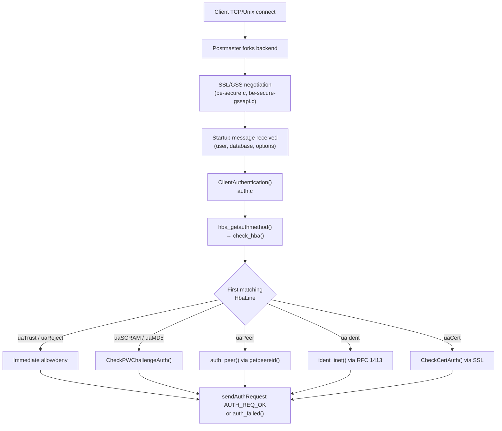
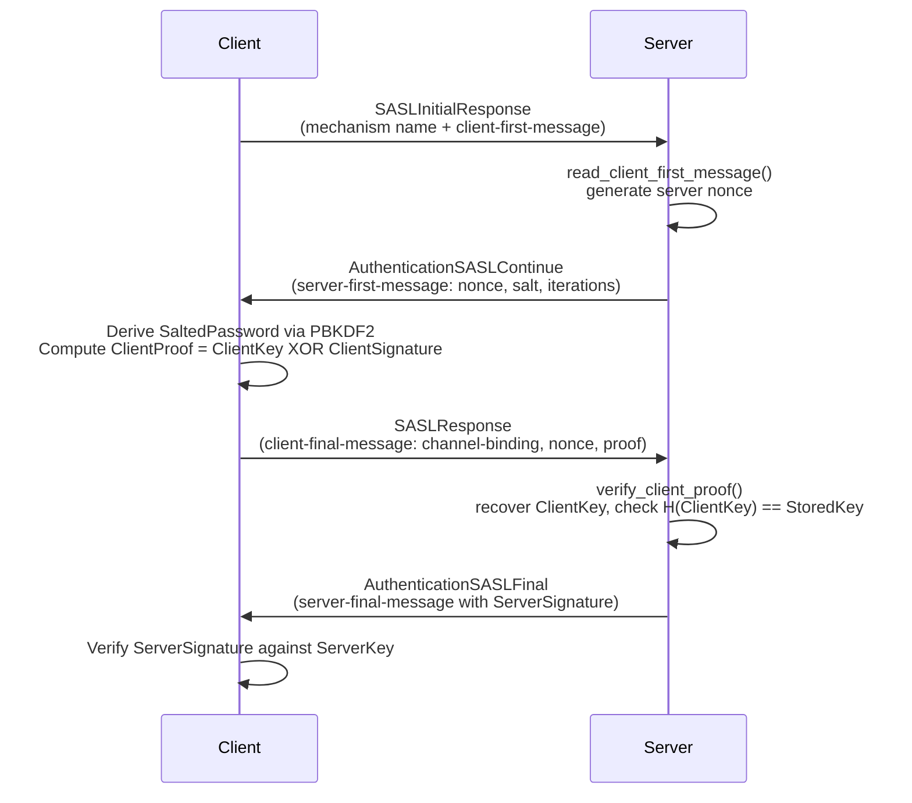

PostgreSQL authentication is a two-step process. The postmaster decides *which* method to apply by matching the incoming connection against `pg_hba.conf`. The backend then applies that method to produce a pass/fail verdict. Every decision — from "trust this Unix socket" to "run a full SCRAM-SHA-256 challenge" — flows through this single gating point.

## The Connection-to-Authentication Pipeline

When a client connects, the postmaster forks a new backend before any authentication occurs. That backend calls `ClientAuthentication()` (`src/backend/libpq/auth.c`), which is the sole entry point for all auth logic. The first thing it does is call `hba_getauthmethod()`, which in turn calls `check_hba()`. `check_hba()` walks the pre-parsed list of `HbaLine` structs. It stops at the first entry matching the current connection.



`check_hba()` iterates `parsed_hba_lines` — a process-local linked list built at startup and on each SIGHUP — stopping at the first match. A connection that matches no entry gets an implicit reject (`uaImplicitReject`), which produces a different error message than an explicit `reject` entry.

The `HbaLine` struct (`src/include/libpq/hba.h`) captures every parsed field from a single `pg_hba.conf` line, including the auth method (`UserAuth` enum), connection type (`ConnType`), IP address/mask, and all method-specific options. SSL state is known by the time `check_hba()` runs, because TLS negotiation happens before the startup message. As a result, `ctHostSSL` and `ctHostNoSSL` matching is reliable.

## pg_hba.conf Structure

Each non-comment line has five mandatory fields and optional method-specific options:

```
type  database  user  address  auth-method  [options]
```

### Connection types (`ConnType`)

| Token | Enum | Matches |
|---|---|---|
| `local` | `ctLocal` | Unix-domain socket connections only |
| `host` | `ctHost` | TCP with or without SSL/GSS |
| `hostssl` | `ctHostSSL` | TCP with SSL or GSS encryption required |
| `hostnossl` | `ctHostNoSSL` | TCP without SSL (plaintext) |
| `hostgssenc` | `ctHostGSS` | TCP with GSSAPI encryption |
| `hostgssnoenc` | `ctHostNoGSS` | TCP without GSSAPI encryption |

`host` matches any TCP connection regardless of encryption. Use `hostssl` when you want to guarantee encryption before allowing a method like `password`. That method sends credentials in the clear.

### Address matching

For TCP connections the address field accepts:
- An IPv4 or IPv6 CIDR block (`192.168.1.0/24`, `::1/128`)
- A hostname that is reverse-resolved then forward-verified against the client IP at connection time
- `all`, `samehost`, or `samenet` keywords
- A dotted quad with a separate netmask column

Hostname matching triggers a double-reverse DNS lookup, which is expensive. A misconfigured DNS can also make authentication non-deterministic.

### Database and user fields

Both fields accept comma-separated values, `all`, or a `+group_name` to match role membership. A leading `/` treats the value as a regular expression — the only place in `pg_hba.conf` where regex is supported. The special `replication` pseudo-database controls access for `pg_basebackup` and streaming replication connections.

## Authentication Methods

### trust and reject

`trust` grants access without any credential check. It is appropriate only for local Unix sockets in tightly controlled environments. `reject` always denies — it is useful to block a specific address range before a broader `host all all 0.0.0.0/0 scram-sha-256` rule would match it.

### password (plaintext)

The server sends a `PasswordPacket` message to the client. It receives the password back in cleartext over the wire, then compares it against `pg_authid.rolpassword`. This method is only acceptable over an already-encrypted (SSL or GSS) connection. Using it over plaintext TCP exposes passwords to network sniffing.

### md5

MD5 was the default before PostgreSQL 14. It is now deprecated. The server sends a random 4-byte salt. The client hashes `MD5(MD5(password || username) || salt)` and sends the hex digest back. This prevents replay attacks, but the hash function itself is cryptographically broken for other purposes. Existing MD5 hashes in `pg_authid` continue to work, but new passwords should use `scram-sha-256`.

**PostgreSQL 18:** MD5 password authentication is formally deprecated. `CREATE ROLE` and `ALTER ROLE` emit warnings when setting MD5 passwords. The `md5_password_warnings` GUC controls this behavior; set it to `off` to suppress warnings during bulk migrations. MD5 passwords remain functional, but the intent is full migration to `scram-sha-256`.

### scram-sha-256

The recommended method. It implements RFC 5802 (SCRAM) over the SASL framework, using SHA-256 for key derivation. The server advertises `SCRAM-SHA-256` and `SCRAM-SHA-256-PLUS` (the channel-binding variant) via a `SASLInitialResponse` exchange. The client picks one mechanism name. The exchange then proceeds.

### oauth

**PostgreSQL 18:** The `oauth` method is a new `pg_hba.conf` auth method that uses the OAUTHBEARER SASL mechanism (RFC 7628) to allow clients to authenticate with OAuth 2.0 bearer tokens. The server never validates tokens itself; instead, the `oauth_validator_libraries` GUC points to a shared library responsible for token validation. The build must include `--with-libcurl` for OAuth support. This is well-suited for environments that already operate an OAuth 2.0 authorization server and want to avoid managing PostgreSQL-local credentials.

### peer

The `peer` method applies only to `local` connections. The backend calls `getpeereid()` on the Unix socket, which returns the OS UID of the connecting process. The backend resolves that UID to a username via `getpwuid()`. If the OS username equals the PostgreSQL username — or if a `pg_ident.conf` mapping covers the pair — authentication succeeds. Peer auth requires no password and no network communication beyond the socket itself.

### ident

The `ident` method works like `peer` but for TCP connections. The backend connects to an identd daemon (RFC 1413) on port 113 of the client machine. It asks "who owns the connection with source port N?" The backend treats the identd response as the OS username. This method relies on the client machine running a cooperative identd. It is rarely appropriate in modern deployments.

### cert

The `cert` method requires an SSL connection with a valid client certificate. The certificate must be signed by one of the CAs in `ssl_ca_file`. By default the CN field of the client certificate must match the PostgreSQL username, but `clientcertname=dn` uses the full Distinguished Name instead. The `clientcert` option on other methods (`verify-full`, `verify-ca`) adds certificate validation on top of a different auth method.

### gss (Kerberos)

The `gss` method delegates authentication to GSSAPI/Kerberos. The connection type `hostgssenc` additionally encrypts the session at the GSSAPI layer. This method requires a working Kerberos infrastructure with a service principal for the PostgreSQL server.

### ldap

The backend binds to an LDAP server using the client's credentials. Two modes: simple bind (constructs a DN from `ldapprefix`/`ldapsuffix`) and search-then-bind (finds the DN by searching with `ldapsearchattribute`). The directory server checks the LDAP password; PostgreSQL never stores it.

### radius

The `radius` method sends an Access-Request to a RADIUS server. It is useful for centralized credential management. Options include `radiusservers`, `radiussecrets`, `radiusports`, and `radiusidentifiers`.

## SCRAM-SHA-256 Internals

SCRAM (Salted Challenge Response Authentication Mechanism) is designed so that neither the plaintext password nor a simple hash is ever transmitted. The server stores enough material to verify proofs, but not enough to reconstruct the password.

### Stored secret format

When a password is set (via `CREATE ROLE` or `\password`), `pg_be_scram_build_secret()` (`auth-scram.c`) runs SASLprep normalization on the password. It then generates a random salt. It computes the salted hash chain from the normalized password and the salt. The result stored in `pg_authid.rolpassword` is:

```
SCRAM-SHA-256$<iterations>:<base64-salt>$<base64-StoredKey>:<base64-ServerKey>
```

`StoredKey = H(ClientKey)` where `ClientKey = HMAC(SaltedPassword, "Client Key")`. `ServerKey = HMAC(SaltedPassword, "Server Key")`. `SaltedPassword = Hi(password, salt, iterations)` — the PBKDF2 function with HMAC-SHA-256. The default iteration count is 4096 (`SCRAM_SHA_256_DEFAULT_ITERATIONS`). An operator can tune it via the `scram_iterations` GUC.

### Exchange flow



Verification in `verify_client_proof()` reconstructs `ClientKey = ClientProof XOR ClientSignature`. It then checks that `H(ClientKey) == StoredKey`. The comparison uses `timingsafe_bcmp()` to prevent timing side-channels. The server then sends its own signature derived from `ServerKey`, allowing the client to verify the server is authentic.

### Channel binding (SCRAM-SHA-256-PLUS)

When SSL is in use and the client selects `SCRAM-SHA-256-PLUS`, the client incorporates channel binding data (`tls-server-end-point` — the hash of the server's TLS certificate) into the client proof. This binds the SCRAM exchange cryptographically to the specific TLS session, preventing credential forwarding attacks. PostgreSQL uses `tls-server-end-point` rather than `tls-unique`, because the latter is not defined for TLS 1.3. It also requires access to internal TLS state that not all SSL libraries expose.

### Mock authentication for non-existent users

When a user does not exist or has no SCRAM secret, the server generates a fake salt deterministically from the username (`scram_mock_salt()`). It then proceeds through the full exchange. This prevents user enumeration by timing: an attacker cannot distinguish "user does not exist" from "user exists but password is wrong" based on response time.

## SSL/TLS

Setting `ssl = on` in `postgresql.conf` enables SSL. The server requires `ssl_cert_file` (default `server.crt`) and `ssl_key_file` (default `server.key`) in the data directory. The key file must be readable only by the postgres user; the server refuses to start if the file is world-readable.

| Parameter | Default | Purpose |
|---|---|---|
| `ssl` | `off` | Enable SSL support |
| `ssl_cert_file` | `server.crt` | Server certificate |
| `ssl_key_file` | `server.key` | Server private key |
| `ssl_ca_file` | (none) | CA bundle for client certificate verification |
| `ssl_min_protocol_version` | `TLSv1.2` | Minimum TLS version accepted |
| `ssl_max_protocol_version` | (none) | Maximum TLS version accepted |
| `ssl_ciphers` | `HIGH:MEDIUM:+3DES:!aNULL` | OpenSSL cipher string |
| `ssl_prefer_server_ciphers` | `on` | Server cipher order takes precedence |

The default for `ssl_min_protocol_version` is `TLSv1.2` (`src/backend/libpq/be-secure.c`). The server does not negotiate TLS 1.0 or 1.1 unless an operator explicitly relaxes the minimum.

### Verifying SSL in use

The `pg_stat_ssl` view exposes one row per active connection with SSL metadata:

```sql
SELECT pid, ssl, version, cipher, bits, client_dn, client_serial, issuer_dn
FROM pg_stat_ssl
WHERE pid = pg_backend_pid();
```

| Column | Meaning |
|---|---|
| `ssl` | Boolean: whether this connection uses SSL |
| `version` | TLS protocol version string (e.g. `TLSv1.3`) |
| `cipher` | Cipher suite name |
| `bits` | Key length |
| `client_dn` | DN from client certificate if present |
| `client_serial` | Certificate serial number |
| `issuer_dn` | DN of the issuing CA |

The server only populates `client_dn` and `issuer_dn` when the client presented a certificate and `ssl_ca_file` is configured.

## pg_hba.conf Reloading

The postmaster, not individual backends, parses `pg_hba.conf` at startup. The result is a list of `HbaLine` structs held in `parsed_hba_context`, a [[subsystems/memory/contexts|memory context]] under `PostmasterContext`.

On reload — triggered by `SELECT pg_reload_conf()` in SQL or by sending `SIGHUP` to the postmaster — `load_hba()` re-parses the file into a fresh memory context. It then atomically replaces `parsed_hba_context` by deleting the old context. The postmaster propagates `SIGHUP` to all children, but each child backend only re-reads the in-memory list when it processes its own SIGHUP handler. Crucially, **existing authenticated connections are not affected**: the new rules apply only to connections established after the reload completes.

If the new file has parse errors, `load_hba()` returns false. The old parsed lines remain in place. The postmaster logs the error without reloading. The parser also treats a completely empty file as an error.

## pg_ident.conf and Username Mapping

`peer`, `ident`, `gss`, and `cert` methods may use an `map=<mapname>` option to consult `pg_ident.conf`. This file maps OS usernames (or certificate CNs, or Kerberos principals) to PostgreSQL usernames:

```
# pg_ident.conf
# map-name    system-username    pg-username
admins        root               postgres
admins        alice              alice
developers    /^dev_(.*)$        \1
```

The third column accepts a regular expression with back-references when the second column is also a regex, allowing a single rule to map `dev_alice` → `alice`, `dev_bob` → `bob`, and so on. `check_usermap()` (`hba.c`) walks `parsed_ident_lines` to find a match.

## password_encryption and pg_authid.rolpassword

The `password_encryption` GUC (settable per session or per role) controls which algorithm PostgreSQL uses when a password is set:

```sql
SET password_encryption = 'scram-sha-256';   -- default since PG 14
SET password_encryption = 'md5';              -- legacy
```

Setting a password with `md5` encryption stores `md5` + the hex digest in `pg_authid.rolpassword`. With `scram-sha-256` it stores the full SCRAM verifier string. The stored format determines which auth methods can authenticate that user: a user with an MD5 hash cannot authenticate via `scram-sha-256`, and vice versa. Changing `password_encryption` has no effect on existing passwords; users must reset their passwords to upgrade.

**PostgreSQL 18:** `CREATE ROLE` and `ALTER ROLE` now warn when a password is stored as MD5, regardless of how `password_encryption` is set. Use the `md5_password_warnings` GUC to suppress these warnings if you are performing a staged migration.

To check a user's current hash type:

```sql
SELECT rolname,
       CASE
           WHEN rolpassword IS NULL THEN 'no password'
           WHEN rolpassword LIKE 'SCRAM-SHA-256$%' THEN 'scram-sha-256'
           WHEN rolpassword LIKE 'md5%' THEN 'md5'
           ELSE 'unknown'
       END AS password_type
FROM pg_authid
WHERE rolcanlogin;
```

Note that `pg_authid.rolpassword` is only visible to superusers; `pg_shadow` exposes it to superusers in a more convenient view.

## Security Recommendations

**Disable trust for TCP connections.** A `trust` entry on a `host` or `hostssl` line allows anyone who can reach the port to connect as any user, including superusers. Reserve `trust` for the local Unix socket and only for the OS user running the PostgreSQL server.

**Use scram-sha-256 everywhere.** MD5 is cryptographically weak. It also carries the additional risk that the hash in `pg_authid` could be used directly to authenticate against an older server configured to accept MD5. SCRAM stores a key derivation artifact, not a reusable hash.

**Require SSL for remote connections.** Use `hostssl` instead of `host` for all remote entries. The `ssl_min_protocol_version = TLSv1.2` default is safe; there is no reason to lower it.

**Layer clientcert on top of password-based methods.** For high-value accounts, adding `clientcert=verify-full` to a `hostssl scram-sha-256` rule requires both a valid client certificate and a correct password. Neither credential alone is sufficient.

**Order pg_hba.conf entries from most to least specific.** PostgreSQL matches the file top-to-bottom; the first match wins. A broad `reject` near the top can block an IP range before a later permissive entry would apply.

**PostgreSQL 18:** Cancel request keys are now 256 bits (wire protocol 3.2), up from the previous 32 bits. The old 32-bit key was small enough for an attacker with network access to brute-force. Such an attacker could observe whether a cancel request had an effect. The larger key closes this vulnerability without requiring application changes for clients that negotiate protocol 3.2.

## Related Topics

- [[subsystems/auth/pg-hba-conf|pg_hba.conf Reference]] — deep reference for every field, connection type, and auth method option in the HBA file parsed by this subsystem.
- [[subsystems/auth/ssl-tls|SSL/TLS]] — covers server certificate setup, client certificate verification, and TLS parameter tuning referenced in the SSL section above.
- [[subsystems/auth/role-management|Role Management]] — covers how roles, passwords, and `pg_authid` are created and maintained, which directly affects which auth methods can succeed.
- [[subsystems/auth/gssapi|GSSAPI]] — details Kerberos/GSSAPI authentication and encrypted transport used by the `gss` and `hostgssenc` connection types.
- [[subsystems/auth/oauth|OAuth]] — covers the PostgreSQL 18 `oauth` auth method, OAUTHBEARER SASL mechanism, and the `oauth_validator_libraries` hook.
- [[architecture/client-connection|Client Connection]] — traces the full lifecycle of a connection from TCP accept through the postmaster fork that precedes `ClientAuthentication()`.
- [[troubleshooting/auth-failures|Authentication Failures]] — practical guide to diagnosing `pg_hba.conf` mismatches, SCRAM errors, and SSL certificate problems.
