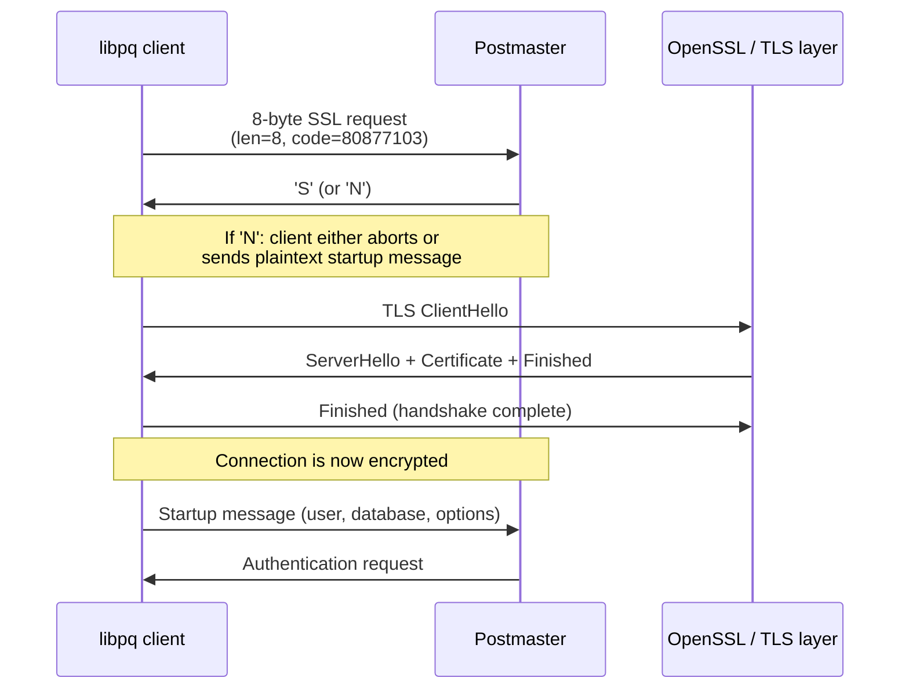

PostgreSQL's SSL/TLS support sits outside the normal message framing. Before any startup message is exchanged, the client and server run a special negotiation to decide whether to wrap the connection in TLS. This happens at the postmaster level, before a backend is even forked. That is why SSL state is known by the time PostgreSQL evaluates `pg_hba.conf` rules. For how those rules use SSL state (the `hostssl`, `hostnossl` connection types and `ssl_min_protocol_version`, `ssl_ciphers` GUCs), see [[subsystems/auth/overview]].

## Pre-Startup SSL Negotiation

The wire protocol defines a special 8-byte packet: 4 bytes for the length (value 8, big-endian) followed by a 4-byte magic code `NEGOTIATE_SSL_CODE`, which is `PG_PROTOCOL(1234,5679)` — decimal 80877103. PostgreSQL deliberately chose this code so it cannot be confused with a real protocol version number (protocol 1234.5679 will never exist) or with a cancel request (`PG_PROTOCOL(1234,5678)`).

The postmaster reads this packet in `ProcessStartupPacket()` (`src/backend/postmaster/postmaster.c`). If it matches `NEGOTIATE_SSL_CODE` and SSL has not already been negotiated, the server responds with a single byte:

- `'S'` — the server supports SSL and will proceed with a TLS handshake
- `'N'` — SSL is unavailable (compiled out, `ssl = off`, or a Unix-domain socket)

The server sends `'N'` unconditionally on Unix-domain sockets because there is no point encrypting a local socket. If SSL is compiled in but disabled via `ssl = off`, it also sends `'N'`.

After receiving `'S'`, the server immediately calls `secure_open_server()`, which calls through to `be_tls_open_server()` in the OpenSSL implementation. The TLS ClientHello/ServerHello exchange then proceeds directly on the same TCP connection — no new socket, no port change.

The design rationale is straightforward: the server must know whether to wrap the subsequent startup message in TLS before it reads it. There is no way to start reading a startup packet and then retroactively decide to encrypt it. The one-byte response keeps the negotiation outside the normal message framing, which begins with a message type byte. As a result, there is no ambiguity. The client library (`libpq`) will retry the entire `ProcessStartupPacket()` loop after receiving `'S'` and completing the handshake; the `ssl_done` flag prevents a second SSL negotiation attempt.

**PostgreSQL 17:** This release introduced direct TLS via the `sslnegotiation=direct` connection parameter. With direct TLS, the client skips the legacy `SSLRequest` round-trip entirely. It begins a TLS handshake immediately on connection, using the `postgresql` ALPN protocol identifier to identify the target protocol. This requires a PostgreSQL 17+ server. It reduces connection setup latency by eliminating the extra round-trip. The traditional negotiation flow (SSLRequest → `'S'` → handshake) remains available for compatibility with older servers.



After a successful TLS handshake, the postmaster checks that no buffered pre-handshake data is present (`pq_buffer_has_data()`). If any is found, it immediately terminates with "received unencrypted data after SSL request" — this guards against a man-in-the-middle injecting data before the handshake completes. The GSS negotiation code (`NEGOTIATE_GSS_CODE`) follows the same pattern. A client may try SSL first and, if declined (`'N'`), try GSS. Once either succeeds, the other is marked done and skipped.

## The TLS Handshake in be-secure-openssl.c

The two-layer architecture in `be-secure.c` and `be-secure-openssl.c` separates the generic interface from the OpenSSL implementation. `be-secure.c` exposes functions like `secure_open_server()`, `secure_read()`, and `secure_write()`, each guarded by `#ifdef USE_SSL`. When PostgreSQL is compiled `--without-openssl`, all these functions compile to no-ops. The server then behaves as if SSL support does not exist. The OpenSSL-specific code lives entirely in `be-secure-openssl.c`, which makes it possible in principle to slot in a different TLS library by replacing just that file.

At startup, `be_tls_init()` builds a global `SSL_CTX` that holds the loaded certificate, private key, CA bundle, cipher configuration, and protocol version constraints. The server creates every per-connection `SSL` object from this shared context, so it pays the overhead of loading and parsing certificates once, not once per connection.

**PostgreSQL 18:** This release raised the minimum required OpenSSL version to 1.1.1. It no longer supports builds against older OpenSSL releases.

`be_tls_open_server()` performs the server-side TLS handshake:

1. A new `SSL` object is created from the global `SSL_CTX` (initialized once at startup by `be_tls_init()`).
2. The existing TCP socket is associated with the SSL object via a custom `BIO` that integrates with PostgreSQL's latch-based I/O loop.
3. `SSL_accept()` is called in a loop. If it returns `SSL_ERROR_WANT_READ` or `SSL_ERROR_WANT_WRITE`, the backend waits on the socket using `WaitLatchOrSocket()` and retries — this is the non-blocking path that keeps the postmaster responsive.
4. On success, `be_tls_open_server()` extracts the client certificate (if any) with `SSL_get_peer_certificate()` and stores the CN and full DN in `port->peer_cn` and `port->peer_dn`.

Version negotiation failures surface as specific OpenSSL reason codes: `SSL_R_UNSUPPORTED_PROTOCOL`, `SSL_R_WRONG_VERSION_NUMBER`, and related codes produce an additional hint about `ssl_min_protocol_version` and `ssl_max_protocol_version`. This is often the first meaningful diagnostic when a client and server cannot agree on a TLS version. OpenSSL's `NO_PROTOCOLS_AVAILABLE` can also appear if an external `openssl.cnf` system policy imposes a stricter minimum than PostgreSQL configured — in that case, even setting `ssl_min_protocol_version = TLSv1.2` in `postgresql.conf` will not help. An operator must adjust the system OpenSSL policy instead.

**PostgreSQL 18:** This release renamed the `ssl_ecdh_curve` GUC to `ssl_groups`. It also extended the GUC to accept a colon-separated list of ECDH curve names (e.g., `ssl_groups = 'X25519:prime256v1'`), matching OpenSSL's group configuration syntax, and added X25519 to the default group list. **PostgreSQL 18:** The new `ssl_tls13_ciphers` GUC allows specifying the TLSv1.3 cipher suite list. Previously, an operator could not configure TLSv1.3 cipher suites separately from the `ssl_ciphers` setting, which applies to TLSv1.2 and earlier.

## Server Certificate Setup

The server reads `ssl_cert_file` (default `server.crt`) and `ssl_key_file` (default `server.key`) from the data directory. `check_ssl_key_file_permissions()` in `src/backend/libpq/be-secure-common.c` checks permissions on the key file before opening it:

- If the file is owned by the database user (`geteuid()`), it must have mode 0600 or stricter (no group or world read/write/execute bits).
- If the file is owned by root (a common pattern in OS packages), it may have mode 0640, allowing the postgres group to read it.
- Any other owner causes a startup failure.

A permission failure at startup is FATAL. At reload, PostgreSQL logs the failure at LOG level. It preserves the old SSL context instead.

To generate a self-signed certificate for development:

```bash
openssl req -new -x509 -days 365 -nodes \
  -out server.crt -keyout server.key \
  -subj "/CN=localhost"
chmod 600 server.key
```

For production, a CA should sign the certificate. Point `ssl_cert_file` at the leaf certificate (or a chain file containing the leaf plus any intermediates) and `ssl_key_file` at the corresponding private key. If the chain is separate, `SSL_CTX_use_certificate_chain_file()` handles reading the full chain from a single PEM file. The server's hostname or IP should appear in the certificate's Subject Alternative Name (SAN) extension, not just the CN, because modern TLS clients ignore the CN for hostname verification.

For CRL-based revocation, an operator can configure `ssl_crl_file` (a single PEM file) or `ssl_crl_dir` (a directory in OpenSSL hash format). The server checks revocation against the CA that signed the client certificate when client cert verification is enabled.

If the private key is passphrase-protected, configure `ssl_passphrase_command` to a command that writes the passphrase to stdout. PostgreSQL invokes this command at startup and on reload. Without it, the postmaster prompts on the terminal during startup, which is only possible with an attached terminal. Reloads that require re-reading the key will fail. Set `ssl_passphrase_command_supports_reload = on` to enable the command during reload (it is off by default to avoid repeatedly prompting external systems).

### Certificate Rotation Without Downtime

Since PostgreSQL 14, replacing the certificate files and calling `SELECT pg_reload_conf()` is sufficient to pick up new certificates — no restart required. The reload path calls `be_tls_init()` with `isServerStart=false`. As a result, PostgreSQL logs errors at LOG level instead of FATAL. It preserves the old `SSL_CTX` if the new one fails validation. PostgreSQL installs the new context only if both loading and key verification succeed.

```sql
-- After replacing server.crt and server.key on disk:
SELECT pg_reload_conf();
```

Existing connections are unaffected: each connection holds its own `SSL` object created from the context that was active at connection time. OpenSSL reference-counts the old context and frees it only after every `SSL` object derived from it closes. This means a rolling certificate rotation is safe: connections active during the reload keep their old certificate; new connections get the new one.

## Client Certificate Authentication

Client certificates let the server verify that the connecting party holds a private key issued by a trusted CA — before any PostgreSQL-level password or SCRAM exchange occurs. The TLS layer establishes this trust before PostgreSQL even calls `ClientAuthentication()`.

`ssl_ca_file` serves two distinct purposes that are often conflated:

1. It enables client certificate verification at the TLS layer. Without it, the server calls `SSL_CTX_set_verify()` with `SSL_VERIFY_PEER` but has no CA to check against, so the server accepts client certificates without validating them.
2. PostgreSQL requires it for the `cert` authentication method in `pg_hba.conf`, which uses the verified certificate as the sole credential.

The `cert` auth method (`uaCert` in `auth.c`) checks that the client presented a certificate, that it was signed by a CA in `ssl_ca_file`, and that the certificate identity matches the PostgreSQL username. By default, the method uses the CN field. Setting `clientcertname=dn` on the `pg_hba.conf` line compares the full Distinguished Name instead. This is useful when CNs are not unique across your CA.

The `clientcert` option is different: it adds certificate validation on top of another auth method. `clientcert=verify-full` on a `hostssl scram-sha-256` line means the client must present a valid CA-signed certificate AND pass the SCRAM exchange. `clientcert=verify-ca` checks the CA chain but does not verify that the certificate name matches the PostgreSQL username. This layering is a practical way to require hardware tokens or client PKI without switching to pure certificate auth.

The server loads `ssl_ca_file` into its `SSL_CTX` via `SSL_CTX_load_verify_locations()`. The server also calls `SSL_CTX_set_client_CA_list()` with the same CA list. This causes the server to advertise which CAs it accepts in the TLS CertificateRequest message, letting clients with multiple certificates pick the right one automatically.

After the TLS handshake, `be_tls_open_server()` stores the peer CN in `port->peer_cn` and the full DN in `port->peer_dn`. Both are in `TopMemoryContext` because they must survive the auth exchange and remain accessible for logging. The server explicitly rejects embedded NUL bytes in the CN, a technique used in CVE-2009-4034 to spoof certificate identity: if the CN contains a NUL before the declared length, the server refuses the connection.

## pg_stat_ssl

`pg_stat_ssl` exposes one row per backend (and walsender) showing TLS metadata for the current connection. The [[subsystems/auth/overview]] page lists the columns; here is a practical auditing query:

```sql
-- Find all active connections and their encryption status
SELECT
    a.pid,
    a.usename,
    a.client_addr,
    s.ssl,
    s.version,
    s.cipher,
    s.bits,
    s.client_dn
FROM pg_stat_activity a
LEFT JOIN pg_stat_ssl s USING (pid)
WHERE a.pid <> pg_backend_pid()
ORDER BY s.ssl DESC, a.usename;
```

The server only populates `client_dn` when the client presented a certificate and `ssl_ca_file` is configured. `client_serial` and `issuer_dn` allow tracing a certificate back to its CA and revocation list.

To confirm that all remote connections are encrypted (useful as a policy check):

```sql
SELECT count(*) FILTER (WHERE NOT ssl) AS plaintext_remote_connections
FROM pg_stat_activity a
JOIN pg_stat_ssl s USING (pid)
WHERE client_addr IS NOT NULL;
```

The `compression` column (present in older releases) indicates whether TLS-level compression is in use. Modern OpenSSL disables TLS compression by default because it is vulnerable to CRIME-style attacks; this column is generally `false` in current deployments.

The postmaster populates `pg_stat_ssl` before it forks the backend, so the data is accurate from the moment a connection appears in `pg_stat_activity`.

## Troubleshooting SSL

**"SSL connection has been closed unexpectedly"** — The TLS handshake failed, or the peer terminated the session mid-stream. This message appears on the client side; the server log will have a more detailed `could not accept SSL connection` entry with the OpenSSL error string. Common causes: the client does not support any TLS version in the server's `ssl_min_protocol_version`–`ssl_max_protocol_version` range, cipher suite negotiation failed, or the server received a plaintext byte where it expected a TLS record (e.g., a monitoring tool that connected and immediately sent a PostgreSQL startup message without first going through SSL negotiation).

**"certificate verify failed"** — This error appears on the client side when `sslmode=verify-ca` or `sslmode=verify-full` is set and the server's certificate is not trusted. Either the server is using a self-signed cert and the client has no `sslrootcert` configured, or there is a CA mismatch. On the server side, a similar error appears when client certificate verification fails against `ssl_ca_file`.

**"no pg_hba.conf entry for host ..., SSL off"** — The `pg_hba.conf` entry requires `hostssl` but the client connected without SSL (e.g., with `sslmode=disable`). The error message "SSL off" indicates that the server saw a plaintext connection. It found only `hostssl` entries matching the address/user/database. Solution: ensure the client uses `sslmode=require` or better, or add a `host` entry if plaintext is acceptable.

**Key file permission errors at startup** — The server log will show "private key file has group or world access" with the detail "File must have permissions u=rw (0600) or less if owned by the database user, or permissions u=rw,g=r (0640) or less if owned by root." Fix with `chmod 600 server.key` or, if root-owned, `chmod 640 server.key` with the postgres group having read access.

**Protocol version mismatch** — "could not accept SSL connection: ... UNSUPPORTED_PROTOCOL" or "WRONG_VERSION_NUMBER" with a hint about `ssl_min_protocol_version`. The client is offering TLS versions below the server's minimum. Either configure `ssl_min_protocol_version = TLSv1.2` (already the default) and update the client, or temporarily lower the minimum for diagnostics. Do not lower it permanently in production.

**Passphrase-protected private key at reload** — If `ssl_key_file` was originally loaded with a passphrase and `ssl_passphrase_command` is not configured, a reload will fail with "private key file cannot be reloaded because it requires a passphrase." The initial startup succeeds because the postmaster prompts interactively; reload has no terminal. Either configure `ssl_passphrase_command` to supply the passphrase programmatically, or remove the passphrase from the key with `openssl rsa -in server.key -out server.key`.

**"could not accept SSL connection: EOF detected"** — The client connected, sent the SSL negotiation byte that triggered `'S'`, then immediately closed the connection. This is normal for health-check tools that only test TCP reachability without completing a TLS handshake. It also appears when a client configured with `sslmode=allow` or `sslmode=prefer` decides not to use SSL after receiving `'S'` (though that sequence is rare). PostgreSQL logs these at `COMMERROR` level; they are generally ignorable noise.

## Related Topics

- [[subsystems/auth/pg-hba-conf|pg_hba.conf]] — defines the `hostssl` and `hostnossl` connection types that gate whether SSL is required or forbidden for a given client/user/database combination.
- [[subsystems/auth/gssapi|GSSAPI]] — the parallel negotiation path that shares the same pre-startup packet design; a client may try SSL first and fall back to GSS, with the same `ssl_done`/`gss_done` flags preventing double-negotiation.
- [[subsystems/auth/libpq-internals|libpq Internals]] — the client-side counterpart to `be-secure-openssl.c`, implementing SSLRequest, direct TLS, and the `sslmode` decision logic that pairs with the server's negotiation.
- [[troubleshooting/auth-failures|Authentication Failures]] — covers common connection refusals that arise from SSL mismatches, certificate errors, and pg_hba.conf ordering problems.
- [[subsystems/observability/pg-stat-activity|pg_stat_activity]] — used alongside `pg_stat_ssl` in the auditing queries shown above to correlate encryption status with active sessions.
- [[architecture/postmaster-child|Postmaster and Child Processes]] — explains how the postmaster handles the pre-fork SSL negotiation phase before spawning a backend.
- [[subsystems/wire-protocol|Wire Protocol]] — documents the startup packet format and the 8-byte SSLRequest magic code that initiates TLS negotiation.
- [[subsystems/auth/overview|Auth Overview]] — pg_hba.conf SSL-related connection types, the GUC table, pg_stat_ssl columns, and the ssl_min_protocol_version/ssl_ciphers settings.
- [[architecture/client-connection|Client Connection]] — the postmaster fork model and connection lifecycle that pre-startup SSL negotiation happens within.
- [[subsystems/roles-privileges|Roles and Privileges]] — role-level SSL requirements and connection restrictions enforced alongside pg_hba.conf rules.
