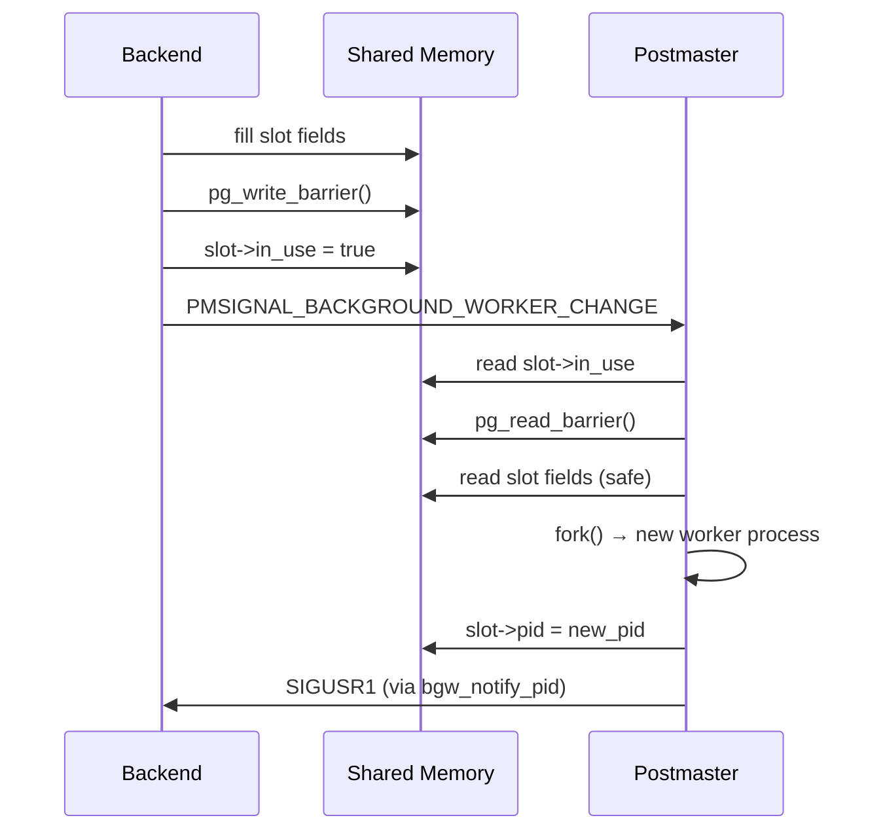

# Background Worker Processes

PostgreSQL's background worker framework lets extension authors and core subsystems run arbitrary C code as separate OS processes under postmaster supervision. The postmaster forks a background worker, which then runs a user-supplied `main` function. That function can optionally connect to a database and perform full transactions. The mechanism is the foundation for logical replication apply workers, autovacuum workers, parallel query workers, and any extension that needs persistent server-side processing without a client connection.

The entire public interface lives in `src/include/postmaster/bgworker.h`. Internal postmaster bookkeeping uses `src/include/postmaster/bgworker_internals.h`, which is not part of the extension API.

## The BackgroundWorker Struct

A `BackgroundWorker` struct describes every worker; the registering code fills it in before calling one of the registration functions.

```c
typedef struct BackgroundWorker
{
    char        bgw_name[BGW_MAXLEN];      /* display name */
    char        bgw_type[BGW_MAXLEN];      /* type name, for pg_stat_activity */
    int         bgw_flags;                 /* capability flags */
    BgWorkerStartTime bgw_start_time;      /* earliest start point */
    int         bgw_restart_time;          /* seconds between restarts, or BGW_NEVER_RESTART */
    char        bgw_library_name[BGW_MAXLEN]; /* library containing entry point */
    char        bgw_function_name[BGW_MAXLEN]; /* entry point function name */
    Datum       bgw_main_arg;              /* argument passed to entry point */
    char        bgw_extra[BGW_EXTRALEN];   /* extra data (128 bytes) */
    pid_t       bgw_notify_pid;            /* send SIGUSR1 here on start/stop */
} BackgroundWorker;
```

(`src/include/postmaster/bgworker.h`)

### Field Reference

| Field | Size | Description |
|---|---|---|
| `bgw_name` | 96 bytes | Human-readable name shown in `ps` output and server log messages |
| `bgw_type` | 96 bytes | Type string reported in `pg_stat_activity.backend_type`; defaults to `bgw_name` if empty |
| `bgw_flags` | int | Bitfield of capability flags (see below) |
| `bgw_start_time` | enum | Earliest postmaster state at which this worker may be started |
| `bgw_restart_time` | int | Seconds to wait after a crash before restarting; `BGW_NEVER_RESTART` (-1) suppresses restart |
| `bgw_library_name` | 96 bytes | Shared library containing the entry point; `"postgres"` for internal workers |
| `bgw_function_name` | 96 bytes | Name of the C function to invoke; looked up at exec time via `LookupBackgroundWorkerFunction` |
| `bgw_main_arg` | Datum | Single argument forwarded to the entry-point function |
| `bgw_extra` | 128 bytes | Unstructured byte buffer for additional startup data |
| `bgw_notify_pid` | pid_t | PID to receive `SIGUSR1` when the worker starts or stops; only valid for dynamic workers |

### bgw_flags Bitmask

| Constant | Value | Meaning |
|---|---|---|
| `BGWORKER_SHMEM_ACCESS` | `0x0001` | Worker requires access to shared memory. Mandatory for all workers since PostgreSQL 14; the flag is kept for API compatibility and code clarity |
| `BGWORKER_BACKEND_DATABASE_CONNECTION` | `0x0002` | Worker will connect to a database. Requires `BGWORKER_SHMEM_ACCESS`. Incompatible with `BgWorkerStart_PostmasterStart` |
| `BGWORKER_CLASS_PARALLEL` | `0x0010` | Internal use by the parallel query subsystem. Third-party workers must not use this flag |

### bgw_start_time Values

| Value | When started | Notes |
|---|---|---|
| `BgWorkerStart_PostmasterStart` | Immediately after postmaster initializes (`PM_INIT` / `PM_STARTUP` / `PM_RECOVERY`) | Cannot request a database connection — catalogs are not yet accessible |
| `BgWorkerStart_ConsistentState` | After reaching `PM_HOT_STANDBY` (standbys) or `PM_RUN` on primaries | Safe to read shared catalogs; database connections permitted |
| `BgWorkerStart_RecoveryFinished` | Only after `PM_RUN` — i.e., after recovery is complete | Standard choice for extension workers that perform DML |

The postmaster evaluates eligibility in `bgworker_should_start_now()` (`postmaster.c`) every time `maybe_start_bgworkers()` is called.

### Restart Behavior Constants

| Constant | Value | Effect |
|---|---|---|
| `BGW_DEFAULT_RESTART_INTERVAL` | 60 | Default seconds between restarts |
| `BGW_NEVER_RESTART` | -1 | Worker is not restarted; its slot is freed when it exits |

The postmaster considers a worker that exits with code 0 to have terminated intentionally. It never restarts that worker, regardless of `bgw_restart_time`. It considers a worker that exits with code 1 to have crashed. It restarts that worker after `bgw_restart_time` seconds. Any other exit code triggers a cluster-wide crash-restart (`postmaster.c`, `CleanupBackgroundWorker()`).

## Registration

### Static Registration: RegisterBackgroundWorker

```c
void RegisterBackgroundWorker(BackgroundWorker *worker);
```

Call this function during the `_PG_init()` hook of a shared library that is listed in `shared_preload_libraries`. PostgreSQL accepts the registration only while `process_shared_preload_libraries_in_progress` is true (or for internal workers whose `bgw_library_name` is `"postgres"`). Attempting to call it later has no effect. It logs a `LOG`-level message instead.

`RegisterBackgroundWorker` appends a `RegisteredBgWorker` node to the postmaster's private `BackgroundWorkerList` singly linked list. At `BackgroundWorkerShmemInit()` time the postmaster copies each registered worker into the `BackgroundWorkerArray` in shared memory, assigning one `BackgroundWorkerSlot` per worker (`bgworker.c`).

Static workers cannot set `bgw_notify_pid`; the field must be zero.

### Dynamic Registration: RegisterDynamicBackgroundWorker

```c
bool RegisterDynamicBackgroundWorker(BackgroundWorker *worker,
                                     BackgroundWorkerHandle **handle);
```

Any regular backend may call this at runtime to request that the postmaster fork a new worker. The function:

1. Validates the struct via `SanityCheckBackgroundWorker()`.
2. Acquires `BackgroundWorkerLock` ([[subsystems/locking/lwlocks|LWLock]]) in exclusive mode.
3. Scans `BackgroundWorkerArray.slot[]` for an unused slot (`in_use == false`).
4. Copies the `BackgroundWorker` struct into the slot, increments `slot->generation`, and atomically sets `slot->in_use = true` behind a write memory barrier.
5. Releases the lock and sends `PMSIGNAL_BACKGROUND_WORKER_CHANGE` to the postmaster.

If no free slot exists the function returns `false` without blocking. The caller can retry or report an error.

When `handle != NULL`, the function allocates a `BackgroundWorkerHandle` in the caller's [[subsystems/memory/contexts|memory context]]. It stores the slot index and generation number in the handle:

```c
struct BackgroundWorkerHandle {
    int    slot;
    uint64 generation;
};
```

The generation counter prevents a stale handle from accidentally referring to a recycled slot.

## Shared Memory Layout

The background worker array is a single contiguous allocation obtained via `ShmemInitStruct("Background Worker Data", ...)` during postmaster startup:

```c
typedef struct BackgroundWorkerArray {
    int      total_slots;                        /* == max_worker_processes */
    uint32   parallel_register_count;            /* parallel workers ever registered */
    uint32   parallel_terminate_count;           /* parallel workers ever terminated */
    BackgroundWorkerSlot slot[FLEXIBLE_ARRAY_MEMBER];
} BackgroundWorkerArray;
```

Each slot holds:

```c
typedef struct BackgroundWorkerSlot {
    bool             in_use;      /* handshake flag; see locking protocol below */
    bool             terminate;   /* request graceful stop and do not restart */
    pid_t            pid;         /* InvalidPid = not yet started; 0 = dead */
    uint64           generation;  /* incremented each time slot is recycled */
    BackgroundWorker worker;      /* copy of the registration struct */
} BackgroundWorkerSlot;
```

(`bgworker.c`)

### Lockless Postmaster Protocol

The postmaster cannot take locks (not even spinlocks) because a deadlock or corruption inside the postmaster would take down the entire cluster. Slot access therefore follows a strict memory-barrier protocol:

- **Backends** may modify a slot only while `in_use == false`. Before setting `in_use = true` they must write all other fields and issue a `pg_write_barrier()`.
- **Postmaster** may examine a slot only after reading `in_use == true` and issuing a `pg_read_barrier()`.
- The `terminate` flag is an exception: backends may set it at any time under `BackgroundWorkerLock` (LW_EXCLUSIVE), even when the slot is in use. The postmaster treats it as an advisory hint and acts on it without acquiring any lock.



## Lifecycle

```mermaid
flowchart TD
    A[_PG_init or backend code] -->|RegisterBackgroundWorker| B[BackgroundWorkerList entry]
    A -->|RegisterDynamicBackgroundWorker| C[BackgroundWorkerSlot in_use=true]
    B --> D[BackgroundWorkerShmemInit: copy to slot]
    D --> E{bgworker_should_start_now?}
    C --> E
    E -->|yes| F[postmaster fork()]
    F --> G[StartBackgroundWorker]
    G --> H[InitProcess + BaseInit]
    H --> I[LookupBackgroundWorkerFunction]
    I --> J[entrypt(bgw_main_arg)]
    J --> K{exit code?}
    K -->|0| L[slot freed, never restarted]
    K -->|1| M[rw_crashed_at recorded]
    M --> N{bgw_restart_time?}
    N -->|BGW_NEVER_RESTART| L
    N -->|elapsed ≥ restart_time| F
    K -->|other| O[HandleChildCrash: cluster restart]
```

### Postmaster Fork Path

When `maybe_start_bgworkers()` determines a worker is ready (via `bgworker_should_start_now()`), it calls `do_start_bgworker()`, which calls `StartBackgroundWorker()` in the child after `fork()`. The child's execution path is:

1. `IsBackgroundWorker = true`; process type set to `B_BG_WORKER`.
2. Signal handlers installed (see Signal Handling section).
3. `sigsetjmp` error recovery block established; any `ereport(ERROR)` calls `proc_exit(1)`.
4. `InitProcess()` — allocates a `PGPROC` slot in shared memory, enabling LWLock use.
5. `BaseInit()` — sets up memory contexts, buffer manager, etc.
6. `LookupBackgroundWorkerFunction(bgw_library_name, bgw_function_name)` — resolves the function pointer. For `bgw_library_name == "postgres"` this searches `InternalBGWorkers[]`; otherwise it calls `load_external_function()`.
7. `entrypt(worker->bgw_main_arg)` — control passes to user code.
8. If the function returns normally, `proc_exit(0)` is called.

The worker does **not** call `InitPostgres()` at startup. It defers database attachment until the entry point explicitly calls `BackgroundWorkerInitializeConnection()`.

### Connecting to a Database

```c
void BackgroundWorkerInitializeConnection(const char *dbname,
                                          const char *username,
                                          uint32 flags);

void BackgroundWorkerInitializeConnectionByOid(Oid dboid, Oid useroid,
                                               uint32 flags);
```

(`postmaster.c`)

These functions call `InitPostgres()` internally, which opens the system catalogs, starts a transaction if needed, and loads per-database GUCs. The worker may call them only once per worker process. It must have registered with `BGWORKER_BACKEND_DATABASE_CONNECTION`; calling without that flag raises `FATAL`.

If `dbname` (or `dboid`) is NULL the worker connects to the shared catalog namespace only — it can access global catalogs such as `pg_authid`, but it does not open a user database. The logical replication launcher uses this form (`launcher.c`: `BackgroundWorkerInitializeConnection(NULL, NULL, 0)`).

The `BGWORKER_BYPASS_ALLOWCONN` flag overrides `datallowconn = false`, which is sometimes needed for maintenance workers connecting to a database that is being taken offline.

## Dynamic Worker Handles

After calling `RegisterDynamicBackgroundWorker` the caller receives a `BackgroundWorkerHandle *`. Three functions operate on it:

### Synchronizing on worker startup

```c
BgwHandleStatus WaitForBackgroundWorkerStartup(BackgroundWorkerHandle *handle,
                                               pid_t *pidp);
```

`WaitForBackgroundWorkerStartup()` blocks the caller on `WaitLatch(WL_LATCH_SET | WL_POSTMASTER_DEATH)` until the postmaster reports the worker PID via `SIGUSR1`. It returns `BGWH_STARTED` with `*pidp` set, `BGWH_STOPPED` if the worker exited before being observed as running, or `BGWH_POSTMASTER_DIED`. The caller must have set `bgw_notify_pid = MyProcPid` before registration.

### Synchronizing on worker shutdown

```c
BgwHandleStatus WaitForBackgroundWorkerShutdown(BackgroundWorkerHandle *handle);
```

`WaitForBackgroundWorkerShutdown()` blocks until `GetBackgroundWorkerPid` returns `BGWH_STOPPED` or the postmaster dies. It uses the same `WaitLatch` pattern.

### Requesting worker termination

```c
void TerminateBackgroundWorker(BackgroundWorkerHandle *handle);
```

`TerminateBackgroundWorker()` sets `slot->terminate = true` under `BackgroundWorkerLock`. It then sends `PMSIGNAL_BACKGROUND_WORKER_CHANGE`. The postmaster will send `SIGTERM` to the worker on its next pass through `BackgroundWorkerStateChange()`. The postmaster does not restart the worker after it exits. It is safe to call even if the worker has already exited.

### BgwHandleStatus Values

| Status | Meaning |
|---|---|
| `BGWH_STARTED` | Worker is running; PID written to `*pidp` |
| `BGWH_NOT_YET_STARTED` | Postmaster has not yet forked the worker |
| `BGWH_STOPPED` | Worker has exited (temporarily or permanently) |
| `BGWH_POSTMASTER_DIED` | Postmaster exited; worker state unknown |

## Signal Handling

### BackgroundWorkerBlockSignals / BackgroundWorkerUnblockSignals

```c
void BackgroundWorkerBlockSignals(void);
void BackgroundWorkerUnblockSignals(void);
```

Thin wrappers around `sigprocmask(SIG_SETMASK, &BlockSig, NULL)` and `sigprocmask(SIG_SETMASK, &UnBlockSig, NULL)` respectively (`postmaster.c`). The canonical startup pattern is:

```c
void my_bgworker_main(Datum arg)
{
    pqsignal(SIGTERM, die);
    pqsignal(SIGHUP,  SignalHandlerForConfigReload);
    BackgroundWorkerUnblockSignals();

    BackgroundWorkerInitializeConnection("mydb", NULL, 0);
    /* ... main loop ... */
}
```

### Default Signal Assignments in StartBackgroundWorker

`StartBackgroundWorker()` installs a set of defaults before calling the entry point:

| Signal | Handler (database-connected worker) | Handler (no database connection) |
|---|---|---|
| `SIGTERM` | `bgworker_die` — logs a FATAL and exits | same |
| `SIGINT` | `StatementCancelHandler` | `SIG_IGN` |
| `SIGHUP` | `SIG_IGN` (override in entry point) | `SIG_IGN` |
| `SIGUSR1` | `procsignal_sigusr1_handler` | `SIG_IGN` |
| `SIGUSR2` | `SIG_IGN` | `SIG_IGN` |
| `SIGPIPE` | `SIG_IGN` | `SIG_IGN` |
| `SIGFPE` | `FloatExceptionHandler` | `SIG_IGN` |
| `SIGCHLD` | `SIG_DFL` | `SIG_DFL` |

`bgworker_die` (`bgworker.c`) calls `sigprocmask(SIG_SETMASK, &BlockSig, NULL)` before issuing `ereport(FATAL)` so that the error path cannot be interrupted by another signal.

The entry point should override `SIGHUP` with `SignalHandlerForConfigReload` if it wants to reload `postgresql.conf` dynamically. After receiving `SIGHUP`, the standard check is:

```c
if (ConfigReloadPending) {
    ConfigReloadPending = false;
    ProcessConfigFile(PGC_SIGHUP);
}
```

## The WaitLatch Main Loop Pattern

All long-running background workers in core PostgreSQL follow the same idiom to sleep efficiently without busy-waiting:

```c
for (;;)
{
    int rc;

    CHECK_FOR_INTERRUPTS();

    /* ... do work ... */

    rc = WaitLatch(MyLatch,
                   WL_LATCH_SET | WL_TIMEOUT | WL_EXIT_ON_PM_DEATH,
                   sleep_ms,
                   wait_event_info);

    if (rc & WL_LATCH_SET)
    {
        ResetLatch(MyLatch);
        CHECK_FOR_INTERRUPTS();
    }

    if (ConfigReloadPending) {
        ConfigReloadPending = false;
        ProcessConfigFile(PGC_SIGHUP);
    }
}
```

`WaitLatch` puts the process to sleep using an OS primitive (eventfd on Linux, pipe on other platforms). The postmaster or another backend sets the latch via `SetLatch()` / `SIGUSR1`. `WL_EXIT_ON_PM_DEATH` terminates the wait immediately if the postmaster exits, preventing workers from running indefinitely after the cluster is gone. The caller must call `ResetLatch` before re-checking the condition that caused the wakeup, to avoid missing subsequent notifications.

## Shared Memory for Background Workers

### Static Workers: ShmemInitStruct

Static workers that need their own shared data call `ShmemInitStruct()` during `_PG_init` (which runs inside `BackgroundWorkerShmemInit`'s context):

```c
typedef struct MyWorkerState {
    LWLock  lock;
    bool    request_pending;
    /* ... */
} MyWorkerState;

MyWorkerState *myState;

void _PG_init(void) {
    RequestAddinShmemSpace(sizeof(MyWorkerState));
    RequestNamedLWLockTranche("myworker", 1);
    /* register the worker... */
}

void _PG_shmem_init(void) {
    bool found;
    myState = ShmemInitStruct("MyWorkerState",
                              sizeof(MyWorkerState), &found);
    if (!found)
        LWLockInitialize(&myState->lock, ...);
}
```

### Dynamic Workers: DSM Segments

Dynamic workers that exist for a single job typically communicate with their launcher via a dynamic shared memory (DSM) segment. The launcher creates the segment with `dsm_create()`. It stores the segment handle in `bgw_main_arg` (cast to `Datum`). The worker calls `dsm_attach(DatumGetUInt32(MyBgworkerEntry->bgw_main_arg))` to access it. The parallel query executor uses this pattern extensively (`src/backend/access/transam/parallel.c`).

The segment must outlive the worker. The launcher keeps a reference with `dsm_pin_mapping()`. It releases the reference after the worker exits.

## Capacity: max_worker_processes

The GUC `max_worker_processes` (default 8) is the hard upper bound on the total number of background worker slots across the entire cluster. The value is fixed at postmaster startup. It determines the size of `BackgroundWorkerArray`:

```c
size = offsetof(BackgroundWorkerArray, slot)
     + max_worker_processes * sizeof(BackgroundWorkerSlot);
```

(`BackgroundWorkerShmemSize()`, `bgworker.c`)

Both static and dynamic workers consume slots from this pool. Parallel workers additionally count against `max_parallel_workers`. If all `max_worker_processes` slots are occupied, `RegisterDynamicBackgroundWorker` returns `false`. The caller must then retry or fail gracefully. The postmaster logs a message at `LOG` level if a static worker cannot be registered at startup due to this limit.

Changing `max_worker_processes` requires a full server restart because the shared memory allocation is fixed.

## Core Examples

| Worker function | Library | Start time | Restart | Purpose |
|---|---|---|---|---|
| `ApplyLauncherMain` | `postgres` | `BgWorkerStart_RecoveryFinished` | 5 s | Logical replication launcher |
| `ApplyWorkerMain` | `postgres` | dynamic | `BGW_NEVER_RESTART` | Logical replication apply worker |
| `ParallelApplyWorkerMain` | `postgres` | dynamic | `BGW_NEVER_RESTART` | Parallel logical replication apply |
| `ParallelWorkerMain` | `postgres` | dynamic | `BGW_NEVER_RESTART` | Parallel query executor worker |
| `AutoVacWorkerMain` | postmaster-internal | requested via signal | n/a | Autovacuum table worker |
| archiver | postmaster-internal | `BgWorkerStart_RecoveryFinished` | n/a | WAL archiving |

Logical replication workers show the complete dynamic pattern: `ApplyLauncherMain` calls `RegisterDynamicBackgroundWorker` for each subscription. It sets `bgw_notify_pid = MyProcPid`. It then calls `WaitForBackgroundWorkerStartup` to confirm the worker is running before proceeding (`src/backend/replication/logical/launcher.c`).

## See also

- [[architecture/process-architecture]]
- [[architecture/shared-memory]]
- [[subsystems/background/autovacuum]]
- [[subsystems/replication/logical]]
- [[subsystems/background/bgwriter]]
- [[subsystems/background/walwriter]]
