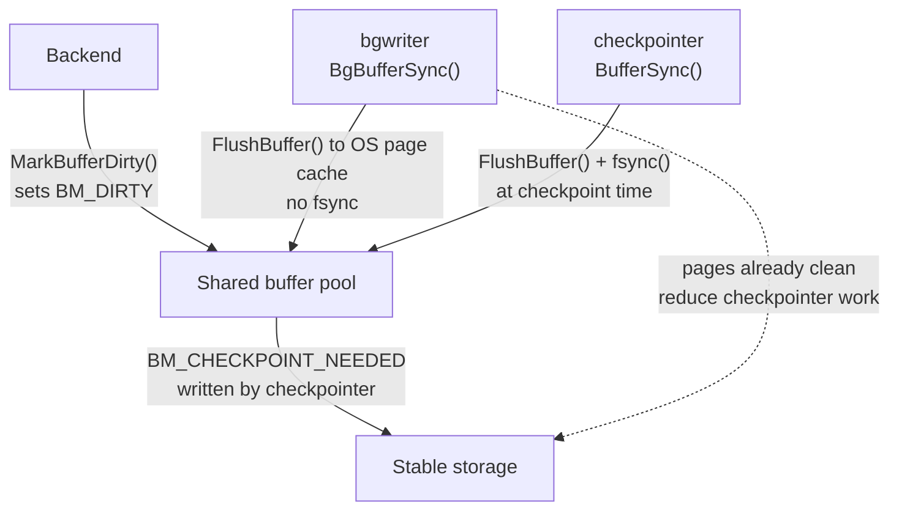

# Background Writer

The background writer (bgwriter) exists to keep a reservoir of clean shared buffers ready so that backends never — or rarely — have to write a dirty page themselves. When a backend needs a buffer slot and every candidate in the shared pool is dirty, the backend must flush that page to disk before it can reuse the slot. Under a write-heavy workload these forced backend writes accumulate into visible latency spikes. The bgwriter preemptively drains dirty buffers during idle time between those moments, so that free slots are usually available on demand.

PostgreSQL introduced the bgwriter in version 8.0 as the first step toward separating I/O concerns from transaction processing. In version 9.2, PostgreSQL split the checkpointing duties the bgwriter once carried into a dedicated checkpointer process. This left the bgwriter with a single, focused job: continuous opportunistic cleaning of the buffer pool.

## The Division of Labor Among I/O Processes

Three background processes share responsibility for writing data pages and WAL, and understanding their boundaries is essential to understanding the bgwriter's role.

The **bgwriter** scans the buffer pool continuously, writing dirty buffers to the operating system's page cache. It never calls `fsync`. Its goal is throughput smoothing, not durability.

The **checkpointer** runs at checkpoint time. It writes every buffer marked `BM_CHECKPOINT_NEEDED` to disk, then calls `fsync` on all modified data files to make writes durable. The checkpointer is the only process that guarantees data reaches stable storage. Because the bgwriter will already have flushed many of those dirty pages before the checkpoint fires, the checkpointer does proportionally less work — a well-tuned bgwriter shortens the sync phase of each checkpoint.

The **WAL writer** handles a completely separate concern: flushing WAL buffers from the in-memory WAL ring to the WAL files on disk at regular intervals. It never touches data pages.

Neither the bgwriter nor the WAL writer call `fsync` on data files; that boundary belongs exclusively to the checkpointer.



The key asymmetry is page selection. The bgwriter picks pages based on eviction likelihood — it targets what the clock sweep is about to reach. The checkpointer has no such discretion: at checkpoint start it scans the entire buffer pool. It sets `BM_CHECKPOINT_NEEDED` on every dirty permanent buffer. It must flush all of them before the checkpoint can complete (bufmgr.c). If the bgwriter already wrote a page and nothing re-dirtied it, the checkpointer finds it clean and skips it.

When a backend calls `ReadBuffer()` and there are no free slots, `BufferAlloc()` calls `StrategyGetBuffer()` to select a victim buffer. If that victim has `BM_DIRTY` set, the backend must write it synchronously via `FlushBuffer()` before it can evict the old page and load the new one (bufmgr.c). This write happens inside the backend's transaction critical path: the backend stalls, and the client waits. Under sustained write pressure, nearly every buffer miss triggers this stall. This latency cost is asymmetric. It is nearly invisible in average throughput measurements, because it only affects individual queries unlucky enough to find a dirty victim. But it shows up clearly at p99 and p999 latencies. The `pg_stat_bgwriter` counter `buffers_backend` tracks these forced writes. A healthy system shows it as a small fraction of `buffers_clean`. When the two approach parity, the bgwriter is not keeping up. The `buffers_backend` counter accumulates backend-driven writes. The checkpointer tracks these writes in shared memory as `num_backend_writes`. It periodically absorbs them into `PendingCheckpointerStats.buf_written_backend` (checkpointer.c). The bgwriter's own writes increment `PendingBgWriterStats.buf_written_clean` in `BgBufferSync()` (bufmgr.c).

## The Main Loop: BackgroundWriterMain

`BackgroundWriterMain()` (bgwriter.c) is the process entry point. After signal setup and [[subsystems/memory/contexts|memory context]] initialization, it enters an infinite loop with three phases per iteration:

1. Call `BgBufferSync()` to perform one round of dirty-buffer scanning. This is the core work.
2. Handle housekeeping: report statistics, close smgr file handles after a checkpoint, log a standby snapshot if needed.
3. Sleep via `WaitLatch()` for `BgWriterDelay` milliseconds (default 200 ms), then wake on latch signal or timeout.

The loop expects `BgBufferSync()` to be called on a consistent `BgWriterDelay`-millisecond cadence. The feedback control loop inside `BgBufferSync()` computes moving averages that assume this regularity. Adding work to the main loop that frequently triggers early wakeups would distort the density and allocation estimates. This would cause the bgwriter to either over-write or under-write. The comment in the source notes this directly. It recommends avoiding frequent latch events in the main loop (bgwriter.c).

The `BgWriterDelay` GUC corresponds to `bgwriter_delay`. Lowering it makes the bgwriter respond more quickly to demand at the cost of more CPU wakeups; raising it batches more work per cycle but increases the window during which backends might encounter dirty victims.

## Hibernation

When the pool is genuinely idle — no recent buffer allocations, and the bgwriter has lapped ahead of the clock sweep — repeatedly waking at `bgwriter_delay` wastes CPU and prevents the system from entering lower power states. `BgBufferSync()` signals this readiness to hibernate by returning `true`, which means the bgwriter has fully lapped the strategy clock sweep and `recent_alloc` was zero.

The main loop requires two consecutive hibernate-eligible cycles before acting, to avoid a race where a backend allocates a buffer between the `BgBufferSync()` observation and the latch registration. On the second consecutive signal, the bgwriter calls `StrategyNotifyBgWriter(MyProc->pgprocno)` to register for a wakeup on the next buffer allocation, then sleeps for `BgWriterDelay * HIBERNATE_FACTOR` (50x, so 10 seconds at the default 200 ms). After the extended sleep, it calls `StrategyNotifyBgWriter(-1)` to clear the registration in case the wakeup was missed due to a race (bgwriter.c).

## How the Clock-Sweep Scan Works

The buffer pool's replacement algorithm is a clock sweep. A pointer advances through the `BufferDesc` array, decrementing each buffer's usage count. A buffer with a usage count of zero and no active pins becomes a candidate for eviction and reuse. The freelist strategy code (`StrategyGetBuffer()`, freelist.c) owns the clock-sweep pointer.

The bgwriter does not run an independent scan. Instead it tracks the strategy pointer and runs *ahead* of it. Each call to `BgBufferSync()` (bufmgr.c) reads the current strategy position via `StrategySyncStart()`. It computes how far the sweep has advanced since the previous cycle. It then scans forward from its own `next_to_clean` position toward the sweep, looking for buffers that have `BM_DIRTY` set and a usage count of zero — exactly the buffers the clock sweep is about to reach. By writing those pages now, the bgwriter ensures that when `StrategyGetBuffer()` arrives at those slots they will be clean and immediately reusable.

When the bgwriter is fully caught up and ahead of the clock sweep by an entire pass, `bufs_to_lap` becomes zero. Hibernation is then eligible. When the bgwriter falls behind — because allocation activity outpaced its scan — it skips its `next_to_clean` pointer forward to the strategy point. It begins cleaning from there, accepting that it missed some pages in between.

`SyncOneBuffer()` (bufmgr.c) handles each individual buffer. When called with `skip_recently_used = true` (as the bgwriter always does), it skips any buffer whose usage count or pin count is non-zero, because such buffers are not eviction candidates yet. The function checks `BM_VALID | BM_DIRTY` under the buffer header spinlock. It then pins the buffer and acquires a shared content lock. It calls `FlushBuffer()`. After the write, it schedules the buffer tag for writeback via `ScheduleBufferTagForWriteback()` to coalesce OS writeback notifications.

The `SyncOneBuffer()` return value is a bitmask: `BUF_WRITTEN` if the function performed a write, `BUF_REUSABLE` if the buffer had zero pin and usage count, regardless of whether the function wrote it. Both conditions count toward `reusable_buffers` in the scan loop, because the goal is ensuring enough clean reusable buffers exist, not maximizing the write count.

## FlushBuffer vs MarkBufferDirtyHint

`FlushBuffer()` and `MarkBufferDirtyHint()` serve opposite roles in the buffer lifecycle. Confusing them is a source of subtle bugs.

`FlushBuffer()` is the internal function that actually writes a page from the shared buffer to the OS. It requires the caller to hold a pin and a shared content lock. Before writing, it flushes WAL up through the buffer's LSN via `XLogFlush()` — this enforces the WAL-before-data rule: the log record describing the change must reach disk before the data page does. `FlushBuffer()` then calls `smgrwrite()` to pass the page to the storage manager. It does not call `fsync`. The bgwriter, checkpointer, and backends all use `FlushBuffer()` when writing dirty pages (bufmgr.c).

`MarkBufferDirtyHint()` marks a buffer dirty for non-critical, non-WAL-logged changes — primarily [[subsystems/transactions/hint-bits|hint bit]] updates such as setting `t_infomask` bits on heap tuples to reflect committed or aborted transaction status. It requires only a share lock (not exclusive) on the buffer content. It does not guarantee that the dirty mark will always succeed, due to an intentional race tolerance. When page checksums are enabled, it may need to write an `XLOG_FPI_FOR_HINT` WAL record to protect against torn pages, but only if the page is clean at the time (bufmgr.c). `MarkBufferDirty()` — the non-hint variant — requires an exclusive content lock; PostgreSQL uses it for all transactional changes.

The practical consequence: hint bit updates generate dirty buffers that the bgwriter and checkpointer must eventually flush, but they carry no WAL LSN that would require WAL flushing before the page write. When checksums are off and the page was already dirty, `MarkBufferDirtyHint()` is nearly free; when checksums are on and the page is clean, it incurs a full-page WAL record.

## The Feedback Control Loop

Running just fast enough to stay ahead of the clock sweep — without wasting I/O on buffers that will not be evicted soon — requires a feedback loop. `BgBufferSync()` maintains two exponentially smoothed estimates, both with a 16-sample window:

- **`smoothed_alloc`**: a moving average of how many buffer allocations have occurred per bgwriter cycle, giving an estimate of demand. It uses fast-attack, slow-decay behavior: it immediately jumps to the new value if allocations spike but declines gradually via the average otherwise.
- **`smoothed_density`**: a moving average of how many buffers the clock sweep scans per reusable buffer found, reflecting how "dirty" the pool currently is. A higher density means fewer clean buffers per unit of scanning effort.

From these, `BgBufferSync()` computes `upcoming_alloc_est` — the expected number of clean buffers that will be needed in the next cycle, scaled by `bgwriter_lru_multiplier`:

```
upcoming_alloc_est = smoothed_alloc * bgwriter_lru_multiplier
```

The scan loop runs forward through `next_to_clean` until `reusable_buffers` reaches `upcoming_alloc_est`, or the bgwriter has lapped the clock sweep, or it has written `bgwriter_lru_maxpages` pages (bufmgr.c). `bgwriter_lru_multiplier` (default 2.0) acts as a safety margin: by aiming to clean twice the estimated demand, the bgwriter absorbs short bursts without backends falling behind.

Even when allocation activity falls to near zero, the loop still advances by a minimum number of buffers per cycle:

```
min_scan_buffers = NBuffers / (120000 ms / BgWriterDelay ms)
```

This ensures the bgwriter traverses the entire buffer pool at least once in approximately two minutes during idle periods, keeping the pool reasonably clean before a burst of writes. The `120000` millisecond constant (`scan_whole_pool_milliseconds`) is currently not a GUC.

The density estimate update happens twice per cycle: once based on the strategy clock sweep's observed progress, and once based on the bgwriter's own scan results. Using both sources halves the effective smoothing period when both scans are active, making the estimate more responsive during heavy write periods (bufmgr.c).

## Configuration Parameters

| GUC | Default | Effect |
|-----|---------|--------|
| `bgwriter_delay` | 200 ms | Sleep interval between cleaning rounds. The feedback loop assumes this is consistent; erratic wakeups distort the density estimates. |
| `bgwriter_lru_maxpages` | 100 | Maximum pages written per round. Acts as a hard ceiling on bgwriter I/O burst per cycle. Setting to 0 disables proactive cleaning entirely. |
| `bgwriter_lru_multiplier` | 2.0 | Safety margin multiplier on `smoothed_alloc` when computing `upcoming_alloc_est`. Higher values make the bgwriter more aggressive about staying ahead of demand. |
| `bgwriter_flush_after` | 512 kB | After this many bytes of writes, issue an OS writeback hint via `WritebackContext`. Controls how aggressively kernel dirty pages are written back, reducing writeback storms. |

Setting `bgwriter_lru_maxpages` to 0 disables the LRU scan entirely. The process still runs and performs its secondary duties — standby snapshot logging, statistics reporting, and smgr file cleanup after checkpoints — but writes no dirty buffers proactively.

Raising `bgwriter_lru_multiplier` beyond 2.0 is rarely necessary. It can increase I/O on otherwise-idle systems, since the minimum scan floor (`min_scan_buffers`) provides a baseline even with zero allocations. Lowering it below 1.0 risks having the bgwriter consistently fall behind, increasing `buffers_backend`.

## When the Bgwriter Falls Behind

`pg_stat_bgwriter` provides the primary observability. Two counters are most diagnostic:

- `buffers_clean`: pages written by the bgwriter during LRU scans. Incremented via `PendingBgWriterStats.buf_written_clean` in `BgBufferSync()` (bufmgr.c).
- `buffers_backend`: pages written by backends directly during buffer eviction. The checkpointer accumulates this through its shared memory counter `num_backend_writes`. It reports the count under its own stats entry (checkpointer.c).
- `maxwritten_clean`: times the bgwriter hit the `bgwriter_lru_maxpages` ceiling and stopped early. A nonzero value indicates that writes regularly hit the ceiling.

A healthy system keeps `buffers_backend` near zero relative to `buffers_clean`. When `buffers_backend` rises, it signals that the bgwriter is not pre-cleaning fast enough. The usual causes are:

- `bgwriter_lru_maxpages` too low for the write rate. The ceiling cuts off cleaning before demand is met.
- `bgwriter_delay` too high, causing the bgwriter to sleep through periods of high allocation activity.
- Extremely high buffer turnover that simply outpaces any single-process pre-cleaner. In this regime, increasing `shared_buffers` or reducing churn is more effective than tuning bgwriter parameters.

A rising `maxwritten_clean` alongside rising `buffers_backend` points directly at `bgwriter_lru_maxpages` as the constraint. If `maxwritten_clean` is zero but `buffers_backend` is high, the issue is likely the delay or overall allocation rate.

## Buffer State Flags

The buffer state field packs several flags into a single 32-bit atomic word alongside the pin count and usage count:

| Flag | Bit | Meaning |
|------|-----|---------|
| `BM_DIRTY` | 23 | Page has been modified; must be written before slot can be reused |
| `BM_VALID` | 24 | Buffer contains valid data |
| `BM_TAG_VALID` | 25 | Buffer's page tag (relation, fork, block) is assigned |
| `BM_IO_IN_PROGRESS` | 26 | A read or write I/O is underway |
| `BM_JUST_DIRTIED` | 28 | Dirtied again after a write started; prevents the write from clearing the dirty flag prematurely |
| `BM_PERMANENT` | 29 | Buffer belongs to a permanent (WAL-logged) relation |
| `BM_CHECKPOINT_NEEDED` | 30 | Must be written for the current checkpoint |

The bgwriter cares primarily about `BM_DIRTY`. The checkpointer additionally uses `BM_CHECKPOINT_NEEDED` to track which buffers must be flushed in the current checkpoint cycle. The checkpointer sets `BM_CHECKPOINT_NEEDED` at the start of a checkpoint; whoever writes the page next — bgwriter, checkpointer, or a backend — clears it, so all three contribute to checkpoint progress (bufmgr.c).

`BM_JUST_DIRTIED` exists to handle the race where a backend re-dirties a page after `FlushBuffer()` has started but before it completes. `FlushBuffer()` clears this flag at the start of the write; if another writer sets `BM_DIRTY | BM_JUST_DIRTIED` concurrently, the flush cannot safely clear the dirty flag at the end, so the page remains dirty for the next cycle.

## Checkpoint Cooperation: Who Writes What

The checkpoint sequence begins in `BufferSync()` (bufmgr.c), which the checkpointer calls. It first scans the entire buffer array. It sets `BM_CHECKPOINT_NEEDED` on every dirty permanent buffer, building a sorted list of buffers to write. It then works through that list using `SyncOneBuffer()`, but with `skip_recently_used = false` — unlike the bgwriter, the checkpointer cannot skip pinned or recently-used buffers; it must write them all.

The bgwriter continues running during a checkpoint. Any buffer it writes that has `BM_CHECKPOINT_NEEDED` set contributes to checkpoint progress: the checkpointer checks the flag before writing, and if the buffer is now clean, it skips it. This means the bgwriter's pre-cleaning during the inter-checkpoint period directly reduces the checkpointer's write workload, which in turn shortens the checkpoint and reduces the I/O spike that checkpoints otherwise produce.

The checkpointer also spreads its writes over time using `CheckpointWriteDelay()`, throttling based on `checkpoint_completion_target`. The bgwriter has no such throttle — it writes as fast as the feedback loop demands, bounded only by `bgwriter_lru_maxpages`. This is intentional: the bgwriter should run ahead of the checkpointer, not compete with it.

## Secondary Duties

The bgwriter's main loop also handles two lower-priority tasks that fit naturally in a process that wakes regularly.

**Standby snapshot logging.** When hot standby is enabled, the bgwriter periodically calls `LogStandbySnapshot()` to write an `xl_running_xacts` record to WAL. This lets standbys reach a consistent snapshot state faster. It also allows cleanup of lock and KnownXids state. The interval is 15 seconds (`LOG_SNAPSHOT_INTERVAL_MS`). The bgwriter skips the write if no new WAL has been inserted since the last snapshot, avoiding unnecessary disk activity on idle systems. PostgreSQL assigns this duty to the bgwriter because it is the only auxiliary process that consistently returns to its main loop; the checkpointer, when actively running a checkpoint, is rarely in its loop (bgwriter.c).

**Smgr file cleanup.** After each checkpoint, the bgwriter calls `smgrcloseall()` to close any storage manager file handles that may reference deleted relation files. This prevents stale file descriptors from accumulating, which matters particularly on Windows where holding deleted files open causes errors.

## Relation to Checkpoint Performance

Two phases dominate a checkpoint's cost: writing all `BM_CHECKPOINT_NEEDED` buffers (spread over `checkpoint_completion_target * checkpoint_timeout`), then calling `fsync` on every modified file. If the bgwriter has already written a large fraction of the dirty buffers before the checkpoint begins, the write phase is shorter. More importantly, pages written by the bgwriter and not re-dirtied since do not require a new write during the checkpoint — the checkpointer just needs to fsync the file. The result is that a well-tuned bgwriter reduces both checkpoint write amplification and the duration of the sync phase.

The inverse is also true: tuning the checkpointer without considering the bgwriter often has less impact than expected. If `bgwriter_lru_maxpages` is too low and backends are doing their own writes throughout the inter-checkpoint period, the checkpointer still encounters a large dirty-page population at checkpoint start.

## Related Topics

- [[subsystems/storage/buffer-manager]] — the buffer pool the bgwriter operates on, including clock-sweep eviction and `BufferDesc` layout
- [[subsystems/wal/checkpoint]] — the process responsible for fsync and checkpoint coordination
- [[subsystems/background/walwriter]] — the WAL writer's analogous role for WAL buffers
- [[architecture/process-architecture]] — how the postmaster spawns and supervises auxiliary processes including bgwriter
- [[subsystems/replication/hot-standby]] — why standby snapshot logging from the bgwriter matters
