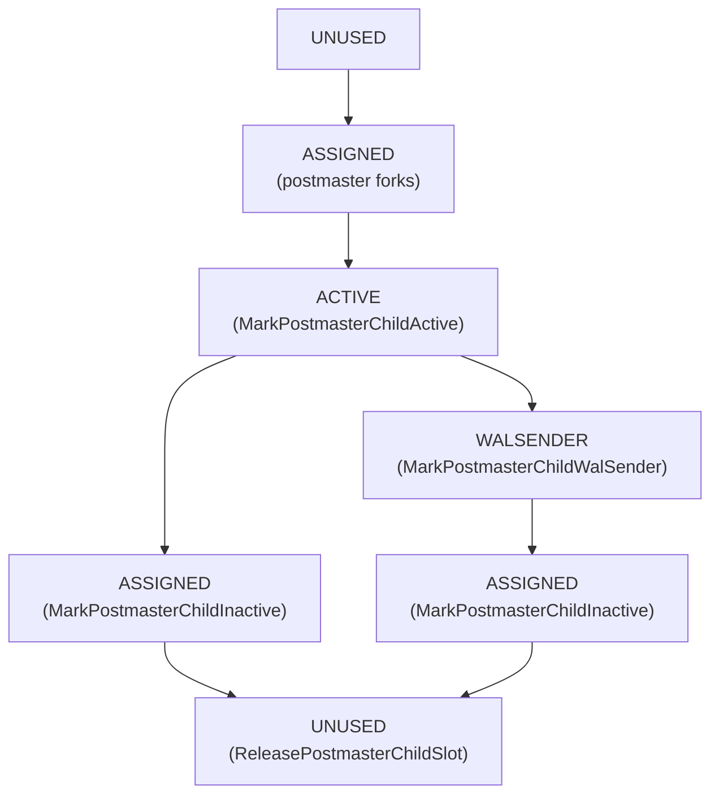

The postmaster signal mechanism is a shared-memory rendezvous layer that lets backend processes request specific postmaster actions — starting an [[subsystems/background/autovacuum|autovacuum]] worker, launching a WAL receiver, rotating the log file — without encoding that intent inside a raw Unix signal number. Unix signals carry only a signal number with no portable way to attach a payload. PostgreSQL already uses nearly every available signal for specific purposes (SIGTERM for graceful shutdown, SIGHUP for configuration reload, SIGQUIT for immediate crash-and-restart), leaving no spare numbers to allocate one per postmaster action. Even if free signal numbers existed, a single-bit per-signal model cannot represent concurrent distinct notifications from different backends — for example a backend requesting a new autovacuum worker at the same moment a standby startup process signals that Hot Standby is ready. Instead, a backend writes a flag into the `PMSignalData` structure in shared memory and then delivers SIGUSR1 to wake the postmaster. The postmaster polls the flags after the signal arrives and dispatches whatever work is requested. Because the flags are `volatile sig_atomic_t` values and the postmaster is the only reader, no explicit lock is needed.

## PMSignalData and the Flag Array

`PMSignalData` (defined in pmsignal.c, opaque to all other translation units) holds two distinct communication channels plus the child-process tracking state:

```
struct PMSignalData {
    sig_atomic_t PMSignalFlags[NUM_PMSIGNALS]; /* child → postmaster */
    QuitSignalReason sigquit_reason;           /* postmaster → children */
    int          num_child_flags;
    sig_atomic_t PMChildFlags[FLEXIBLE_ARRAY_MEMBER];
};
```

The `PMSignalFlags` array is indexed by `PMSignalReason`, an enum defined in pmsignal.h:

| Reason | Purpose |
|---|---|
| `PMSIGNAL_RECOVERY_STARTED` | Startup process signals that crash recovery has begun |
| `PMSIGNAL_BEGIN_HOT_STANDBY` | Startup process signals that Hot Standby is now accepting queries |
| `PMSIGNAL_ROTATE_LOGFILE` | Request log-file rotation via the syslogger |
| `PMSIGNAL_START_AUTOVAC_LAUNCHER` | Request the autovacuum launcher be started |
| `PMSIGNAL_START_AUTOVAC_WORKER` | Autovacuum launcher requests a new worker |
| `PMSIGNAL_BACKGROUND_WORKER_CHANGE` | A background worker's desired state has changed |
| `PMSIGNAL_START_WALRECEIVER` | Startup process requests a WAL receiver be launched |
| `PMSIGNAL_ADVANCE_STATE_MACHINE` | Generic nudge to re-evaluate the postmaster's state machine |

Because each reason gets its own boolean slot, two different backends can signal two different reasons at the same time without either notification being lost. However, if the same reason is signalled more than once before the postmaster checks, only one notification is observed — the flag is already set. This coalescing is acceptable for all current uses: the postmaster simply starts one worker per wakeup. The autovacuum launcher will re-signal if more workers are still needed.

## The Write/Read Handshake

`SendPostmasterSignal()` (pmsignal.c) implements the write side in two instructions:

1. Set `PMSignalState->PMSignalFlags[reason] = true`.
2. `kill(PostmasterPid, SIGUSR1)`.

The flag write happens before the signal is delivered, so by the time the postmaster's SIGUSR1 handler returns and the main loop calls `CheckPostmasterSignal()`, the flag is visible. `CheckPostmasterSignal()` reads the flag and, if set, clears it and returns true. The postmaster iterates over all `PMSignalReason` values after each SIGUSR1. It dispatches actions accordingly. If called in a standalone backend (no postmaster), `SendPostmasterSignal()` is a no-op.

## Reverse Channel: SIGQUIT Reason

Communication also flows the other way. Before broadcasting SIGQUIT to all children, the postmaster writes a `QuitSignalReason` value into `PMSignalState->sigquit_reason` via `SetQuitSignalReason()`. Children that receive SIGQUIT can call `GetQuitSignalReason()` to learn whether the shutdown is due to a backend crash (`PMQUIT_FOR_CRASH`) or an operator-requested immediate stop (`PMQUIT_FOR_STOP`). They then adjust their cleanup behavior accordingly. The field is reset to zero (PMQUIT_NOT_SENT) whenever shared memory is rebuilt after a crash.

## Child-Process Lifecycle Tracking

The flexible `PMChildFlags` array tracks the state of every live postmaster child. `AssignPostmasterChildSlot()` assigns each child a slot when the postmaster forks it; it stores the slot index in `MyPMChildSlot` in the child. The state machine has four values:

| State | Meaning |
|---|---|
| `PM_CHILD_UNUSED` (0) | Slot is available |
| `PM_CHILD_ASSIGNED` (1) | Postmaster has forked the child; child has not yet touched shared memory, or has finished and cleaned up |
| `PM_CHILD_ACTIVE` (2) | Child is actively using shared memory |
| `PM_CHILD_WALSENDER` (3) | Child is an active WAL sender (a substate of ACTIVE) |

The child transitions are:



When the postmaster reaps a child via `waitpid`, it calls `ReleasePostmasterChildSlot()`. If the slot is still in `ASSIGNED` state the child exited cleanly; if it is still `ACTIVE` or `WALSENDER` the child crashed without calling `MarkPostmasterChildInactive()`. This distinction drives the postmaster's decision about whether to initiate a crash-and-restart cycle.

### Postmaster-Private Duplicate Array

The postmaster maintains a private `PMChildInUse[]` boolean array that mirrors slot occupancy. Slot assignment and release consult only this private array — not the shared `PMChildFlags` — so a misbehaving child that overwrites its own slot in shared memory cannot trick the postmaster into double-allocating the slot. The postmaster reads the shared array for state (ACTIVE vs ASSIGNED) but never trusts it for occupancy decisions.

## Thread Safety and Atomicity

The `PMSignalFlags` elements and `PMChildFlags` elements are declared `volatile sig_atomic_t`. The C standard guarantees that reads and writes of `sig_atomic_t` are individually atomic with respect to signal handlers. Since the postmaster is the sole reader of `PMSignalFlags` and each backend writes only its own flag (or any flag for signal reasons), no compare-and-swap or memory barrier is required beyond the compiler barrier implied by `volatile`. The child-process flags follow the same rule: only the child process writes its own slot; only the postmaster reads and reclaims slots.

## Postmaster Death Detection

A complementary mechanism handles the reverse concern: a child detecting that the postmaster itself has died. On Linux, `PostmasterDeathSignalInit()` uses `prctl(PR_SET_PDEATHSIG)` to request that the kernel deliver `SIGPWR` or `SIGINFO` to the child when its parent exits. The signal handler sets `postmaster_possibly_dead = true`. The inline `PostmasterIsAlive()` checks this flag first; only when it is set does it fall through to `PostmasterIsAliveInternal()`, which performs the authoritative check by attempting a non-blocking read on a pipe whose write end is held only by the postmaster. On platforms without `PR_SET_PDEATHSIG`, every call goes directly to `PostmasterIsAliveInternal()`.

## Practical Implications

- `pg_terminate_backend()` sends SIGTERM directly to the target backend; the pmsignal layer is not involved.
- `pg_reload_conf()` sends SIGHUP directly to the postmaster; it does not go through `SendPostmasterSignal()`.
- Requesting a new [[subsystems/background/autovacuum|autovacuum]] worker does use this mechanism: the autovacuum launcher sets `PMSIGNAL_START_AUTOVAC_WORKER` and sends SIGUSR1, and the postmaster forks the worker in response.
- WAL receiver startup for [[subsystems/replication/streaming|streaming replication]] similarly goes through `PMSIGNAL_START_WALRECEIVER`.
- If the postmaster has not yet initialized shared memory (standalone backend mode), `SendPostmasterSignal()` returns immediately without doing anything.

## Related Topics

- [[subsystems/background/autovacuum]]
- [[subsystems/background/bgworker]]
- [[subsystems/background/syslogger]]
- [[subsystems/replication/streaming]]
- [[subsystems/replication/hot-standby]]
