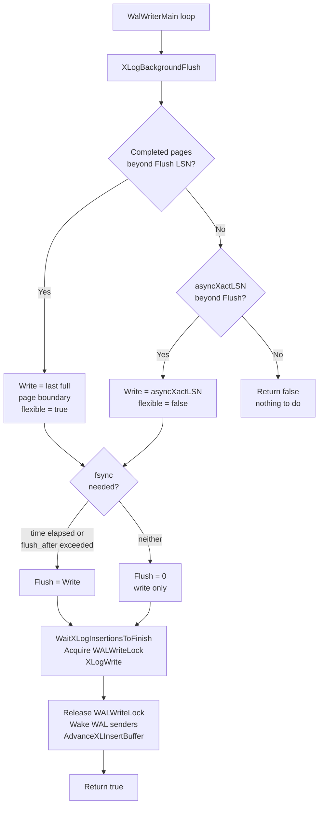

# WAL Writer

Every transaction that modifies data writes records to the Write-Ahead Log before those changes touch the heap. Those records land first in a shared in-memory ring buffer — the WAL buffers. They must eventually reach durable storage for crash recovery to work. The WAL writer is the background process solely responsible for draining that ring buffer periodically, so that ordinary committing backends do not have to pay the cost of an fsync on every single commit.

The WAL writer was introduced in PostgreSQL 8.3 to address a structural inefficiency: backends write WAL records into the shared buffer using per-insertion lightweight locks (`WALInsertLocks`), but flushing those records to disk requires acquiring the exclusive `WALWriteLock`. On a busy system, dozens of backends could all be racing to acquire that lock and issuing their own fsyncs. A dedicated background process amortizes this cost — one process acquires the lock, one fsync covers all the unflushed WAL, and every concurrent backend benefits.

The WAL writer is not an essential process: regular backends can still issue WAL writes and fsyncs themselves when the WAL writer doesn't keep up. This means it can shut down quickly when requested, unlike processes such as the checkpointer that must complete in-progress work before exiting.

## The synchronous_commit divide

The WAL writer's role differs sharply depending on how `synchronous_commit` is configured.

When `synchronous_commit` is `on` (the default), a committing backend calls `XLogFlush()` directly and blocks until the WAL containing its commit record is written and fsynced to disk. The WAL writer plays no role in that durability guarantee — the backend is its own guarantor.

When `synchronous_commit` is `off` or `local`, the backend does not flush. Instead, it calls `XLogSetAsyncXactLSN()` to record the LSN of its commit record in the shared variable `XLogCtlData.asyncXactLSN` (protected by `info_lck`), then returns to the caller immediately. The data is not yet durable. The WAL writer will flush it on its next cycle, which happens at most `wal_writer_delay` milliseconds later (default 200 ms). In the worst case, up to three cycles can pass before a given async commit is guaranteed durable. The comment in `XLogBackgroundFlush()` acknowledges this explicitly: when flushing only complete blocks, the write and flush can each be pushed back by one cycle. That three-cycle window is the durability risk the operator accepts by setting `synchronous_commit = off`.

There is one important override: even with `synchronous_commit = off`, if a transaction drops non-temporary relations, PostgreSQL forces a synchronous flush (`forceSyncCommit`). Dropping a file before the commit record is durable could delete data that crash recovery would need to reconstruct. Asynchronous commit is only safe when the transaction's effects are either temporary or purely in-place.

## WAL buffers and the flush watermarks

The WAL buffer pool (`wal_buffers`) is a fixed-size ring of 8 kB pages in shared memory, addressed through `XLogCtlData.pages`. Per-insertion lightweight locks (`WALInsertLocks`) coordinate insertion of WAL records into this ring. Writing from the ring to the OS page cache, and fsyncing to disk, requires the exclusive `WALWriteLock`.

Two LSN watermarks track progress:

| Field | Meaning |
|---|---|
| `LogwrtResult.Write` | Highest LSN written to the OS (but not necessarily fsynced) |
| `LogwrtResult.Flush` | Highest LSN confirmed durable on disk |

The WAL writer's job is to advance both. When it has nothing to flush (e.g., only partial blocks and no async commits), it can still advance `Write` without calling fsync — useful for freeing buffer slots so new insertions can proceed.

## What XLogBackgroundFlush actually does

`XLogBackgroundFlush()` (xlog.c) is the single function the WAL writer calls on every loop iteration. Its logic has three distinct stages: deciding what to write, deciding whether to fsync, and then performing the actual I/O.

**Deciding what to write.** The writer prefers to flush only complete 8 kB pages. Writing partial pages wastes I/O bandwidth, and the trailing partial page will be needed again when it fills. It backs off `LogwrtRqst.Write` to the last completed page boundary. If there is nothing complete to flush beyond what is already durable, it falls back to async commit records: it reads `asyncXactLSN` and sets `flexible = false`. This means the full async commit record must reach disk even if it sits in an incomplete page. If even `asyncXactLSN` is already flushed, the function returns `false` — nothing to do — and the hibernation counter advances.

**Deciding whether to fsync.** Writing and fsyncing are separated. The writer always writes to the OS when data is available. It calls fsync only when at least one of these conditions holds:

- `wal_writer_delay` milliseconds have elapsed since the last flush (time-based threshold), or
- the number of unflushed 8 kB blocks exceeds `wal_writer_flush_after` (byte-count threshold).

If neither condition is met, the writer sets `WriteRqst.Flush` to zero. `XLogWrite()` will then write but not fsync on this cycle. This distinction matters because a `write()` syscall is cheap compared to `fdatasync()`. On a busy system with a steady WAL stream, the block-count threshold triggers frequent, appropriately-sized fsyncs that keep latency low. On a quiet system, the time-based threshold ensures async commits still reach disk within the promised window even if the block threshold is never reached.

**The I/O itself.** Once the write request is determined, the writer calls `WaitXLogInsertionsToFinish()` to let any in-progress WAL insertions complete, then acquires `WALWriteLock` exclusively and calls `XLogWrite()`. After releasing the lock, it wakes up any WAL senders that may have been waiting. It also calls `AdvanceXLInsertBuffer()` to recycle no-longer-needed WAL buffer pages for future insertions, taking some buffer management work off the critical path of inserting backends.

## The wal_writer_delay and wal_writer_flush_after GUCs

`wal_writer_delay` (default 200 ms) sets the sleep time between WAL writer cycles. It directly determines the maximum time an async commit can remain unflushed: at most three cycles, or up to 600 ms in the absolute worst case with default settings. Lowering this value reduces async commit durability lag but increases wakeup overhead on an otherwise idle server.

`wal_writer_flush_after` (default 1 MB) sets a threshold, measured in WAL pages. Once unflushed WAL exceeds this threshold, the writer issues a flush even if `wal_writer_delay` has not yet elapsed. This prevents long gaps between fsyncs on a system writing WAL faster than one full `wal_writer_delay` interval would suggest. Without this threshold, a moderately busy system generating, say, 10 MB of WAL per second might go nearly 200 ms between fsyncs. This accumulates a large unflushed backlog. The backlog creates a latency spike when the flush finally occurs. Setting `wal_writer_flush_after = 0` disables the block-based threshold entirely, relying solely on the time-based one.

The interaction between these two GUCs and `commit_delay` is subtle. `commit_delay` applies only to the synchronous commit path: a backend that is about to acquire `WALWriteLock` will sleep `commit_delay` microseconds first. This happens only if at least `commit_siblings` other backends are active. This sleep gives late-arriving backends a chance to queue up and share the same fsync, a form of explicit group commit. The WAL writer's periodic flush provides the analogous batching for async commits without any deliberate delay. Backends simply do not wait at all; the WAL writer handles them in bulk on its next cycle.

## Group commit: sharing the fsync cost

When many backends commit nearly simultaneously under `synchronous_commit = on`, they all call `XLogFlush()` and compete for `WALWriteLock`. The first to acquire the lock performs the actual write and fsync. Others spin waiting, then re-check whether the record they needed is already flushed. If so, they return without doing any I/O themselves. One fsync serves all of them.

This batching is explicit in the lock-acquisition loop inside `XLogFlush()`: it uses `LWLockAcquireOrWait()` rather than a plain `LWLockAcquire()`, specifically to give the lock holder time to flush more data and cover more waiters.

The WAL writer does not participate in this synchronous path. Its contribution is the analogous batching for async commits: when many asynchronous transactions are in flight, a single WAL writer cycle flushes all of them at once. None of those backends waited at all.

## How WAL writer affects commit latency

On a busy OLTP system, WAL flush is frequently the dominant contributor to commit latency. The WAL writer reduces this in two ways.

First, it absorbs the background flush work so backends can return from commit without waiting for fsync at all (when using async commit). Second, even on the synchronous path, the WAL writer keeps the WAL buffers drained and the WAL write position close to the insert position. As a result, when a synchronous backend acquires `WALWriteLock`, it typically has less data to write before it can fsync. This keeps the critical section shorter.

A system where the WAL writer is not flushing fast enough will see backends beginning to issue their own fsyncs. This is visible in wait events: backends that would normally not show `WALWriteLock` waits will start appearing there. The WAL writer being unable to keep up is usually a symptom of I/O saturation rather than a problem with the WAL writer itself.

## Hibernation: conserving resources at idle

The WAL writer does not run at a fixed `wal_writer_delay` interval forever. After 50 consecutive cycles (`LOOPS_UNTIL_HIBERNATE`) in which `XLogBackgroundFlush()` found no useful work, the writer enters hibernation: it multiplies its sleep time by 25 (`HIBERNATE_FACTOR`), producing a maximum sleep of 5000 ms (200 ms × 25). This prevents the process from burning CPU and causing unnecessary kernel scheduling wakeups on an idle server.

To avoid missing async commits while hibernating, the writer publishes its sleep state in `XLogCtlData.WalWriterSleeping`. When a backend records an async commit LSN via `XLogSetAsyncXactLSN()`, it reads that flag under `info_lck`. If the writer is sleeping, the backend calls `SetLatch(ProcGlobal->walwriterLatch)` unconditionally to wake it. If the writer is not sleeping, the backend only signals it when at least a full page of WAL is waiting. There is no point interrupting an already-active writer for a partial page — that page will be handled on the next cycle.

The latch mechanism here is the standard PostgreSQL inter-process wakeup: the writer waits on `WaitLatch()` and backends set `ProcGlobal->walwriterLatch`. This costs nothing when the writer is already awake; the latch is pre-set and the wait returns immediately.

## Relationship to the checkpointer

The [[subsystems/wal/checkpoint]] also flushes WAL — specifically, it calls `XLogFlush()` at the end of each checkpoint to ensure all WAL up to the checkpoint record is durable before updating the control file. These two processes do not coordinate beyond sharing `WALWriteLock`. Checkpoint frequency and the volume of dirty shared buffers drive the checkpointer's flush, not `wal_writer_delay`.

The WAL writer's role is specifically the between-checkpoint window: ensuring WAL reaches disk continuously rather than in large bursts at checkpoint boundaries. A system without a WAL writer (or with a very slow one) would accumulate WAL in memory and then flush it all at checkpoint time, creating a periodic I/O spike. The WAL writer smooths this out by flushing small amounts frequently.

## Failure handling

If the WAL writer encounters an error — most commonly a write failure — it sleeps one second and retries. The error recovery path releases all [[subsystems/locking/lwlocks|LWLocks]] and resets the hibernation counter so the process re-advertises its state cleanly. The one-second sleep prevents the error log from being flooded by repeated failures.

If the WAL writer exits unexpectedly, the postmaster treats it the same as a backend crash: shared memory may be corrupted, so the postmaster kills surviving backends and begins crash recovery. This conservative treatment reflects that an unexpected exit almost certainly indicates a more serious problem than a routine write error.

## Configuration reference

| GUC | Default | Effect |
|---|---|---|
| `wal_writer_delay` | 200 ms | Maximum time between WAL writer cycles; upper bound on async commit durability lag (up to 3× in worst case) |
| `wal_writer_flush_after` | 1 MB | Flush immediately if this many bytes are written but not yet fsynced; 0 disables block-based triggering |
| `wal_buffers` | auto (~3% of `shared_buffers`) | Size of the in-memory WAL ring buffer |
| `synchronous_commit` | `on` | Whether backends flush WAL themselves or delegate to the WAL writer |
| `commit_delay` | 0 µs | Pre-flush sleep to accumulate group commit partners (synchronous path only) |
| `commit_siblings` | 5 | Minimum active backends required to activate `commit_delay` |

## See also

- [[subsystems/wal/overview]] — WAL structure, LSN mechanics, and the insert path
- [[subsystems/wal/checkpoint]] — the related process that drives checkpoint-end flushes
- [[subsystems/transactions/transaction-lifecycle]] — the commit path, `RecordTransactionCommit()`, and `synchronous_commit` semantics
- [[architecture/process-architecture]] — the layout of shared memory including WAL buffers
