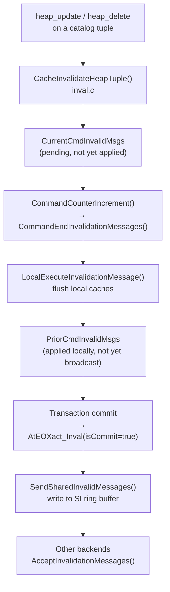

Catalog cache invalidation is the mechanism that keeps each backend's private [[subsystems/catalog/syscache|catalog caches]] consistent with committed DDL from other backends. Because every backend maintains independent catcache and relcache structures, PostgreSQL must propagate a change to a system catalog — say, adding a column via `ALTER TABLE` — to every backend that has cached data derived from that catalog. PostgreSQL achieves this without locks by queuing small `SharedInvalidationMessage` records into a shared-memory ring buffer and having each backend drain that buffer at well-defined points.

## The Deferred-Invalidation Invariant

The fundamental constraint is that a backend must not flush a cache entry while the tuple justifying the flush is still visible to that backend's current command. When `heap_update()` or `heap_delete()` modifies a catalog tuple, the old version remains valid until the next `CommandCounterIncrement()`. Flushing the cache entry immediately would leave the entry missing during the rest of the command. Or, if it got reloaded, it would pull in the old tuple again — the same data. The correct behaviour is to defer the flush.

`inval.c` therefore maintains per-transaction lists of pending invalidation events rather than acting on them immediately. `inval.c` stores each event as a `SharedInvalidationMessage` — the same wire format that will eventually be broadcast to other backends. It treats updates as a delete plus an insert; if the key columns are unchanged, `catcache.c`'s `PrepareToInvalidateCacheTuple()` collapses them into a single message.

## Message Types

The `SharedInvalidationMessage` union (`sinval.h`) carries a discriminator in its first byte and then one of several message subtypes:

| `id` value | Constant | Meaning |
|---|---|---|
| ≥ 0 | — | Catcache entry: specifies a cache ID and the 32-bit hash of the key. Zero means a whole-cache flush. |
| −1 | `SHAREDINVALCATALOG_ID` | All entries for a named catalog (used by `VACUUM FULL`/`CLUSTER`) |
| −2 | `SHAREDINVALRELCACHE_ID` | A specific relcache entry, or all relcache entries if `relId` is `InvalidOid` |
| −3 | `SHAREDINVALSMGR_ID` | An smgr file-descriptor entry (non-transactional, sent immediately) |
| −4 | `SHAREDINVALRELMAP_ID` | The relation-mapping file for a database (non-transactional) |
| −5 | `SHAREDINVALSNAPSHOT_ID` | Catalog snapshot for a relation that has no catcache coverage |

Catcache messages carry a hash value, not a TID. This means a flush survives `VACUUM FULL` moving tuples around, at the cost of occasional false positives when unrelated tuples share a hash bucket. Relcache messages carry an OID; `AddRelcacheInvalidationMessage()` deduplicates them at queue time since a relcache flush is comparatively expensive.

## The Pending-Message Stack

Each transaction level owns a `TransInvalidationInfo` struct allocated in `TopTransactionContext`. The struct contains two `InvalidationMsgsGroup` windows into two global arrays — one for catcache messages and one for relcache messages. The two-array layout exists precisely so that all catcache messages can be processed before any relcache messages: relcache construction reads catcache entries, so processing them in the wrong order would flush a catcache entry only to reload it moments later during a relcache rebuild (`inval.c`, comments).

Each `InvalidationMsgsGroup` tracks a `firstmsg` and `nextmsg` index pair, one per subarray. Appending a subtransaction's messages to its parent is therefore a simple index adjustment rather than a copy. The `CurrentCmdInvalidMsgs` slot holds events from the command in progress; `PriorCmdInvalidMsgs` holds events from earlier commands that have already been applied locally but not yet broadcast.

## Command Boundaries

`CommandCounterIncrement()` calls `CommandEndInvalidationMessages()`. It processes all messages in `CurrentCmdInvalidMsgs` through `LocalExecuteInvalidationMessage()` — flushing the local catcache and relcache — and then moves those messages into `PriorCmdInvalidMsgs`. At this point, the command's changes are visible to subsequent commands in the same transaction. The local caches reflect the new state.

For `wal_level=logical`, `CommandEndInvalidationMessages()` also calls `LogLogicalInvalidations()`, which writes a `XLOG_XACT_INVALIDATIONS` WAL record. Logical decoding replays these records to keep the decoder's catalog state consistent with the decoded transaction stream.

## Transaction Commit and Abort

At commit, `AtEOXact_Inval(true)` merges any remaining `CurrentCmdInvalidMsgs` into `PriorCmdInvalidMsgs` and passes the full set to `SendSharedInvalidMessages()` for broadcast. `AtEOXact_Inval()` thus writes to the SI queue only after the transaction's commit record is durable; other backends see the invalidations only after they can already read the new tuple versions.

At abort, `AtEOXact_Inval(false)` applies `PriorCmdInvalidMsgs` locally: the backend must flush whatever cache state it loaded from the (now-rolled-back) tuples it wrote during the transaction. `AtEOXact_Inval(false)` discards `CurrentCmdInvalidMsgs` without local processing because those changes never touched the local caches.

Subtransaction boundaries follow the same pattern via `AtEOSubXact_Inval()`. On subtransaction commit, pending messages bubble up to the parent's `PriorCmdInvalidMsgs`. On subtransaction abort, `AtEOSubXact_Inval()` applies the subtransaction's prior messages locally and frees the struct.

## Inplace Updates

A small set of catalog modifications — notably updates to `pg_class.relfrozenxid` and related fields during vacuum — use *inplace* updates: they modify a tuple in-place rather than producing a new version, bypassing the normal MVCC write path. These changes cannot wait until transaction commit because the transaction may remain open for a long time. Instead, `CacheInvalidateHeapTupleInplace()` populates a separate `inplaceInvalInfo` struct. `AtInplace_Inval()` then broadcasts the resulting messages inside the WAL insertion critical section. The `ForgetInplace_Inval()` path allows the caller to abandon a speculatively-queued inplace invalidation if the buffer lock turns out to be unavailable.

## Receiving Invalidations

`AcceptInvalidationMessages()` is the entry point for consuming incoming messages. It calls `ReceiveSharedInvalidMessages()` (`sinvaladt.c`), which walks the backend's read pointer forward through the ring buffer, dispatching each message to `LocalExecuteInvalidationMessage()`. That function routes by message type: catcache messages call `SysCacheInvalidate()` followed by `CallSyscacheCallbacks()`; relcache messages call `RelationCacheInvalidateEntry()` followed by relcache callbacks; smgr messages call `smgrcloserellocator()`; relmap messages call `RelationMapInvalidate()`.

If the ring buffer has overflowed — a backend fell so far behind that `SICleanupQueue()` set its reset flag — `ReceiveSharedInvalidMessages()` calls `InvalidateSystemCaches()` instead, which wipes all catcache and relcache state. This is a correctness fallback: a backend that missed messages cannot be trusted to have valid cached state.

## Registered Callbacks

Higher-level caches register callbacks here rather than open-coding their own invalidation logic. `CacheRegisterSyscacheCallback()` attaches a function to a specific catcache ID; `CacheRegisterRelcacheCallback()` attaches one to all relcache events. `inval.c` chains the syscache callbacks through a `syscache_callback_links[]` index array so that `CallSyscacheCallbacks()` can find all callbacks for a given cache ID without a linear scan of the entire list. `inval.c` supports up to 64 syscache callbacks and 10 relcache callbacks (hard limits).

`inval.c` invokes callbacks with a hash value of zero to signal a full cache reset (e.g., after queue overflow). Implementations must treat zero as "flush everything" rather than as a specific key match.

## Relcache Init File

If a relcache flush touches any relation whose descriptor is preloaded from the `pg_internal.init` file, `RegisterRelcacheInvalidation()` sets `RelcacheInitFileInval = true`. At commit, `AtEOXact_Inval()` then calls `RelationCacheInitFilePreInvalidate()` before sending SI messages and `RelationCacheInitFilePostInvalidate()` after. The pre/post split ensures the init file is deleted before other backends can see the invalidation. This prevents a race: a new backend could otherwise read a stale init file after the invalidation is broadcast but before the file is removed.

## Related Topics

- [[subsystems/catalog/syscache|Catalog Caches]] — the catcache and relcache structures that receive these invalidations
- [[subsystems/transactions/mvcc|MVCC]] — visibility rules explain why invalidation must be deferred to command boundaries
- [[subsystems/memory/resource-owner|ResourceOwner]] — tracks live catcache references that block immediate eviction of dead entries
