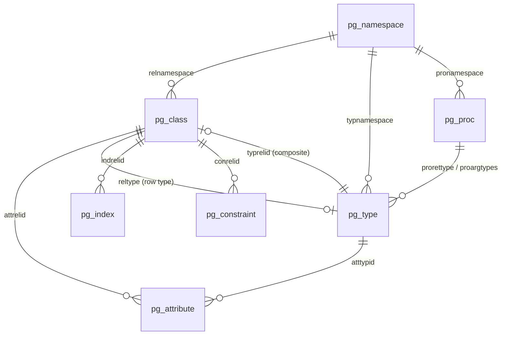
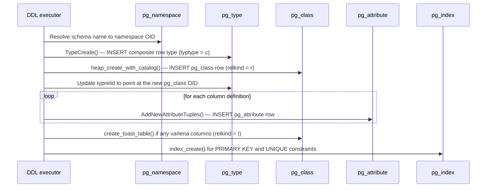
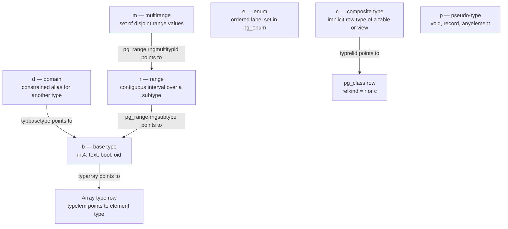
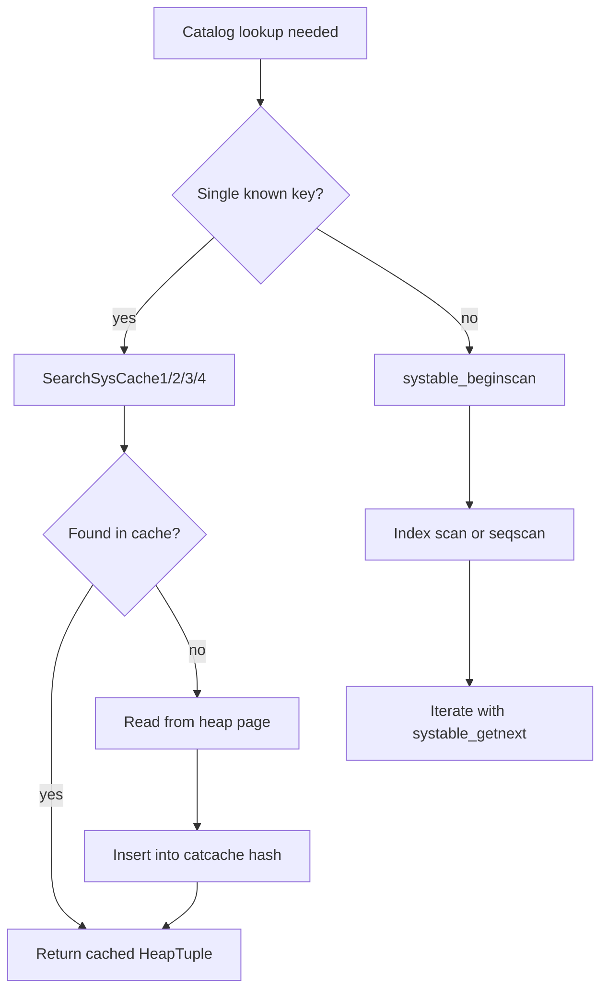
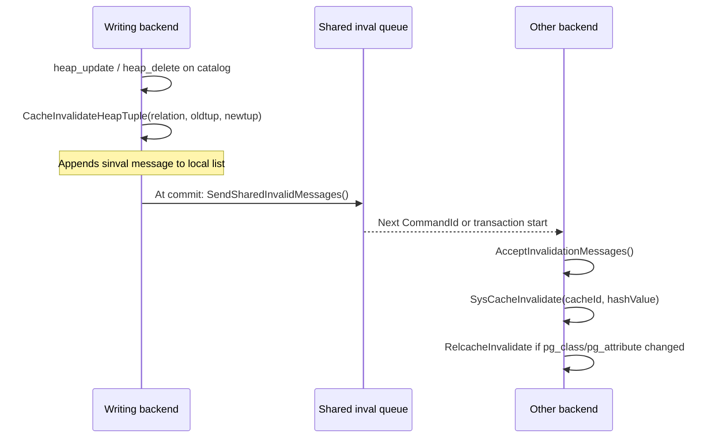

# Core System Catalogs: pg_class, pg_attribute, pg_type, pg_proc

PostgreSQL's catalog is a set of ordinary heap relations stored in `pg_catalog` schema. The four catalogs described here — `pg_class`, `pg_attribute`, `pg_type`, and `pg_proc` — form the load-bearing core: virtually every SQL operation requires at least one lookup into one of them. They are bootstrapped during `initdb` and are present before any user data exists.

All four are marked `BKI_BOOTSTRAP` in their catalog macro. This means the backend kit (`genbki.pl`) creates them during bootstrap, before the general heap machinery is fully operational. Their C struct definitions live in `src/include/catalog/` and are the authoritative schema; `Catalog.pm` reads these files at build time to generate `pg_*_d.h` constant headers and the BKI input file.

---

## Catalog Relationship Overview



The circular link between `pg_class` and `pg_type` is intentional. Every table has an implicit composite row type whose `pg_type` entry points back at the `pg_class` row (`typrelid`). In turn, the `pg_class` row points at that type (`reltype`).

The catalogs are written in a fixed order when `CREATE TABLE` executes:



---

## pg_class

**OID of relation in pg_class:** 1259 (`RelationRelationId`)  
**C type:** `FormData_pg_class` / `Form_pg_class`  
**Fixed-size part:** up to and including `relminmxid`; variable-length columns (`relacl`, `reloptions`, `relpartbound`) are not stored in the relcache's `rd_rel` field.

`pg_class` has one row for every named relation-like object. PostgreSQL uses the term "relation" broadly: tables, indexes, sequences, views, materialized views, composite types, [[subsystems/storage/toast|TOAST]] tables, foreign tables, and both partitioned tables and partitioned indexes all get rows here.

### Key columns

| Column | Type | Description |
|---|---|---|
| `oid` | `Oid` | Object identifier; primary key. |
| `relname` | `name` | Relation name (not qualified). |
| `relnamespace` | `Oid` | OID of the `pg_namespace` row for the containing schema. |
| `reltype` | `Oid` | OID of the implicit row type in `pg_type`; 0 for indexes and sequences. |
| `reloftype` | `Oid` | For typed tables (`CREATE TABLE OF type_name`), the composite type OID; otherwise 0. |
| `relowner` | `Oid` | Owner role OID (`pg_authid`). |
| `relam` | `Oid` | Access method OID (`pg_am`); heap for ordinary tables, the specific AM for indexes; 0 for relations without physical storage. |
| `relfilenode` | `Oid` | Physical file name component in the data directory. 0 means the relation is "mapped" — the actual file is tracked in `pg_filenode.map` via `relmapper.c`. |
| `reltablespace` | `Oid` | Tablespace OID (`pg_tablespace`); 0 means the database default. |
| `relpages` | `int32` | Last-known page count, set by VACUUM/ANALYZE. Not transactionally consistent; treat as a hint. |
| `reltuples` | `float4` | Estimated live row count; -1 means "never analyzed". |
| `relallvisible` | `int32` | Count of pages with all-visible bit set in the [[subsystems/storage/visibility-map|visibility map]]. |
| `reltoastrelid` | `Oid` | OID of the TOAST table (`pg_class`) for this relation; 0 if none. |
| `relhasindex` | `bool` | True if the relation has (or has had) any indexes. Set true when an index is created; never automatically reset to false. |
| `relisshared` | `bool` | True for catalogs shared across all databases (`pg_database`, `pg_authid`, etc.). |
| `relpersistence` | `char` | See persistence codes below. |
| `relkind` | `char` | See relation kind codes below. |
| `relnatts` | `int16` | Count of user-defined attributes (not system columns). Must equal the count of `pg_attribute` rows with `attnum > 0` for this relation. |
| `relchecks` | `int16` | Number of CHECK constraints; mirrors the count of rows in `pg_constraint` with `contype = 'c'` for this relation. |
| `relhasrules` | `bool` | True if the relation has (or has had) rewrite rules in `pg_rewrite`. |
| `relhastriggers` | `bool` | True if the relation has (or has had) triggers in `pg_trigger`. |
| `relhassubclass` | `bool` | True if any other relation inherits from this one. |
| `relrowsecurity` | `bool` | Row-level security is enabled (`ALTER TABLE ... ENABLE ROW LEVEL SECURITY`). |
| `relforcerowsecurity` | `bool` | RLS is enforced even for the table owner. |
| `relispopulated` | `bool` | For materialized views: true when the matview has been populated. Always true for other relation kinds. |
| `relreplident` | `char` | Replica identity strategy (`d`=default, `n`=nothing, `f`=full, `i`=index). |
| `relispartition` | `bool` | True if this is a partition of a partitioned table. |
| `relrewrite` | `Oid` | Non-zero during a table rewrite (e.g., `ALTER TABLE ... SET DATA TYPE`); links to the original relation's OID. Zero otherwise. |
| `relfrozenxid` | `TransactionId` | All XIDs below this value are frozen in this relation. Used by VACUUM to track anti-wraparound progress. |
| `relminmxid` | `TransactionId` | All MultiXact IDs in this relation are >= this value. Tracked analogously to `relfrozenxid` for multixact wraparound. |
| `relacl` | `aclitem[]` | Access control list (varlena, not in `rd_rel`). |
| `reloptions` | `text[]` | Storage options as `key=value` strings (varlena, not in `rd_rel`). |
| `relpartbound` | `pg_node_tree` | Partition bound expression, set for partitions (`relispartition = true`) (varlena, not in `rd_rel`). |

### relkind codes

| Code | Constant | Meaning |
|---|---|---|
| `r` | `RELKIND_RELATION` | Ordinary heap table. |
| `i` | `RELKIND_INDEX` | Secondary B-tree or other AM index. |
| `S` | `RELKIND_SEQUENCE` | Sequence object. |
| `t` | `RELKIND_TOASTVALUE` | TOAST table for out-of-line varlena storage. |
| `v` | `RELKIND_VIEW` | View (no physical storage). |
| `m` | `RELKIND_MATVIEW` | Materialized view (has physical storage). |
| `c` | `RELKIND_COMPOSITE_TYPE` | Composite type's synthetic pg_class row. |
| `f` | `RELKIND_FOREIGN_TABLE` | Foreign table via FDW. |
| `p` | `RELKIND_PARTITIONED_TABLE` | Partitioned table (no own storage). |
| `I` | `RELKIND_PARTITIONED_INDEX` | Partitioned index (no own storage). |

The macro `RELKIND_HAS_STORAGE(relkind)` returns true for `r`, `i`, `S`, `t`, `m`. `RELKIND_HAS_TABLE_AM(relkind)` returns true for `r`, `t`, `m` — these carry a `TableAmRoutine` pointer in `rd_tableam`.

### relpersistence codes

| Code | Constant | Meaning |
|---|---|---|
| `p` | `RELPERSISTENCE_PERMANENT` | Regular persistent relation, WAL-logged. |
| `u` | `RELPERSISTENCE_UNLOGGED` | Unlogged relation: persists across restarts but not crash-safe; `init` fork is used after crash recovery. |
| `t` | `RELPERSISTENCE_TEMP` | Temporary relation, session-scoped. |

### Indexes on pg_class

| Index | OID | Uniqueness | Columns |
|---|---|---|---|
| `pg_class_oid_index` | 2662 | unique (PK) | `oid` |
| `pg_class_relname_nsp_index` | 2663 | unique | `relname`, `relnamespace` |
| `pg_class_tblspc_relfilenode_index` | 3455 | non-unique | `reltablespace`, `relfilenode` |

These indexes back the syscache entries `RELOID` (lookup by OID) and `RELNAMENSP` (lookup by name + namespace).

---

## pg_attribute

**OID of relation in pg_class:** 1249 (`AttributeRelationId`)  
**C type:** `FormData_pg_attribute` / `Form_pg_attribute`  
**Fixed-size part:** up to and including `attcollation` (`ATTRIBUTE_FIXED_PART_SIZE`). The variable-length fields (`attacl`, `attoptions`, `attfdwoptions`, `attmissingval`) are only present in actual heap tuples, not in `TupleDesc` copies.

`pg_attribute` has one row for every attribute of every relation tracked in `pg_class`. This includes system columns (identified by negative `attnum`) and logically dropped columns (identified by `attisdropped = true`). For bootstrapped catalogs, `heap.c` synthesizes system columns instead of physically storing them in `pg_attribute` on disk.

The `TupleDesc` structure (the in-memory descriptor of a relation's columns) is essentially a cache of the fixed portion of each relation's `pg_attribute` rows, plus some extra bookkeeping.

### Key columns

| Column | Type | Description |
|---|---|---|
| `attrelid` | `Oid` | OID of the owning `pg_class` entry. |
| `attname` | `name` | Column name. |
| `atttypid` | `Oid` | OID of the data type in `pg_type`. Set to 0 for dropped columns (`attisdropped = true`). |
| `attlen` | `int16` | Copy of `typlen` from `pg_type`; kept here so the heap AM can compute tuple layout without joining to `pg_type`. |
| `attnum` | `int16` | Attribute number. User columns are 1..`relnatts`; system columns have negative values (e.g., `ctid` = -1). |
| `attcacheoff` | `int32` | Byte offset of the attribute within a heap tuple, cached in `TupleDesc` copies. Stored as -1 in the catalog itself; computed and stored in the in-memory copy by `fastgetattr()`. |
| `atttypmod` | `int32` | Type-specific modifier (e.g., `varchar(n)` stores `n+4` here). -1 means no modifier. |
| `attndims` | `int16` | Declared number of array dimensions. 0 for non-array types. |
| `attbyval` | `bool` | Copy of `typbyval` from `pg_type`. |
| `attalign` | `char` | Copy of `typalign` from `pg_type` (`c`/`s`/`i`/`d`). |
| `attstorage` | `char` | TOAST storage strategy for this column; may differ from the type's default. See TYPSTORAGE codes in pg_type. |
| `attcompression` | `char` | Compression method override: `'\0'` = use `default_toast_compression` GUC, `'p'` = pglz, `'l'` = LZ4. Ignored when `attstorage` does not permit compression. |
| `attnotnull` | `bool` | True if a NOT NULL constraint exists on this column. |
| `atthasdef` | `bool` | True if the column has a default value expression in `pg_attrdef`. |
| `atthasmissing` | `bool` | True if the column has a missing value (`attmissingval`) used for rows added before the column existed (fast `ALTER TABLE ADD COLUMN`). |
| `attidentity` | `char` | Identity column marker: `'\0'` = not identity, `'a'` = `ALWAYS`, `'d'` = `BY DEFAULT`. |
| `attgenerated` | `char` | Generated column marker: `'\0'` = not generated, `'s'` = `STORED`. |
| `attisdropped` | `bool` | True for logically deleted columns. The row stays in `pg_attribute` to preserve physical tuple layout. `atttypid` is set to 0. |
| `attislocal` | `bool` | True if the column was defined locally (not purely inherited). |
| `attinhcount` | `int16` | Number of direct parent relations from which the column is inherited. |
| `attstattarget` | `int16` | Statistics target for ANALYZE: -1 = use `default_statistics_target`, 0 = no stats collected. |
| `attcollation` | `Oid` | Collation OID (`pg_collation`); 0 for non-collatable types. |

### System attribute numbers

| attnum | Name | Meaning |
|---|---|---|
| -1 | `ctid` | Physical tuple ID (block, offset). |
| -2 | `xmin` | Inserting transaction ID. |
| -3 | `cmin` | Command ID within inserting transaction. |
| -4 | `xmax` | Deleting/locking transaction ID. |
| -5 | `cmax` | Command ID within deleting transaction. |
| -6 | `tableoid` | OID of the relation the row belongs to (useful with inheritance). |

### Indexes on pg_attribute

| Index | OID | Uniqueness | Columns |
|---|---|---|---|
| `pg_attribute_relid_attnam_index` | 2658 | unique | `attrelid`, `attname` |
| `pg_attribute_relid_attnum_index` | 2659 | unique (PK) | `attrelid`, `attnum` |

Syscache entries `ATTNAME` and `ATTNUM` correspond to these indexes.

---

## pg_type

**OID of relation in pg_class:** 1247 (`TypeRelationId`)  
**C type:** `FormData_pg_type` / `Form_pg_type`

`pg_type` has one row for every data type visible to the SQL layer. This includes base types, composite (row) types, domain types, enum types, range types, multirange types, array types, and pseudo-types (like `void`, `record`, `anyelement`). When PostgreSQL creates a table, it calls `TypeCreate()` first to create the composite row type, then `heap_create_with_catalog()` to create the `pg_class` row.

### Key columns

| Column | Type | Description |
|---|---|---|
| `oid` | `Oid` | Object identifier; primary key. |
| `typname` | `name` | Type name. |
| `typnamespace` | `Oid` | Containing namespace OID. |
| `typowner` | `Oid` | Owner role OID. |
| `typlen` | `int16` | Byte length for fixed-size types. -1 = varlena (has a length word). -2 = null-terminated C string. |
| `typbyval` | `bool` | If true, values are passed by value (fits in a `Datum`). Must be false for variable-length types. |
| `typtype` | `char` | Kind of type; see typtype codes below. |
| `typcategory` | `char` | Coercion category used by the parser; see typcategory codes below. |
| `typispreferred` | `bool` | True if this is the preferred type within its category for implicit coercion. |
| `typisdefined` | `bool` | False for forward-reference shell types (created by `CREATE TYPE name`); true after full definition. |
| `typdelim` | `char` | Delimiter character used between elements in array literals. Defaults to `,`. |
| `typrelid` | `Oid` | For composite types (`typtype = 'c'`): the OID of the `pg_class` row. Zero otherwise. |
| `typsubscript` | `regproc` | Subscript handler function. 0 = not subscriptable. Array types use `array_subscript_handler`. |
| `typelem` | `Oid` | If non-zero: the element type for array subscripting. A dependency edge implies physical containment. |
| `typarray` | `Oid` | OID of the "true" array type whose element is this type. Zero if no such array type exists. |
| `typinput` | `regproc` | Text-format input function (required). |
| `typoutput` | `regproc` | Text-format output function (required). |
| `typreceive` | `regproc` | Binary-format input function; 0 if none. |
| `typsend` | `regproc` | Binary-format output function; 0 if none. |
| `typmodin` | `regproc` | Type-modifier input function; 0 if none. |
| `typmodout` | `regproc` | Type-modifier output function; 0 if none. |
| `typanalyze` | `regproc` | Custom ANALYZE function; 0 = use the default. |
| `typalign` | `char` | Alignment requirement; see typalign codes below. |
| `typstorage` | `char` | TOAST strategy default for columns of this type; see typstorage codes below. |
| `typnotnull` | `bool` | Domain-level NOT NULL constraint. |
| `typbasetype` | `Oid` | For domains: the base type OID. Zero otherwise. |
| `typtypmod` | `int32` | For domains: the typmod to apply to the base type. -1 otherwise. |
| `typndims` | `int32` | For array domains: declared number of dimensions. Zero otherwise. |
| `typcollation` | `Oid` | Collation OID for collatable types; 0 if not collatable. |
| `typdefaultbin` | `pg_node_tree` | Default expression tree for domains (varlena). |
| `typdefault` | `text` | Human-readable default value string (varlena). |

### typtype codes

| Code | Constant | Meaning |
|---|---|---|
| `b` | `TYPTYPE_BASE` | Base scalar type (int4, text, etc.). |
| `c` | `TYPTYPE_COMPOSITE` | Composite type (table's implicit row type). |
| `d` | `TYPTYPE_DOMAIN` | Domain over another type. |
| `e` | `TYPTYPE_ENUM` | Enumerated type. |
| `m` | `TYPTYPE_MULTIRANGE` | Multirange type. |
| `p` | `TYPTYPE_PSEUDO` | Pseudo-type (void, record, anyelement, etc.). |
| `r` | `TYPTYPE_RANGE` | Range type. |



### typcategory codes (used by the parser for coercion resolution)

| Code | Constant | Examples |
|---|---|---|
| `A` | `TYPCATEGORY_ARRAY` | `int4[]`, `text[]` |
| `B` | `TYPCATEGORY_BOOLEAN` | `bool` |
| `C` | `TYPCATEGORY_COMPOSITE` | Row types |
| `D` | `TYPCATEGORY_DATETIME` | `date`, `timestamp` |
| `E` | `TYPCATEGORY_ENUM` | User-defined enums |
| `G` | `TYPCATEGORY_GEOMETRIC` | `point`, `polygon` |
| `I` | `TYPCATEGORY_NETWORK` | `inet`, `cidr` |
| `N` | `TYPCATEGORY_NUMERIC` | `int2`, `int4`, `numeric`, `float8` |
| `P` | `TYPCATEGORY_PSEUDOTYPE` | `void`, `record` |
| `R` | `TYPCATEGORY_RANGE` | `int4range`, user ranges |
| `S` | `TYPCATEGORY_STRING` | `text`, `varchar`, `char` |
| `T` | `TYPCATEGORY_TIMESPAN` | `interval` |
| `U` | `TYPCATEGORY_USER` | User-defined base types |
| `V` | `TYPCATEGORY_BITSTRING` | `bit`, `varbit` |
| `X` | `TYPCATEGORY_UNKNOWN` | `unknown` literal type |

### typalign and typstorage codes

| typalign code | Constant | Alignment |
|---|---|---|
| `c` | `TYPALIGN_CHAR` | No alignment (byte-addressable). |
| `s` | `TYPALIGN_SHORT` | 2-byte boundary. |
| `i` | `TYPALIGN_INT` | 4-byte boundary. |
| `d` | `TYPALIGN_DOUBLE` | 8-byte boundary on most platforms. |

| typstorage code | Constant | Meaning |
|---|---|---|
| `p` | `TYPSTORAGE_PLAIN` | Not toastable; always stored inline. |
| `e` | `TYPSTORAGE_EXTERNAL` | Toastable; store out-of-line, do not compress. |
| `x` | `TYPSTORAGE_EXTENDED` | Fully toastable; compress first, then move out-of-line. |
| `m` | `TYPSTORAGE_MAIN` | Like `x` but try to keep inline; moved out-of-line only as last resort. |

### Indexes on pg_type

| Index | OID | Uniqueness | Columns |
|---|---|---|---|
| `pg_type_oid_index` | 2703 | unique (PK) | `oid` |
| `pg_type_typname_nsp_index` | 2704 | unique | `typname`, `typnamespace` |

Syscache entries: `TYPEOID` (by OID), `TYPENAMENSP` (by name + namespace).

---

## pg_proc

**OID of relation in pg_class:** 1255 (`ProcedureRelationId`)  
**C type:** `FormData_pg_proc` / `Form_pg_proc`

`pg_proc` has one row per function, procedure, aggregate, or window function. All four kinds of callable object share this catalog; the `prokind` column differentiates them.

`proargtypes` (an `oidvector` of IN argument types) participates in the unique index used for overload resolution. Note that `proargtypes` excludes OUT parameters; `proallargtypes` (a nullable `Oid[]`) includes them.

### Key columns

| Column | Type | Description |
|---|---|---|
| `oid` | `Oid` | Object identifier; primary key. |
| `proname` | `name` | Function name. |
| `pronamespace` | `Oid` | Containing namespace OID. |
| `proowner` | `Oid` | Owner role OID. |
| `prolang` | `Oid` | Language OID (`pg_language`); e.g., `internal`, `plpgsql`, `sql`. |
| `procost` | `float4` | Estimated cost per invocation in units of `cpu_operator_cost`. Default 1 for built-ins, 100 for PL functions. |
| `prorows` | `float4` | Estimated rows returned per call for set-returning functions; 0 for non-SRF. |
| `provariadic` | `Oid` | Element type of a variadic argument. 0 if the function is not variadic. |
| `prosupport` | `regproc` | OID of a planner support function that can provide cost/selectivity estimates. 0 if none. |
| `prokind` | `char` | See prokind codes below. |
| `prosecdef` | `bool` | True for `SECURITY DEFINER` functions. |
| `proleakproof` | `bool` | True if the function is guaranteed not to leak data through side channels (required for use with row-level security). |
| `proisstrict` | `bool` | True if the function returns NULL whenever any argument is NULL (strict). |
| `proretset` | `bool` | True for set-returning functions (SRF). |
| `provolatile` | `char` | Volatility category; see provolatile codes below. |
| `proparallel` | `char` | Parallel safety; see proparallel codes below. |
| `pronargs` | `int16` | Total number of arguments (computed by `genbki.pl` from `pg_proc.dat`). |
| `pronargdefaults` | `int16` | Number of arguments that have default values. |
| `prorettype` | `Oid` | Return type OID. |
| `proargtypes` | `oidvector` | Ordered list of IN argument type OIDs. Participates in the uniqueness index. |
| `proallargtypes` | `Oid[]` | All argument type OIDs including OUT; NULL if the function has only IN arguments. (varlena) |
| `proargmodes` | `char[]` | Per-argument mode codes (`i`=IN, `o`=OUT, `b`=INOUT, `v`=VARIADIC, `t`=TABLE); NULL if all IN. (varlena) |
| `proargnames` | `text[]` | Per-argument names; NULL if all unnamed. (varlena) |
| `proargdefaults` | `pg_node_tree` | Expression trees for default values; one per defaultable argument, in order. (varlena) |
| `prosrc` | `text` | Source text of the function body or the internal function name for `language internal`. (varlena, NOT NULL) |
| `probin` | `text` | For `language c`: path to the shared library. NULL otherwise. (varlena) |
| `prosqlbody` | `pg_node_tree` | Pre-parsed SQL function body (PG 14+) for SQL-language functions; NULL if not used. (varlena) |
| `proconfig` | `text[]` | Session-level GUC overrides applied when the function runs (e.g., `search_path=...`). (varlena) |
| `proacl` | `aclitem[]` | Access privileges. (varlena) |

### prokind codes

| Code | Constant | Meaning |
|---|---|---|
| `f` | `PROKIND_FUNCTION` | Ordinary function. |
| `p` | `PROKIND_PROCEDURE` | Procedure (can use `CALL`, can do transaction control in PL). |
| `a` | `PROKIND_AGGREGATE` | Aggregate function; supplemental rows in `pg_aggregate`. |
| `w` | `PROKIND_WINDOW` | Window function; supplemental rows in `pg_window`. |

### provolatile codes

| Code | Constant | Meaning |
|---|---|---|
| `i` | `PROVOLATILE_IMMUTABLE` | Output depends only on inputs; may be constant-folded. |
| `s` | `PROVOLATILE_STABLE` | Output is consistent within a single query/scan; not folded but may be hoisted out of loops. |
| `v` | `PROVOLATILE_VOLATILE` | May return different values across calls; never optimized away. Functions with side effects (e.g., `setval`) must be volatile. |

### proparallel codes

| Code | Constant | Meaning |
|---|---|---|
| `s` | `PROPARALLEL_SAFE` | May run in parallel workers or the parallel leader. |
| `r` | `PROPARALLEL_RESTRICTED` | May run in the parallel leader but not in workers. |
| `u` | `PROPARALLEL_UNSAFE` | Forbidden during parallel execution. |

### Indexes on pg_proc

| Index | OID | Uniqueness | Columns |
|---|---|---|---|
| `pg_proc_oid_index` | 2690 | unique (PK) | `oid` |
| `pg_proc_proname_args_nsp_index` | 2691 | unique | `proname`, `proargtypes`, `pronamespace` |

Syscache entries: `PROCOID` (by OID), `PROCNAMEARGSNSP` (by name + argument types + namespace).

---

## Supporting Catalogs

### pg_namespace

**OID:** 2615 (`NamespaceRelationId`). One row per schema. Key columns: `oid`, `nspname`, `nspowner`, `nspacl[]`. Indexed by OID (`NAMESPACEOID`) and by name (`NAMESPACENAME`). All namespace-qualified object lookups start with `SearchSysCache1(NAMESPACEOID, ...)` or `SearchSysCache1(NAMESPACENAME, ...)`.

### pg_index

**OID:** 2610 (`IndexRelationId`). One row per index, augmenting the `pg_class` row for the index with structural metadata. Key columns: `indexrelid` (FK to `pg_class`), `indrelid` (FK to `pg_class` for the indexed table), `indnatts`, `indnkeyatts`, `indisunique`, `indisprimary`, `indisvalid`, `indisready`, `indislive`, `indkey` (int2vector of attribute numbers, 0 = expression), `indexprs` (expression trees for expression index columns), `indpred` (partial index predicate). The `relcache` loader reads `pg_index` to populate `rd_index` and the index list (`rd_indexlist`).

### pg_constraint

**OID:** 2606 (`ConstraintRelationId`). One row per constraint. Key columns: `oid`, `conname`, `connamespace`, `contype` (`c`=CHECK, `f`=FK, `p`=PRIMARY KEY, `u`=UNIQUE, `t`=trigger, `x`=exclusion), `conrelid` (table), `contypid` (domain), `conindid` (supporting index), `conkey[]` (attribute numbers), `confrelid` + `confkey[]` + action codes for FK constraints, `conbin` (CHECK expression tree). A unique index on `(conrelid, contypid, conname)` enforces name uniqueness per relation or domain.

---

## Catalog Access Patterns

### Syscache lookups

The syscache (`src/backend/utils/cache/syscache.c`) is a per-backend hash table of recently-accessed catalog tuples. It is the preferred access path whenever you know the exact key for a single row.

```c
/* Look up a function by OID */
HeapTuple proctup = SearchSysCache1(PROCOID, ObjectIdGetDatum(funcOid));
if (!HeapTupleIsValid(proctup))
    elog(ERROR, "cache lookup failed for function %u", funcOid);
Form_pg_proc proc = (Form_pg_proc) GETSTRUCT(proctup);
/* ... use proc->provolatile, etc. ... */
ReleaseSysCache(proctup);

/* Look up a type by name + namespace */
HeapTuple typtup = SearchSysCache2(TYPENAMENSP,
                                   CStringGetDatum(typname),
                                   ObjectIdGetDatum(nsOid));
```

The key syscache identifiers for the four core catalogs are:

| Catalog | Cache ID (by OID) | Cache ID (by name) |
|---|---|---|
| `pg_class` | `RELOID` | `RELNAMENSP` |
| `pg_attribute` | `ATTNUM` | `ATTNAME` |
| `pg_type` | `TYPEOID` | `TYPENAMENSP` |
| `pg_proc` | `PROCOID` | `PROCNAMEARGSNSP` |

Callers must use `SysCacheGetAttr()` for variable-length attributes not included in the fixed C struct:

```c
bool isnull;
Datum prosrc = SysCacheGetAttr(PROCOID, proctup, Anum_pg_proc_prosrc, &isnull);
```

`SearchSysCacheCopy1()` returns a palloc'd copy of the tuple that the caller can modify; the caller must never modify the original cached tuple.

### Heap scans (systable_beginscan)

For queries that cannot be answered by a point lookup — for example, "all indexes on relation R" or "all columns of relation R" — code uses `systable_beginscan()` from `src/include/access/genam.h`:

```c
Relation rel = table_open(AttributeRelationId, AccessShareLock);
ScanKeyInit(&skey, Anum_pg_attribute_attrelid,
            BTEqualStrategyNumber, F_OIDEQ,
            ObjectIdGetDatum(relOid));
SysScanDesc scan = systable_beginscan(rel, AttributeRelidNumIndexId,
                                      true, NULL, 1, &skey);
while (HeapTupleIsValid(tup = systable_getnext(scan)))
{
    Form_pg_attribute attr = (Form_pg_attribute) GETSTRUCT(tup);
    if (attr->attisdropped) continue;
    /* process column */
}
systable_endscan(scan);
table_close(rel, AccessShareLock);
```

`systable_beginscan` uses an index if one is specified and available; it falls back to a sequential scan when the index is not yet built (relevant during bootstrap). During bootstrap, all catalog access goes through heap scans because the syscache is not yet initialized.



---

## OID Assignment

Every catalog row has an `oid` column. `GetNewOidWithIndex()` (declared in `src/include/catalog/catalog.h`) assigns new OIDs for non-bootstrap rows:

```c
Oid newoid = GetNewOidWithIndex(relation, oidIndexId, Anum_pg_class_oid);
```

The function generates a candidate OID, checks the index to detect collisions, and retries until a unique value is found. The caller stores the newly assigned OID in the heap tuple before insertion; `CatalogTupleInsert()` (in `src/include/catalog/indexing.h`) then inserts the tuple and maintains all catalog indexes atomically.

The catalog data files and header constants hardcode bootstrap OIDs (those assigned at `initdb` time). They are all below `FirstNormalObjectId` (defined as 16384 in `src/include/access/transam.h`). The system assigns OIDs >= 16384 at runtime. Code that needs to distinguish bootstrap from user-created objects uses:

```c
if (oid < FirstNormalObjectId)
    /* This is a pinned system object */
```

---

## Catalog Invalidation

Any backend that modifies a catalog row must invalidate caches in all other backends. The mechanism is shared invalidation messages (sinval).



Key functions in `src/include/utils/inval.h`:

- `CacheInvalidateHeapTuple(relation, oldtup, newtup)` — called by heap DML functions; enqueues an invalidation message for the modified tuple.
- `CacheInvalidateCatalog(catalogId)` — forces invalidation of all cached entries for a given catalog OID.
- `CacheInvalidateRelcache(relation)` — specifically invalidates the relcache entry for `relation`.
- `InvalidateSystemCaches()` — unconditionally flushes all syscache and relcache entries in the current backend; used after a transaction abort.

`AcceptInvalidationMessages()` processes invalidation messages at the start of each command and at transaction boundaries. A backend never acts on another backend's invalidation synchronously mid-command; it only sees the updated catalog view at the next safe point. This means catalog changes from a concurrent committed transaction become visible to the current backend at the next command boundary.

---

## Catalog Bootstrap and Relation Mapping

Several core catalogs (`pg_class`, `pg_attribute`, `pg_type`, `pg_proc`, and a handful of others) have `relfilenode = 0` in `pg_class`. This means they are "mapped" relations: `relmapper.c` stores the file node in a per-database `pg_filenode.map` binary file rather than in `pg_class` itself. This breaks the chicken-and-egg problem of locating `pg_class` without first reading `pg_class`.

All other relations store their `relfilenode` directly in `pg_class.relfilenode`. PostgreSQL can open them by looking up that column.

---

## See also

- [[subsystems/catalog/syscache]]
- [[subsystems/catalog/relcache]]
- [[architecture/overview]]
- [[subsystems/storage/table-am]]
- [[subsystems/transactions/transaction-lifecycle]]
